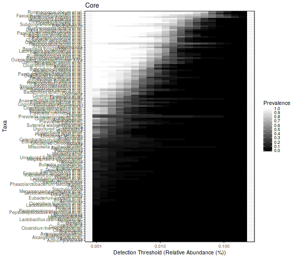
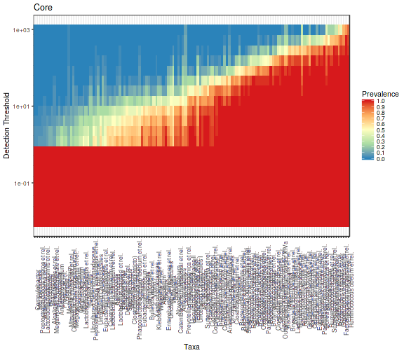

<!--
  %\VignetteEngine{knitr::rmarkdown}
  %\VignetteIndexEntry{microbiome tutorial - core}
  %\usepackage[utf8]{inputenc}
  %\VignetteEncoding{UTF-8}  
-->

## Core microbiota analysis

See also related functions for the analysis of rare taxa.

Load example data:


```r
# Load data
library(microbiome)
data(peerj32)

# Rename the data
pseq <- peerj32$phyloseq

# Calculate compositional version of the data
# (relative abundances)
pseq.rel <- transform(pseq, "compositional")
```


### Prevalence of taxonomic groups

Relative population frequencies; at 1% compositional abundance threshold:


```r
head(prevalence(pseq.rel, detection = 1, sort = TRUE))
```

```
##  Yersinia et rel.  Xanthomonadaceae  Wissella et rel.            Vibrio 
##                 0                 0                 0                 0 
## Weissella et rel.       Veillonella 
##                 0                 0
```


Absolute population frequencies (sample count):


```r
head(prevalence(pseq.rel, detection = 1, sort = TRUE, count = TRUE))
```

```
##  Yersinia et rel.  Xanthomonadaceae  Wissella et rel.            Vibrio 
##                 0                 0                 0                 0 
## Weissella et rel.       Veillonella 
##                 0                 0
```


### Core microbiota analysis

If you only need the names of the core taxa, do as follows. The standard method corresponds to taxa that exceed the given prevalence and detection thresholds. The bootstrap method is slower but more robust ([Salonen et al. CMI (2012)](http://onlinelibrary.wiley.com/doi/10.1111/j.1469-0691.2012.03855.x/abstract)); it reduces random sampling effects. 


```r
# Standard method (based on simple detection and prevalence thresholding)
core.taxa.standard <- core_members(pseq.rel, detection = 5, prevalence = 50,  method = "standard")

# Bootrap method: slower but more robust; takes sampling effects into account
core.taxa.bootstrap <- core_members(pseq.rel, detection = 5, prevalence = 50,  method = "bootstrap", bs.iter = 50)
```


A full phyloseq object of the core microbiota is obtained as follows:


```r
pseq.core <- core(pseq.rel, detection = 0, prevalence = .5)
pseq.core.bootstrap <- core(pseq.rel, detection = 0, prevalence = .5, method = "bootstrap", bs.iter = 50)
```


Retrieving the associated taxa names from the phyloseq object:


```r
core.taxa <- taxa(pseq.core)
```


### Core abundance and diversity

Total core abundance in each sample (sum of abundances of the core members):


```r
core.abundance <- sample_sums(core(pseq.rel, detection = .01, prevalence = .95))
```


## Core visualization

### Core line plots

Determine core microbiota across various abundance/prevalence
thresholds with the blanket analysis [(Salonen et al. CMI, 2012)](http://onlinelibrary.wiley.com/doi/10.1111/j.1469-0691.2012.03855.x/abstract) based on various signal and prevalences.


```r
# With absolute read counts
det <- c(0, 1, 2, 5, 10, 20, 50, 100, 200, 500, 1000, 2000)
prevalences <- seq(.05, 1, .05)
p <- plot_core(pseq, prevalences = prevalences, detections = det, plot.type = "lineplot")
p + xlab("Abundance (OTU read count)")

# With compositional (relative) abundances
det <- c(0, 0.1, 0.2, 0.5, 1, 2, 5, 10, 20)/100
p <- plot_core(pseq.rel, prevalences = prevalences, detections = det, plot.type = "lineplot")
p + xlab("Relative Abundance (%)")
```


### Core heatmaps

This visualization method has been used for instance in [Intestinal microbiome landscaping: Insight in community assemblage and implications for microbial modulation strategies](https://academic.oup.com/femsre/article/doi/10.1093/femsre/fuw045/2979411/Intestinal-microbiome-landscaping-insight-in#58802539). Shetty et al. _FEMS Microbiology Reviews_ fuw045, 2017.


```r
# Core with compositionals:
prevalences <- seq(.05, 1, .05)
detections <- 10^seq(log10(1e-3), log10(.2), length = 20)

# Also define gray color palette
gray <- gray(seq(0,1,length=5))
p <- plot_core(pseq.rel, plot.type = "heatmap", colours = gray,
    prevalences = prevalences, detections = detections) +
    xlab("Detection Threshold (Relative Abundance (%))")
print(p)    

# Core with absolute counts and horizontal view:
# and minimum population prevalence (given as percentage)
detections <- 10^seq(log10(.01), log10(max(abundances(pseq))/10), length = 20)

library(RColorBrewer)
plot_core(pseq, plot.type = "heatmap", 
       		 prevalences = prevalences,
       		 detections = detections,
		 colours = rev(brewer.pal(5, "Spectral")),
		 min.prevalence = .2, horizontal = TRUE)
```




