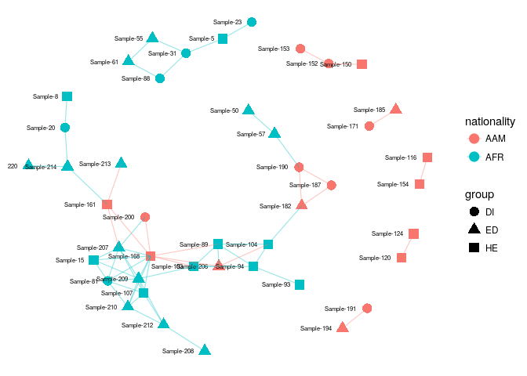

<!--
  %\VignetteEngine{knitr::rmarkdown}
  %\VignetteIndexEntry{microbiome tutorial - networks}
  %\usepackage[utf8]{inputenc}
  %\VignetteEncoding{UTF-8}  
-->
Networks
--------

See also the [phyloseq
tutorial](http://joey711.github.io/phyloseq/plot_network-examples)

Load example data:

    library(microbiome)
    data(dietswap)
    pseq <- dietswap

### Sample similarities

Connect samples with sufficiently similar microbiota composition, and
highlight sample groups:

    ig <- make_network(pseq, max.dist = 0.2)
    p <- plot_network(ig, pseq, color = "nationality", shape = "group",
             line_weight = 0.4, label = "sample")
    print(p)         

Another example:

    theme_set(theme_bw(30))
    p <- plot_net(pseq, maxdist = 0.2,
           point_label = "group", color = "nationality") +
           scale_colour_brewer(palette = "Accent")
    print(p)         

### Taxonomic network reconstruction

The widely reported compositionality bias in similarity measures can be
fixed with SpiecEasi or SparCC; the implementations are available via
the [SpiecEasi package](https://github.com/zdk123/SpiecEasi). Note that
the execution is slow.

    library(SpiecEasi) #install_github("zdk123/SpiecEasi")
    library(phyloseq)

    otu <- t(abundances(pseq))

    # SPIEC-EASI network reconstruction
    # In practice, use more repetitions
    net <- spiec.easi(otu, method='mb', lambda.min.ratio=1e-2, 
                      nlambda=20, icov.select.params=list(rep.num=20))

    ## Create graph object
    n <- net$refit
    colnames(n) <- rownames(n) <- colnames(otu)

    # Network format
    library(network)
    netw <- network(as.matrix(n), directed = FALSE)

    # igraph format
    library(igraph)
    ig <- graph.adjacency(n, mode='undirected', add.rownames = TRUE)

    ## set size of vertex to log2 mean abundance 
    vsize <- log2(apply(otu, 2, mean))

    # Network layout
    coord <- layout.fruchterman.reingold(ig)

    # Visualize the network
    print(plot(ig, layout = coord, vertex.size = vsize, vertex.label = names(vsize)))

    ## NULL

You could investigate degree distribution with the following:

    dd <- degree.distribution(ig)
    plot(0:(length(dd)-1), dd, ylim=c(0,.35), type='b', 
          ylab="Frequency", xlab="Degree", main="Degree Distributions")

Visualize the network with [ggnet2](https://briatte.github.io/ggnet):

    library(GGally)
    library(ggnet)
    library(network)
    library(sna)
    library(ggplot2)
    library(intergraph) # ggnet2 works also with igraph with this

    phyla <- map_levels(colnames(otu), from = "Genus", to = "Phylum",
               tax_table(pseq))
    netw %v% "Phylum" <- phyla
    p <- ggnet2(netw, color = "Phylum", label = TRUE, label.size = 2)
    print(p)

