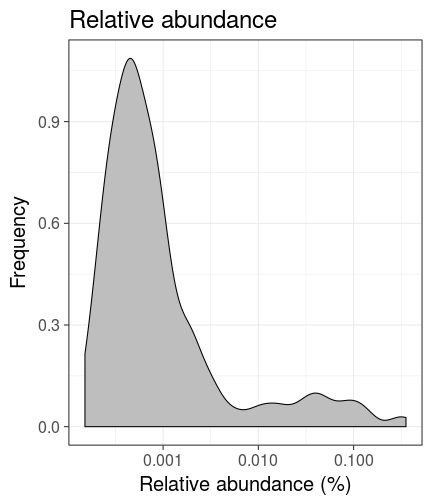
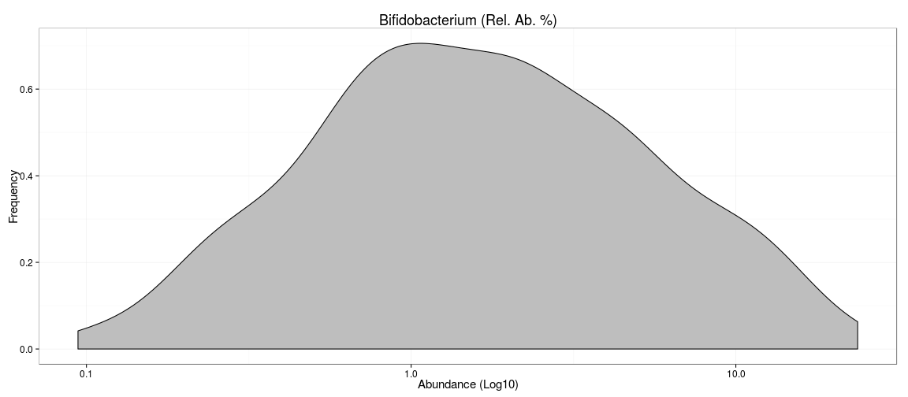

<!--
  %\VignetteEngine{knitr::rmarkdown}
  %\VignetteIndexEntry{HITChip Atlas examples}
  %\usepackage[utf8]{inputenc}
-->


HITChip Atlas examples
===========

This tutorial provides step-by-step examples on exploratory analysis
of large-scale population-level microbiota profiling data.


### Install the experimental tools in R


```r
install.packages("devtools")
library(devtools)
install_github("microbiome/microbiome")
```

### Loading the package


```r
library(microbiome)  
```


### HITChip Atlas data set

An example data set from [Lahti et al. Nat. Comm. 5:4344, 2014](http://www.nature.com/ncomms/2014/140708/ncomms5344/full/ncomms5344.html) contains large-scale profiling of 130 genus-like taxa across 1006 normal western subjects. This data set is readily available for download from the open [Data Dryad](http://doi.org/10.5061/dryad.pk75d) repository.


Load the HITChip Atlas microbiome profiling data in R.


```r
# Load Dryad tools
library("rdryad") # Use the install.packages("rdryad") if package not available

# Define the data URL
url <- download_url('10255/dryad.64665')

# Download the data
data <- read.table(url, sep = "\t", row.names = 1, header = TRUE)

# Fix some broken names from the original release..
# ie. replace 'Clostridium..sensu.stricto.les' with 'Clostridiales'
colnames(data) <- gsub("Clostridium..sensu.stricto.les", "Clostridiales", colnames(data))
```

Load the HITChip Atlas metadata in R. Note that some individuals have
multiple time points.


```r
url <- download_url('10255/dryad.64666')
meta <- read.table(url, sep = "\t", row.names = 1, header = TRUE)

# Add SampleIDs as a separate column from rownames
meta$SampleID <- rownames(meta)
```

### Abundance histograms


```r
# Load tools
library(dplyr)

# Pick 
# 1. All samples (all time points and DNA extraction methods)
# 2. Samples at time point 0 that have specific DNA extraction method 
all.samples <- meta$SampleID
rbb.samples <- filter(meta, Time == "0" & DNA_extraction_method == "r")$SampleID

# Visualize
tax <- "Prevotella.melaninogenica.et.rel."
d <- data[all.samples, tax]
plot(density(d), main = paste(tax, "(Abs.; all samples)"))
plot(density(log10(d)), main = paste(tax, "(Log10: all samples)"))

d <- data[rbb.samples, tax]
plot(density(d), main = paste(tax, "(Abs.; RBB samples)"))
plot(density(log10(d)), main = paste(tax, "(Log10: RBB samples)"))
```

    


### Licensing and Citations

This work can be freely used, modified and distributed under the 
[Two-clause FreeBSD license](http://en.wikipedia.org/wiki/BSD\_licenses).

Kindly cite the work as 'Leo Lahti and Gerben Hermes
(2015). HITChip Atlas tutorial. URL: http://microbiome.github.com'.


### Session info

This vignette was created with


```r
sessionInfo()
```

```
## R version 3.1.2 (2014-10-31)
## Platform: x86_64-pc-linux-gnu (64-bit)
## 
## locale:
##  [1] LC_CTYPE=en_US.UTF-8       LC_NUMERIC=C              
##  [3] LC_TIME=en_US.UTF-8        LC_COLLATE=en_US.UTF-8    
##  [5] LC_MONETARY=en_US.UTF-8    LC_MESSAGES=en_US.UTF-8   
##  [7] LC_PAPER=en_US.UTF-8       LC_NAME=C                 
##  [9] LC_ADDRESS=C               LC_TELEPHONE=C            
## [11] LC_MEASUREMENT=en_US.UTF-8 LC_IDENTIFICATION=C       
## 
## attached base packages:
## [1] stats     graphics  grDevices utils     datasets  methods   base     
## 
## other attached packages:
## [1] dplyr_0.3.0.2      rdryad_0.1.1       microbiome_0.99.34
## [4] reshape_0.8.5      vegan_2.0-10       lattice_0.20-29   
## [7] permute_0.8-3      e1071_1.6-4        knitr_1.8         
## 
## loaded via a namespace (and not attached):
##  [1] acepack_1.3-3.3     ape_3.1-4           assertthat_0.1     
##  [4] class_7.3-11        cluster_1.15.3      codetools_0.2-9    
##  [7] colorspace_1.2-4    DBI_0.3.1           df2json_0.0.2      
## [10] digest_0.6.4        doParallel_1.0.8    dynamicTreeCut_1.62
## [13] evaluate_0.5.5      fastcluster_1.1.13  flashClust_1.01-2  
## [16] foreach_1.4.2       foreign_0.8-61      formatR_1.0        
## [19] Formula_1.1-2       gdata_2.13.3        ggplot2_1.0.0      
## [22] grid_3.1.2          gtable_0.1.2        gtools_3.4.1       
## [25] Hmisc_3.14-5        igraph_0.7.1        impute_1.38.1      
## [28] iterators_1.0.7     latticeExtra_0.6-26 lazyeval_0.1.9     
## [31] magrittr_1.0.1      MASS_7.3-35         matrixStats_0.10.3 
## [34] mixOmics_5.0-3      munsell_0.4.2       nlme_3.1-118       
## [37] nnet_7.3-8          OAIHarvester_0.1-7  parallel_3.1.2     
## [40] pheatmap_0.7.7      plyr_1.8.1          proto_0.3-10       
## [43] RColorBrewer_1.0-5  Rcpp_0.11.3         RCurl_1.95-4.3     
## [46] reshape2_1.4        RGCCA_2.0           rgl_0.95.1158      
## [49] rjson_0.2.15        RJSONIO_1.3-0       R.methodsS3_1.6.1  
## [52] rpart_4.1-8         scales_0.2.4        splines_3.1.2      
## [55] stringr_0.6.2       survival_2.37-7     tools_3.1.2        
## [58] WGCNA_1.41-1        XML_3.98-1.1
```


