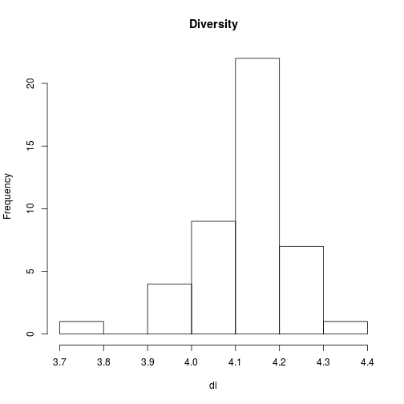
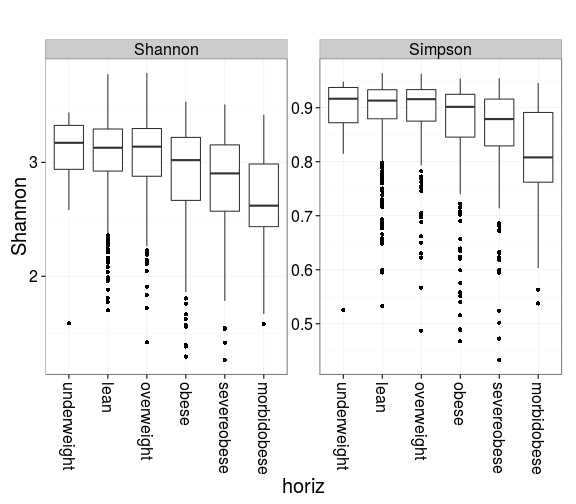
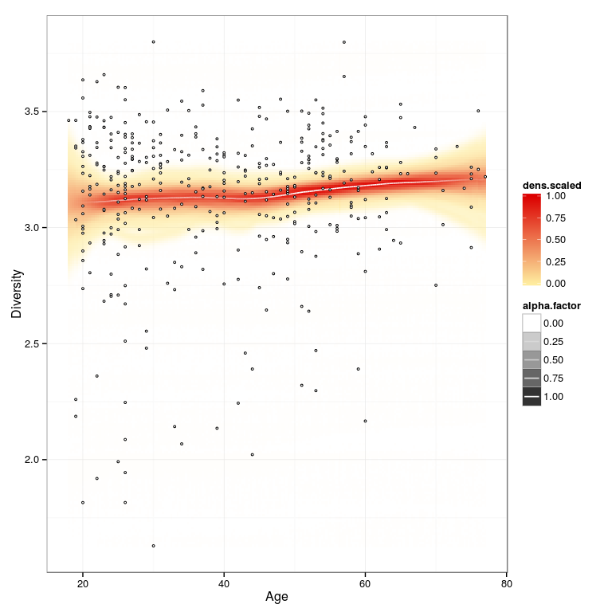

<!--
  %\VignetteEngine{knitr::rmarkdown}
  %\VignetteIndexEntry{Project Template}
  %\usepackage[utf8]{inputenc}
-->


Example workflow
----------------

This reproducible document investigates an example data set from [Lahti et al. Nat. Comm. 5:4344, 2014](http://www.nature.com/ncomms/2014/140708/ncomms5344/full/ncomms5344.html) that contains large-scale profiling of 130 genus-like taxa across 1006 normal western subjects. This data set is available for download from the open [Data Dryad](http://doi.org/10.5061/dryad.pk75d) repository.

To reproduce this analysis, you can download the [source file](Atlas.Rmd) and render it in R with:

``` {.r}
library(rmarkdown)
rmarkdown::render("Atlas.Rmd")
```

### Download HITChip Atlas data

Load the HITChip Atlas microbiome profiling data in R.

``` {.r}
# Load Dryad tools
library("rdryad") # Use the install.packages("rdryad") if package not available

# Define the data URL
url <- download_url('10255/dryad.64665')

# Download the data
data <- read.table(url, sep = "\t", row.names = 1, header = TRUE)

# Fix some broken names from the original release..
# ie. replace 'Clostridium..sensu.stricto.les' with 'Clostridiales'
colnames(data) <- gsub("Clostridium..sensu.stricto.les", "Clostridiales", colnames(data))

# Convert to matrix 
data <- as.matrix(data)
```

Load the HITChip Atlas metadata in R. Note that some individuals have multiple time points.

``` {.r}
url <- download_url('10255/dryad.64666')
meta <- read.table(url, sep = "\t", row.names = 1, header = TRUE)

# Add SampleIDs as a separate column from rownames
meta$SampleID <- rownames(meta)

# Order BMI groups in correct order
# (see README at http://datadryad.org/resource/doi:10.5061/dryad.pk75d for details)
meta$BMI_group <- factor(meta$BMI_group, levels = c("underweight", "lean", "overweight", "obese", "severeobese", "morbidobese"))
meta$SubjectID <- factor(meta$SubjectID)
```

Collect the atlas data and metadata into a single object:

``` {.r}
atlas <- list(microbes = data, meta = meta)
```

### Diversity

``` {.r}
# Diversity using the vegan package
# NOTE: data needs to be in absolute scale, not logarithmic
di <- vegan::diversity(atlas$microbes, index = "shannon")
hist(di, main = "Diversity")
```



### Compare with known background factors

Diversity vs. obesity

``` {.r}
par(mar = c(6, 4, 3, 1))
bmi <- atlas$meta$BMI_group
di <- vegan::diversity(atlas$microbes)
boxplot(di ~ bmi, las = 2, main = "Microbiota diversity vs. obesity")
```



Diversity vs. age with smoothed confidence intervals:

``` {.r}
library(microbiome)
library(sorvi)
library(dplyr)

# Pick the subset of RBB-preprocessed samples from time point 0
rbb.samples <- filter(atlas$meta, Time == 0 & DNA_extraction_method == "r")$SampleID

# Collect variables into a data frame
df <- data.frame(Age = atlas$meta[rbb.samples, "Age"], Diversity = di[rbb.samples])

# Visualize
p <- sorvi::regression_plot(Diversity~Age, df, shade = TRUE, mweight = TRUE, verbose = FALSE)
print(p)
```


