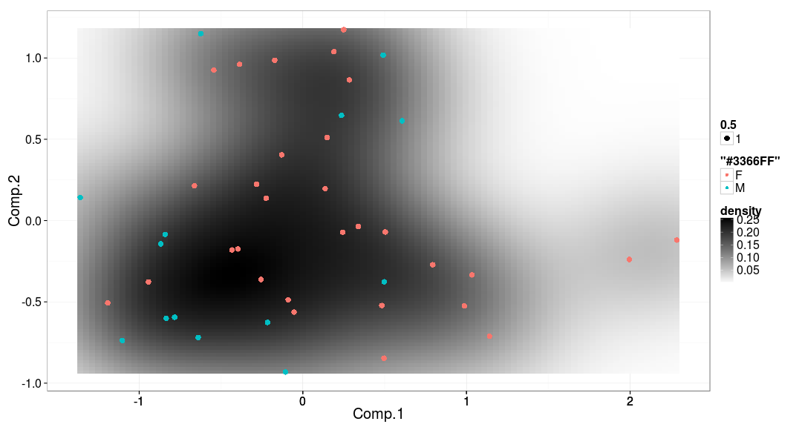

<!--
  %\VignetteEngine{knitr::rmarkdown}
  %\VignetteIndexEntry{HITChip Atlas examples}
  %\usepackage[utf8]{inputenc}
-->


HITChip Atlas examples
===========

This tutorial provides step-by-step examples on exploratory analysis
of large-scale population-level microbiota profiling data.


### Install the experimental tools in R


```r
install.packages("devtools")
library(devtools)
install_github("microbiome/microbiome")
```

### Loading the package


```r
library(microbiome)  
```

### HITChip Atlas data set

An example data set from [Lahti et al. Nat. Comm. 5:4344, 2014](http://www.nature.com/ncomms/2014/140708/ncomms5344/full/ncomms5344.html) contains large-scale profiling of 130 genus-like taxa across 1006 normal western subjects. This data set is readily available for download from the open [Data Dryad](http://doi.org/10.5061/dryad.pk75d) repository.

Load the HITChip Atlas microbiome profiling data in R.


```r
# Load Dryad tools
library("rdryad") # Use the install.packages("rdryad") if package not available

# Define the data URL
url <- download_url('10255/dryad.64665')

# Download the data
data <- read.table(url, sep = "\t", row.names = 1, header = TRUE)

# Fix some broken names from the original release..
# ie. replace 'Clostridium..sensu.stricto.les' with 'Clostridiales'
colnames(data) <- gsub("Clostridium..sensu.stricto.les", "Clostridiales", colnames(data))
```

Load the HITChip Atlas metadata in R. Note that some individuals have
multiple time points.


```r
url <- download_url('10255/dryad.64666')
meta <- read.table(url, sep = "\t", row.names = 1, header = TRUE)

# Add SampleIDs as a separate column from rownames
meta$SampleID <- rownames(meta)

# Order BMI groups in correct order
# (see README at http://datadryad.org/resource/doi:10.5061/dryad.pk75d for details)
meta$BMI_group <- factor(meta$BMI_group, levels = c("underweight", "lean", "overweight", "obese", "severeobese", "morbidobese"))
```

### Abundance histograms

Different sample sets have different population distributions in
microbial abundance. It is also important to consider whether to use
absolute or logarithmic abundances!


```r
# Load tools
library(dplyr)

# 1. List all samples (all time points and DNA extraction methods)
all.samples <- meta$SampleID

# 2. List samples at time point 0 that have specific DNA extraction method 
rbb.samples <- filter(meta, Time == "0" & DNA_extraction_method == "r")$SampleID

# Visualize
tax <- "Prevotella.melaninogenica.et.rel."
d <- data[all.samples, tax]
par(mfrow = c(1, 2))
plot(density(d), main = paste(tax, "(All samples)"), xlab = "Abundance (Absolute HITChip signal)")
plot(density(log10(d)), main = paste(tax, "(All samples)"), xlab = "Abundance (Log10 HITChip signal)")
```

 

```r
d <- data[rbb.samples, tax]
par(mfrow = c(1, 2))
plot(density(d), main = paste(tax, "(RBB samples)"), xlab = "Abundance (Absolute HITChip signal)")
plot(density(log10(d)), main = paste(tax, "(RBB samples)"), xlab = "Abundance (Log10 HITChip signal)")
```

 


### Microbiota richness and diversity 

Diversity takes into account species richness and evenness ie. how
species abundances are distributed. We use here Shannon diversity.


```r
# Diversity using the vegan package
# NOTE: data needs to be in absolute scale, not logarithmic
library(vegan)
di <- vegan::diversity(data, index = "shannon")

# Diversity histogram across all samples
hist(di, main = "Diversity histogram", xlab = "(Shannon) Diversity", ylab = "Population frequency")
```

 

Compare diversity with known background factors. By the way, we use
here all samples. 


```r
par(mar = c(6, 4, 3, 1), mfrow = c(1, 2))
boxplot(di ~ meta$BMI_group, las = 2, main = "Microbiota diversity vs. obesity")
plot(meta$Age, di, main = "Microbiota diversity vs. Age", ylab = "Diversity", xlab = "Age (years)")
```

 

TASK: Try to use just single sample per subject (time point 0) and
perhaps a single DNA extraction method (r) - see above ?


### Relative abundancies

Estimate relative abundance of the taxa in each sample. Note: the
input data set needs to be in absolute scale (not logarithmic).


```r
rel <- relative.abundance(t(data))

# Rearrange the data for ggplot visualization tools
library(reshape)
dfm <- melt(rel)
colnames(dfm) <- c("Taxon", "SampleID", "RelativeAbundance")

# Provide barplot visualizations of relative abundances for some randomly selected samples
library(ggplot2)
dfmf <- filter(dfm, SampleID %in% c("Sample-1", "Sample-2", "Sample-3", "Sample-4", "Sample-5"))
p <- ggplot(dfmf, aes(x = SampleID, y = RelativeAbundance, fill = Taxon))
p <- p + geom_bar(position = "stack", stat = "identity")
print(p)
```

 

```r
# Also note that taking relative abundances likely changes the abundance histograms
theme_set(theme_bw(20))
p <- ggplot(filter(dfm, Taxon == "Prevotella.melaninogenica.et.rel."), aes(x = 100*RelativeAbundance))
p <- p + geom_density(fill = "darkgray")
p <- p + scale_x_log10()
p <- p + xlab("Relative Abundance (%)")
print(p)
```

 

### Principal component analysis (PCA)

Visualize deviation of all bacteria from their population mean (smaller: blue; higher: red):


```r
# Let us focus on the most abundant and prevalent bacteria
# that are seen in >1% (>0.01) relative abundance in 
# >20% (>0.2) of the subjects
prevalent.taxa <- names(which(prevalence(t(rel), 0.01, sort = TRUE) > 0.2))

# Project data on 2D display with PCA (visualize subjects based on 20 random features)
set.seed(423542)
proj <- microbiome::project.data(log10(data[, prevalent.taxa]), type = "PCA")

# Visualize
p <- densityplot(proj, col = meta$DNA_extraction_method, legend = T)
print(p)

# Now do the same with RBB extracted samples only
# Project data on 2D display with PCA (visualize subjects based on 20 random features)
set.seed(4235423)
proj <- microbiome::project.data(log10(data[rbb.samples, prevalent.taxa]), type = "PCA")

# Visualize with DNA extraction method (now all samples have the same DNA extraction)
p <- densityplot(proj, col = meta[rbb.samples, "DNA_extraction_method"], legend = T)
print(p)

# Visualize with low/high Prevotella
# This shows that Prevotella has ecosystem-level impact on microbiota composition
high.prevotella <- log10(data[rbb.samples, "Prevotella.melaninogenica.et.rel."]) > 4
p <- densityplot(proj, col = high.prevotella, legend = T)
print(p)
```

 

### Licensing and Citations

This work can be freely used, modified and distributed under the 
[Two-clause FreeBSD license](http://en.wikipedia.org/wiki/BSD\_licenses).

Kindly cite the work as 'Leo Lahti and Gerben Hermes
(2015). HITChip Atlas tutorial. URL: http://microbiome.github.com'.


### Session info

This vignette was created with


```r
sessionInfo()
```

```
## R version 3.1.2 (2014-10-31)
## Platform: x86_64-pc-linux-gnu (64-bit)
## 
## locale:
##  [1] LC_CTYPE=en_US.UTF-8       LC_NUMERIC=C              
##  [3] LC_TIME=en_US.UTF-8        LC_COLLATE=en_US.UTF-8    
##  [5] LC_MONETARY=en_US.UTF-8    LC_MESSAGES=en_US.UTF-8   
##  [7] LC_PAPER=en_US.UTF-8       LC_NAME=C                 
##  [9] LC_ADDRESS=C               LC_TELEPHONE=C            
## [11] LC_MEASUREMENT=en_US.UTF-8 LC_IDENTIFICATION=C       
## 
## attached base packages:
## [1] stats     graphics  grDevices utils     datasets  methods   base     
## 
## other attached packages:
##  [1] ggplot2_1.0.0      dplyr_0.3.0.2      rdryad_0.1.1      
##  [4] knitr_1.8          gdata_2.13.3       microbiome_0.99.34
##  [7] reshape_0.8.5      vegan_2.0-10       lattice_0.20-29   
## [10] permute_0.8-3      e1071_1.6-4        rmarkdown_0.3.10  
## 
## loaded via a namespace (and not attached):
##  [1] acepack_1.3-3.3     ape_3.1-4           assertthat_0.1     
##  [4] class_7.3-11        cluster_1.15.3      codetools_0.2-9    
##  [7] colorspace_1.2-4    DBI_0.3.1           df2json_0.0.2      
## [10] digest_0.6.4        doParallel_1.0.8    dynamicTreeCut_1.62
## [13] evaluate_0.5.5      fastcluster_1.1.13  flashClust_1.01-2  
## [16] foreach_1.4.2       foreign_0.8-61      formatR_1.0        
## [19] Formula_1.1-2       grid_3.1.2          gtable_0.1.2       
## [22] gtools_3.4.1        Hmisc_3.14-5        htmltools_0.2.6    
## [25] igraph_0.7.1        impute_1.38.1       iterators_1.0.7    
## [28] labeling_0.3        latticeExtra_0.6-26 lazyeval_0.1.9     
## [31] magrittr_1.0.1      MASS_7.3-35         matrixStats_0.10.3 
## [34] mixOmics_5.0-3      munsell_0.4.2       nlme_3.1-118       
## [37] nnet_7.3-8          OAIHarvester_0.1-7  parallel_3.1.2     
## [40] pheatmap_0.7.7      plyr_1.8.1          proto_0.3-10       
## [43] RColorBrewer_1.0-5  Rcpp_0.11.3         RCurl_1.95-4.3     
## [46] reshape2_1.4        RGCCA_2.0           rgl_0.95.1158      
## [49] rjson_0.2.15        RJSONIO_1.3-0       R.methodsS3_1.6.1  
## [52] rpart_4.1-8         scales_0.2.4        splines_3.1.2      
## [55] stringr_0.6.2       survival_2.37-7     tools_3.1.2        
## [58] WGCNA_1.41-1        XML_3.98-1.1        yaml_2.1.13
```


