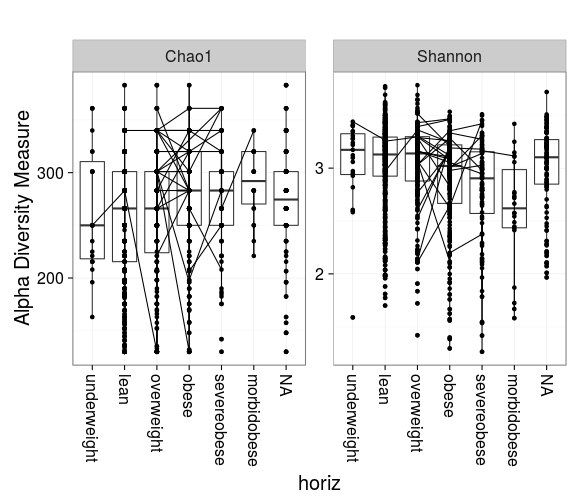

<!--
  %\VignetteEngine{knitr::rmarkdown}
  %\VignetteIndexEntry{microbiome tutorial - atlas}
  %\usepackage[utf8]{inputenc}
-->


## Intestinal microbiota diversity in 1006 western adults

The data set from [Lahti et al. Nat. Comm. 5:4344,
2014](http://www.nature.com/ncomms/2014/140708/ncomms5344/full/ncomms5344.html) has microbiota profiling of 130 genus-like taxa across 1006 normal western adults from [Data Dryad](http://doi.org/10.5061/dryad.pk75d). Load the data in R:


```r
# Download the required R packages and then the HITChip Atlas data set
library(microbiome)
data(atlas1006)

# Let us give a generic name for this phyloseq data object,
# to be used further analysis
pseq <- atlas1006
```


### Estimating microbial diversity 


```r
library(phyloseq)
div <- microbiome::diversity(pseq, measures = c("Observed", "Shannon", "Simpson"))

library(knitr)
kable(head(div))
```


|         |  Shannon| InvSimpson| Richness|  Evenness| Dominance|      Gini| Top_Abundance| Low_Abundance| Core_Abundance|
|:--------|--------:|----------:|--------:|---------:|---------:|---------:|-------------:|-------------:|--------------:|
|Sample-1 | 3.189726|  12.993537|      130| 0.6553063|         5| 0.8486688|     0.1758679|     0.0246043|      0.9597792|
|Sample-2 | 3.396135|  16.603545|      130| 0.6977115|         7| 0.8186840|     0.1716273|     0.0199587|      0.9015118|
|Sample-3 | 2.866104|   8.702908|      130| 0.5888204|         4| 0.8805150|     0.2793253|     0.0393057|      0.9391221|
|Sample-4 | 3.058653|  10.711903|      130| 0.6283784|         4| 0.8601541|     0.1957585|     0.0249986|      0.9509151|
|Sample-5 | 3.076850|  12.263397|      130| 0.6321168|         4| 0.8667646|     0.1685621|     0.0237021|      0.9438707|
|Sample-6 | 2.945709|   9.676464|      130| 0.6051747|         3| 0.8729719|     0.2271913|     0.0384898|      0.9557649|


### Diversity vs. obesity (discrete factor)


```r
p <- plot_diversity(pseq, variable = "bmi_group", measures = c("Observed", "Shannon", "Simpson"), detection = 250, na.rm = TRUE)
```

```
## Error in plot_diversity(pseq, variable = "bmi_group", measures = c("Observed", : unused argument (detection = 250)
```

```r
print(p)
```




