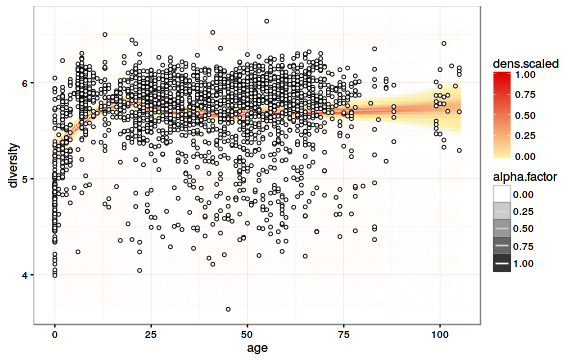

## Intestinal microbiota diversity in 1006 western adults

Let us investigate an example data set from [Lahti et al. Nat. Comm. 5:4344, 2014](http://www.nature.com/ncomms/2014/140708/ncomms5344/full/ncomms5344.html). This contains microbiota profiling of 130 genus-like taxa across 1006 normal western adults from [Data Dryad](http://doi.org/10.5061/dryad.pk75d).


### Download HITChip Atlas data

[Load the HITChip Atlas microbiome profiling data in R](Data.md)


```r
# Download the required R packages and then the HITChip Atlas data set
library("rdryad")
library("microbiome")
pseq <- download_microbiome("atlas1006")
```

```
## Downloading data set from Lahti et al. Nat. Comm. 5:4344, 2014 from Data Dryad: http://doi.org/10.5061/dryad.pk75d
```

```
## Warning in file(file, "rt"): cannot open file '/home/antagomir/R/x86_64-pc-
## linux-gnu-library/3.2/microbiome/extdata/taxonomy.full.tab': No such file
## or directory
```

```
## Error in file(file, "rt"): cannot open the connection
```


### Diversity 

### Estimating microbial diversity with different diversity measures


```r
library(phyloseq)
div <- estimate_diversity(pseq, measures = c("Observed", "Shannon", "Simpson"))
kable(head(div))
```


|         | Observed|  Shannon|   Simpson|
|:--------|--------:|--------:|---------:|
|sample.1 |      130| 3.495764| 0.9431792|
|sample.2 |      130| 3.689806| 0.9574569|
|sample.3 |      130| 3.626883| 0.9547532|
|sample.4 |      130| 3.676363| 0.9617840|
|sample.5 |      130| 3.597394| 0.9532787|
|sample.6 |      130| 3.661490| 0.9586719|


### Diversity vs. obesity


```r
p <- plot_diversity(pseq, x = "bmi_group", measures = c("Observed", "Shannon", "Simpson"), det.th = 250)
```

```
## Error in access(object, "otu_table", errorIfNULL): otu_table slot is empty.
```

```r
print(p)
```


### Diversity vs. age


```r
# Pick the subset of RBB-preprocessed samples from time point 0
pseq <- subset_samples(pseq, time == 0 & DNA_extraction_method == "r")
```

```
## Error in eval(expr, envir, enclos): object 'DNA_extraction_method' not found
```

```r
# Visualize
library(sorvi)
p <- sorvi::regression_plot(diversity~age, sample_data(pseq))
```

```
## Error in eval(expr, envir, enclos): incorrect size (1), expecting : 44
```

```r
print(p)
```




## Further resources

For further examples, see [microbiome tutorial](https://github.com/microbiome/microbiome/blob/master/vignettes/vignette.md)
