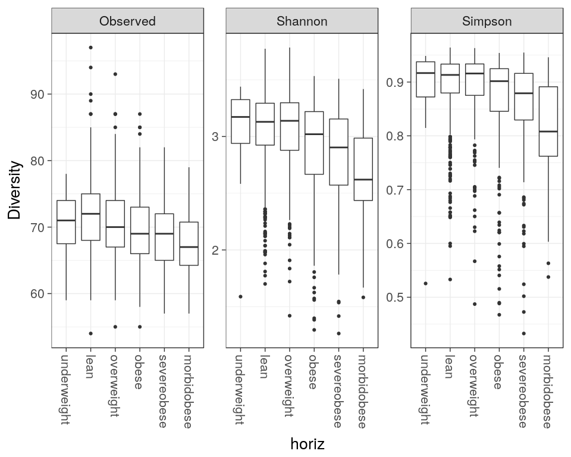

<!--
  %\VignetteEngine{knitr::rmarkdown}
  %\VignetteIndexEntry{microbiome tutorial - atlas}
  %\usepackage[utf8]{inputenc}
-->
Intestinal microbiota diversity in 1006 western adults
------------------------------------------------------

The data set from [Lahti et al. Nat. Comm. 5:4344,
2014](http://www.nature.com/ncomms/2014/140708/ncomms5344/full/ncomms5344.html)
has microbiota profiling of 130 genus-like taxa across 1006 normal
western adults from [Data Dryad](http://doi.org/10.5061/dryad.pk75d).
Load the data in R:

    # Download the required R packages and then the HITChip Atlas data set
    library(microbiome)
    data(atlas1006)

    # Let us give a generic name for this phyloseq data object,
    # to be used further analysis
    pseq <- atlas1006

### Estimating microbial diversity

    library(phyloseq)
    div <- diversity_table(pseq, measures = c("Observed", "Shannon", "Simpson"))

    library(knitr)
    kable(head(div))

<table>
<thead>
<tr class="header">
<th></th>
<th align="right">Observed</th>
<th align="right">Shannon</th>
<th align="right">Simpson</th>
</tr>
</thead>
<tbody>
<tr class="odd">
<td>Sample.1</td>
<td align="right">130</td>
<td align="right">3.189726</td>
<td align="right">0.9230387</td>
</tr>
<tr class="even">
<td>Sample.2</td>
<td align="right">130</td>
<td align="right">3.396135</td>
<td align="right">0.9397719</td>
</tr>
<tr class="odd">
<td>Sample.3</td>
<td align="right">130</td>
<td align="right">2.866104</td>
<td align="right">0.8850959</td>
</tr>
<tr class="even">
<td>Sample.4</td>
<td align="right">130</td>
<td align="right">3.058653</td>
<td align="right">0.9066459</td>
</tr>
<tr class="odd">
<td>Sample.5</td>
<td align="right">130</td>
<td align="right">3.076850</td>
<td align="right">0.9184565</td>
</tr>
<tr class="even">
<td>Sample.6</td>
<td align="right">130</td>
<td align="right">2.945709</td>
<td align="right">0.8966565</td>
</tr>
</tbody>
</table>

### Diversity vs. obesity (discrete factor)

    p <- plot_diversity(pseq, variable = "bmi_group", measures = c("Observed", "Shannon", "Simpson"), det.th = 250, na.rm = TRUE)
    print(p)

### Diversity vs. age (continuous factor)

Output figure not shown due to slowness of calculation:

    p <- plot_regression(diversity~age, sample_data(pseq))
    print(p)
