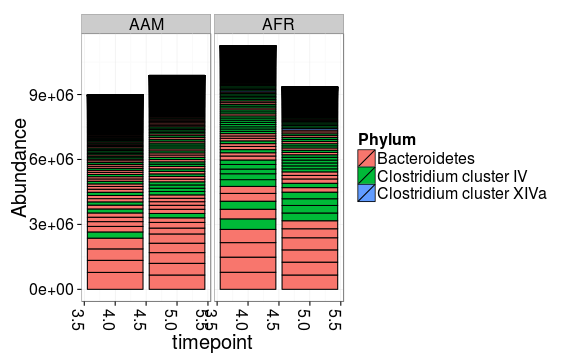

### Coloured Barplots

The following example visualizes samples, colored by Phylum
percentages. For further examples, see [phyloseq
package](http://joey711.github.io/phyloseq/plot_bar-examples.html) and [Composition analysis](Composition.md)


```r
library(microbiome)
library(ggplot2)

# Microbiota profiling data. Read as: bacteria x samples matrix
# From https://peerj.com/articles/32/
pseq <- download_microbiome("dietswap")
pseq <- subset_samples(pseq, group == "DI")
top.otu <- names(sort(taxa_sums(pseq), TRUE)[1:10])
pseq <- prune_taxa(top.otu, pseq)

# Visualize samples by Phyla 
# (in HITChip we have only approximate Phylum level)
plot_bar(pseq, x = "timepoint", fill = "Phylum", facet_grid = ~nationality)
```

 

