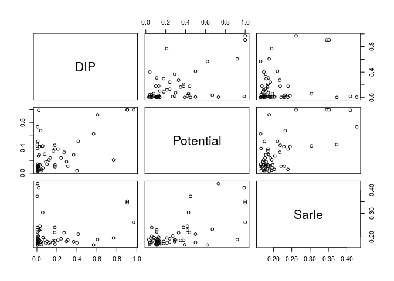
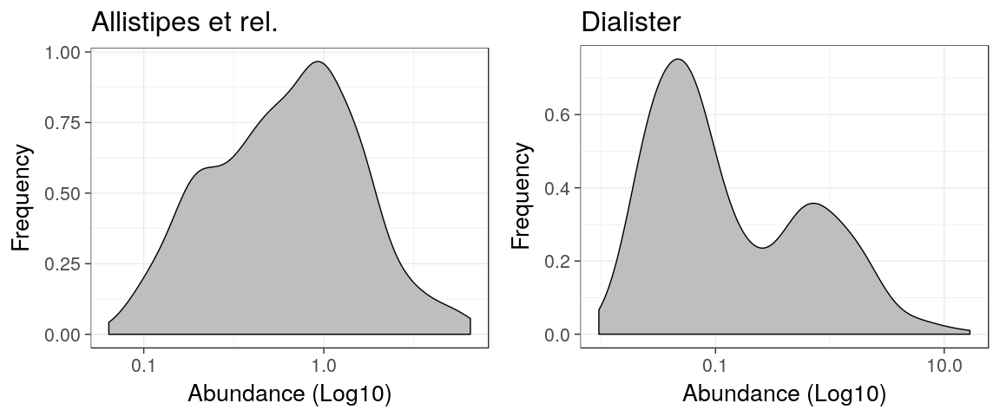
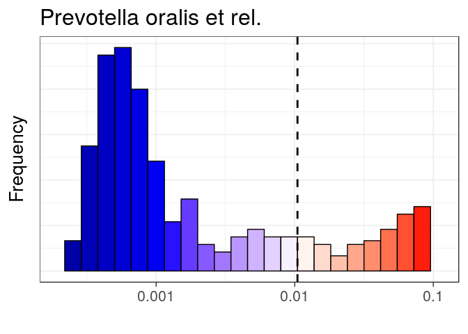

<!--
  %\VignetteEngine{knitr::rmarkdown}
  %\VignetteIndexEntry{microbiome tutorial - stability}
  %\usepackage[utf8]{inputenc}
  %\VignetteEncoding{UTF-8}  
-->
Bimodality analysis
-------------------

Get example data - [HITChip Atlas of 130 genus-like taxa across 1006
healthy western
adults](http://www.nature.com/ncomms/2014/140708/ncomms5344/full/ncomms5344.html).
A subset of 76 subjects have also short time series available for
temporal stability analysis:

    # Load the example data
    library(microbiome)
    data(atlas1006)

    # Rename the example data
    pseq <- atlas1006

    # Focus on specific DNA extraction method
    pseq <- pseq %>% subset_samples(DNA_extraction_method == "r")

    # Keep prevalent taxa (HITChip signal >3 in >20 percent of the samples)
    pseq <- core(pseq, detection = 10^3, prevalence = 20)

    # Use relative abundances
    pseq <- transform_phyloseq(pseq, "compositional")

    # For cross-sectional analysis, include
    # only the zero time point:
    pseq0 <- subset_samples(pseq, time == 0)

### Bimodality indicators

Bimodality of the abundance distribution provides an indirect indicator
of bistability, although other explanations such as sampling biases etc.
should be controlled. Multiple bimodality scores are available.

Multimodality score using [potential analysis with
bootstrap](http://www.nature.com/ncomms/2014/140708/ncomms5344/full/ncomms5344.html)

    # Bimodality is better estimated from log10 abundances
    pseq0.log10 <- transform_phyloseq(pseq0, "log10")
    bimodality.pb <- bimodality(pseq0.log10, method = "potential_bootstrap")

Sarle's bimodality coefficient (see help(coefficient\_of\_bimodality)):

    bimodality.sarle <- bimodality(pseq0.log10, method = "Sarle.finite.sample")

DIP test is another standard multimodality test, available via the
[diptest](https://cran.r-project.org/web/packages/diptest/index.html)
package. Use the 1-p as the score here

    library(diptest)
    bimodality.dip <- apply(abundances(pseq0.log10), 1, function (x) {1 - unname(dip.test(x)$p.value)})

Compare the different bimodality scores

    b <- cbind(DIP = bimodality.dip, Potential = bimodality.pb, Sarle = bimodality.sarle)
    pairs(b)

### Visualize population densities for unimodal and bimodal groups

    # Pick the most and least bimodal taxa as examples
    bimodality <- bimodality.pb
    unimodal <- names(which.min(bimodality))
    bimodal  <- names(which.max(bimodality))

    # Visualize population frequencies
    library(ggplot2)
    theme_set(theme_bw(20))
    p1 <- plot_density(pseq, variable = unimodal, log10 = TRUE) 
    p2 <- plot_density(pseq, variable = bimodal,  log10 = TRUE) 
    library(gridExtra)
    library(ggplot2)
    grid.arrange(p1, p2, nrow = 1)

Tipping point detection
-----------------------

Identify potential minima in cross-section population data as tipping
point candidates (note that [longitudinal analysis](Stability.md) would
be necessary to establish bistability).

    # Log10 abundance for a selected taxonomic group
    tax <- bimodal

    # Detect tipping points detection at log10 abundances 
    x <- log10(abundances(pseq)[tax,])

    # Potential analysis to identify potential minima
    library(earlywarnings)
    res <- livpotential_ews(x)

    # Identify the potential minimum location as a tipping point candidate
    # and cast the tipping back to the original (non-log) space:
    tipping.point <- 10^res$min.points

    print(tipping.point)

    ## [1] 0.2705653

Variation lineplot and bimodality hotplot
-----------------------------------------

Pick subset of the [HITChip Atlas data
set](http://doi.org/10.5061/dryad.pk75d) and plot the subject abundance
variation lineplot (**Variation lineplot**) and **Bimodality hotplot**
for a given taxon as in [Lahti et al.
2014](http://www.nature.com/ncomms/2014/140708/ncomms5344/full/ncomms5344.html).
The bi-stable Dialister has bimodal population distribution and reduced
temporal stability within subjects at intermediate abundances.

    # Bimodality hotplot:
    # Consider a unique sample from each subject: the baseline time point 
    p <- hotplot(pseq0, tax, tipping.point = tipping.point)
    print(p)

