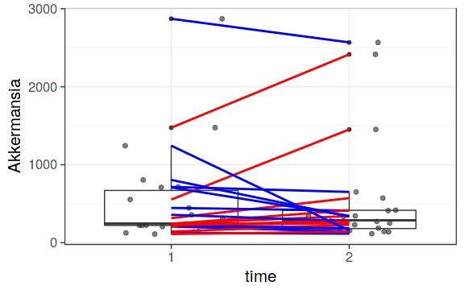

### Boxplots


```r
# Load libraries
library(microbiome)
library(ggplot2)

# Load example data:
# From https://peerj.com/articles/32/
pseq <- download_microbiome("peerj32")$physeq

# Abundance boxplot
p <- boxplot_abundance(pseq, x = "time", y = "Akkermansia", line = "subject", color = "gender")
print(p)
```

 
