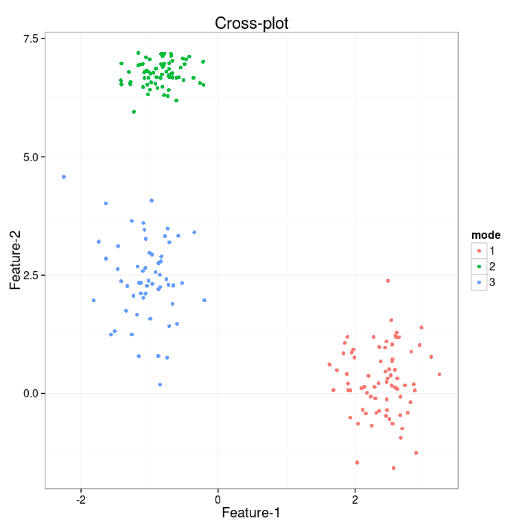
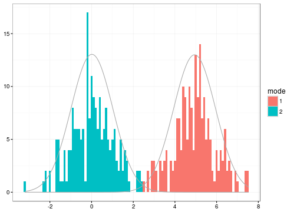

### Multivariate (infinite) Gaussian mixture model

Fit and visualize Variational Dirichlet process multivariate infinite
Gaussian mixture. This variational version has been partially written in
C and it is relatively fast. Kindly cite [this
article](http://bioinformatics.oxfordjournals.org/content/26/21/2713.short).
Note that the implementation uses diagonal covariances on the Gaussian
modes. The C code was partially derived from [Honkela et al.
2008](http://www.sciencedirect.com/science/article/pii/S0925231208000659).

    library(netresponse)

    # Generate simulated data
    res <- generate.toydata(Dim = 2)
    D <- res$data
    component.means <- res$means
    component.sds   <- res$sds

    # Fit the mixture
    m <- mixture.model(D, mixture.method = "vdp", pca.basis = FALSE)

    # Plot the data, and indicate estimated modes with colors. 
    # If data dimensionality exceeds 2, 
    # the results are visualized on PCA projection
    # (with pca.basis = TRUE the data is projected on PCA coordinates;
    # without loss of information. This trick can help to avoid overlearning 
    # as the variational mixture relies
    # on diagonal covariance matrices, so the ellipsoidal axes of the 
    # Gaussian modes are parallel to the coordinate axes.)
    p <- PlotMixtureMultivariate(D, means = m$mu, sds = m$sd, ws = m$w, modes = apply(m$qofz,1,which.max))

### Univariate (infinite) Gaussian mixture model

Fit and visualize Variational Dirichlet process univariate infinite
Gaussian mixture. Kindly cite [this
article](http://bioinformatics.oxfordjournals.org/content/26/21/2713.short).

    library(netresponse)

    # Generate simulated bimodal univariate data
    x <- c(rnorm(200), rnorm(200, mean = 5))

    # Variational Dirichlet process univariate Gaussian mixture
    m <- mixture.model(x, mixture.method = "vdp", max.responses = 10) 

    # Plot the data and estimated modes
    p <- PlotMixtureUnivariate(x, means = m$mu, sds = m$sd, ws = m$w, binwidth = 0.1, qofz = m$qofz)

    print(p)

Hierarchical clustering: reproduce profiling script plot
--------------------------------------------------------

    # Read oligo-level data
    data(peerj32)
    mydata <- peerj32$microbes

    # Hierarchical clustering plot (write into png file)
    metric <- "pearson" # note: use log10 with Pearson!
    hc <- calculate.hclust(mydata, method = "complete", metric = metric)
    plot(hc, hang=-1, main = paste("Hierarchical clustering (", metric, ")", sep = ""), las = 1, xlab = "")

