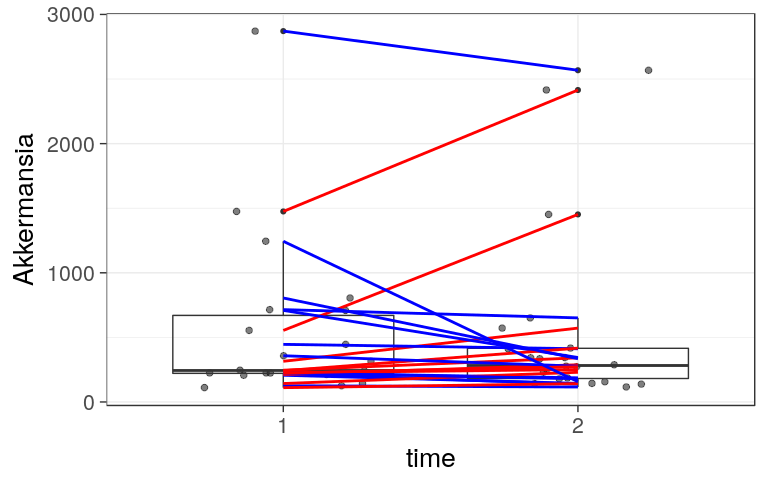
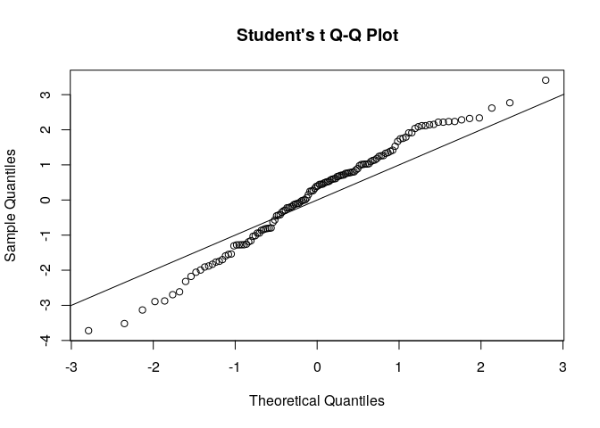

<!--
  %\VignetteEngine{knitr::rmarkdown}
  %\VignetteIndexEntry{microbiome tutorial - comparisons}
  %\usepackage[utf8]{inputenc}
  %\VignetteEncoding{UTF-8}  
-->
Group-wise comparisons
----------------------

Load example data:

    # Load libraries
    library(microbiome)
    library(ggplot2)
    library(dplyr)

    # Probiotics intervention example data 
    data(peerj32) # Source: https://peerj.com/articles/32/
    pseq <- peerj32$phyloseq # Rename the example data

### Abundance boxplot

    p <- boxplot_abundance(pseq, x = "time", y = "Akkermansia", line = "subject", color = "gender")
    print(p)

### Negative binomial example

[Read more on negative
binomials](http://www.ats.ucla.edu/stat/r/dae/nbreg.htm)

    library(MASS)

    # Analyse specific taxa
    taxa <- c("Akkermansia", "Dialister")
    for (tax in taxa) {

      # Pick the signal (abundance) for this tax
      sample_data(pseq)$signal <- get_sample(pseq, tax)

      # Negative binomial test with group and gender included
      res <- glm.nb(signal ~ group + gender, data = pseq_metadata(pseq))

      # Show the results
      print(coef(summary(res)))

    }

    ##                Estimate Std. Error   z value      Pr(>|z|)
    ## (Intercept)   6.2487413  0.2240525 27.889627 3.564693e-171
    ## groupPlacebo  0.3408954  0.2535652  1.344409  1.788161e-01
    ## gendermale   -0.7857536  0.2619740 -2.999358  2.705493e-03
    ##               Estimate Std. Error  z value     Pr(>|z|)
    ## (Intercept)  3.3396496  0.4509626 7.405602 1.305570e-13
    ## groupPlacebo 0.6172977  0.5096202 1.211290 2.257844e-01
    ## gendermale   1.2392095  0.5254207 2.358509 1.834850e-02

### Comparisons for individual taxa with random effect subject term

    # Get sample metadata
    dfs <- pseq_metadata(pseq)

    # Add Dialister abundance as the signal to model
    dfs$signal <- abundances(pseq)["Dialister", rownames(dfs)]

    # Paired comparison
    # with fixed group effect and random subject effect
    library(lme4)
    out <- lmer(signal ~ group + (1|subject), data = dfs)
    out0 <- lmer(signal ~ (1|subject), data = dfs)
    comp <- anova(out0, out)

    ## refitting model(s) with ML (instead of REML)

    pv <- comp[["Pr(>Chisq)"]][[2]]

### Linear models with limma

Identify most significantly different taxa between males and females
using the limma method. See [limma
homepage](http://bioinf.wehi.edu.au/limma/) and [limma User's
guide](http://www.lcg.unam.mx/~lcollado/R/resources/limma-usersguide.pdf)
for details. For discussion on why limma is preferred over t-test, see
[this
article](http://www.plosone.org/article/info:doi/10.1371/journal.pone.0012336).

    # Get OTU abundances and sample metadata
    otu <- abundances(transform_phyloseq(pseq, "log10"))
    meta <- sample_data(pseq)

    # Compare the two groups with limma
    library(limma)

    # Prepare the design matrix which states the groups for each sample
    # in the otu
    design <- cbind(intercept = 1, Grp2vs1 = meta[["gender"]])
    rownames(design) <- rownames(meta)
    design <- design[colnames(otu), ]

    # NOTE: results and p-values are given for all groupings in the design matrix
    # Now focus on the second grouping ie. pairwise comparison
    coef.index <- 2
         
    # Fit the limma model
    fit <- lmFit(otu, design)
    fit <- eBayes(fit)

    # Limma P-values
    pvalues.limma = fit$p.value[, 2]

    # Limma effect sizes
    efs.limma <-  fit$coefficients[, "Grp2vs1"]

    # Summarise
    library(knitr)
    kable(topTable(fit, coef = coef.index, p.value=0.1), digits = 2)

<table>
<thead>
<tr class="header">
<th></th>
<th align="right">logFC</th>
<th align="right">AveExpr</th>
<th align="right">t</th>
<th align="right">P.Value</th>
<th align="right">adj.P.Val</th>
<th align="right">B</th>
</tr>
</thead>
<tbody>
<tr class="odd">
<td>Uncultured Clostridiales II</td>
<td align="right">-0.41</td>
<td align="right">1.37</td>
<td align="right">-3.72</td>
<td align="right">0</td>
<td align="right">0.06</td>
<td align="right">-0.24</td>
</tr>
<tr class="even">
<td>Eubacterium siraeum et rel.</td>
<td align="right">-0.34</td>
<td align="right">1.67</td>
<td align="right">-3.52</td>
<td align="right">0</td>
<td align="right">0.06</td>
<td align="right">-0.77</td>
</tr>
<tr class="odd">
<td>Clostridium nexile et rel.</td>
<td align="right">0.18</td>
<td align="right">2.84</td>
<td align="right">3.41</td>
<td align="right">0</td>
<td align="right">0.06</td>
<td align="right">-1.04</td>
</tr>
<tr class="even">
<td>Sutterella wadsworthia et rel.</td>
<td align="right">-0.33</td>
<td align="right">1.50</td>
<td align="right">-3.13</td>
<td align="right">0</td>
<td align="right">0.10</td>
<td align="right">-1.74</td>
</tr>
</tbody>
</table>

**Q-Q plot for limma**

    qqt(fit$t[, coef.index], df = fit$df.residual + fit$df.prior)
    abline(0,1)

**Volcano plot for limma**

    volcanoplot(fit, coef = coef.index, highlight = coef.index)

### PERMANOVA

PERMANOVA can be used to assess multivariate community-level differences
between groups. Here let us evaluate whether probiotics treatment has a
significant effect on overall gut microbiota composition.

    # Use compositionals for simpler visualizations
    pseq.rel <- transform_phyloseq(pseq, "compositional")
    otu <- abundances(pseq.rel)
    meta <- pseq_metadata(pseq.rel)

    # PERMANOVA: samples x species as input
    library(vegan)
    permanova <- adonis(t(otu) ~ group,
                   data = meta, permutations=99, method = "bray")

    # P-value
    print(as.data.frame(permanova$aov.tab)["group", "Pr(>F)"])

    ## [1] 0.25

Check that variance homogeneity assumptions hold (to ensure the
reliability of the results):

    # Note the assumption of similar multivariate spread among the groups
    # ie. analogous to variance homogeneity
    # Here the groups have signif. different spreads and
    # permanova result may be potentially explained by that.
    dist <- vegdist(t(otu))
    anova(betadisper(dist, meta$group))

    ## Analysis of Variance Table
    ## 
    ## Response: Distances
    ##           Df   Sum Sq   Mean Sq F value Pr(>F)
    ## Groups     1 0.000016 0.0000156  0.0042 0.9487
    ## Residuals 42 0.156962 0.0037372

    # Coefs for the top taxa separating the groups
    coef <- coefficients(permanova)["group1",]
    top.coef <- coef[rev(order(abs(coef)))[1:20]]
    par(mar = c(3, 14, 2, 1))
    barplot(sort(top.coef), horiz = T, las = 1, main = "Top taxa")

