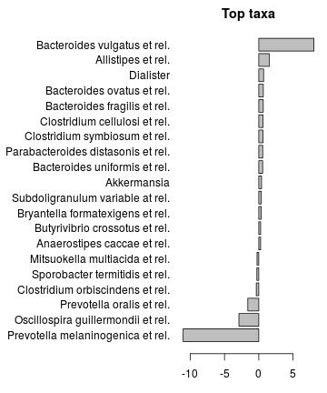

## Group-wise comparisons

Some examples on standard pairwise comparison tests.


### Boxplots


```r
# Load libraries
library(microbiome)
library(ggplot2)

# Probiotics intervention example data from
# https://peerj.com/articles/32/
data("peerj32")

# Abundance boxplot
p <- boxplot_abundance(peerj32$phyloseq, x = "time", y = "Akkermansia", line = "subject", color = "gender")
print(p)
```


### Comparing of two or more groups with a parametric test (linear model; ANOVA)

Note: check ANOVA modeling assumptions before testing. 


```r
# Load example data from a 
# [diet swap study](http://dx.doi.org/10.1038/ncomms7342)
data("dietswap")
pseq <- dietswap

# Convert to relative abundances
pseq <- transform_phyloseq(pseq, "relative.abundance")

# 1-way ANOVA p-values for the multi-group comparison across time groups
source(system.file("extdata/check_anova.R", package = "microbiome"))
anova.results <- check_anova(pseq, "group", p.adjust.method = "BH")
kable(head(anova.results))
```


|   p.anova|   p.ED-DI|   p.HE-DI|   p.HE-ED|    ave.DI|    ave.ED|    ave.HE|
|---------:|---------:|---------:|---------:|---------:|---------:|---------:|
| 0.0010594| 0.9545821| 0.0001572| 0.0000392| 1.4442650| 1.3639240| 2.5845650|
| 0.0029303| 0.8320058| 0.0010983| 0.0001006| 0.5039235| 0.4327322| 0.9486485|
| 0.0336511| 0.9979732| 0.0038676| 0.0028199| 0.0376643| 0.0379573| 0.0219853|
| 0.0336511| 0.9646245| 0.0026158| 0.0054579| 0.1825854| 0.1921543| 0.3084474|
| 0.0706163| 0.0382707| 0.6660798| 0.0026381| 0.4153172| 0.7268781| 0.3066399|
| 0.0708257| 0.6389312| 0.0043033| 0.0533601| 0.4995820| 0.6407194| 1.0016500|


Negative binomial test example ([read more](http://www.ats.ucla.edu/stat/r/dae/nbreg.htm)):


```r
library(MASS)
taxa <- taxa_names(x)[1:2]
x <- atlas1006
df <- as(sample_data(x), "data.frame")
for (tax in taxa) {
  df$signal <- get_sample(x, tax)
  res <- glm.nb(signal ~ bmi_group + gender, data = df)
  print(coef(summary(res)))
}
```

### Wilcoxon test (two-group comparisons)

If the data remarkably violates Gaussian assumptions use
non-parametric test. Wilcoxon is one option for two group
comparison. Here we compare males and females in the example data. The
check_wilcoxon function is experimental and not included in the
microbiome R package but is available as a supplementary file:


```r
source(system.file("extdata/check_wilcoxon.R", package = "microbiome"))
pval <- check_wilcoxon(pseq, "sex")
```


### Comparisons with random effect subject term


```r
# Get taxa x samples abundance matrix
x <- peerj32$phyloseq

# Get the data
mydata <- get_taxa(x)
tax <- "Dialister"
dfs <- sample_data(x)
dfs$signal <- mydata[tax, rownames(dfs)]
dfs$group <- dfs[[group]]

# Paired comparison
library(lme4)
out <- lmer(signal ~ group + (1|subject), data = dfs)
out0 <- lmer(signal ~ (1|subject), data = dfs)
comp <- anova(out0, out)
pv <- comp[["Pr(>Chisq)"]][[2]]
```

### PERMANOVA

PERMANOVA is used to assess significance of community differences between groups. Here let us evaluate whether nationality has a significant effect on gut microbiota.


```r
# Example data
data("dietswap")
x <- dietswap
group <- "nationality"

# Use relative abundances for simpler visualizations
x <- transform_phyloseq(x, "relative.abundance")
otu <- get_sample(x)
meta <- as(sample_data(x), "data.frame")
meta$group <- meta[[group]]

# PERMANOVA: samples x species as input
library(vegan)
permanova <- adonis(t(otu) ~ group, data=meta, permutations=99)
pv <- as.data.frame(permanova$aov.tab)["group", "Pr(>F)"]

# P-value
print(pv)
```

```
## [1] 0.01
```

```r
# However note the assumption of similar
# multivariate spread among the groups
# ie. analogous to variance homogeneity
# Here the groups have signif. different spreads and
# permanova result may be explained by that.
dist <- vegdist(t(otu))
anova(betadisper(dist,meta$group))
```

```
## Analysis of Variance Table
## 
## Response: Distances
##            Df  Sum Sq  Mean Sq F value    Pr(>F)    
## Groups      1 0.26114 0.261144  18.345 2.754e-05 ***
## Residuals 220 3.13168 0.014235                      
## ---
## Signif. codes:  0 '***' 0.001 '**' 0.01 '*' 0.05 '.' 0.1 ' ' 1
```

```r
# Coefs for the top taxa separating the groups
coef <- coefficients(permanova)["group1",]
top.coef <- coef[rev(order(abs(coef)))[1:20]]
par(mar = c(3, 14, 2, 1))
barplot(sort(top.coef), horiz = T, las = 1, main = "Top taxa")
```



