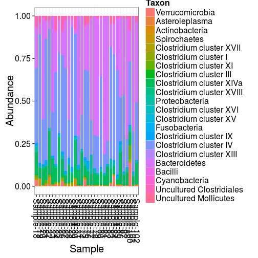

## Microbiota composition


### Barplot visualizations

Also see [phyloseq barplot examples](http://joey711.github.io/phyloseq/plot_bar-examples.html) and [HITChip Barplots](Barplots.md)


Load example data:


```r
# Example data
library(microbiome)
pseq0 <- download_microbiome("dietswap")
```

```
## Downloading data set from O'Keefe et al. Nat. Comm. 6:6342, 2015 from Data Dryad: http://datadryad.org/resource/doi:10.5061/dryad.1mn1n
```

```r
# Pick sample subset
pseq <- subset_samples(pseq0, group == "DI" & nationality == "AFR")
```

Show OTU absolute abundance in each sample. Plot absolute taxon
abundances (Note: on HITChip data the Phylum level is only
approximate):


```r
plot_composition(pseq, taxonomic.level = "Phylum")
```

 

Same with relative abundances:


```r
p <- plot_composition(pseq, taxonomic.level = "Phylum", relative.abundance = TRUE)
p <- p + guides(fill = guide_legend(nrow = 12, byrow = TRUE))
print(p)
```

 


Arrange by sample variable and use custom X axis labels. Americans have more Bacteroides, and Africans more Prevotella (as expected):


```r
# Subset taxa and samples
pseq <- subset_samples(pseq0, group == "DI" & timepoint.within.group == 1)
pseq <- prune_taxa(c("Prevotella melaninogenica et rel.", "Bacteroides fragilis et rel.", "Akkermansia"), pseq)
p <- plot_composition(pseq, relative.abundance = TRUE, sort.by = "nationality", x.label = "nationality")
p <- p + guides(fill = guide_legend(ncol = 1))
p <- p + theme(legend.position = "bottom")
print(p)
```

 


### Coloured Barplots

The following example visualizes samples, colored by Phylum
percentages.


```r
# Pick the top OTUs only
# pseq <- prune_taxa(names(sort(taxa_sums(pseq), TRUE)[1:10]), pseq)

# Visualize samples 
# (in HITChip we have only approximate Phylum level)
plot_bar(pseq, x = "timepoint", fill = "Phylum", facet_grid = ~nationality)
```

 


