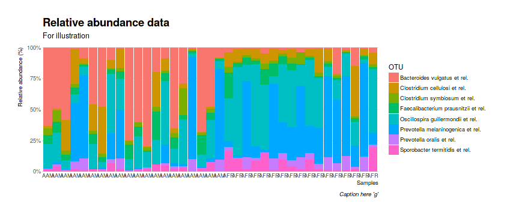
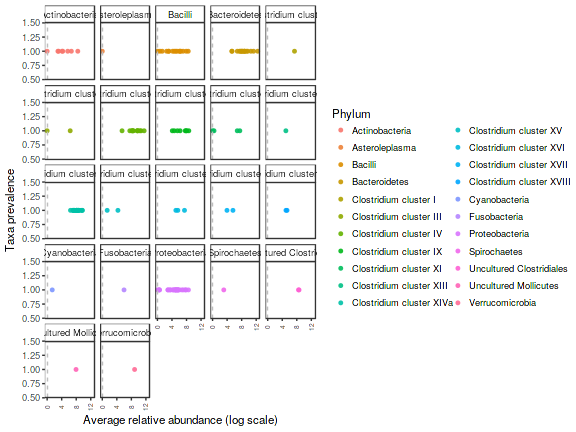

  <!--
  %\VignetteEngine{knitr::rmarkdown}
%\VignetteIndexEntry{microbiome tutorial - composition}
%\usepackage[utf8]{inputenc}
%\VignetteEncoding{UTF-8}  
-->
  
  
  ## Microbiota composition
  
  
  ### Barplots for composition
  
  Also see [phyloseq barplot examples](http://joey711.github.io/phyloseq/plot_bar-examples.html).


Read example data from a [diet swap study](http://dx.doi.org/10.1038/ncomms7342):
  

```r
# Example data
library(microbiome)
library(dplyr)
data(dietswap)
pseq <- dietswap

# Pick sample subset
library(phyloseq)
pseq2 <- subset_samples(pseq, group == "DI" & nationality == "AFR")
```

Show OTU absolute abundance in each sample. Plot absolute taxon
abundances:
  

```r
library(ggplot2)
theme_set(theme_bw(22)) # Black/white color theme
p <- plot_composition(pseq2, taxonomic.level = "Phylum") +
  theme(legend.position = "bottom") +
  guides(fill = guide_legend(nrow = 10, byrow = TRUE))
print(p)       
```


Arrange by sample variable. Focus on the core taxa. Africans have more Prevotella as expected. Absolute counts:
  

```r
# Limit the analysis on core taxa and specific sample group
pseq2 <- pseq %>%
  core(detection = 10^4, prevalence = .5) %>%
  subset_samples(group == "DI" & timepoint.within.group == 1)

p <- plot_composition(pseq2,
                      sample.sort = "nationality", # Sort by nationality
                      x.label = "nationality") +   # Label by nationality
  guides(fill = guide_legend(nrow = 5, byrow = TRUE)) +
  theme(legend.position = "bottom")
print(p)
```


Same with compositional (relative) abundances:
  

```r
p <- plot_composition(pseq2,
                      sample.sort = "nationality",
                      x.label = "nationality",
                      transform = "compositional") +
  guides(fill = guide_legend(ncol = 1))
print(p)

# Or try another theme
# from https://github.com/hrbrmstr/hrbrthemes
library(hrbrthemes)
library(gcookbook)
library(tidyverse)
```

```
## Loading tidyverse: readr
## Loading tidyverse: purrr
```

```
## Conflicts with tidy packages ----------------------------------------------
```

```
## arrange():   dplyr, plyr
## collapse():  dplyr, IRanges
## combine():   dplyr, Biobase, gridExtra, BiocGenerics
## compact():   purrr, plyr
## count():     dplyr, plyr
## desc():      dplyr, IRanges, plyr
## expand():    tidyr, S4Vectors
## failwith():  dplyr, plyr
## filter():    dplyr, stats
## first():     dplyr, S4Vectors
## id():        dplyr, plyr
## lag():       dplyr, stats
## map():       purrr, mclust
## mutate():    dplyr, plyr
## Position():  ggplot2, BiocGenerics, base
## reduce():    purrr, IRanges
## regroup():   dplyr, IRanges
## rename():    dplyr, S4Vectors, plyr
## select():    dplyr, MASS
## simplify():  purrr, IRanges
## slice():     dplyr, IRanges
## summarise(): dplyr, plyr
## summarize(): dplyr, plyr
```

```r
p2 <- p + scale_y_percent() + labs(x="Samples", y="Relative abundance (%)",
                                   title="Relative abundance data",
                                   subtitle="For illustration",
                                   caption="Caption here 'g'") + 
  theme_ipsum(grid="Y")
print(p2)  
```

```
## Warning in grid.Call(L_textBounds, as.graphicsAnnot(x$label), x$x, x$y, :
## font family 'Arial Narrow' not found in PostScript font database

## Warning in grid.Call(L_textBounds, as.graphicsAnnot(x$label), x$x, x$y, :
## font family 'Arial Narrow' not found in PostScript font database

## Warning in grid.Call(L_textBounds, as.graphicsAnnot(x$label), x$x, x$y, :
## font family 'Arial Narrow' not found in PostScript font database

## Warning in grid.Call(L_textBounds, as.graphicsAnnot(x$label), x$x, x$y, :
## font family 'Arial Narrow' not found in PostScript font database

## Warning in grid.Call(L_textBounds, as.graphicsAnnot(x$label), x$x, x$y, :
## font family 'Arial Narrow' not found in PostScript font database

## Warning in grid.Call(L_textBounds, as.graphicsAnnot(x$label), x$x, x$y, :
## font family 'Arial Narrow' not found in PostScript font database

## Warning in grid.Call(L_textBounds, as.graphicsAnnot(x$label), x$x, x$y, :
## font family 'Arial Narrow' not found in PostScript font database

## Warning in grid.Call(L_textBounds, as.graphicsAnnot(x$label), x$x, x$y, :
## font family 'Arial Narrow' not found in PostScript font database

## Warning in grid.Call(L_textBounds, as.graphicsAnnot(x$label), x$x, x$y, :
## font family 'Arial Narrow' not found in PostScript font database

## Warning in grid.Call(L_textBounds, as.graphicsAnnot(x$label), x$x, x$y, :
## font family 'Arial Narrow' not found in PostScript font database

## Warning in grid.Call(L_textBounds, as.graphicsAnnot(x$label), x$x, x$y, :
## font family 'Arial Narrow' not found in PostScript font database

## Warning in grid.Call(L_textBounds, as.graphicsAnnot(x$label), x$x, x$y, :
## font family 'Arial Narrow' not found in PostScript font database

## Warning in grid.Call(L_textBounds, as.graphicsAnnot(x$label), x$x, x$y, :
## font family 'Arial Narrow' not found in PostScript font database

## Warning in grid.Call(L_textBounds, as.graphicsAnnot(x$label), x$x, x$y, :
## font family 'Arial Narrow' not found in PostScript font database

## Warning in grid.Call(L_textBounds, as.graphicsAnnot(x$label), x$x, x$y, :
## font family 'Arial Narrow' not found in PostScript font database

## Warning in grid.Call(L_textBounds, as.graphicsAnnot(x$label), x$x, x$y, :
## font family 'Arial Narrow' not found in PostScript font database

## Warning in grid.Call(L_textBounds, as.graphicsAnnot(x$label), x$x, x$y, :
## font family 'Arial Narrow' not found in PostScript font database

## Warning in grid.Call(L_textBounds, as.graphicsAnnot(x$label), x$x, x$y, :
## font family 'Arial Narrow' not found in PostScript font database

## Warning in grid.Call(L_textBounds, as.graphicsAnnot(x$label), x$x, x$y, :
## font family 'Arial Narrow' not found in PostScript font database

## Warning in grid.Call(L_textBounds, as.graphicsAnnot(x$label), x$x, x$y, :
## font family 'Arial Narrow' not found in PostScript font database

## Warning in grid.Call(L_textBounds, as.graphicsAnnot(x$label), x$x, x$y, :
## font family 'Arial Narrow' not found in PostScript font database

## Warning in grid.Call(L_textBounds, as.graphicsAnnot(x$label), x$x, x$y, :
## font family 'Arial Narrow' not found in PostScript font database

## Warning in grid.Call(L_textBounds, as.graphicsAnnot(x$label), x$x, x$y, :
## font family 'Arial Narrow' not found in PostScript font database

## Warning in grid.Call(L_textBounds, as.graphicsAnnot(x$label), x$x, x$y, :
## font family 'Arial Narrow' not found in PostScript font database

## Warning in grid.Call(L_textBounds, as.graphicsAnnot(x$label), x$x, x$y, :
## font family 'Arial Narrow' not found in PostScript font database

## Warning in grid.Call(L_textBounds, as.graphicsAnnot(x$label), x$x, x$y, :
## font family 'Arial Narrow' not found in PostScript font database

## Warning in grid.Call(L_textBounds, as.graphicsAnnot(x$label), x$x, x$y, :
## font family 'Arial Narrow' not found in PostScript font database

## Warning in grid.Call(L_textBounds, as.graphicsAnnot(x$label), x$x, x$y, :
## font family 'Arial Narrow' not found in PostScript font database

## Warning in grid.Call(L_textBounds, as.graphicsAnnot(x$label), x$x, x$y, :
## font family 'Arial Narrow' not found in PostScript font database

## Warning in grid.Call(L_textBounds, as.graphicsAnnot(x$label), x$x, x$y, :
## font family 'Arial Narrow' not found in PostScript font database

## Warning in grid.Call(L_textBounds, as.graphicsAnnot(x$label), x$x, x$y, :
## font family 'Arial Narrow' not found in PostScript font database

## Warning in grid.Call(L_textBounds, as.graphicsAnnot(x$label), x$x, x$y, :
## font family 'Arial Narrow' not found in PostScript font database

## Warning in grid.Call(L_textBounds, as.graphicsAnnot(x$label), x$x, x$y, :
## font family 'Arial Narrow' not found in PostScript font database

## Warning in grid.Call(L_textBounds, as.graphicsAnnot(x$label), x$x, x$y, :
## font family 'Arial Narrow' not found in PostScript font database

## Warning in grid.Call(L_textBounds, as.graphicsAnnot(x$label), x$x, x$y, :
## font family 'Arial Narrow' not found in PostScript font database

## Warning in grid.Call(L_textBounds, as.graphicsAnnot(x$label), x$x, x$y, :
## font family 'Arial Narrow' not found in PostScript font database

## Warning in grid.Call(L_textBounds, as.graphicsAnnot(x$label), x$x, x$y, :
## font family 'Arial Narrow' not found in PostScript font database

## Warning in grid.Call(L_textBounds, as.graphicsAnnot(x$label), x$x, x$y, :
## font family 'Arial Narrow' not found in PostScript font database

## Warning in grid.Call(L_textBounds, as.graphicsAnnot(x$label), x$x, x$y, :
## font family 'Arial Narrow' not found in PostScript font database

## Warning in grid.Call(L_textBounds, as.graphicsAnnot(x$label), x$x, x$y, :
## font family 'Arial Narrow' not found in PostScript font database

## Warning in grid.Call(L_textBounds, as.graphicsAnnot(x$label), x$x, x$y, :
## font family 'Arial Narrow' not found in PostScript font database

## Warning in grid.Call(L_textBounds, as.graphicsAnnot(x$label), x$x, x$y, :
## font family 'Arial Narrow' not found in PostScript font database

## Warning in grid.Call(L_textBounds, as.graphicsAnnot(x$label), x$x, x$y, :
## font family 'Arial Narrow' not found in PostScript font database

## Warning in grid.Call(L_textBounds, as.graphicsAnnot(x$label), x$x, x$y, :
## font family 'Arial Narrow' not found in PostScript font database

## Warning in grid.Call(L_textBounds, as.graphicsAnnot(x$label), x$x, x$y, :
## font family 'Arial Narrow' not found in PostScript font database

## Warning in grid.Call(L_textBounds, as.graphicsAnnot(x$label), x$x, x$y, :
## font family 'Arial Narrow' not found in PostScript font database

## Warning in grid.Call(L_textBounds, as.graphicsAnnot(x$label), x$x, x$y, :
## font family 'Arial Narrow' not found in PostScript font database

## Warning in grid.Call(L_textBounds, as.graphicsAnnot(x$label), x$x, x$y, :
## font family 'Arial Narrow' not found in PostScript font database

## Warning in grid.Call(L_textBounds, as.graphicsAnnot(x$label), x$x, x$y, :
## font family 'Arial Narrow' not found in PostScript font database

## Warning in grid.Call(L_textBounds, as.graphicsAnnot(x$label), x$x, x$y, :
## font family 'Arial Narrow' not found in PostScript font database

## Warning in grid.Call(L_textBounds, as.graphicsAnnot(x$label), x$x, x$y, :
## font family 'Arial Narrow' not found in PostScript font database

## Warning in grid.Call(L_textBounds, as.graphicsAnnot(x$label), x$x, x$y, :
## font family 'Arial Narrow' not found in PostScript font database

## Warning in grid.Call(L_textBounds, as.graphicsAnnot(x$label), x$x, x$y, :
## font family 'Arial Narrow' not found in PostScript font database

## Warning in grid.Call(L_textBounds, as.graphicsAnnot(x$label), x$x, x$y, :
## font family 'Arial Narrow' not found in PostScript font database

## Warning in grid.Call(L_textBounds, as.graphicsAnnot(x$label), x$x, x$y, :
## font family 'Arial Narrow' not found in PostScript font database

## Warning in grid.Call(L_textBounds, as.graphicsAnnot(x$label), x$x, x$y, :
## font family 'Arial Narrow' not found in PostScript font database

## Warning in grid.Call(L_textBounds, as.graphicsAnnot(x$label), x$x, x$y, :
## font family 'Arial Narrow' not found in PostScript font database

## Warning in grid.Call(L_textBounds, as.graphicsAnnot(x$label), x$x, x$y, :
## font family 'Arial Narrow' not found in PostScript font database

## Warning in grid.Call(L_textBounds, as.graphicsAnnot(x$label), x$x, x$y, :
## font family 'Arial Narrow' not found in PostScript font database

## Warning in grid.Call(L_textBounds, as.graphicsAnnot(x$label), x$x, x$y, :
## font family 'Arial Narrow' not found in PostScript font database

## Warning in grid.Call(L_textBounds, as.graphicsAnnot(x$label), x$x, x$y, :
## font family 'Arial Narrow' not found in PostScript font database

## Warning in grid.Call(L_textBounds, as.graphicsAnnot(x$label), x$x, x$y, :
## font family 'Arial Narrow' not found in PostScript font database

## Warning in grid.Call(L_textBounds, as.graphicsAnnot(x$label), x$x, x$y, :
## font family 'Arial Narrow' not found in PostScript font database

## Warning in grid.Call(L_textBounds, as.graphicsAnnot(x$label), x$x, x$y, :
## font family 'Arial Narrow' not found in PostScript font database

## Warning in grid.Call(L_textBounds, as.graphicsAnnot(x$label), x$x, x$y, :
## font family 'Arial Narrow' not found in PostScript font database

## Warning in grid.Call(L_textBounds, as.graphicsAnnot(x$label), x$x, x$y, :
## font family 'Arial Narrow' not found in PostScript font database

## Warning in grid.Call(L_textBounds, as.graphicsAnnot(x$label), x$x, x$y, :
## font family 'Arial Narrow' not found in PostScript font database

## Warning in grid.Call(L_textBounds, as.graphicsAnnot(x$label), x$x, x$y, :
## font family 'Arial Narrow' not found in PostScript font database

## Warning in grid.Call(L_textBounds, as.graphicsAnnot(x$label), x$x, x$y, :
## font family 'Arial Narrow' not found in PostScript font database

## Warning in grid.Call(L_textBounds, as.graphicsAnnot(x$label), x$x, x$y, :
## font family 'Arial Narrow' not found in PostScript font database

## Warning in grid.Call(L_textBounds, as.graphicsAnnot(x$label), x$x, x$y, :
## font family 'Arial Narrow' not found in PostScript font database

## Warning in grid.Call(L_textBounds, as.graphicsAnnot(x$label), x$x, x$y, :
## font family 'Arial Narrow' not found in PostScript font database

## Warning in grid.Call(L_textBounds, as.graphicsAnnot(x$label), x$x, x$y, :
## font family 'Arial Narrow' not found in PostScript font database

## Warning in grid.Call(L_textBounds, as.graphicsAnnot(x$label), x$x, x$y, :
## font family 'Arial Narrow' not found in PostScript font database

## Warning in grid.Call(L_textBounds, as.graphicsAnnot(x$label), x$x, x$y, :
## font family 'Arial Narrow' not found in PostScript font database

## Warning in grid.Call(L_textBounds, as.graphicsAnnot(x$label), x$x, x$y, :
## font family 'Arial Narrow' not found in PostScript font database

## Warning in grid.Call(L_textBounds, as.graphicsAnnot(x$label), x$x, x$y, :
## font family 'Arial Narrow' not found in PostScript font database

## Warning in grid.Call(L_textBounds, as.graphicsAnnot(x$label), x$x, x$y, :
## font family 'Arial Narrow' not found in PostScript font database

## Warning in grid.Call(L_textBounds, as.graphicsAnnot(x$label), x$x, x$y, :
## font family 'Arial Narrow' not found in PostScript font database

## Warning in grid.Call(L_textBounds, as.graphicsAnnot(x$label), x$x, x$y, :
## font family 'Arial Narrow' not found in PostScript font database

## Warning in grid.Call(L_textBounds, as.graphicsAnnot(x$label), x$x, x$y, :
## font family 'Arial Narrow' not found in PostScript font database

## Warning in grid.Call(L_textBounds, as.graphicsAnnot(x$label), x$x, x$y, :
## font family 'Arial Narrow' not found in PostScript font database

## Warning in grid.Call(L_textBounds, as.graphicsAnnot(x$label), x$x, x$y, :
## font family 'Arial Narrow' not found in PostScript font database

## Warning in grid.Call(L_textBounds, as.graphicsAnnot(x$label), x$x, x$y, :
## font family 'Arial Narrow' not found in PostScript font database

## Warning in grid.Call(L_textBounds, as.graphicsAnnot(x$label), x$x, x$y, :
## font family 'Arial Narrow' not found in PostScript font database

## Warning in grid.Call(L_textBounds, as.graphicsAnnot(x$label), x$x, x$y, :
## font family 'Arial Narrow' not found in PostScript font database

## Warning in grid.Call(L_textBounds, as.graphicsAnnot(x$label), x$x, x$y, :
## font family 'Arial Narrow' not found in PostScript font database

## Warning in grid.Call(L_textBounds, as.graphicsAnnot(x$label), x$x, x$y, :
## font family 'Arial Narrow' not found in PostScript font database

## Warning in grid.Call(L_textBounds, as.graphicsAnnot(x$label), x$x, x$y, :
## font family 'Arial Narrow' not found in PostScript font database

## Warning in grid.Call(L_textBounds, as.graphicsAnnot(x$label), x$x, x$y, :
## font family 'Arial Narrow' not found in PostScript font database

## Warning in grid.Call(L_textBounds, as.graphicsAnnot(x$label), x$x, x$y, :
## font family 'Arial Narrow' not found in PostScript font database

## Warning in grid.Call(L_textBounds, as.graphicsAnnot(x$label), x$x, x$y, :
## font family 'Arial Narrow' not found in PostScript font database

## Warning in grid.Call(L_textBounds, as.graphicsAnnot(x$label), x$x, x$y, :
## font family 'Arial Narrow' not found in PostScript font database

## Warning in grid.Call(L_textBounds, as.graphicsAnnot(x$label), x$x, x$y, :
## font family 'Arial Narrow' not found in PostScript font database

## Warning in grid.Call(L_textBounds, as.graphicsAnnot(x$label), x$x, x$y, :
## font family 'Arial Narrow' not found in PostScript font database

## Warning in grid.Call(L_textBounds, as.graphicsAnnot(x$label), x$x, x$y, :
## font family 'Arial Narrow' not found in PostScript font database

## Warning in grid.Call(L_textBounds, as.graphicsAnnot(x$label), x$x, x$y, :
## font family 'Arial Narrow' not found in PostScript font database

## Warning in grid.Call(L_textBounds, as.graphicsAnnot(x$label), x$x, x$y, :
## font family 'Arial Narrow' not found in PostScript font database

## Warning in grid.Call(L_textBounds, as.graphicsAnnot(x$label), x$x, x$y, :
## font family 'Arial Narrow' not found in PostScript font database

## Warning in grid.Call(L_textBounds, as.graphicsAnnot(x$label), x$x, x$y, :
## font family 'Arial Narrow' not found in PostScript font database

## Warning in grid.Call(L_textBounds, as.graphicsAnnot(x$label), x$x, x$y, :
## font family 'Arial Narrow' not found in PostScript font database

## Warning in grid.Call(L_textBounds, as.graphicsAnnot(x$label), x$x, x$y, :
## font family 'Arial Narrow' not found in PostScript font database

## Warning in grid.Call(L_textBounds, as.graphicsAnnot(x$label), x$x, x$y, :
## font family 'Arial Narrow' not found in PostScript font database

## Warning in grid.Call(L_textBounds, as.graphicsAnnot(x$label), x$x, x$y, :
## font family 'Arial Narrow' not found in PostScript font database

## Warning in grid.Call(L_textBounds, as.graphicsAnnot(x$label), x$x, x$y, :
## font family 'Arial Narrow' not found in PostScript font database

## Warning in grid.Call(L_textBounds, as.graphicsAnnot(x$label), x$x, x$y, :
## font family 'Arial Narrow' not found in PostScript font database

## Warning in grid.Call(L_textBounds, as.graphicsAnnot(x$label), x$x, x$y, :
## font family 'Arial Narrow' not found in PostScript font database

## Warning in grid.Call(L_textBounds, as.graphicsAnnot(x$label), x$x, x$y, :
## font family 'Arial Narrow' not found in PostScript font database

## Warning in grid.Call(L_textBounds, as.graphicsAnnot(x$label), x$x, x$y, :
## font family 'Arial Narrow' not found in PostScript font database

## Warning in grid.Call(L_textBounds, as.graphicsAnnot(x$label), x$x, x$y, :
## font family 'Arial Narrow' not found in PostScript font database

## Warning in grid.Call(L_textBounds, as.graphicsAnnot(x$label), x$x, x$y, :
## font family 'Arial Narrow' not found in PostScript font database

## Warning in grid.Call(L_textBounds, as.graphicsAnnot(x$label), x$x, x$y, :
## font family 'Arial Narrow' not found in PostScript font database

## Warning in grid.Call(L_textBounds, as.graphicsAnnot(x$label), x$x, x$y, :
## font family 'Arial Narrow' not found in PostScript font database

## Warning in grid.Call(L_textBounds, as.graphicsAnnot(x$label), x$x, x$y, :
## font family 'Arial Narrow' not found in PostScript font database

## Warning in grid.Call(L_textBounds, as.graphicsAnnot(x$label), x$x, x$y, :
## font family 'Arial Narrow' not found in PostScript font database

## Warning in grid.Call(L_textBounds, as.graphicsAnnot(x$label), x$x, x$y, :
## font family 'Arial Narrow' not found in PostScript font database

## Warning in grid.Call(L_textBounds, as.graphicsAnnot(x$label), x$x, x$y, :
## font family 'Arial Narrow' not found in PostScript font database

## Warning in grid.Call(L_textBounds, as.graphicsAnnot(x$label), x$x, x$y, :
## font family 'Arial Narrow' not found in PostScript font database

## Warning in grid.Call(L_textBounds, as.graphicsAnnot(x$label), x$x, x$y, :
## font family 'Arial Narrow' not found in PostScript font database

## Warning in grid.Call(L_textBounds, as.graphicsAnnot(x$label), x$x, x$y, :
## font family 'Arial Narrow' not found in PostScript font database

## Warning in grid.Call(L_textBounds, as.graphicsAnnot(x$label), x$x, x$y, :
## font family 'Arial Narrow' not found in PostScript font database

## Warning in grid.Call(L_textBounds, as.graphicsAnnot(x$label), x$x, x$y, :
## font family 'Arial Narrow' not found in PostScript font database

## Warning in grid.Call(L_textBounds, as.graphicsAnnot(x$label), x$x, x$y, :
## font family 'Arial Narrow' not found in PostScript font database

## Warning in grid.Call(L_textBounds, as.graphicsAnnot(x$label), x$x, x$y, :
## font family 'Arial Narrow' not found in PostScript font database

## Warning in grid.Call(L_textBounds, as.graphicsAnnot(x$label), x$x, x$y, :
## font family 'Arial Narrow' not found in PostScript font database

## Warning in grid.Call(L_textBounds, as.graphicsAnnot(x$label), x$x, x$y, :
## font family 'Arial Narrow' not found in PostScript font database

## Warning in grid.Call(L_textBounds, as.graphicsAnnot(x$label), x$x, x$y, :
## font family 'Arial Narrow' not found in PostScript font database

## Warning in grid.Call(L_textBounds, as.graphicsAnnot(x$label), x$x, x$y, :
## font family 'Arial Narrow' not found in PostScript font database

## Warning in grid.Call(L_textBounds, as.graphicsAnnot(x$label), x$x, x$y, :
## font family 'Arial Narrow' not found in PostScript font database

## Warning in grid.Call(L_textBounds, as.graphicsAnnot(x$label), x$x, x$y, :
## font family 'Arial Narrow' not found in PostScript font database

## Warning in grid.Call(L_textBounds, as.graphicsAnnot(x$label), x$x, x$y, :
## font family 'Arial Narrow' not found in PostScript font database

## Warning in grid.Call(L_textBounds, as.graphicsAnnot(x$label), x$x, x$y, :
## font family 'Arial Narrow' not found in PostScript font database

## Warning in grid.Call(L_textBounds, as.graphicsAnnot(x$label), x$x, x$y, :
## font family 'Arial Narrow' not found in PostScript font database

## Warning in grid.Call(L_textBounds, as.graphicsAnnot(x$label), x$x, x$y, :
## font family 'Arial Narrow' not found in PostScript font database

## Warning in grid.Call(L_textBounds, as.graphicsAnnot(x$label), x$x, x$y, :
## font family 'Arial Narrow' not found in PostScript font database

## Warning in grid.Call(L_textBounds, as.graphicsAnnot(x$label), x$x, x$y, :
## font family 'Arial Narrow' not found in PostScript font database

## Warning in grid.Call(L_textBounds, as.graphicsAnnot(x$label), x$x, x$y, :
## font family 'Arial Narrow' not found in PostScript font database

## Warning in grid.Call(L_textBounds, as.graphicsAnnot(x$label), x$x, x$y, :
## font family 'Arial Narrow' not found in PostScript font database

## Warning in grid.Call(L_textBounds, as.graphicsAnnot(x$label), x$x, x$y, :
## font family 'Arial Narrow' not found in PostScript font database

## Warning in grid.Call(L_textBounds, as.graphicsAnnot(x$label), x$x, x$y, :
## font family 'Arial Narrow' not found in PostScript font database

## Warning in grid.Call(L_textBounds, as.graphicsAnnot(x$label), x$x, x$y, :
## font family 'Arial Narrow' not found in PostScript font database

## Warning in grid.Call(L_textBounds, as.graphicsAnnot(x$label), x$x, x$y, :
## font family 'Arial Narrow' not found in PostScript font database

## Warning in grid.Call(L_textBounds, as.graphicsAnnot(x$label), x$x, x$y, :
## font family 'Arial Narrow' not found in PostScript font database

## Warning in grid.Call(L_textBounds, as.graphicsAnnot(x$label), x$x, x$y, :
## font family 'Arial Narrow' not found in PostScript font database

## Warning in grid.Call(L_textBounds, as.graphicsAnnot(x$label), x$x, x$y, :
## font family 'Arial Narrow' not found in PostScript font database

## Warning in grid.Call(L_textBounds, as.graphicsAnnot(x$label), x$x, x$y, :
## font family 'Arial Narrow' not found in PostScript font database

## Warning in grid.Call(L_textBounds, as.graphicsAnnot(x$label), x$x, x$y, :
## font family 'Arial Narrow' not found in PostScript font database

## Warning in grid.Call(L_textBounds, as.graphicsAnnot(x$label), x$x, x$y, :
## font family 'Arial Narrow' not found in PostScript font database

## Warning in grid.Call(L_textBounds, as.graphicsAnnot(x$label), x$x, x$y, :
## font family 'Arial Narrow' not found in PostScript font database

## Warning in grid.Call(L_textBounds, as.graphicsAnnot(x$label), x$x, x$y, :
## font family 'Arial Narrow' not found in PostScript font database

## Warning in grid.Call(L_textBounds, as.graphicsAnnot(x$label), x$x, x$y, :
## font family 'Arial Narrow' not found in PostScript font database

## Warning in grid.Call(L_textBounds, as.graphicsAnnot(x$label), x$x, x$y, :
## font family 'Arial Narrow' not found in PostScript font database

## Warning in grid.Call(L_textBounds, as.graphicsAnnot(x$label), x$x, x$y, :
## font family 'Arial Narrow' not found in PostScript font database

## Warning in grid.Call(L_textBounds, as.graphicsAnnot(x$label), x$x, x$y, :
## font family 'Arial Narrow' not found in PostScript font database

## Warning in grid.Call(L_textBounds, as.graphicsAnnot(x$label), x$x, x$y, :
## font family 'Arial Narrow' not found in PostScript font database

## Warning in grid.Call(L_textBounds, as.graphicsAnnot(x$label), x$x, x$y, :
## font family 'Arial Narrow' not found in PostScript font database

## Warning in grid.Call(L_textBounds, as.graphicsAnnot(x$label), x$x, x$y, :
## font family 'Arial Narrow' not found in PostScript font database

## Warning in grid.Call(L_textBounds, as.graphicsAnnot(x$label), x$x, x$y, :
## font family 'Arial Narrow' not found in PostScript font database

## Warning in grid.Call(L_textBounds, as.graphicsAnnot(x$label), x$x, x$y, :
## font family 'Arial Narrow' not found in PostScript font database

## Warning in grid.Call(L_textBounds, as.graphicsAnnot(x$label), x$x, x$y, :
## font family 'Arial Narrow' not found in PostScript font database

## Warning in grid.Call(L_textBounds, as.graphicsAnnot(x$label), x$x, x$y, :
## font family 'Arial Narrow' not found in PostScript font database

## Warning in grid.Call(L_textBounds, as.graphicsAnnot(x$label), x$x, x$y, :
## font family 'Arial Narrow' not found in PostScript font database

## Warning in grid.Call(L_textBounds, as.graphicsAnnot(x$label), x$x, x$y, :
## font family 'Arial Narrow' not found in PostScript font database

## Warning in grid.Call(L_textBounds, as.graphicsAnnot(x$label), x$x, x$y, :
## font family 'Arial Narrow' not found in PostScript font database

## Warning in grid.Call(L_textBounds, as.graphicsAnnot(x$label), x$x, x$y, :
## font family 'Arial Narrow' not found in PostScript font database

## Warning in grid.Call(L_textBounds, as.graphicsAnnot(x$label), x$x, x$y, :
## font family 'Arial Narrow' not found in PostScript font database

## Warning in grid.Call(L_textBounds, as.graphicsAnnot(x$label), x$x, x$y, :
## font family 'Arial Narrow' not found in PostScript font database

## Warning in grid.Call(L_textBounds, as.graphicsAnnot(x$label), x$x, x$y, :
## font family 'Arial Narrow' not found in PostScript font database

## Warning in grid.Call(L_textBounds, as.graphicsAnnot(x$label), x$x, x$y, :
## font family 'Arial Narrow' not found in PostScript font database

## Warning in grid.Call(L_textBounds, as.graphicsAnnot(x$label), x$x, x$y, :
## font family 'Arial Narrow' not found in PostScript font database

## Warning in grid.Call(L_textBounds, as.graphicsAnnot(x$label), x$x, x$y, :
## font family 'Arial Narrow' not found in PostScript font database

## Warning in grid.Call(L_textBounds, as.graphicsAnnot(x$label), x$x, x$y, :
## font family 'Arial Narrow' not found in PostScript font database

## Warning in grid.Call(L_textBounds, as.graphicsAnnot(x$label), x$x, x$y, :
## font family 'Arial Narrow' not found in PostScript font database

## Warning in grid.Call(L_textBounds, as.graphicsAnnot(x$label), x$x, x$y, :
## font family 'Arial Narrow' not found in PostScript font database

## Warning in grid.Call(L_textBounds, as.graphicsAnnot(x$label), x$x, x$y, :
## font family 'Arial Narrow' not found in PostScript font database

## Warning in grid.Call(L_textBounds, as.graphicsAnnot(x$label), x$x, x$y, :
## font family 'Arial Narrow' not found in PostScript font database

## Warning in grid.Call(L_textBounds, as.graphicsAnnot(x$label), x$x, x$y, :
## font family 'Arial Narrow' not found in PostScript font database

## Warning in grid.Call(L_textBounds, as.graphicsAnnot(x$label), x$x, x$y, :
## font family 'Arial Narrow' not found in PostScript font database

## Warning in grid.Call(L_textBounds, as.graphicsAnnot(x$label), x$x, x$y, :
## font family 'Arial Narrow' not found in PostScript font database

## Warning in grid.Call(L_textBounds, as.graphicsAnnot(x$label), x$x, x$y, :
## font family 'Arial Narrow' not found in PostScript font database

## Warning in grid.Call(L_textBounds, as.graphicsAnnot(x$label), x$x, x$y, :
## font family 'Arial Narrow' not found in PostScript font database

## Warning in grid.Call(L_textBounds, as.graphicsAnnot(x$label), x$x, x$y, :
## font family 'Arial Narrow' not found in PostScript font database

## Warning in grid.Call(L_textBounds, as.graphicsAnnot(x$label), x$x, x$y, :
## font family 'Arial Narrow' not found in PostScript font database

## Warning in grid.Call(L_textBounds, as.graphicsAnnot(x$label), x$x, x$y, :
## font family 'Arial Narrow' not found in PostScript font database

## Warning in grid.Call(L_textBounds, as.graphicsAnnot(x$label), x$x, x$y, :
## font family 'Arial Narrow' not found in PostScript font database

## Warning in grid.Call(L_textBounds, as.graphicsAnnot(x$label), x$x, x$y, :
## font family 'Arial Narrow' not found in PostScript font database

## Warning in grid.Call(L_textBounds, as.graphicsAnnot(x$label), x$x, x$y, :
## font family 'Arial Narrow' not found in PostScript font database

## Warning in grid.Call(L_textBounds, as.graphicsAnnot(x$label), x$x, x$y, :
## font family 'Arial Narrow' not found in PostScript font database

## Warning in grid.Call(L_textBounds, as.graphicsAnnot(x$label), x$x, x$y, :
## font family 'Arial Narrow' not found in PostScript font database

## Warning in grid.Call(L_textBounds, as.graphicsAnnot(x$label), x$x, x$y, :
## font family 'Arial Narrow' not found in PostScript font database

## Warning in grid.Call(L_textBounds, as.graphicsAnnot(x$label), x$x, x$y, :
## font family 'Arial Narrow' not found in PostScript font database

## Warning in grid.Call(L_textBounds, as.graphicsAnnot(x$label), x$x, x$y, :
## font family 'Arial Narrow' not found in PostScript font database

## Warning in grid.Call(L_textBounds, as.graphicsAnnot(x$label), x$x, x$y, :
## font family 'Arial Narrow' not found in PostScript font database

## Warning in grid.Call(L_textBounds, as.graphicsAnnot(x$label), x$x, x$y, :
## font family 'Arial Narrow' not found in PostScript font database

## Warning in grid.Call(L_textBounds, as.graphicsAnnot(x$label), x$x, x$y, :
## font family 'Arial Narrow' not found in PostScript font database

## Warning in grid.Call(L_textBounds, as.graphicsAnnot(x$label), x$x, x$y, :
## font family 'Arial Narrow' not found in PostScript font database

## Warning in grid.Call(L_textBounds, as.graphicsAnnot(x$label), x$x, x$y, :
## font family 'Arial Narrow' not found in PostScript font database

## Warning in grid.Call(L_textBounds, as.graphicsAnnot(x$label), x$x, x$y, :
## font family 'Arial Narrow' not found in PostScript font database

## Warning in grid.Call(L_textBounds, as.graphicsAnnot(x$label), x$x, x$y, :
## font family 'Arial Narrow' not found in PostScript font database

## Warning in grid.Call(L_textBounds, as.graphicsAnnot(x$label), x$x, x$y, :
## font family 'Arial Narrow' not found in PostScript font database

## Warning in grid.Call(L_textBounds, as.graphicsAnnot(x$label), x$x, x$y, :
## font family 'Arial Narrow' not found in PostScript font database

## Warning in grid.Call(L_textBounds, as.graphicsAnnot(x$label), x$x, x$y, :
## font family 'Arial Narrow' not found in PostScript font database

## Warning in grid.Call(L_textBounds, as.graphicsAnnot(x$label), x$x, x$y, :
## font family 'Arial Narrow' not found in PostScript font database

## Warning in grid.Call(L_textBounds, as.graphicsAnnot(x$label), x$x, x$y, :
## font family 'Arial Narrow' not found in PostScript font database

## Warning in grid.Call(L_textBounds, as.graphicsAnnot(x$label), x$x, x$y, :
## font family 'Arial Narrow' not found in PostScript font database

## Warning in grid.Call(L_textBounds, as.graphicsAnnot(x$label), x$x, x$y, :
## font family 'Arial Narrow' not found in PostScript font database

## Warning in grid.Call(L_textBounds, as.graphicsAnnot(x$label), x$x, x$y, :
## font family 'Arial Narrow' not found in PostScript font database

## Warning in grid.Call(L_textBounds, as.graphicsAnnot(x$label), x$x, x$y, :
## font family 'Arial Narrow' not found in PostScript font database

## Warning in grid.Call(L_textBounds, as.graphicsAnnot(x$label), x$x, x$y, :
## font family 'Arial Narrow' not found in PostScript font database

## Warning in grid.Call(L_textBounds, as.graphicsAnnot(x$label), x$x, x$y, :
## font family 'Arial Narrow' not found in PostScript font database

## Warning in grid.Call(L_textBounds, as.graphicsAnnot(x$label), x$x, x$y, :
## font family 'Arial Narrow' not found in PostScript font database

## Warning in grid.Call(L_textBounds, as.graphicsAnnot(x$label), x$x, x$y, :
## font family 'Arial Narrow' not found in PostScript font database

## Warning in grid.Call(L_textBounds, as.graphicsAnnot(x$label), x$x, x$y, :
## font family 'Arial Narrow' not found in PostScript font database

## Warning in grid.Call(L_textBounds, as.graphicsAnnot(x$label), x$x, x$y, :
## font family 'Arial Narrow' not found in PostScript font database

## Warning in grid.Call(L_textBounds, as.graphicsAnnot(x$label), x$x, x$y, :
## font family 'Arial Narrow' not found in PostScript font database

## Warning in grid.Call(L_textBounds, as.graphicsAnnot(x$label), x$x, x$y, :
## font family 'Arial Narrow' not found in PostScript font database

## Warning in grid.Call(L_textBounds, as.graphicsAnnot(x$label), x$x, x$y, :
## font family 'Arial Narrow' not found in PostScript font database

## Warning in grid.Call(L_textBounds, as.graphicsAnnot(x$label), x$x, x$y, :
## font family 'Arial Narrow' not found in PostScript font database

## Warning in grid.Call(L_textBounds, as.graphicsAnnot(x$label), x$x, x$y, :
## font family 'Arial Narrow' not found in PostScript font database

## Warning in grid.Call(L_textBounds, as.graphicsAnnot(x$label), x$x, x$y, :
## font family 'Arial Narrow' not found in PostScript font database

## Warning in grid.Call(L_textBounds, as.graphicsAnnot(x$label), x$x, x$y, :
## font family 'Arial Narrow' not found in PostScript font database

## Warning in grid.Call(L_textBounds, as.graphicsAnnot(x$label), x$x, x$y, :
## font family 'Arial Narrow' not found in PostScript font database

## Warning in grid.Call(L_textBounds, as.graphicsAnnot(x$label), x$x, x$y, :
## font family 'Arial Narrow' not found in PostScript font database

## Warning in grid.Call(L_textBounds, as.graphicsAnnot(x$label), x$x, x$y, :
## font family 'Arial Narrow' not found in PostScript font database

## Warning in grid.Call(L_textBounds, as.graphicsAnnot(x$label), x$x, x$y, :
## font family 'Arial Narrow' not found in PostScript font database

## Warning in grid.Call(L_textBounds, as.graphicsAnnot(x$label), x$x, x$y, :
## font family 'Arial Narrow' not found in PostScript font database

## Warning in grid.Call(L_textBounds, as.graphicsAnnot(x$label), x$x, x$y, :
## font family 'Arial Narrow' not found in PostScript font database

## Warning in grid.Call(L_textBounds, as.graphicsAnnot(x$label), x$x, x$y, :
## font family 'Arial Narrow' not found in PostScript font database

## Warning in grid.Call(L_textBounds, as.graphicsAnnot(x$label), x$x, x$y, :
## font family 'Arial Narrow' not found in PostScript font database

## Warning in grid.Call(L_textBounds, as.graphicsAnnot(x$label), x$x, x$y, :
## font family 'Arial Narrow' not found in PostScript font database

## Warning in grid.Call(L_textBounds, as.graphicsAnnot(x$label), x$x, x$y, :
## font family 'Arial Narrow' not found in PostScript font database

## Warning in grid.Call(L_textBounds, as.graphicsAnnot(x$label), x$x, x$y, :
## font family 'Arial Narrow' not found in PostScript font database

## Warning in grid.Call(L_textBounds, as.graphicsAnnot(x$label), x$x, x$y, :
## font family 'Arial Narrow' not found in PostScript font database

## Warning in grid.Call(L_textBounds, as.graphicsAnnot(x$label), x$x, x$y, :
## font family 'Arial Narrow' not found in PostScript font database

## Warning in grid.Call(L_textBounds, as.graphicsAnnot(x$label), x$x, x$y, :
## font family 'Arial Narrow' not found in PostScript font database

## Warning in grid.Call(L_textBounds, as.graphicsAnnot(x$label), x$x, x$y, :
## font family 'Arial Narrow' not found in PostScript font database

## Warning in grid.Call(L_textBounds, as.graphicsAnnot(x$label), x$x, x$y, :
## font family 'Arial Narrow' not found in PostScript font database

## Warning in grid.Call(L_textBounds, as.graphicsAnnot(x$label), x$x, x$y, :
## font family 'Arial Narrow' not found in PostScript font database

## Warning in grid.Call(L_textBounds, as.graphicsAnnot(x$label), x$x, x$y, :
## font family 'Arial Narrow' not found in PostScript font database

## Warning in grid.Call(L_textBounds, as.graphicsAnnot(x$label), x$x, x$y, :
## font family 'Arial Narrow' not found in PostScript font database

## Warning in grid.Call(L_textBounds, as.graphicsAnnot(x$label), x$x, x$y, :
## font family 'Arial Narrow' not found in PostScript font database

## Warning in grid.Call(L_textBounds, as.graphicsAnnot(x$label), x$x, x$y, :
## font family 'Arial Narrow' not found in PostScript font database

## Warning in grid.Call(L_textBounds, as.graphicsAnnot(x$label), x$x, x$y, :
## font family 'Arial Narrow' not found in PostScript font database

## Warning in grid.Call(L_textBounds, as.graphicsAnnot(x$label), x$x, x$y, :
## font family 'Arial Narrow' not found in PostScript font database

## Warning in grid.Call(L_textBounds, as.graphicsAnnot(x$label), x$x, x$y, :
## font family 'Arial Narrow' not found in PostScript font database
```

```
## Warning in grid.Call.graphics(L_text, as.graphicsAnnot(x$label), x$x, x
## $y, : font family 'Arial Narrow' not found in PostScript font database

## Warning in grid.Call.graphics(L_text, as.graphicsAnnot(x$label), x$x, x
## $y, : font family 'Arial Narrow' not found in PostScript font database

## Warning in grid.Call.graphics(L_text, as.graphicsAnnot(x$label), x$x, x
## $y, : font family 'Arial Narrow' not found in PostScript font database

## Warning in grid.Call.graphics(L_text, as.graphicsAnnot(x$label), x$x, x
## $y, : font family 'Arial Narrow' not found in PostScript font database

## Warning in grid.Call.graphics(L_text, as.graphicsAnnot(x$label), x$x, x
## $y, : font family 'Arial Narrow' not found in PostScript font database
```

```
## Warning in grid.Call(L_textBounds, as.graphicsAnnot(x$label), x$x, x$y, :
## font family 'Arial Narrow' not found in PostScript font database

## Warning in grid.Call(L_textBounds, as.graphicsAnnot(x$label), x$x, x$y, :
## font family 'Arial Narrow' not found in PostScript font database

## Warning in grid.Call(L_textBounds, as.graphicsAnnot(x$label), x$x, x$y, :
## font family 'Arial Narrow' not found in PostScript font database

## Warning in grid.Call(L_textBounds, as.graphicsAnnot(x$label), x$x, x$y, :
## font family 'Arial Narrow' not found in PostScript font database

## Warning in grid.Call(L_textBounds, as.graphicsAnnot(x$label), x$x, x$y, :
## font family 'Arial Narrow' not found in PostScript font database

## Warning in grid.Call(L_textBounds, as.graphicsAnnot(x$label), x$x, x$y, :
## font family 'Arial Narrow' not found in PostScript font database

## Warning in grid.Call(L_textBounds, as.graphicsAnnot(x$label), x$x, x$y, :
## font family 'Arial Narrow' not found in PostScript font database

## Warning in grid.Call(L_textBounds, as.graphicsAnnot(x$label), x$x, x$y, :
## font family 'Arial Narrow' not found in PostScript font database

## Warning in grid.Call(L_textBounds, as.graphicsAnnot(x$label), x$x, x$y, :
## font family 'Arial Narrow' not found in PostScript font database

## Warning in grid.Call(L_textBounds, as.graphicsAnnot(x$label), x$x, x$y, :
## font family 'Arial Narrow' not found in PostScript font database

## Warning in grid.Call(L_textBounds, as.graphicsAnnot(x$label), x$x, x$y, :
## font family 'Arial Narrow' not found in PostScript font database

## Warning in grid.Call(L_textBounds, as.graphicsAnnot(x$label), x$x, x$y, :
## font family 'Arial Narrow' not found in PostScript font database

## Warning in grid.Call(L_textBounds, as.graphicsAnnot(x$label), x$x, x$y, :
## font family 'Arial Narrow' not found in PostScript font database

## Warning in grid.Call(L_textBounds, as.graphicsAnnot(x$label), x$x, x$y, :
## font family 'Arial Narrow' not found in PostScript font database

## Warning in grid.Call(L_textBounds, as.graphicsAnnot(x$label), x$x, x$y, :
## font family 'Arial Narrow' not found in PostScript font database

## Warning in grid.Call(L_textBounds, as.graphicsAnnot(x$label), x$x, x$y, :
## font family 'Arial Narrow' not found in PostScript font database

## Warning in grid.Call(L_textBounds, as.graphicsAnnot(x$label), x$x, x$y, :
## font family 'Arial Narrow' not found in PostScript font database

## Warning in grid.Call(L_textBounds, as.graphicsAnnot(x$label), x$x, x$y, :
## font family 'Arial Narrow' not found in PostScript font database

## Warning in grid.Call(L_textBounds, as.graphicsAnnot(x$label), x$x, x$y, :
## font family 'Arial Narrow' not found in PostScript font database

## Warning in grid.Call(L_textBounds, as.graphicsAnnot(x$label), x$x, x$y, :
## font family 'Arial Narrow' not found in PostScript font database

## Warning in grid.Call(L_textBounds, as.graphicsAnnot(x$label), x$x, x$y, :
## font family 'Arial Narrow' not found in PostScript font database

## Warning in grid.Call(L_textBounds, as.graphicsAnnot(x$label), x$x, x$y, :
## font family 'Arial Narrow' not found in PostScript font database

## Warning in grid.Call(L_textBounds, as.graphicsAnnot(x$label), x$x, x$y, :
## font family 'Arial Narrow' not found in PostScript font database

## Warning in grid.Call(L_textBounds, as.graphicsAnnot(x$label), x$x, x$y, :
## font family 'Arial Narrow' not found in PostScript font database

## Warning in grid.Call(L_textBounds, as.graphicsAnnot(x$label), x$x, x$y, :
## font family 'Arial Narrow' not found in PostScript font database

## Warning in grid.Call(L_textBounds, as.graphicsAnnot(x$label), x$x, x$y, :
## font family 'Arial Narrow' not found in PostScript font database

## Warning in grid.Call(L_textBounds, as.graphicsAnnot(x$label), x$x, x$y, :
## font family 'Arial Narrow' not found in PostScript font database

## Warning in grid.Call(L_textBounds, as.graphicsAnnot(x$label), x$x, x$y, :
## font family 'Arial Narrow' not found in PostScript font database

## Warning in grid.Call(L_textBounds, as.graphicsAnnot(x$label), x$x, x$y, :
## font family 'Arial Narrow' not found in PostScript font database

## Warning in grid.Call(L_textBounds, as.graphicsAnnot(x$label), x$x, x$y, :
## font family 'Arial Narrow' not found in PostScript font database

## Warning in grid.Call(L_textBounds, as.graphicsAnnot(x$label), x$x, x$y, :
## font family 'Arial Narrow' not found in PostScript font database

## Warning in grid.Call(L_textBounds, as.graphicsAnnot(x$label), x$x, x$y, :
## font family 'Arial Narrow' not found in PostScript font database

## Warning in grid.Call(L_textBounds, as.graphicsAnnot(x$label), x$x, x$y, :
## font family 'Arial Narrow' not found in PostScript font database

## Warning in grid.Call(L_textBounds, as.graphicsAnnot(x$label), x$x, x$y, :
## font family 'Arial Narrow' not found in PostScript font database

## Warning in grid.Call(L_textBounds, as.graphicsAnnot(x$label), x$x, x$y, :
## font family 'Arial Narrow' not found in PostScript font database

## Warning in grid.Call(L_textBounds, as.graphicsAnnot(x$label), x$x, x$y, :
## font family 'Arial Narrow' not found in PostScript font database

## Warning in grid.Call(L_textBounds, as.graphicsAnnot(x$label), x$x, x$y, :
## font family 'Arial Narrow' not found in PostScript font database

## Warning in grid.Call(L_textBounds, as.graphicsAnnot(x$label), x$x, x$y, :
## font family 'Arial Narrow' not found in PostScript font database

## Warning in grid.Call(L_textBounds, as.graphicsAnnot(x$label), x$x, x$y, :
## font family 'Arial Narrow' not found in PostScript font database

## Warning in grid.Call(L_textBounds, as.graphicsAnnot(x$label), x$x, x$y, :
## font family 'Arial Narrow' not found in PostScript font database

## Warning in grid.Call(L_textBounds, as.graphicsAnnot(x$label), x$x, x$y, :
## font family 'Arial Narrow' not found in PostScript font database

## Warning in grid.Call(L_textBounds, as.graphicsAnnot(x$label), x$x, x$y, :
## font family 'Arial Narrow' not found in PostScript font database

## Warning in grid.Call(L_textBounds, as.graphicsAnnot(x$label), x$x, x$y, :
## font family 'Arial Narrow' not found in PostScript font database

## Warning in grid.Call(L_textBounds, as.graphicsAnnot(x$label), x$x, x$y, :
## font family 'Arial Narrow' not found in PostScript font database

## Warning in grid.Call(L_textBounds, as.graphicsAnnot(x$label), x$x, x$y, :
## font family 'Arial Narrow' not found in PostScript font database

## Warning in grid.Call(L_textBounds, as.graphicsAnnot(x$label), x$x, x$y, :
## font family 'Arial Narrow' not found in PostScript font database

## Warning in grid.Call(L_textBounds, as.graphicsAnnot(x$label), x$x, x$y, :
## font family 'Arial Narrow' not found in PostScript font database

## Warning in grid.Call(L_textBounds, as.graphicsAnnot(x$label), x$x, x$y, :
## font family 'Arial Narrow' not found in PostScript font database

## Warning in grid.Call(L_textBounds, as.graphicsAnnot(x$label), x$x, x$y, :
## font family 'Arial Narrow' not found in PostScript font database

## Warning in grid.Call(L_textBounds, as.graphicsAnnot(x$label), x$x, x$y, :
## font family 'Arial Narrow' not found in PostScript font database

## Warning in grid.Call(L_textBounds, as.graphicsAnnot(x$label), x$x, x$y, :
## font family 'Arial Narrow' not found in PostScript font database

## Warning in grid.Call(L_textBounds, as.graphicsAnnot(x$label), x$x, x$y, :
## font family 'Arial Narrow' not found in PostScript font database

## Warning in grid.Call(L_textBounds, as.graphicsAnnot(x$label), x$x, x$y, :
## font family 'Arial Narrow' not found in PostScript font database

## Warning in grid.Call(L_textBounds, as.graphicsAnnot(x$label), x$x, x$y, :
## font family 'Arial Narrow' not found in PostScript font database

## Warning in grid.Call(L_textBounds, as.graphicsAnnot(x$label), x$x, x$y, :
## font family 'Arial Narrow' not found in PostScript font database

## Warning in grid.Call(L_textBounds, as.graphicsAnnot(x$label), x$x, x$y, :
## font family 'Arial Narrow' not found in PostScript font database

## Warning in grid.Call(L_textBounds, as.graphicsAnnot(x$label), x$x, x$y, :
## font family 'Arial Narrow' not found in PostScript font database

## Warning in grid.Call(L_textBounds, as.graphicsAnnot(x$label), x$x, x$y, :
## font family 'Arial Narrow' not found in PostScript font database

## Warning in grid.Call(L_textBounds, as.graphicsAnnot(x$label), x$x, x$y, :
## font family 'Arial Narrow' not found in PostScript font database

## Warning in grid.Call(L_textBounds, as.graphicsAnnot(x$label), x$x, x$y, :
## font family 'Arial Narrow' not found in PostScript font database

## Warning in grid.Call(L_textBounds, as.graphicsAnnot(x$label), x$x, x$y, :
## font family 'Arial Narrow' not found in PostScript font database

## Warning in grid.Call(L_textBounds, as.graphicsAnnot(x$label), x$x, x$y, :
## font family 'Arial Narrow' not found in PostScript font database

## Warning in grid.Call(L_textBounds, as.graphicsAnnot(x$label), x$x, x$y, :
## font family 'Arial Narrow' not found in PostScript font database

## Warning in grid.Call(L_textBounds, as.graphicsAnnot(x$label), x$x, x$y, :
## font family 'Arial Narrow' not found in PostScript font database

## Warning in grid.Call(L_textBounds, as.graphicsAnnot(x$label), x$x, x$y, :
## font family 'Arial Narrow' not found in PostScript font database

## Warning in grid.Call(L_textBounds, as.graphicsAnnot(x$label), x$x, x$y, :
## font family 'Arial Narrow' not found in PostScript font database

## Warning in grid.Call(L_textBounds, as.graphicsAnnot(x$label), x$x, x$y, :
## font family 'Arial Narrow' not found in PostScript font database

## Warning in grid.Call(L_textBounds, as.graphicsAnnot(x$label), x$x, x$y, :
## font family 'Arial Narrow' not found in PostScript font database

## Warning in grid.Call(L_textBounds, as.graphicsAnnot(x$label), x$x, x$y, :
## font family 'Arial Narrow' not found in PostScript font database

## Warning in grid.Call(L_textBounds, as.graphicsAnnot(x$label), x$x, x$y, :
## font family 'Arial Narrow' not found in PostScript font database

## Warning in grid.Call(L_textBounds, as.graphicsAnnot(x$label), x$x, x$y, :
## font family 'Arial Narrow' not found in PostScript font database

## Warning in grid.Call(L_textBounds, as.graphicsAnnot(x$label), x$x, x$y, :
## font family 'Arial Narrow' not found in PostScript font database

## Warning in grid.Call(L_textBounds, as.graphicsAnnot(x$label), x$x, x$y, :
## font family 'Arial Narrow' not found in PostScript font database

## Warning in grid.Call(L_textBounds, as.graphicsAnnot(x$label), x$x, x$y, :
## font family 'Arial Narrow' not found in PostScript font database

## Warning in grid.Call(L_textBounds, as.graphicsAnnot(x$label), x$x, x$y, :
## font family 'Arial Narrow' not found in PostScript font database

## Warning in grid.Call(L_textBounds, as.graphicsAnnot(x$label), x$x, x$y, :
## font family 'Arial Narrow' not found in PostScript font database

## Warning in grid.Call(L_textBounds, as.graphicsAnnot(x$label), x$x, x$y, :
## font family 'Arial Narrow' not found in PostScript font database

## Warning in grid.Call(L_textBounds, as.graphicsAnnot(x$label), x$x, x$y, :
## font family 'Arial Narrow' not found in PostScript font database

## Warning in grid.Call(L_textBounds, as.graphicsAnnot(x$label), x$x, x$y, :
## font family 'Arial Narrow' not found in PostScript font database

## Warning in grid.Call(L_textBounds, as.graphicsAnnot(x$label), x$x, x$y, :
## font family 'Arial Narrow' not found in PostScript font database

## Warning in grid.Call(L_textBounds, as.graphicsAnnot(x$label), x$x, x$y, :
## font family 'Arial Narrow' not found in PostScript font database

## Warning in grid.Call(L_textBounds, as.graphicsAnnot(x$label), x$x, x$y, :
## font family 'Arial Narrow' not found in PostScript font database

## Warning in grid.Call(L_textBounds, as.graphicsAnnot(x$label), x$x, x$y, :
## font family 'Arial Narrow' not found in PostScript font database

## Warning in grid.Call(L_textBounds, as.graphicsAnnot(x$label), x$x, x$y, :
## font family 'Arial Narrow' not found in PostScript font database

## Warning in grid.Call(L_textBounds, as.graphicsAnnot(x$label), x$x, x$y, :
## font family 'Arial Narrow' not found in PostScript font database

## Warning in grid.Call(L_textBounds, as.graphicsAnnot(x$label), x$x, x$y, :
## font family 'Arial Narrow' not found in PostScript font database

## Warning in grid.Call(L_textBounds, as.graphicsAnnot(x$label), x$x, x$y, :
## font family 'Arial Narrow' not found in PostScript font database

## Warning in grid.Call(L_textBounds, as.graphicsAnnot(x$label), x$x, x$y, :
## font family 'Arial Narrow' not found in PostScript font database

## Warning in grid.Call(L_textBounds, as.graphicsAnnot(x$label), x$x, x$y, :
## font family 'Arial Narrow' not found in PostScript font database

## Warning in grid.Call(L_textBounds, as.graphicsAnnot(x$label), x$x, x$y, :
## font family 'Arial Narrow' not found in PostScript font database

## Warning in grid.Call(L_textBounds, as.graphicsAnnot(x$label), x$x, x$y, :
## font family 'Arial Narrow' not found in PostScript font database

## Warning in grid.Call(L_textBounds, as.graphicsAnnot(x$label), x$x, x$y, :
## font family 'Arial Narrow' not found in PostScript font database

## Warning in grid.Call(L_textBounds, as.graphicsAnnot(x$label), x$x, x$y, :
## font family 'Arial Narrow' not found in PostScript font database

## Warning in grid.Call(L_textBounds, as.graphicsAnnot(x$label), x$x, x$y, :
## font family 'Arial Narrow' not found in PostScript font database

## Warning in grid.Call(L_textBounds, as.graphicsAnnot(x$label), x$x, x$y, :
## font family 'Arial Narrow' not found in PostScript font database

## Warning in grid.Call(L_textBounds, as.graphicsAnnot(x$label), x$x, x$y, :
## font family 'Arial Narrow' not found in PostScript font database

## Warning in grid.Call(L_textBounds, as.graphicsAnnot(x$label), x$x, x$y, :
## font family 'Arial Narrow' not found in PostScript font database

## Warning in grid.Call(L_textBounds, as.graphicsAnnot(x$label), x$x, x$y, :
## font family 'Arial Narrow' not found in PostScript font database

## Warning in grid.Call(L_textBounds, as.graphicsAnnot(x$label), x$x, x$y, :
## font family 'Arial Narrow' not found in PostScript font database

## Warning in grid.Call(L_textBounds, as.graphicsAnnot(x$label), x$x, x$y, :
## font family 'Arial Narrow' not found in PostScript font database

## Warning in grid.Call(L_textBounds, as.graphicsAnnot(x$label), x$x, x$y, :
## font family 'Arial Narrow' not found in PostScript font database

## Warning in grid.Call(L_textBounds, as.graphicsAnnot(x$label), x$x, x$y, :
## font family 'Arial Narrow' not found in PostScript font database

## Warning in grid.Call(L_textBounds, as.graphicsAnnot(x$label), x$x, x$y, :
## font family 'Arial Narrow' not found in PostScript font database

## Warning in grid.Call(L_textBounds, as.graphicsAnnot(x$label), x$x, x$y, :
## font family 'Arial Narrow' not found in PostScript font database

## Warning in grid.Call(L_textBounds, as.graphicsAnnot(x$label), x$x, x$y, :
## font family 'Arial Narrow' not found in PostScript font database

## Warning in grid.Call(L_textBounds, as.graphicsAnnot(x$label), x$x, x$y, :
## font family 'Arial Narrow' not found in PostScript font database

## Warning in grid.Call(L_textBounds, as.graphicsAnnot(x$label), x$x, x$y, :
## font family 'Arial Narrow' not found in PostScript font database

## Warning in grid.Call(L_textBounds, as.graphicsAnnot(x$label), x$x, x$y, :
## font family 'Arial Narrow' not found in PostScript font database

## Warning in grid.Call(L_textBounds, as.graphicsAnnot(x$label), x$x, x$y, :
## font family 'Arial Narrow' not found in PostScript font database

## Warning in grid.Call(L_textBounds, as.graphicsAnnot(x$label), x$x, x$y, :
## font family 'Arial Narrow' not found in PostScript font database

## Warning in grid.Call(L_textBounds, as.graphicsAnnot(x$label), x$x, x$y, :
## font family 'Arial Narrow' not found in PostScript font database

## Warning in grid.Call(L_textBounds, as.graphicsAnnot(x$label), x$x, x$y, :
## font family 'Arial Narrow' not found in PostScript font database

## Warning in grid.Call(L_textBounds, as.graphicsAnnot(x$label), x$x, x$y, :
## font family 'Arial Narrow' not found in PostScript font database

## Warning in grid.Call(L_textBounds, as.graphicsAnnot(x$label), x$x, x$y, :
## font family 'Arial Narrow' not found in PostScript font database

## Warning in grid.Call(L_textBounds, as.graphicsAnnot(x$label), x$x, x$y, :
## font family 'Arial Narrow' not found in PostScript font database

## Warning in grid.Call(L_textBounds, as.graphicsAnnot(x$label), x$x, x$y, :
## font family 'Arial Narrow' not found in PostScript font database

## Warning in grid.Call(L_textBounds, as.graphicsAnnot(x$label), x$x, x$y, :
## font family 'Arial Narrow' not found in PostScript font database

## Warning in grid.Call(L_textBounds, as.graphicsAnnot(x$label), x$x, x$y, :
## font family 'Arial Narrow' not found in PostScript font database

## Warning in grid.Call(L_textBounds, as.graphicsAnnot(x$label), x$x, x$y, :
## font family 'Arial Narrow' not found in PostScript font database

## Warning in grid.Call(L_textBounds, as.graphicsAnnot(x$label), x$x, x$y, :
## font family 'Arial Narrow' not found in PostScript font database

## Warning in grid.Call(L_textBounds, as.graphicsAnnot(x$label), x$x, x$y, :
## font family 'Arial Narrow' not found in PostScript font database

## Warning in grid.Call(L_textBounds, as.graphicsAnnot(x$label), x$x, x$y, :
## font family 'Arial Narrow' not found in PostScript font database

## Warning in grid.Call(L_textBounds, as.graphicsAnnot(x$label), x$x, x$y, :
## font family 'Arial Narrow' not found in PostScript font database

## Warning in grid.Call(L_textBounds, as.graphicsAnnot(x$label), x$x, x$y, :
## font family 'Arial Narrow' not found in PostScript font database

## Warning in grid.Call(L_textBounds, as.graphicsAnnot(x$label), x$x, x$y, :
## font family 'Arial Narrow' not found in PostScript font database

## Warning in grid.Call(L_textBounds, as.graphicsAnnot(x$label), x$x, x$y, :
## font family 'Arial Narrow' not found in PostScript font database

## Warning in grid.Call(L_textBounds, as.graphicsAnnot(x$label), x$x, x$y, :
## font family 'Arial Narrow' not found in PostScript font database

## Warning in grid.Call(L_textBounds, as.graphicsAnnot(x$label), x$x, x$y, :
## font family 'Arial Narrow' not found in PostScript font database

## Warning in grid.Call(L_textBounds, as.graphicsAnnot(x$label), x$x, x$y, :
## font family 'Arial Narrow' not found in PostScript font database

## Warning in grid.Call(L_textBounds, as.graphicsAnnot(x$label), x$x, x$y, :
## font family 'Arial Narrow' not found in PostScript font database

## Warning in grid.Call(L_textBounds, as.graphicsAnnot(x$label), x$x, x$y, :
## font family 'Arial Narrow' not found in PostScript font database

## Warning in grid.Call(L_textBounds, as.graphicsAnnot(x$label), x$x, x$y, :
## font family 'Arial Narrow' not found in PostScript font database

## Warning in grid.Call(L_textBounds, as.graphicsAnnot(x$label), x$x, x$y, :
## font family 'Arial Narrow' not found in PostScript font database

## Warning in grid.Call(L_textBounds, as.graphicsAnnot(x$label), x$x, x$y, :
## font family 'Arial Narrow' not found in PostScript font database

## Warning in grid.Call(L_textBounds, as.graphicsAnnot(x$label), x$x, x$y, :
## font family 'Arial Narrow' not found in PostScript font database

## Warning in grid.Call(L_textBounds, as.graphicsAnnot(x$label), x$x, x$y, :
## font family 'Arial Narrow' not found in PostScript font database

## Warning in grid.Call(L_textBounds, as.graphicsAnnot(x$label), x$x, x$y, :
## font family 'Arial Narrow' not found in PostScript font database

## Warning in grid.Call(L_textBounds, as.graphicsAnnot(x$label), x$x, x$y, :
## font family 'Arial Narrow' not found in PostScript font database

## Warning in grid.Call(L_textBounds, as.graphicsAnnot(x$label), x$x, x$y, :
## font family 'Arial Narrow' not found in PostScript font database

## Warning in grid.Call(L_textBounds, as.graphicsAnnot(x$label), x$x, x$y, :
## font family 'Arial Narrow' not found in PostScript font database

## Warning in grid.Call(L_textBounds, as.graphicsAnnot(x$label), x$x, x$y, :
## font family 'Arial Narrow' not found in PostScript font database

## Warning in grid.Call(L_textBounds, as.graphicsAnnot(x$label), x$x, x$y, :
## font family 'Arial Narrow' not found in PostScript font database

## Warning in grid.Call(L_textBounds, as.graphicsAnnot(x$label), x$x, x$y, :
## font family 'Arial Narrow' not found in PostScript font database

## Warning in grid.Call(L_textBounds, as.graphicsAnnot(x$label), x$x, x$y, :
## font family 'Arial Narrow' not found in PostScript font database

## Warning in grid.Call(L_textBounds, as.graphicsAnnot(x$label), x$x, x$y, :
## font family 'Arial Narrow' not found in PostScript font database

## Warning in grid.Call(L_textBounds, as.graphicsAnnot(x$label), x$x, x$y, :
## font family 'Arial Narrow' not found in PostScript font database

## Warning in grid.Call(L_textBounds, as.graphicsAnnot(x$label), x$x, x$y, :
## font family 'Arial Narrow' not found in PostScript font database

## Warning in grid.Call(L_textBounds, as.graphicsAnnot(x$label), x$x, x$y, :
## font family 'Arial Narrow' not found in PostScript font database

## Warning in grid.Call(L_textBounds, as.graphicsAnnot(x$label), x$x, x$y, :
## font family 'Arial Narrow' not found in PostScript font database

## Warning in grid.Call(L_textBounds, as.graphicsAnnot(x$label), x$x, x$y, :
## font family 'Arial Narrow' not found in PostScript font database

## Warning in grid.Call(L_textBounds, as.graphicsAnnot(x$label), x$x, x$y, :
## font family 'Arial Narrow' not found in PostScript font database

## Warning in grid.Call(L_textBounds, as.graphicsAnnot(x$label), x$x, x$y, :
## font family 'Arial Narrow' not found in PostScript font database

## Warning in grid.Call(L_textBounds, as.graphicsAnnot(x$label), x$x, x$y, :
## font family 'Arial Narrow' not found in PostScript font database

## Warning in grid.Call(L_textBounds, as.graphicsAnnot(x$label), x$x, x$y, :
## font family 'Arial Narrow' not found in PostScript font database

## Warning in grid.Call(L_textBounds, as.graphicsAnnot(x$label), x$x, x$y, :
## font family 'Arial Narrow' not found in PostScript font database

## Warning in grid.Call(L_textBounds, as.graphicsAnnot(x$label), x$x, x$y, :
## font family 'Arial Narrow' not found in PostScript font database

## Warning in grid.Call(L_textBounds, as.graphicsAnnot(x$label), x$x, x$y, :
## font family 'Arial Narrow' not found in PostScript font database

## Warning in grid.Call(L_textBounds, as.graphicsAnnot(x$label), x$x, x$y, :
## font family 'Arial Narrow' not found in PostScript font database

## Warning in grid.Call(L_textBounds, as.graphicsAnnot(x$label), x$x, x$y, :
## font family 'Arial Narrow' not found in PostScript font database

## Warning in grid.Call(L_textBounds, as.graphicsAnnot(x$label), x$x, x$y, :
## font family 'Arial Narrow' not found in PostScript font database

## Warning in grid.Call(L_textBounds, as.graphicsAnnot(x$label), x$x, x$y, :
## font family 'Arial Narrow' not found in PostScript font database

## Warning in grid.Call(L_textBounds, as.graphicsAnnot(x$label), x$x, x$y, :
## font family 'Arial Narrow' not found in PostScript font database

## Warning in grid.Call(L_textBounds, as.graphicsAnnot(x$label), x$x, x$y, :
## font family 'Arial Narrow' not found in PostScript font database

## Warning in grid.Call(L_textBounds, as.graphicsAnnot(x$label), x$x, x$y, :
## font family 'Arial Narrow' not found in PostScript font database

## Warning in grid.Call(L_textBounds, as.graphicsAnnot(x$label), x$x, x$y, :
## font family 'Arial Narrow' not found in PostScript font database

## Warning in grid.Call(L_textBounds, as.graphicsAnnot(x$label), x$x, x$y, :
## font family 'Arial Narrow' not found in PostScript font database

## Warning in grid.Call(L_textBounds, as.graphicsAnnot(x$label), x$x, x$y, :
## font family 'Arial Narrow' not found in PostScript font database

## Warning in grid.Call(L_textBounds, as.graphicsAnnot(x$label), x$x, x$y, :
## font family 'Arial Narrow' not found in PostScript font database

## Warning in grid.Call(L_textBounds, as.graphicsAnnot(x$label), x$x, x$y, :
## font family 'Arial Narrow' not found in PostScript font database

## Warning in grid.Call(L_textBounds, as.graphicsAnnot(x$label), x$x, x$y, :
## font family 'Arial Narrow' not found in PostScript font database

## Warning in grid.Call(L_textBounds, as.graphicsAnnot(x$label), x$x, x$y, :
## font family 'Arial Narrow' not found in PostScript font database

## Warning in grid.Call(L_textBounds, as.graphicsAnnot(x$label), x$x, x$y, :
## font family 'Arial Narrow' not found in PostScript font database

## Warning in grid.Call(L_textBounds, as.graphicsAnnot(x$label), x$x, x$y, :
## font family 'Arial Narrow' not found in PostScript font database

## Warning in grid.Call(L_textBounds, as.graphicsAnnot(x$label), x$x, x$y, :
## font family 'Arial Narrow' not found in PostScript font database

## Warning in grid.Call(L_textBounds, as.graphicsAnnot(x$label), x$x, x$y, :
## font family 'Arial Narrow' not found in PostScript font database

## Warning in grid.Call(L_textBounds, as.graphicsAnnot(x$label), x$x, x$y, :
## font family 'Arial Narrow' not found in PostScript font database

## Warning in grid.Call(L_textBounds, as.graphicsAnnot(x$label), x$x, x$y, :
## font family 'Arial Narrow' not found in PostScript font database

## Warning in grid.Call(L_textBounds, as.graphicsAnnot(x$label), x$x, x$y, :
## font family 'Arial Narrow' not found in PostScript font database

## Warning in grid.Call(L_textBounds, as.graphicsAnnot(x$label), x$x, x$y, :
## font family 'Arial Narrow' not found in PostScript font database

## Warning in grid.Call(L_textBounds, as.graphicsAnnot(x$label), x$x, x$y, :
## font family 'Arial Narrow' not found in PostScript font database

## Warning in grid.Call(L_textBounds, as.graphicsAnnot(x$label), x$x, x$y, :
## font family 'Arial Narrow' not found in PostScript font database

## Warning in grid.Call(L_textBounds, as.graphicsAnnot(x$label), x$x, x$y, :
## font family 'Arial Narrow' not found in PostScript font database

## Warning in grid.Call(L_textBounds, as.graphicsAnnot(x$label), x$x, x$y, :
## font family 'Arial Narrow' not found in PostScript font database

## Warning in grid.Call(L_textBounds, as.graphicsAnnot(x$label), x$x, x$y, :
## font family 'Arial Narrow' not found in PostScript font database

## Warning in grid.Call(L_textBounds, as.graphicsAnnot(x$label), x$x, x$y, :
## font family 'Arial Narrow' not found in PostScript font database

## Warning in grid.Call(L_textBounds, as.graphicsAnnot(x$label), x$x, x$y, :
## font family 'Arial Narrow' not found in PostScript font database

## Warning in grid.Call(L_textBounds, as.graphicsAnnot(x$label), x$x, x$y, :
## font family 'Arial Narrow' not found in PostScript font database

## Warning in grid.Call(L_textBounds, as.graphicsAnnot(x$label), x$x, x$y, :
## font family 'Arial Narrow' not found in PostScript font database

## Warning in grid.Call(L_textBounds, as.graphicsAnnot(x$label), x$x, x$y, :
## font family 'Arial Narrow' not found in PostScript font database

## Warning in grid.Call(L_textBounds, as.graphicsAnnot(x$label), x$x, x$y, :
## font family 'Arial Narrow' not found in PostScript font database

## Warning in grid.Call(L_textBounds, as.graphicsAnnot(x$label), x$x, x$y, :
## font family 'Arial Narrow' not found in PostScript font database

## Warning in grid.Call(L_textBounds, as.graphicsAnnot(x$label), x$x, x$y, :
## font family 'Arial Narrow' not found in PostScript font database

## Warning in grid.Call(L_textBounds, as.graphicsAnnot(x$label), x$x, x$y, :
## font family 'Arial Narrow' not found in PostScript font database

## Warning in grid.Call(L_textBounds, as.graphicsAnnot(x$label), x$x, x$y, :
## font family 'Arial Narrow' not found in PostScript font database

## Warning in grid.Call(L_textBounds, as.graphicsAnnot(x$label), x$x, x$y, :
## font family 'Arial Narrow' not found in PostScript font database

## Warning in grid.Call(L_textBounds, as.graphicsAnnot(x$label), x$x, x$y, :
## font family 'Arial Narrow' not found in PostScript font database

## Warning in grid.Call(L_textBounds, as.graphicsAnnot(x$label), x$x, x$y, :
## font family 'Arial Narrow' not found in PostScript font database

## Warning in grid.Call(L_textBounds, as.graphicsAnnot(x$label), x$x, x$y, :
## font family 'Arial Narrow' not found in PostScript font database

## Warning in grid.Call(L_textBounds, as.graphicsAnnot(x$label), x$x, x$y, :
## font family 'Arial Narrow' not found in PostScript font database

## Warning in grid.Call(L_textBounds, as.graphicsAnnot(x$label), x$x, x$y, :
## font family 'Arial Narrow' not found in PostScript font database

## Warning in grid.Call(L_textBounds, as.graphicsAnnot(x$label), x$x, x$y, :
## font family 'Arial Narrow' not found in PostScript font database

## Warning in grid.Call(L_textBounds, as.graphicsAnnot(x$label), x$x, x$y, :
## font family 'Arial Narrow' not found in PostScript font database

## Warning in grid.Call(L_textBounds, as.graphicsAnnot(x$label), x$x, x$y, :
## font family 'Arial Narrow' not found in PostScript font database

## Warning in grid.Call(L_textBounds, as.graphicsAnnot(x$label), x$x, x$y, :
## font family 'Arial Narrow' not found in PostScript font database

## Warning in grid.Call(L_textBounds, as.graphicsAnnot(x$label), x$x, x$y, :
## font family 'Arial Narrow' not found in PostScript font database

## Warning in grid.Call(L_textBounds, as.graphicsAnnot(x$label), x$x, x$y, :
## font family 'Arial Narrow' not found in PostScript font database

## Warning in grid.Call(L_textBounds, as.graphicsAnnot(x$label), x$x, x$y, :
## font family 'Arial Narrow' not found in PostScript font database

## Warning in grid.Call(L_textBounds, as.graphicsAnnot(x$label), x$x, x$y, :
## font family 'Arial Narrow' not found in PostScript font database

## Warning in grid.Call(L_textBounds, as.graphicsAnnot(x$label), x$x, x$y, :
## font family 'Arial Narrow' not found in PostScript font database

## Warning in grid.Call(L_textBounds, as.graphicsAnnot(x$label), x$x, x$y, :
## font family 'Arial Narrow' not found in PostScript font database

## Warning in grid.Call(L_textBounds, as.graphicsAnnot(x$label), x$x, x$y, :
## font family 'Arial Narrow' not found in PostScript font database

## Warning in grid.Call(L_textBounds, as.graphicsAnnot(x$label), x$x, x$y, :
## font family 'Arial Narrow' not found in PostScript font database

## Warning in grid.Call(L_textBounds, as.graphicsAnnot(x$label), x$x, x$y, :
## font family 'Arial Narrow' not found in PostScript font database

## Warning in grid.Call(L_textBounds, as.graphicsAnnot(x$label), x$x, x$y, :
## font family 'Arial Narrow' not found in PostScript font database

## Warning in grid.Call(L_textBounds, as.graphicsAnnot(x$label), x$x, x$y, :
## font family 'Arial Narrow' not found in PostScript font database

## Warning in grid.Call(L_textBounds, as.graphicsAnnot(x$label), x$x, x$y, :
## font family 'Arial Narrow' not found in PostScript font database

## Warning in grid.Call(L_textBounds, as.graphicsAnnot(x$label), x$x, x$y, :
## font family 'Arial Narrow' not found in PostScript font database

## Warning in grid.Call(L_textBounds, as.graphicsAnnot(x$label), x$x, x$y, :
## font family 'Arial Narrow' not found in PostScript font database

## Warning in grid.Call(L_textBounds, as.graphicsAnnot(x$label), x$x, x$y, :
## font family 'Arial Narrow' not found in PostScript font database

## Warning in grid.Call(L_textBounds, as.graphicsAnnot(x$label), x$x, x$y, :
## font family 'Arial Narrow' not found in PostScript font database

## Warning in grid.Call(L_textBounds, as.graphicsAnnot(x$label), x$x, x$y, :
## font family 'Arial Narrow' not found in PostScript font database

## Warning in grid.Call(L_textBounds, as.graphicsAnnot(x$label), x$x, x$y, :
## font family 'Arial Narrow' not found in PostScript font database

## Warning in grid.Call(L_textBounds, as.graphicsAnnot(x$label), x$x, x$y, :
## font family 'Arial Narrow' not found in PostScript font database

## Warning in grid.Call(L_textBounds, as.graphicsAnnot(x$label), x$x, x$y, :
## font family 'Arial Narrow' not found in PostScript font database

## Warning in grid.Call(L_textBounds, as.graphicsAnnot(x$label), x$x, x$y, :
## font family 'Arial Narrow' not found in PostScript font database

## Warning in grid.Call(L_textBounds, as.graphicsAnnot(x$label), x$x, x$y, :
## font family 'Arial Narrow' not found in PostScript font database

## Warning in grid.Call(L_textBounds, as.graphicsAnnot(x$label), x$x, x$y, :
## font family 'Arial Narrow' not found in PostScript font database

## Warning in grid.Call(L_textBounds, as.graphicsAnnot(x$label), x$x, x$y, :
## font family 'Arial Narrow' not found in PostScript font database

## Warning in grid.Call(L_textBounds, as.graphicsAnnot(x$label), x$x, x$y, :
## font family 'Arial Narrow' not found in PostScript font database

## Warning in grid.Call(L_textBounds, as.graphicsAnnot(x$label), x$x, x$y, :
## font family 'Arial Narrow' not found in PostScript font database

## Warning in grid.Call(L_textBounds, as.graphicsAnnot(x$label), x$x, x$y, :
## font family 'Arial Narrow' not found in PostScript font database

## Warning in grid.Call(L_textBounds, as.graphicsAnnot(x$label), x$x, x$y, :
## font family 'Arial Narrow' not found in PostScript font database

## Warning in grid.Call(L_textBounds, as.graphicsAnnot(x$label), x$x, x$y, :
## font family 'Arial Narrow' not found in PostScript font database

## Warning in grid.Call(L_textBounds, as.graphicsAnnot(x$label), x$x, x$y, :
## font family 'Arial Narrow' not found in PostScript font database

## Warning in grid.Call(L_textBounds, as.graphicsAnnot(x$label), x$x, x$y, :
## font family 'Arial Narrow' not found in PostScript font database

## Warning in grid.Call(L_textBounds, as.graphicsAnnot(x$label), x$x, x$y, :
## font family 'Arial Narrow' not found in PostScript font database

## Warning in grid.Call(L_textBounds, as.graphicsAnnot(x$label), x$x, x$y, :
## font family 'Arial Narrow' not found in PostScript font database

## Warning in grid.Call(L_textBounds, as.graphicsAnnot(x$label), x$x, x$y, :
## font family 'Arial Narrow' not found in PostScript font database

## Warning in grid.Call(L_textBounds, as.graphicsAnnot(x$label), x$x, x$y, :
## font family 'Arial Narrow' not found in PostScript font database

## Warning in grid.Call(L_textBounds, as.graphicsAnnot(x$label), x$x, x$y, :
## font family 'Arial Narrow' not found in PostScript font database

## Warning in grid.Call(L_textBounds, as.graphicsAnnot(x$label), x$x, x$y, :
## font family 'Arial Narrow' not found in PostScript font database

## Warning in grid.Call(L_textBounds, as.graphicsAnnot(x$label), x$x, x$y, :
## font family 'Arial Narrow' not found in PostScript font database

## Warning in grid.Call(L_textBounds, as.graphicsAnnot(x$label), x$x, x$y, :
## font family 'Arial Narrow' not found in PostScript font database

## Warning in grid.Call(L_textBounds, as.graphicsAnnot(x$label), x$x, x$y, :
## font family 'Arial Narrow' not found in PostScript font database

## Warning in grid.Call(L_textBounds, as.graphicsAnnot(x$label), x$x, x$y, :
## font family 'Arial Narrow' not found in PostScript font database

## Warning in grid.Call(L_textBounds, as.graphicsAnnot(x$label), x$x, x$y, :
## font family 'Arial Narrow' not found in PostScript font database

## Warning in grid.Call(L_textBounds, as.graphicsAnnot(x$label), x$x, x$y, :
## font family 'Arial Narrow' not found in PostScript font database

## Warning in grid.Call(L_textBounds, as.graphicsAnnot(x$label), x$x, x$y, :
## font family 'Arial Narrow' not found in PostScript font database

## Warning in grid.Call(L_textBounds, as.graphicsAnnot(x$label), x$x, x$y, :
## font family 'Arial Narrow' not found in PostScript font database

## Warning in grid.Call(L_textBounds, as.graphicsAnnot(x$label), x$x, x$y, :
## font family 'Arial Narrow' not found in PostScript font database

## Warning in grid.Call(L_textBounds, as.graphicsAnnot(x$label), x$x, x$y, :
## font family 'Arial Narrow' not found in PostScript font database

## Warning in grid.Call(L_textBounds, as.graphicsAnnot(x$label), x$x, x$y, :
## font family 'Arial Narrow' not found in PostScript font database

## Warning in grid.Call(L_textBounds, as.graphicsAnnot(x$label), x$x, x$y, :
## font family 'Arial Narrow' not found in PostScript font database

## Warning in grid.Call(L_textBounds, as.graphicsAnnot(x$label), x$x, x$y, :
## font family 'Arial Narrow' not found in PostScript font database

## Warning in grid.Call(L_textBounds, as.graphicsAnnot(x$label), x$x, x$y, :
## font family 'Arial Narrow' not found in PostScript font database

## Warning in grid.Call(L_textBounds, as.graphicsAnnot(x$label), x$x, x$y, :
## font family 'Arial Narrow' not found in PostScript font database

## Warning in grid.Call(L_textBounds, as.graphicsAnnot(x$label), x$x, x$y, :
## font family 'Arial Narrow' not found in PostScript font database

## Warning in grid.Call(L_textBounds, as.graphicsAnnot(x$label), x$x, x$y, :
## font family 'Arial Narrow' not found in PostScript font database

## Warning in grid.Call(L_textBounds, as.graphicsAnnot(x$label), x$x, x$y, :
## font family 'Arial Narrow' not found in PostScript font database

## Warning in grid.Call(L_textBounds, as.graphicsAnnot(x$label), x$x, x$y, :
## font family 'Arial Narrow' not found in PostScript font database

## Warning in grid.Call(L_textBounds, as.graphicsAnnot(x$label), x$x, x$y, :
## font family 'Arial Narrow' not found in PostScript font database

## Warning in grid.Call(L_textBounds, as.graphicsAnnot(x$label), x$x, x$y, :
## font family 'Arial Narrow' not found in PostScript font database

## Warning in grid.Call(L_textBounds, as.graphicsAnnot(x$label), x$x, x$y, :
## font family 'Arial Narrow' not found in PostScript font database

## Warning in grid.Call(L_textBounds, as.graphicsAnnot(x$label), x$x, x$y, :
## font family 'Arial Narrow' not found in PostScript font database

## Warning in grid.Call(L_textBounds, as.graphicsAnnot(x$label), x$x, x$y, :
## font family 'Arial Narrow' not found in PostScript font database

## Warning in grid.Call(L_textBounds, as.graphicsAnnot(x$label), x$x, x$y, :
## font family 'Arial Narrow' not found in PostScript font database

## Warning in grid.Call(L_textBounds, as.graphicsAnnot(x$label), x$x, x$y, :
## font family 'Arial Narrow' not found in PostScript font database

## Warning in grid.Call(L_textBounds, as.graphicsAnnot(x$label), x$x, x$y, :
## font family 'Arial Narrow' not found in PostScript font database

## Warning in grid.Call(L_textBounds, as.graphicsAnnot(x$label), x$x, x$y, :
## font family 'Arial Narrow' not found in PostScript font database

## Warning in grid.Call(L_textBounds, as.graphicsAnnot(x$label), x$x, x$y, :
## font family 'Arial Narrow' not found in PostScript font database

## Warning in grid.Call(L_textBounds, as.graphicsAnnot(x$label), x$x, x$y, :
## font family 'Arial Narrow' not found in PostScript font database

## Warning in grid.Call(L_textBounds, as.graphicsAnnot(x$label), x$x, x$y, :
## font family 'Arial Narrow' not found in PostScript font database

## Warning in grid.Call(L_textBounds, as.graphicsAnnot(x$label), x$x, x$y, :
## font family 'Arial Narrow' not found in PostScript font database

## Warning in grid.Call(L_textBounds, as.graphicsAnnot(x$label), x$x, x$y, :
## font family 'Arial Narrow' not found in PostScript font database

## Warning in grid.Call(L_textBounds, as.graphicsAnnot(x$label), x$x, x$y, :
## font family 'Arial Narrow' not found in PostScript font database

## Warning in grid.Call(L_textBounds, as.graphicsAnnot(x$label), x$x, x$y, :
## font family 'Arial Narrow' not found in PostScript font database

## Warning in grid.Call(L_textBounds, as.graphicsAnnot(x$label), x$x, x$y, :
## font family 'Arial Narrow' not found in PostScript font database

## Warning in grid.Call(L_textBounds, as.graphicsAnnot(x$label), x$x, x$y, :
## font family 'Arial Narrow' not found in PostScript font database

## Warning in grid.Call(L_textBounds, as.graphicsAnnot(x$label), x$x, x$y, :
## font family 'Arial Narrow' not found in PostScript font database

## Warning in grid.Call(L_textBounds, as.graphicsAnnot(x$label), x$x, x$y, :
## font family 'Arial Narrow' not found in PostScript font database

## Warning in grid.Call(L_textBounds, as.graphicsAnnot(x$label), x$x, x$y, :
## font family 'Arial Narrow' not found in PostScript font database

## Warning in grid.Call(L_textBounds, as.graphicsAnnot(x$label), x$x, x$y, :
## font family 'Arial Narrow' not found in PostScript font database

## Warning in grid.Call(L_textBounds, as.graphicsAnnot(x$label), x$x, x$y, :
## font family 'Arial Narrow' not found in PostScript font database

## Warning in grid.Call(L_textBounds, as.graphicsAnnot(x$label), x$x, x$y, :
## font family 'Arial Narrow' not found in PostScript font database

## Warning in grid.Call(L_textBounds, as.graphicsAnnot(x$label), x$x, x$y, :
## font family 'Arial Narrow' not found in PostScript font database

## Warning in grid.Call(L_textBounds, as.graphicsAnnot(x$label), x$x, x$y, :
## font family 'Arial Narrow' not found in PostScript font database

## Warning in grid.Call(L_textBounds, as.graphicsAnnot(x$label), x$x, x$y, :
## font family 'Arial Narrow' not found in PostScript font database

## Warning in grid.Call(L_textBounds, as.graphicsAnnot(x$label), x$x, x$y, :
## font family 'Arial Narrow' not found in PostScript font database

## Warning in grid.Call(L_textBounds, as.graphicsAnnot(x$label), x$x, x$y, :
## font family 'Arial Narrow' not found in PostScript font database

## Warning in grid.Call(L_textBounds, as.graphicsAnnot(x$label), x$x, x$y, :
## font family 'Arial Narrow' not found in PostScript font database

## Warning in grid.Call(L_textBounds, as.graphicsAnnot(x$label), x$x, x$y, :
## font family 'Arial Narrow' not found in PostScript font database

## Warning in grid.Call(L_textBounds, as.graphicsAnnot(x$label), x$x, x$y, :
## font family 'Arial Narrow' not found in PostScript font database

## Warning in grid.Call(L_textBounds, as.graphicsAnnot(x$label), x$x, x$y, :
## font family 'Arial Narrow' not found in PostScript font database

## Warning in grid.Call(L_textBounds, as.graphicsAnnot(x$label), x$x, x$y, :
## font family 'Arial Narrow' not found in PostScript font database

## Warning in grid.Call(L_textBounds, as.graphicsAnnot(x$label), x$x, x$y, :
## font family 'Arial Narrow' not found in PostScript font database

## Warning in grid.Call(L_textBounds, as.graphicsAnnot(x$label), x$x, x$y, :
## font family 'Arial Narrow' not found in PostScript font database

## Warning in grid.Call(L_textBounds, as.graphicsAnnot(x$label), x$x, x$y, :
## font family 'Arial Narrow' not found in PostScript font database

## Warning in grid.Call(L_textBounds, as.graphicsAnnot(x$label), x$x, x$y, :
## font family 'Arial Narrow' not found in PostScript font database

## Warning in grid.Call(L_textBounds, as.graphicsAnnot(x$label), x$x, x$y, :
## font family 'Arial Narrow' not found in PostScript font database

## Warning in grid.Call(L_textBounds, as.graphicsAnnot(x$label), x$x, x$y, :
## font family 'Arial Narrow' not found in PostScript font database

## Warning in grid.Call(L_textBounds, as.graphicsAnnot(x$label), x$x, x$y, :
## font family 'Arial Narrow' not found in PostScript font database

## Warning in grid.Call(L_textBounds, as.graphicsAnnot(x$label), x$x, x$y, :
## font family 'Arial Narrow' not found in PostScript font database

## Warning in grid.Call(L_textBounds, as.graphicsAnnot(x$label), x$x, x$y, :
## font family 'Arial Narrow' not found in PostScript font database

## Warning in grid.Call(L_textBounds, as.graphicsAnnot(x$label), x$x, x$y, :
## font family 'Arial Narrow' not found in PostScript font database

## Warning in grid.Call(L_textBounds, as.graphicsAnnot(x$label), x$x, x$y, :
## font family 'Arial Narrow' not found in PostScript font database

## Warning in grid.Call(L_textBounds, as.graphicsAnnot(x$label), x$x, x$y, :
## font family 'Arial Narrow' not found in PostScript font database

## Warning in grid.Call(L_textBounds, as.graphicsAnnot(x$label), x$x, x$y, :
## font family 'Arial Narrow' not found in PostScript font database

## Warning in grid.Call(L_textBounds, as.graphicsAnnot(x$label), x$x, x$y, :
## font family 'Arial Narrow' not found in PostScript font database

## Warning in grid.Call(L_textBounds, as.graphicsAnnot(x$label), x$x, x$y, :
## font family 'Arial Narrow' not found in PostScript font database

## Warning in grid.Call(L_textBounds, as.graphicsAnnot(x$label), x$x, x$y, :
## font family 'Arial Narrow' not found in PostScript font database

## Warning in grid.Call(L_textBounds, as.graphicsAnnot(x$label), x$x, x$y, :
## font family 'Arial Narrow' not found in PostScript font database

## Warning in grid.Call(L_textBounds, as.graphicsAnnot(x$label), x$x, x$y, :
## font family 'Arial Narrow' not found in PostScript font database

## Warning in grid.Call(L_textBounds, as.graphicsAnnot(x$label), x$x, x$y, :
## font family 'Arial Narrow' not found in PostScript font database

## Warning in grid.Call(L_textBounds, as.graphicsAnnot(x$label), x$x, x$y, :
## font family 'Arial Narrow' not found in PostScript font database

## Warning in grid.Call(L_textBounds, as.graphicsAnnot(x$label), x$x, x$y, :
## font family 'Arial Narrow' not found in PostScript font database

## Warning in grid.Call(L_textBounds, as.graphicsAnnot(x$label), x$x, x$y, :
## font family 'Arial Narrow' not found in PostScript font database

## Warning in grid.Call(L_textBounds, as.graphicsAnnot(x$label), x$x, x$y, :
## font family 'Arial Narrow' not found in PostScript font database

## Warning in grid.Call(L_textBounds, as.graphicsAnnot(x$label), x$x, x$y, :
## font family 'Arial Narrow' not found in PostScript font database

## Warning in grid.Call(L_textBounds, as.graphicsAnnot(x$label), x$x, x$y, :
## font family 'Arial Narrow' not found in PostScript font database

## Warning in grid.Call(L_textBounds, as.graphicsAnnot(x$label), x$x, x$y, :
## font family 'Arial Narrow' not found in PostScript font database

## Warning in grid.Call(L_textBounds, as.graphicsAnnot(x$label), x$x, x$y, :
## font family 'Arial Narrow' not found in PostScript font database

## Warning in grid.Call(L_textBounds, as.graphicsAnnot(x$label), x$x, x$y, :
## font family 'Arial Narrow' not found in PostScript font database

## Warning in grid.Call(L_textBounds, as.graphicsAnnot(x$label), x$x, x$y, :
## font family 'Arial Narrow' not found in PostScript font database

## Warning in grid.Call(L_textBounds, as.graphicsAnnot(x$label), x$x, x$y, :
## font family 'Arial Narrow' not found in PostScript font database

## Warning in grid.Call(L_textBounds, as.graphicsAnnot(x$label), x$x, x$y, :
## font family 'Arial Narrow' not found in PostScript font database

## Warning in grid.Call(L_textBounds, as.graphicsAnnot(x$label), x$x, x$y, :
## font family 'Arial Narrow' not found in PostScript font database

## Warning in grid.Call(L_textBounds, as.graphicsAnnot(x$label), x$x, x$y, :
## font family 'Arial Narrow' not found in PostScript font database

## Warning in grid.Call(L_textBounds, as.graphicsAnnot(x$label), x$x, x$y, :
## font family 'Arial Narrow' not found in PostScript font database

## Warning in grid.Call(L_textBounds, as.graphicsAnnot(x$label), x$x, x$y, :
## font family 'Arial Narrow' not found in PostScript font database

## Warning in grid.Call(L_textBounds, as.graphicsAnnot(x$label), x$x, x$y, :
## font family 'Arial Narrow' not found in PostScript font database

## Warning in grid.Call(L_textBounds, as.graphicsAnnot(x$label), x$x, x$y, :
## font family 'Arial Narrow' not found in PostScript font database

## Warning in grid.Call(L_textBounds, as.graphicsAnnot(x$label), x$x, x$y, :
## font family 'Arial Narrow' not found in PostScript font database

## Warning in grid.Call(L_textBounds, as.graphicsAnnot(x$label), x$x, x$y, :
## font family 'Arial Narrow' not found in PostScript font database

## Warning in grid.Call(L_textBounds, as.graphicsAnnot(x$label), x$x, x$y, :
## font family 'Arial Narrow' not found in PostScript font database

## Warning in grid.Call(L_textBounds, as.graphicsAnnot(x$label), x$x, x$y, :
## font family 'Arial Narrow' not found in PostScript font database

## Warning in grid.Call(L_textBounds, as.graphicsAnnot(x$label), x$x, x$y, :
## font family 'Arial Narrow' not found in PostScript font database

## Warning in grid.Call(L_textBounds, as.graphicsAnnot(x$label), x$x, x$y, :
## font family 'Arial Narrow' not found in PostScript font database

## Warning in grid.Call(L_textBounds, as.graphicsAnnot(x$label), x$x, x$y, :
## font family 'Arial Narrow' not found in PostScript font database

## Warning in grid.Call(L_textBounds, as.graphicsAnnot(x$label), x$x, x$y, :
## font family 'Arial Narrow' not found in PostScript font database

## Warning in grid.Call(L_textBounds, as.graphicsAnnot(x$label), x$x, x$y, :
## font family 'Arial Narrow' not found in PostScript font database

## Warning in grid.Call(L_textBounds, as.graphicsAnnot(x$label), x$x, x$y, :
## font family 'Arial Narrow' not found in PostScript font database

## Warning in grid.Call(L_textBounds, as.graphicsAnnot(x$label), x$x, x$y, :
## font family 'Arial Narrow' not found in PostScript font database

## Warning in grid.Call(L_textBounds, as.graphicsAnnot(x$label), x$x, x$y, :
## font family 'Arial Narrow' not found in PostScript font database

## Warning in grid.Call(L_textBounds, as.graphicsAnnot(x$label), x$x, x$y, :
## font family 'Arial Narrow' not found in PostScript font database

## Warning in grid.Call(L_textBounds, as.graphicsAnnot(x$label), x$x, x$y, :
## font family 'Arial Narrow' not found in PostScript font database

## Warning in grid.Call(L_textBounds, as.graphicsAnnot(x$label), x$x, x$y, :
## font family 'Arial Narrow' not found in PostScript font database

## Warning in grid.Call(L_textBounds, as.graphicsAnnot(x$label), x$x, x$y, :
## font family 'Arial Narrow' not found in PostScript font database

## Warning in grid.Call(L_textBounds, as.graphicsAnnot(x$label), x$x, x$y, :
## font family 'Arial Narrow' not found in PostScript font database

## Warning in grid.Call(L_textBounds, as.graphicsAnnot(x$label), x$x, x$y, :
## font family 'Arial Narrow' not found in PostScript font database

## Warning in grid.Call(L_textBounds, as.graphicsAnnot(x$label), x$x, x$y, :
## font family 'Arial Narrow' not found in PostScript font database

## Warning in grid.Call(L_textBounds, as.graphicsAnnot(x$label), x$x, x$y, :
## font family 'Arial Narrow' not found in PostScript font database

## Warning in grid.Call(L_textBounds, as.graphicsAnnot(x$label), x$x, x$y, :
## font family 'Arial Narrow' not found in PostScript font database

## Warning in grid.Call(L_textBounds, as.graphicsAnnot(x$label), x$x, x$y, :
## font family 'Arial Narrow' not found in PostScript font database

## Warning in grid.Call(L_textBounds, as.graphicsAnnot(x$label), x$x, x$y, :
## font family 'Arial Narrow' not found in PostScript font database

## Warning in grid.Call(L_textBounds, as.graphicsAnnot(x$label), x$x, x$y, :
## font family 'Arial Narrow' not found in PostScript font database

## Warning in grid.Call(L_textBounds, as.graphicsAnnot(x$label), x$x, x$y, :
## font family 'Arial Narrow' not found in PostScript font database

## Warning in grid.Call(L_textBounds, as.graphicsAnnot(x$label), x$x, x$y, :
## font family 'Arial Narrow' not found in PostScript font database

## Warning in grid.Call(L_textBounds, as.graphicsAnnot(x$label), x$x, x$y, :
## font family 'Arial Narrow' not found in PostScript font database

## Warning in grid.Call(L_textBounds, as.graphicsAnnot(x$label), x$x, x$y, :
## font family 'Arial Narrow' not found in PostScript font database

## Warning in grid.Call(L_textBounds, as.graphicsAnnot(x$label), x$x, x$y, :
## font family 'Arial Narrow' not found in PostScript font database

## Warning in grid.Call(L_textBounds, as.graphicsAnnot(x$label), x$x, x$y, :
## font family 'Arial Narrow' not found in PostScript font database

## Warning in grid.Call(L_textBounds, as.graphicsAnnot(x$label), x$x, x$y, :
## font family 'Arial Narrow' not found in PostScript font database

## Warning in grid.Call(L_textBounds, as.graphicsAnnot(x$label), x$x, x$y, :
## font family 'Arial Narrow' not found in PostScript font database

## Warning in grid.Call(L_textBounds, as.graphicsAnnot(x$label), x$x, x$y, :
## font family 'Arial Narrow' not found in PostScript font database

## Warning in grid.Call(L_textBounds, as.graphicsAnnot(x$label), x$x, x$y, :
## font family 'Arial Narrow' not found in PostScript font database

## Warning in grid.Call(L_textBounds, as.graphicsAnnot(x$label), x$x, x$y, :
## font family 'Arial Narrow' not found in PostScript font database

## Warning in grid.Call(L_textBounds, as.graphicsAnnot(x$label), x$x, x$y, :
## font family 'Arial Narrow' not found in PostScript font database

## Warning in grid.Call(L_textBounds, as.graphicsAnnot(x$label), x$x, x$y, :
## font family 'Arial Narrow' not found in PostScript font database

## Warning in grid.Call(L_textBounds, as.graphicsAnnot(x$label), x$x, x$y, :
## font family 'Arial Narrow' not found in PostScript font database

## Warning in grid.Call(L_textBounds, as.graphicsAnnot(x$label), x$x, x$y, :
## font family 'Arial Narrow' not found in PostScript font database
```

```
## Warning in grid.Call.graphics(L_text, as.graphicsAnnot(x$label), x$x, x
## $y, : font family 'Arial Narrow' not found in PostScript font database

## Warning in grid.Call.graphics(L_text, as.graphicsAnnot(x$label), x$x, x
## $y, : font family 'Arial Narrow' not found in PostScript font database

## Warning in grid.Call.graphics(L_text, as.graphicsAnnot(x$label), x$x, x
## $y, : font family 'Arial Narrow' not found in PostScript font database

## Warning in grid.Call.graphics(L_text, as.graphicsAnnot(x$label), x$x, x
## $y, : font family 'Arial Narrow' not found in PostScript font database

## Warning in grid.Call.graphics(L_text, as.graphicsAnnot(x$label), x$x, x
## $y, : font family 'Arial Narrow' not found in PostScript font database

## Warning in grid.Call.graphics(L_text, as.graphicsAnnot(x$label), x$x, x
## $y, : font family 'Arial Narrow' not found in PostScript font database

## Warning in grid.Call.graphics(L_text, as.graphicsAnnot(x$label), x$x, x
## $y, : font family 'Arial Narrow' not found in PostScript font database

## Warning in grid.Call.graphics(L_text, as.graphicsAnnot(x$label), x$x, x
## $y, : font family 'Arial Narrow' not found in PostScript font database

## Warning in grid.Call.graphics(L_text, as.graphicsAnnot(x$label), x$x, x
## $y, : font family 'Arial Narrow' not found in PostScript font database

## Warning in grid.Call.graphics(L_text, as.graphicsAnnot(x$label), x$x, x
## $y, : font family 'Arial Narrow' not found in PostScript font database

## Warning in grid.Call.graphics(L_text, as.graphicsAnnot(x$label), x$x, x
## $y, : font family 'Arial Narrow' not found in PostScript font database

## Warning in grid.Call.graphics(L_text, as.graphicsAnnot(x$label), x$x, x
## $y, : font family 'Arial Narrow' not found in PostScript font database

## Warning in grid.Call.graphics(L_text, as.graphicsAnnot(x$label), x$x, x
## $y, : font family 'Arial Narrow' not found in PostScript font database

## Warning in grid.Call.graphics(L_text, as.graphicsAnnot(x$label), x$x, x
## $y, : font family 'Arial Narrow' not found in PostScript font database

## Warning in grid.Call.graphics(L_text, as.graphicsAnnot(x$label), x$x, x
## $y, : font family 'Arial Narrow' not found in PostScript font database

## Warning in grid.Call.graphics(L_text, as.graphicsAnnot(x$label), x$x, x
## $y, : font family 'Arial Narrow' not found in PostScript font database

## Warning in grid.Call.graphics(L_text, as.graphicsAnnot(x$label), x$x, x
## $y, : font family 'Arial Narrow' not found in PostScript font database

## Warning in grid.Call.graphics(L_text, as.graphicsAnnot(x$label), x$x, x
## $y, : font family 'Arial Narrow' not found in PostScript font database

## Warning in grid.Call.graphics(L_text, as.graphicsAnnot(x$label), x$x, x
## $y, : font family 'Arial Narrow' not found in PostScript font database

## Warning in grid.Call.graphics(L_text, as.graphicsAnnot(x$label), x$x, x
## $y, : font family 'Arial Narrow' not found in PostScript font database

## Warning in grid.Call.graphics(L_text, as.graphicsAnnot(x$label), x$x, x
## $y, : font family 'Arial Narrow' not found in PostScript font database

## Warning in grid.Call.graphics(L_text, as.graphicsAnnot(x$label), x$x, x
## $y, : font family 'Arial Narrow' not found in PostScript font database

## Warning in grid.Call.graphics(L_text, as.graphicsAnnot(x$label), x$x, x
## $y, : font family 'Arial Narrow' not found in PostScript font database

## Warning in grid.Call.graphics(L_text, as.graphicsAnnot(x$label), x$x, x
## $y, : font family 'Arial Narrow' not found in PostScript font database

## Warning in grid.Call.graphics(L_text, as.graphicsAnnot(x$label), x$x, x
## $y, : font family 'Arial Narrow' not found in PostScript font database

## Warning in grid.Call.graphics(L_text, as.graphicsAnnot(x$label), x$x, x
## $y, : font family 'Arial Narrow' not found in PostScript font database

## Warning in grid.Call.graphics(L_text, as.graphicsAnnot(x$label), x$x, x
## $y, : font family 'Arial Narrow' not found in PostScript font database

## Warning in grid.Call.graphics(L_text, as.graphicsAnnot(x$label), x$x, x
## $y, : font family 'Arial Narrow' not found in PostScript font database

## Warning in grid.Call.graphics(L_text, as.graphicsAnnot(x$label), x$x, x
## $y, : font family 'Arial Narrow' not found in PostScript font database

## Warning in grid.Call.graphics(L_text, as.graphicsAnnot(x$label), x$x, x
## $y, : font family 'Arial Narrow' not found in PostScript font database

## Warning in grid.Call.graphics(L_text, as.graphicsAnnot(x$label), x$x, x
## $y, : font family 'Arial Narrow' not found in PostScript font database

## Warning in grid.Call.graphics(L_text, as.graphicsAnnot(x$label), x$x, x
## $y, : font family 'Arial Narrow' not found in PostScript font database

## Warning in grid.Call.graphics(L_text, as.graphicsAnnot(x$label), x$x, x
## $y, : font family 'Arial Narrow' not found in PostScript font database

## Warning in grid.Call.graphics(L_text, as.graphicsAnnot(x$label), x$x, x
## $y, : font family 'Arial Narrow' not found in PostScript font database

## Warning in grid.Call.graphics(L_text, as.graphicsAnnot(x$label), x$x, x
## $y, : font family 'Arial Narrow' not found in PostScript font database

## Warning in grid.Call.graphics(L_text, as.graphicsAnnot(x$label), x$x, x
## $y, : font family 'Arial Narrow' not found in PostScript font database

## Warning in grid.Call.graphics(L_text, as.graphicsAnnot(x$label), x$x, x
## $y, : font family 'Arial Narrow' not found in PostScript font database
```

```
## Warning in grid.Call(L_textBounds, as.graphicsAnnot(x$label), x$x, x$y, :
## font family 'Arial Narrow' not found in PostScript font database

## Warning in grid.Call(L_textBounds, as.graphicsAnnot(x$label), x$x, x$y, :
## font family 'Arial Narrow' not found in PostScript font database

## Warning in grid.Call(L_textBounds, as.graphicsAnnot(x$label), x$x, x$y, :
## font family 'Arial Narrow' not found in PostScript font database
```

```
## Warning in grid.Call.graphics(L_text, as.graphicsAnnot(x$label), x$x, x
## $y, : font family 'Arial Narrow' not found in PostScript font database
```

```
## Warning in grid.Call(L_textBounds, as.graphicsAnnot(x$label), x$x, x$y, :
## font family 'Arial Narrow' not found in PostScript font database

## Warning in grid.Call(L_textBounds, as.graphicsAnnot(x$label), x$x, x$y, :
## font family 'Arial Narrow' not found in PostScript font database
```

```
## Warning in grid.Call.graphics(L_text, as.graphicsAnnot(x$label), x$x, x
## $y, : font family 'Arial Narrow' not found in PostScript font database

## Warning in grid.Call.graphics(L_text, as.graphicsAnnot(x$label), x$x, x
## $y, : font family 'Arial Narrow' not found in PostScript font database

## Warning in grid.Call.graphics(L_text, as.graphicsAnnot(x$label), x$x, x
## $y, : font family 'Arial Narrow' not found in PostScript font database

## Warning in grid.Call.graphics(L_text, as.graphicsAnnot(x$label), x$x, x
## $y, : font family 'Arial Narrow' not found in PostScript font database

## Warning in grid.Call.graphics(L_text, as.graphicsAnnot(x$label), x$x, x
## $y, : font family 'Arial Narrow' not found in PostScript font database

## Warning in grid.Call.graphics(L_text, as.graphicsAnnot(x$label), x$x, x
## $y, : font family 'Arial Narrow' not found in PostScript font database

## Warning in grid.Call.graphics(L_text, as.graphicsAnnot(x$label), x$x, x
## $y, : font family 'Arial Narrow' not found in PostScript font database

## Warning in grid.Call.graphics(L_text, as.graphicsAnnot(x$label), x$x, x
## $y, : font family 'Arial Narrow' not found in PostScript font database

## Warning in grid.Call.graphics(L_text, as.graphicsAnnot(x$label), x$x, x
## $y, : font family 'Arial Narrow' not found in PostScript font database

## Warning in grid.Call.graphics(L_text, as.graphicsAnnot(x$label), x$x, x
## $y, : font family 'Arial Narrow' not found in PostScript font database

## Warning in grid.Call.graphics(L_text, as.graphicsAnnot(x$label), x$x, x
## $y, : font family 'Arial Narrow' not found in PostScript font database

## Warning in grid.Call.graphics(L_text, as.graphicsAnnot(x$label), x$x, x
## $y, : font family 'Arial Narrow' not found in PostScript font database
```

```
## Warning in grid.Call(L_textBounds, as.graphicsAnnot(x$label), x$x, x$y, :
## font family 'Arial Narrow' not found in PostScript font database

## Warning in grid.Call(L_textBounds, as.graphicsAnnot(x$label), x$x, x$y, :
## font family 'Arial Narrow' not found in PostScript font database

## Warning in grid.Call(L_textBounds, as.graphicsAnnot(x$label), x$x, x$y, :
## font family 'Arial Narrow' not found in PostScript font database
```

```
## Warning in grid.Call.graphics(L_text, as.graphicsAnnot(x$label), x$x, x
## $y, : font family 'Arial Narrow' not found in PostScript font database
```

```
## Warning in grid.Call(L_textBounds, as.graphicsAnnot(x$label), x$x, x$y, :
## font family 'Arial Narrow' not found in PostScript font database

## Warning in grid.Call(L_textBounds, as.graphicsAnnot(x$label), x$x, x$y, :
## font family 'Arial Narrow' not found in PostScript font database

## Warning in grid.Call(L_textBounds, as.graphicsAnnot(x$label), x$x, x$y, :
## font family 'Arial Narrow' not found in PostScript font database
```

```
## Warning in grid.Call.graphics(L_text, as.graphicsAnnot(x$label), x$x, x
## $y, : font family 'Arial Narrow' not found in PostScript font database
```

```
## Warning in grid.Call(L_textBounds, as.graphicsAnnot(x$label), x$x, x$y, :
## font family 'Arial Narrow' not found in PostScript font database

## Warning in grid.Call(L_textBounds, as.graphicsAnnot(x$label), x$x, x$y, :
## font family 'Arial Narrow' not found in PostScript font database

## Warning in grid.Call(L_textBounds, as.graphicsAnnot(x$label), x$x, x$y, :
## font family 'Arial Narrow' not found in PostScript font database
```

```
## Warning in grid.Call.graphics(L_text, as.graphicsAnnot(x$label), x$x, x
## $y, : font family 'Arial Narrow' not found in PostScript font database
```




Averaged by group:
  

```r
p <- plot_composition(pseq2,
                      average_by = "nationality", transform = "compositional")
print(p)
```


### Composition heatmaps


Plain heatmap on absolute abundances


```r
theme_set(theme_bw(30))
p <- plot_composition(pseq2, plot.type = "heatmap", mar = c(6, 13, 1, 1))
```


Heatmap with Z-transformed OTUs


```r
p <- plot_composition(pseq2, plot.type = "heatmap", transform = "Z-OTU", mar = c(6, 13, 1, 1))
```


Same with relative abundance, samples and OTUs sorted with the neatmap method:
  

```r
pseq3 <- microbiome::transform(pseq2, "compositional")
p <- plot_composition(pseq3, plot.type = "heatmap", 
                      sample.sort = "neatmap", otu.sort = "neatmap",
                      mar = c(6, 13, 1, 1))
```


Same with Z-transformed, samples and OTUs sorted manually based on compositional data (Z-transformed data has negative values and the sorting method is not yet implemented for that):
  

```r
sample.sort <- neatsort(pseq3, method = "NMDS", distance = "bray", target = "sites") 
otu.sort <- neatsort(pseq3, method = "NMDS", distance = "bray", target = "species")

p <- plot_composition(pseq2, plot.type = "heatmap", transform = "Z-OTU",
                      sample.sort = sample.sort, otu.sort = otu.sort,
                      mar = c(6, 13, 1, 1))
```


### Plot taxa prevalence

Load [example data](Data.md):  
  For this example, we will use two different datasets.   

For HITChip based 16S rRNA gene profilling data. 
The [diet swap study](http://dx.doi.org/10.1038/ncomms7342):  
  

```r
# Example data
data(dietswap)
pseq <- dietswap
plot <- plot_taxa_prevalence(pseq, 'Phylum')
print(plot)
```



For high throughput 16S rRNA gene sequencing data.  
The Dynamics IBD data from [Halfvarson J., et al. Nature Microbiology, 2017](http://www.nature.com/articles/nmicrobiol20174). It was downloaded from [Qiita](https://qiita.ucsd.edu/study/description/1629). The Qiita Study ID is 1629.  


```r
# Example data
data(DynamicsIBD)
p0 <- DynamicsIBD  
p0.f <- format_phyloseq(p0)
plot <- plot_taxa_prevalence(p0.f, 'Phylum')
print(plot)
```


You can also plot the prevalence at Order/Class/Family level for the DynamicsIBD dataset. However, with the dietswap dataset it can be only at phylum level as the taxnomy has two level L1- Phylum and L2- Genus.  

