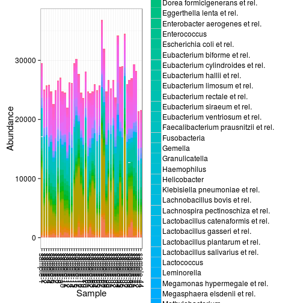
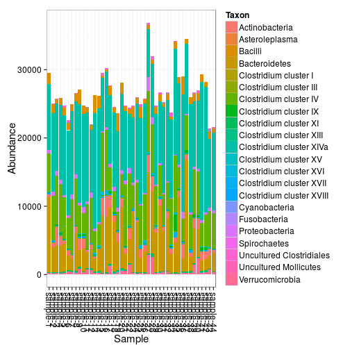

## Microbiota composition


### Barplot visualizations

Also see [phyloseq barplot examples](http://joey711.github.io/phyloseq/plot_bar-examples.html). 

Show OTU absolute abundance in each sample:


```r
# Example data
library(microbiome)
pseq0 <- download_microbiome("dietswap")
```

```
## Downloading data set from O'Keefe et al. Nat. Comm. 6:6342, 2015 from Data Dryad: http://datadryad.org/resource/doi:10.5061/dryad.1mn1n
```

```r
# Pick sample subset
pseq <- subset_samples(pseq, group == "DI" & nationality == "AFR")
```

```
## Error in eval(expr, envir, enclos): object 'nationality' not found
```

```r
# Plot absolute taxon abundances
plot_abundance(pseq)
```

 


Or sum the OTUs at a higher taxonomic level:


```r
plot_abundance(pseq, taxonomic.level = "Phylum")
```

 


Same with relative abundances:


```r
plot_abundance(pseq, taxonomic.level = "Phylum", relative.abundance = TRUE)
```

 


Arrange by sample variable and use custom X axis labels:


```r
# Subset taxa and samples
pseq <- subset_samples(pseq0, group == "DI" & timepoint.within.group == 1)
pseq <- prune_taxa(c("Prevotella melaninogenica et rel.", "Bacteroides fragilis et rel.", "Akkermansia"), pseq)
plot_abundance(pseq, relative.abundance = TRUE, sort.by = "nationality", x.label = "nationality")
```

 

