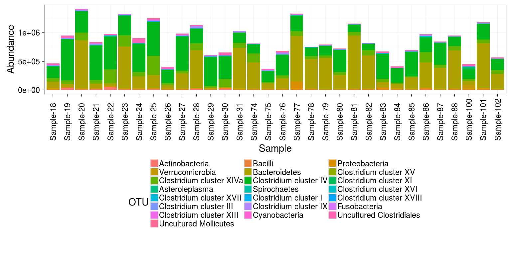
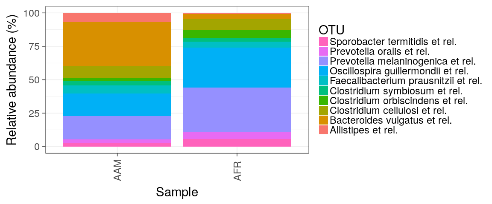
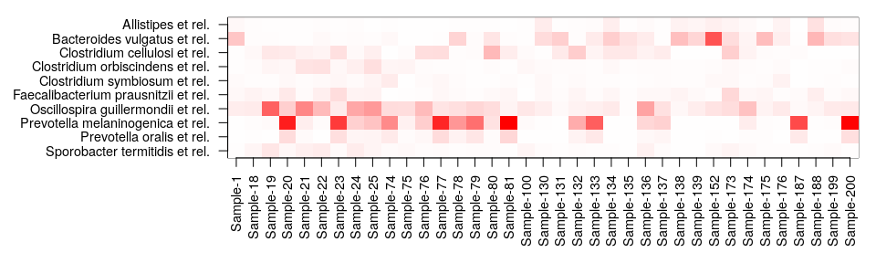
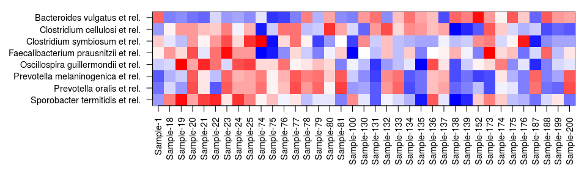
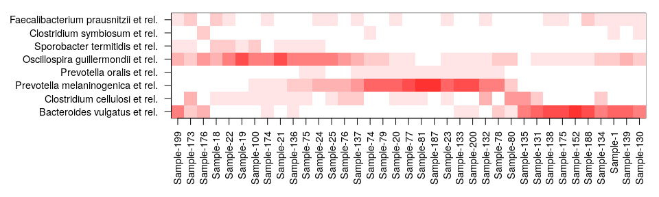
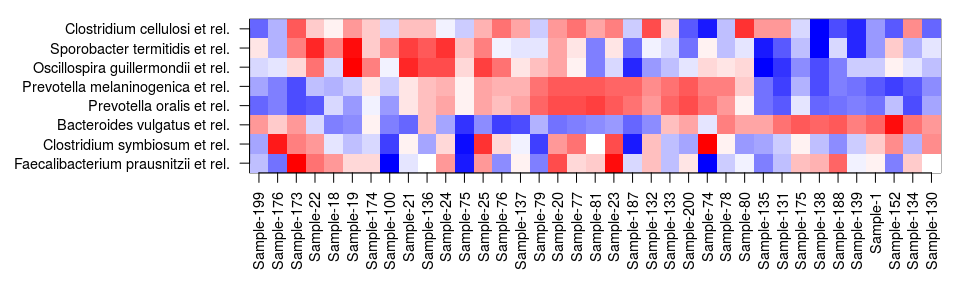

<!--
  %\VignetteEngine{knitr::rmarkdown}
  %\VignetteIndexEntry{microbiome tutorial - composition}
  %\usepackage[utf8]{inputenc}
  %\VignetteEncoding{UTF-8}  
-->
Microbiota composition
----------------------

### Barplots for composition

Also see [phyloseq barplot
examples](http://joey711.github.io/phyloseq/plot_bar-examples.html).

Read example data from a [diet swap
study](http://dx.doi.org/10.1038/ncomms7342):

    # Example data
    library(microbiome)
    data(dietswap)
    pseq <- dietswap

    # Pick sample subset
    library(phyloseq)
    pseq2 <- subset_samples(pseq, group == "DI" & nationality == "AFR")

Show OTU absolute abundance in each sample. Plot absolute taxon
abundances:

    library(ggplot2)
    theme_set(theme_bw(22)) # Black/white color theme
    p <- plot_composition(pseq2, taxonomic.level = "Phylum") +
           theme(legend.position = "bottom") +
           guides(fill = guide_legend(nrow = 10, byrow = TRUE))
    print(p)       

Arrange by sample variable. Focus on the core taxa. Africans have more
Prevotella as expected. Absolute counts:

    # Limit the analysis on core taxa and specific sample group
    pseq2 <- pseq %>%
               core(detection = 10^4, prevalence = .5) %>%
               subset_samples(group == "DI" & timepoint.within.group == 1)

    p <- plot_composition(pseq2,
                          sample.sort = "nationality", # Sort by nationality
                          x.label = "nationality") +   # Label by nationality
      guides(fill = guide_legend(nrow = 5, byrow = TRUE)) +
      theme(legend.position = "bottom")
    print(p)

Same with compositional (relative) abundances:

    p <- plot_composition(pseq2,
              sample.sort = "nationality",
          x.label = "nationality",
          transform = "compositional") +
              guides(fill = guide_legend(ncol = 1))
    print(p)

Averaged by group:

    p <- plot_composition(pseq2,
                 average_by = "nationality", transform = "compositional")
    print(p)

### Composition heatmaps

Plain heatmap on absolute abundances

    theme_set(theme_bw(30))
    p <- plot_composition(pseq2, plot.type = "heatmap", mar = c(6, 13, 1, 1))

Heatmap with Z-transformed OTUs

    p <- plot_composition(pseq2, plot.type = "heatmap", transform = "Z-OTU", mar = c(6, 13, 1, 1))

Same with relative abundance, samples and OTUs sorted with the neatmap
method:

    pseq3 <- transform(pseq2, "compositional")
    p <- plot_composition(pseq3, plot.type = "heatmap", 
                           sample.sort = "neatmap", otu.sort = "neatmap",
                       mar = c(6, 13, 1, 1))

Same with Z-transformed, samples and OTUs sorted manually based on
compositional data (Z-transformed data has negative values and the
sorting method is not yet implemented for that):

    sample.sort <- neatsort(pseq3, method = "NMDS", distance = "bray", target = "sites") 
    otu.sort <- neatsort(pseq3, method = "NMDS", distance = "bray", target = "species")

    p <- plot_composition(pseq2, plot.type = "heatmap", transform = "Z-OTU",
                           sample.sort = sample.sort, otu.sort = otu.sort,
                       mar = c(6, 13, 1, 1))

