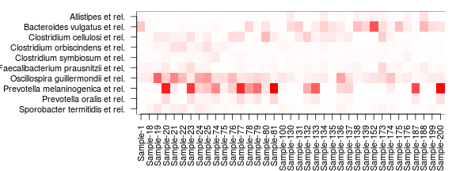
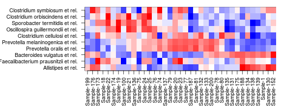
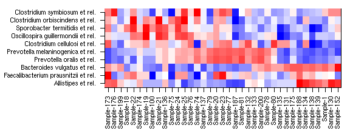

## Microbiota composition


### Barplots for composition

Also see [phyloseq barplot examples](http://joey711.github.io/phyloseq/plot_bar-examples.html) and [HITChip Barplots](Barplots.md)


Read example data from a [diet swap study](http://dx.doi.org/10.1038/ncomms7342):


```r
# Example data
library(microbiome)
data(dietswap)
theme_set(theme_bw(22))
pseq <- dietswap
```

Show OTU absolute abundance in each sample. Plot absolute taxon
abundances (Note: on HITChip data the Phylum level is only
approximate):


```r
# Pick sample subset
library(phyloseq)
pseq2 <- subset_samples(pseq, group == "DI" & nationality == "AFR")
res <- plot_composition(pseq2, taxonomic.level = "Phylum")
res$plot + theme(legend.position = "bottom")
```


Arrange by sample variable and use custom X axis labels. Only consider the most abundant taxa. Africans have more Prevotella as expected. Absolute counts:


```r
# Pick the top OTUs only
top <- names(sort(taxa_sums(pseq), TRUE)[1:10])
pseq3 <- prune_taxa(top, pseq)
pseq3 <- subset_samples(pseq3, group == "DI" & timepoint.within.group == 1)

res <- plot_composition(pseq3, sample.sort = "nationality", x.label = "nationality")
p <- res$plot
p <- p + guides(fill = guide_legend(ncol = 3))
p <- p + theme(legend.position = "bottom")
print(p)
```


Same with relative abundances:


```r
res <- plot_composition(pseq3, sample.sort = "nationality", x.label = "nationality", transformation = "relative.abundance")
p <- res$plot
p <- p + guides(fill = guide_legend(ncol = 1))
p <- p + ylab("Relative Abundance (%)")
#p <- p + theme(legend.position = "bottom")
print(p)
```


### Heatmaps for composition


Plain heatmap


```r
theme_set(theme_bw(30))
res <- plot_composition(pseq3, plot.type = "heatmap")
```




Heatmap with Z-transformed OTUs


```r
res <- plot_composition(pseq3, plot.type = "heatmap", transformation = "Z-OTU")
```


Same, but samples and OTUs sorted with the neatmap method


```r
res <- plot_composition(pseq3, plot.type = "heatmap", transformation = "Z-OTU",
       			       sample.sort = "neatmap", otu.sort = "neatmap")
```




Same, but samples and OTUs sorted manually


```r
sample.sort <- order_neatmap(pseq3, method = "NMDS", distance = "bray", target = "sites", first = NULL) 
otu.sort <- order_neatmap(pseq3, method = "NMDS", distance = "bray", target = "species", first = NULL)
res <- plot_composition(pseq3, plot.type = "heatmap", transformation = "Z-OTU",
       			       sample.sort = sample.sort, otu.sort = otu.sort)
```




