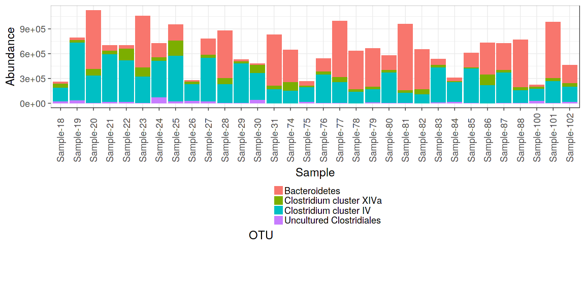
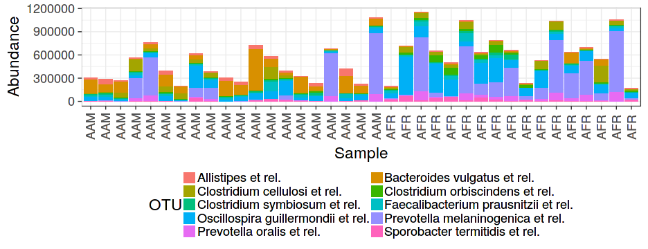
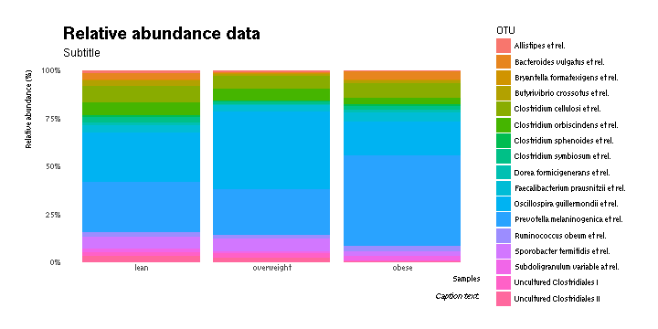
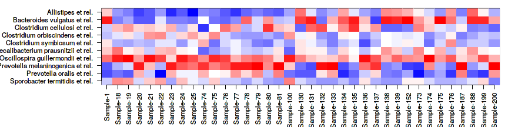
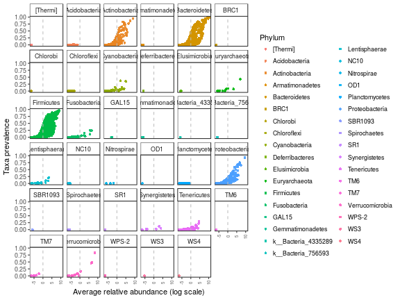

  <!--
  %\VignetteEngine{knitr::rmarkdown}
  %\VignetteIndexEntry{microbiome tutorial - composition}
  %\usepackage[utf8]{inputenc}
  %\VignetteEncoding{UTF-8}  
-->
  
  
## Microbiota composition
  

Also see [phyloseq barplot examples](http://joey711.github.io/phyloseq/plot_bar-examples.html).
  
Read example data from a [diet swap study](http://dx.doi.org/10.1038/ncomms7342):
  

```r
# Example data
library(microbiome)
library(dplyr)
data(dietswap)

# Just use prevalent taxa to speed up examples
# (not absolute counts used in this example)
pseq <- core(dietswap, detection = 10^3, prevalence = 95/100)

# Pick sample subset
library(phyloseq)
pseq2 <- subset_samples(pseq, group == "DI" & nationality == "AFR")
```

### Barplots for composition

Show OTU absolute abundance in each sample. Plot absolute taxon
abundances:
  

```r
library(ggplot2)
theme_set(theme_bw(22)) # Black/white color theme
p <- plot_composition(pseq2, taxonomic.level = "Phylum") +
  theme(legend.position = "bottom") +
  guides(fill = guide_legend(nrow = 10, byrow = TRUE))
print(p)       
```



Arrange by sample variable. Focus on the core taxa. Africans have more Prevotella as expected. Absolute counts:
  

```r
# Limit the analysis on core taxa and specific sample group
pseq2 <- pseq %>%
  core(detection = 10^4, prevalence = .5) %>%
  subset_samples(group == "DI" & timepoint.within.group == 1)

p <- plot_composition(pseq2,
                      sample.sort = "nationality", # Sort by nationality
                      x.label = "nationality") +   # Label by nationality
  guides(fill = guide_legend(nrow = 5, byrow = TRUE)) +
  theme(legend.position = "bottom")
print(p)
```




Same with compositional (relative) abundances:
  

```r
# Try another theme
# from https://github.com/hrbrmstr/hrbrthemes
library(hrbrthemes)
library(gcookbook)
library(tidyverse)

p <- plot_composition(pseq2,
                      sample.sort = "nationality",
                      x.label = "nationality",
                      transform = "compositional") +
     guides(fill = guide_legend(ncol = 1)) +
     scale_y_percent() +
     labs(x="Samples", y="Relative abundance (%)",
                                   title="Relative abundance data",
                                   subtitle="Subtitle",
                                   caption="Caption here 'g'") + 
     theme_ipsum(grid="Y")
print(p)  
```

```
## Warning in grid.Call(L_textBounds, as.graphicsAnnot(x$label), x$x, x$y, :
## font family 'Arial Narrow' not found in PostScript font database

## Warning in grid.Call(L_textBounds, as.graphicsAnnot(x$label), x$x, x$y, :
## font family 'Arial Narrow' not found in PostScript font database

## Warning in grid.Call(L_textBounds, as.graphicsAnnot(x$label), x$x, x$y, :
## font family 'Arial Narrow' not found in PostScript font database

## Warning in grid.Call(L_textBounds, as.graphicsAnnot(x$label), x$x, x$y, :
## font family 'Arial Narrow' not found in PostScript font database

## Warning in grid.Call(L_textBounds, as.graphicsAnnot(x$label), x$x, x$y, :
## font family 'Arial Narrow' not found in PostScript font database

## Warning in grid.Call(L_textBounds, as.graphicsAnnot(x$label), x$x, x$y, :
## font family 'Arial Narrow' not found in PostScript font database

## Warning in grid.Call(L_textBounds, as.graphicsAnnot(x$label), x$x, x$y, :
## font family 'Arial Narrow' not found in PostScript font database

## Warning in grid.Call(L_textBounds, as.graphicsAnnot(x$label), x$x, x$y, :
## font family 'Arial Narrow' not found in PostScript font database

## Warning in grid.Call(L_textBounds, as.graphicsAnnot(x$label), x$x, x$y, :
## font family 'Arial Narrow' not found in PostScript font database

## Warning in grid.Call(L_textBounds, as.graphicsAnnot(x$label), x$x, x$y, :
## font family 'Arial Narrow' not found in PostScript font database

## Warning in grid.Call(L_textBounds, as.graphicsAnnot(x$label), x$x, x$y, :
## font family 'Arial Narrow' not found in PostScript font database

## Warning in grid.Call(L_textBounds, as.graphicsAnnot(x$label), x$x, x$y, :
## font family 'Arial Narrow' not found in PostScript font database

## Warning in grid.Call(L_textBounds, as.graphicsAnnot(x$label), x$x, x$y, :
## font family 'Arial Narrow' not found in PostScript font database

## Warning in grid.Call(L_textBounds, as.graphicsAnnot(x$label), x$x, x$y, :
## font family 'Arial Narrow' not found in PostScript font database

## Warning in grid.Call(L_textBounds, as.graphicsAnnot(x$label), x$x, x$y, :
## font family 'Arial Narrow' not found in PostScript font database

## Warning in grid.Call(L_textBounds, as.graphicsAnnot(x$label), x$x, x$y, :
## font family 'Arial Narrow' not found in PostScript font database

## Warning in grid.Call(L_textBounds, as.graphicsAnnot(x$label), x$x, x$y, :
## font family 'Arial Narrow' not found in PostScript font database

## Warning in grid.Call(L_textBounds, as.graphicsAnnot(x$label), x$x, x$y, :
## font family 'Arial Narrow' not found in PostScript font database

## Warning in grid.Call(L_textBounds, as.graphicsAnnot(x$label), x$x, x$y, :
## font family 'Arial Narrow' not found in PostScript font database

## Warning in grid.Call(L_textBounds, as.graphicsAnnot(x$label), x$x, x$y, :
## font family 'Arial Narrow' not found in PostScript font database

## Warning in grid.Call(L_textBounds, as.graphicsAnnot(x$label), x$x, x$y, :
## font family 'Arial Narrow' not found in PostScript font database

## Warning in grid.Call(L_textBounds, as.graphicsAnnot(x$label), x$x, x$y, :
## font family 'Arial Narrow' not found in PostScript font database

## Warning in grid.Call(L_textBounds, as.graphicsAnnot(x$label), x$x, x$y, :
## font family 'Arial Narrow' not found in PostScript font database

## Warning in grid.Call(L_textBounds, as.graphicsAnnot(x$label), x$x, x$y, :
## font family 'Arial Narrow' not found in PostScript font database

## Warning in grid.Call(L_textBounds, as.graphicsAnnot(x$label), x$x, x$y, :
## font family 'Arial Narrow' not found in PostScript font database

## Warning in grid.Call(L_textBounds, as.graphicsAnnot(x$label), x$x, x$y, :
## font family 'Arial Narrow' not found in PostScript font database

## Warning in grid.Call(L_textBounds, as.graphicsAnnot(x$label), x$x, x$y, :
## font family 'Arial Narrow' not found in PostScript font database

## Warning in grid.Call(L_textBounds, as.graphicsAnnot(x$label), x$x, x$y, :
## font family 'Arial Narrow' not found in PostScript font database

## Warning in grid.Call(L_textBounds, as.graphicsAnnot(x$label), x$x, x$y, :
## font family 'Arial Narrow' not found in PostScript font database

## Warning in grid.Call(L_textBounds, as.graphicsAnnot(x$label), x$x, x$y, :
## font family 'Arial Narrow' not found in PostScript font database

## Warning in grid.Call(L_textBounds, as.graphicsAnnot(x$label), x$x, x$y, :
## font family 'Arial Narrow' not found in PostScript font database

## Warning in grid.Call(L_textBounds, as.graphicsAnnot(x$label), x$x, x$y, :
## font family 'Arial Narrow' not found in PostScript font database

## Warning in grid.Call(L_textBounds, as.graphicsAnnot(x$label), x$x, x$y, :
## font family 'Arial Narrow' not found in PostScript font database

## Warning in grid.Call(L_textBounds, as.graphicsAnnot(x$label), x$x, x$y, :
## font family 'Arial Narrow' not found in PostScript font database

## Warning in grid.Call(L_textBounds, as.graphicsAnnot(x$label), x$x, x$y, :
## font family 'Arial Narrow' not found in PostScript font database

## Warning in grid.Call(L_textBounds, as.graphicsAnnot(x$label), x$x, x$y, :
## font family 'Arial Narrow' not found in PostScript font database

## Warning in grid.Call(L_textBounds, as.graphicsAnnot(x$label), x$x, x$y, :
## font family 'Arial Narrow' not found in PostScript font database

## Warning in grid.Call(L_textBounds, as.graphicsAnnot(x$label), x$x, x$y, :
## font family 'Arial Narrow' not found in PostScript font database

## Warning in grid.Call(L_textBounds, as.graphicsAnnot(x$label), x$x, x$y, :
## font family 'Arial Narrow' not found in PostScript font database

## Warning in grid.Call(L_textBounds, as.graphicsAnnot(x$label), x$x, x$y, :
## font family 'Arial Narrow' not found in PostScript font database

## Warning in grid.Call(L_textBounds, as.graphicsAnnot(x$label), x$x, x$y, :
## font family 'Arial Narrow' not found in PostScript font database

## Warning in grid.Call(L_textBounds, as.graphicsAnnot(x$label), x$x, x$y, :
## font family 'Arial Narrow' not found in PostScript font database

## Warning in grid.Call(L_textBounds, as.graphicsAnnot(x$label), x$x, x$y, :
## font family 'Arial Narrow' not found in PostScript font database

## Warning in grid.Call(L_textBounds, as.graphicsAnnot(x$label), x$x, x$y, :
## font family 'Arial Narrow' not found in PostScript font database

## Warning in grid.Call(L_textBounds, as.graphicsAnnot(x$label), x$x, x$y, :
## font family 'Arial Narrow' not found in PostScript font database

## Warning in grid.Call(L_textBounds, as.graphicsAnnot(x$label), x$x, x$y, :
## font family 'Arial Narrow' not found in PostScript font database

## Warning in grid.Call(L_textBounds, as.graphicsAnnot(x$label), x$x, x$y, :
## font family 'Arial Narrow' not found in PostScript font database

## Warning in grid.Call(L_textBounds, as.graphicsAnnot(x$label), x$x, x$y, :
## font family 'Arial Narrow' not found in PostScript font database

## Warning in grid.Call(L_textBounds, as.graphicsAnnot(x$label), x$x, x$y, :
## font family 'Arial Narrow' not found in PostScript font database

## Warning in grid.Call(L_textBounds, as.graphicsAnnot(x$label), x$x, x$y, :
## font family 'Arial Narrow' not found in PostScript font database

## Warning in grid.Call(L_textBounds, as.graphicsAnnot(x$label), x$x, x$y, :
## font family 'Arial Narrow' not found in PostScript font database

## Warning in grid.Call(L_textBounds, as.graphicsAnnot(x$label), x$x, x$y, :
## font family 'Arial Narrow' not found in PostScript font database

## Warning in grid.Call(L_textBounds, as.graphicsAnnot(x$label), x$x, x$y, :
## font family 'Arial Narrow' not found in PostScript font database

## Warning in grid.Call(L_textBounds, as.graphicsAnnot(x$label), x$x, x$y, :
## font family 'Arial Narrow' not found in PostScript font database

## Warning in grid.Call(L_textBounds, as.graphicsAnnot(x$label), x$x, x$y, :
## font family 'Arial Narrow' not found in PostScript font database

## Warning in grid.Call(L_textBounds, as.graphicsAnnot(x$label), x$x, x$y, :
## font family 'Arial Narrow' not found in PostScript font database

## Warning in grid.Call(L_textBounds, as.graphicsAnnot(x$label), x$x, x$y, :
## font family 'Arial Narrow' not found in PostScript font database

## Warning in grid.Call(L_textBounds, as.graphicsAnnot(x$label), x$x, x$y, :
## font family 'Arial Narrow' not found in PostScript font database

## Warning in grid.Call(L_textBounds, as.graphicsAnnot(x$label), x$x, x$y, :
## font family 'Arial Narrow' not found in PostScript font database

## Warning in grid.Call(L_textBounds, as.graphicsAnnot(x$label), x$x, x$y, :
## font family 'Arial Narrow' not found in PostScript font database

## Warning in grid.Call(L_textBounds, as.graphicsAnnot(x$label), x$x, x$y, :
## font family 'Arial Narrow' not found in PostScript font database

## Warning in grid.Call(L_textBounds, as.graphicsAnnot(x$label), x$x, x$y, :
## font family 'Arial Narrow' not found in PostScript font database

## Warning in grid.Call(L_textBounds, as.graphicsAnnot(x$label), x$x, x$y, :
## font family 'Arial Narrow' not found in PostScript font database

## Warning in grid.Call(L_textBounds, as.graphicsAnnot(x$label), x$x, x$y, :
## font family 'Arial Narrow' not found in PostScript font database

## Warning in grid.Call(L_textBounds, as.graphicsAnnot(x$label), x$x, x$y, :
## font family 'Arial Narrow' not found in PostScript font database

## Warning in grid.Call(L_textBounds, as.graphicsAnnot(x$label), x$x, x$y, :
## font family 'Arial Narrow' not found in PostScript font database

## Warning in grid.Call(L_textBounds, as.graphicsAnnot(x$label), x$x, x$y, :
## font family 'Arial Narrow' not found in PostScript font database

## Warning in grid.Call(L_textBounds, as.graphicsAnnot(x$label), x$x, x$y, :
## font family 'Arial Narrow' not found in PostScript font database

## Warning in grid.Call(L_textBounds, as.graphicsAnnot(x$label), x$x, x$y, :
## font family 'Arial Narrow' not found in PostScript font database

## Warning in grid.Call(L_textBounds, as.graphicsAnnot(x$label), x$x, x$y, :
## font family 'Arial Narrow' not found in PostScript font database

## Warning in grid.Call(L_textBounds, as.graphicsAnnot(x$label), x$x, x$y, :
## font family 'Arial Narrow' not found in PostScript font database

## Warning in grid.Call(L_textBounds, as.graphicsAnnot(x$label), x$x, x$y, :
## font family 'Arial Narrow' not found in PostScript font database

## Warning in grid.Call(L_textBounds, as.graphicsAnnot(x$label), x$x, x$y, :
## font family 'Arial Narrow' not found in PostScript font database

## Warning in grid.Call(L_textBounds, as.graphicsAnnot(x$label), x$x, x$y, :
## font family 'Arial Narrow' not found in PostScript font database

## Warning in grid.Call(L_textBounds, as.graphicsAnnot(x$label), x$x, x$y, :
## font family 'Arial Narrow' not found in PostScript font database

## Warning in grid.Call(L_textBounds, as.graphicsAnnot(x$label), x$x, x$y, :
## font family 'Arial Narrow' not found in PostScript font database

## Warning in grid.Call(L_textBounds, as.graphicsAnnot(x$label), x$x, x$y, :
## font family 'Arial Narrow' not found in PostScript font database

## Warning in grid.Call(L_textBounds, as.graphicsAnnot(x$label), x$x, x$y, :
## font family 'Arial Narrow' not found in PostScript font database

## Warning in grid.Call(L_textBounds, as.graphicsAnnot(x$label), x$x, x$y, :
## font family 'Arial Narrow' not found in PostScript font database

## Warning in grid.Call(L_textBounds, as.graphicsAnnot(x$label), x$x, x$y, :
## font family 'Arial Narrow' not found in PostScript font database

## Warning in grid.Call(L_textBounds, as.graphicsAnnot(x$label), x$x, x$y, :
## font family 'Arial Narrow' not found in PostScript font database

## Warning in grid.Call(L_textBounds, as.graphicsAnnot(x$label), x$x, x$y, :
## font family 'Arial Narrow' not found in PostScript font database

## Warning in grid.Call(L_textBounds, as.graphicsAnnot(x$label), x$x, x$y, :
## font family 'Arial Narrow' not found in PostScript font database

## Warning in grid.Call(L_textBounds, as.graphicsAnnot(x$label), x$x, x$y, :
## font family 'Arial Narrow' not found in PostScript font database

## Warning in grid.Call(L_textBounds, as.graphicsAnnot(x$label), x$x, x$y, :
## font family 'Arial Narrow' not found in PostScript font database

## Warning in grid.Call(L_textBounds, as.graphicsAnnot(x$label), x$x, x$y, :
## font family 'Arial Narrow' not found in PostScript font database

## Warning in grid.Call(L_textBounds, as.graphicsAnnot(x$label), x$x, x$y, :
## font family 'Arial Narrow' not found in PostScript font database

## Warning in grid.Call(L_textBounds, as.graphicsAnnot(x$label), x$x, x$y, :
## font family 'Arial Narrow' not found in PostScript font database

## Warning in grid.Call(L_textBounds, as.graphicsAnnot(x$label), x$x, x$y, :
## font family 'Arial Narrow' not found in PostScript font database

## Warning in grid.Call(L_textBounds, as.graphicsAnnot(x$label), x$x, x$y, :
## font family 'Arial Narrow' not found in PostScript font database

## Warning in grid.Call(L_textBounds, as.graphicsAnnot(x$label), x$x, x$y, :
## font family 'Arial Narrow' not found in PostScript font database

## Warning in grid.Call(L_textBounds, as.graphicsAnnot(x$label), x$x, x$y, :
## font family 'Arial Narrow' not found in PostScript font database

## Warning in grid.Call(L_textBounds, as.graphicsAnnot(x$label), x$x, x$y, :
## font family 'Arial Narrow' not found in PostScript font database

## Warning in grid.Call(L_textBounds, as.graphicsAnnot(x$label), x$x, x$y, :
## font family 'Arial Narrow' not found in PostScript font database

## Warning in grid.Call(L_textBounds, as.graphicsAnnot(x$label), x$x, x$y, :
## font family 'Arial Narrow' not found in PostScript font database

## Warning in grid.Call(L_textBounds, as.graphicsAnnot(x$label), x$x, x$y, :
## font family 'Arial Narrow' not found in PostScript font database

## Warning in grid.Call(L_textBounds, as.graphicsAnnot(x$label), x$x, x$y, :
## font family 'Arial Narrow' not found in PostScript font database

## Warning in grid.Call(L_textBounds, as.graphicsAnnot(x$label), x$x, x$y, :
## font family 'Arial Narrow' not found in PostScript font database

## Warning in grid.Call(L_textBounds, as.graphicsAnnot(x$label), x$x, x$y, :
## font family 'Arial Narrow' not found in PostScript font database

## Warning in grid.Call(L_textBounds, as.graphicsAnnot(x$label), x$x, x$y, :
## font family 'Arial Narrow' not found in PostScript font database

## Warning in grid.Call(L_textBounds, as.graphicsAnnot(x$label), x$x, x$y, :
## font family 'Arial Narrow' not found in PostScript font database

## Warning in grid.Call(L_textBounds, as.graphicsAnnot(x$label), x$x, x$y, :
## font family 'Arial Narrow' not found in PostScript font database

## Warning in grid.Call(L_textBounds, as.graphicsAnnot(x$label), x$x, x$y, :
## font family 'Arial Narrow' not found in PostScript font database

## Warning in grid.Call(L_textBounds, as.graphicsAnnot(x$label), x$x, x$y, :
## font family 'Arial Narrow' not found in PostScript font database

## Warning in grid.Call(L_textBounds, as.graphicsAnnot(x$label), x$x, x$y, :
## font family 'Arial Narrow' not found in PostScript font database

## Warning in grid.Call(L_textBounds, as.graphicsAnnot(x$label), x$x, x$y, :
## font family 'Arial Narrow' not found in PostScript font database

## Warning in grid.Call(L_textBounds, as.graphicsAnnot(x$label), x$x, x$y, :
## font family 'Arial Narrow' not found in PostScript font database

## Warning in grid.Call(L_textBounds, as.graphicsAnnot(x$label), x$x, x$y, :
## font family 'Arial Narrow' not found in PostScript font database

## Warning in grid.Call(L_textBounds, as.graphicsAnnot(x$label), x$x, x$y, :
## font family 'Arial Narrow' not found in PostScript font database

## Warning in grid.Call(L_textBounds, as.graphicsAnnot(x$label), x$x, x$y, :
## font family 'Arial Narrow' not found in PostScript font database

## Warning in grid.Call(L_textBounds, as.graphicsAnnot(x$label), x$x, x$y, :
## font family 'Arial Narrow' not found in PostScript font database

## Warning in grid.Call(L_textBounds, as.graphicsAnnot(x$label), x$x, x$y, :
## font family 'Arial Narrow' not found in PostScript font database

## Warning in grid.Call(L_textBounds, as.graphicsAnnot(x$label), x$x, x$y, :
## font family 'Arial Narrow' not found in PostScript font database

## Warning in grid.Call(L_textBounds, as.graphicsAnnot(x$label), x$x, x$y, :
## font family 'Arial Narrow' not found in PostScript font database

## Warning in grid.Call(L_textBounds, as.graphicsAnnot(x$label), x$x, x$y, :
## font family 'Arial Narrow' not found in PostScript font database

## Warning in grid.Call(L_textBounds, as.graphicsAnnot(x$label), x$x, x$y, :
## font family 'Arial Narrow' not found in PostScript font database

## Warning in grid.Call(L_textBounds, as.graphicsAnnot(x$label), x$x, x$y, :
## font family 'Arial Narrow' not found in PostScript font database

## Warning in grid.Call(L_textBounds, as.graphicsAnnot(x$label), x$x, x$y, :
## font family 'Arial Narrow' not found in PostScript font database

## Warning in grid.Call(L_textBounds, as.graphicsAnnot(x$label), x$x, x$y, :
## font family 'Arial Narrow' not found in PostScript font database

## Warning in grid.Call(L_textBounds, as.graphicsAnnot(x$label), x$x, x$y, :
## font family 'Arial Narrow' not found in PostScript font database

## Warning in grid.Call(L_textBounds, as.graphicsAnnot(x$label), x$x, x$y, :
## font family 'Arial Narrow' not found in PostScript font database

## Warning in grid.Call(L_textBounds, as.graphicsAnnot(x$label), x$x, x$y, :
## font family 'Arial Narrow' not found in PostScript font database

## Warning in grid.Call(L_textBounds, as.graphicsAnnot(x$label), x$x, x$y, :
## font family 'Arial Narrow' not found in PostScript font database

## Warning in grid.Call(L_textBounds, as.graphicsAnnot(x$label), x$x, x$y, :
## font family 'Arial Narrow' not found in PostScript font database

## Warning in grid.Call(L_textBounds, as.graphicsAnnot(x$label), x$x, x$y, :
## font family 'Arial Narrow' not found in PostScript font database

## Warning in grid.Call(L_textBounds, as.graphicsAnnot(x$label), x$x, x$y, :
## font family 'Arial Narrow' not found in PostScript font database

## Warning in grid.Call(L_textBounds, as.graphicsAnnot(x$label), x$x, x$y, :
## font family 'Arial Narrow' not found in PostScript font database

## Warning in grid.Call(L_textBounds, as.graphicsAnnot(x$label), x$x, x$y, :
## font family 'Arial Narrow' not found in PostScript font database

## Warning in grid.Call(L_textBounds, as.graphicsAnnot(x$label), x$x, x$y, :
## font family 'Arial Narrow' not found in PostScript font database

## Warning in grid.Call(L_textBounds, as.graphicsAnnot(x$label), x$x, x$y, :
## font family 'Arial Narrow' not found in PostScript font database

## Warning in grid.Call(L_textBounds, as.graphicsAnnot(x$label), x$x, x$y, :
## font family 'Arial Narrow' not found in PostScript font database

## Warning in grid.Call(L_textBounds, as.graphicsAnnot(x$label), x$x, x$y, :
## font family 'Arial Narrow' not found in PostScript font database

## Warning in grid.Call(L_textBounds, as.graphicsAnnot(x$label), x$x, x$y, :
## font family 'Arial Narrow' not found in PostScript font database

## Warning in grid.Call(L_textBounds, as.graphicsAnnot(x$label), x$x, x$y, :
## font family 'Arial Narrow' not found in PostScript font database

## Warning in grid.Call(L_textBounds, as.graphicsAnnot(x$label), x$x, x$y, :
## font family 'Arial Narrow' not found in PostScript font database

## Warning in grid.Call(L_textBounds, as.graphicsAnnot(x$label), x$x, x$y, :
## font family 'Arial Narrow' not found in PostScript font database

## Warning in grid.Call(L_textBounds, as.graphicsAnnot(x$label), x$x, x$y, :
## font family 'Arial Narrow' not found in PostScript font database

## Warning in grid.Call(L_textBounds, as.graphicsAnnot(x$label), x$x, x$y, :
## font family 'Arial Narrow' not found in PostScript font database

## Warning in grid.Call(L_textBounds, as.graphicsAnnot(x$label), x$x, x$y, :
## font family 'Arial Narrow' not found in PostScript font database

## Warning in grid.Call(L_textBounds, as.graphicsAnnot(x$label), x$x, x$y, :
## font family 'Arial Narrow' not found in PostScript font database

## Warning in grid.Call(L_textBounds, as.graphicsAnnot(x$label), x$x, x$y, :
## font family 'Arial Narrow' not found in PostScript font database

## Warning in grid.Call(L_textBounds, as.graphicsAnnot(x$label), x$x, x$y, :
## font family 'Arial Narrow' not found in PostScript font database

## Warning in grid.Call(L_textBounds, as.graphicsAnnot(x$label), x$x, x$y, :
## font family 'Arial Narrow' not found in PostScript font database

## Warning in grid.Call(L_textBounds, as.graphicsAnnot(x$label), x$x, x$y, :
## font family 'Arial Narrow' not found in PostScript font database

## Warning in grid.Call(L_textBounds, as.graphicsAnnot(x$label), x$x, x$y, :
## font family 'Arial Narrow' not found in PostScript font database

## Warning in grid.Call(L_textBounds, as.graphicsAnnot(x$label), x$x, x$y, :
## font family 'Arial Narrow' not found in PostScript font database

## Warning in grid.Call(L_textBounds, as.graphicsAnnot(x$label), x$x, x$y, :
## font family 'Arial Narrow' not found in PostScript font database

## Warning in grid.Call(L_textBounds, as.graphicsAnnot(x$label), x$x, x$y, :
## font family 'Arial Narrow' not found in PostScript font database

## Warning in grid.Call(L_textBounds, as.graphicsAnnot(x$label), x$x, x$y, :
## font family 'Arial Narrow' not found in PostScript font database

## Warning in grid.Call(L_textBounds, as.graphicsAnnot(x$label), x$x, x$y, :
## font family 'Arial Narrow' not found in PostScript font database

## Warning in grid.Call(L_textBounds, as.graphicsAnnot(x$label), x$x, x$y, :
## font family 'Arial Narrow' not found in PostScript font database

## Warning in grid.Call(L_textBounds, as.graphicsAnnot(x$label), x$x, x$y, :
## font family 'Arial Narrow' not found in PostScript font database

## Warning in grid.Call(L_textBounds, as.graphicsAnnot(x$label), x$x, x$y, :
## font family 'Arial Narrow' not found in PostScript font database

## Warning in grid.Call(L_textBounds, as.graphicsAnnot(x$label), x$x, x$y, :
## font family 'Arial Narrow' not found in PostScript font database

## Warning in grid.Call(L_textBounds, as.graphicsAnnot(x$label), x$x, x$y, :
## font family 'Arial Narrow' not found in PostScript font database

## Warning in grid.Call(L_textBounds, as.graphicsAnnot(x$label), x$x, x$y, :
## font family 'Arial Narrow' not found in PostScript font database

## Warning in grid.Call(L_textBounds, as.graphicsAnnot(x$label), x$x, x$y, :
## font family 'Arial Narrow' not found in PostScript font database

## Warning in grid.Call(L_textBounds, as.graphicsAnnot(x$label), x$x, x$y, :
## font family 'Arial Narrow' not found in PostScript font database

## Warning in grid.Call(L_textBounds, as.graphicsAnnot(x$label), x$x, x$y, :
## font family 'Arial Narrow' not found in PostScript font database

## Warning in grid.Call(L_textBounds, as.graphicsAnnot(x$label), x$x, x$y, :
## font family 'Arial Narrow' not found in PostScript font database

## Warning in grid.Call(L_textBounds, as.graphicsAnnot(x$label), x$x, x$y, :
## font family 'Arial Narrow' not found in PostScript font database

## Warning in grid.Call(L_textBounds, as.graphicsAnnot(x$label), x$x, x$y, :
## font family 'Arial Narrow' not found in PostScript font database

## Warning in grid.Call(L_textBounds, as.graphicsAnnot(x$label), x$x, x$y, :
## font family 'Arial Narrow' not found in PostScript font database

## Warning in grid.Call(L_textBounds, as.graphicsAnnot(x$label), x$x, x$y, :
## font family 'Arial Narrow' not found in PostScript font database

## Warning in grid.Call(L_textBounds, as.graphicsAnnot(x$label), x$x, x$y, :
## font family 'Arial Narrow' not found in PostScript font database

## Warning in grid.Call(L_textBounds, as.graphicsAnnot(x$label), x$x, x$y, :
## font family 'Arial Narrow' not found in PostScript font database

## Warning in grid.Call(L_textBounds, as.graphicsAnnot(x$label), x$x, x$y, :
## font family 'Arial Narrow' not found in PostScript font database

## Warning in grid.Call(L_textBounds, as.graphicsAnnot(x$label), x$x, x$y, :
## font family 'Arial Narrow' not found in PostScript font database

## Warning in grid.Call(L_textBounds, as.graphicsAnnot(x$label), x$x, x$y, :
## font family 'Arial Narrow' not found in PostScript font database

## Warning in grid.Call(L_textBounds, as.graphicsAnnot(x$label), x$x, x$y, :
## font family 'Arial Narrow' not found in PostScript font database

## Warning in grid.Call(L_textBounds, as.graphicsAnnot(x$label), x$x, x$y, :
## font family 'Arial Narrow' not found in PostScript font database

## Warning in grid.Call(L_textBounds, as.graphicsAnnot(x$label), x$x, x$y, :
## font family 'Arial Narrow' not found in PostScript font database

## Warning in grid.Call(L_textBounds, as.graphicsAnnot(x$label), x$x, x$y, :
## font family 'Arial Narrow' not found in PostScript font database

## Warning in grid.Call(L_textBounds, as.graphicsAnnot(x$label), x$x, x$y, :
## font family 'Arial Narrow' not found in PostScript font database

## Warning in grid.Call(L_textBounds, as.graphicsAnnot(x$label), x$x, x$y, :
## font family 'Arial Narrow' not found in PostScript font database

## Warning in grid.Call(L_textBounds, as.graphicsAnnot(x$label), x$x, x$y, :
## font family 'Arial Narrow' not found in PostScript font database

## Warning in grid.Call(L_textBounds, as.graphicsAnnot(x$label), x$x, x$y, :
## font family 'Arial Narrow' not found in PostScript font database

## Warning in grid.Call(L_textBounds, as.graphicsAnnot(x$label), x$x, x$y, :
## font family 'Arial Narrow' not found in PostScript font database

## Warning in grid.Call(L_textBounds, as.graphicsAnnot(x$label), x$x, x$y, :
## font family 'Arial Narrow' not found in PostScript font database

## Warning in grid.Call(L_textBounds, as.graphicsAnnot(x$label), x$x, x$y, :
## font family 'Arial Narrow' not found in PostScript font database

## Warning in grid.Call(L_textBounds, as.graphicsAnnot(x$label), x$x, x$y, :
## font family 'Arial Narrow' not found in PostScript font database

## Warning in grid.Call(L_textBounds, as.graphicsAnnot(x$label), x$x, x$y, :
## font family 'Arial Narrow' not found in PostScript font database

## Warning in grid.Call(L_textBounds, as.graphicsAnnot(x$label), x$x, x$y, :
## font family 'Arial Narrow' not found in PostScript font database

## Warning in grid.Call(L_textBounds, as.graphicsAnnot(x$label), x$x, x$y, :
## font family 'Arial Narrow' not found in PostScript font database

## Warning in grid.Call(L_textBounds, as.graphicsAnnot(x$label), x$x, x$y, :
## font family 'Arial Narrow' not found in PostScript font database

## Warning in grid.Call(L_textBounds, as.graphicsAnnot(x$label), x$x, x$y, :
## font family 'Arial Narrow' not found in PostScript font database

## Warning in grid.Call(L_textBounds, as.graphicsAnnot(x$label), x$x, x$y, :
## font family 'Arial Narrow' not found in PostScript font database

## Warning in grid.Call(L_textBounds, as.graphicsAnnot(x$label), x$x, x$y, :
## font family 'Arial Narrow' not found in PostScript font database

## Warning in grid.Call(L_textBounds, as.graphicsAnnot(x$label), x$x, x$y, :
## font family 'Arial Narrow' not found in PostScript font database

## Warning in grid.Call(L_textBounds, as.graphicsAnnot(x$label), x$x, x$y, :
## font family 'Arial Narrow' not found in PostScript font database

## Warning in grid.Call(L_textBounds, as.graphicsAnnot(x$label), x$x, x$y, :
## font family 'Arial Narrow' not found in PostScript font database

## Warning in grid.Call(L_textBounds, as.graphicsAnnot(x$label), x$x, x$y, :
## font family 'Arial Narrow' not found in PostScript font database

## Warning in grid.Call(L_textBounds, as.graphicsAnnot(x$label), x$x, x$y, :
## font family 'Arial Narrow' not found in PostScript font database

## Warning in grid.Call(L_textBounds, as.graphicsAnnot(x$label), x$x, x$y, :
## font family 'Arial Narrow' not found in PostScript font database

## Warning in grid.Call(L_textBounds, as.graphicsAnnot(x$label), x$x, x$y, :
## font family 'Arial Narrow' not found in PostScript font database

## Warning in grid.Call(L_textBounds, as.graphicsAnnot(x$label), x$x, x$y, :
## font family 'Arial Narrow' not found in PostScript font database

## Warning in grid.Call(L_textBounds, as.graphicsAnnot(x$label), x$x, x$y, :
## font family 'Arial Narrow' not found in PostScript font database

## Warning in grid.Call(L_textBounds, as.graphicsAnnot(x$label), x$x, x$y, :
## font family 'Arial Narrow' not found in PostScript font database

## Warning in grid.Call(L_textBounds, as.graphicsAnnot(x$label), x$x, x$y, :
## font family 'Arial Narrow' not found in PostScript font database

## Warning in grid.Call(L_textBounds, as.graphicsAnnot(x$label), x$x, x$y, :
## font family 'Arial Narrow' not found in PostScript font database

## Warning in grid.Call(L_textBounds, as.graphicsAnnot(x$label), x$x, x$y, :
## font family 'Arial Narrow' not found in PostScript font database

## Warning in grid.Call(L_textBounds, as.graphicsAnnot(x$label), x$x, x$y, :
## font family 'Arial Narrow' not found in PostScript font database

## Warning in grid.Call(L_textBounds, as.graphicsAnnot(x$label), x$x, x$y, :
## font family 'Arial Narrow' not found in PostScript font database

## Warning in grid.Call(L_textBounds, as.graphicsAnnot(x$label), x$x, x$y, :
## font family 'Arial Narrow' not found in PostScript font database

## Warning in grid.Call(L_textBounds, as.graphicsAnnot(x$label), x$x, x$y, :
## font family 'Arial Narrow' not found in PostScript font database

## Warning in grid.Call(L_textBounds, as.graphicsAnnot(x$label), x$x, x$y, :
## font family 'Arial Narrow' not found in PostScript font database

## Warning in grid.Call(L_textBounds, as.graphicsAnnot(x$label), x$x, x$y, :
## font family 'Arial Narrow' not found in PostScript font database

## Warning in grid.Call(L_textBounds, as.graphicsAnnot(x$label), x$x, x$y, :
## font family 'Arial Narrow' not found in PostScript font database

## Warning in grid.Call(L_textBounds, as.graphicsAnnot(x$label), x$x, x$y, :
## font family 'Arial Narrow' not found in PostScript font database

## Warning in grid.Call(L_textBounds, as.graphicsAnnot(x$label), x$x, x$y, :
## font family 'Arial Narrow' not found in PostScript font database

## Warning in grid.Call(L_textBounds, as.graphicsAnnot(x$label), x$x, x$y, :
## font family 'Arial Narrow' not found in PostScript font database

## Warning in grid.Call(L_textBounds, as.graphicsAnnot(x$label), x$x, x$y, :
## font family 'Arial Narrow' not found in PostScript font database

## Warning in grid.Call(L_textBounds, as.graphicsAnnot(x$label), x$x, x$y, :
## font family 'Arial Narrow' not found in PostScript font database

## Warning in grid.Call(L_textBounds, as.graphicsAnnot(x$label), x$x, x$y, :
## font family 'Arial Narrow' not found in PostScript font database

## Warning in grid.Call(L_textBounds, as.graphicsAnnot(x$label), x$x, x$y, :
## font family 'Arial Narrow' not found in PostScript font database

## Warning in grid.Call(L_textBounds, as.graphicsAnnot(x$label), x$x, x$y, :
## font family 'Arial Narrow' not found in PostScript font database

## Warning in grid.Call(L_textBounds, as.graphicsAnnot(x$label), x$x, x$y, :
## font family 'Arial Narrow' not found in PostScript font database

## Warning in grid.Call(L_textBounds, as.graphicsAnnot(x$label), x$x, x$y, :
## font family 'Arial Narrow' not found in PostScript font database

## Warning in grid.Call(L_textBounds, as.graphicsAnnot(x$label), x$x, x$y, :
## font family 'Arial Narrow' not found in PostScript font database

## Warning in grid.Call(L_textBounds, as.graphicsAnnot(x$label), x$x, x$y, :
## font family 'Arial Narrow' not found in PostScript font database

## Warning in grid.Call(L_textBounds, as.graphicsAnnot(x$label), x$x, x$y, :
## font family 'Arial Narrow' not found in PostScript font database

## Warning in grid.Call(L_textBounds, as.graphicsAnnot(x$label), x$x, x$y, :
## font family 'Arial Narrow' not found in PostScript font database

## Warning in grid.Call(L_textBounds, as.graphicsAnnot(x$label), x$x, x$y, :
## font family 'Arial Narrow' not found in PostScript font database

## Warning in grid.Call(L_textBounds, as.graphicsAnnot(x$label), x$x, x$y, :
## font family 'Arial Narrow' not found in PostScript font database

## Warning in grid.Call(L_textBounds, as.graphicsAnnot(x$label), x$x, x$y, :
## font family 'Arial Narrow' not found in PostScript font database

## Warning in grid.Call(L_textBounds, as.graphicsAnnot(x$label), x$x, x$y, :
## font family 'Arial Narrow' not found in PostScript font database

## Warning in grid.Call(L_textBounds, as.graphicsAnnot(x$label), x$x, x$y, :
## font family 'Arial Narrow' not found in PostScript font database

## Warning in grid.Call(L_textBounds, as.graphicsAnnot(x$label), x$x, x$y, :
## font family 'Arial Narrow' not found in PostScript font database

## Warning in grid.Call(L_textBounds, as.graphicsAnnot(x$label), x$x, x$y, :
## font family 'Arial Narrow' not found in PostScript font database

## Warning in grid.Call(L_textBounds, as.graphicsAnnot(x$label), x$x, x$y, :
## font family 'Arial Narrow' not found in PostScript font database

## Warning in grid.Call(L_textBounds, as.graphicsAnnot(x$label), x$x, x$y, :
## font family 'Arial Narrow' not found in PostScript font database

## Warning in grid.Call(L_textBounds, as.graphicsAnnot(x$label), x$x, x$y, :
## font family 'Arial Narrow' not found in PostScript font database

## Warning in grid.Call(L_textBounds, as.graphicsAnnot(x$label), x$x, x$y, :
## font family 'Arial Narrow' not found in PostScript font database

## Warning in grid.Call(L_textBounds, as.graphicsAnnot(x$label), x$x, x$y, :
## font family 'Arial Narrow' not found in PostScript font database

## Warning in grid.Call(L_textBounds, as.graphicsAnnot(x$label), x$x, x$y, :
## font family 'Arial Narrow' not found in PostScript font database

## Warning in grid.Call(L_textBounds, as.graphicsAnnot(x$label), x$x, x$y, :
## font family 'Arial Narrow' not found in PostScript font database

## Warning in grid.Call(L_textBounds, as.graphicsAnnot(x$label), x$x, x$y, :
## font family 'Arial Narrow' not found in PostScript font database

## Warning in grid.Call(L_textBounds, as.graphicsAnnot(x$label), x$x, x$y, :
## font family 'Arial Narrow' not found in PostScript font database

## Warning in grid.Call(L_textBounds, as.graphicsAnnot(x$label), x$x, x$y, :
## font family 'Arial Narrow' not found in PostScript font database

## Warning in grid.Call(L_textBounds, as.graphicsAnnot(x$label), x$x, x$y, :
## font family 'Arial Narrow' not found in PostScript font database

## Warning in grid.Call(L_textBounds, as.graphicsAnnot(x$label), x$x, x$y, :
## font family 'Arial Narrow' not found in PostScript font database

## Warning in grid.Call(L_textBounds, as.graphicsAnnot(x$label), x$x, x$y, :
## font family 'Arial Narrow' not found in PostScript font database

## Warning in grid.Call(L_textBounds, as.graphicsAnnot(x$label), x$x, x$y, :
## font family 'Arial Narrow' not found in PostScript font database
```

```
## Warning in grid.Call.graphics(L_text, as.graphicsAnnot(x$label), x$x, x
## $y, : font family 'Arial Narrow' not found in PostScript font database

## Warning in grid.Call.graphics(L_text, as.graphicsAnnot(x$label), x$x, x
## $y, : font family 'Arial Narrow' not found in PostScript font database

## Warning in grid.Call.graphics(L_text, as.graphicsAnnot(x$label), x$x, x
## $y, : font family 'Arial Narrow' not found in PostScript font database

## Warning in grid.Call.graphics(L_text, as.graphicsAnnot(x$label), x$x, x
## $y, : font family 'Arial Narrow' not found in PostScript font database

## Warning in grid.Call.graphics(L_text, as.graphicsAnnot(x$label), x$x, x
## $y, : font family 'Arial Narrow' not found in PostScript font database
```

```
## Warning in grid.Call(L_textBounds, as.graphicsAnnot(x$label), x$x, x$y, :
## font family 'Arial Narrow' not found in PostScript font database

## Warning in grid.Call(L_textBounds, as.graphicsAnnot(x$label), x$x, x$y, :
## font family 'Arial Narrow' not found in PostScript font database

## Warning in grid.Call(L_textBounds, as.graphicsAnnot(x$label), x$x, x$y, :
## font family 'Arial Narrow' not found in PostScript font database

## Warning in grid.Call(L_textBounds, as.graphicsAnnot(x$label), x$x, x$y, :
## font family 'Arial Narrow' not found in PostScript font database

## Warning in grid.Call(L_textBounds, as.graphicsAnnot(x$label), x$x, x$y, :
## font family 'Arial Narrow' not found in PostScript font database

## Warning in grid.Call(L_textBounds, as.graphicsAnnot(x$label), x$x, x$y, :
## font family 'Arial Narrow' not found in PostScript font database

## Warning in grid.Call(L_textBounds, as.graphicsAnnot(x$label), x$x, x$y, :
## font family 'Arial Narrow' not found in PostScript font database

## Warning in grid.Call(L_textBounds, as.graphicsAnnot(x$label), x$x, x$y, :
## font family 'Arial Narrow' not found in PostScript font database

## Warning in grid.Call(L_textBounds, as.graphicsAnnot(x$label), x$x, x$y, :
## font family 'Arial Narrow' not found in PostScript font database

## Warning in grid.Call(L_textBounds, as.graphicsAnnot(x$label), x$x, x$y, :
## font family 'Arial Narrow' not found in PostScript font database

## Warning in grid.Call(L_textBounds, as.graphicsAnnot(x$label), x$x, x$y, :
## font family 'Arial Narrow' not found in PostScript font database

## Warning in grid.Call(L_textBounds, as.graphicsAnnot(x$label), x$x, x$y, :
## font family 'Arial Narrow' not found in PostScript font database

## Warning in grid.Call(L_textBounds, as.graphicsAnnot(x$label), x$x, x$y, :
## font family 'Arial Narrow' not found in PostScript font database

## Warning in grid.Call(L_textBounds, as.graphicsAnnot(x$label), x$x, x$y, :
## font family 'Arial Narrow' not found in PostScript font database

## Warning in grid.Call(L_textBounds, as.graphicsAnnot(x$label), x$x, x$y, :
## font family 'Arial Narrow' not found in PostScript font database

## Warning in grid.Call(L_textBounds, as.graphicsAnnot(x$label), x$x, x$y, :
## font family 'Arial Narrow' not found in PostScript font database

## Warning in grid.Call(L_textBounds, as.graphicsAnnot(x$label), x$x, x$y, :
## font family 'Arial Narrow' not found in PostScript font database

## Warning in grid.Call(L_textBounds, as.graphicsAnnot(x$label), x$x, x$y, :
## font family 'Arial Narrow' not found in PostScript font database

## Warning in grid.Call(L_textBounds, as.graphicsAnnot(x$label), x$x, x$y, :
## font family 'Arial Narrow' not found in PostScript font database

## Warning in grid.Call(L_textBounds, as.graphicsAnnot(x$label), x$x, x$y, :
## font family 'Arial Narrow' not found in PostScript font database

## Warning in grid.Call(L_textBounds, as.graphicsAnnot(x$label), x$x, x$y, :
## font family 'Arial Narrow' not found in PostScript font database

## Warning in grid.Call(L_textBounds, as.graphicsAnnot(x$label), x$x, x$y, :
## font family 'Arial Narrow' not found in PostScript font database

## Warning in grid.Call(L_textBounds, as.graphicsAnnot(x$label), x$x, x$y, :
## font family 'Arial Narrow' not found in PostScript font database

## Warning in grid.Call(L_textBounds, as.graphicsAnnot(x$label), x$x, x$y, :
## font family 'Arial Narrow' not found in PostScript font database

## Warning in grid.Call(L_textBounds, as.graphicsAnnot(x$label), x$x, x$y, :
## font family 'Arial Narrow' not found in PostScript font database

## Warning in grid.Call(L_textBounds, as.graphicsAnnot(x$label), x$x, x$y, :
## font family 'Arial Narrow' not found in PostScript font database

## Warning in grid.Call(L_textBounds, as.graphicsAnnot(x$label), x$x, x$y, :
## font family 'Arial Narrow' not found in PostScript font database

## Warning in grid.Call(L_textBounds, as.graphicsAnnot(x$label), x$x, x$y, :
## font family 'Arial Narrow' not found in PostScript font database

## Warning in grid.Call(L_textBounds, as.graphicsAnnot(x$label), x$x, x$y, :
## font family 'Arial Narrow' not found in PostScript font database

## Warning in grid.Call(L_textBounds, as.graphicsAnnot(x$label), x$x, x$y, :
## font family 'Arial Narrow' not found in PostScript font database

## Warning in grid.Call(L_textBounds, as.graphicsAnnot(x$label), x$x, x$y, :
## font family 'Arial Narrow' not found in PostScript font database

## Warning in grid.Call(L_textBounds, as.graphicsAnnot(x$label), x$x, x$y, :
## font family 'Arial Narrow' not found in PostScript font database

## Warning in grid.Call(L_textBounds, as.graphicsAnnot(x$label), x$x, x$y, :
## font family 'Arial Narrow' not found in PostScript font database

## Warning in grid.Call(L_textBounds, as.graphicsAnnot(x$label), x$x, x$y, :
## font family 'Arial Narrow' not found in PostScript font database

## Warning in grid.Call(L_textBounds, as.graphicsAnnot(x$label), x$x, x$y, :
## font family 'Arial Narrow' not found in PostScript font database

## Warning in grid.Call(L_textBounds, as.graphicsAnnot(x$label), x$x, x$y, :
## font family 'Arial Narrow' not found in PostScript font database

## Warning in grid.Call(L_textBounds, as.graphicsAnnot(x$label), x$x, x$y, :
## font family 'Arial Narrow' not found in PostScript font database

## Warning in grid.Call(L_textBounds, as.graphicsAnnot(x$label), x$x, x$y, :
## font family 'Arial Narrow' not found in PostScript font database

## Warning in grid.Call(L_textBounds, as.graphicsAnnot(x$label), x$x, x$y, :
## font family 'Arial Narrow' not found in PostScript font database

## Warning in grid.Call(L_textBounds, as.graphicsAnnot(x$label), x$x, x$y, :
## font family 'Arial Narrow' not found in PostScript font database

## Warning in grid.Call(L_textBounds, as.graphicsAnnot(x$label), x$x, x$y, :
## font family 'Arial Narrow' not found in PostScript font database

## Warning in grid.Call(L_textBounds, as.graphicsAnnot(x$label), x$x, x$y, :
## font family 'Arial Narrow' not found in PostScript font database

## Warning in grid.Call(L_textBounds, as.graphicsAnnot(x$label), x$x, x$y, :
## font family 'Arial Narrow' not found in PostScript font database

## Warning in grid.Call(L_textBounds, as.graphicsAnnot(x$label), x$x, x$y, :
## font family 'Arial Narrow' not found in PostScript font database

## Warning in grid.Call(L_textBounds, as.graphicsAnnot(x$label), x$x, x$y, :
## font family 'Arial Narrow' not found in PostScript font database

## Warning in grid.Call(L_textBounds, as.graphicsAnnot(x$label), x$x, x$y, :
## font family 'Arial Narrow' not found in PostScript font database

## Warning in grid.Call(L_textBounds, as.graphicsAnnot(x$label), x$x, x$y, :
## font family 'Arial Narrow' not found in PostScript font database

## Warning in grid.Call(L_textBounds, as.graphicsAnnot(x$label), x$x, x$y, :
## font family 'Arial Narrow' not found in PostScript font database

## Warning in grid.Call(L_textBounds, as.graphicsAnnot(x$label), x$x, x$y, :
## font family 'Arial Narrow' not found in PostScript font database

## Warning in grid.Call(L_textBounds, as.graphicsAnnot(x$label), x$x, x$y, :
## font family 'Arial Narrow' not found in PostScript font database

## Warning in grid.Call(L_textBounds, as.graphicsAnnot(x$label), x$x, x$y, :
## font family 'Arial Narrow' not found in PostScript font database

## Warning in grid.Call(L_textBounds, as.graphicsAnnot(x$label), x$x, x$y, :
## font family 'Arial Narrow' not found in PostScript font database

## Warning in grid.Call(L_textBounds, as.graphicsAnnot(x$label), x$x, x$y, :
## font family 'Arial Narrow' not found in PostScript font database

## Warning in grid.Call(L_textBounds, as.graphicsAnnot(x$label), x$x, x$y, :
## font family 'Arial Narrow' not found in PostScript font database

## Warning in grid.Call(L_textBounds, as.graphicsAnnot(x$label), x$x, x$y, :
## font family 'Arial Narrow' not found in PostScript font database

## Warning in grid.Call(L_textBounds, as.graphicsAnnot(x$label), x$x, x$y, :
## font family 'Arial Narrow' not found in PostScript font database

## Warning in grid.Call(L_textBounds, as.graphicsAnnot(x$label), x$x, x$y, :
## font family 'Arial Narrow' not found in PostScript font database

## Warning in grid.Call(L_textBounds, as.graphicsAnnot(x$label), x$x, x$y, :
## font family 'Arial Narrow' not found in PostScript font database

## Warning in grid.Call(L_textBounds, as.graphicsAnnot(x$label), x$x, x$y, :
## font family 'Arial Narrow' not found in PostScript font database

## Warning in grid.Call(L_textBounds, as.graphicsAnnot(x$label), x$x, x$y, :
## font family 'Arial Narrow' not found in PostScript font database

## Warning in grid.Call(L_textBounds, as.graphicsAnnot(x$label), x$x, x$y, :
## font family 'Arial Narrow' not found in PostScript font database

## Warning in grid.Call(L_textBounds, as.graphicsAnnot(x$label), x$x, x$y, :
## font family 'Arial Narrow' not found in PostScript font database

## Warning in grid.Call(L_textBounds, as.graphicsAnnot(x$label), x$x, x$y, :
## font family 'Arial Narrow' not found in PostScript font database

## Warning in grid.Call(L_textBounds, as.graphicsAnnot(x$label), x$x, x$y, :
## font family 'Arial Narrow' not found in PostScript font database

## Warning in grid.Call(L_textBounds, as.graphicsAnnot(x$label), x$x, x$y, :
## font family 'Arial Narrow' not found in PostScript font database

## Warning in grid.Call(L_textBounds, as.graphicsAnnot(x$label), x$x, x$y, :
## font family 'Arial Narrow' not found in PostScript font database

## Warning in grid.Call(L_textBounds, as.graphicsAnnot(x$label), x$x, x$y, :
## font family 'Arial Narrow' not found in PostScript font database

## Warning in grid.Call(L_textBounds, as.graphicsAnnot(x$label), x$x, x$y, :
## font family 'Arial Narrow' not found in PostScript font database

## Warning in grid.Call(L_textBounds, as.graphicsAnnot(x$label), x$x, x$y, :
## font family 'Arial Narrow' not found in PostScript font database

## Warning in grid.Call(L_textBounds, as.graphicsAnnot(x$label), x$x, x$y, :
## font family 'Arial Narrow' not found in PostScript font database

## Warning in grid.Call(L_textBounds, as.graphicsAnnot(x$label), x$x, x$y, :
## font family 'Arial Narrow' not found in PostScript font database

## Warning in grid.Call(L_textBounds, as.graphicsAnnot(x$label), x$x, x$y, :
## font family 'Arial Narrow' not found in PostScript font database

## Warning in grid.Call(L_textBounds, as.graphicsAnnot(x$label), x$x, x$y, :
## font family 'Arial Narrow' not found in PostScript font database

## Warning in grid.Call(L_textBounds, as.graphicsAnnot(x$label), x$x, x$y, :
## font family 'Arial Narrow' not found in PostScript font database

## Warning in grid.Call(L_textBounds, as.graphicsAnnot(x$label), x$x, x$y, :
## font family 'Arial Narrow' not found in PostScript font database

## Warning in grid.Call(L_textBounds, as.graphicsAnnot(x$label), x$x, x$y, :
## font family 'Arial Narrow' not found in PostScript font database

## Warning in grid.Call(L_textBounds, as.graphicsAnnot(x$label), x$x, x$y, :
## font family 'Arial Narrow' not found in PostScript font database

## Warning in grid.Call(L_textBounds, as.graphicsAnnot(x$label), x$x, x$y, :
## font family 'Arial Narrow' not found in PostScript font database

## Warning in grid.Call(L_textBounds, as.graphicsAnnot(x$label), x$x, x$y, :
## font family 'Arial Narrow' not found in PostScript font database

## Warning in grid.Call(L_textBounds, as.graphicsAnnot(x$label), x$x, x$y, :
## font family 'Arial Narrow' not found in PostScript font database

## Warning in grid.Call(L_textBounds, as.graphicsAnnot(x$label), x$x, x$y, :
## font family 'Arial Narrow' not found in PostScript font database

## Warning in grid.Call(L_textBounds, as.graphicsAnnot(x$label), x$x, x$y, :
## font family 'Arial Narrow' not found in PostScript font database

## Warning in grid.Call(L_textBounds, as.graphicsAnnot(x$label), x$x, x$y, :
## font family 'Arial Narrow' not found in PostScript font database

## Warning in grid.Call(L_textBounds, as.graphicsAnnot(x$label), x$x, x$y, :
## font family 'Arial Narrow' not found in PostScript font database

## Warning in grid.Call(L_textBounds, as.graphicsAnnot(x$label), x$x, x$y, :
## font family 'Arial Narrow' not found in PostScript font database

## Warning in grid.Call(L_textBounds, as.graphicsAnnot(x$label), x$x, x$y, :
## font family 'Arial Narrow' not found in PostScript font database

## Warning in grid.Call(L_textBounds, as.graphicsAnnot(x$label), x$x, x$y, :
## font family 'Arial Narrow' not found in PostScript font database

## Warning in grid.Call(L_textBounds, as.graphicsAnnot(x$label), x$x, x$y, :
## font family 'Arial Narrow' not found in PostScript font database

## Warning in grid.Call(L_textBounds, as.graphicsAnnot(x$label), x$x, x$y, :
## font family 'Arial Narrow' not found in PostScript font database

## Warning in grid.Call(L_textBounds, as.graphicsAnnot(x$label), x$x, x$y, :
## font family 'Arial Narrow' not found in PostScript font database

## Warning in grid.Call(L_textBounds, as.graphicsAnnot(x$label), x$x, x$y, :
## font family 'Arial Narrow' not found in PostScript font database

## Warning in grid.Call(L_textBounds, as.graphicsAnnot(x$label), x$x, x$y, :
## font family 'Arial Narrow' not found in PostScript font database

## Warning in grid.Call(L_textBounds, as.graphicsAnnot(x$label), x$x, x$y, :
## font family 'Arial Narrow' not found in PostScript font database

## Warning in grid.Call(L_textBounds, as.graphicsAnnot(x$label), x$x, x$y, :
## font family 'Arial Narrow' not found in PostScript font database

## Warning in grid.Call(L_textBounds, as.graphicsAnnot(x$label), x$x, x$y, :
## font family 'Arial Narrow' not found in PostScript font database

## Warning in grid.Call(L_textBounds, as.graphicsAnnot(x$label), x$x, x$y, :
## font family 'Arial Narrow' not found in PostScript font database

## Warning in grid.Call(L_textBounds, as.graphicsAnnot(x$label), x$x, x$y, :
## font family 'Arial Narrow' not found in PostScript font database

## Warning in grid.Call(L_textBounds, as.graphicsAnnot(x$label), x$x, x$y, :
## font family 'Arial Narrow' not found in PostScript font database

## Warning in grid.Call(L_textBounds, as.graphicsAnnot(x$label), x$x, x$y, :
## font family 'Arial Narrow' not found in PostScript font database

## Warning in grid.Call(L_textBounds, as.graphicsAnnot(x$label), x$x, x$y, :
## font family 'Arial Narrow' not found in PostScript font database

## Warning in grid.Call(L_textBounds, as.graphicsAnnot(x$label), x$x, x$y, :
## font family 'Arial Narrow' not found in PostScript font database

## Warning in grid.Call(L_textBounds, as.graphicsAnnot(x$label), x$x, x$y, :
## font family 'Arial Narrow' not found in PostScript font database

## Warning in grid.Call(L_textBounds, as.graphicsAnnot(x$label), x$x, x$y, :
## font family 'Arial Narrow' not found in PostScript font database

## Warning in grid.Call(L_textBounds, as.graphicsAnnot(x$label), x$x, x$y, :
## font family 'Arial Narrow' not found in PostScript font database

## Warning in grid.Call(L_textBounds, as.graphicsAnnot(x$label), x$x, x$y, :
## font family 'Arial Narrow' not found in PostScript font database

## Warning in grid.Call(L_textBounds, as.graphicsAnnot(x$label), x$x, x$y, :
## font family 'Arial Narrow' not found in PostScript font database

## Warning in grid.Call(L_textBounds, as.graphicsAnnot(x$label), x$x, x$y, :
## font family 'Arial Narrow' not found in PostScript font database

## Warning in grid.Call(L_textBounds, as.graphicsAnnot(x$label), x$x, x$y, :
## font family 'Arial Narrow' not found in PostScript font database

## Warning in grid.Call(L_textBounds, as.graphicsAnnot(x$label), x$x, x$y, :
## font family 'Arial Narrow' not found in PostScript font database

## Warning in grid.Call(L_textBounds, as.graphicsAnnot(x$label), x$x, x$y, :
## font family 'Arial Narrow' not found in PostScript font database

## Warning in grid.Call(L_textBounds, as.graphicsAnnot(x$label), x$x, x$y, :
## font family 'Arial Narrow' not found in PostScript font database

## Warning in grid.Call(L_textBounds, as.graphicsAnnot(x$label), x$x, x$y, :
## font family 'Arial Narrow' not found in PostScript font database

## Warning in grid.Call(L_textBounds, as.graphicsAnnot(x$label), x$x, x$y, :
## font family 'Arial Narrow' not found in PostScript font database

## Warning in grid.Call(L_textBounds, as.graphicsAnnot(x$label), x$x, x$y, :
## font family 'Arial Narrow' not found in PostScript font database

## Warning in grid.Call(L_textBounds, as.graphicsAnnot(x$label), x$x, x$y, :
## font family 'Arial Narrow' not found in PostScript font database

## Warning in grid.Call(L_textBounds, as.graphicsAnnot(x$label), x$x, x$y, :
## font family 'Arial Narrow' not found in PostScript font database

## Warning in grid.Call(L_textBounds, as.graphicsAnnot(x$label), x$x, x$y, :
## font family 'Arial Narrow' not found in PostScript font database

## Warning in grid.Call(L_textBounds, as.graphicsAnnot(x$label), x$x, x$y, :
## font family 'Arial Narrow' not found in PostScript font database

## Warning in grid.Call(L_textBounds, as.graphicsAnnot(x$label), x$x, x$y, :
## font family 'Arial Narrow' not found in PostScript font database

## Warning in grid.Call(L_textBounds, as.graphicsAnnot(x$label), x$x, x$y, :
## font family 'Arial Narrow' not found in PostScript font database

## Warning in grid.Call(L_textBounds, as.graphicsAnnot(x$label), x$x, x$y, :
## font family 'Arial Narrow' not found in PostScript font database

## Warning in grid.Call(L_textBounds, as.graphicsAnnot(x$label), x$x, x$y, :
## font family 'Arial Narrow' not found in PostScript font database

## Warning in grid.Call(L_textBounds, as.graphicsAnnot(x$label), x$x, x$y, :
## font family 'Arial Narrow' not found in PostScript font database

## Warning in grid.Call(L_textBounds, as.graphicsAnnot(x$label), x$x, x$y, :
## font family 'Arial Narrow' not found in PostScript font database

## Warning in grid.Call(L_textBounds, as.graphicsAnnot(x$label), x$x, x$y, :
## font family 'Arial Narrow' not found in PostScript font database

## Warning in grid.Call(L_textBounds, as.graphicsAnnot(x$label), x$x, x$y, :
## font family 'Arial Narrow' not found in PostScript font database

## Warning in grid.Call(L_textBounds, as.graphicsAnnot(x$label), x$x, x$y, :
## font family 'Arial Narrow' not found in PostScript font database

## Warning in grid.Call(L_textBounds, as.graphicsAnnot(x$label), x$x, x$y, :
## font family 'Arial Narrow' not found in PostScript font database

## Warning in grid.Call(L_textBounds, as.graphicsAnnot(x$label), x$x, x$y, :
## font family 'Arial Narrow' not found in PostScript font database

## Warning in grid.Call(L_textBounds, as.graphicsAnnot(x$label), x$x, x$y, :
## font family 'Arial Narrow' not found in PostScript font database

## Warning in grid.Call(L_textBounds, as.graphicsAnnot(x$label), x$x, x$y, :
## font family 'Arial Narrow' not found in PostScript font database

## Warning in grid.Call(L_textBounds, as.graphicsAnnot(x$label), x$x, x$y, :
## font family 'Arial Narrow' not found in PostScript font database

## Warning in grid.Call(L_textBounds, as.graphicsAnnot(x$label), x$x, x$y, :
## font family 'Arial Narrow' not found in PostScript font database

## Warning in grid.Call(L_textBounds, as.graphicsAnnot(x$label), x$x, x$y, :
## font family 'Arial Narrow' not found in PostScript font database

## Warning in grid.Call(L_textBounds, as.graphicsAnnot(x$label), x$x, x$y, :
## font family 'Arial Narrow' not found in PostScript font database

## Warning in grid.Call(L_textBounds, as.graphicsAnnot(x$label), x$x, x$y, :
## font family 'Arial Narrow' not found in PostScript font database

## Warning in grid.Call(L_textBounds, as.graphicsAnnot(x$label), x$x, x$y, :
## font family 'Arial Narrow' not found in PostScript font database

## Warning in grid.Call(L_textBounds, as.graphicsAnnot(x$label), x$x, x$y, :
## font family 'Arial Narrow' not found in PostScript font database

## Warning in grid.Call(L_textBounds, as.graphicsAnnot(x$label), x$x, x$y, :
## font family 'Arial Narrow' not found in PostScript font database

## Warning in grid.Call(L_textBounds, as.graphicsAnnot(x$label), x$x, x$y, :
## font family 'Arial Narrow' not found in PostScript font database

## Warning in grid.Call(L_textBounds, as.graphicsAnnot(x$label), x$x, x$y, :
## font family 'Arial Narrow' not found in PostScript font database

## Warning in grid.Call(L_textBounds, as.graphicsAnnot(x$label), x$x, x$y, :
## font family 'Arial Narrow' not found in PostScript font database

## Warning in grid.Call(L_textBounds, as.graphicsAnnot(x$label), x$x, x$y, :
## font family 'Arial Narrow' not found in PostScript font database

## Warning in grid.Call(L_textBounds, as.graphicsAnnot(x$label), x$x, x$y, :
## font family 'Arial Narrow' not found in PostScript font database

## Warning in grid.Call(L_textBounds, as.graphicsAnnot(x$label), x$x, x$y, :
## font family 'Arial Narrow' not found in PostScript font database

## Warning in grid.Call(L_textBounds, as.graphicsAnnot(x$label), x$x, x$y, :
## font family 'Arial Narrow' not found in PostScript font database

## Warning in grid.Call(L_textBounds, as.graphicsAnnot(x$label), x$x, x$y, :
## font family 'Arial Narrow' not found in PostScript font database

## Warning in grid.Call(L_textBounds, as.graphicsAnnot(x$label), x$x, x$y, :
## font family 'Arial Narrow' not found in PostScript font database

## Warning in grid.Call(L_textBounds, as.graphicsAnnot(x$label), x$x, x$y, :
## font family 'Arial Narrow' not found in PostScript font database

## Warning in grid.Call(L_textBounds, as.graphicsAnnot(x$label), x$x, x$y, :
## font family 'Arial Narrow' not found in PostScript font database

## Warning in grid.Call(L_textBounds, as.graphicsAnnot(x$label), x$x, x$y, :
## font family 'Arial Narrow' not found in PostScript font database

## Warning in grid.Call(L_textBounds, as.graphicsAnnot(x$label), x$x, x$y, :
## font family 'Arial Narrow' not found in PostScript font database

## Warning in grid.Call(L_textBounds, as.graphicsAnnot(x$label), x$x, x$y, :
## font family 'Arial Narrow' not found in PostScript font database

## Warning in grid.Call(L_textBounds, as.graphicsAnnot(x$label), x$x, x$y, :
## font family 'Arial Narrow' not found in PostScript font database

## Warning in grid.Call(L_textBounds, as.graphicsAnnot(x$label), x$x, x$y, :
## font family 'Arial Narrow' not found in PostScript font database

## Warning in grid.Call(L_textBounds, as.graphicsAnnot(x$label), x$x, x$y, :
## font family 'Arial Narrow' not found in PostScript font database

## Warning in grid.Call(L_textBounds, as.graphicsAnnot(x$label), x$x, x$y, :
## font family 'Arial Narrow' not found in PostScript font database

## Warning in grid.Call(L_textBounds, as.graphicsAnnot(x$label), x$x, x$y, :
## font family 'Arial Narrow' not found in PostScript font database

## Warning in grid.Call(L_textBounds, as.graphicsAnnot(x$label), x$x, x$y, :
## font family 'Arial Narrow' not found in PostScript font database

## Warning in grid.Call(L_textBounds, as.graphicsAnnot(x$label), x$x, x$y, :
## font family 'Arial Narrow' not found in PostScript font database

## Warning in grid.Call(L_textBounds, as.graphicsAnnot(x$label), x$x, x$y, :
## font family 'Arial Narrow' not found in PostScript font database

## Warning in grid.Call(L_textBounds, as.graphicsAnnot(x$label), x$x, x$y, :
## font family 'Arial Narrow' not found in PostScript font database

## Warning in grid.Call(L_textBounds, as.graphicsAnnot(x$label), x$x, x$y, :
## font family 'Arial Narrow' not found in PostScript font database

## Warning in grid.Call(L_textBounds, as.graphicsAnnot(x$label), x$x, x$y, :
## font family 'Arial Narrow' not found in PostScript font database

## Warning in grid.Call(L_textBounds, as.graphicsAnnot(x$label), x$x, x$y, :
## font family 'Arial Narrow' not found in PostScript font database

## Warning in grid.Call(L_textBounds, as.graphicsAnnot(x$label), x$x, x$y, :
## font family 'Arial Narrow' not found in PostScript font database

## Warning in grid.Call(L_textBounds, as.graphicsAnnot(x$label), x$x, x$y, :
## font family 'Arial Narrow' not found in PostScript font database

## Warning in grid.Call(L_textBounds, as.graphicsAnnot(x$label), x$x, x$y, :
## font family 'Arial Narrow' not found in PostScript font database

## Warning in grid.Call(L_textBounds, as.graphicsAnnot(x$label), x$x, x$y, :
## font family 'Arial Narrow' not found in PostScript font database

## Warning in grid.Call(L_textBounds, as.graphicsAnnot(x$label), x$x, x$y, :
## font family 'Arial Narrow' not found in PostScript font database

## Warning in grid.Call(L_textBounds, as.graphicsAnnot(x$label), x$x, x$y, :
## font family 'Arial Narrow' not found in PostScript font database

## Warning in grid.Call(L_textBounds, as.graphicsAnnot(x$label), x$x, x$y, :
## font family 'Arial Narrow' not found in PostScript font database

## Warning in grid.Call(L_textBounds, as.graphicsAnnot(x$label), x$x, x$y, :
## font family 'Arial Narrow' not found in PostScript font database

## Warning in grid.Call(L_textBounds, as.graphicsAnnot(x$label), x$x, x$y, :
## font family 'Arial Narrow' not found in PostScript font database

## Warning in grid.Call(L_textBounds, as.graphicsAnnot(x$label), x$x, x$y, :
## font family 'Arial Narrow' not found in PostScript font database

## Warning in grid.Call(L_textBounds, as.graphicsAnnot(x$label), x$x, x$y, :
## font family 'Arial Narrow' not found in PostScript font database

## Warning in grid.Call(L_textBounds, as.graphicsAnnot(x$label), x$x, x$y, :
## font family 'Arial Narrow' not found in PostScript font database

## Warning in grid.Call(L_textBounds, as.graphicsAnnot(x$label), x$x, x$y, :
## font family 'Arial Narrow' not found in PostScript font database

## Warning in grid.Call(L_textBounds, as.graphicsAnnot(x$label), x$x, x$y, :
## font family 'Arial Narrow' not found in PostScript font database

## Warning in grid.Call(L_textBounds, as.graphicsAnnot(x$label), x$x, x$y, :
## font family 'Arial Narrow' not found in PostScript font database

## Warning in grid.Call(L_textBounds, as.graphicsAnnot(x$label), x$x, x$y, :
## font family 'Arial Narrow' not found in PostScript font database

## Warning in grid.Call(L_textBounds, as.graphicsAnnot(x$label), x$x, x$y, :
## font family 'Arial Narrow' not found in PostScript font database

## Warning in grid.Call(L_textBounds, as.graphicsAnnot(x$label), x$x, x$y, :
## font family 'Arial Narrow' not found in PostScript font database

## Warning in grid.Call(L_textBounds, as.graphicsAnnot(x$label), x$x, x$y, :
## font family 'Arial Narrow' not found in PostScript font database

## Warning in grid.Call(L_textBounds, as.graphicsAnnot(x$label), x$x, x$y, :
## font family 'Arial Narrow' not found in PostScript font database

## Warning in grid.Call(L_textBounds, as.graphicsAnnot(x$label), x$x, x$y, :
## font family 'Arial Narrow' not found in PostScript font database

## Warning in grid.Call(L_textBounds, as.graphicsAnnot(x$label), x$x, x$y, :
## font family 'Arial Narrow' not found in PostScript font database

## Warning in grid.Call(L_textBounds, as.graphicsAnnot(x$label), x$x, x$y, :
## font family 'Arial Narrow' not found in PostScript font database

## Warning in grid.Call(L_textBounds, as.graphicsAnnot(x$label), x$x, x$y, :
## font family 'Arial Narrow' not found in PostScript font database

## Warning in grid.Call(L_textBounds, as.graphicsAnnot(x$label), x$x, x$y, :
## font family 'Arial Narrow' not found in PostScript font database

## Warning in grid.Call(L_textBounds, as.graphicsAnnot(x$label), x$x, x$y, :
## font family 'Arial Narrow' not found in PostScript font database

## Warning in grid.Call(L_textBounds, as.graphicsAnnot(x$label), x$x, x$y, :
## font family 'Arial Narrow' not found in PostScript font database

## Warning in grid.Call(L_textBounds, as.graphicsAnnot(x$label), x$x, x$y, :
## font family 'Arial Narrow' not found in PostScript font database

## Warning in grid.Call(L_textBounds, as.graphicsAnnot(x$label), x$x, x$y, :
## font family 'Arial Narrow' not found in PostScript font database

## Warning in grid.Call(L_textBounds, as.graphicsAnnot(x$label), x$x, x$y, :
## font family 'Arial Narrow' not found in PostScript font database

## Warning in grid.Call(L_textBounds, as.graphicsAnnot(x$label), x$x, x$y, :
## font family 'Arial Narrow' not found in PostScript font database

## Warning in grid.Call(L_textBounds, as.graphicsAnnot(x$label), x$x, x$y, :
## font family 'Arial Narrow' not found in PostScript font database

## Warning in grid.Call(L_textBounds, as.graphicsAnnot(x$label), x$x, x$y, :
## font family 'Arial Narrow' not found in PostScript font database

## Warning in grid.Call(L_textBounds, as.graphicsAnnot(x$label), x$x, x$y, :
## font family 'Arial Narrow' not found in PostScript font database

## Warning in grid.Call(L_textBounds, as.graphicsAnnot(x$label), x$x, x$y, :
## font family 'Arial Narrow' not found in PostScript font database

## Warning in grid.Call(L_textBounds, as.graphicsAnnot(x$label), x$x, x$y, :
## font family 'Arial Narrow' not found in PostScript font database

## Warning in grid.Call(L_textBounds, as.graphicsAnnot(x$label), x$x, x$y, :
## font family 'Arial Narrow' not found in PostScript font database

## Warning in grid.Call(L_textBounds, as.graphicsAnnot(x$label), x$x, x$y, :
## font family 'Arial Narrow' not found in PostScript font database

## Warning in grid.Call(L_textBounds, as.graphicsAnnot(x$label), x$x, x$y, :
## font family 'Arial Narrow' not found in PostScript font database

## Warning in grid.Call(L_textBounds, as.graphicsAnnot(x$label), x$x, x$y, :
## font family 'Arial Narrow' not found in PostScript font database

## Warning in grid.Call(L_textBounds, as.graphicsAnnot(x$label), x$x, x$y, :
## font family 'Arial Narrow' not found in PostScript font database

## Warning in grid.Call(L_textBounds, as.graphicsAnnot(x$label), x$x, x$y, :
## font family 'Arial Narrow' not found in PostScript font database

## Warning in grid.Call(L_textBounds, as.graphicsAnnot(x$label), x$x, x$y, :
## font family 'Arial Narrow' not found in PostScript font database

## Warning in grid.Call(L_textBounds, as.graphicsAnnot(x$label), x$x, x$y, :
## font family 'Arial Narrow' not found in PostScript font database

## Warning in grid.Call(L_textBounds, as.graphicsAnnot(x$label), x$x, x$y, :
## font family 'Arial Narrow' not found in PostScript font database

## Warning in grid.Call(L_textBounds, as.graphicsAnnot(x$label), x$x, x$y, :
## font family 'Arial Narrow' not found in PostScript font database

## Warning in grid.Call(L_textBounds, as.graphicsAnnot(x$label), x$x, x$y, :
## font family 'Arial Narrow' not found in PostScript font database

## Warning in grid.Call(L_textBounds, as.graphicsAnnot(x$label), x$x, x$y, :
## font family 'Arial Narrow' not found in PostScript font database

## Warning in grid.Call(L_textBounds, as.graphicsAnnot(x$label), x$x, x$y, :
## font family 'Arial Narrow' not found in PostScript font database

## Warning in grid.Call(L_textBounds, as.graphicsAnnot(x$label), x$x, x$y, :
## font family 'Arial Narrow' not found in PostScript font database

## Warning in grid.Call(L_textBounds, as.graphicsAnnot(x$label), x$x, x$y, :
## font family 'Arial Narrow' not found in PostScript font database

## Warning in grid.Call(L_textBounds, as.graphicsAnnot(x$label), x$x, x$y, :
## font family 'Arial Narrow' not found in PostScript font database

## Warning in grid.Call(L_textBounds, as.graphicsAnnot(x$label), x$x, x$y, :
## font family 'Arial Narrow' not found in PostScript font database

## Warning in grid.Call(L_textBounds, as.graphicsAnnot(x$label), x$x, x$y, :
## font family 'Arial Narrow' not found in PostScript font database

## Warning in grid.Call(L_textBounds, as.graphicsAnnot(x$label), x$x, x$y, :
## font family 'Arial Narrow' not found in PostScript font database

## Warning in grid.Call(L_textBounds, as.graphicsAnnot(x$label), x$x, x$y, :
## font family 'Arial Narrow' not found in PostScript font database

## Warning in grid.Call(L_textBounds, as.graphicsAnnot(x$label), x$x, x$y, :
## font family 'Arial Narrow' not found in PostScript font database

## Warning in grid.Call(L_textBounds, as.graphicsAnnot(x$label), x$x, x$y, :
## font family 'Arial Narrow' not found in PostScript font database

## Warning in grid.Call(L_textBounds, as.graphicsAnnot(x$label), x$x, x$y, :
## font family 'Arial Narrow' not found in PostScript font database

## Warning in grid.Call(L_textBounds, as.graphicsAnnot(x$label), x$x, x$y, :
## font family 'Arial Narrow' not found in PostScript font database

## Warning in grid.Call(L_textBounds, as.graphicsAnnot(x$label), x$x, x$y, :
## font family 'Arial Narrow' not found in PostScript font database

## Warning in grid.Call(L_textBounds, as.graphicsAnnot(x$label), x$x, x$y, :
## font family 'Arial Narrow' not found in PostScript font database

## Warning in grid.Call(L_textBounds, as.graphicsAnnot(x$label), x$x, x$y, :
## font family 'Arial Narrow' not found in PostScript font database

## Warning in grid.Call(L_textBounds, as.graphicsAnnot(x$label), x$x, x$y, :
## font family 'Arial Narrow' not found in PostScript font database

## Warning in grid.Call(L_textBounds, as.graphicsAnnot(x$label), x$x, x$y, :
## font family 'Arial Narrow' not found in PostScript font database

## Warning in grid.Call(L_textBounds, as.graphicsAnnot(x$label), x$x, x$y, :
## font family 'Arial Narrow' not found in PostScript font database

## Warning in grid.Call(L_textBounds, as.graphicsAnnot(x$label), x$x, x$y, :
## font family 'Arial Narrow' not found in PostScript font database

## Warning in grid.Call(L_textBounds, as.graphicsAnnot(x$label), x$x, x$y, :
## font family 'Arial Narrow' not found in PostScript font database

## Warning in grid.Call(L_textBounds, as.graphicsAnnot(x$label), x$x, x$y, :
## font family 'Arial Narrow' not found in PostScript font database

## Warning in grid.Call(L_textBounds, as.graphicsAnnot(x$label), x$x, x$y, :
## font family 'Arial Narrow' not found in PostScript font database

## Warning in grid.Call(L_textBounds, as.graphicsAnnot(x$label), x$x, x$y, :
## font family 'Arial Narrow' not found in PostScript font database

## Warning in grid.Call(L_textBounds, as.graphicsAnnot(x$label), x$x, x$y, :
## font family 'Arial Narrow' not found in PostScript font database

## Warning in grid.Call(L_textBounds, as.graphicsAnnot(x$label), x$x, x$y, :
## font family 'Arial Narrow' not found in PostScript font database

## Warning in grid.Call(L_textBounds, as.graphicsAnnot(x$label), x$x, x$y, :
## font family 'Arial Narrow' not found in PostScript font database

## Warning in grid.Call(L_textBounds, as.graphicsAnnot(x$label), x$x, x$y, :
## font family 'Arial Narrow' not found in PostScript font database

## Warning in grid.Call(L_textBounds, as.graphicsAnnot(x$label), x$x, x$y, :
## font family 'Arial Narrow' not found in PostScript font database

## Warning in grid.Call(L_textBounds, as.graphicsAnnot(x$label), x$x, x$y, :
## font family 'Arial Narrow' not found in PostScript font database

## Warning in grid.Call(L_textBounds, as.graphicsAnnot(x$label), x$x, x$y, :
## font family 'Arial Narrow' not found in PostScript font database

## Warning in grid.Call(L_textBounds, as.graphicsAnnot(x$label), x$x, x$y, :
## font family 'Arial Narrow' not found in PostScript font database

## Warning in grid.Call(L_textBounds, as.graphicsAnnot(x$label), x$x, x$y, :
## font family 'Arial Narrow' not found in PostScript font database

## Warning in grid.Call(L_textBounds, as.graphicsAnnot(x$label), x$x, x$y, :
## font family 'Arial Narrow' not found in PostScript font database

## Warning in grid.Call(L_textBounds, as.graphicsAnnot(x$label), x$x, x$y, :
## font family 'Arial Narrow' not found in PostScript font database

## Warning in grid.Call(L_textBounds, as.graphicsAnnot(x$label), x$x, x$y, :
## font family 'Arial Narrow' not found in PostScript font database

## Warning in grid.Call(L_textBounds, as.graphicsAnnot(x$label), x$x, x$y, :
## font family 'Arial Narrow' not found in PostScript font database

## Warning in grid.Call(L_textBounds, as.graphicsAnnot(x$label), x$x, x$y, :
## font family 'Arial Narrow' not found in PostScript font database

## Warning in grid.Call(L_textBounds, as.graphicsAnnot(x$label), x$x, x$y, :
## font family 'Arial Narrow' not found in PostScript font database

## Warning in grid.Call(L_textBounds, as.graphicsAnnot(x$label), x$x, x$y, :
## font family 'Arial Narrow' not found in PostScript font database

## Warning in grid.Call(L_textBounds, as.graphicsAnnot(x$label), x$x, x$y, :
## font family 'Arial Narrow' not found in PostScript font database

## Warning in grid.Call(L_textBounds, as.graphicsAnnot(x$label), x$x, x$y, :
## font family 'Arial Narrow' not found in PostScript font database

## Warning in grid.Call(L_textBounds, as.graphicsAnnot(x$label), x$x, x$y, :
## font family 'Arial Narrow' not found in PostScript font database

## Warning in grid.Call(L_textBounds, as.graphicsAnnot(x$label), x$x, x$y, :
## font family 'Arial Narrow' not found in PostScript font database

## Warning in grid.Call(L_textBounds, as.graphicsAnnot(x$label), x$x, x$y, :
## font family 'Arial Narrow' not found in PostScript font database

## Warning in grid.Call(L_textBounds, as.graphicsAnnot(x$label), x$x, x$y, :
## font family 'Arial Narrow' not found in PostScript font database

## Warning in grid.Call(L_textBounds, as.graphicsAnnot(x$label), x$x, x$y, :
## font family 'Arial Narrow' not found in PostScript font database

## Warning in grid.Call(L_textBounds, as.graphicsAnnot(x$label), x$x, x$y, :
## font family 'Arial Narrow' not found in PostScript font database

## Warning in grid.Call(L_textBounds, as.graphicsAnnot(x$label), x$x, x$y, :
## font family 'Arial Narrow' not found in PostScript font database

## Warning in grid.Call(L_textBounds, as.graphicsAnnot(x$label), x$x, x$y, :
## font family 'Arial Narrow' not found in PostScript font database

## Warning in grid.Call(L_textBounds, as.graphicsAnnot(x$label), x$x, x$y, :
## font family 'Arial Narrow' not found in PostScript font database

## Warning in grid.Call(L_textBounds, as.graphicsAnnot(x$label), x$x, x$y, :
## font family 'Arial Narrow' not found in PostScript font database

## Warning in grid.Call(L_textBounds, as.graphicsAnnot(x$label), x$x, x$y, :
## font family 'Arial Narrow' not found in PostScript font database

## Warning in grid.Call(L_textBounds, as.graphicsAnnot(x$label), x$x, x$y, :
## font family 'Arial Narrow' not found in PostScript font database

## Warning in grid.Call(L_textBounds, as.graphicsAnnot(x$label), x$x, x$y, :
## font family 'Arial Narrow' not found in PostScript font database

## Warning in grid.Call(L_textBounds, as.graphicsAnnot(x$label), x$x, x$y, :
## font family 'Arial Narrow' not found in PostScript font database

## Warning in grid.Call(L_textBounds, as.graphicsAnnot(x$label), x$x, x$y, :
## font family 'Arial Narrow' not found in PostScript font database

## Warning in grid.Call(L_textBounds, as.graphicsAnnot(x$label), x$x, x$y, :
## font family 'Arial Narrow' not found in PostScript font database

## Warning in grid.Call(L_textBounds, as.graphicsAnnot(x$label), x$x, x$y, :
## font family 'Arial Narrow' not found in PostScript font database

## Warning in grid.Call(L_textBounds, as.graphicsAnnot(x$label), x$x, x$y, :
## font family 'Arial Narrow' not found in PostScript font database

## Warning in grid.Call(L_textBounds, as.graphicsAnnot(x$label), x$x, x$y, :
## font family 'Arial Narrow' not found in PostScript font database

## Warning in grid.Call(L_textBounds, as.graphicsAnnot(x$label), x$x, x$y, :
## font family 'Arial Narrow' not found in PostScript font database

## Warning in grid.Call(L_textBounds, as.graphicsAnnot(x$label), x$x, x$y, :
## font family 'Arial Narrow' not found in PostScript font database

## Warning in grid.Call(L_textBounds, as.graphicsAnnot(x$label), x$x, x$y, :
## font family 'Arial Narrow' not found in PostScript font database

## Warning in grid.Call(L_textBounds, as.graphicsAnnot(x$label), x$x, x$y, :
## font family 'Arial Narrow' not found in PostScript font database

## Warning in grid.Call(L_textBounds, as.graphicsAnnot(x$label), x$x, x$y, :
## font family 'Arial Narrow' not found in PostScript font database

## Warning in grid.Call(L_textBounds, as.graphicsAnnot(x$label), x$x, x$y, :
## font family 'Arial Narrow' not found in PostScript font database

## Warning in grid.Call(L_textBounds, as.graphicsAnnot(x$label), x$x, x$y, :
## font family 'Arial Narrow' not found in PostScript font database

## Warning in grid.Call(L_textBounds, as.graphicsAnnot(x$label), x$x, x$y, :
## font family 'Arial Narrow' not found in PostScript font database

## Warning in grid.Call(L_textBounds, as.graphicsAnnot(x$label), x$x, x$y, :
## font family 'Arial Narrow' not found in PostScript font database

## Warning in grid.Call(L_textBounds, as.graphicsAnnot(x$label), x$x, x$y, :
## font family 'Arial Narrow' not found in PostScript font database

## Warning in grid.Call(L_textBounds, as.graphicsAnnot(x$label), x$x, x$y, :
## font family 'Arial Narrow' not found in PostScript font database

## Warning in grid.Call(L_textBounds, as.graphicsAnnot(x$label), x$x, x$y, :
## font family 'Arial Narrow' not found in PostScript font database

## Warning in grid.Call(L_textBounds, as.graphicsAnnot(x$label), x$x, x$y, :
## font family 'Arial Narrow' not found in PostScript font database

## Warning in grid.Call(L_textBounds, as.graphicsAnnot(x$label), x$x, x$y, :
## font family 'Arial Narrow' not found in PostScript font database

## Warning in grid.Call(L_textBounds, as.graphicsAnnot(x$label), x$x, x$y, :
## font family 'Arial Narrow' not found in PostScript font database

## Warning in grid.Call(L_textBounds, as.graphicsAnnot(x$label), x$x, x$y, :
## font family 'Arial Narrow' not found in PostScript font database

## Warning in grid.Call(L_textBounds, as.graphicsAnnot(x$label), x$x, x$y, :
## font family 'Arial Narrow' not found in PostScript font database

## Warning in grid.Call(L_textBounds, as.graphicsAnnot(x$label), x$x, x$y, :
## font family 'Arial Narrow' not found in PostScript font database

## Warning in grid.Call(L_textBounds, as.graphicsAnnot(x$label), x$x, x$y, :
## font family 'Arial Narrow' not found in PostScript font database

## Warning in grid.Call(L_textBounds, as.graphicsAnnot(x$label), x$x, x$y, :
## font family 'Arial Narrow' not found in PostScript font database

## Warning in grid.Call(L_textBounds, as.graphicsAnnot(x$label), x$x, x$y, :
## font family 'Arial Narrow' not found in PostScript font database

## Warning in grid.Call(L_textBounds, as.graphicsAnnot(x$label), x$x, x$y, :
## font family 'Arial Narrow' not found in PostScript font database

## Warning in grid.Call(L_textBounds, as.graphicsAnnot(x$label), x$x, x$y, :
## font family 'Arial Narrow' not found in PostScript font database

## Warning in grid.Call(L_textBounds, as.graphicsAnnot(x$label), x$x, x$y, :
## font family 'Arial Narrow' not found in PostScript font database

## Warning in grid.Call(L_textBounds, as.graphicsAnnot(x$label), x$x, x$y, :
## font family 'Arial Narrow' not found in PostScript font database

## Warning in grid.Call(L_textBounds, as.graphicsAnnot(x$label), x$x, x$y, :
## font family 'Arial Narrow' not found in PostScript font database

## Warning in grid.Call(L_textBounds, as.graphicsAnnot(x$label), x$x, x$y, :
## font family 'Arial Narrow' not found in PostScript font database

## Warning in grid.Call(L_textBounds, as.graphicsAnnot(x$label), x$x, x$y, :
## font family 'Arial Narrow' not found in PostScript font database

## Warning in grid.Call(L_textBounds, as.graphicsAnnot(x$label), x$x, x$y, :
## font family 'Arial Narrow' not found in PostScript font database

## Warning in grid.Call(L_textBounds, as.graphicsAnnot(x$label), x$x, x$y, :
## font family 'Arial Narrow' not found in PostScript font database

## Warning in grid.Call(L_textBounds, as.graphicsAnnot(x$label), x$x, x$y, :
## font family 'Arial Narrow' not found in PostScript font database

## Warning in grid.Call(L_textBounds, as.graphicsAnnot(x$label), x$x, x$y, :
## font family 'Arial Narrow' not found in PostScript font database

## Warning in grid.Call(L_textBounds, as.graphicsAnnot(x$label), x$x, x$y, :
## font family 'Arial Narrow' not found in PostScript font database

## Warning in grid.Call(L_textBounds, as.graphicsAnnot(x$label), x$x, x$y, :
## font family 'Arial Narrow' not found in PostScript font database

## Warning in grid.Call(L_textBounds, as.graphicsAnnot(x$label), x$x, x$y, :
## font family 'Arial Narrow' not found in PostScript font database

## Warning in grid.Call(L_textBounds, as.graphicsAnnot(x$label), x$x, x$y, :
## font family 'Arial Narrow' not found in PostScript font database

## Warning in grid.Call(L_textBounds, as.graphicsAnnot(x$label), x$x, x$y, :
## font family 'Arial Narrow' not found in PostScript font database

## Warning in grid.Call(L_textBounds, as.graphicsAnnot(x$label), x$x, x$y, :
## font family 'Arial Narrow' not found in PostScript font database

## Warning in grid.Call(L_textBounds, as.graphicsAnnot(x$label), x$x, x$y, :
## font family 'Arial Narrow' not found in PostScript font database

## Warning in grid.Call(L_textBounds, as.graphicsAnnot(x$label), x$x, x$y, :
## font family 'Arial Narrow' not found in PostScript font database

## Warning in grid.Call(L_textBounds, as.graphicsAnnot(x$label), x$x, x$y, :
## font family 'Arial Narrow' not found in PostScript font database

## Warning in grid.Call(L_textBounds, as.graphicsAnnot(x$label), x$x, x$y, :
## font family 'Arial Narrow' not found in PostScript font database

## Warning in grid.Call(L_textBounds, as.graphicsAnnot(x$label), x$x, x$y, :
## font family 'Arial Narrow' not found in PostScript font database

## Warning in grid.Call(L_textBounds, as.graphicsAnnot(x$label), x$x, x$y, :
## font family 'Arial Narrow' not found in PostScript font database

## Warning in grid.Call(L_textBounds, as.graphicsAnnot(x$label), x$x, x$y, :
## font family 'Arial Narrow' not found in PostScript font database

## Warning in grid.Call(L_textBounds, as.graphicsAnnot(x$label), x$x, x$y, :
## font family 'Arial Narrow' not found in PostScript font database

## Warning in grid.Call(L_textBounds, as.graphicsAnnot(x$label), x$x, x$y, :
## font family 'Arial Narrow' not found in PostScript font database

## Warning in grid.Call(L_textBounds, as.graphicsAnnot(x$label), x$x, x$y, :
## font family 'Arial Narrow' not found in PostScript font database

## Warning in grid.Call(L_textBounds, as.graphicsAnnot(x$label), x$x, x$y, :
## font family 'Arial Narrow' not found in PostScript font database

## Warning in grid.Call(L_textBounds, as.graphicsAnnot(x$label), x$x, x$y, :
## font family 'Arial Narrow' not found in PostScript font database

## Warning in grid.Call(L_textBounds, as.graphicsAnnot(x$label), x$x, x$y, :
## font family 'Arial Narrow' not found in PostScript font database

## Warning in grid.Call(L_textBounds, as.graphicsAnnot(x$label), x$x, x$y, :
## font family 'Arial Narrow' not found in PostScript font database

## Warning in grid.Call(L_textBounds, as.graphicsAnnot(x$label), x$x, x$y, :
## font family 'Arial Narrow' not found in PostScript font database

## Warning in grid.Call(L_textBounds, as.graphicsAnnot(x$label), x$x, x$y, :
## font family 'Arial Narrow' not found in PostScript font database

## Warning in grid.Call(L_textBounds, as.graphicsAnnot(x$label), x$x, x$y, :
## font family 'Arial Narrow' not found in PostScript font database

## Warning in grid.Call(L_textBounds, as.graphicsAnnot(x$label), x$x, x$y, :
## font family 'Arial Narrow' not found in PostScript font database

## Warning in grid.Call(L_textBounds, as.graphicsAnnot(x$label), x$x, x$y, :
## font family 'Arial Narrow' not found in PostScript font database

## Warning in grid.Call(L_textBounds, as.graphicsAnnot(x$label), x$x, x$y, :
## font family 'Arial Narrow' not found in PostScript font database

## Warning in grid.Call(L_textBounds, as.graphicsAnnot(x$label), x$x, x$y, :
## font family 'Arial Narrow' not found in PostScript font database

## Warning in grid.Call(L_textBounds, as.graphicsAnnot(x$label), x$x, x$y, :
## font family 'Arial Narrow' not found in PostScript font database

## Warning in grid.Call(L_textBounds, as.graphicsAnnot(x$label), x$x, x$y, :
## font family 'Arial Narrow' not found in PostScript font database

## Warning in grid.Call(L_textBounds, as.graphicsAnnot(x$label), x$x, x$y, :
## font family 'Arial Narrow' not found in PostScript font database

## Warning in grid.Call(L_textBounds, as.graphicsAnnot(x$label), x$x, x$y, :
## font family 'Arial Narrow' not found in PostScript font database

## Warning in grid.Call(L_textBounds, as.graphicsAnnot(x$label), x$x, x$y, :
## font family 'Arial Narrow' not found in PostScript font database

## Warning in grid.Call(L_textBounds, as.graphicsAnnot(x$label), x$x, x$y, :
## font family 'Arial Narrow' not found in PostScript font database

## Warning in grid.Call(L_textBounds, as.graphicsAnnot(x$label), x$x, x$y, :
## font family 'Arial Narrow' not found in PostScript font database

## Warning in grid.Call(L_textBounds, as.graphicsAnnot(x$label), x$x, x$y, :
## font family 'Arial Narrow' not found in PostScript font database

## Warning in grid.Call(L_textBounds, as.graphicsAnnot(x$label), x$x, x$y, :
## font family 'Arial Narrow' not found in PostScript font database

## Warning in grid.Call(L_textBounds, as.graphicsAnnot(x$label), x$x, x$y, :
## font family 'Arial Narrow' not found in PostScript font database

## Warning in grid.Call(L_textBounds, as.graphicsAnnot(x$label), x$x, x$y, :
## font family 'Arial Narrow' not found in PostScript font database

## Warning in grid.Call(L_textBounds, as.graphicsAnnot(x$label), x$x, x$y, :
## font family 'Arial Narrow' not found in PostScript font database

## Warning in grid.Call(L_textBounds, as.graphicsAnnot(x$label), x$x, x$y, :
## font family 'Arial Narrow' not found in PostScript font database

## Warning in grid.Call(L_textBounds, as.graphicsAnnot(x$label), x$x, x$y, :
## font family 'Arial Narrow' not found in PostScript font database

## Warning in grid.Call(L_textBounds, as.graphicsAnnot(x$label), x$x, x$y, :
## font family 'Arial Narrow' not found in PostScript font database

## Warning in grid.Call(L_textBounds, as.graphicsAnnot(x$label), x$x, x$y, :
## font family 'Arial Narrow' not found in PostScript font database

## Warning in grid.Call(L_textBounds, as.graphicsAnnot(x$label), x$x, x$y, :
## font family 'Arial Narrow' not found in PostScript font database

## Warning in grid.Call(L_textBounds, as.graphicsAnnot(x$label), x$x, x$y, :
## font family 'Arial Narrow' not found in PostScript font database

## Warning in grid.Call(L_textBounds, as.graphicsAnnot(x$label), x$x, x$y, :
## font family 'Arial Narrow' not found in PostScript font database

## Warning in grid.Call(L_textBounds, as.graphicsAnnot(x$label), x$x, x$y, :
## font family 'Arial Narrow' not found in PostScript font database

## Warning in grid.Call(L_textBounds, as.graphicsAnnot(x$label), x$x, x$y, :
## font family 'Arial Narrow' not found in PostScript font database

## Warning in grid.Call(L_textBounds, as.graphicsAnnot(x$label), x$x, x$y, :
## font family 'Arial Narrow' not found in PostScript font database

## Warning in grid.Call(L_textBounds, as.graphicsAnnot(x$label), x$x, x$y, :
## font family 'Arial Narrow' not found in PostScript font database

## Warning in grid.Call(L_textBounds, as.graphicsAnnot(x$label), x$x, x$y, :
## font family 'Arial Narrow' not found in PostScript font database

## Warning in grid.Call(L_textBounds, as.graphicsAnnot(x$label), x$x, x$y, :
## font family 'Arial Narrow' not found in PostScript font database

## Warning in grid.Call(L_textBounds, as.graphicsAnnot(x$label), x$x, x$y, :
## font family 'Arial Narrow' not found in PostScript font database

## Warning in grid.Call(L_textBounds, as.graphicsAnnot(x$label), x$x, x$y, :
## font family 'Arial Narrow' not found in PostScript font database

## Warning in grid.Call(L_textBounds, as.graphicsAnnot(x$label), x$x, x$y, :
## font family 'Arial Narrow' not found in PostScript font database

## Warning in grid.Call(L_textBounds, as.graphicsAnnot(x$label), x$x, x$y, :
## font family 'Arial Narrow' not found in PostScript font database

## Warning in grid.Call(L_textBounds, as.graphicsAnnot(x$label), x$x, x$y, :
## font family 'Arial Narrow' not found in PostScript font database

## Warning in grid.Call(L_textBounds, as.graphicsAnnot(x$label), x$x, x$y, :
## font family 'Arial Narrow' not found in PostScript font database

## Warning in grid.Call(L_textBounds, as.graphicsAnnot(x$label), x$x, x$y, :
## font family 'Arial Narrow' not found in PostScript font database

## Warning in grid.Call(L_textBounds, as.graphicsAnnot(x$label), x$x, x$y, :
## font family 'Arial Narrow' not found in PostScript font database

## Warning in grid.Call(L_textBounds, as.graphicsAnnot(x$label), x$x, x$y, :
## font family 'Arial Narrow' not found in PostScript font database

## Warning in grid.Call(L_textBounds, as.graphicsAnnot(x$label), x$x, x$y, :
## font family 'Arial Narrow' not found in PostScript font database

## Warning in grid.Call(L_textBounds, as.graphicsAnnot(x$label), x$x, x$y, :
## font family 'Arial Narrow' not found in PostScript font database

## Warning in grid.Call(L_textBounds, as.graphicsAnnot(x$label), x$x, x$y, :
## font family 'Arial Narrow' not found in PostScript font database

## Warning in grid.Call(L_textBounds, as.graphicsAnnot(x$label), x$x, x$y, :
## font family 'Arial Narrow' not found in PostScript font database
```

```
## Warning in grid.Call.graphics(L_text, as.graphicsAnnot(x$label), x$x, x
## $y, : font family 'Arial Narrow' not found in PostScript font database

## Warning in grid.Call.graphics(L_text, as.graphicsAnnot(x$label), x$x, x
## $y, : font family 'Arial Narrow' not found in PostScript font database

## Warning in grid.Call.graphics(L_text, as.graphicsAnnot(x$label), x$x, x
## $y, : font family 'Arial Narrow' not found in PostScript font database

## Warning in grid.Call.graphics(L_text, as.graphicsAnnot(x$label), x$x, x
## $y, : font family 'Arial Narrow' not found in PostScript font database

## Warning in grid.Call.graphics(L_text, as.graphicsAnnot(x$label), x$x, x
## $y, : font family 'Arial Narrow' not found in PostScript font database

## Warning in grid.Call.graphics(L_text, as.graphicsAnnot(x$label), x$x, x
## $y, : font family 'Arial Narrow' not found in PostScript font database

## Warning in grid.Call.graphics(L_text, as.graphicsAnnot(x$label), x$x, x
## $y, : font family 'Arial Narrow' not found in PostScript font database

## Warning in grid.Call.graphics(L_text, as.graphicsAnnot(x$label), x$x, x
## $y, : font family 'Arial Narrow' not found in PostScript font database

## Warning in grid.Call.graphics(L_text, as.graphicsAnnot(x$label), x$x, x
## $y, : font family 'Arial Narrow' not found in PostScript font database

## Warning in grid.Call.graphics(L_text, as.graphicsAnnot(x$label), x$x, x
## $y, : font family 'Arial Narrow' not found in PostScript font database

## Warning in grid.Call.graphics(L_text, as.graphicsAnnot(x$label), x$x, x
## $y, : font family 'Arial Narrow' not found in PostScript font database

## Warning in grid.Call.graphics(L_text, as.graphicsAnnot(x$label), x$x, x
## $y, : font family 'Arial Narrow' not found in PostScript font database

## Warning in grid.Call.graphics(L_text, as.graphicsAnnot(x$label), x$x, x
## $y, : font family 'Arial Narrow' not found in PostScript font database

## Warning in grid.Call.graphics(L_text, as.graphicsAnnot(x$label), x$x, x
## $y, : font family 'Arial Narrow' not found in PostScript font database

## Warning in grid.Call.graphics(L_text, as.graphicsAnnot(x$label), x$x, x
## $y, : font family 'Arial Narrow' not found in PostScript font database

## Warning in grid.Call.graphics(L_text, as.graphicsAnnot(x$label), x$x, x
## $y, : font family 'Arial Narrow' not found in PostScript font database

## Warning in grid.Call.graphics(L_text, as.graphicsAnnot(x$label), x$x, x
## $y, : font family 'Arial Narrow' not found in PostScript font database

## Warning in grid.Call.graphics(L_text, as.graphicsAnnot(x$label), x$x, x
## $y, : font family 'Arial Narrow' not found in PostScript font database

## Warning in grid.Call.graphics(L_text, as.graphicsAnnot(x$label), x$x, x
## $y, : font family 'Arial Narrow' not found in PostScript font database

## Warning in grid.Call.graphics(L_text, as.graphicsAnnot(x$label), x$x, x
## $y, : font family 'Arial Narrow' not found in PostScript font database

## Warning in grid.Call.graphics(L_text, as.graphicsAnnot(x$label), x$x, x
## $y, : font family 'Arial Narrow' not found in PostScript font database

## Warning in grid.Call.graphics(L_text, as.graphicsAnnot(x$label), x$x, x
## $y, : font family 'Arial Narrow' not found in PostScript font database

## Warning in grid.Call.graphics(L_text, as.graphicsAnnot(x$label), x$x, x
## $y, : font family 'Arial Narrow' not found in PostScript font database

## Warning in grid.Call.graphics(L_text, as.graphicsAnnot(x$label), x$x, x
## $y, : font family 'Arial Narrow' not found in PostScript font database

## Warning in grid.Call.graphics(L_text, as.graphicsAnnot(x$label), x$x, x
## $y, : font family 'Arial Narrow' not found in PostScript font database

## Warning in grid.Call.graphics(L_text, as.graphicsAnnot(x$label), x$x, x
## $y, : font family 'Arial Narrow' not found in PostScript font database

## Warning in grid.Call.graphics(L_text, as.graphicsAnnot(x$label), x$x, x
## $y, : font family 'Arial Narrow' not found in PostScript font database

## Warning in grid.Call.graphics(L_text, as.graphicsAnnot(x$label), x$x, x
## $y, : font family 'Arial Narrow' not found in PostScript font database

## Warning in grid.Call.graphics(L_text, as.graphicsAnnot(x$label), x$x, x
## $y, : font family 'Arial Narrow' not found in PostScript font database

## Warning in grid.Call.graphics(L_text, as.graphicsAnnot(x$label), x$x, x
## $y, : font family 'Arial Narrow' not found in PostScript font database

## Warning in grid.Call.graphics(L_text, as.graphicsAnnot(x$label), x$x, x
## $y, : font family 'Arial Narrow' not found in PostScript font database

## Warning in grid.Call.graphics(L_text, as.graphicsAnnot(x$label), x$x, x
## $y, : font family 'Arial Narrow' not found in PostScript font database

## Warning in grid.Call.graphics(L_text, as.graphicsAnnot(x$label), x$x, x
## $y, : font family 'Arial Narrow' not found in PostScript font database

## Warning in grid.Call.graphics(L_text, as.graphicsAnnot(x$label), x$x, x
## $y, : font family 'Arial Narrow' not found in PostScript font database

## Warning in grid.Call.graphics(L_text, as.graphicsAnnot(x$label), x$x, x
## $y, : font family 'Arial Narrow' not found in PostScript font database

## Warning in grid.Call.graphics(L_text, as.graphicsAnnot(x$label), x$x, x
## $y, : font family 'Arial Narrow' not found in PostScript font database

## Warning in grid.Call.graphics(L_text, as.graphicsAnnot(x$label), x$x, x
## $y, : font family 'Arial Narrow' not found in PostScript font database
```

```
## Warning in grid.Call(L_textBounds, as.graphicsAnnot(x$label), x$x, x$y, :
## font family 'Arial Narrow' not found in PostScript font database

## Warning in grid.Call(L_textBounds, as.graphicsAnnot(x$label), x$x, x$y, :
## font family 'Arial Narrow' not found in PostScript font database

## Warning in grid.Call(L_textBounds, as.graphicsAnnot(x$label), x$x, x$y, :
## font family 'Arial Narrow' not found in PostScript font database
```

```
## Warning in grid.Call.graphics(L_text, as.graphicsAnnot(x$label), x$x, x
## $y, : font family 'Arial Narrow' not found in PostScript font database
```

```
## Warning in grid.Call(L_textBounds, as.graphicsAnnot(x$label), x$x, x$y, :
## font family 'Arial Narrow' not found in PostScript font database

## Warning in grid.Call(L_textBounds, as.graphicsAnnot(x$label), x$x, x$y, :
## font family 'Arial Narrow' not found in PostScript font database
```

```
## Warning in grid.Call.graphics(L_text, as.graphicsAnnot(x$label), x$x, x
## $y, : font family 'Arial Narrow' not found in PostScript font database

## Warning in grid.Call.graphics(L_text, as.graphicsAnnot(x$label), x$x, x
## $y, : font family 'Arial Narrow' not found in PostScript font database

## Warning in grid.Call.graphics(L_text, as.graphicsAnnot(x$label), x$x, x
## $y, : font family 'Arial Narrow' not found in PostScript font database

## Warning in grid.Call.graphics(L_text, as.graphicsAnnot(x$label), x$x, x
## $y, : font family 'Arial Narrow' not found in PostScript font database

## Warning in grid.Call.graphics(L_text, as.graphicsAnnot(x$label), x$x, x
## $y, : font family 'Arial Narrow' not found in PostScript font database

## Warning in grid.Call.graphics(L_text, as.graphicsAnnot(x$label), x$x, x
## $y, : font family 'Arial Narrow' not found in PostScript font database

## Warning in grid.Call.graphics(L_text, as.graphicsAnnot(x$label), x$x, x
## $y, : font family 'Arial Narrow' not found in PostScript font database

## Warning in grid.Call.graphics(L_text, as.graphicsAnnot(x$label), x$x, x
## $y, : font family 'Arial Narrow' not found in PostScript font database

## Warning in grid.Call.graphics(L_text, as.graphicsAnnot(x$label), x$x, x
## $y, : font family 'Arial Narrow' not found in PostScript font database

## Warning in grid.Call.graphics(L_text, as.graphicsAnnot(x$label), x$x, x
## $y, : font family 'Arial Narrow' not found in PostScript font database

## Warning in grid.Call.graphics(L_text, as.graphicsAnnot(x$label), x$x, x
## $y, : font family 'Arial Narrow' not found in PostScript font database
```

```
## Warning in grid.Call(L_textBounds, as.graphicsAnnot(x$label), x$x, x$y, :
## font family 'Arial Narrow' not found in PostScript font database

## Warning in grid.Call(L_textBounds, as.graphicsAnnot(x$label), x$x, x$y, :
## font family 'Arial Narrow' not found in PostScript font database

## Warning in grid.Call(L_textBounds, as.graphicsAnnot(x$label), x$x, x$y, :
## font family 'Arial Narrow' not found in PostScript font database
```

```
## Warning in grid.Call.graphics(L_text, as.graphicsAnnot(x$label), x$x, x
## $y, : font family 'Arial Narrow' not found in PostScript font database
```

```
## Warning in grid.Call(L_textBounds, as.graphicsAnnot(x$label), x$x, x$y, :
## font family 'Arial Narrow' not found in PostScript font database

## Warning in grid.Call(L_textBounds, as.graphicsAnnot(x$label), x$x, x$y, :
## font family 'Arial Narrow' not found in PostScript font database

## Warning in grid.Call(L_textBounds, as.graphicsAnnot(x$label), x$x, x$y, :
## font family 'Arial Narrow' not found in PostScript font database
```

```
## Warning in grid.Call.graphics(L_text, as.graphicsAnnot(x$label), x$x, x
## $y, : font family 'Arial Narrow' not found in PostScript font database
```

```
## Warning in grid.Call(L_textBounds, as.graphicsAnnot(x$label), x$x, x$y, :
## font family 'Arial Narrow' not found in PostScript font database

## Warning in grid.Call(L_textBounds, as.graphicsAnnot(x$label), x$x, x$y, :
## font family 'Arial Narrow' not found in PostScript font database

## Warning in grid.Call(L_textBounds, as.graphicsAnnot(x$label), x$x, x$y, :
## font family 'Arial Narrow' not found in PostScript font database
```

```
## Warning in grid.Call.graphics(L_text, as.graphicsAnnot(x$label), x$x, x
## $y, : font family 'Arial Narrow' not found in PostScript font database
```




Averaged by group:
  

```r
p <- plot_composition(pseq2,
                      average_by = "nationality", transform = "compositional")
print(p)
```


### Composition heatmaps


Plain heatmap on absolute abundances


```r
theme_set(theme_bw(30))
p <- plot_composition(pseq2, plot.type = "heatmap", mar = c(6, 13, 1, 1))
```


Heatmap with clr-transformed abundances:


```r
p <- plot_composition(pseq2, plot.type = "heatmap", transform = "clr", mar = c(6, 13, 1, 1))
```



```r
print(p)
```

```
## $colors
##  [1] "#0000FF" "#0606FF" "#0C0CFF" "#1313FF" "#1919FF" "#1F1FFF" "#2626FF"
##  [8] "#2C2CFF" "#3333FF" "#3939FF" "#3F3FFF" "#4646FF" "#4C4CFF" "#5252FF"
## [15] "#5959FF" "#5F5FFF" "#6666FF" "#6C6CFF" "#7272FF" "#7979FF" "#7F7FFF"
## [22] "#8585FF" "#8C8CFF" "#9292FF" "#9999FF" "#9F9FFF" "#A5A5FF" "#ACACFF"
## [29] "#B2B2FF" "#B8B8FF" "#BFBFFF" "#C5C5FF" "#CCCCFF" "#D2D2FF" "#D8D8FF"
## [36] "#DFDFFF" "#E5E5FF" "#EBEBFF" "#F2F2FF" "#F8F8FF" "#FFFFFF" "#FFF8F8"
## [43] "#FFF2F2" "#FFEBEB" "#FFE5E5" "#FFDFDF" "#FFD8D8" "#FFD2D2" "#FFCBCB"
## [50] "#FFC5C5" "#FFBFBF" "#FFB8B8" "#FFB2B2" "#FFACAC" "#FFA5A5" "#FF9F9F"
## [57] "#FF9898" "#FF9292" "#FF8C8C" "#FF8585" "#FF7F7F" "#FF7979" "#FF7272"
## [64] "#FF6C6C" "#FF6565" "#FF5F5F" "#FF5959" "#FF5252" "#FF4C4C" "#FF4646"
## [71] "#FF3F3F" "#FF3939" "#FF3232" "#FF2C2C" "#FF2626" "#FF1F1F" "#FF1919"
## [78] "#FF1313" "#FF0C0C" "#FF0606" "#FF0000"
## 
## $breaks
##  [1] -1000003.90       -3.95       -3.85       -3.75       -3.65
##  [6]       -3.55       -3.45       -3.35       -3.25       -3.15
## [11]       -3.05       -2.95       -2.85       -2.75       -2.65
## [16]       -2.55       -2.45       -2.35       -2.25       -2.15
## [21]       -2.05       -1.95       -1.85       -1.75       -1.65
## [26]       -1.55       -1.45       -1.35       -1.25       -1.15
## [31]       -1.05       -0.95       -0.85       -0.75       -0.65
## [36]       -0.55       -0.45       -0.35       -0.25       -0.15
## [41]       -0.05        0.05        0.15        0.25        0.35
## [46]        0.45        0.55        0.65        0.75        0.85
## [51]        0.95        1.05        1.15        1.25        1.35
## [56]        1.45        1.55        1.65        1.75        1.85
## [61]        1.95        2.05        2.15        2.25        2.35
## [66]        2.45        2.55        2.65        2.75        2.85
## [71]        2.95        3.05        3.15        3.25        3.35
## [76]        3.45        3.55        3.65        3.75        3.85
## [81]        3.95  1000003.90
## 
## $palette.function
## function (n) 
## {
##     x <- ramp(seq.int(0, 1, length.out = n))
##     if (ncol(x) == 4L) 
##         rgb(x[, 1L], x[, 2L], x[, 3L], x[, 4L], maxColorValue = 255)
##     else rgb(x[, 1L], x[, 2L], x[, 3L], maxColorValue = 255)
## }
## <bytecode: 0x55a8c44506f8>
## <environment: 0x55a8e74fe578>
```


Same with relative abundance, samples and OTUs sorted with the neatmap method:
  

```r
p <- plot_composition(pseq2, plot.type = "heatmap", transform = "compositional"
                      sample.sort = "neatmap", otu.sort = "neatmap",
                      mar = c(6, 13, 1, 1))
```


Same with Z-transformed, samples and OTUs sorted manually based on compositional data (Z-transformed data has negative values and the sorting method is not yet implemented for that):
  

```r
pseq3 <- transform(pseq2, "compositional")
sample.sort <- neatsort(pseq3, method = "NMDS", distance = "bray", target = "sites") 
otu.sort <- neatsort(pseq3, method = "NMDS", distance = "bray", target = "species")
p <- plot_composition(pseq2, plot.type = "heatmap", transform = "Z-OTU",
                      sample.sort = sample.sort, otu.sort = otu.sort,
                      mar = c(6, 13, 1, 1))
```

### Plot taxa prevalence

Here we use the Dynamics IBD data set from [Halfvarson J., et al. Nature Microbiology, 2017](http://www.nature.com/articles/nmicrobiol20174) as downloaded from [Qiita ID 1629](https://qiita.ucsd.edu/study/description/1629). 


```r
data(DynamicsIBD)
p0 <- DynamicsIBD
# Improve the taxonomic information
p0.f <- format_phyloseq(p0)
# For the available taxonomic levels, see tax_table(p0.f)
p <- plot_taxa_prevalence(p0.f, 'Phylum')
print(p)
```



