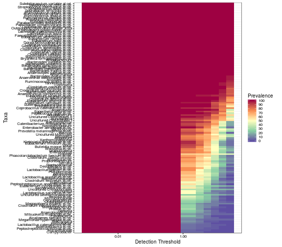

### Prevalence of taxonomic groups


```r
# Load example data
library(microbiome)
data("peerj32")
pseq <- peerj32$phyloseq

# Calculate relative abundances
pseq.rel <- transform_phyloseq(pseq, "relative.abundance", "OTU")
```


List prevalence for each group at 1 percent relative abundance abundance threshold:


```r
head(prevalence(pseq.rel, detection.threshold = 1, sort = FALSE))
```

```
##             Actinomycetaceae                   Aerococcus 
##                      0.00000                      0.00000 
##                    Aeromonas                  Akkermansia 
##                      0.00000                     52.27273 
## Alcaligenes faecalis et rel.           Allistipes et rel. 
##                      0.00000                     34.09091
```


List the taxa that are present at the given detection threshold (1% relative abundance) at a given prevalence (80%) (fraction of the samples):


```r
prevalent.taxa <- prevalent_taxa(pseq.rel, detection.threshold = 1, prevalence.threshold = 80)
```


### Core microbiota

Determine core microbiota with the [blanket
analysis](http://onlinelibrary.wiley.com/doi/10.1111/j.1469-0691.2012.03855.x/abstract)
based on various signal and prevalence thresholds.
 

```r
det <- c(0, 0.1, 0.2, 0.5, 1, 2, 5, 10, 20)
prev <- seq(10, 100, 10)
core <- core_matrix(pseq.rel, prevalence.intervals = prev, detection.thresholds = det)
```

### Core 2D line plots


```r
# Core lineplot with absolute read counts
det <- c(0, 1, 2, 5, 10, 20, 50, 100, 200, 500, 1000, 2000, 5000, 1e4)
res <- plot_core(pseq, prevalence.intervals = prev, detection.thresholds = det, plot.type = "lineplot", plot = FALSE)
res$plot + xlab("Abundance (OTU read count)")

# Core lineplot with relative abundances
det <- c(0, 0.1, 0.2, 0.5, 1, 2, 5, 10, 20)
res <- plot_core(pseq.rel, prevalence.intervals = prev, detection.thresholds = det, plot.type = "lineplot", plot = FALSE)
res$plot + xlab("Relative Abundance (%)")

# Retrieve the core count data matrix
coremat <- res$data
print(coremat)
```

```
##     0.1 0.2 0.3 0.4 0.5 0.6 0.7 0.8 0.9   1
## 0   130 130 130 130 130 130 130 130 130 130
## 0.1  89  75  71  69  64  59  58  53  49  41
## 0.2  74  67  62  56  53  50  47  45  40  28
## 0.5  55  49  45  41  39  36  33  31  25  15
## 1    41  37  32  30  27  25  23  17  11   3
## 2    29  24  18  15  12   9   8   4   2   1
## 5     9   6   4   4   4   2   1   1   0   0
## 10    3   3   1   0   0   0   0   0   0   0
## 20    0   0   0   0   0   0   0   0   0   0
```


### Core heatmaps

Core with relative abundances:


```r
prevalence.intervals <- seq(5, 100, 5)
detection.thresholds <- 10^seq(log10(1e-3), log10(20), length = 20)		 
res <- plot_core(pseq.rel, plot.type = "heatmap", palette = "bw", prevalence.intervals = prevalence.intervals, detection.thresholds = detection.thresholds, plot = FALSE) 
print(res$plot + xlab("Detection Threshold (Relative Abundance (%))"))
```


```r
# Retrieve the core prevalence data matrix
prevalences <- res$data
```

Core with absolute counts:


```r
prevalence.intervals = seq(5, 100, 5)
detection.thresholds <- 10^seq(log10(1), log10(max(otu_table(pseq))/10), length = 20)		 
res <- plot_core(pseq, plot.type = "heatmap", palette = "bw", prevalence.intervals = prevalence.intervals, detection.thresholds = detection.thresholds)$plot
```


Zoom in on the core region by filtering out rows and columns with zero prevalence:


```r
plot_core(pseq, plot.type = "heatmap", palette = "bw", prevalence.intervals = prevalence.intervals,
		detection.thresholds = detection.thresholds, min.prevalence = 0, plot = TRUE)
```


```
## $plot
```


```
## 
## $data
##                                       Taxa DetectionThreshold Prevalence
## 1                         Actinomycetaceae           1.000000  61.363636
## 2                               Aerococcus           1.000000  61.363636
## 3                                Aeromonas           1.000000  65.909091
## 4                              Akkermansia           1.000000 100.000000
## 5             Alcaligenes faecalis et rel.           1.000000  13.636364
## 6                       Allistipes et rel.           1.000000 100.000000
## 7                       Anaerobiospirillum           1.000000  22.727273
## 8                             Anaerofustis           1.000000 100.000000
## 9              Anaerostipes caccae et rel.           1.000000 100.000000
## 10       Anaerotruncus colihominis et rel.           1.000000 100.000000
## 11         Anaerovorax odorimutans et rel.           1.000000 100.000000
## 12                        Aneurinibacillus           1.000000  95.454545
## 13                           Aquabacterium           1.000000  95.454545
## 14                  Asteroleplasma et rel.           1.000000   6.818182
## 15                               Atopobium           1.000000  79.545455
## 16                                Bacillus           1.000000  90.909091
## 17            Bacteroides fragilis et rel.           1.000000 100.000000
## 18        Bacteroides intestinalis et rel.           1.000000 100.000000
## 19              Bacteroides ovatus et rel.           1.000000 100.000000
## 20            Bacteroides plebeius et rel.           1.000000 100.000000
## 21         Bacteroides splachnicus et rel.           1.000000 100.000000
## 22           Bacteroides stercoris et rel.           1.000000 100.000000
## 23           Bacteroides uniformis et rel.           1.000000 100.000000
## 24            Bacteroides vulgatus et rel.           1.000000 100.000000
## 25                         Bifidobacterium           1.000000 100.000000
## 26                       Bilophila et rel.           1.000000  75.000000
## 27                             Brachyspira           1.000000  13.636364
## 28        Bryantella formatexigens et rel.           1.000000 100.000000
## 29                Bulleidia moorei et rel.           1.000000  88.636364
## 30                            Burkholderia           1.000000  93.181818
## 31          Butyrivibrio crossotus et rel.           1.000000 100.000000
## 32                           Campylobacter           1.000000   4.545455
## 33       Catenibacterium mitsuokai et rel.           1.000000  90.909091
## 34             Clostridium (sensu stricto)           1.000000  77.272727
## 35           Clostridium cellulosi et rel.           1.000000 100.000000
## 36             Clostridium colinum et rel.           1.000000 100.000000
## 37           Clostridium difficile et rel.           1.000000 100.000000
## 38           Clostridium felsineum et rel.           1.000000  61.363636
## 39              Clostridium leptum et rel.           1.000000 100.000000
## 40              Clostridium nexile et rel.           1.000000 100.000000
## 41        Clostridium orbiscindens et rel.           1.000000 100.000000
## 42             Clostridium ramosum et rel.           1.000000  97.727273
## 43          Clostridium sphenoides et rel.           1.000000 100.000000
## 44        Clostridium stercorarium et rel.           1.000000 100.000000
## 45           Clostridium symbiosum et rel.           1.000000 100.000000
## 46        Clostridium thermocellum et rel.           1.000000  27.272727
## 47                             Collinsella           1.000000 100.000000
## 48      Coprobacillus catenaformis et rel.           1.000000  95.454545
## 49            Coprococcus eutactus et rel.           1.000000 100.000000
## 50                         Corynebacterium           1.000000  29.545455
## 51                   Desulfovibrio et rel.           1.000000  65.909091
## 52                               Dialister           1.000000  61.363636
## 53           Dorea formicigenerans et rel.           1.000000 100.000000
## 54               Eggerthella lenta et rel.           1.000000 100.000000
## 55          Enterobacter aerogenes et rel.           1.000000 100.000000
## 56                            Enterococcus           1.000000  79.545455
## 57                Escherichia coli et rel.           1.000000  54.545455
## 58             Eubacterium biforme et rel.           1.000000 100.000000
## 59        Eubacterium cylindroides et rel.           1.000000  43.181818
## 60              Eubacterium hallii et rel.           1.000000 100.000000
## 61             Eubacterium limosum et rel.           1.000000  95.454545
## 62             Eubacterium rectale et rel.           1.000000 100.000000
## 63             Eubacterium siraeum et rel.           1.000000 100.000000
## 64          Eubacterium ventriosum et rel.           1.000000 100.000000
## 65    Faecalibacterium prausnitzii et rel.           1.000000 100.000000
## 66                            Fusobacteria           1.000000  22.727273
## 67                                 Gemella           1.000000  25.000000
## 68                          Granulicatella           1.000000  77.272727
## 69                             Haemophilus           1.000000  47.727273
## 70                            Helicobacter           1.000000   9.090909
## 71          Klebisiella pneumoniae et rel.           1.000000  95.454545
## 72            Lachnobacillus bovis et rel.           1.000000 100.000000
## 73       Lachnospira pectinoschiza et rel.           1.000000 100.000000
## 74      Lactobacillus catenaformis et rel.           1.000000   6.818182
## 75           Lactobacillus gasseri et rel.           1.000000  75.000000
## 76         Lactobacillus plantarum et rel.           1.000000  65.909091
## 77        Lactobacillus salivarius et rel.           1.000000  50.000000
## 78                             Lactococcus           1.000000  84.090909
## 79                             Leminorella           1.000000  50.000000
## 80           Megamonas hypermegale et rel.           1.000000  11.363636
## 81            Megasphaera elsdenii et rel.           1.000000  22.727273
## 82                        Methylobacterium           1.000000  27.272727
## 83                          Micrococcaceae           1.000000  36.363636
## 84          Mitsuokella multiacida et rel.           1.000000  15.909091
## 85                           Moraxellaceae           1.000000   4.545455
## 86                         Novosphingobium           1.000000  93.181818
## 87                         Oceanospirillum           1.000000  27.272727
## 88      Oscillospira guillermondii et rel.           1.000000 100.000000
## 89    Outgrouping clostridium cluster XIVa           1.000000 100.000000
## 90          Oxalobacter formigenes et rel.           1.000000 100.000000
## 91     Papillibacter cinnamivorans et rel.           1.000000 100.000000
## 92      Parabacteroides distasonis et rel.           1.000000 100.000000
## 93               Peptococcus niger et rel.           1.000000 100.000000
## 94   Peptostreptococcus anaerobius et rel.           1.000000  56.818182
## 95       Peptostreptococcus micros et rel.           1.000000   6.818182
## 96   Phascolarctobacterium faecium et rel.           1.000000  70.454545
## 97       Prevotella melaninogenica et rel.           1.000000  86.363636
## 98               Prevotella oralis et rel.           1.000000 100.000000
## 99           Prevotella ruminicola et rel.           1.000000 100.000000
## 100            Prevotella tannerae et rel.           1.000000 100.000000
## 101                      Propionibacterium           1.000000  72.727273
## 102                        Proteus et rel.           1.000000  31.818182
## 103                            Pseudomonas           1.000000  65.909091
## 104         Roseburia intestinalis et rel.           1.000000 100.000000
## 105            Ruminococcus bromii et rel.           1.000000 100.000000
## 106          Ruminococcus callidus et rel.           1.000000 100.000000
## 107            Ruminococcus gnavus et rel.           1.000000 100.000000
## 108          Ruminococcus lactaris et rel.           1.000000 100.000000
## 109             Ruminococcus obeum et rel.           1.000000 100.000000
## 110                               Serratia           1.000000  68.181818
## 111         Sporobacter termitidis et rel.           1.000000 100.000000
## 112                         Staphylococcus           1.000000  65.909091
## 113            Streptococcus bovis et rel.           1.000000 100.000000
## 114      Streptococcus intermedius et rel.           1.000000 100.000000
## 115            Streptococcus mitis et rel.           1.000000 100.000000
## 116       Subdoligranulum variable at rel.           1.000000 100.000000
## 117         Sutterella wadsworthia et rel.           1.000000 100.000000
## 118                     Tannerella et rel.           1.000000 100.000000
## 119               Uncultured Bacteroidetes           1.000000 100.000000
## 120               Uncultured Chroococcales           1.000000  34.090909
## 121             Uncultured Clostridiales I           1.000000  86.363636
## 122            Uncultured Clostridiales II           1.000000 100.000000
## 123                  Uncultured Mollicutes           1.000000  86.363636
## 124            Uncultured Selenomonadaceae           1.000000  27.272727
## 125                            Veillonella           1.000000  77.272727
## 126                      Weissella et rel.           1.000000  79.545455
## 127                                 Vibrio           1.000000  90.909091
## 128                       Wissella et rel.           1.000000  70.454545
## 129                       Xanthomonadaceae           1.000000  84.090909
## 130                       Yersinia et rel.           1.000000  43.181818
## 131                       Actinomycetaceae           1.436418  61.363636
## 132                             Aerococcus           1.436418  61.363636
## 133                              Aeromonas           1.436418  65.909091
## 134                            Akkermansia           1.436418 100.000000
## 135           Alcaligenes faecalis et rel.           1.436418  13.636364
## 136                     Allistipes et rel.           1.436418 100.000000
## 137                     Anaerobiospirillum           1.436418  22.727273
## 138                           Anaerofustis           1.436418 100.000000
## 139            Anaerostipes caccae et rel.           1.436418 100.000000
## 140      Anaerotruncus colihominis et rel.           1.436418 100.000000
## 141        Anaerovorax odorimutans et rel.           1.436418 100.000000
## 142                       Aneurinibacillus           1.436418  95.454545
## 143                          Aquabacterium           1.436418  95.454545
## 144                 Asteroleplasma et rel.           1.436418   6.818182
## 145                              Atopobium           1.436418  79.545455
## 146                               Bacillus           1.436418  90.909091
## 147           Bacteroides fragilis et rel.           1.436418 100.000000
## 148       Bacteroides intestinalis et rel.           1.436418 100.000000
## 149             Bacteroides ovatus et rel.           1.436418 100.000000
## 150           Bacteroides plebeius et rel.           1.436418 100.000000
## 151        Bacteroides splachnicus et rel.           1.436418 100.000000
## 152          Bacteroides stercoris et rel.           1.436418 100.000000
## 153          Bacteroides uniformis et rel.           1.436418 100.000000
## 154           Bacteroides vulgatus et rel.           1.436418 100.000000
## 155                        Bifidobacterium           1.436418 100.000000
## 156                      Bilophila et rel.           1.436418  75.000000
## 157                            Brachyspira           1.436418  13.636364
## 158       Bryantella formatexigens et rel.           1.436418 100.000000
## 159               Bulleidia moorei et rel.           1.436418  88.636364
## 160                           Burkholderia           1.436418  93.181818
## 161         Butyrivibrio crossotus et rel.           1.436418 100.000000
## 162                          Campylobacter           1.436418   4.545455
## 163      Catenibacterium mitsuokai et rel.           1.436418  90.909091
## 164            Clostridium (sensu stricto)           1.436418  77.272727
## 165          Clostridium cellulosi et rel.           1.436418 100.000000
## 166            Clostridium colinum et rel.           1.436418 100.000000
## 167          Clostridium difficile et rel.           1.436418 100.000000
## 168          Clostridium felsineum et rel.           1.436418  61.363636
## 169             Clostridium leptum et rel.           1.436418 100.000000
## 170             Clostridium nexile et rel.           1.436418 100.000000
## 171       Clostridium orbiscindens et rel.           1.436418 100.000000
## 172            Clostridium ramosum et rel.           1.436418  97.727273
## 173         Clostridium sphenoides et rel.           1.436418 100.000000
## 174       Clostridium stercorarium et rel.           1.436418 100.000000
## 175          Clostridium symbiosum et rel.           1.436418 100.000000
## 176       Clostridium thermocellum et rel.           1.436418  27.272727
## 177                            Collinsella           1.436418 100.000000
## 178     Coprobacillus catenaformis et rel.           1.436418  95.454545
## 179           Coprococcus eutactus et rel.           1.436418 100.000000
## 180                        Corynebacterium           1.436418  29.545455
## 181                  Desulfovibrio et rel.           1.436418  65.909091
## 182                              Dialister           1.436418  61.363636
## 183          Dorea formicigenerans et rel.           1.436418 100.000000
## 184              Eggerthella lenta et rel.           1.436418 100.000000
## 185         Enterobacter aerogenes et rel.           1.436418 100.000000
## 186                           Enterococcus           1.436418  79.545455
## 187               Escherichia coli et rel.           1.436418  54.545455
## 188            Eubacterium biforme et rel.           1.436418 100.000000
## 189       Eubacterium cylindroides et rel.           1.436418  43.181818
## 190             Eubacterium hallii et rel.           1.436418 100.000000
## 191            Eubacterium limosum et rel.           1.436418  95.454545
## 192            Eubacterium rectale et rel.           1.436418 100.000000
## 193            Eubacterium siraeum et rel.           1.436418 100.000000
## 194         Eubacterium ventriosum et rel.           1.436418 100.000000
## 195   Faecalibacterium prausnitzii et rel.           1.436418 100.000000
## 196                           Fusobacteria           1.436418  22.727273
## 197                                Gemella           1.436418  25.000000
## 198                         Granulicatella           1.436418  77.272727
## 199                            Haemophilus           1.436418  47.727273
## 200                           Helicobacter           1.436418   9.090909
## 201         Klebisiella pneumoniae et rel.           1.436418  95.454545
## 202           Lachnobacillus bovis et rel.           1.436418 100.000000
## 203      Lachnospira pectinoschiza et rel.           1.436418 100.000000
## 204     Lactobacillus catenaformis et rel.           1.436418   6.818182
## 205          Lactobacillus gasseri et rel.           1.436418  75.000000
## 206        Lactobacillus plantarum et rel.           1.436418  65.909091
## 207       Lactobacillus salivarius et rel.           1.436418  50.000000
## 208                            Lactococcus           1.436418  84.090909
## 209                            Leminorella           1.436418  50.000000
## 210          Megamonas hypermegale et rel.           1.436418  11.363636
## 211           Megasphaera elsdenii et rel.           1.436418  22.727273
## 212                       Methylobacterium           1.436418  27.272727
## 213                         Micrococcaceae           1.436418  36.363636
## 214         Mitsuokella multiacida et rel.           1.436418  15.909091
## 215                          Moraxellaceae           1.436418   4.545455
## 216                        Novosphingobium           1.436418  93.181818
## 217                        Oceanospirillum           1.436418  27.272727
## 218     Oscillospira guillermondii et rel.           1.436418 100.000000
## 219   Outgrouping clostridium cluster XIVa           1.436418 100.000000
## 220         Oxalobacter formigenes et rel.           1.436418 100.000000
## 221    Papillibacter cinnamivorans et rel.           1.436418 100.000000
## 222     Parabacteroides distasonis et rel.           1.436418 100.000000
## 223              Peptococcus niger et rel.           1.436418 100.000000
## 224  Peptostreptococcus anaerobius et rel.           1.436418  56.818182
## 225      Peptostreptococcus micros et rel.           1.436418   6.818182
## 226  Phascolarctobacterium faecium et rel.           1.436418  70.454545
## 227      Prevotella melaninogenica et rel.           1.436418  86.363636
## 228              Prevotella oralis et rel.           1.436418 100.000000
## 229          Prevotella ruminicola et rel.           1.436418 100.000000
## 230            Prevotella tannerae et rel.           1.436418 100.000000
## 231                      Propionibacterium           1.436418  72.727273
## 232                        Proteus et rel.           1.436418  31.818182
## 233                            Pseudomonas           1.436418  65.909091
## 234         Roseburia intestinalis et rel.           1.436418 100.000000
## 235            Ruminococcus bromii et rel.           1.436418 100.000000
## 236          Ruminococcus callidus et rel.           1.436418 100.000000
## 237            Ruminococcus gnavus et rel.           1.436418 100.000000
## 238          Ruminococcus lactaris et rel.           1.436418 100.000000
## 239             Ruminococcus obeum et rel.           1.436418 100.000000
## 240                               Serratia           1.436418  68.181818
## 241         Sporobacter termitidis et rel.           1.436418 100.000000
## 242                         Staphylococcus           1.436418  65.909091
## 243            Streptococcus bovis et rel.           1.436418 100.000000
## 244      Streptococcus intermedius et rel.           1.436418 100.000000
## 245            Streptococcus mitis et rel.           1.436418 100.000000
## 246       Subdoligranulum variable at rel.           1.436418 100.000000
## 247         Sutterella wadsworthia et rel.           1.436418 100.000000
## 248                     Tannerella et rel.           1.436418 100.000000
## 249               Uncultured Bacteroidetes           1.436418 100.000000
## 250               Uncultured Chroococcales           1.436418  34.090909
## 251             Uncultured Clostridiales I           1.436418  86.363636
## 252            Uncultured Clostridiales II           1.436418 100.000000
## 253                  Uncultured Mollicutes           1.436418  86.363636
## 254            Uncultured Selenomonadaceae           1.436418  27.272727
## 255                            Veillonella           1.436418  77.272727
## 256                      Weissella et rel.           1.436418  79.545455
## 257                                 Vibrio           1.436418  90.909091
## 258                       Wissella et rel.           1.436418  70.454545
## 259                       Xanthomonadaceae           1.436418  84.090909
## 260                       Yersinia et rel.           1.436418  43.181818
## 261                       Actinomycetaceae           2.063297  56.818182
## 262                             Aerococcus           2.063297  61.363636
## 263                              Aeromonas           2.063297  54.545455
## 264                            Akkermansia           2.063297 100.000000
## 265           Alcaligenes faecalis et rel.           2.063297  13.636364
## 266                     Allistipes et rel.           2.063297 100.000000
## 267                     Anaerobiospirillum           2.063297  18.181818
## 268                           Anaerofustis           2.063297 100.000000
## 269            Anaerostipes caccae et rel.           2.063297 100.000000
## 270      Anaerotruncus colihominis et rel.           2.063297 100.000000
## 271        Anaerovorax odorimutans et rel.           2.063297 100.000000
## 272                       Aneurinibacillus           2.063297  95.454545
## 273                          Aquabacterium           2.063297  95.454545
## 274                 Asteroleplasma et rel.           2.063297   4.545455
## 275                              Atopobium           2.063297  77.272727
## 276                               Bacillus           2.063297  90.909091
## 277           Bacteroides fragilis et rel.           2.063297 100.000000
## 278       Bacteroides intestinalis et rel.           2.063297 100.000000
## 279             Bacteroides ovatus et rel.           2.063297 100.000000
## 280           Bacteroides plebeius et rel.           2.063297 100.000000
## 281        Bacteroides splachnicus et rel.           2.063297 100.000000
## 282          Bacteroides stercoris et rel.           2.063297 100.000000
## 283          Bacteroides uniformis et rel.           2.063297 100.000000
## 284           Bacteroides vulgatus et rel.           2.063297 100.000000
## 285                        Bifidobacterium           2.063297 100.000000
## 286                      Bilophila et rel.           2.063297  68.181818
## 287                            Brachyspira           2.063297  13.636364
## 288       Bryantella formatexigens et rel.           2.063297 100.000000
## 289               Bulleidia moorei et rel.           2.063297  79.545455
## 290                           Burkholderia           2.063297  93.181818
## 291         Butyrivibrio crossotus et rel.           2.063297 100.000000
## 292                          Campylobacter           2.063297   4.545455
## 293      Catenibacterium mitsuokai et rel.           2.063297  86.363636
## 294            Clostridium (sensu stricto)           2.063297  68.181818
## 295          Clostridium cellulosi et rel.           2.063297 100.000000
## 296            Clostridium colinum et rel.           2.063297 100.000000
## 297          Clostridium difficile et rel.           2.063297 100.000000
## 298          Clostridium felsineum et rel.           2.063297  61.363636
## 299             Clostridium leptum et rel.           2.063297 100.000000
## 300             Clostridium nexile et rel.           2.063297 100.000000
## 301       Clostridium orbiscindens et rel.           2.063297 100.000000
## 302            Clostridium ramosum et rel.           2.063297  97.727273
## 303         Clostridium sphenoides et rel.           2.063297 100.000000
## 304       Clostridium stercorarium et rel.           2.063297 100.000000
## 305          Clostridium symbiosum et rel.           2.063297 100.000000
## 306       Clostridium thermocellum et rel.           2.063297  27.272727
## 307                            Collinsella           2.063297 100.000000
## 308     Coprobacillus catenaformis et rel.           2.063297  95.454545
## 309           Coprococcus eutactus et rel.           2.063297 100.000000
## 310                        Corynebacterium           2.063297  25.000000
## 311                  Desulfovibrio et rel.           2.063297  59.090909
## 312                              Dialister           2.063297  61.363636
## 313          Dorea formicigenerans et rel.           2.063297 100.000000
## 314              Eggerthella lenta et rel.           2.063297  97.727273
## 315         Enterobacter aerogenes et rel.           2.063297  97.727273
## 316                           Enterococcus           2.063297  77.272727
## 317               Escherichia coli et rel.           2.063297  40.909091
## 318            Eubacterium biforme et rel.           2.063297 100.000000
## 319       Eubacterium cylindroides et rel.           2.063297  34.090909
## 320             Eubacterium hallii et rel.           2.063297 100.000000
## 321            Eubacterium limosum et rel.           2.063297  90.909091
## 322            Eubacterium rectale et rel.           2.063297 100.000000
## 323            Eubacterium siraeum et rel.           2.063297  97.727273
## 324         Eubacterium ventriosum et rel.           2.063297 100.000000
## 325   Faecalibacterium prausnitzii et rel.           2.063297 100.000000
## 326                           Fusobacteria           2.063297  18.181818
## 327                                Gemella           2.063297  20.454545
## 328                         Granulicatella           2.063297  77.272727
## 329                            Haemophilus           2.063297  45.454545
## 330                           Helicobacter           2.063297   9.090909
## 331         Klebisiella pneumoniae et rel.           2.063297  86.363636
## 332           Lachnobacillus bovis et rel.           2.063297 100.000000
## 333      Lachnospira pectinoschiza et rel.           2.063297 100.000000
## 334     Lactobacillus catenaformis et rel.           2.063297   6.818182
## 335          Lactobacillus gasseri et rel.           2.063297  61.363636
## 336        Lactobacillus plantarum et rel.           2.063297  59.090909
## 337       Lactobacillus salivarius et rel.           2.063297  34.090909
## 338                            Lactococcus           2.063297  79.545455
## 339                            Leminorella           2.063297  40.909091
## 340          Megamonas hypermegale et rel.           2.063297   9.090909
## 341           Megasphaera elsdenii et rel.           2.063297  18.181818
## 342                       Methylobacterium           2.063297  20.454545
## 343                         Micrococcaceae           2.063297  29.545455
## 344         Mitsuokella multiacida et rel.           2.063297  13.636364
## 345                          Moraxellaceae           2.063297   4.545455
## 346                        Novosphingobium           2.063297  88.636364
## 347                        Oceanospirillum           2.063297  22.727273
## 348     Oscillospira guillermondii et rel.           2.063297 100.000000
## 349   Outgrouping clostridium cluster XIVa           2.063297 100.000000
## 350         Oxalobacter formigenes et rel.           2.063297 100.000000
## 351    Papillibacter cinnamivorans et rel.           2.063297 100.000000
## 352     Parabacteroides distasonis et rel.           2.063297 100.000000
## 353              Peptococcus niger et rel.           2.063297 100.000000
## 354  Peptostreptococcus anaerobius et rel.           2.063297  50.000000
## 355      Peptostreptococcus micros et rel.           2.063297   4.545455
## 356  Phascolarctobacterium faecium et rel.           2.063297  65.909091
## 357      Prevotella melaninogenica et rel.           2.063297  86.363636
## 358              Prevotella oralis et rel.           2.063297 100.000000
## 359          Prevotella ruminicola et rel.           2.063297 100.000000
## 360            Prevotella tannerae et rel.           2.063297 100.000000
## 361                      Propionibacterium           2.063297  68.181818
## 362                        Proteus et rel.           2.063297  25.000000
## 363                            Pseudomonas           2.063297  56.818182
## 364         Roseburia intestinalis et rel.           2.063297 100.000000
## 365            Ruminococcus bromii et rel.           2.063297 100.000000
## 366          Ruminococcus callidus et rel.           2.063297 100.000000
## 367            Ruminococcus gnavus et rel.           2.063297 100.000000
## 368          Ruminococcus lactaris et rel.           2.063297 100.000000
## 369             Ruminococcus obeum et rel.           2.063297 100.000000
## 370                               Serratia           2.063297  61.363636
## 371         Sporobacter termitidis et rel.           2.063297 100.000000
## 372                         Staphylococcus           2.063297  63.636364
## 373            Streptococcus bovis et rel.           2.063297 100.000000
## 374      Streptococcus intermedius et rel.           2.063297 100.000000
## 375            Streptococcus mitis et rel.           2.063297 100.000000
## 376       Subdoligranulum variable at rel.           2.063297 100.000000
## 377         Sutterella wadsworthia et rel.           2.063297 100.000000
## 378                     Tannerella et rel.           2.063297 100.000000
## 379               Uncultured Bacteroidetes           2.063297 100.000000
## 380               Uncultured Chroococcales           2.063297  34.090909
## 381             Uncultured Clostridiales I           2.063297  84.090909
## 382            Uncultured Clostridiales II           2.063297 100.000000
## 383                  Uncultured Mollicutes           2.063297  81.818182
## 384            Uncultured Selenomonadaceae           2.063297  27.272727
## 385                            Veillonella           2.063297  70.454545
## 386                      Weissella et rel.           2.063297  77.272727
## 387                                 Vibrio           2.063297  88.636364
## 388                       Wissella et rel.           2.063297  65.909091
## 389                       Xanthomonadaceae           2.063297  79.545455
## 390                       Yersinia et rel.           2.063297  36.363636
## 391                       Actinomycetaceae           2.963756  56.818182
## 392                             Aerococcus           2.963756  61.363636
## 393                              Aeromonas           2.963756  54.545455
## 394                            Akkermansia           2.963756 100.000000
## 395           Alcaligenes faecalis et rel.           2.963756  13.636364
## 396                     Allistipes et rel.           2.963756 100.000000
## 397                     Anaerobiospirillum           2.963756  18.181818
## 398                           Anaerofustis           2.963756 100.000000
## 399            Anaerostipes caccae et rel.           2.963756 100.000000
## 400      Anaerotruncus colihominis et rel.           2.963756 100.000000
## 401        Anaerovorax odorimutans et rel.           2.963756 100.000000
## 402                       Aneurinibacillus           2.963756  95.454545
## 403                          Aquabacterium           2.963756  95.454545
## 404                 Asteroleplasma et rel.           2.963756   4.545455
## 405                              Atopobium           2.963756  77.272727
## 406                               Bacillus           2.963756  90.909091
## 407           Bacteroides fragilis et rel.           2.963756 100.000000
## 408       Bacteroides intestinalis et rel.           2.963756 100.000000
## 409             Bacteroides ovatus et rel.           2.963756 100.000000
## 410           Bacteroides plebeius et rel.           2.963756 100.000000
## 411        Bacteroides splachnicus et rel.           2.963756 100.000000
## 412          Bacteroides stercoris et rel.           2.963756 100.000000
## 413          Bacteroides uniformis et rel.           2.963756 100.000000
## 414           Bacteroides vulgatus et rel.           2.963756 100.000000
## 415                        Bifidobacterium           2.963756 100.000000
## 416                      Bilophila et rel.           2.963756  68.181818
## 417                            Brachyspira           2.963756  13.636364
## 418       Bryantella formatexigens et rel.           2.963756 100.000000
## 419               Bulleidia moorei et rel.           2.963756  79.545455
## 420                           Burkholderia           2.963756  93.181818
## 421         Butyrivibrio crossotus et rel.           2.963756 100.000000
## 422                          Campylobacter           2.963756   4.545455
## 423      Catenibacterium mitsuokai et rel.           2.963756  86.363636
## 424            Clostridium (sensu stricto)           2.963756  68.181818
## 425          Clostridium cellulosi et rel.           2.963756 100.000000
## 426            Clostridium colinum et rel.           2.963756 100.000000
## 427          Clostridium difficile et rel.           2.963756 100.000000
## 428          Clostridium felsineum et rel.           2.963756  61.363636
## 429             Clostridium leptum et rel.           2.963756 100.000000
## 430             Clostridium nexile et rel.           2.963756 100.000000
## 431       Clostridium orbiscindens et rel.           2.963756 100.000000
## 432            Clostridium ramosum et rel.           2.963756  97.727273
## 433         Clostridium sphenoides et rel.           2.963756 100.000000
## 434       Clostridium stercorarium et rel.           2.963756 100.000000
## 435          Clostridium symbiosum et rel.           2.963756 100.000000
## 436       Clostridium thermocellum et rel.           2.963756  27.272727
## 437                            Collinsella           2.963756 100.000000
## 438     Coprobacillus catenaformis et rel.           2.963756  95.454545
## 439           Coprococcus eutactus et rel.           2.963756 100.000000
## 440                        Corynebacterium           2.963756  25.000000
## 441                  Desulfovibrio et rel.           2.963756  59.090909
## 442                              Dialister           2.963756  61.363636
## 443          Dorea formicigenerans et rel.           2.963756 100.000000
## 444              Eggerthella lenta et rel.           2.963756  97.727273
## 445         Enterobacter aerogenes et rel.           2.963756  97.727273
## 446                           Enterococcus           2.963756  77.272727
## 447               Escherichia coli et rel.           2.963756  40.909091
## 448            Eubacterium biforme et rel.           2.963756 100.000000
## 449       Eubacterium cylindroides et rel.           2.963756  34.090909
## 450             Eubacterium hallii et rel.           2.963756 100.000000
## 451            Eubacterium limosum et rel.           2.963756  90.909091
## 452            Eubacterium rectale et rel.           2.963756 100.000000
## 453            Eubacterium siraeum et rel.           2.963756  97.727273
## 454         Eubacterium ventriosum et rel.           2.963756 100.000000
## 455   Faecalibacterium prausnitzii et rel.           2.963756 100.000000
## 456                           Fusobacteria           2.963756  18.181818
## 457                                Gemella           2.963756  20.454545
## 458                         Granulicatella           2.963756  77.272727
## 459                            Haemophilus           2.963756  45.454545
## 460                           Helicobacter           2.963756   9.090909
## 461         Klebisiella pneumoniae et rel.           2.963756  86.363636
## 462           Lachnobacillus bovis et rel.           2.963756 100.000000
## 463      Lachnospira pectinoschiza et rel.           2.963756 100.000000
## 464     Lactobacillus catenaformis et rel.           2.963756   6.818182
## 465          Lactobacillus gasseri et rel.           2.963756  61.363636
## 466        Lactobacillus plantarum et rel.           2.963756  59.090909
## 467       Lactobacillus salivarius et rel.           2.963756  34.090909
## 468                            Lactococcus           2.963756  79.545455
## 469                            Leminorella           2.963756  40.909091
## 470          Megamonas hypermegale et rel.           2.963756   9.090909
## 471           Megasphaera elsdenii et rel.           2.963756  18.181818
## 472                       Methylobacterium           2.963756  20.454545
## 473                         Micrococcaceae           2.963756  29.545455
## 474         Mitsuokella multiacida et rel.           2.963756  13.636364
## 475                          Moraxellaceae           2.963756   4.545455
## 476                        Novosphingobium           2.963756  88.636364
## 477                        Oceanospirillum           2.963756  22.727273
## 478     Oscillospira guillermondii et rel.           2.963756 100.000000
## 479   Outgrouping clostridium cluster XIVa           2.963756 100.000000
## 480         Oxalobacter formigenes et rel.           2.963756 100.000000
## 481    Papillibacter cinnamivorans et rel.           2.963756 100.000000
## 482     Parabacteroides distasonis et rel.           2.963756 100.000000
## 483              Peptococcus niger et rel.           2.963756 100.000000
## 484  Peptostreptococcus anaerobius et rel.           2.963756  50.000000
## 485      Peptostreptococcus micros et rel.           2.963756   4.545455
## 486  Phascolarctobacterium faecium et rel.           2.963756  65.909091
## 487      Prevotella melaninogenica et rel.           2.963756  86.363636
## 488              Prevotella oralis et rel.           2.963756 100.000000
## 489          Prevotella ruminicola et rel.           2.963756 100.000000
## 490            Prevotella tannerae et rel.           2.963756 100.000000
## 491                      Propionibacterium           2.963756  68.181818
## 492                        Proteus et rel.           2.963756  25.000000
## 493                            Pseudomonas           2.963756  56.818182
## 494         Roseburia intestinalis et rel.           2.963756 100.000000
## 495            Ruminococcus bromii et rel.           2.963756 100.000000
## 496          Ruminococcus callidus et rel.           2.963756 100.000000
## 497            Ruminococcus gnavus et rel.           2.963756 100.000000
## 498          Ruminococcus lactaris et rel.           2.963756 100.000000
## 499             Ruminococcus obeum et rel.           2.963756 100.000000
## 500                               Serratia           2.963756  61.363636
## 501         Sporobacter termitidis et rel.           2.963756 100.000000
## 502                         Staphylococcus           2.963756  63.636364
## 503            Streptococcus bovis et rel.           2.963756 100.000000
## 504      Streptococcus intermedius et rel.           2.963756 100.000000
## 505            Streptococcus mitis et rel.           2.963756 100.000000
## 506       Subdoligranulum variable at rel.           2.963756 100.000000
## 507         Sutterella wadsworthia et rel.           2.963756 100.000000
## 508                     Tannerella et rel.           2.963756 100.000000
## 509               Uncultured Bacteroidetes           2.963756 100.000000
## 510               Uncultured Chroococcales           2.963756  34.090909
## 511             Uncultured Clostridiales I           2.963756  84.090909
## 512            Uncultured Clostridiales II           2.963756 100.000000
## 513                  Uncultured Mollicutes           2.963756  81.818182
## 514            Uncultured Selenomonadaceae           2.963756  27.272727
## 515                            Veillonella           2.963756  70.454545
## 516                      Weissella et rel.           2.963756  77.272727
## 517                                 Vibrio           2.963756  88.636364
## 518                       Wissella et rel.           2.963756  65.909091
## 519                       Xanthomonadaceae           2.963756  79.545455
## 520                       Yersinia et rel.           2.963756  36.363636
## 521                       Actinomycetaceae           4.257193  47.727273
## 522                             Aerococcus           4.257193  50.000000
## 523                              Aeromonas           4.257193  50.000000
## 524                            Akkermansia           4.257193 100.000000
## 525           Alcaligenes faecalis et rel.           4.257193   6.818182
## 526                     Allistipes et rel.           4.257193 100.000000
## 527                     Anaerobiospirillum           4.257193  11.363636
## 528                           Anaerofustis           4.257193 100.000000
## 529            Anaerostipes caccae et rel.           4.257193 100.000000
## 530      Anaerotruncus colihominis et rel.           4.257193 100.000000
## 531        Anaerovorax odorimutans et rel.           4.257193 100.000000
## 532                       Aneurinibacillus           4.257193  93.181818
## 533                          Aquabacterium           4.257193  95.454545
## 534                 Asteroleplasma et rel.           4.257193   4.545455
## 535                              Atopobium           4.257193  70.454545
## 536                               Bacillus           4.257193  84.090909
## 537           Bacteroides fragilis et rel.           4.257193 100.000000
## 538       Bacteroides intestinalis et rel.           4.257193 100.000000
## 539             Bacteroides ovatus et rel.           4.257193 100.000000
## 540           Bacteroides plebeius et rel.           4.257193 100.000000
## 541        Bacteroides splachnicus et rel.           4.257193 100.000000
## 542          Bacteroides stercoris et rel.           4.257193 100.000000
## 543          Bacteroides uniformis et rel.           4.257193 100.000000
## 544           Bacteroides vulgatus et rel.           4.257193 100.000000
## 545                        Bifidobacterium           4.257193 100.000000
## 546                      Bilophila et rel.           4.257193  56.818182
## 547                            Brachyspira           4.257193   4.545455
## 548       Bryantella formatexigens et rel.           4.257193 100.000000
## 549               Bulleidia moorei et rel.           4.257193  65.909091
## 550                           Burkholderia           4.257193  93.181818
## 551         Butyrivibrio crossotus et rel.           4.257193 100.000000
## 552                          Campylobacter           4.257193   2.272727
## 553      Catenibacterium mitsuokai et rel.           4.257193  84.090909
## 554            Clostridium (sensu stricto)           4.257193  54.545455
## 555          Clostridium cellulosi et rel.           4.257193 100.000000
## 556            Clostridium colinum et rel.           4.257193 100.000000
## 557          Clostridium difficile et rel.           4.257193 100.000000
## 558          Clostridium felsineum et rel.           4.257193  40.909091
## 559             Clostridium leptum et rel.           4.257193 100.000000
## 560             Clostridium nexile et rel.           4.257193 100.000000
## 561       Clostridium orbiscindens et rel.           4.257193 100.000000
## 562            Clostridium ramosum et rel.           4.257193  97.727273
## 563         Clostridium sphenoides et rel.           4.257193 100.000000
## 564       Clostridium stercorarium et rel.           4.257193 100.000000
## 565          Clostridium symbiosum et rel.           4.257193 100.000000
## 566       Clostridium thermocellum et rel.           4.257193  13.636364
## 567                            Collinsella           4.257193 100.000000
## 568     Coprobacillus catenaformis et rel.           4.257193  93.181818
## 569           Coprococcus eutactus et rel.           4.257193 100.000000
## 570                        Corynebacterium           4.257193  20.454545
## 571                  Desulfovibrio et rel.           4.257193  52.272727
## 572                              Dialister           4.257193  56.818182
## 573          Dorea formicigenerans et rel.           4.257193 100.000000
## 574              Eggerthella lenta et rel.           4.257193  95.454545
## 575         Enterobacter aerogenes et rel.           4.257193  81.818182
## 576                           Enterococcus           4.257193  72.727273
## 577               Escherichia coli et rel.           4.257193  31.818182
## 578            Eubacterium biforme et rel.           4.257193 100.000000
## 579       Eubacterium cylindroides et rel.           4.257193  34.090909
## 580             Eubacterium hallii et rel.           4.257193 100.000000
## 581            Eubacterium limosum et rel.           4.257193  65.909091
## 582            Eubacterium rectale et rel.           4.257193 100.000000
## 583            Eubacterium siraeum et rel.           4.257193  97.727273
## 584         Eubacterium ventriosum et rel.           4.257193 100.000000
## 585   Faecalibacterium prausnitzii et rel.           4.257193 100.000000
## 586                           Fusobacteria           4.257193   9.090909
## 587                                Gemella           4.257193  18.181818
## 588                         Granulicatella           4.257193  68.181818
## 589                            Haemophilus           4.257193  43.181818
## 590                           Helicobacter           4.257193   6.818182
## 591         Klebisiella pneumoniae et rel.           4.257193  77.272727
## 592           Lachnobacillus bovis et rel.           4.257193 100.000000
## 593      Lachnospira pectinoschiza et rel.           4.257193 100.000000
## 594     Lactobacillus catenaformis et rel.           4.257193   4.545455
## 595          Lactobacillus gasseri et rel.           4.257193  43.181818
## 596        Lactobacillus plantarum et rel.           4.257193  40.909091
## 597       Lactobacillus salivarius et rel.           4.257193  20.454545
## 598                            Lactococcus           4.257193  70.454545
## 599                            Leminorella           4.257193  25.000000
## 600          Megamonas hypermegale et rel.           4.257193   6.818182
## 601           Megasphaera elsdenii et rel.           4.257193  11.363636
## 602                       Methylobacterium           4.257193  11.363636
## 603                         Micrococcaceae           4.257193  27.272727
## 604         Mitsuokella multiacida et rel.           4.257193  11.363636
## 605                          Moraxellaceae           4.257193   2.272727
## 606                        Novosphingobium           4.257193  84.090909
## 607                        Oceanospirillum           4.257193  18.181818
## 608     Oscillospira guillermondii et rel.           4.257193 100.000000
## 609   Outgrouping clostridium cluster XIVa           4.257193 100.000000
## 610         Oxalobacter formigenes et rel.           4.257193 100.000000
## 611    Papillibacter cinnamivorans et rel.           4.257193 100.000000
## 612     Parabacteroides distasonis et rel.           4.257193 100.000000
## 613              Peptococcus niger et rel.           4.257193  97.727273
## 614  Peptostreptococcus anaerobius et rel.           4.257193  36.363636
## 615      Peptostreptococcus micros et rel.           4.257193   2.272727
## 616  Phascolarctobacterium faecium et rel.           4.257193  61.363636
## 617      Prevotella melaninogenica et rel.           4.257193  68.181818
## 618              Prevotella oralis et rel.           4.257193 100.000000
## 619          Prevotella ruminicola et rel.           4.257193 100.000000
## 620            Prevotella tannerae et rel.           4.257193 100.000000
## 621                      Propionibacterium           4.257193  63.636364
## 622                        Proteus et rel.           4.257193   9.090909
## 623                            Pseudomonas           4.257193  47.727273
## 624         Roseburia intestinalis et rel.           4.257193 100.000000
## 625            Ruminococcus bromii et rel.           4.257193 100.000000
## 626          Ruminococcus callidus et rel.           4.257193 100.000000
## 627            Ruminococcus gnavus et rel.           4.257193 100.000000
## 628          Ruminococcus lactaris et rel.           4.257193 100.000000
## 629             Ruminococcus obeum et rel.           4.257193 100.000000
## 630                               Serratia           4.257193  56.818182
## 631         Sporobacter termitidis et rel.           4.257193 100.000000
## 632                         Staphylococcus           4.257193  56.818182
## 633            Streptococcus bovis et rel.           4.257193 100.000000
## 634      Streptococcus intermedius et rel.           4.257193 100.000000
## 635            Streptococcus mitis et rel.           4.257193 100.000000
## 636       Subdoligranulum variable at rel.           4.257193 100.000000
## 637         Sutterella wadsworthia et rel.           4.257193 100.000000
## 638                     Tannerella et rel.           4.257193 100.000000
## 639               Uncultured Bacteroidetes           4.257193 100.000000
## 640               Uncultured Chroococcales           4.257193  31.818182
## 641             Uncultured Clostridiales I           4.257193  77.272727
## 642            Uncultured Clostridiales II           4.257193  93.181818
## 643                  Uncultured Mollicutes           4.257193  70.454545
## 644            Uncultured Selenomonadaceae           4.257193  25.000000
## 645                            Veillonella           4.257193  68.181818
## 646                      Weissella et rel.           4.257193  68.181818
## 647                                 Vibrio           4.257193  79.545455
## 648                       Wissella et rel.           4.257193  56.818182
## 649                       Xanthomonadaceae           4.257193  72.727273
## 650                       Yersinia et rel.           4.257193  27.272727
## 651                       Actinomycetaceae           6.115109  27.272727
## 652                             Aerococcus           6.115109  43.181818
## 653                              Aeromonas           6.115109  40.909091
## 654                            Akkermansia           6.115109 100.000000
## 655           Alcaligenes faecalis et rel.           6.115109   6.818182
## 656                     Allistipes et rel.           6.115109 100.000000
## 657                     Anaerobiospirillum           6.115109   9.090909
## 658                           Anaerofustis           6.115109  97.727273
## 659            Anaerostipes caccae et rel.           6.115109 100.000000
## 660      Anaerotruncus colihominis et rel.           6.115109 100.000000
## 661        Anaerovorax odorimutans et rel.           6.115109 100.000000
## 662                       Aneurinibacillus           6.115109  86.363636
## 663                          Aquabacterium           6.115109  90.909091
## 664                 Asteroleplasma et rel.           6.115109   2.272727
## 665                              Atopobium           6.115109  68.181818
## 666                               Bacillus           6.115109  77.272727
## 667           Bacteroides fragilis et rel.           6.115109 100.000000
## 668       Bacteroides intestinalis et rel.           6.115109 100.000000
## 669             Bacteroides ovatus et rel.           6.115109 100.000000
## 670           Bacteroides plebeius et rel.           6.115109 100.000000
## 671        Bacteroides splachnicus et rel.           6.115109 100.000000
## 672          Bacteroides stercoris et rel.           6.115109 100.000000
## 673          Bacteroides uniformis et rel.           6.115109 100.000000
## 674           Bacteroides vulgatus et rel.           6.115109 100.000000
## 675                        Bifidobacterium           6.115109 100.000000
## 676                      Bilophila et rel.           6.115109  43.181818
## 677                            Brachyspira           6.115109   2.272727
## 678       Bryantella formatexigens et rel.           6.115109 100.000000
## 679               Bulleidia moorei et rel.           6.115109  59.090909
## 680                           Burkholderia           6.115109  88.636364
## 681         Butyrivibrio crossotus et rel.           6.115109 100.000000
## 682                          Campylobacter           6.115109   0.000000
## 683      Catenibacterium mitsuokai et rel.           6.115109  77.272727
## 684            Clostridium (sensu stricto)           6.115109  45.454545
## 685          Clostridium cellulosi et rel.           6.115109 100.000000
## 686            Clostridium colinum et rel.           6.115109 100.000000
## 687          Clostridium difficile et rel.           6.115109 100.000000
## 688          Clostridium felsineum et rel.           6.115109  29.545455
## 689             Clostridium leptum et rel.           6.115109 100.000000
## 690             Clostridium nexile et rel.           6.115109 100.000000
## 691       Clostridium orbiscindens et rel.           6.115109 100.000000
## 692            Clostridium ramosum et rel.           6.115109  95.454545
## 693         Clostridium sphenoides et rel.           6.115109 100.000000
## 694       Clostridium stercorarium et rel.           6.115109 100.000000
## 695          Clostridium symbiosum et rel.           6.115109 100.000000
## 696       Clostridium thermocellum et rel.           6.115109  11.363636
## 697                            Collinsella           6.115109 100.000000
## 698     Coprobacillus catenaformis et rel.           6.115109  93.181818
## 699           Coprococcus eutactus et rel.           6.115109 100.000000
## 700                        Corynebacterium           6.115109  18.181818
## 701                  Desulfovibrio et rel.           6.115109  47.727273
## 702                              Dialister           6.115109  54.545455
## 703          Dorea formicigenerans et rel.           6.115109 100.000000
## 704              Eggerthella lenta et rel.           6.115109  90.909091
## 705         Enterobacter aerogenes et rel.           6.115109  68.181818
## 706                           Enterococcus           6.115109  65.909091
## 707               Escherichia coli et rel.           6.115109  22.727273
## 708            Eubacterium biforme et rel.           6.115109 100.000000
## 709       Eubacterium cylindroides et rel.           6.115109  25.000000
## 710             Eubacterium hallii et rel.           6.115109 100.000000
## 711            Eubacterium limosum et rel.           6.115109  56.818182
## 712            Eubacterium rectale et rel.           6.115109 100.000000
## 713            Eubacterium siraeum et rel.           6.115109  97.727273
## 714         Eubacterium ventriosum et rel.           6.115109 100.000000
## 715   Faecalibacterium prausnitzii et rel.           6.115109 100.000000
## 716                           Fusobacteria           6.115109   4.545455
## 717                                Gemella           6.115109  11.363636
## 718                         Granulicatella           6.115109  59.090909
## 719                            Haemophilus           6.115109  29.545455
## 720                           Helicobacter           6.115109   4.545455
## 721         Klebisiella pneumoniae et rel.           6.115109  59.090909
## 722           Lachnobacillus bovis et rel.           6.115109 100.000000
## 723      Lachnospira pectinoschiza et rel.           6.115109 100.000000
## 724     Lactobacillus catenaformis et rel.           6.115109   4.545455
## 725          Lactobacillus gasseri et rel.           6.115109  36.363636
## 726        Lactobacillus plantarum et rel.           6.115109  36.363636
## 727       Lactobacillus salivarius et rel.           6.115109  15.909091
## 728                            Lactococcus           6.115109  65.909091
## 729                            Leminorella           6.115109  20.454545
## 730          Megamonas hypermegale et rel.           6.115109   4.545455
## 731           Megasphaera elsdenii et rel.           6.115109   9.090909
## 732                       Methylobacterium           6.115109  11.363636
## 733                         Micrococcaceae           6.115109  15.909091
## 734         Mitsuokella multiacida et rel.           6.115109   6.818182
## 735                          Moraxellaceae           6.115109   2.272727
## 736                        Novosphingobium           6.115109  75.000000
## 737                        Oceanospirillum           6.115109  13.636364
## 738     Oscillospira guillermondii et rel.           6.115109 100.000000
## 739   Outgrouping clostridium cluster XIVa           6.115109 100.000000
## 740         Oxalobacter formigenes et rel.           6.115109 100.000000
## 741    Papillibacter cinnamivorans et rel.           6.115109 100.000000
## 742     Parabacteroides distasonis et rel.           6.115109 100.000000
## 743              Peptococcus niger et rel.           6.115109  97.727273
## 744  Peptostreptococcus anaerobius et rel.           6.115109  22.727273
## 745      Peptostreptococcus micros et rel.           6.115109   2.272727
## 746  Phascolarctobacterium faecium et rel.           6.115109  54.545455
## 747      Prevotella melaninogenica et rel.           6.115109  65.909091
## 748              Prevotella oralis et rel.           6.115109  97.727273
## 749          Prevotella ruminicola et rel.           6.115109 100.000000
## 750            Prevotella tannerae et rel.           6.115109 100.000000
## 751                      Propionibacterium           6.115109  54.545455
## 752                        Proteus et rel.           6.115109   2.272727
## 753                            Pseudomonas           6.115109  38.636364
## 754         Roseburia intestinalis et rel.           6.115109 100.000000
## 755            Ruminococcus bromii et rel.           6.115109 100.000000
## 756          Ruminococcus callidus et rel.           6.115109 100.000000
## 757            Ruminococcus gnavus et rel.           6.115109 100.000000
## 758          Ruminococcus lactaris et rel.           6.115109 100.000000
## 759             Ruminococcus obeum et rel.           6.115109 100.000000
## 760                               Serratia           6.115109  47.727273
## 761         Sporobacter termitidis et rel.           6.115109 100.000000
## 762                         Staphylococcus           6.115109  52.272727
## 763            Streptococcus bovis et rel.           6.115109 100.000000
## 764      Streptococcus intermedius et rel.           6.115109 100.000000
## 765            Streptococcus mitis et rel.           6.115109 100.000000
## 766       Subdoligranulum variable at rel.           6.115109 100.000000
## 767         Sutterella wadsworthia et rel.           6.115109  95.454545
## 768                     Tannerella et rel.           6.115109 100.000000
## 769               Uncultured Bacteroidetes           6.115109 100.000000
## 770               Uncultured Chroococcales           6.115109  27.272727
## 771             Uncultured Clostridiales I           6.115109  77.272727
## 772            Uncultured Clostridiales II           6.115109  86.363636
## 773                  Uncultured Mollicutes           6.115109  59.090909
## 774            Uncultured Selenomonadaceae           6.115109  22.727273
## 775                            Veillonella           6.115109  65.909091
## 776                      Weissella et rel.           6.115109  61.363636
## 777                                 Vibrio           6.115109  63.636364
## 778                       Wissella et rel.           6.115109  47.727273
## 779                       Xanthomonadaceae           6.115109  65.909091
## 780                       Yersinia et rel.           6.115109  20.454545
## 781                       Actinomycetaceae           8.783853  25.000000
## 782                             Aerococcus           8.783853  31.818182
## 783                              Aeromonas           8.783853  34.090909
## 784                            Akkermansia           8.783853 100.000000
## 785           Alcaligenes faecalis et rel.           8.783853   4.545455
## 786                     Allistipes et rel.           8.783853 100.000000
## 787                     Anaerobiospirillum           8.783853   6.818182
## 788                           Anaerofustis           8.783853  97.727273
## 789            Anaerostipes caccae et rel.           8.783853 100.000000
## 790      Anaerotruncus colihominis et rel.           8.783853 100.000000
## 791        Anaerovorax odorimutans et rel.           8.783853 100.000000
## 792                       Aneurinibacillus           8.783853  79.545455
## 793                          Aquabacterium           8.783853  88.636364
## 794                 Asteroleplasma et rel.           8.783853   2.272727
## 795                              Atopobium           8.783853  61.363636
## 796                               Bacillus           8.783853  61.363636
## 797           Bacteroides fragilis et rel.           8.783853 100.000000
## 798       Bacteroides intestinalis et rel.           8.783853 100.000000
## 799             Bacteroides ovatus et rel.           8.783853 100.000000
## 800           Bacteroides plebeius et rel.           8.783853 100.000000
## 801        Bacteroides splachnicus et rel.           8.783853 100.000000
## 802          Bacteroides stercoris et rel.           8.783853 100.000000
## 803          Bacteroides uniformis et rel.           8.783853 100.000000
## 804           Bacteroides vulgatus et rel.           8.783853 100.000000
## 805                        Bifidobacterium           8.783853 100.000000
## 806                      Bilophila et rel.           8.783853  31.818182
## 807                            Brachyspira           8.783853   2.272727
## 808       Bryantella formatexigens et rel.           8.783853 100.000000
## 809               Bulleidia moorei et rel.           8.783853  56.818182
## 810                           Burkholderia           8.783853  84.090909
## 811         Butyrivibrio crossotus et rel.           8.783853 100.000000
## 812                          Campylobacter           8.783853   0.000000
## 813      Catenibacterium mitsuokai et rel.           8.783853  72.727273
## 814            Clostridium (sensu stricto)           8.783853  38.636364
## 815          Clostridium cellulosi et rel.           8.783853 100.000000
## 816            Clostridium colinum et rel.           8.783853 100.000000
## 817          Clostridium difficile et rel.           8.783853 100.000000
## 818          Clostridium felsineum et rel.           8.783853  20.454545
## 819             Clostridium leptum et rel.           8.783853 100.000000
## 820             Clostridium nexile et rel.           8.783853 100.000000
## 821       Clostridium orbiscindens et rel.           8.783853 100.000000
## 822            Clostridium ramosum et rel.           8.783853  90.909091
## 823         Clostridium sphenoides et rel.           8.783853 100.000000
## 824       Clostridium stercorarium et rel.           8.783853 100.000000
## 825          Clostridium symbiosum et rel.           8.783853 100.000000
## 826       Clostridium thermocellum et rel.           8.783853  11.363636
## 827                            Collinsella           8.783853 100.000000
## 828     Coprobacillus catenaformis et rel.           8.783853  90.909091
## 829           Coprococcus eutactus et rel.           8.783853 100.000000
## 830                        Corynebacterium           8.783853  11.363636
## 831                  Desulfovibrio et rel.           8.783853  40.909091
## 832                              Dialister           8.783853  52.272727
## 833          Dorea formicigenerans et rel.           8.783853 100.000000
## 834              Eggerthella lenta et rel.           8.783853  90.909091
## 835         Enterobacter aerogenes et rel.           8.783853  61.363636
## 836                           Enterococcus           8.783853  52.272727
## 837               Escherichia coli et rel.           8.783853  15.909091
## 838            Eubacterium biforme et rel.           8.783853 100.000000
## 839       Eubacterium cylindroides et rel.           8.783853  25.000000
## 840             Eubacterium hallii et rel.           8.783853 100.000000
## 841            Eubacterium limosum et rel.           8.783853  47.727273
## 842            Eubacterium rectale et rel.           8.783853 100.000000
## 843            Eubacterium siraeum et rel.           8.783853  95.454545
## 844         Eubacterium ventriosum et rel.           8.783853 100.000000
## 845   Faecalibacterium prausnitzii et rel.           8.783853 100.000000
## 846                           Fusobacteria           8.783853   0.000000
## 847                                Gemella           8.783853   4.545455
## 848                         Granulicatella           8.783853  54.545455
## 849                            Haemophilus           8.783853  20.454545
## 850                           Helicobacter           8.783853   0.000000
## 851         Klebisiella pneumoniae et rel.           8.783853  52.272727
## 852           Lachnobacillus bovis et rel.           8.783853 100.000000
## 853      Lachnospira pectinoschiza et rel.           8.783853 100.000000
## 854     Lactobacillus catenaformis et rel.           8.783853   4.545455
## 855          Lactobacillus gasseri et rel.           8.783853  31.818182
## 856        Lactobacillus plantarum et rel.           8.783853  27.272727
## 857       Lactobacillus salivarius et rel.           8.783853  11.363636
## 858                            Lactococcus           8.783853  61.363636
## 859                            Leminorella           8.783853   9.090909
## 860          Megamonas hypermegale et rel.           8.783853   4.545455
## 861           Megasphaera elsdenii et rel.           8.783853   9.090909
## 862                       Methylobacterium           8.783853   6.818182
## 863                         Micrococcaceae           8.783853  13.636364
## 864         Mitsuokella multiacida et rel.           8.783853   4.545455
## 865                          Moraxellaceae           8.783853   0.000000
## 866                        Novosphingobium           8.783853  70.454545
## 867                        Oceanospirillum           8.783853   9.090909
## 868     Oscillospira guillermondii et rel.           8.783853 100.000000
## 869   Outgrouping clostridium cluster XIVa           8.783853 100.000000
## 870         Oxalobacter formigenes et rel.           8.783853 100.000000
## 871    Papillibacter cinnamivorans et rel.           8.783853 100.000000
## 872     Parabacteroides distasonis et rel.           8.783853 100.000000
## 873              Peptococcus niger et rel.           8.783853  90.909091
## 874  Peptostreptococcus anaerobius et rel.           8.783853  13.636364
## 875      Peptostreptococcus micros et rel.           8.783853   2.272727
## 876  Phascolarctobacterium faecium et rel.           8.783853  50.000000
## 877      Prevotella melaninogenica et rel.           8.783853  56.818182
## 878              Prevotella oralis et rel.           8.783853  93.181818
## 879          Prevotella ruminicola et rel.           8.783853 100.000000
## 880            Prevotella tannerae et rel.           8.783853 100.000000
## 881                      Propionibacterium           8.783853  36.363636
## 882                        Proteus et rel.           8.783853   2.272727
## 883                            Pseudomonas           8.783853  27.272727
## 884         Roseburia intestinalis et rel.           8.783853 100.000000
## 885            Ruminococcus bromii et rel.           8.783853 100.000000
## 886          Ruminococcus callidus et rel.           8.783853 100.000000
## 887            Ruminococcus gnavus et rel.           8.783853 100.000000
## 888          Ruminococcus lactaris et rel.           8.783853 100.000000
## 889             Ruminococcus obeum et rel.           8.783853 100.000000
## 890                               Serratia           8.783853  40.909091
## 891         Sporobacter termitidis et rel.           8.783853 100.000000
## 892                         Staphylococcus           8.783853  47.727273
## 893            Streptococcus bovis et rel.           8.783853 100.000000
## 894      Streptococcus intermedius et rel.           8.783853 100.000000
## 895            Streptococcus mitis et rel.           8.783853 100.000000
## 896       Subdoligranulum variable at rel.           8.783853 100.000000
## 897         Sutterella wadsworthia et rel.           8.783853  90.909091
## 898                     Tannerella et rel.           8.783853 100.000000
## 899               Uncultured Bacteroidetes           8.783853 100.000000
## 900               Uncultured Chroococcales           8.783853  27.272727
## 901             Uncultured Clostridiales I           8.783853  70.454545
## 902            Uncultured Clostridiales II           8.783853  84.090909
## 903                  Uncultured Mollicutes           8.783853  50.000000
## 904            Uncultured Selenomonadaceae           8.783853  22.727273
## 905                            Veillonella           8.783853  59.090909
## 906                      Weissella et rel.           8.783853  56.818182
## 907                                 Vibrio           8.783853  54.545455
## 908                       Wissella et rel.           8.783853  40.909091
## 909                       Xanthomonadaceae           8.783853  61.363636
## 910                       Yersinia et rel.           8.783853  13.636364
## 911                       Actinomycetaceae          12.617284   9.090909
## 912                             Aerococcus          12.617284  20.454545
## 913                              Aeromonas          12.617284  22.727273
## 914                            Akkermansia          12.617284 100.000000
## 915           Alcaligenes faecalis et rel.          12.617284   2.272727
## 916                     Allistipes et rel.          12.617284 100.000000
## 917                     Anaerobiospirillum          12.617284   2.272727
## 918                           Anaerofustis          12.617284  95.454545
## 919            Anaerostipes caccae et rel.          12.617284 100.000000
## 920      Anaerotruncus colihominis et rel.          12.617284  97.727273
## 921        Anaerovorax odorimutans et rel.          12.617284 100.000000
## 922                       Aneurinibacillus          12.617284  61.363636
## 923                          Aquabacterium          12.617284  77.272727
## 924                 Asteroleplasma et rel.          12.617284   0.000000
## 925                              Atopobium          12.617284  47.727273
## 926                               Bacillus          12.617284  43.181818
## 927           Bacteroides fragilis et rel.          12.617284 100.000000
## 928       Bacteroides intestinalis et rel.          12.617284 100.000000
## 929             Bacteroides ovatus et rel.          12.617284 100.000000
## 930           Bacteroides plebeius et rel.          12.617284 100.000000
## 931        Bacteroides splachnicus et rel.          12.617284 100.000000
## 932          Bacteroides stercoris et rel.          12.617284 100.000000
## 933          Bacteroides uniformis et rel.          12.617284 100.000000
## 934           Bacteroides vulgatus et rel.          12.617284 100.000000
## 935                        Bifidobacterium          12.617284 100.000000
## 936                      Bilophila et rel.          12.617284  25.000000
## 937                            Brachyspira          12.617284   0.000000
## 938       Bryantella formatexigens et rel.          12.617284 100.000000
## 939               Bulleidia moorei et rel.          12.617284  34.090909
## 940                           Burkholderia          12.617284  72.727273
## 941         Butyrivibrio crossotus et rel.          12.617284 100.000000
## 942                          Campylobacter          12.617284   0.000000
## 943      Catenibacterium mitsuokai et rel.          12.617284  56.818182
## 944            Clostridium (sensu stricto)          12.617284  29.545455
## 945          Clostridium cellulosi et rel.          12.617284 100.000000
## 946            Clostridium colinum et rel.          12.617284 100.000000
## 947          Clostridium difficile et rel.          12.617284  97.727273
## 948          Clostridium felsineum et rel.          12.617284   9.090909
## 949             Clostridium leptum et rel.          12.617284 100.000000
## 950             Clostridium nexile et rel.          12.617284 100.000000
## 951       Clostridium orbiscindens et rel.          12.617284 100.000000
## 952            Clostridium ramosum et rel.          12.617284  81.818182
## 953         Clostridium sphenoides et rel.          12.617284 100.000000
## 954       Clostridium stercorarium et rel.          12.617284  97.727273
## 955          Clostridium symbiosum et rel.          12.617284 100.000000
## 956       Clostridium thermocellum et rel.          12.617284   0.000000
## 957                            Collinsella          12.617284 100.000000
## 958     Coprobacillus catenaformis et rel.          12.617284  79.545455
## 959           Coprococcus eutactus et rel.          12.617284 100.000000
## 960                        Corynebacterium          12.617284   4.545455
## 961                  Desulfovibrio et rel.          12.617284  36.363636
## 962                              Dialister          12.617284  50.000000
## 963          Dorea formicigenerans et rel.          12.617284 100.000000
## 964              Eggerthella lenta et rel.          12.617284  90.909091
## 965         Enterobacter aerogenes et rel.          12.617284  38.636364
## 966                           Enterococcus          12.617284  38.636364
## 967               Escherichia coli et rel.          12.617284   9.090909
## 968            Eubacterium biforme et rel.          12.617284  90.909091
## 969       Eubacterium cylindroides et rel.          12.617284  22.727273
## 970             Eubacterium hallii et rel.          12.617284 100.000000
## 971            Eubacterium limosum et rel.          12.617284  27.272727
## 972            Eubacterium rectale et rel.          12.617284 100.000000
## 973            Eubacterium siraeum et rel.          12.617284  95.454545
## 974         Eubacterium ventriosum et rel.          12.617284 100.000000
## 975   Faecalibacterium prausnitzii et rel.          12.617284 100.000000
## 976                           Fusobacteria          12.617284   0.000000
## 977                                Gemella          12.617284   2.272727
## 978                         Granulicatella          12.617284  38.636364
## 979                            Haemophilus          12.617284  13.636364
## 980                           Helicobacter          12.617284   0.000000
## 981         Klebisiella pneumoniae et rel.          12.617284  38.636364
## 982           Lachnobacillus bovis et rel.          12.617284 100.000000
## 983      Lachnospira pectinoschiza et rel.          12.617284 100.000000
## 984     Lactobacillus catenaformis et rel.          12.617284   2.272727
## 985          Lactobacillus gasseri et rel.          12.617284  20.454545
## 986        Lactobacillus plantarum et rel.          12.617284  18.181818
## 987       Lactobacillus salivarius et rel.          12.617284   9.090909
## 988                            Lactococcus          12.617284  54.545455
## 989                            Leminorella          12.617284   9.090909
## 990          Megamonas hypermegale et rel.          12.617284   4.545455
## 991           Megasphaera elsdenii et rel.          12.617284   9.090909
## 992                       Methylobacterium          12.617284   2.272727
## 993                         Micrococcaceae          12.617284   6.818182
## 994         Mitsuokella multiacida et rel.          12.617284   4.545455
## 995                          Moraxellaceae          12.617284   0.000000
## 996                        Novosphingobium          12.617284  54.545455
## 997                        Oceanospirillum          12.617284   6.818182
## 998     Oscillospira guillermondii et rel.          12.617284 100.000000
## 999   Outgrouping clostridium cluster XIVa          12.617284 100.000000
## 1000        Oxalobacter formigenes et rel.          12.617284 100.000000
## 1001   Papillibacter cinnamivorans et rel.          12.617284 100.000000
## 1002    Parabacteroides distasonis et rel.          12.617284 100.000000
## 1003             Peptococcus niger et rel.          12.617284  86.363636
## 1004 Peptostreptococcus anaerobius et rel.          12.617284   9.090909
## 1005     Peptostreptococcus micros et rel.          12.617284   0.000000
## 1006 Phascolarctobacterium faecium et rel.          12.617284  27.272727
## 1007     Prevotella melaninogenica et rel.          12.617284  52.272727
## 1008             Prevotella oralis et rel.          12.617284  88.636364
## 1009         Prevotella ruminicola et rel.          12.617284 100.000000
## 1010           Prevotella tannerae et rel.          12.617284 100.000000
## 1011                     Propionibacterium          12.617284  25.000000
## 1012                       Proteus et rel.          12.617284   0.000000
## 1013                           Pseudomonas          12.617284  20.454545
## 1014        Roseburia intestinalis et rel.          12.617284 100.000000
## 1015           Ruminococcus bromii et rel.          12.617284 100.000000
## 1016         Ruminococcus callidus et rel.          12.617284 100.000000
## 1017           Ruminococcus gnavus et rel.          12.617284 100.000000
## 1018         Ruminococcus lactaris et rel.          12.617284 100.000000
## 1019            Ruminococcus obeum et rel.          12.617284 100.000000
## 1020                              Serratia          12.617284  29.545455
## 1021        Sporobacter termitidis et rel.          12.617284 100.000000
## 1022                        Staphylococcus          12.617284  36.363636
## 1023           Streptococcus bovis et rel.          12.617284 100.000000
## 1024     Streptococcus intermedius et rel.          12.617284 100.000000
## 1025           Streptococcus mitis et rel.          12.617284 100.000000
## 1026      Subdoligranulum variable at rel.          12.617284 100.000000
## 1027        Sutterella wadsworthia et rel.          12.617284  81.818182
## 1028                    Tannerella et rel.          12.617284 100.000000
## 1029              Uncultured Bacteroidetes          12.617284  97.727273
## 1030              Uncultured Chroococcales          12.617284  20.454545
## 1031            Uncultured Clostridiales I          12.617284  68.181818
## 1032           Uncultured Clostridiales II          12.617284  81.818182
## 1033                 Uncultured Mollicutes          12.617284  45.454545
## 1034           Uncultured Selenomonadaceae          12.617284  20.454545
## 1035                           Veillonella          12.617284  56.818182
## 1036                     Weissella et rel.          12.617284  47.727273
## 1037                                Vibrio          12.617284  36.363636
## 1038                      Wissella et rel.          12.617284  31.818182
## 1039                      Xanthomonadaceae          12.617284  47.727273
## 1040                      Yersinia et rel.          12.617284   4.545455
## 1041                      Actinomycetaceae          18.123694   4.545455
## 1042                            Aerococcus          18.123694   9.090909
## 1043                             Aeromonas          18.123694   9.090909
## 1044                           Akkermansia          18.123694 100.000000
## 1045          Alcaligenes faecalis et rel.          18.123694   0.000000
## 1046                    Allistipes et rel.          18.123694 100.000000
## 1047                    Anaerobiospirillum          18.123694   2.272727
## 1048                          Anaerofustis          18.123694  72.727273
## 1049           Anaerostipes caccae et rel.          18.123694 100.000000
## 1050     Anaerotruncus colihominis et rel.          18.123694  95.454545
## 1051       Anaerovorax odorimutans et rel.          18.123694 100.000000
## 1052                      Aneurinibacillus          18.123694  38.636364
## 1053                         Aquabacterium          18.123694  72.727273
## 1054                Asteroleplasma et rel.          18.123694   0.000000
## 1055                             Atopobium          18.123694  38.636364
## 1056                              Bacillus          18.123694  22.727273
## 1057          Bacteroides fragilis et rel.          18.123694 100.000000
## 1058      Bacteroides intestinalis et rel.          18.123694 100.000000
## 1059            Bacteroides ovatus et rel.          18.123694 100.000000
## 1060          Bacteroides plebeius et rel.          18.123694 100.000000
## 1061       Bacteroides splachnicus et rel.          18.123694 100.000000
## 1062         Bacteroides stercoris et rel.          18.123694  97.727273
## 1063         Bacteroides uniformis et rel.          18.123694 100.000000
## 1064          Bacteroides vulgatus et rel.          18.123694 100.000000
## 1065                       Bifidobacterium          18.123694 100.000000
## 1066                     Bilophila et rel.          18.123694  11.363636
## 1067                           Brachyspira          18.123694   0.000000
## 1068      Bryantella formatexigens et rel.          18.123694 100.000000
## 1069              Bulleidia moorei et rel.          18.123694  22.727273
## 1070                          Burkholderia          18.123694  65.909091
## 1071        Butyrivibrio crossotus et rel.          18.123694 100.000000
## 1072                         Campylobacter          18.123694   0.000000
## 1073     Catenibacterium mitsuokai et rel.          18.123694  38.636364
## 1074           Clostridium (sensu stricto)          18.123694  18.181818
## 1075         Clostridium cellulosi et rel.          18.123694 100.000000
## 1076           Clostridium colinum et rel.          18.123694 100.000000
## 1077         Clostridium difficile et rel.          18.123694  88.636364
## 1078         Clostridium felsineum et rel.          18.123694   6.818182
## 1079            Clostridium leptum et rel.          18.123694 100.000000
## 1080            Clostridium nexile et rel.          18.123694 100.000000
## 1081      Clostridium orbiscindens et rel.          18.123694 100.000000
## 1082           Clostridium ramosum et rel.          18.123694  81.818182
## 1083        Clostridium sphenoides et rel.          18.123694 100.000000
## 1084      Clostridium stercorarium et rel.          18.123694  97.727273
## 1085         Clostridium symbiosum et rel.          18.123694 100.000000
## 1086      Clostridium thermocellum et rel.          18.123694   0.000000
## 1087                           Collinsella          18.123694  97.727273
## 1088    Coprobacillus catenaformis et rel.          18.123694  79.545455
## 1089          Coprococcus eutactus et rel.          18.123694 100.000000
## 1090                       Corynebacterium          18.123694   0.000000
## 1091                 Desulfovibrio et rel.          18.123694  18.181818
## 1092                             Dialister          18.123694  40.909091
## 1093         Dorea formicigenerans et rel.          18.123694 100.000000
## 1094             Eggerthella lenta et rel.          18.123694  79.545455
## 1095        Enterobacter aerogenes et rel.          18.123694  20.454545
## 1096                          Enterococcus          18.123694  22.727273
## 1097              Escherichia coli et rel.          18.123694   4.545455
## 1098           Eubacterium biforme et rel.          18.123694  88.636364
## 1099      Eubacterium cylindroides et rel.          18.123694  18.181818
## 1100            Eubacterium hallii et rel.          18.123694 100.000000
## 1101           Eubacterium limosum et rel.          18.123694  11.363636
## 1102           Eubacterium rectale et rel.          18.123694 100.000000
## 1103           Eubacterium siraeum et rel.          18.123694  95.454545
## 1104        Eubacterium ventriosum et rel.          18.123694 100.000000
## 1105  Faecalibacterium prausnitzii et rel.          18.123694 100.000000
## 1106                          Fusobacteria          18.123694   0.000000
## 1107                               Gemella          18.123694   0.000000
## 1108                        Granulicatella          18.123694  29.545455
## 1109                           Haemophilus          18.123694  11.363636
## 1110                          Helicobacter          18.123694   0.000000
## 1111        Klebisiella pneumoniae et rel.          18.123694  13.636364
## 1112          Lachnobacillus bovis et rel.          18.123694 100.000000
## 1113     Lachnospira pectinoschiza et rel.          18.123694 100.000000
## 1114    Lactobacillus catenaformis et rel.          18.123694   0.000000
## 1115         Lactobacillus gasseri et rel.          18.123694  13.636364
## 1116       Lactobacillus plantarum et rel.          18.123694  11.363636
## 1117      Lactobacillus salivarius et rel.          18.123694   4.545455
## 1118                           Lactococcus          18.123694  45.454545
## 1119                           Leminorella          18.123694   6.818182
## 1120         Megamonas hypermegale et rel.          18.123694   4.545455
## 1121          Megasphaera elsdenii et rel.          18.123694   9.090909
## 1122                      Methylobacterium          18.123694   2.272727
## 1123                        Micrococcaceae          18.123694   4.545455
## 1124        Mitsuokella multiacida et rel.          18.123694   4.545455
## 1125                         Moraxellaceae          18.123694   0.000000
## 1126                       Novosphingobium          18.123694  36.363636
## 1127                       Oceanospirillum          18.123694   4.545455
## 1128    Oscillospira guillermondii et rel.          18.123694 100.000000
## 1129  Outgrouping clostridium cluster XIVa          18.123694 100.000000
## 1130        Oxalobacter formigenes et rel.          18.123694 100.000000
## 1131   Papillibacter cinnamivorans et rel.          18.123694 100.000000
## 1132    Parabacteroides distasonis et rel.          18.123694 100.000000
## 1133             Peptococcus niger et rel.          18.123694  61.363636
## 1134 Peptostreptococcus anaerobius et rel.          18.123694   6.818182
## 1135     Peptostreptococcus micros et rel.          18.123694   0.000000
## 1136 Phascolarctobacterium faecium et rel.          18.123694  13.636364
## 1137     Prevotella melaninogenica et rel.          18.123694  40.909091
## 1138             Prevotella oralis et rel.          18.123694  81.818182
## 1139         Prevotella ruminicola et rel.          18.123694  95.454545
## 1140           Prevotella tannerae et rel.          18.123694 100.000000
## 1141                     Propionibacterium          18.123694  18.181818
## 1142                       Proteus et rel.          18.123694   0.000000
## 1143                           Pseudomonas          18.123694  18.181818
## 1144        Roseburia intestinalis et rel.          18.123694 100.000000
## 1145           Ruminococcus bromii et rel.          18.123694 100.000000
## 1146         Ruminococcus callidus et rel.          18.123694 100.000000
## 1147           Ruminococcus gnavus et rel.          18.123694 100.000000
## 1148         Ruminococcus lactaris et rel.          18.123694 100.000000
## 1149            Ruminococcus obeum et rel.          18.123694 100.000000
## 1150                              Serratia          18.123694  15.909091
## 1151        Sporobacter termitidis et rel.          18.123694 100.000000
## 1152                        Staphylococcus          18.123694  13.636364
## 1153           Streptococcus bovis et rel.          18.123694 100.000000
## 1154     Streptococcus intermedius et rel.          18.123694 100.000000
## 1155           Streptococcus mitis et rel.          18.123694 100.000000
## 1156      Subdoligranulum variable at rel.          18.123694 100.000000
## 1157        Sutterella wadsworthia et rel.          18.123694  75.000000
## 1158                    Tannerella et rel.          18.123694  97.727273
## 1159              Uncultured Bacteroidetes          18.123694  86.363636
## 1160              Uncultured Chroococcales          18.123694  20.454545
## 1161            Uncultured Clostridiales I          18.123694  63.636364
## 1162           Uncultured Clostridiales II          18.123694  63.636364
## 1163                 Uncultured Mollicutes          18.123694  38.636364
## 1164           Uncultured Selenomonadaceae          18.123694  18.181818
## 1165                           Veillonella          18.123694  45.454545
## 1166                     Weissella et rel.          18.123694  25.000000
## 1167                                Vibrio          18.123694   6.818182
## 1168                      Wissella et rel.          18.123694  22.727273
## 1169                      Xanthomonadaceae          18.123694  18.181818
## 1170                      Yersinia et rel.          18.123694   2.272727
## 1171                      Actinomycetaceae          26.033200   0.000000
## 1172                            Aerococcus          26.033200   2.272727
## 1173                             Aeromonas          26.033200   4.545455
## 1174                           Akkermansia          26.033200 100.000000
## 1175          Alcaligenes faecalis et rel.          26.033200   0.000000
## 1176                    Allistipes et rel.          26.033200 100.000000
## 1177                    Anaerobiospirillum          26.033200   0.000000
## 1178                          Anaerofustis          26.033200  43.181818
## 1179           Anaerostipes caccae et rel.          26.033200 100.000000
## 1180     Anaerotruncus colihominis et rel.          26.033200  84.090909
## 1181       Anaerovorax odorimutans et rel.          26.033200  97.727273
## 1182                      Aneurinibacillus          26.033200  20.454545
## 1183                         Aquabacterium          26.033200  59.090909
## 1184                Asteroleplasma et rel.          26.033200   0.000000
## 1185                             Atopobium          26.033200  18.181818
## 1186                              Bacillus          26.033200   6.818182
## 1187          Bacteroides fragilis et rel.          26.033200 100.000000
## 1188      Bacteroides intestinalis et rel.          26.033200 100.000000
## 1189            Bacteroides ovatus et rel.          26.033200  97.727273
## 1190          Bacteroides plebeius et rel.          26.033200 100.000000
## 1191       Bacteroides splachnicus et rel.          26.033200 100.000000
## 1192         Bacteroides stercoris et rel.          26.033200  86.363636
## 1193         Bacteroides uniformis et rel.          26.033200 100.000000
## 1194          Bacteroides vulgatus et rel.          26.033200 100.000000
## 1195                       Bifidobacterium          26.033200 100.000000
## 1196                     Bilophila et rel.          26.033200   2.272727
## 1197                           Brachyspira          26.033200   0.000000
## 1198      Bryantella formatexigens et rel.          26.033200 100.000000
## 1199              Bulleidia moorei et rel.          26.033200  15.909091
## 1200                          Burkholderia          26.033200  52.272727
## 1201        Butyrivibrio crossotus et rel.          26.033200 100.000000
## 1202                         Campylobacter          26.033200   0.000000
## 1203     Catenibacterium mitsuokai et rel.          26.033200  18.181818
## 1204           Clostridium (sensu stricto)          26.033200  11.363636
## 1205         Clostridium cellulosi et rel.          26.033200 100.000000
## 1206           Clostridium colinum et rel.          26.033200  95.454545
## 1207         Clostridium difficile et rel.          26.033200  77.272727
## 1208         Clostridium felsineum et rel.          26.033200   4.545455
## 1209            Clostridium leptum et rel.          26.033200 100.000000
## 1210            Clostridium nexile et rel.          26.033200 100.000000
## 1211      Clostridium orbiscindens et rel.          26.033200 100.000000
## 1212           Clostridium ramosum et rel.          26.033200  79.545455
## 1213        Clostridium sphenoides et rel.          26.033200 100.000000
## 1214      Clostridium stercorarium et rel.          26.033200  86.363636
## 1215         Clostridium symbiosum et rel.          26.033200 100.000000
## 1216      Clostridium thermocellum et rel.          26.033200   0.000000
## 1217                           Collinsella          26.033200  95.454545
## 1218    Coprobacillus catenaformis et rel.          26.033200  77.272727
## 1219          Coprococcus eutactus et rel.          26.033200 100.000000
## 1220                       Corynebacterium          26.033200   0.000000
## 1221                 Desulfovibrio et rel.          26.033200  13.636364
## 1222                             Dialister          26.033200  40.909091
## 1223         Dorea formicigenerans et rel.          26.033200 100.000000
## 1224             Eggerthella lenta et rel.          26.033200  56.818182
## 1225        Enterobacter aerogenes et rel.          26.033200   6.818182
## 1226                          Enterococcus          26.033200  11.363636
## 1227              Escherichia coli et rel.          26.033200   4.545455
## 1228           Eubacterium biforme et rel.          26.033200  79.545455
## 1229      Eubacterium cylindroides et rel.          26.033200  15.909091
## 1230            Eubacterium hallii et rel.          26.033200 100.000000
## 1231           Eubacterium limosum et rel.          26.033200   6.818182
## 1232           Eubacterium rectale et rel.          26.033200 100.000000
## 1233           Eubacterium siraeum et rel.          26.033200  88.636364
## 1234        Eubacterium ventriosum et rel.          26.033200 100.000000
## 1235  Faecalibacterium prausnitzii et rel.          26.033200 100.000000
## 1236                          Fusobacteria          26.033200   0.000000
## 1237                               Gemella          26.033200   0.000000
## 1238                        Granulicatella          26.033200  20.454545
## 1239                           Haemophilus          26.033200   9.090909
## 1240                          Helicobacter          26.033200   0.000000
## 1241        Klebisiella pneumoniae et rel.          26.033200  11.363636
## 1242          Lachnobacillus bovis et rel.          26.033200 100.000000
## 1243     Lachnospira pectinoschiza et rel.          26.033200 100.000000
## 1244    Lactobacillus catenaformis et rel.          26.033200   0.000000
## 1245         Lactobacillus gasseri et rel.          26.033200   4.545455
## 1246       Lactobacillus plantarum et rel.          26.033200   4.545455
## 1247      Lactobacillus salivarius et rel.          26.033200   4.545455
## 1248                           Lactococcus          26.033200  40.909091
## 1249                           Leminorella          26.033200   4.545455
## 1250         Megamonas hypermegale et rel.          26.033200   4.545455
## 1251          Megasphaera elsdenii et rel.          26.033200   9.090909
## 1252                      Methylobacterium          26.033200   0.000000
## 1253                        Micrococcaceae          26.033200   0.000000
## 1254        Mitsuokella multiacida et rel.          26.033200   4.545455
## 1255                         Moraxellaceae          26.033200   0.000000
## 1256                       Novosphingobium          26.033200  15.909091
## 1257                       Oceanospirillum          26.033200   4.545455
## 1258    Oscillospira guillermondii et rel.          26.033200 100.000000
## 1259  Outgrouping clostridium cluster XIVa          26.033200 100.000000
## 1260        Oxalobacter formigenes et rel.          26.033200 100.000000
## 1261   Papillibacter cinnamivorans et rel.          26.033200 100.000000
## 1262    Parabacteroides distasonis et rel.          26.033200 100.000000
## 1263             Peptococcus niger et rel.          26.033200  45.454545
## 1264 Peptostreptococcus anaerobius et rel.          26.033200   0.000000
## 1265     Peptostreptococcus micros et rel.          26.033200   0.000000
## 1266 Phascolarctobacterium faecium et rel.          26.033200   9.090909
## 1267     Prevotella melaninogenica et rel.          26.033200  31.818182
## 1268             Prevotella oralis et rel.          26.033200  56.818182
## 1269         Prevotella ruminicola et rel.          26.033200  88.636364
## 1270           Prevotella tannerae et rel.          26.033200 100.000000
## 1271                     Propionibacterium          26.033200  13.636364
## 1272                       Proteus et rel.          26.033200   0.000000
## 1273                           Pseudomonas          26.033200  13.636364
## 1274        Roseburia intestinalis et rel.          26.033200 100.000000
## 1275           Ruminococcus bromii et rel.          26.033200  95.454545
## 1276         Ruminococcus callidus et rel.          26.033200 100.000000
## 1277           Ruminococcus gnavus et rel.          26.033200 100.000000
## 1278         Ruminococcus lactaris et rel.          26.033200 100.000000
## 1279            Ruminococcus obeum et rel.          26.033200 100.000000
## 1280                              Serratia          26.033200  13.636364
## 1281        Sporobacter termitidis et rel.          26.033200 100.000000
## 1282                        Staphylococcus          26.033200   4.545455
## 1283           Streptococcus bovis et rel.          26.033200 100.000000
## 1284     Streptococcus intermedius et rel.          26.033200 100.000000
## 1285           Streptococcus mitis et rel.          26.033200 100.000000
## 1286      Subdoligranulum variable at rel.          26.033200 100.000000
## 1287        Sutterella wadsworthia et rel.          26.033200  63.636364
## 1288                    Tannerella et rel.          26.033200  93.181818
## 1289              Uncultured Bacteroidetes          26.033200  75.000000
## 1290              Uncultured Chroococcales          26.033200  18.181818
## 1291            Uncultured Clostridiales I          26.033200  56.818182
## 1292           Uncultured Clostridiales II          26.033200  45.454545
## 1293                 Uncultured Mollicutes          26.033200  31.818182
## 1294           Uncultured Selenomonadaceae          26.033200  13.636364
## 1295                           Veillonella          26.033200  36.363636
## 1296                     Weissella et rel.          26.033200  20.454545
## 1297                                Vibrio          26.033200   6.818182
## 1298                      Wissella et rel.          26.033200  11.363636
## 1299                      Xanthomonadaceae          26.033200   9.090909
## 1300                      Yersinia et rel.          26.033200   2.272727
## 1301                      Actinomycetaceae          37.394557   0.000000
## 1302                            Aerococcus          37.394557   0.000000
## 1303                             Aeromonas          37.394557   0.000000
## 1304                           Akkermansia          37.394557 100.000000
## 1305          Alcaligenes faecalis et rel.          37.394557   0.000000
## 1306                    Allistipes et rel.          37.394557  97.727273
## 1307                    Anaerobiospirillum          37.394557   0.000000
## 1308                          Anaerofustis          37.394557  22.727273
## 1309           Anaerostipes caccae et rel.          37.394557 100.000000
## 1310     Anaerotruncus colihominis et rel.          37.394557  75.000000
## 1311       Anaerovorax odorimutans et rel.          37.394557  95.454545
## 1312                      Aneurinibacillus          37.394557  13.636364
## 1313                         Aquabacterium          37.394557  43.181818
## 1314                Asteroleplasma et rel.          37.394557   0.000000
## 1315                             Atopobium          37.394557   6.818182
## 1316                              Bacillus          37.394557   0.000000
## 1317          Bacteroides fragilis et rel.          37.394557  97.727273
## 1318      Bacteroides intestinalis et rel.          37.394557 100.000000
## 1319            Bacteroides ovatus et rel.          37.394557  95.454545
## 1320          Bacteroides plebeius et rel.          37.394557 100.000000
## 1321       Bacteroides splachnicus et rel.          37.394557  93.181818
## 1322         Bacteroides stercoris et rel.          37.394557  77.272727
## 1323         Bacteroides uniformis et rel.          37.394557 100.000000
## 1324          Bacteroides vulgatus et rel.          37.394557 100.000000
## 1325                       Bifidobacterium          37.394557  97.727273
## 1326                     Bilophila et rel.          37.394557   2.272727
## 1327                           Brachyspira          37.394557   0.000000
## 1328      Bryantella formatexigens et rel.          37.394557 100.000000
## 1329              Bulleidia moorei et rel.          37.394557   9.090909
## 1330                          Burkholderia          37.394557  36.363636
## 1331        Butyrivibrio crossotus et rel.          37.394557 100.000000
## 1332                         Campylobacter          37.394557   0.000000
## 1333     Catenibacterium mitsuokai et rel.          37.394557  15.909091
## 1334           Clostridium (sensu stricto)          37.394557   6.818182
## 1335         Clostridium cellulosi et rel.          37.394557  97.727273
## 1336           Clostridium colinum et rel.          37.394557  84.090909
## 1337         Clostridium difficile et rel.          37.394557  56.818182
## 1338         Clostridium felsineum et rel.          37.394557   2.272727
## 1339            Clostridium leptum et rel.          37.394557 100.000000
## 1340            Clostridium nexile et rel.          37.394557 100.000000
## 1341      Clostridium orbiscindens et rel.          37.394557 100.000000
## 1342           Clostridium ramosum et rel.          37.394557  65.909091
## 1343        Clostridium sphenoides et rel.          37.394557 100.000000
## 1344      Clostridium stercorarium et rel.          37.394557  75.000000
## 1345         Clostridium symbiosum et rel.          37.394557 100.000000
## 1346      Clostridium thermocellum et rel.          37.394557   0.000000
## 1347                           Collinsella          37.394557  81.818182
## 1348    Coprobacillus catenaformis et rel.          37.394557  75.000000
## 1349          Coprococcus eutactus et rel.          37.394557 100.000000
## 1350                       Corynebacterium          37.394557   0.000000
## 1351                 Desulfovibrio et rel.          37.394557   6.818182
## 1352                             Dialister          37.394557  38.636364
## 1353         Dorea formicigenerans et rel.          37.394557 100.000000
## 1354             Eggerthella lenta et rel.          37.394557  38.636364
## 1355        Enterobacter aerogenes et rel.          37.394557   6.818182
## 1356                          Enterococcus          37.394557   9.090909
## 1357              Escherichia coli et rel.          37.394557   4.545455
## 1358           Eubacterium biforme et rel.          37.394557  68.181818
## 1359      Eubacterium cylindroides et rel.          37.394557  15.909091
## 1360            Eubacterium hallii et rel.          37.394557 100.000000
## 1361           Eubacterium limosum et rel.          37.394557   0.000000
## 1362           Eubacterium rectale et rel.          37.394557 100.000000
## 1363           Eubacterium siraeum et rel.          37.394557  77.272727
## 1364        Eubacterium ventriosum et rel.          37.394557 100.000000
## 1365  Faecalibacterium prausnitzii et rel.          37.394557 100.000000
## 1366                          Fusobacteria          37.394557   0.000000
## 1367                               Gemella          37.394557   0.000000
## 1368                        Granulicatella          37.394557  11.363636
## 1369                           Haemophilus          37.394557   6.818182
## 1370                          Helicobacter          37.394557   0.000000
## 1371        Klebisiella pneumoniae et rel.          37.394557   4.545455
## 1372          Lachnobacillus bovis et rel.          37.394557 100.000000
## 1373     Lachnospira pectinoschiza et rel.          37.394557 100.000000
## 1374    Lactobacillus catenaformis et rel.          37.394557   0.000000
## 1375         Lactobacillus gasseri et rel.          37.394557   4.545455
## 1376       Lactobacillus plantarum et rel.          37.394557   0.000000
## 1377      Lactobacillus salivarius et rel.          37.394557   2.272727
## 1378                           Lactococcus          37.394557  31.818182
## 1379                           Leminorella          37.394557   0.000000
## 1380         Megamonas hypermegale et rel.          37.394557   2.272727
## 1381          Megasphaera elsdenii et rel.          37.394557   9.090909
## 1382                      Methylobacterium          37.394557   0.000000
## 1383                        Micrococcaceae          37.394557   0.000000
## 1384        Mitsuokella multiacida et rel.          37.394557   4.545455
## 1385                         Moraxellaceae          37.394557   0.000000
## 1386                       Novosphingobium          37.394557  11.363636
## 1387                       Oceanospirillum          37.394557   2.272727
## 1388    Oscillospira guillermondii et rel.          37.394557  97.727273
## 1389  Outgrouping clostridium cluster XIVa          37.394557 100.000000
## 1390        Oxalobacter formigenes et rel.          37.394557 100.000000
## 1391   Papillibacter cinnamivorans et rel.          37.394557 100.000000
## 1392    Parabacteroides distasonis et rel.          37.394557 100.000000
## 1393             Peptococcus niger et rel.          37.394557  31.818182
## 1394 Peptostreptococcus anaerobius et rel.          37.394557   0.000000
## 1395     Peptostreptococcus micros et rel.          37.394557   0.000000
## 1396 Phascolarctobacterium faecium et rel.          37.394557   4.545455
## 1397     Prevotella melaninogenica et rel.          37.394557  22.727273
## 1398             Prevotella oralis et rel.          37.394557  45.454545
## 1399         Prevotella ruminicola et rel.          37.394557  72.727273
## 1400           Prevotella tannerae et rel.          37.394557 100.000000
## 1401                     Propionibacterium          37.394557   6.818182
## 1402                       Proteus et rel.          37.394557   0.000000
## 1403                           Pseudomonas          37.394557   9.090909
## 1404        Roseburia intestinalis et rel.          37.394557 100.000000
## 1405           Ruminococcus bromii et rel.          37.394557  93.181818
## 1406         Ruminococcus callidus et rel.          37.394557 100.000000
## 1407           Ruminococcus gnavus et rel.          37.394557 100.000000
## 1408         Ruminococcus lactaris et rel.          37.394557 100.000000
## 1409            Ruminococcus obeum et rel.          37.394557 100.000000
## 1410                              Serratia          37.394557   9.090909
## 1411        Sporobacter termitidis et rel.          37.394557 100.000000
## 1412                        Staphylococcus          37.394557   2.272727
## 1413           Streptococcus bovis et rel.          37.394557 100.000000
## 1414     Streptococcus intermedius et rel.          37.394557 100.000000
## 1415           Streptococcus mitis et rel.          37.394557 100.000000
## 1416      Subdoligranulum variable at rel.          37.394557 100.000000
## 1417        Sutterella wadsworthia et rel.          37.394557  47.727273
## 1418                    Tannerella et rel.          37.394557  88.636364
## 1419              Uncultured Bacteroidetes          37.394557  63.636364
## 1420              Uncultured Chroococcales          37.394557  13.636364
## 1421            Uncultured Clostridiales I          37.394557  54.545455
## 1422           Uncultured Clostridiales II          37.394557  25.000000
## 1423                 Uncultured Mollicutes          37.394557  27.272727
## 1424           Uncultured Selenomonadaceae          37.394557  13.636364
## 1425                           Veillonella          37.394557  27.272727
## 1426                     Weissella et rel.          37.394557  13.636364
## 1427                                Vibrio          37.394557   2.272727
## 1428                      Wissella et rel.          37.394557   6.818182
## 1429                      Xanthomonadaceae          37.394557   4.545455
## 1430                      Yersinia et rel.          37.394557   0.000000
## 1431                      Actinomycetaceae          53.714216   0.000000
## 1432                            Aerococcus          53.714216   0.000000
## 1433                             Aeromonas          53.714216   0.000000
## 1434                           Akkermansia          53.714216 100.000000
## 1435          Alcaligenes faecalis et rel.          53.714216   0.000000
## 1436                    Allistipes et rel.          53.714216  93.181818
## 1437                    Anaerobiospirillum          53.714216   0.000000
## 1438                          Anaerofustis          53.714216  11.363636
## 1439           Anaerostipes caccae et rel.          53.714216 100.000000
## 1440     Anaerotruncus colihominis et rel.          53.714216  65.909091
## 1441       Anaerovorax odorimutans et rel.          53.714216  86.363636
## 1442                      Aneurinibacillus          53.714216   6.818182
## 1443                         Aquabacterium          53.714216  34.090909
## 1444                Asteroleplasma et rel.          53.714216   0.000000
## 1445                             Atopobium          53.714216   2.272727
## 1446                              Bacillus          53.714216   0.000000
## 1447          Bacteroides fragilis et rel.          53.714216  97.727273
## 1448      Bacteroides intestinalis et rel.          53.714216 100.000000
## 1449            Bacteroides ovatus et rel.          53.714216  84.090909
## 1450          Bacteroides plebeius et rel.          53.714216  97.727273
## 1451       Bacteroides splachnicus et rel.          53.714216  84.090909
## 1452         Bacteroides stercoris et rel.          53.714216  65.909091
## 1453         Bacteroides uniformis et rel.          53.714216 100.000000
## 1454          Bacteroides vulgatus et rel.          53.714216 100.000000
## 1455                       Bifidobacterium          53.714216  93.181818
## 1456                     Bilophila et rel.          53.714216   0.000000
## 1457                           Brachyspira          53.714216   0.000000
## 1458      Bryantella formatexigens et rel.          53.714216 100.000000
## 1459              Bulleidia moorei et rel.          53.714216   6.818182
## 1460                          Burkholderia          53.714216  15.909091
## 1461        Butyrivibrio crossotus et rel.          53.714216 100.000000
## 1462                         Campylobacter          53.714216   0.000000
## 1463     Catenibacterium mitsuokai et rel.          53.714216  13.636364
## 1464           Clostridium (sensu stricto)          53.714216   0.000000
## 1465         Clostridium cellulosi et rel.          53.714216  97.727273
## 1466           Clostridium colinum et rel.          53.714216  68.181818
## 1467         Clostridium difficile et rel.          53.714216  34.090909
## 1468         Clostridium felsineum et rel.          53.714216   0.000000
## 1469            Clostridium leptum et rel.          53.714216 100.000000
## 1470            Clostridium nexile et rel.          53.714216 100.000000
## 1471      Clostridium orbiscindens et rel.          53.714216 100.000000
## 1472           Clostridium ramosum et rel.          53.714216  43.181818
## 1473        Clostridium sphenoides et rel.          53.714216 100.000000
## 1474      Clostridium stercorarium et rel.          53.714216  56.818182
## 1475         Clostridium symbiosum et rel.          53.714216 100.000000
## 1476      Clostridium thermocellum et rel.          53.714216   0.000000
## 1477                           Collinsella          53.714216  68.181818
## 1478    Coprobacillus catenaformis et rel.          53.714216  47.727273
## 1479          Coprococcus eutactus et rel.          53.714216 100.000000
## 1480                       Corynebacterium          53.714216   0.000000
## 1481                 Desulfovibrio et rel.          53.714216   0.000000
## 1482                             Dialister          53.714216  36.363636
## 1483         Dorea formicigenerans et rel.          53.714216 100.000000
## 1484             Eggerthella lenta et rel.          53.714216  11.363636
## 1485        Enterobacter aerogenes et rel.          53.714216   4.545455
## 1486                          Enterococcus          53.714216   0.000000
## 1487              Escherichia coli et rel.          53.714216   4.545455
## 1488           Eubacterium biforme et rel.          53.714216  45.454545
## 1489      Eubacterium cylindroides et rel.          53.714216   9.090909
## 1490            Eubacterium hallii et rel.          53.714216 100.000000
## 1491           Eubacterium limosum et rel.          53.714216   0.000000
## 1492           Eubacterium rectale et rel.          53.714216 100.000000
## 1493           Eubacterium siraeum et rel.          53.714216  43.181818
## 1494        Eubacterium ventriosum et rel.          53.714216 100.000000
## 1495  Faecalibacterium prausnitzii et rel.          53.714216 100.000000
## 1496                          Fusobacteria          53.714216   0.000000
## 1497                               Gemella          53.714216   0.000000
## 1498                        Granulicatella          53.714216   6.818182
## 1499                           Haemophilus          53.714216   4.545455
## 1500                          Helicobacter          53.714216   0.000000
## 1501        Klebisiella pneumoniae et rel.          53.714216   2.272727
## 1502          Lachnobacillus bovis et rel.          53.714216 100.000000
## 1503     Lachnospira pectinoschiza et rel.          53.714216 100.000000
## 1504    Lactobacillus catenaformis et rel.          53.714216   0.000000
## 1505         Lactobacillus gasseri et rel.          53.714216   4.545455
## 1506       Lactobacillus plantarum et rel.          53.714216   0.000000
## 1507      Lactobacillus salivarius et rel.          53.714216   0.000000
## 1508                           Lactococcus          53.714216  25.000000
## 1509                           Leminorella          53.714216   0.000000
## 1510         Megamonas hypermegale et rel.          53.714216   2.272727
## 1511          Megasphaera elsdenii et rel.          53.714216   4.545455
## 1512                      Methylobacterium          53.714216   0.000000
## 1513                        Micrococcaceae          53.714216   0.000000
## 1514        Mitsuokella multiacida et rel.          53.714216   4.545455
## 1515                         Moraxellaceae          53.714216   0.000000
## 1516                       Novosphingobium          53.714216   2.272727
## 1517                       Oceanospirillum          53.714216   0.000000
## 1518    Oscillospira guillermondii et rel.          53.714216  97.727273
## 1519  Outgrouping clostridium cluster XIVa          53.714216 100.000000
## 1520        Oxalobacter formigenes et rel.          53.714216  95.454545
## 1521   Papillibacter cinnamivorans et rel.          53.714216 100.000000
## 1522    Parabacteroides distasonis et rel.          53.714216  95.454545
## 1523             Peptococcus niger et rel.          53.714216  15.909091
## 1524 Peptostreptococcus anaerobius et rel.          53.714216   0.000000
## 1525     Peptostreptococcus micros et rel.          53.714216   0.000000
## 1526 Phascolarctobacterium faecium et rel.          53.714216   2.272727
## 1527     Prevotella melaninogenica et rel.          53.714216  22.727273
## 1528             Prevotella oralis et rel.          53.714216  27.272727
## 1529         Prevotella ruminicola et rel.          53.714216  40.909091
## 1530           Prevotella tannerae et rel.          53.714216  93.181818
## 1531                     Propionibacterium          53.714216   2.272727
## 1532                       Proteus et rel.          53.714216   0.000000
## 1533                           Pseudomonas          53.714216   6.818182
## 1534        Roseburia intestinalis et rel.          53.714216 100.000000
## 1535           Ruminococcus bromii et rel.          53.714216  86.363636
## 1536         Ruminococcus callidus et rel.          53.714216  81.818182
## 1537           Ruminococcus gnavus et rel.          53.714216 100.000000
## 1538         Ruminococcus lactaris et rel.          53.714216 100.000000
## 1539            Ruminococcus obeum et rel.          53.714216 100.000000
## 1540                              Serratia          53.714216   6.818182
## 1541        Sporobacter termitidis et rel.          53.714216  97.727273
## 1542                        Staphylococcus          53.714216   0.000000
## 1543           Streptococcus bovis et rel.          53.714216 100.000000
## 1544     Streptococcus intermedius et rel.          53.714216  95.454545
## 1545           Streptococcus mitis et rel.          53.714216 100.000000
## 1546      Subdoligranulum variable at rel.          53.714216 100.000000
## 1547        Sutterella wadsworthia et rel.          53.714216  31.818182
## 1548                    Tannerella et rel.          53.714216  65.909091
## 1549              Uncultured Bacteroidetes          53.714216  56.818182
## 1550              Uncultured Chroococcales          53.714216   9.090909
## 1551            Uncultured Clostridiales I          53.714216  38.636364
## 1552           Uncultured Clostridiales II          53.714216  22.727273
## 1553                 Uncultured Mollicutes          53.714216  18.181818
## 1554           Uncultured Selenomonadaceae          53.714216   2.272727
## 1555                           Veillonella          53.714216  22.727273
## 1556                     Weissella et rel.          53.714216   4.545455
## 1557                                Vibrio          53.714216   2.272727
## 1558                      Wissella et rel.          53.714216   2.272727
## 1559                      Xanthomonadaceae          53.714216   2.272727
## 1560                      Yersinia et rel.          53.714216   0.000000
## 1561                      Actinomycetaceae          77.156066   0.000000
## 1562                            Aerococcus          77.156066   0.000000
## 1563                             Aeromonas          77.156066   0.000000
## 1564                           Akkermansia          77.156066 100.000000
## 1565          Alcaligenes faecalis et rel.          77.156066   0.000000
## 1566                    Allistipes et rel.          77.156066  88.636364
## 1567                    Anaerobiospirillum          77.156066   0.000000
## 1568                          Anaerofustis          77.156066   9.090909
## 1569           Anaerostipes caccae et rel.          77.156066 100.000000
## 1570     Anaerotruncus colihominis et rel.          77.156066  38.636364
## 1571       Anaerovorax odorimutans et rel.          77.156066  65.909091
## 1572                      Aneurinibacillus          77.156066   0.000000
## 1573                         Aquabacterium          77.156066  20.454545
## 1574                Asteroleplasma et rel.          77.156066   0.000000
## 1575                             Atopobium          77.156066   0.000000
## 1576                              Bacillus          77.156066   0.000000
## 1577          Bacteroides fragilis et rel.          77.156066  86.363636
## 1578      Bacteroides intestinalis et rel.          77.156066  97.727273
## 1579            Bacteroides ovatus et rel.          77.156066  63.636364
## 1580          Bacteroides plebeius et rel.          77.156066  90.909091
## 1581       Bacteroides splachnicus et rel.          77.156066  61.363636
## 1582         Bacteroides stercoris et rel.          77.156066  50.000000
## 1583         Bacteroides uniformis et rel.          77.156066  97.727273
## 1584          Bacteroides vulgatus et rel.          77.156066 100.000000
## 1585                       Bifidobacterium          77.156066  90.909091
## 1586                     Bilophila et rel.          77.156066   0.000000
## 1587                           Brachyspira          77.156066   0.000000
## 1588      Bryantella formatexigens et rel.          77.156066  97.727273
## 1589              Bulleidia moorei et rel.          77.156066   0.000000
## 1590                          Burkholderia          77.156066   4.545455
## 1591        Butyrivibrio crossotus et rel.          77.156066 100.000000
## 1592                         Campylobacter          77.156066   0.000000
## 1593     Catenibacterium mitsuokai et rel.          77.156066   9.090909
## 1594           Clostridium (sensu stricto)          77.156066   0.000000
## 1595         Clostridium cellulosi et rel.          77.156066  90.909091
## 1596           Clostridium colinum et rel.          77.156066  50.000000
## 1597         Clostridium difficile et rel.          77.156066  15.909091
## 1598         Clostridium felsineum et rel.          77.156066   0.000000
## 1599            Clostridium leptum et rel.          77.156066  97.727273
## 1600            Clostridium nexile et rel.          77.156066 100.000000
## 1601      Clostridium orbiscindens et rel.          77.156066  97.727273
## 1602           Clostridium ramosum et rel.          77.156066  22.727273
## 1603        Clostridium sphenoides et rel.          77.156066 100.000000
## 1604      Clostridium stercorarium et rel.          77.156066  20.454545
## 1605         Clostridium symbiosum et rel.          77.156066 100.000000
## 1606      Clostridium thermocellum et rel.          77.156066   0.000000
## 1607                           Collinsella          77.156066  54.545455
## 1608    Coprobacillus catenaformis et rel.          77.156066  36.363636
## 1609          Coprococcus eutactus et rel.          77.156066 100.000000
## 1610                       Corynebacterium          77.156066   0.000000
## 1611                 Desulfovibrio et rel.          77.156066   0.000000
## 1612                             Dialister          77.156066  31.818182
## 1613         Dorea formicigenerans et rel.          77.156066 100.000000
## 1614             Eggerthella lenta et rel.          77.156066   2.272727
## 1615        Enterobacter aerogenes et rel.          77.156066   2.272727
## 1616                          Enterococcus          77.156066   0.000000
## 1617              Escherichia coli et rel.          77.156066   2.272727
## 1618           Eubacterium biforme et rel.          77.156066  22.727273
## 1619      Eubacterium cylindroides et rel.          77.156066   4.545455
## 1620            Eubacterium hallii et rel.          77.156066 100.000000
## 1621           Eubacterium limosum et rel.          77.156066   0.000000
## 1622           Eubacterium rectale et rel.          77.156066 100.000000
## 1623           Eubacterium siraeum et rel.          77.156066  20.454545
## 1624        Eubacterium ventriosum et rel.          77.156066 100.000000
## 1625  Faecalibacterium prausnitzii et rel.          77.156066 100.000000
## 1626                          Fusobacteria          77.156066   0.000000
## 1627                               Gemella          77.156066   0.000000
## 1628                        Granulicatella          77.156066   0.000000
## 1629                           Haemophilus          77.156066   4.545455
## 1630                          Helicobacter          77.156066   0.000000
## 1631        Klebisiella pneumoniae et rel.          77.156066   2.272727
## 1632          Lachnobacillus bovis et rel.          77.156066 100.000000
## 1633     Lachnospira pectinoschiza et rel.          77.156066 100.000000
## 1634    Lactobacillus catenaformis et rel.          77.156066   0.000000
## 1635         Lactobacillus gasseri et rel.          77.156066   2.272727
## 1636       Lactobacillus plantarum et rel.          77.156066   0.000000
## 1637      Lactobacillus salivarius et rel.          77.156066   0.000000
## 1638                           Lactococcus          77.156066  22.727273
## 1639                           Leminorella          77.156066   0.000000
## 1640         Megamonas hypermegale et rel.          77.156066   0.000000
## 1641          Megasphaera elsdenii et rel.          77.156066   4.545455
## 1642                      Methylobacterium          77.156066   0.000000
## 1643                        Micrococcaceae          77.156066   0.000000
## 1644        Mitsuokella multiacida et rel.          77.156066   4.545455
## 1645                         Moraxellaceae          77.156066   0.000000
## 1646                       Novosphingobium          77.156066   0.000000
## 1647                       Oceanospirillum          77.156066   0.000000
## 1648    Oscillospira guillermondii et rel.          77.156066  97.727273
## 1649  Outgrouping clostridium cluster XIVa          77.156066 100.000000
## 1650        Oxalobacter formigenes et rel.          77.156066  88.636364
## 1651   Papillibacter cinnamivorans et rel.          77.156066 100.000000
## 1652    Parabacteroides distasonis et rel.          77.156066  84.090909
## 1653             Peptococcus niger et rel.          77.156066   4.545455
## 1654 Peptostreptococcus anaerobius et rel.          77.156066   0.000000
## 1655     Peptostreptococcus micros et rel.          77.156066   0.000000
## 1656 Phascolarctobacterium faecium et rel.          77.156066   0.000000
## 1657     Prevotella melaninogenica et rel.          77.156066  20.454545
## 1658             Prevotella oralis et rel.          77.156066  15.909091
## 1659         Prevotella ruminicola et rel.          77.156066  20.454545
## 1660           Prevotella tannerae et rel.          77.156066  81.818182
## 1661                     Propionibacterium          77.156066   0.000000
## 1662                       Proteus et rel.          77.156066   0.000000
## 1663                           Pseudomonas          77.156066   4.545455
## 1664        Roseburia intestinalis et rel.          77.156066 100.000000
## 1665           Ruminococcus bromii et rel.          77.156066  86.363636
## 1666         Ruminococcus callidus et rel.          77.156066  72.727273
## 1667           Ruminococcus gnavus et rel.          77.156066 100.000000
## 1668         Ruminococcus lactaris et rel.          77.156066 100.000000
## 1669            Ruminococcus obeum et rel.          77.156066 100.000000
## 1670                              Serratia          77.156066   6.818182
## 1671        Sporobacter termitidis et rel.          77.156066  77.272727
## 1672                        Staphylococcus          77.156066   0.000000
## 1673           Streptococcus bovis et rel.          77.156066 100.000000
## 1674     Streptococcus intermedius et rel.          77.156066  72.727273
## 1675           Streptococcus mitis et rel.          77.156066 100.000000
## 1676      Subdoligranulum variable at rel.          77.156066 100.000000
## 1677        Sutterella wadsworthia et rel.          77.156066  11.363636
## 1678                    Tannerella et rel.          77.156066  38.636364
## 1679              Uncultured Bacteroidetes          77.156066  36.363636
## 1680              Uncultured Chroococcales          77.156066   6.818182
## 1681            Uncultured Clostridiales I          77.156066  34.090909
## 1682           Uncultured Clostridiales II          77.156066   9.090909
## 1683                 Uncultured Mollicutes          77.156066  15.909091
## 1684           Uncultured Selenomonadaceae          77.156066   2.272727
## 1685                           Veillonella          77.156066  13.636364
## 1686                     Weissella et rel.          77.156066   0.000000
## 1687                                Vibrio          77.156066   0.000000
## 1688                      Wissella et rel.          77.156066   0.000000
## 1689                      Xanthomonadaceae          77.156066   0.000000
## 1690                      Yersinia et rel.          77.156066   0.000000
## 1691                      Actinomycetaceae         110.828363   0.000000
## 1692                            Aerococcus         110.828363   0.000000
## 1693                             Aeromonas         110.828363   0.000000
## 1694                           Akkermansia         110.828363 100.000000
## 1695          Alcaligenes faecalis et rel.         110.828363   0.000000
## 1696                    Allistipes et rel.         110.828363  77.272727
## 1697                    Anaerobiospirillum         110.828363   0.000000
## 1698                          Anaerofustis         110.828363   4.545455
## 1699           Anaerostipes caccae et rel.         110.828363 100.000000
## 1700     Anaerotruncus colihominis et rel.         110.828363  18.181818
## 1701       Anaerovorax odorimutans et rel.         110.828363  31.818182
## 1702                      Aneurinibacillus         110.828363   0.000000
## 1703                         Aquabacterium         110.828363   2.272727
## 1704                Asteroleplasma et rel.         110.828363   0.000000
## 1705                             Atopobium         110.828363   0.000000
## 1706                              Bacillus         110.828363   0.000000
## 1707          Bacteroides fragilis et rel.         110.828363  68.181818
## 1708      Bacteroides intestinalis et rel.         110.828363  86.363636
## 1709            Bacteroides ovatus et rel.         110.828363  50.000000
## 1710          Bacteroides plebeius et rel.         110.828363  68.181818
## 1711       Bacteroides splachnicus et rel.         110.828363  29.545455
## 1712         Bacteroides stercoris et rel.         110.828363  38.636364
## 1713         Bacteroides uniformis et rel.         110.828363  93.181818
## 1714          Bacteroides vulgatus et rel.         110.828363 100.000000
## 1715                       Bifidobacterium         110.828363  90.909091
## 1716                     Bilophila et rel.         110.828363   0.000000
## 1717                           Brachyspira         110.828363   0.000000
## 1718      Bryantella formatexigens et rel.         110.828363  95.454545
## 1719              Bulleidia moorei et rel.         110.828363   0.000000
## 1720                          Burkholderia         110.828363   0.000000
## 1721        Butyrivibrio crossotus et rel.         110.828363  95.454545
## 1722                         Campylobacter         110.828363   0.000000
## 1723     Catenibacterium mitsuokai et rel.         110.828363   9.090909
## 1724           Clostridium (sensu stricto)         110.828363   0.000000
## 1725         Clostridium cellulosi et rel.         110.828363  68.181818
## 1726           Clostridium colinum et rel.         110.828363  18.181818
## 1727         Clostridium difficile et rel.         110.828363   4.545455
## 1728         Clostridium felsineum et rel.         110.828363   0.000000
## 1729            Clostridium leptum et rel.         110.828363  90.909091
## 1730            Clostridium nexile et rel.         110.828363 100.000000
## 1731      Clostridium orbiscindens et rel.         110.828363  93.181818
## 1732           Clostridium ramosum et rel.         110.828363   9.090909
## 1733        Clostridium sphenoides et rel.         110.828363  95.454545
## 1734      Clostridium stercorarium et rel.         110.828363   4.545455
## 1735         Clostridium symbiosum et rel.         110.828363 100.000000
## 1736      Clostridium thermocellum et rel.         110.828363   0.000000
## 1737                           Collinsella         110.828363  40.909091
## 1738    Coprobacillus catenaformis et rel.         110.828363  13.636364
## 1739          Coprococcus eutactus et rel.         110.828363 100.000000
## 1740                       Corynebacterium         110.828363   0.000000
## 1741                 Desulfovibrio et rel.         110.828363   0.000000
## 1742                             Dialister         110.828363  25.000000
## 1743         Dorea formicigenerans et rel.         110.828363 100.000000
## 1744             Eggerthella lenta et rel.         110.828363   0.000000
## 1745        Enterobacter aerogenes et rel.         110.828363   0.000000
## 1746                          Enterococcus         110.828363   0.000000
## 1747              Escherichia coli et rel.         110.828363   2.272727
## 1748           Eubacterium biforme et rel.         110.828363  18.181818
## 1749      Eubacterium cylindroides et rel.         110.828363   4.545455
## 1750            Eubacterium hallii et rel.         110.828363 100.000000
## 1751           Eubacterium limosum et rel.         110.828363   0.000000
## 1752           Eubacterium rectale et rel.         110.828363 100.000000
## 1753           Eubacterium siraeum et rel.         110.828363   6.818182
## 1754        Eubacterium ventriosum et rel.         110.828363 100.000000
## 1755  Faecalibacterium prausnitzii et rel.         110.828363 100.000000
## 1756                          Fusobacteria         110.828363   0.000000
## 1757                               Gemella         110.828363   0.000000
## 1758                        Granulicatella         110.828363   0.000000
## 1759                           Haemophilus         110.828363   4.545455
## 1760                          Helicobacter         110.828363   0.000000
## 1761        Klebisiella pneumoniae et rel.         110.828363   2.272727
## 1762          Lachnobacillus bovis et rel.         110.828363 100.000000
## 1763     Lachnospira pectinoschiza et rel.         110.828363 100.000000
## 1764    Lactobacillus catenaformis et rel.         110.828363   0.000000
## 1765         Lactobacillus gasseri et rel.         110.828363   2.272727
## 1766       Lactobacillus plantarum et rel.         110.828363   0.000000
## 1767      Lactobacillus salivarius et rel.         110.828363   0.000000
## 1768                           Lactococcus         110.828363  20.454545
## 1769                           Leminorella         110.828363   0.000000
## 1770         Megamonas hypermegale et rel.         110.828363   0.000000
## 1771          Megasphaera elsdenii et rel.         110.828363   0.000000
## 1772                      Methylobacterium         110.828363   0.000000
## 1773                        Micrococcaceae         110.828363   0.000000
## 1774        Mitsuokella multiacida et rel.         110.828363   4.545455
## 1775                         Moraxellaceae         110.828363   0.000000
## 1776                       Novosphingobium         110.828363   0.000000
## 1777                       Oceanospirillum         110.828363   0.000000
## 1778    Oscillospira guillermondii et rel.         110.828363  93.181818
## 1779  Outgrouping clostridium cluster XIVa         110.828363 100.000000
## 1780        Oxalobacter formigenes et rel.         110.828363  65.909091
## 1781   Papillibacter cinnamivorans et rel.         110.828363 100.000000
## 1782    Parabacteroides distasonis et rel.         110.828363  65.909091
## 1783             Peptococcus niger et rel.         110.828363   2.272727
## 1784 Peptostreptococcus anaerobius et rel.         110.828363   0.000000
## 1785     Peptostreptococcus micros et rel.         110.828363   0.000000
## 1786 Phascolarctobacterium faecium et rel.         110.828363   0.000000
## 1787     Prevotella melaninogenica et rel.         110.828363  18.181818
## 1788             Prevotella oralis et rel.         110.828363  13.636364
## 1789         Prevotella ruminicola et rel.         110.828363   6.818182
## 1790           Prevotella tannerae et rel.         110.828363  61.363636
## 1791                     Propionibacterium         110.828363   0.000000
## 1792                       Proteus et rel.         110.828363   0.000000
## 1793                           Pseudomonas         110.828363   2.272727
## 1794        Roseburia intestinalis et rel.         110.828363 100.000000
## 1795           Ruminococcus bromii et rel.         110.828363  86.363636
## 1796         Ruminococcus callidus et rel.         110.828363  52.272727
## 1797           Ruminococcus gnavus et rel.         110.828363 100.000000
## 1798         Ruminococcus lactaris et rel.         110.828363 100.000000
## 1799            Ruminococcus obeum et rel.         110.828363 100.000000
## 1800                              Serratia         110.828363   4.545455
## 1801        Sporobacter termitidis et rel.         110.828363  59.090909
## 1802                        Staphylococcus         110.828363   0.000000
## 1803           Streptococcus bovis et rel.         110.828363 100.000000
## 1804     Streptococcus intermedius et rel.         110.828363  54.545455
## 1805           Streptococcus mitis et rel.         110.828363  95.454545
## 1806      Subdoligranulum variable at rel.         110.828363  97.727273
## 1807        Sutterella wadsworthia et rel.         110.828363   0.000000
## 1808                    Tannerella et rel.         110.828363  18.181818
## 1809              Uncultured Bacteroidetes         110.828363  22.727273
## 1810              Uncultured Chroococcales         110.828363   2.272727
## 1811            Uncultured Clostridiales I         110.828363  27.272727
## 1812           Uncultured Clostridiales II         110.828363   0.000000
## 1813                 Uncultured Mollicutes         110.828363   2.272727
## 1814           Uncultured Selenomonadaceae         110.828363   2.272727
## 1815                           Veillonella         110.828363  11.363636
## 1816                     Weissella et rel.         110.828363   0.000000
## 1817                                Vibrio         110.828363   0.000000
## 1818                      Wissella et rel.         110.828363   0.000000
## 1819                      Xanthomonadaceae         110.828363   0.000000
## 1820                      Yersinia et rel.         110.828363   0.000000
## 1821                      Actinomycetaceae         159.195855   0.000000
## 1822                            Aerococcus         159.195855   0.000000
## 1823                             Aeromonas         159.195855   0.000000
## 1824                           Akkermansia         159.195855  81.818182
## 1825          Alcaligenes faecalis et rel.         159.195855   0.000000
## 1826                    Allistipes et rel.         159.195855  68.181818
## 1827                    Anaerobiospirillum         159.195855   0.000000
## 1828                          Anaerofustis         159.195855   4.545455
## 1829           Anaerostipes caccae et rel.         159.195855 100.000000
## 1830     Anaerotruncus colihominis et rel.         159.195855   0.000000
## 1831       Anaerovorax odorimutans et rel.         159.195855  18.181818
## 1832                      Aneurinibacillus         159.195855   0.000000
## 1833                         Aquabacterium         159.195855   2.272727
## 1834                Asteroleplasma et rel.         159.195855   0.000000
## 1835                             Atopobium         159.195855   0.000000
## 1836                              Bacillus         159.195855   0.000000
## 1837          Bacteroides fragilis et rel.         159.195855  47.727273
## 1838      Bacteroides intestinalis et rel.         159.195855  75.000000
## 1839            Bacteroides ovatus et rel.         159.195855  27.272727
## 1840          Bacteroides plebeius et rel.         159.195855  34.090909
## 1841       Bacteroides splachnicus et rel.         159.195855  13.636364
## 1842         Bacteroides stercoris et rel.         159.195855  29.545455
## 1843         Bacteroides uniformis et rel.         159.195855  77.272727
## 1844          Bacteroides vulgatus et rel.         159.195855  95.454545
## 1845                       Bifidobacterium         159.195855  88.636364
## 1846                     Bilophila et rel.         159.195855   0.000000
## 1847                           Brachyspira         159.195855   0.000000
## 1848      Bryantella formatexigens et rel.         159.195855  95.454545
## 1849              Bulleidia moorei et rel.         159.195855   0.000000
## 1850                          Burkholderia         159.195855   0.000000
## 1851        Butyrivibrio crossotus et rel.         159.195855  56.818182
## 1852                         Campylobacter         159.195855   0.000000
## 1853     Catenibacterium mitsuokai et rel.         159.195855   4.545455
## 1854           Clostridium (sensu stricto)         159.195855   0.000000
## 1855         Clostridium cellulosi et rel.         159.195855  47.727273
## 1856           Clostridium colinum et rel.         159.195855   6.818182
## 1857         Clostridium difficile et rel.         159.195855   2.272727
## 1858         Clostridium felsineum et rel.         159.195855   0.000000
## 1859            Clostridium leptum et rel.         159.195855  75.000000
## 1860            Clostridium nexile et rel.         159.195855 100.000000
## 1861      Clostridium orbiscindens et rel.         159.195855  75.000000
## 1862           Clostridium ramosum et rel.         159.195855   0.000000
## 1863        Clostridium sphenoides et rel.         159.195855  95.454545
## 1864      Clostridium stercorarium et rel.         159.195855   0.000000
## 1865         Clostridium symbiosum et rel.         159.195855 100.000000
## 1866      Clostridium thermocellum et rel.         159.195855   0.000000
## 1867                           Collinsella         159.195855  20.454545
## 1868    Coprobacillus catenaformis et rel.         159.195855   4.545455
## 1869          Coprococcus eutactus et rel.         159.195855 100.000000
## 1870                       Corynebacterium         159.195855   0.000000
## 1871                 Desulfovibrio et rel.         159.195855   0.000000
## 1872                             Dialister         159.195855  15.909091
## 1873         Dorea formicigenerans et rel.         159.195855 100.000000
## 1874             Eggerthella lenta et rel.         159.195855   0.000000
## 1875        Enterobacter aerogenes et rel.         159.195855   0.000000
## 1876                          Enterococcus         159.195855   0.000000
## 1877              Escherichia coli et rel.         159.195855   2.272727
## 1878           Eubacterium biforme et rel.         159.195855  18.181818
## 1879      Eubacterium cylindroides et rel.         159.195855   4.545455
## 1880            Eubacterium hallii et rel.         159.195855 100.000000
## 1881           Eubacterium limosum et rel.         159.195855   0.000000
## 1882           Eubacterium rectale et rel.         159.195855 100.000000
## 1883           Eubacterium siraeum et rel.         159.195855   2.272727
## 1884        Eubacterium ventriosum et rel.         159.195855  93.181818
## 1885  Faecalibacterium prausnitzii et rel.         159.195855 100.000000
## 1886                          Fusobacteria         159.195855   0.000000
## 1887                               Gemella         159.195855   0.000000
## 1888                        Granulicatella         159.195855   0.000000
## 1889                           Haemophilus         159.195855   2.272727
## 1890                          Helicobacter         159.195855   0.000000
## 1891        Klebisiella pneumoniae et rel.         159.195855   2.272727
## 1892          Lachnobacillus bovis et rel.         159.195855  95.454545
## 1893     Lachnospira pectinoschiza et rel.         159.195855  95.454545
## 1894    Lactobacillus catenaformis et rel.         159.195855   0.000000
## 1895         Lactobacillus gasseri et rel.         159.195855   0.000000
## 1896       Lactobacillus plantarum et rel.         159.195855   0.000000
## 1897      Lactobacillus salivarius et rel.         159.195855   0.000000
## 1898                           Lactococcus         159.195855  13.636364
## 1899                           Leminorella         159.195855   0.000000
## 1900         Megamonas hypermegale et rel.         159.195855   0.000000
## 1901          Megasphaera elsdenii et rel.         159.195855   0.000000
## 1902                      Methylobacterium         159.195855   0.000000
## 1903                        Micrococcaceae         159.195855   0.000000
## 1904        Mitsuokella multiacida et rel.         159.195855   2.272727
## 1905                         Moraxellaceae         159.195855   0.000000
## 1906                       Novosphingobium         159.195855   0.000000
## 1907                       Oceanospirillum         159.195855   0.000000
## 1908    Oscillospira guillermondii et rel.         159.195855  84.090909
## 1909  Outgrouping clostridium cluster XIVa         159.195855  88.636364
## 1910        Oxalobacter formigenes et rel.         159.195855  43.181818
## 1911   Papillibacter cinnamivorans et rel.         159.195855  97.727273
## 1912    Parabacteroides distasonis et rel.         159.195855  50.000000
## 1913             Peptococcus niger et rel.         159.195855   0.000000
## 1914 Peptostreptococcus anaerobius et rel.         159.195855   0.000000
## 1915     Peptostreptococcus micros et rel.         159.195855   0.000000
## 1916 Phascolarctobacterium faecium et rel.         159.195855   0.000000
## 1917     Prevotella melaninogenica et rel.         159.195855  13.636364
## 1918             Prevotella oralis et rel.         159.195855   9.090909
## 1919         Prevotella ruminicola et rel.         159.195855   4.545455
## 1920           Prevotella tannerae et rel.         159.195855  34.090909
## 1921                     Propionibacterium         159.195855   0.000000
## 1922                       Proteus et rel.         159.195855   0.000000
## 1923                           Pseudomonas         159.195855   2.272727
## 1924        Roseburia intestinalis et rel.         159.195855 100.000000
## 1925           Ruminococcus bromii et rel.         159.195855  79.545455
## 1926         Ruminococcus callidus et rel.         159.195855  40.909091
## 1927           Ruminococcus gnavus et rel.         159.195855  95.454545
## 1928         Ruminococcus lactaris et rel.         159.195855 100.000000
## 1929            Ruminococcus obeum et rel.         159.195855 100.000000
## 1930                              Serratia         159.195855   4.545455
## 1931        Sporobacter termitidis et rel.         159.195855  36.363636
## 1932                        Staphylococcus         159.195855   0.000000
## 1933           Streptococcus bovis et rel.         159.195855  95.454545
## 1934     Streptococcus intermedius et rel.         159.195855  15.909091
## 1935           Streptococcus mitis et rel.         159.195855  90.909091
## 1936      Subdoligranulum variable at rel.         159.195855  95.454545
## 1937        Sutterella wadsworthia et rel.         159.195855   0.000000
## 1938                    Tannerella et rel.         159.195855   2.272727
## 1939              Uncultured Bacteroidetes         159.195855  13.636364
## 1940              Uncultured Chroococcales         159.195855   2.272727
## 1941            Uncultured Clostridiales I         159.195855  20.454545
## 1942           Uncultured Clostridiales II         159.195855   0.000000
## 1943                 Uncultured Mollicutes         159.195855   0.000000
## 1944           Uncultured Selenomonadaceae         159.195855   0.000000
## 1945                           Veillonella         159.195855   2.272727
## 1946                     Weissella et rel.         159.195855   0.000000
## 1947                                Vibrio         159.195855   0.000000
## 1948                      Wissella et rel.         159.195855   0.000000
## 1949                      Xanthomonadaceae         159.195855   0.000000
## 1950                      Yersinia et rel.         159.195855   0.000000
## 1951                      Actinomycetaceae         228.671793   0.000000
## 1952                            Aerococcus         228.671793   0.000000
## 1953                             Aeromonas         228.671793   0.000000
## 1954                           Akkermansia         228.671793  61.363636
## 1955          Alcaligenes faecalis et rel.         228.671793   0.000000
## 1956                    Allistipes et rel.         228.671793  45.454545
## 1957                    Anaerobiospirillum         228.671793   0.000000
## 1958                          Anaerofustis         228.671793   0.000000
## 1959           Anaerostipes caccae et rel.         228.671793 100.000000
## 1960     Anaerotruncus colihominis et rel.         228.671793   0.000000
## 1961       Anaerovorax odorimutans et rel.         228.671793   2.272727
## 1962                      Aneurinibacillus         228.671793   0.000000
## 1963                         Aquabacterium         228.671793   2.272727
## 1964                Asteroleplasma et rel.         228.671793   0.000000
## 1965                             Atopobium         228.671793   0.000000
## 1966                              Bacillus         228.671793   0.000000
## 1967          Bacteroides fragilis et rel.         228.671793  34.090909
## 1968      Bacteroides intestinalis et rel.         228.671793  63.636364
## 1969            Bacteroides ovatus et rel.         228.671793  13.636364
## 1970          Bacteroides plebeius et rel.         228.671793  13.636364
## 1971       Bacteroides splachnicus et rel.         228.671793   2.272727
## 1972         Bacteroides stercoris et rel.         228.671793  20.454545
## 1973         Bacteroides uniformis et rel.         228.671793  70.454545
## 1974          Bacteroides vulgatus et rel.         228.671793  90.909091
## 1975                       Bifidobacterium         228.671793  88.636364
## 1976                     Bilophila et rel.         228.671793   0.000000
## 1977                           Brachyspira         228.671793   0.000000
## 1978      Bryantella formatexigens et rel.         228.671793  90.909091
## 1979              Bulleidia moorei et rel.         228.671793   0.000000
## 1980                          Burkholderia         228.671793   0.000000
## 1981        Butyrivibrio crossotus et rel.         228.671793  15.909091
## 1982                         Campylobacter         228.671793   0.000000
## 1983     Catenibacterium mitsuokai et rel.         228.671793   2.272727
## 1984           Clostridium (sensu stricto)         228.671793   0.000000
## 1985         Clostridium cellulosi et rel.         228.671793  29.545455
## 1986           Clostridium colinum et rel.         228.671793   0.000000
## 1987         Clostridium difficile et rel.         228.671793   0.000000
## 1988         Clostridium felsineum et rel.         228.671793   0.000000
## 1989            Clostridium leptum et rel.         228.671793  52.272727
## 1990            Clostridium nexile et rel.         228.671793 100.000000
## 1991      Clostridium orbiscindens et rel.         228.671793  38.636364
## 1992           Clostridium ramosum et rel.         228.671793   0.000000
## 1993        Clostridium sphenoides et rel.         228.671793  90.909091
## 1994      Clostridium stercorarium et rel.         228.671793   0.000000
## 1995         Clostridium symbiosum et rel.         228.671793  97.727273
## 1996      Clostridium thermocellum et rel.         228.671793   0.000000
## 1997                           Collinsella         228.671793   2.272727
## 1998    Coprobacillus catenaformis et rel.         228.671793   0.000000
## 1999          Coprococcus eutactus et rel.         228.671793 100.000000
## 2000                       Corynebacterium         228.671793   0.000000
## 2001                 Desulfovibrio et rel.         228.671793   0.000000
## 2002                             Dialister         228.671793  11.363636
## 2003         Dorea formicigenerans et rel.         228.671793 100.000000
## 2004             Eggerthella lenta et rel.         228.671793   0.000000
## 2005        Enterobacter aerogenes et rel.         228.671793   0.000000
## 2006                          Enterococcus         228.671793   0.000000
## 2007              Escherichia coli et rel.         228.671793   2.272727
## 2008           Eubacterium biforme et rel.         228.671793  13.636364
## 2009      Eubacterium cylindroides et rel.         228.671793   0.000000
## 2010            Eubacterium hallii et rel.         228.671793 100.000000
## 2011           Eubacterium limosum et rel.         228.671793   0.000000
## 2012           Eubacterium rectale et rel.         228.671793  95.454545
## 2013           Eubacterium siraeum et rel.         228.671793   0.000000
## 2014        Eubacterium ventriosum et rel.         228.671793  88.636364
## 2015  Faecalibacterium prausnitzii et rel.         228.671793 100.000000
## 2016                          Fusobacteria         228.671793   0.000000
## 2017                               Gemella         228.671793   0.000000
## 2018                        Granulicatella         228.671793   0.000000
## 2019                           Haemophilus         228.671793   0.000000
## 2020                          Helicobacter         228.671793   0.000000
## 2021        Klebisiella pneumoniae et rel.         228.671793   0.000000
## 2022          Lachnobacillus bovis et rel.         228.671793  86.363636
## 2023     Lachnospira pectinoschiza et rel.         228.671793  84.090909
## 2024    Lactobacillus catenaformis et rel.         228.671793   0.000000
## 2025         Lactobacillus gasseri et rel.         228.671793   0.000000
## 2026       Lactobacillus plantarum et rel.         228.671793   0.000000
## 2027      Lactobacillus salivarius et rel.         228.671793   0.000000
## 2028                           Lactococcus         228.671793   6.818182
## 2029                           Leminorella         228.671793   0.000000
## 2030         Megamonas hypermegale et rel.         228.671793   0.000000
## 2031          Megasphaera elsdenii et rel.         228.671793   0.000000
## 2032                      Methylobacterium         228.671793   0.000000
## 2033                        Micrococcaceae         228.671793   0.000000
## 2034        Mitsuokella multiacida et rel.         228.671793   2.272727
## 2035                         Moraxellaceae         228.671793   0.000000
## 2036                       Novosphingobium         228.671793   0.000000
## 2037                       Oceanospirillum         228.671793   0.000000
## 2038    Oscillospira guillermondii et rel.         228.671793  52.272727
## 2039  Outgrouping clostridium cluster XIVa         228.671793  56.818182
## 2040        Oxalobacter formigenes et rel.         228.671793  27.272727
## 2041   Papillibacter cinnamivorans et rel.         228.671793  90.909091
## 2042    Parabacteroides distasonis et rel.         228.671793  31.818182
## 2043             Peptococcus niger et rel.         228.671793   0.000000
## 2044 Peptostreptococcus anaerobius et rel.         228.671793   0.000000
## 2045     Peptostreptococcus micros et rel.         228.671793   0.000000
## 2046 Phascolarctobacterium faecium et rel.         228.671793   0.000000
## 2047     Prevotella melaninogenica et rel.         228.671793  13.636364
## 2048             Prevotella oralis et rel.         228.671793   2.272727
## 2049         Prevotella ruminicola et rel.         228.671793   0.000000
## 2050           Prevotella tannerae et rel.         228.671793  20.454545
## 2051                     Propionibacterium         228.671793   0.000000
## 2052                       Proteus et rel.         228.671793   0.000000
## 2053                           Pseudomonas         228.671793   2.272727
## 2054        Roseburia intestinalis et rel.         228.671793 100.000000
## 2055           Ruminococcus bromii et rel.         228.671793  68.181818
## 2056         Ruminococcus callidus et rel.         228.671793  25.000000
## 2057           Ruminococcus gnavus et rel.         228.671793  79.545455
## 2058         Ruminococcus lactaris et rel.         228.671793  97.727273
## 2059            Ruminococcus obeum et rel.         228.671793 100.000000
## 2060                              Serratia         228.671793   2.272727
## 2061        Sporobacter termitidis et rel.         228.671793  27.272727
## 2062                        Staphylococcus         228.671793   0.000000
## 2063           Streptococcus bovis et rel.         228.671793  81.818182
## 2064     Streptococcus intermedius et rel.         228.671793   4.545455
## 2065           Streptococcus mitis et rel.         228.671793  63.636364
## 2066      Subdoligranulum variable at rel.         228.671793  90.909091
## 2067        Sutterella wadsworthia et rel.         228.671793   0.000000
## 2068                    Tannerella et rel.         228.671793   0.000000
## 2069              Uncultured Bacteroidetes         228.671793  11.363636
## 2070              Uncultured Chroococcales         228.671793   0.000000
## 2071            Uncultured Clostridiales I         228.671793   6.818182
## 2072           Uncultured Clostridiales II         228.671793   0.000000
## 2073                 Uncultured Mollicutes         228.671793   0.000000
## 2074           Uncultured Selenomonadaceae         228.671793   0.000000
## 2075                           Veillonella         228.671793   0.000000
## 2076                     Weissella et rel.         228.671793   0.000000
## 2077                                Vibrio         228.671793   0.000000
## 2078                      Wissella et rel.         228.671793   0.000000
## 2079                      Xanthomonadaceae         228.671793   0.000000
## 2080                      Yersinia et rel.         228.671793   0.000000
## 2081                      Actinomycetaceae         328.468280   0.000000
## 2082                            Aerococcus         328.468280   0.000000
## 2083                             Aeromonas         328.468280   0.000000
## 2084                           Akkermansia         328.468280  43.181818
## 2085          Alcaligenes faecalis et rel.         328.468280   0.000000
## 2086                    Allistipes et rel.         328.468280  15.909091
## 2087                    Anaerobiospirillum         328.468280   0.000000
## 2088                          Anaerofustis         328.468280   0.000000
## 2089           Anaerostipes caccae et rel.         328.468280  84.090909
## 2090     Anaerotruncus colihominis et rel.         328.468280   0.000000
## 2091       Anaerovorax odorimutans et rel.         328.468280   0.000000
## 2092                      Aneurinibacillus         328.468280   0.000000
## 2093                         Aquabacterium         328.468280   0.000000
## 2094                Asteroleplasma et rel.         328.468280   0.000000
## 2095                             Atopobium         328.468280   0.000000
## 2096                              Bacillus         328.468280   0.000000
## 2097          Bacteroides fragilis et rel.         328.468280  22.727273
## 2098      Bacteroides intestinalis et rel.         328.468280  40.909091
## 2099            Bacteroides ovatus et rel.         328.468280   6.818182
## 2100          Bacteroides plebeius et rel.         328.468280   6.818182
## 2101       Bacteroides splachnicus et rel.         328.468280   0.000000
## 2102         Bacteroides stercoris et rel.         328.468280  13.636364
## 2103         Bacteroides uniformis et rel.         328.468280  63.636364
## 2104          Bacteroides vulgatus et rel.         328.468280  81.818182
## 2105                       Bifidobacterium         328.468280  77.272727
## 2106                     Bilophila et rel.         328.468280   0.000000
## 2107                           Brachyspira         328.468280   0.000000
## 2108      Bryantella formatexigens et rel.         328.468280  56.818182
## 2109              Bulleidia moorei et rel.         328.468280   0.000000
## 2110                          Burkholderia         328.468280   0.000000
## 2111        Butyrivibrio crossotus et rel.         328.468280   0.000000
## 2112                         Campylobacter         328.468280   0.000000
## 2113     Catenibacterium mitsuokai et rel.         328.468280   2.272727
## 2114           Clostridium (sensu stricto)         328.468280   0.000000
## 2115         Clostridium cellulosi et rel.         328.468280  15.909091
## 2116           Clostridium colinum et rel.         328.468280   0.000000
## 2117         Clostridium difficile et rel.         328.468280   0.000000
## 2118         Clostridium felsineum et rel.         328.468280   0.000000
## 2119            Clostridium leptum et rel.         328.468280  36.363636
## 2120            Clostridium nexile et rel.         328.468280 100.000000
## 2121      Clostridium orbiscindens et rel.         328.468280   9.090909
## 2122           Clostridium ramosum et rel.         328.468280   0.000000
## 2123        Clostridium sphenoides et rel.         328.468280  77.272727
## 2124      Clostridium stercorarium et rel.         328.468280   0.000000
## 2125         Clostridium symbiosum et rel.         328.468280  79.545455
## 2126      Clostridium thermocellum et rel.         328.468280   0.000000
## 2127                           Collinsella         328.468280   0.000000
## 2128    Coprobacillus catenaformis et rel.         328.468280   0.000000
## 2129          Coprococcus eutactus et rel.         328.468280  97.727273
## 2130                       Corynebacterium         328.468280   0.000000
## 2131                 Desulfovibrio et rel.         328.468280   0.000000
## 2132                             Dialister         328.468280   4.545455
## 2133         Dorea formicigenerans et rel.         328.468280  90.909091
## 2134             Eggerthella lenta et rel.         328.468280   0.000000
## 2135        Enterobacter aerogenes et rel.         328.468280   0.000000
## 2136                          Enterococcus         328.468280   0.000000
## 2137              Escherichia coli et rel.         328.468280   0.000000
## 2138           Eubacterium biforme et rel.         328.468280   9.090909
## 2139      Eubacterium cylindroides et rel.         328.468280   0.000000
## 2140            Eubacterium hallii et rel.         328.468280 100.000000
## 2141           Eubacterium limosum et rel.         328.468280   0.000000
## 2142           Eubacterium rectale et rel.         328.468280  79.545455
## 2143           Eubacterium siraeum et rel.         328.468280   0.000000
## 2144        Eubacterium ventriosum et rel.         328.468280  75.000000
## 2145  Faecalibacterium prausnitzii et rel.         328.468280  93.181818
## 2146                          Fusobacteria         328.468280   0.000000
## 2147                               Gemella         328.468280   0.000000
## 2148                        Granulicatella         328.468280   0.000000
## 2149                           Haemophilus         328.468280   0.000000
## 2150                          Helicobacter         328.468280   0.000000
## 2151        Klebisiella pneumoniae et rel.         328.468280   0.000000
## 2152          Lachnobacillus bovis et rel.         328.468280  43.181818
## 2153     Lachnospira pectinoschiza et rel.         328.468280  54.545455
## 2154    Lactobacillus catenaformis et rel.         328.468280   0.000000
## 2155         Lactobacillus gasseri et rel.         328.468280   0.000000
## 2156       Lactobacillus plantarum et rel.         328.468280   0.000000
## 2157      Lactobacillus salivarius et rel.         328.468280   0.000000
## 2158                           Lactococcus         328.468280   2.272727
## 2159                           Leminorella         328.468280   0.000000
## 2160         Megamonas hypermegale et rel.         328.468280   0.000000
## 2161          Megasphaera elsdenii et rel.         328.468280   0.000000
## 2162                      Methylobacterium         328.468280   0.000000
## 2163                        Micrococcaceae         328.468280   0.000000
## 2164        Mitsuokella multiacida et rel.         328.468280   2.272727
## 2165                         Moraxellaceae         328.468280   0.000000
## 2166                       Novosphingobium         328.468280   0.000000
## 2167                       Oceanospirillum         328.468280   0.000000
## 2168    Oscillospira guillermondii et rel.         328.468280  38.636364
## 2169  Outgrouping clostridium cluster XIVa         328.468280  34.090909
## 2170        Oxalobacter formigenes et rel.         328.468280  13.636364
## 2171   Papillibacter cinnamivorans et rel.         328.468280  81.818182
## 2172    Parabacteroides distasonis et rel.         328.468280  13.636364
## 2173             Peptococcus niger et rel.         328.468280   0.000000
## 2174 Peptostreptococcus anaerobius et rel.         328.468280   0.000000
## 2175     Peptostreptococcus micros et rel.         328.468280   0.000000
## 2176 Phascolarctobacterium faecium et rel.         328.468280   0.000000
## 2177     Prevotella melaninogenica et rel.         328.468280  11.363636
## 2178             Prevotella oralis et rel.         328.468280   2.272727
## 2179         Prevotella ruminicola et rel.         328.468280   0.000000
## 2180           Prevotella tannerae et rel.         328.468280   9.090909
## 2181                     Propionibacterium         328.468280   0.000000
## 2182                       Proteus et rel.         328.468280   0.000000
## 2183                           Pseudomonas         328.468280   0.000000
## 2184        Roseburia intestinalis et rel.         328.468280  93.181818
## 2185           Ruminococcus bromii et rel.         328.468280  56.818182
## 2186         Ruminococcus callidus et rel.         328.468280   4.545455
## 2187           Ruminococcus gnavus et rel.         328.468280  45.454545
## 2188         Ruminococcus lactaris et rel.         328.468280  79.545455
## 2189            Ruminococcus obeum et rel.         328.468280  97.727273
## 2190                              Serratia         328.468280   2.272727
## 2191        Sporobacter termitidis et rel.         328.468280  13.636364
## 2192                        Staphylococcus         328.468280   0.000000
## 2193           Streptococcus bovis et rel.         328.468280  56.818182
## 2194     Streptococcus intermedius et rel.         328.468280   2.272727
## 2195           Streptococcus mitis et rel.         328.468280  56.818182
## 2196      Subdoligranulum variable at rel.         328.468280  84.090909
## 2197        Sutterella wadsworthia et rel.         328.468280   0.000000
## 2198                    Tannerella et rel.         328.468280   0.000000
## 2199              Uncultured Bacteroidetes         328.468280   9.090909
## 2200              Uncultured Chroococcales         328.468280   0.000000
## 2201            Uncultured Clostridiales I         328.468280   2.272727
## 2202           Uncultured Clostridiales II         328.468280   0.000000
## 2203                 Uncultured Mollicutes         328.468280   0.000000
## 2204           Uncultured Selenomonadaceae         328.468280   0.000000
## 2205                           Veillonella         328.468280   0.000000
## 2206                     Weissella et rel.         328.468280   0.000000
## 2207                                Vibrio         328.468280   0.000000
## 2208                      Wissella et rel.         328.468280   0.000000
## 2209                      Xanthomonadaceae         328.468280   0.000000
## 2210                      Yersinia et rel.         328.468280   0.000000
## 2211                      Actinomycetaceae         471.817751   0.000000
## 2212                            Aerococcus         471.817751   0.000000
## 2213                             Aeromonas         471.817751   0.000000
## 2214                           Akkermansia         471.817751  27.272727
## 2215          Alcaligenes faecalis et rel.         471.817751   0.000000
## 2216                    Allistipes et rel.         471.817751   4.545455
## 2217                    Anaerobiospirillum         471.817751   0.000000
## 2218                          Anaerofustis         471.817751   0.000000
## 2219           Anaerostipes caccae et rel.         471.817751  52.272727
## 2220     Anaerotruncus colihominis et rel.         471.817751   0.000000
## 2221       Anaerovorax odorimutans et rel.         471.817751   0.000000
## 2222                      Aneurinibacillus         471.817751   0.000000
## 2223                         Aquabacterium         471.817751   0.000000
## 2224                Asteroleplasma et rel.         471.817751   0.000000
## 2225                             Atopobium         471.817751   0.000000
## 2226                              Bacillus         471.817751   0.000000
## 2227          Bacteroides fragilis et rel.         471.817751  11.363636
## 2228      Bacteroides intestinalis et rel.         471.817751  29.545455
## 2229            Bacteroides ovatus et rel.         471.817751   2.272727
## 2230          Bacteroides plebeius et rel.         471.817751   6.818182
## 2231       Bacteroides splachnicus et rel.         471.817751   0.000000
## 2232         Bacteroides stercoris et rel.         471.817751   4.545455
## 2233         Bacteroides uniformis et rel.         471.817751  56.818182
## 2234          Bacteroides vulgatus et rel.         471.817751  79.545455
## 2235                       Bifidobacterium         471.817751  68.181818
## 2236                     Bilophila et rel.         471.817751   0.000000
## 2237                           Brachyspira         471.817751   0.000000
## 2238      Bryantella formatexigens et rel.         471.817751  18.181818
## 2239              Bulleidia moorei et rel.         471.817751   0.000000
## 2240                          Burkholderia         471.817751   0.000000
## 2241        Butyrivibrio crossotus et rel.         471.817751   0.000000
## 2242                         Campylobacter         471.817751   0.000000
## 2243     Catenibacterium mitsuokai et rel.         471.817751   2.272727
## 2244           Clostridium (sensu stricto)         471.817751   0.000000
## 2245         Clostridium cellulosi et rel.         471.817751   4.545455
## 2246           Clostridium colinum et rel.         471.817751   0.000000
## 2247         Clostridium difficile et rel.         471.817751   0.000000
## 2248         Clostridium felsineum et rel.         471.817751   0.000000
## 2249            Clostridium leptum et rel.         471.817751  22.727273
## 2250            Clostridium nexile et rel.         471.817751  81.818182
## 2251      Clostridium orbiscindens et rel.         471.817751   2.272727
## 2252           Clostridium ramosum et rel.         471.817751   0.000000
## 2253        Clostridium sphenoides et rel.         471.817751  43.181818
## 2254      Clostridium stercorarium et rel.         471.817751   0.000000
## 2255         Clostridium symbiosum et rel.         471.817751  40.909091
## 2256      Clostridium thermocellum et rel.         471.817751   0.000000
## 2257                           Collinsella         471.817751   0.000000
## 2258    Coprobacillus catenaformis et rel.         471.817751   0.000000
## 2259          Coprococcus eutactus et rel.         471.817751  95.454545
## 2260                       Corynebacterium         471.817751   0.000000
## 2261                 Desulfovibrio et rel.         471.817751   0.000000
## 2262                             Dialister         471.817751   0.000000
## 2263         Dorea formicigenerans et rel.         471.817751  63.636364
## 2264             Eggerthella lenta et rel.         471.817751   0.000000
## 2265        Enterobacter aerogenes et rel.         471.817751   0.000000
## 2266                          Enterococcus         471.817751   0.000000
## 2267              Escherichia coli et rel.         471.817751   0.000000
## 2268           Eubacterium biforme et rel.         471.817751   2.272727
## 2269      Eubacterium cylindroides et rel.         471.817751   0.000000
## 2270            Eubacterium hallii et rel.         471.817751 100.000000
## 2271           Eubacterium limosum et rel.         471.817751   0.000000
## 2272           Eubacterium rectale et rel.         471.817751  45.454545
## 2273           Eubacterium siraeum et rel.         471.817751   0.000000
## 2274        Eubacterium ventriosum et rel.         471.817751  47.727273
## 2275  Faecalibacterium prausnitzii et rel.         471.817751  88.636364
## 2276                          Fusobacteria         471.817751   0.000000
## 2277                               Gemella         471.817751   0.000000
## 2278                        Granulicatella         471.817751   0.000000
## 2279                           Haemophilus         471.817751   0.000000
## 2280                          Helicobacter         471.817751   0.000000
## 2281        Klebisiella pneumoniae et rel.         471.817751   0.000000
## 2282          Lachnobacillus bovis et rel.         471.817751  15.909091
## 2283     Lachnospira pectinoschiza et rel.         471.817751  18.181818
## 2284    Lactobacillus catenaformis et rel.         471.817751   0.000000
## 2285         Lactobacillus gasseri et rel.         471.817751   0.000000
## 2286       Lactobacillus plantarum et rel.         471.817751   0.000000
## 2287      Lactobacillus salivarius et rel.         471.817751   0.000000
## 2288                           Lactococcus         471.817751   2.272727
## 2289                           Leminorella         471.817751   0.000000
## 2290         Megamonas hypermegale et rel.         471.817751   0.000000
## 2291          Megasphaera elsdenii et rel.         471.817751   0.000000
## 2292                      Methylobacterium         471.817751   0.000000
## 2293                        Micrococcaceae         471.817751   0.000000
## 2294        Mitsuokella multiacida et rel.         471.817751   2.272727
## 2295                         Moraxellaceae         471.817751   0.000000
## 2296                       Novosphingobium         471.817751   0.000000
## 2297                       Oceanospirillum         471.817751   0.000000
## 2298    Oscillospira guillermondii et rel.         471.817751  27.272727
## 2299  Outgrouping clostridium cluster XIVa         471.817751  25.000000
## 2300        Oxalobacter formigenes et rel.         471.817751   4.545455
## 2301   Papillibacter cinnamivorans et rel.         471.817751  47.727273
## 2302    Parabacteroides distasonis et rel.         471.817751   2.272727
## 2303             Peptococcus niger et rel.         471.817751   0.000000
## 2304 Peptostreptococcus anaerobius et rel.         471.817751   0.000000
## 2305     Peptostreptococcus micros et rel.         471.817751   0.000000
## 2306 Phascolarctobacterium faecium et rel.         471.817751   0.000000
## 2307     Prevotella melaninogenica et rel.         471.817751  11.363636
## 2308             Prevotella oralis et rel.         471.817751   0.000000
## 2309         Prevotella ruminicola et rel.         471.817751   0.000000
## 2310           Prevotella tannerae et rel.         471.817751   2.272727
## 2311                     Propionibacterium         471.817751   0.000000
## 2312                       Proteus et rel.         471.817751   0.000000
## 2313                           Pseudomonas         471.817751   0.000000
## 2314        Roseburia intestinalis et rel.         471.817751  86.363636
## 2315           Ruminococcus bromii et rel.         471.817751  43.181818
## 2316         Ruminococcus callidus et rel.         471.817751   0.000000
## 2317           Ruminococcus gnavus et rel.         471.817751  18.181818
## 2318         Ruminococcus lactaris et rel.         471.817751  63.636364
## 2319            Ruminococcus obeum et rel.         471.817751  95.454545
## 2320                              Serratia         471.817751   0.000000
## 2321        Sporobacter termitidis et rel.         471.817751   4.545455
## 2322                        Staphylococcus         471.817751   0.000000
## 2323           Streptococcus bovis et rel.         471.817751  34.090909
## 2324     Streptococcus intermedius et rel.         471.817751   0.000000
## 2325           Streptococcus mitis et rel.         471.817751  18.181818
## 2326      Subdoligranulum variable at rel.         471.817751  77.272727
## 2327        Sutterella wadsworthia et rel.         471.817751   0.000000
## 2328                    Tannerella et rel.         471.817751   0.000000
## 2329              Uncultured Bacteroidetes         471.817751   6.818182
## 2330              Uncultured Chroococcales         471.817751   0.000000
## 2331            Uncultured Clostridiales I         471.817751   0.000000
## 2332           Uncultured Clostridiales II         471.817751   0.000000
## 2333                 Uncultured Mollicutes         471.817751   0.000000
## 2334           Uncultured Selenomonadaceae         471.817751   0.000000
## 2335                           Veillonella         471.817751   0.000000
## 2336                     Weissella et rel.         471.817751   0.000000
## 2337                                Vibrio         471.817751   0.000000
## 2338                      Wissella et rel.         471.817751   0.000000
## 2339                      Xanthomonadaceae         471.817751   0.000000
## 2340                      Yersinia et rel.         471.817751   0.000000
## 2341                      Actinomycetaceae         677.727512   0.000000
## 2342                            Aerococcus         677.727512   0.000000
## 2343                             Aeromonas         677.727512   0.000000
## 2344                           Akkermansia         677.727512  20.454545
## 2345          Alcaligenes faecalis et rel.         677.727512   0.000000
## 2346                    Allistipes et rel.         677.727512   0.000000
## 2347                    Anaerobiospirillum         677.727512   0.000000
## 2348                          Anaerofustis         677.727512   0.000000
## 2349           Anaerostipes caccae et rel.         677.727512  18.181818
## 2350     Anaerotruncus colihominis et rel.         677.727512   0.000000
## 2351       Anaerovorax odorimutans et rel.         677.727512   0.000000
## 2352                      Aneurinibacillus         677.727512   0.000000
## 2353                         Aquabacterium         677.727512   0.000000
## 2354                Asteroleplasma et rel.         677.727512   0.000000
## 2355                             Atopobium         677.727512   0.000000
## 2356                              Bacillus         677.727512   0.000000
## 2357          Bacteroides fragilis et rel.         677.727512   2.272727
## 2358      Bacteroides intestinalis et rel.         677.727512  25.000000
## 2359            Bacteroides ovatus et rel.         677.727512   0.000000
## 2360          Bacteroides plebeius et rel.         677.727512   4.545455
## 2361       Bacteroides splachnicus et rel.         677.727512   0.000000
## 2362         Bacteroides stercoris et rel.         677.727512   0.000000
## 2363         Bacteroides uniformis et rel.         677.727512  38.636364
## 2364          Bacteroides vulgatus et rel.         677.727512  68.181818
## 2365                       Bifidobacterium         677.727512  54.545455
## 2366                     Bilophila et rel.         677.727512   0.000000
## 2367                           Brachyspira         677.727512   0.000000
## 2368      Bryantella formatexigens et rel.         677.727512   2.272727
## 2369              Bulleidia moorei et rel.         677.727512   0.000000
## 2370                          Burkholderia         677.727512   0.000000
## 2371        Butyrivibrio crossotus et rel.         677.727512   0.000000
## 2372                         Campylobacter         677.727512   0.000000
## 2373     Catenibacterium mitsuokai et rel.         677.727512   2.272727
## 2374           Clostridium (sensu stricto)         677.727512   0.000000
## 2375         Clostridium cellulosi et rel.         677.727512   0.000000
## 2376           Clostridium colinum et rel.         677.727512   0.000000
## 2377         Clostridium difficile et rel.         677.727512   0.000000
## 2378         Clostridium felsineum et rel.         677.727512   0.000000
## 2379            Clostridium leptum et rel.         677.727512  11.363636
## 2380            Clostridium nexile et rel.         677.727512  54.545455
## 2381      Clostridium orbiscindens et rel.         677.727512   0.000000
## 2382           Clostridium ramosum et rel.         677.727512   0.000000
## 2383        Clostridium sphenoides et rel.         677.727512   9.090909
## 2384      Clostridium stercorarium et rel.         677.727512   0.000000
## 2385         Clostridium symbiosum et rel.         677.727512   9.090909
## 2386      Clostridium thermocellum et rel.         677.727512   0.000000
## 2387                           Collinsella         677.727512   0.000000
## 2388    Coprobacillus catenaformis et rel.         677.727512   0.000000
## 2389          Coprococcus eutactus et rel.         677.727512  79.545455
## 2390                       Corynebacterium         677.727512   0.000000
## 2391                 Desulfovibrio et rel.         677.727512   0.000000
## 2392                             Dialister         677.727512   0.000000
## 2393         Dorea formicigenerans et rel.         677.727512  22.727273
## 2394             Eggerthella lenta et rel.         677.727512   0.000000
## 2395        Enterobacter aerogenes et rel.         677.727512   0.000000
## 2396                          Enterococcus         677.727512   0.000000
## 2397              Escherichia coli et rel.         677.727512   0.000000
## 2398           Eubacterium biforme et rel.         677.727512   0.000000
## 2399      Eubacterium cylindroides et rel.         677.727512   0.000000
## 2400            Eubacterium hallii et rel.         677.727512 100.000000
## 2401           Eubacterium limosum et rel.         677.727512   0.000000
## 2402           Eubacterium rectale et rel.         677.727512   9.090909
## 2403           Eubacterium siraeum et rel.         677.727512   0.000000
## 2404        Eubacterium ventriosum et rel.         677.727512  22.727273
## 2405  Faecalibacterium prausnitzii et rel.         677.727512  79.545455
## 2406                          Fusobacteria         677.727512   0.000000
## 2407                               Gemella         677.727512   0.000000
## 2408                        Granulicatella         677.727512   0.000000
## 2409                           Haemophilus         677.727512   0.000000
## 2410                          Helicobacter         677.727512   0.000000
## 2411        Klebisiella pneumoniae et rel.         677.727512   0.000000
## 2412          Lachnobacillus bovis et rel.         677.727512   4.545455
## 2413     Lachnospira pectinoschiza et rel.         677.727512   0.000000
## 2414    Lactobacillus catenaformis et rel.         677.727512   0.000000
## 2415         Lactobacillus gasseri et rel.         677.727512   0.000000
## 2416       Lactobacillus plantarum et rel.         677.727512   0.000000
## 2417      Lactobacillus salivarius et rel.         677.727512   0.000000
## 2418                           Lactococcus         677.727512   2.272727
## 2419                           Leminorella         677.727512   0.000000
## 2420         Megamonas hypermegale et rel.         677.727512   0.000000
## 2421          Megasphaera elsdenii et rel.         677.727512   0.000000
## 2422                      Methylobacterium         677.727512   0.000000
## 2423                        Micrococcaceae         677.727512   0.000000
## 2424        Mitsuokella multiacida et rel.         677.727512   2.272727
## 2425                         Moraxellaceae         677.727512   0.000000
## 2426                       Novosphingobium         677.727512   0.000000
## 2427                       Oceanospirillum         677.727512   0.000000
## 2428    Oscillospira guillermondii et rel.         677.727512   6.818182
## 2429  Outgrouping clostridium cluster XIVa         677.727512   4.545455
## 2430        Oxalobacter formigenes et rel.         677.727512   0.000000
## 2431   Papillibacter cinnamivorans et rel.         677.727512  20.454545
## 2432    Parabacteroides distasonis et rel.         677.727512   0.000000
## 2433             Peptococcus niger et rel.         677.727512   0.000000
## 2434 Peptostreptococcus anaerobius et rel.         677.727512   0.000000
## 2435     Peptostreptococcus micros et rel.         677.727512   0.000000
## 2436 Phascolarctobacterium faecium et rel.         677.727512   0.000000
## 2437     Prevotella melaninogenica et rel.         677.727512  11.363636
## 2438             Prevotella oralis et rel.         677.727512   0.000000
## 2439         Prevotella ruminicola et rel.         677.727512   0.000000
## 2440           Prevotella tannerae et rel.         677.727512   0.000000
## 2441                     Propionibacterium         677.727512   0.000000
## 2442                       Proteus et rel.         677.727512   0.000000
## 2443                           Pseudomonas         677.727512   0.000000
## 2444        Roseburia intestinalis et rel.         677.727512  59.090909
## 2445           Ruminococcus bromii et rel.         677.727512  38.636364
## 2446         Ruminococcus callidus et rel.         677.727512   0.000000
## 2447           Ruminococcus gnavus et rel.         677.727512   6.818182
## 2448         Ruminococcus lactaris et rel.         677.727512  36.363636
## 2449            Ruminococcus obeum et rel.         677.727512  95.454545
## 2450                              Serratia         677.727512   0.000000
## 2451        Sporobacter termitidis et rel.         677.727512   0.000000
## 2452                        Staphylococcus         677.727512   0.000000
## 2453           Streptococcus bovis et rel.         677.727512  11.363636
## 2454     Streptococcus intermedius et rel.         677.727512   0.000000
## 2455           Streptococcus mitis et rel.         677.727512   6.818182
## 2456      Subdoligranulum variable at rel.         677.727512  50.000000
## 2457        Sutterella wadsworthia et rel.         677.727512   0.000000
## 2458                    Tannerella et rel.         677.727512   0.000000
## 2459              Uncultured Bacteroidetes         677.727512   4.545455
## 2460              Uncultured Chroococcales         677.727512   0.000000
## 2461            Uncultured Clostridiales I         677.727512   0.000000
## 2462           Uncultured Clostridiales II         677.727512   0.000000
## 2463                 Uncultured Mollicutes         677.727512   0.000000
## 2464           Uncultured Selenomonadaceae         677.727512   0.000000
## 2465                           Veillonella         677.727512   0.000000
## 2466                     Weissella et rel.         677.727512   0.000000
## 2467                                Vibrio         677.727512   0.000000
## 2468                      Wissella et rel.         677.727512   0.000000
## 2469                      Xanthomonadaceae         677.727512   0.000000
## 2470                      Yersinia et rel.         677.727512   0.000000
## 2471                      Actinomycetaceae         973.500000   0.000000
## 2472                            Aerococcus         973.500000   0.000000
## 2473                             Aeromonas         973.500000   0.000000
## 2474                           Akkermansia         973.500000  13.636364
## 2475          Alcaligenes faecalis et rel.         973.500000   0.000000
## 2476                    Allistipes et rel.         973.500000   0.000000
## 2477                    Anaerobiospirillum         973.500000   0.000000
## 2478                          Anaerofustis         973.500000   0.000000
## 2479           Anaerostipes caccae et rel.         973.500000   0.000000
## 2480     Anaerotruncus colihominis et rel.         973.500000   0.000000
## 2481       Anaerovorax odorimutans et rel.         973.500000   0.000000
## 2482                      Aneurinibacillus         973.500000   0.000000
## 2483                         Aquabacterium         973.500000   0.000000
## 2484                Asteroleplasma et rel.         973.500000   0.000000
## 2485                             Atopobium         973.500000   0.000000
## 2486                              Bacillus         973.500000   0.000000
## 2487          Bacteroides fragilis et rel.         973.500000   0.000000
## 2488      Bacteroides intestinalis et rel.         973.500000  15.909091
## 2489            Bacteroides ovatus et rel.         973.500000   0.000000
## 2490          Bacteroides plebeius et rel.         973.500000   2.272727
## 2491       Bacteroides splachnicus et rel.         973.500000   0.000000
## 2492         Bacteroides stercoris et rel.         973.500000   0.000000
## 2493         Bacteroides uniformis et rel.         973.500000  13.636364
## 2494          Bacteroides vulgatus et rel.         973.500000  59.090909
## 2495                       Bifidobacterium         973.500000  40.909091
## 2496                     Bilophila et rel.         973.500000   0.000000
## 2497                           Brachyspira         973.500000   0.000000
## 2498      Bryantella formatexigens et rel.         973.500000   0.000000
## 2499              Bulleidia moorei et rel.         973.500000   0.000000
## 2500                          Burkholderia         973.500000   0.000000
## 2501        Butyrivibrio crossotus et rel.         973.500000   0.000000
## 2502                         Campylobacter         973.500000   0.000000
## 2503     Catenibacterium mitsuokai et rel.         973.500000   0.000000
## 2504           Clostridium (sensu stricto)         973.500000   0.000000
## 2505         Clostridium cellulosi et rel.         973.500000   0.000000
## 2506           Clostridium colinum et rel.         973.500000   0.000000
## 2507         Clostridium difficile et rel.         973.500000   0.000000
## 2508         Clostridium felsineum et rel.         973.500000   0.000000
## 2509            Clostridium leptum et rel.         973.500000   0.000000
## 2510            Clostridium nexile et rel.         973.500000  22.727273
## 2511      Clostridium orbiscindens et rel.         973.500000   0.000000
## 2512           Clostridium ramosum et rel.         973.500000   0.000000
## 2513        Clostridium sphenoides et rel.         973.500000   0.000000
## 2514      Clostridium stercorarium et rel.         973.500000   0.000000
## 2515         Clostridium symbiosum et rel.         973.500000   0.000000
## 2516      Clostridium thermocellum et rel.         973.500000   0.000000
## 2517                           Collinsella         973.500000   0.000000
## 2518    Coprobacillus catenaformis et rel.         973.500000   0.000000
## 2519          Coprococcus eutactus et rel.         973.500000  43.181818
## 2520                       Corynebacterium         973.500000   0.000000
## 2521                 Desulfovibrio et rel.         973.500000   0.000000
## 2522                             Dialister         973.500000   0.000000
## 2523         Dorea formicigenerans et rel.         973.500000   4.545455
## 2524             Eggerthella lenta et rel.         973.500000   0.000000
## 2525        Enterobacter aerogenes et rel.         973.500000   0.000000
## 2526                          Enterococcus         973.500000   0.000000
## 2527              Escherichia coli et rel.         973.500000   0.000000
## 2528           Eubacterium biforme et rel.         973.500000   0.000000
## 2529      Eubacterium cylindroides et rel.         973.500000   0.000000
## 2530            Eubacterium hallii et rel.         973.500000  79.545455
## 2531           Eubacterium limosum et rel.         973.500000   0.000000
## 2532           Eubacterium rectale et rel.         973.500000   0.000000
## 2533           Eubacterium siraeum et rel.         973.500000   0.000000
## 2534        Eubacterium ventriosum et rel.         973.500000  11.363636
## 2535  Faecalibacterium prausnitzii et rel.         973.500000  72.727273
## 2536                          Fusobacteria         973.500000   0.000000
## 2537                               Gemella         973.500000   0.000000
## 2538                        Granulicatella         973.500000   0.000000
## 2539                           Haemophilus         973.500000   0.000000
## 2540                          Helicobacter         973.500000   0.000000
## 2541        Klebisiella pneumoniae et rel.         973.500000   0.000000
## 2542          Lachnobacillus bovis et rel.         973.500000   0.000000
## 2543     Lachnospira pectinoschiza et rel.         973.500000   0.000000
## 2544    Lactobacillus catenaformis et rel.         973.500000   0.000000
## 2545         Lactobacillus gasseri et rel.         973.500000   0.000000
## 2546       Lactobacillus plantarum et rel.         973.500000   0.000000
## 2547      Lactobacillus salivarius et rel.         973.500000   0.000000
## 2548                           Lactococcus         973.500000   0.000000
## 2549                           Leminorella         973.500000   0.000000
## 2550         Megamonas hypermegale et rel.         973.500000   0.000000
## 2551          Megasphaera elsdenii et rel.         973.500000   0.000000
## 2552                      Methylobacterium         973.500000   0.000000
## 2553                        Micrococcaceae         973.500000   0.000000
## 2554        Mitsuokella multiacida et rel.         973.500000   2.272727
## 2555                         Moraxellaceae         973.500000   0.000000
## 2556                       Novosphingobium         973.500000   0.000000
## 2557                       Oceanospirillum         973.500000   0.000000
## 2558    Oscillospira guillermondii et rel.         973.500000   0.000000
## 2559  Outgrouping clostridium cluster XIVa         973.500000   2.272727
## 2560        Oxalobacter formigenes et rel.         973.500000   0.000000
## 2561   Papillibacter cinnamivorans et rel.         973.500000   4.545455
## 2562    Parabacteroides distasonis et rel.         973.500000   0.000000
## 2563             Peptococcus niger et rel.         973.500000   0.000000
## 2564 Peptostreptococcus anaerobius et rel.         973.500000   0.000000
## 2565     Peptostreptococcus micros et rel.         973.500000   0.000000
## 2566 Phascolarctobacterium faecium et rel.         973.500000   0.000000
## 2567     Prevotella melaninogenica et rel.         973.500000   9.090909
## 2568             Prevotella oralis et rel.         973.500000   0.000000
## 2569         Prevotella ruminicola et rel.         973.500000   0.000000
## 2570           Prevotella tannerae et rel.         973.500000   0.000000
## 2571                     Propionibacterium         973.500000   0.000000
## 2572                       Proteus et rel.         973.500000   0.000000
## 2573                           Pseudomonas         973.500000   0.000000
## 2574        Roseburia intestinalis et rel.         973.500000  34.090909
## 2575           Ruminococcus bromii et rel.         973.500000  31.818182
## 2576         Ruminococcus callidus et rel.         973.500000   0.000000
## 2577           Ruminococcus gnavus et rel.         973.500000   0.000000
## 2578         Ruminococcus lactaris et rel.         973.500000  22.727273
## 2579            Ruminococcus obeum et rel.         973.500000  88.636364
## 2580                              Serratia         973.500000   0.000000
## 2581        Sporobacter termitidis et rel.         973.500000   0.000000
## 2582                        Staphylococcus         973.500000   0.000000
## 2583           Streptococcus bovis et rel.         973.500000   0.000000
## 2584     Streptococcus intermedius et rel.         973.500000   0.000000
## 2585           Streptococcus mitis et rel.         973.500000   2.272727
## 2586      Subdoligranulum variable at rel.         973.500000  22.727273
## 2587        Sutterella wadsworthia et rel.         973.500000   0.000000
## 2588                    Tannerella et rel.         973.500000   0.000000
## 2589              Uncultured Bacteroidetes         973.500000   2.272727
## 2590              Uncultured Chroococcales         973.500000   0.000000
## 2591            Uncultured Clostridiales I         973.500000   0.000000
## 2592           Uncultured Clostridiales II         973.500000   0.000000
## 2593                 Uncultured Mollicutes         973.500000   0.000000
## 2594           Uncultured Selenomonadaceae         973.500000   0.000000
## 2595                           Veillonella         973.500000   0.000000
## 2596                     Weissella et rel.         973.500000   0.000000
## 2597                                Vibrio         973.500000   0.000000
## 2598                      Wissella et rel.         973.500000   0.000000
## 2599                      Xanthomonadaceae         973.500000   0.000000
## 2600                      Yersinia et rel.         973.500000   0.000000
## 
## $param
## $param$prevalence.intervals
##  [1]   5  10  15  20  25  30  35  40  45  50  55  60  65  70  75  80  85
## [18]  90  95 100
## 
## $param$detection.thresholds
##  [1]   1.000000   1.436418   2.063297   2.963756   4.257193   6.115109
##  [7]   8.783853  12.617284  18.123694  26.033200  37.394557  53.714216
## [13]  77.156066 110.828363 159.195855 228.671793 328.468280 471.817751
## [19] 677.727512 973.500000
## 
## $param$min.prevalence
## [1] 0
```


Color scale core plot:


```r
plot_core(pseq, plot.type = "heatmap", palette = "spectral", prevalence.intervals = prevalence.intervals,
		detection.thresholds = detection.thresholds, min.prevalence = 0, plot = TRUE)
```


```
## $plot
```



```
## 
## $data
##                                       Taxa DetectionThreshold Prevalence
## 1                         Actinomycetaceae           1.000000  61.363636
## 2                               Aerococcus           1.000000  61.363636
## 3                                Aeromonas           1.000000  65.909091
## 4                              Akkermansia           1.000000 100.000000
## 5             Alcaligenes faecalis et rel.           1.000000  13.636364
## 6                       Allistipes et rel.           1.000000 100.000000
## 7                       Anaerobiospirillum           1.000000  22.727273
## 8                             Anaerofustis           1.000000 100.000000
## 9              Anaerostipes caccae et rel.           1.000000 100.000000
## 10       Anaerotruncus colihominis et rel.           1.000000 100.000000
## 11         Anaerovorax odorimutans et rel.           1.000000 100.000000
## 12                        Aneurinibacillus           1.000000  95.454545
## 13                           Aquabacterium           1.000000  95.454545
## 14                  Asteroleplasma et rel.           1.000000   6.818182
## 15                               Atopobium           1.000000  79.545455
## 16                                Bacillus           1.000000  90.909091
## 17            Bacteroides fragilis et rel.           1.000000 100.000000
## 18        Bacteroides intestinalis et rel.           1.000000 100.000000
## 19              Bacteroides ovatus et rel.           1.000000 100.000000
## 20            Bacteroides plebeius et rel.           1.000000 100.000000
## 21         Bacteroides splachnicus et rel.           1.000000 100.000000
## 22           Bacteroides stercoris et rel.           1.000000 100.000000
## 23           Bacteroides uniformis et rel.           1.000000 100.000000
## 24            Bacteroides vulgatus et rel.           1.000000 100.000000
## 25                         Bifidobacterium           1.000000 100.000000
## 26                       Bilophila et rel.           1.000000  75.000000
## 27                             Brachyspira           1.000000  13.636364
## 28        Bryantella formatexigens et rel.           1.000000 100.000000
## 29                Bulleidia moorei et rel.           1.000000  88.636364
## 30                            Burkholderia           1.000000  93.181818
## 31          Butyrivibrio crossotus et rel.           1.000000 100.000000
## 32                           Campylobacter           1.000000   4.545455
## 33       Catenibacterium mitsuokai et rel.           1.000000  90.909091
## 34             Clostridium (sensu stricto)           1.000000  77.272727
## 35           Clostridium cellulosi et rel.           1.000000 100.000000
## 36             Clostridium colinum et rel.           1.000000 100.000000
## 37           Clostridium difficile et rel.           1.000000 100.000000
## 38           Clostridium felsineum et rel.           1.000000  61.363636
## 39              Clostridium leptum et rel.           1.000000 100.000000
## 40              Clostridium nexile et rel.           1.000000 100.000000
## 41        Clostridium orbiscindens et rel.           1.000000 100.000000
## 42             Clostridium ramosum et rel.           1.000000  97.727273
## 43          Clostridium sphenoides et rel.           1.000000 100.000000
## 44        Clostridium stercorarium et rel.           1.000000 100.000000
## 45           Clostridium symbiosum et rel.           1.000000 100.000000
## 46        Clostridium thermocellum et rel.           1.000000  27.272727
## 47                             Collinsella           1.000000 100.000000
## 48      Coprobacillus catenaformis et rel.           1.000000  95.454545
## 49            Coprococcus eutactus et rel.           1.000000 100.000000
## 50                         Corynebacterium           1.000000  29.545455
## 51                   Desulfovibrio et rel.           1.000000  65.909091
## 52                               Dialister           1.000000  61.363636
## 53           Dorea formicigenerans et rel.           1.000000 100.000000
## 54               Eggerthella lenta et rel.           1.000000 100.000000
## 55          Enterobacter aerogenes et rel.           1.000000 100.000000
## 56                            Enterococcus           1.000000  79.545455
## 57                Escherichia coli et rel.           1.000000  54.545455
## 58             Eubacterium biforme et rel.           1.000000 100.000000
## 59        Eubacterium cylindroides et rel.           1.000000  43.181818
## 60              Eubacterium hallii et rel.           1.000000 100.000000
## 61             Eubacterium limosum et rel.           1.000000  95.454545
## 62             Eubacterium rectale et rel.           1.000000 100.000000
## 63             Eubacterium siraeum et rel.           1.000000 100.000000
## 64          Eubacterium ventriosum et rel.           1.000000 100.000000
## 65    Faecalibacterium prausnitzii et rel.           1.000000 100.000000
## 66                            Fusobacteria           1.000000  22.727273
## 67                                 Gemella           1.000000  25.000000
## 68                          Granulicatella           1.000000  77.272727
## 69                             Haemophilus           1.000000  47.727273
## 70                            Helicobacter           1.000000   9.090909
## 71          Klebisiella pneumoniae et rel.           1.000000  95.454545
## 72            Lachnobacillus bovis et rel.           1.000000 100.000000
## 73       Lachnospira pectinoschiza et rel.           1.000000 100.000000
## 74      Lactobacillus catenaformis et rel.           1.000000   6.818182
## 75           Lactobacillus gasseri et rel.           1.000000  75.000000
## 76         Lactobacillus plantarum et rel.           1.000000  65.909091
## 77        Lactobacillus salivarius et rel.           1.000000  50.000000
## 78                             Lactococcus           1.000000  84.090909
## 79                             Leminorella           1.000000  50.000000
## 80           Megamonas hypermegale et rel.           1.000000  11.363636
## 81            Megasphaera elsdenii et rel.           1.000000  22.727273
## 82                        Methylobacterium           1.000000  27.272727
## 83                          Micrococcaceae           1.000000  36.363636
## 84          Mitsuokella multiacida et rel.           1.000000  15.909091
## 85                           Moraxellaceae           1.000000   4.545455
## 86                         Novosphingobium           1.000000  93.181818
## 87                         Oceanospirillum           1.000000  27.272727
## 88      Oscillospira guillermondii et rel.           1.000000 100.000000
## 89    Outgrouping clostridium cluster XIVa           1.000000 100.000000
## 90          Oxalobacter formigenes et rel.           1.000000 100.000000
## 91     Papillibacter cinnamivorans et rel.           1.000000 100.000000
## 92      Parabacteroides distasonis et rel.           1.000000 100.000000
## 93               Peptococcus niger et rel.           1.000000 100.000000
## 94   Peptostreptococcus anaerobius et rel.           1.000000  56.818182
## 95       Peptostreptococcus micros et rel.           1.000000   6.818182
## 96   Phascolarctobacterium faecium et rel.           1.000000  70.454545
## 97       Prevotella melaninogenica et rel.           1.000000  86.363636
## 98               Prevotella oralis et rel.           1.000000 100.000000
## 99           Prevotella ruminicola et rel.           1.000000 100.000000
## 100            Prevotella tannerae et rel.           1.000000 100.000000
## 101                      Propionibacterium           1.000000  72.727273
## 102                        Proteus et rel.           1.000000  31.818182
## 103                            Pseudomonas           1.000000  65.909091
## 104         Roseburia intestinalis et rel.           1.000000 100.000000
## 105            Ruminococcus bromii et rel.           1.000000 100.000000
## 106          Ruminococcus callidus et rel.           1.000000 100.000000
## 107            Ruminococcus gnavus et rel.           1.000000 100.000000
## 108          Ruminococcus lactaris et rel.           1.000000 100.000000
## 109             Ruminococcus obeum et rel.           1.000000 100.000000
## 110                               Serratia           1.000000  68.181818
## 111         Sporobacter termitidis et rel.           1.000000 100.000000
## 112                         Staphylococcus           1.000000  65.909091
## 113            Streptococcus bovis et rel.           1.000000 100.000000
## 114      Streptococcus intermedius et rel.           1.000000 100.000000
## 115            Streptococcus mitis et rel.           1.000000 100.000000
## 116       Subdoligranulum variable at rel.           1.000000 100.000000
## 117         Sutterella wadsworthia et rel.           1.000000 100.000000
## 118                     Tannerella et rel.           1.000000 100.000000
## 119               Uncultured Bacteroidetes           1.000000 100.000000
## 120               Uncultured Chroococcales           1.000000  34.090909
## 121             Uncultured Clostridiales I           1.000000  86.363636
## 122            Uncultured Clostridiales II           1.000000 100.000000
## 123                  Uncultured Mollicutes           1.000000  86.363636
## 124            Uncultured Selenomonadaceae           1.000000  27.272727
## 125                            Veillonella           1.000000  77.272727
## 126                      Weissella et rel.           1.000000  79.545455
## 127                                 Vibrio           1.000000  90.909091
## 128                       Wissella et rel.           1.000000  70.454545
## 129                       Xanthomonadaceae           1.000000  84.090909
## 130                       Yersinia et rel.           1.000000  43.181818
## 131                       Actinomycetaceae           1.436418  61.363636
## 132                             Aerococcus           1.436418  61.363636
## 133                              Aeromonas           1.436418  65.909091
## 134                            Akkermansia           1.436418 100.000000
## 135           Alcaligenes faecalis et rel.           1.436418  13.636364
## 136                     Allistipes et rel.           1.436418 100.000000
## 137                     Anaerobiospirillum           1.436418  22.727273
## 138                           Anaerofustis           1.436418 100.000000
## 139            Anaerostipes caccae et rel.           1.436418 100.000000
## 140      Anaerotruncus colihominis et rel.           1.436418 100.000000
## 141        Anaerovorax odorimutans et rel.           1.436418 100.000000
## 142                       Aneurinibacillus           1.436418  95.454545
## 143                          Aquabacterium           1.436418  95.454545
## 144                 Asteroleplasma et rel.           1.436418   6.818182
## 145                              Atopobium           1.436418  79.545455
## 146                               Bacillus           1.436418  90.909091
## 147           Bacteroides fragilis et rel.           1.436418 100.000000
## 148       Bacteroides intestinalis et rel.           1.436418 100.000000
## 149             Bacteroides ovatus et rel.           1.436418 100.000000
## 150           Bacteroides plebeius et rel.           1.436418 100.000000
## 151        Bacteroides splachnicus et rel.           1.436418 100.000000
## 152          Bacteroides stercoris et rel.           1.436418 100.000000
## 153          Bacteroides uniformis et rel.           1.436418 100.000000
## 154           Bacteroides vulgatus et rel.           1.436418 100.000000
## 155                        Bifidobacterium           1.436418 100.000000
## 156                      Bilophila et rel.           1.436418  75.000000
## 157                            Brachyspira           1.436418  13.636364
## 158       Bryantella formatexigens et rel.           1.436418 100.000000
## 159               Bulleidia moorei et rel.           1.436418  88.636364
## 160                           Burkholderia           1.436418  93.181818
## 161         Butyrivibrio crossotus et rel.           1.436418 100.000000
## 162                          Campylobacter           1.436418   4.545455
## 163      Catenibacterium mitsuokai et rel.           1.436418  90.909091
## 164            Clostridium (sensu stricto)           1.436418  77.272727
## 165          Clostridium cellulosi et rel.           1.436418 100.000000
## 166            Clostridium colinum et rel.           1.436418 100.000000
## 167          Clostridium difficile et rel.           1.436418 100.000000
## 168          Clostridium felsineum et rel.           1.436418  61.363636
## 169             Clostridium leptum et rel.           1.436418 100.000000
## 170             Clostridium nexile et rel.           1.436418 100.000000
## 171       Clostridium orbiscindens et rel.           1.436418 100.000000
## 172            Clostridium ramosum et rel.           1.436418  97.727273
## 173         Clostridium sphenoides et rel.           1.436418 100.000000
## 174       Clostridium stercorarium et rel.           1.436418 100.000000
## 175          Clostridium symbiosum et rel.           1.436418 100.000000
## 176       Clostridium thermocellum et rel.           1.436418  27.272727
## 177                            Collinsella           1.436418 100.000000
## 178     Coprobacillus catenaformis et rel.           1.436418  95.454545
## 179           Coprococcus eutactus et rel.           1.436418 100.000000
## 180                        Corynebacterium           1.436418  29.545455
## 181                  Desulfovibrio et rel.           1.436418  65.909091
## 182                              Dialister           1.436418  61.363636
## 183          Dorea formicigenerans et rel.           1.436418 100.000000
## 184              Eggerthella lenta et rel.           1.436418 100.000000
## 185         Enterobacter aerogenes et rel.           1.436418 100.000000
## 186                           Enterococcus           1.436418  79.545455
## 187               Escherichia coli et rel.           1.436418  54.545455
## 188            Eubacterium biforme et rel.           1.436418 100.000000
## 189       Eubacterium cylindroides et rel.           1.436418  43.181818
## 190             Eubacterium hallii et rel.           1.436418 100.000000
## 191            Eubacterium limosum et rel.           1.436418  95.454545
## 192            Eubacterium rectale et rel.           1.436418 100.000000
## 193            Eubacterium siraeum et rel.           1.436418 100.000000
## 194         Eubacterium ventriosum et rel.           1.436418 100.000000
## 195   Faecalibacterium prausnitzii et rel.           1.436418 100.000000
## 196                           Fusobacteria           1.436418  22.727273
## 197                                Gemella           1.436418  25.000000
## 198                         Granulicatella           1.436418  77.272727
## 199                            Haemophilus           1.436418  47.727273
## 200                           Helicobacter           1.436418   9.090909
## 201         Klebisiella pneumoniae et rel.           1.436418  95.454545
## 202           Lachnobacillus bovis et rel.           1.436418 100.000000
## 203      Lachnospira pectinoschiza et rel.           1.436418 100.000000
## 204     Lactobacillus catenaformis et rel.           1.436418   6.818182
## 205          Lactobacillus gasseri et rel.           1.436418  75.000000
## 206        Lactobacillus plantarum et rel.           1.436418  65.909091
## 207       Lactobacillus salivarius et rel.           1.436418  50.000000
## 208                            Lactococcus           1.436418  84.090909
## 209                            Leminorella           1.436418  50.000000
## 210          Megamonas hypermegale et rel.           1.436418  11.363636
## 211           Megasphaera elsdenii et rel.           1.436418  22.727273
## 212                       Methylobacterium           1.436418  27.272727
## 213                         Micrococcaceae           1.436418  36.363636
## 214         Mitsuokella multiacida et rel.           1.436418  15.909091
## 215                          Moraxellaceae           1.436418   4.545455
## 216                        Novosphingobium           1.436418  93.181818
## 217                        Oceanospirillum           1.436418  27.272727
## 218     Oscillospira guillermondii et rel.           1.436418 100.000000
## 219   Outgrouping clostridium cluster XIVa           1.436418 100.000000
## 220         Oxalobacter formigenes et rel.           1.436418 100.000000
## 221    Papillibacter cinnamivorans et rel.           1.436418 100.000000
## 222     Parabacteroides distasonis et rel.           1.436418 100.000000
## 223              Peptococcus niger et rel.           1.436418 100.000000
## 224  Peptostreptococcus anaerobius et rel.           1.436418  56.818182
## 225      Peptostreptococcus micros et rel.           1.436418   6.818182
## 226  Phascolarctobacterium faecium et rel.           1.436418  70.454545
## 227      Prevotella melaninogenica et rel.           1.436418  86.363636
## 228              Prevotella oralis et rel.           1.436418 100.000000
## 229          Prevotella ruminicola et rel.           1.436418 100.000000
## 230            Prevotella tannerae et rel.           1.436418 100.000000
## 231                      Propionibacterium           1.436418  72.727273
## 232                        Proteus et rel.           1.436418  31.818182
## 233                            Pseudomonas           1.436418  65.909091
## 234         Roseburia intestinalis et rel.           1.436418 100.000000
## 235            Ruminococcus bromii et rel.           1.436418 100.000000
## 236          Ruminococcus callidus et rel.           1.436418 100.000000
## 237            Ruminococcus gnavus et rel.           1.436418 100.000000
## 238          Ruminococcus lactaris et rel.           1.436418 100.000000
## 239             Ruminococcus obeum et rel.           1.436418 100.000000
## 240                               Serratia           1.436418  68.181818
## 241         Sporobacter termitidis et rel.           1.436418 100.000000
## 242                         Staphylococcus           1.436418  65.909091
## 243            Streptococcus bovis et rel.           1.436418 100.000000
## 244      Streptococcus intermedius et rel.           1.436418 100.000000
## 245            Streptococcus mitis et rel.           1.436418 100.000000
## 246       Subdoligranulum variable at rel.           1.436418 100.000000
## 247         Sutterella wadsworthia et rel.           1.436418 100.000000
## 248                     Tannerella et rel.           1.436418 100.000000
## 249               Uncultured Bacteroidetes           1.436418 100.000000
## 250               Uncultured Chroococcales           1.436418  34.090909
## 251             Uncultured Clostridiales I           1.436418  86.363636
## 252            Uncultured Clostridiales II           1.436418 100.000000
## 253                  Uncultured Mollicutes           1.436418  86.363636
## 254            Uncultured Selenomonadaceae           1.436418  27.272727
## 255                            Veillonella           1.436418  77.272727
## 256                      Weissella et rel.           1.436418  79.545455
## 257                                 Vibrio           1.436418  90.909091
## 258                       Wissella et rel.           1.436418  70.454545
## 259                       Xanthomonadaceae           1.436418  84.090909
## 260                       Yersinia et rel.           1.436418  43.181818
## 261                       Actinomycetaceae           2.063297  56.818182
## 262                             Aerococcus           2.063297  61.363636
## 263                              Aeromonas           2.063297  54.545455
## 264                            Akkermansia           2.063297 100.000000
## 265           Alcaligenes faecalis et rel.           2.063297  13.636364
## 266                     Allistipes et rel.           2.063297 100.000000
## 267                     Anaerobiospirillum           2.063297  18.181818
## 268                           Anaerofustis           2.063297 100.000000
## 269            Anaerostipes caccae et rel.           2.063297 100.000000
## 270      Anaerotruncus colihominis et rel.           2.063297 100.000000
## 271        Anaerovorax odorimutans et rel.           2.063297 100.000000
## 272                       Aneurinibacillus           2.063297  95.454545
## 273                          Aquabacterium           2.063297  95.454545
## 274                 Asteroleplasma et rel.           2.063297   4.545455
## 275                              Atopobium           2.063297  77.272727
## 276                               Bacillus           2.063297  90.909091
## 277           Bacteroides fragilis et rel.           2.063297 100.000000
## 278       Bacteroides intestinalis et rel.           2.063297 100.000000
## 279             Bacteroides ovatus et rel.           2.063297 100.000000
## 280           Bacteroides plebeius et rel.           2.063297 100.000000
## 281        Bacteroides splachnicus et rel.           2.063297 100.000000
## 282          Bacteroides stercoris et rel.           2.063297 100.000000
## 283          Bacteroides uniformis et rel.           2.063297 100.000000
## 284           Bacteroides vulgatus et rel.           2.063297 100.000000
## 285                        Bifidobacterium           2.063297 100.000000
## 286                      Bilophila et rel.           2.063297  68.181818
## 287                            Brachyspira           2.063297  13.636364
## 288       Bryantella formatexigens et rel.           2.063297 100.000000
## 289               Bulleidia moorei et rel.           2.063297  79.545455
## 290                           Burkholderia           2.063297  93.181818
## 291         Butyrivibrio crossotus et rel.           2.063297 100.000000
## 292                          Campylobacter           2.063297   4.545455
## 293      Catenibacterium mitsuokai et rel.           2.063297  86.363636
## 294            Clostridium (sensu stricto)           2.063297  68.181818
## 295          Clostridium cellulosi et rel.           2.063297 100.000000
## 296            Clostridium colinum et rel.           2.063297 100.000000
## 297          Clostridium difficile et rel.           2.063297 100.000000
## 298          Clostridium felsineum et rel.           2.063297  61.363636
## 299             Clostridium leptum et rel.           2.063297 100.000000
## 300             Clostridium nexile et rel.           2.063297 100.000000
## 301       Clostridium orbiscindens et rel.           2.063297 100.000000
## 302            Clostridium ramosum et rel.           2.063297  97.727273
## 303         Clostridium sphenoides et rel.           2.063297 100.000000
## 304       Clostridium stercorarium et rel.           2.063297 100.000000
## 305          Clostridium symbiosum et rel.           2.063297 100.000000
## 306       Clostridium thermocellum et rel.           2.063297  27.272727
## 307                            Collinsella           2.063297 100.000000
## 308     Coprobacillus catenaformis et rel.           2.063297  95.454545
## 309           Coprococcus eutactus et rel.           2.063297 100.000000
## 310                        Corynebacterium           2.063297  25.000000
## 311                  Desulfovibrio et rel.           2.063297  59.090909
## 312                              Dialister           2.063297  61.363636
## 313          Dorea formicigenerans et rel.           2.063297 100.000000
## 314              Eggerthella lenta et rel.           2.063297  97.727273
## 315         Enterobacter aerogenes et rel.           2.063297  97.727273
## 316                           Enterococcus           2.063297  77.272727
## 317               Escherichia coli et rel.           2.063297  40.909091
## 318            Eubacterium biforme et rel.           2.063297 100.000000
## 319       Eubacterium cylindroides et rel.           2.063297  34.090909
## 320             Eubacterium hallii et rel.           2.063297 100.000000
## 321            Eubacterium limosum et rel.           2.063297  90.909091
## 322            Eubacterium rectale et rel.           2.063297 100.000000
## 323            Eubacterium siraeum et rel.           2.063297  97.727273
## 324         Eubacterium ventriosum et rel.           2.063297 100.000000
## 325   Faecalibacterium prausnitzii et rel.           2.063297 100.000000
## 326                           Fusobacteria           2.063297  18.181818
## 327                                Gemella           2.063297  20.454545
## 328                         Granulicatella           2.063297  77.272727
## 329                            Haemophilus           2.063297  45.454545
## 330                           Helicobacter           2.063297   9.090909
## 331         Klebisiella pneumoniae et rel.           2.063297  86.363636
## 332           Lachnobacillus bovis et rel.           2.063297 100.000000
## 333      Lachnospira pectinoschiza et rel.           2.063297 100.000000
## 334     Lactobacillus catenaformis et rel.           2.063297   6.818182
## 335          Lactobacillus gasseri et rel.           2.063297  61.363636
## 336        Lactobacillus plantarum et rel.           2.063297  59.090909
## 337       Lactobacillus salivarius et rel.           2.063297  34.090909
## 338                            Lactococcus           2.063297  79.545455
## 339                            Leminorella           2.063297  40.909091
## 340          Megamonas hypermegale et rel.           2.063297   9.090909
## 341           Megasphaera elsdenii et rel.           2.063297  18.181818
## 342                       Methylobacterium           2.063297  20.454545
## 343                         Micrococcaceae           2.063297  29.545455
## 344         Mitsuokella multiacida et rel.           2.063297  13.636364
## 345                          Moraxellaceae           2.063297   4.545455
## 346                        Novosphingobium           2.063297  88.636364
## 347                        Oceanospirillum           2.063297  22.727273
## 348     Oscillospira guillermondii et rel.           2.063297 100.000000
## 349   Outgrouping clostridium cluster XIVa           2.063297 100.000000
## 350         Oxalobacter formigenes et rel.           2.063297 100.000000
## 351    Papillibacter cinnamivorans et rel.           2.063297 100.000000
## 352     Parabacteroides distasonis et rel.           2.063297 100.000000
## 353              Peptococcus niger et rel.           2.063297 100.000000
## 354  Peptostreptococcus anaerobius et rel.           2.063297  50.000000
## 355      Peptostreptococcus micros et rel.           2.063297   4.545455
## 356  Phascolarctobacterium faecium et rel.           2.063297  65.909091
## 357      Prevotella melaninogenica et rel.           2.063297  86.363636
## 358              Prevotella oralis et rel.           2.063297 100.000000
## 359          Prevotella ruminicola et rel.           2.063297 100.000000
## 360            Prevotella tannerae et rel.           2.063297 100.000000
## 361                      Propionibacterium           2.063297  68.181818
## 362                        Proteus et rel.           2.063297  25.000000
## 363                            Pseudomonas           2.063297  56.818182
## 364         Roseburia intestinalis et rel.           2.063297 100.000000
## 365            Ruminococcus bromii et rel.           2.063297 100.000000
## 366          Ruminococcus callidus et rel.           2.063297 100.000000
## 367            Ruminococcus gnavus et rel.           2.063297 100.000000
## 368          Ruminococcus lactaris et rel.           2.063297 100.000000
## 369             Ruminococcus obeum et rel.           2.063297 100.000000
## 370                               Serratia           2.063297  61.363636
## 371         Sporobacter termitidis et rel.           2.063297 100.000000
## 372                         Staphylococcus           2.063297  63.636364
## 373            Streptococcus bovis et rel.           2.063297 100.000000
## 374      Streptococcus intermedius et rel.           2.063297 100.000000
## 375            Streptococcus mitis et rel.           2.063297 100.000000
## 376       Subdoligranulum variable at rel.           2.063297 100.000000
## 377         Sutterella wadsworthia et rel.           2.063297 100.000000
## 378                     Tannerella et rel.           2.063297 100.000000
## 379               Uncultured Bacteroidetes           2.063297 100.000000
## 380               Uncultured Chroococcales           2.063297  34.090909
## 381             Uncultured Clostridiales I           2.063297  84.090909
## 382            Uncultured Clostridiales II           2.063297 100.000000
## 383                  Uncultured Mollicutes           2.063297  81.818182
## 384            Uncultured Selenomonadaceae           2.063297  27.272727
## 385                            Veillonella           2.063297  70.454545
## 386                      Weissella et rel.           2.063297  77.272727
## 387                                 Vibrio           2.063297  88.636364
## 388                       Wissella et rel.           2.063297  65.909091
## 389                       Xanthomonadaceae           2.063297  79.545455
## 390                       Yersinia et rel.           2.063297  36.363636
## 391                       Actinomycetaceae           2.963756  56.818182
## 392                             Aerococcus           2.963756  61.363636
## 393                              Aeromonas           2.963756  54.545455
## 394                            Akkermansia           2.963756 100.000000
## 395           Alcaligenes faecalis et rel.           2.963756  13.636364
## 396                     Allistipes et rel.           2.963756 100.000000
## 397                     Anaerobiospirillum           2.963756  18.181818
## 398                           Anaerofustis           2.963756 100.000000
## 399            Anaerostipes caccae et rel.           2.963756 100.000000
## 400      Anaerotruncus colihominis et rel.           2.963756 100.000000
## 401        Anaerovorax odorimutans et rel.           2.963756 100.000000
## 402                       Aneurinibacillus           2.963756  95.454545
## 403                          Aquabacterium           2.963756  95.454545
## 404                 Asteroleplasma et rel.           2.963756   4.545455
## 405                              Atopobium           2.963756  77.272727
## 406                               Bacillus           2.963756  90.909091
## 407           Bacteroides fragilis et rel.           2.963756 100.000000
## 408       Bacteroides intestinalis et rel.           2.963756 100.000000
## 409             Bacteroides ovatus et rel.           2.963756 100.000000
## 410           Bacteroides plebeius et rel.           2.963756 100.000000
## 411        Bacteroides splachnicus et rel.           2.963756 100.000000
## 412          Bacteroides stercoris et rel.           2.963756 100.000000
## 413          Bacteroides uniformis et rel.           2.963756 100.000000
## 414           Bacteroides vulgatus et rel.           2.963756 100.000000
## 415                        Bifidobacterium           2.963756 100.000000
## 416                      Bilophila et rel.           2.963756  68.181818
## 417                            Brachyspira           2.963756  13.636364
## 418       Bryantella formatexigens et rel.           2.963756 100.000000
## 419               Bulleidia moorei et rel.           2.963756  79.545455
## 420                           Burkholderia           2.963756  93.181818
## 421         Butyrivibrio crossotus et rel.           2.963756 100.000000
## 422                          Campylobacter           2.963756   4.545455
## 423      Catenibacterium mitsuokai et rel.           2.963756  86.363636
## 424            Clostridium (sensu stricto)           2.963756  68.181818
## 425          Clostridium cellulosi et rel.           2.963756 100.000000
## 426            Clostridium colinum et rel.           2.963756 100.000000
## 427          Clostridium difficile et rel.           2.963756 100.000000
## 428          Clostridium felsineum et rel.           2.963756  61.363636
## 429             Clostridium leptum et rel.           2.963756 100.000000
## 430             Clostridium nexile et rel.           2.963756 100.000000
## 431       Clostridium orbiscindens et rel.           2.963756 100.000000
## 432            Clostridium ramosum et rel.           2.963756  97.727273
## 433         Clostridium sphenoides et rel.           2.963756 100.000000
## 434       Clostridium stercorarium et rel.           2.963756 100.000000
## 435          Clostridium symbiosum et rel.           2.963756 100.000000
## 436       Clostridium thermocellum et rel.           2.963756  27.272727
## 437                            Collinsella           2.963756 100.000000
## 438     Coprobacillus catenaformis et rel.           2.963756  95.454545
## 439           Coprococcus eutactus et rel.           2.963756 100.000000
## 440                        Corynebacterium           2.963756  25.000000
## 441                  Desulfovibrio et rel.           2.963756  59.090909
## 442                              Dialister           2.963756  61.363636
## 443          Dorea formicigenerans et rel.           2.963756 100.000000
## 444              Eggerthella lenta et rel.           2.963756  97.727273
## 445         Enterobacter aerogenes et rel.           2.963756  97.727273
## 446                           Enterococcus           2.963756  77.272727
## 447               Escherichia coli et rel.           2.963756  40.909091
## 448            Eubacterium biforme et rel.           2.963756 100.000000
## 449       Eubacterium cylindroides et rel.           2.963756  34.090909
## 450             Eubacterium hallii et rel.           2.963756 100.000000
## 451            Eubacterium limosum et rel.           2.963756  90.909091
## 452            Eubacterium rectale et rel.           2.963756 100.000000
## 453            Eubacterium siraeum et rel.           2.963756  97.727273
## 454         Eubacterium ventriosum et rel.           2.963756 100.000000
## 455   Faecalibacterium prausnitzii et rel.           2.963756 100.000000
## 456                           Fusobacteria           2.963756  18.181818
## 457                                Gemella           2.963756  20.454545
## 458                         Granulicatella           2.963756  77.272727
## 459                            Haemophilus           2.963756  45.454545
## 460                           Helicobacter           2.963756   9.090909
## 461         Klebisiella pneumoniae et rel.           2.963756  86.363636
## 462           Lachnobacillus bovis et rel.           2.963756 100.000000
## 463      Lachnospira pectinoschiza et rel.           2.963756 100.000000
## 464     Lactobacillus catenaformis et rel.           2.963756   6.818182
## 465          Lactobacillus gasseri et rel.           2.963756  61.363636
## 466        Lactobacillus plantarum et rel.           2.963756  59.090909
## 467       Lactobacillus salivarius et rel.           2.963756  34.090909
## 468                            Lactococcus           2.963756  79.545455
## 469                            Leminorella           2.963756  40.909091
## 470          Megamonas hypermegale et rel.           2.963756   9.090909
## 471           Megasphaera elsdenii et rel.           2.963756  18.181818
## 472                       Methylobacterium           2.963756  20.454545
## 473                         Micrococcaceae           2.963756  29.545455
## 474         Mitsuokella multiacida et rel.           2.963756  13.636364
## 475                          Moraxellaceae           2.963756   4.545455
## 476                        Novosphingobium           2.963756  88.636364
## 477                        Oceanospirillum           2.963756  22.727273
## 478     Oscillospira guillermondii et rel.           2.963756 100.000000
## 479   Outgrouping clostridium cluster XIVa           2.963756 100.000000
## 480         Oxalobacter formigenes et rel.           2.963756 100.000000
## 481    Papillibacter cinnamivorans et rel.           2.963756 100.000000
## 482     Parabacteroides distasonis et rel.           2.963756 100.000000
## 483              Peptococcus niger et rel.           2.963756 100.000000
## 484  Peptostreptococcus anaerobius et rel.           2.963756  50.000000
## 485      Peptostreptococcus micros et rel.           2.963756   4.545455
## 486  Phascolarctobacterium faecium et rel.           2.963756  65.909091
## 487      Prevotella melaninogenica et rel.           2.963756  86.363636
## 488              Prevotella oralis et rel.           2.963756 100.000000
## 489          Prevotella ruminicola et rel.           2.963756 100.000000
## 490            Prevotella tannerae et rel.           2.963756 100.000000
## 491                      Propionibacterium           2.963756  68.181818
## 492                        Proteus et rel.           2.963756  25.000000
## 493                            Pseudomonas           2.963756  56.818182
## 494         Roseburia intestinalis et rel.           2.963756 100.000000
## 495            Ruminococcus bromii et rel.           2.963756 100.000000
## 496          Ruminococcus callidus et rel.           2.963756 100.000000
## 497            Ruminococcus gnavus et rel.           2.963756 100.000000
## 498          Ruminococcus lactaris et rel.           2.963756 100.000000
## 499             Ruminococcus obeum et rel.           2.963756 100.000000
## 500                               Serratia           2.963756  61.363636
## 501         Sporobacter termitidis et rel.           2.963756 100.000000
## 502                         Staphylococcus           2.963756  63.636364
## 503            Streptococcus bovis et rel.           2.963756 100.000000
## 504      Streptococcus intermedius et rel.           2.963756 100.000000
## 505            Streptococcus mitis et rel.           2.963756 100.000000
## 506       Subdoligranulum variable at rel.           2.963756 100.000000
## 507         Sutterella wadsworthia et rel.           2.963756 100.000000
## 508                     Tannerella et rel.           2.963756 100.000000
## 509               Uncultured Bacteroidetes           2.963756 100.000000
## 510               Uncultured Chroococcales           2.963756  34.090909
## 511             Uncultured Clostridiales I           2.963756  84.090909
## 512            Uncultured Clostridiales II           2.963756 100.000000
## 513                  Uncultured Mollicutes           2.963756  81.818182
## 514            Uncultured Selenomonadaceae           2.963756  27.272727
## 515                            Veillonella           2.963756  70.454545
## 516                      Weissella et rel.           2.963756  77.272727
## 517                                 Vibrio           2.963756  88.636364
## 518                       Wissella et rel.           2.963756  65.909091
## 519                       Xanthomonadaceae           2.963756  79.545455
## 520                       Yersinia et rel.           2.963756  36.363636
## 521                       Actinomycetaceae           4.257193  47.727273
## 522                             Aerococcus           4.257193  50.000000
## 523                              Aeromonas           4.257193  50.000000
## 524                            Akkermansia           4.257193 100.000000
## 525           Alcaligenes faecalis et rel.           4.257193   6.818182
## 526                     Allistipes et rel.           4.257193 100.000000
## 527                     Anaerobiospirillum           4.257193  11.363636
## 528                           Anaerofustis           4.257193 100.000000
## 529            Anaerostipes caccae et rel.           4.257193 100.000000
## 530      Anaerotruncus colihominis et rel.           4.257193 100.000000
## 531        Anaerovorax odorimutans et rel.           4.257193 100.000000
## 532                       Aneurinibacillus           4.257193  93.181818
## 533                          Aquabacterium           4.257193  95.454545
## 534                 Asteroleplasma et rel.           4.257193   4.545455
## 535                              Atopobium           4.257193  70.454545
## 536                               Bacillus           4.257193  84.090909
## 537           Bacteroides fragilis et rel.           4.257193 100.000000
## 538       Bacteroides intestinalis et rel.           4.257193 100.000000
## 539             Bacteroides ovatus et rel.           4.257193 100.000000
## 540           Bacteroides plebeius et rel.           4.257193 100.000000
## 541        Bacteroides splachnicus et rel.           4.257193 100.000000
## 542          Bacteroides stercoris et rel.           4.257193 100.000000
## 543          Bacteroides uniformis et rel.           4.257193 100.000000
## 544           Bacteroides vulgatus et rel.           4.257193 100.000000
## 545                        Bifidobacterium           4.257193 100.000000
## 546                      Bilophila et rel.           4.257193  56.818182
## 547                            Brachyspira           4.257193   4.545455
## 548       Bryantella formatexigens et rel.           4.257193 100.000000
## 549               Bulleidia moorei et rel.           4.257193  65.909091
## 550                           Burkholderia           4.257193  93.181818
## 551         Butyrivibrio crossotus et rel.           4.257193 100.000000
## 552                          Campylobacter           4.257193   2.272727
## 553      Catenibacterium mitsuokai et rel.           4.257193  84.090909
## 554            Clostridium (sensu stricto)           4.257193  54.545455
## 555          Clostridium cellulosi et rel.           4.257193 100.000000
## 556            Clostridium colinum et rel.           4.257193 100.000000
## 557          Clostridium difficile et rel.           4.257193 100.000000
## 558          Clostridium felsineum et rel.           4.257193  40.909091
## 559             Clostridium leptum et rel.           4.257193 100.000000
## 560             Clostridium nexile et rel.           4.257193 100.000000
## 561       Clostridium orbiscindens et rel.           4.257193 100.000000
## 562            Clostridium ramosum et rel.           4.257193  97.727273
## 563         Clostridium sphenoides et rel.           4.257193 100.000000
## 564       Clostridium stercorarium et rel.           4.257193 100.000000
## 565          Clostridium symbiosum et rel.           4.257193 100.000000
## 566       Clostridium thermocellum et rel.           4.257193  13.636364
## 567                            Collinsella           4.257193 100.000000
## 568     Coprobacillus catenaformis et rel.           4.257193  93.181818
## 569           Coprococcus eutactus et rel.           4.257193 100.000000
## 570                        Corynebacterium           4.257193  20.454545
## 571                  Desulfovibrio et rel.           4.257193  52.272727
## 572                              Dialister           4.257193  56.818182
## 573          Dorea formicigenerans et rel.           4.257193 100.000000
## 574              Eggerthella lenta et rel.           4.257193  95.454545
## 575         Enterobacter aerogenes et rel.           4.257193  81.818182
## 576                           Enterococcus           4.257193  72.727273
## 577               Escherichia coli et rel.           4.257193  31.818182
## 578            Eubacterium biforme et rel.           4.257193 100.000000
## 579       Eubacterium cylindroides et rel.           4.257193  34.090909
## 580             Eubacterium hallii et rel.           4.257193 100.000000
## 581            Eubacterium limosum et rel.           4.257193  65.909091
## 582            Eubacterium rectale et rel.           4.257193 100.000000
## 583            Eubacterium siraeum et rel.           4.257193  97.727273
## 584         Eubacterium ventriosum et rel.           4.257193 100.000000
## 585   Faecalibacterium prausnitzii et rel.           4.257193 100.000000
## 586                           Fusobacteria           4.257193   9.090909
## 587                                Gemella           4.257193  18.181818
## 588                         Granulicatella           4.257193  68.181818
## 589                            Haemophilus           4.257193  43.181818
## 590                           Helicobacter           4.257193   6.818182
## 591         Klebisiella pneumoniae et rel.           4.257193  77.272727
## 592           Lachnobacillus bovis et rel.           4.257193 100.000000
## 593      Lachnospira pectinoschiza et rel.           4.257193 100.000000
## 594     Lactobacillus catenaformis et rel.           4.257193   4.545455
## 595          Lactobacillus gasseri et rel.           4.257193  43.181818
## 596        Lactobacillus plantarum et rel.           4.257193  40.909091
## 597       Lactobacillus salivarius et rel.           4.257193  20.454545
## 598                            Lactococcus           4.257193  70.454545
## 599                            Leminorella           4.257193  25.000000
## 600          Megamonas hypermegale et rel.           4.257193   6.818182
## 601           Megasphaera elsdenii et rel.           4.257193  11.363636
## 602                       Methylobacterium           4.257193  11.363636
## 603                         Micrococcaceae           4.257193  27.272727
## 604         Mitsuokella multiacida et rel.           4.257193  11.363636
## 605                          Moraxellaceae           4.257193   2.272727
## 606                        Novosphingobium           4.257193  84.090909
## 607                        Oceanospirillum           4.257193  18.181818
## 608     Oscillospira guillermondii et rel.           4.257193 100.000000
## 609   Outgrouping clostridium cluster XIVa           4.257193 100.000000
## 610         Oxalobacter formigenes et rel.           4.257193 100.000000
## 611    Papillibacter cinnamivorans et rel.           4.257193 100.000000
## 612     Parabacteroides distasonis et rel.           4.257193 100.000000
## 613              Peptococcus niger et rel.           4.257193  97.727273
## 614  Peptostreptococcus anaerobius et rel.           4.257193  36.363636
## 615      Peptostreptococcus micros et rel.           4.257193   2.272727
## 616  Phascolarctobacterium faecium et rel.           4.257193  61.363636
## 617      Prevotella melaninogenica et rel.           4.257193  68.181818
## 618              Prevotella oralis et rel.           4.257193 100.000000
## 619          Prevotella ruminicola et rel.           4.257193 100.000000
## 620            Prevotella tannerae et rel.           4.257193 100.000000
## 621                      Propionibacterium           4.257193  63.636364
## 622                        Proteus et rel.           4.257193   9.090909
## 623                            Pseudomonas           4.257193  47.727273
## 624         Roseburia intestinalis et rel.           4.257193 100.000000
## 625            Ruminococcus bromii et rel.           4.257193 100.000000
## 626          Ruminococcus callidus et rel.           4.257193 100.000000
## 627            Ruminococcus gnavus et rel.           4.257193 100.000000
## 628          Ruminococcus lactaris et rel.           4.257193 100.000000
## 629             Ruminococcus obeum et rel.           4.257193 100.000000
## 630                               Serratia           4.257193  56.818182
## 631         Sporobacter termitidis et rel.           4.257193 100.000000
## 632                         Staphylococcus           4.257193  56.818182
## 633            Streptococcus bovis et rel.           4.257193 100.000000
## 634      Streptococcus intermedius et rel.           4.257193 100.000000
## 635            Streptococcus mitis et rel.           4.257193 100.000000
## 636       Subdoligranulum variable at rel.           4.257193 100.000000
## 637         Sutterella wadsworthia et rel.           4.257193 100.000000
## 638                     Tannerella et rel.           4.257193 100.000000
## 639               Uncultured Bacteroidetes           4.257193 100.000000
## 640               Uncultured Chroococcales           4.257193  31.818182
## 641             Uncultured Clostridiales I           4.257193  77.272727
## 642            Uncultured Clostridiales II           4.257193  93.181818
## 643                  Uncultured Mollicutes           4.257193  70.454545
## 644            Uncultured Selenomonadaceae           4.257193  25.000000
## 645                            Veillonella           4.257193  68.181818
## 646                      Weissella et rel.           4.257193  68.181818
## 647                                 Vibrio           4.257193  79.545455
## 648                       Wissella et rel.           4.257193  56.818182
## 649                       Xanthomonadaceae           4.257193  72.727273
## 650                       Yersinia et rel.           4.257193  27.272727
## 651                       Actinomycetaceae           6.115109  27.272727
## 652                             Aerococcus           6.115109  43.181818
## 653                              Aeromonas           6.115109  40.909091
## 654                            Akkermansia           6.115109 100.000000
## 655           Alcaligenes faecalis et rel.           6.115109   6.818182
## 656                     Allistipes et rel.           6.115109 100.000000
## 657                     Anaerobiospirillum           6.115109   9.090909
## 658                           Anaerofustis           6.115109  97.727273
## 659            Anaerostipes caccae et rel.           6.115109 100.000000
## 660      Anaerotruncus colihominis et rel.           6.115109 100.000000
## 661        Anaerovorax odorimutans et rel.           6.115109 100.000000
## 662                       Aneurinibacillus           6.115109  86.363636
## 663                          Aquabacterium           6.115109  90.909091
## 664                 Asteroleplasma et rel.           6.115109   2.272727
## 665                              Atopobium           6.115109  68.181818
## 666                               Bacillus           6.115109  77.272727
## 667           Bacteroides fragilis et rel.           6.115109 100.000000
## 668       Bacteroides intestinalis et rel.           6.115109 100.000000
## 669             Bacteroides ovatus et rel.           6.115109 100.000000
## 670           Bacteroides plebeius et rel.           6.115109 100.000000
## 671        Bacteroides splachnicus et rel.           6.115109 100.000000
## 672          Bacteroides stercoris et rel.           6.115109 100.000000
## 673          Bacteroides uniformis et rel.           6.115109 100.000000
## 674           Bacteroides vulgatus et rel.           6.115109 100.000000
## 675                        Bifidobacterium           6.115109 100.000000
## 676                      Bilophila et rel.           6.115109  43.181818
## 677                            Brachyspira           6.115109   2.272727
## 678       Bryantella formatexigens et rel.           6.115109 100.000000
## 679               Bulleidia moorei et rel.           6.115109  59.090909
## 680                           Burkholderia           6.115109  88.636364
## 681         Butyrivibrio crossotus et rel.           6.115109 100.000000
## 682                          Campylobacter           6.115109   0.000000
## 683      Catenibacterium mitsuokai et rel.           6.115109  77.272727
## 684            Clostridium (sensu stricto)           6.115109  45.454545
## 685          Clostridium cellulosi et rel.           6.115109 100.000000
## 686            Clostridium colinum et rel.           6.115109 100.000000
## 687          Clostridium difficile et rel.           6.115109 100.000000
## 688          Clostridium felsineum et rel.           6.115109  29.545455
## 689             Clostridium leptum et rel.           6.115109 100.000000
## 690             Clostridium nexile et rel.           6.115109 100.000000
## 691       Clostridium orbiscindens et rel.           6.115109 100.000000
## 692            Clostridium ramosum et rel.           6.115109  95.454545
## 693         Clostridium sphenoides et rel.           6.115109 100.000000
## 694       Clostridium stercorarium et rel.           6.115109 100.000000
## 695          Clostridium symbiosum et rel.           6.115109 100.000000
## 696       Clostridium thermocellum et rel.           6.115109  11.363636
## 697                            Collinsella           6.115109 100.000000
## 698     Coprobacillus catenaformis et rel.           6.115109  93.181818
## 699           Coprococcus eutactus et rel.           6.115109 100.000000
## 700                        Corynebacterium           6.115109  18.181818
## 701                  Desulfovibrio et rel.           6.115109  47.727273
## 702                              Dialister           6.115109  54.545455
## 703          Dorea formicigenerans et rel.           6.115109 100.000000
## 704              Eggerthella lenta et rel.           6.115109  90.909091
## 705         Enterobacter aerogenes et rel.           6.115109  68.181818
## 706                           Enterococcus           6.115109  65.909091
## 707               Escherichia coli et rel.           6.115109  22.727273
## 708            Eubacterium biforme et rel.           6.115109 100.000000
## 709       Eubacterium cylindroides et rel.           6.115109  25.000000
## 710             Eubacterium hallii et rel.           6.115109 100.000000
## 711            Eubacterium limosum et rel.           6.115109  56.818182
## 712            Eubacterium rectale et rel.           6.115109 100.000000
## 713            Eubacterium siraeum et rel.           6.115109  97.727273
## 714         Eubacterium ventriosum et rel.           6.115109 100.000000
## 715   Faecalibacterium prausnitzii et rel.           6.115109 100.000000
## 716                           Fusobacteria           6.115109   4.545455
## 717                                Gemella           6.115109  11.363636
## 718                         Granulicatella           6.115109  59.090909
## 719                            Haemophilus           6.115109  29.545455
## 720                           Helicobacter           6.115109   4.545455
## 721         Klebisiella pneumoniae et rel.           6.115109  59.090909
## 722           Lachnobacillus bovis et rel.           6.115109 100.000000
## 723      Lachnospira pectinoschiza et rel.           6.115109 100.000000
## 724     Lactobacillus catenaformis et rel.           6.115109   4.545455
## 725          Lactobacillus gasseri et rel.           6.115109  36.363636
## 726        Lactobacillus plantarum et rel.           6.115109  36.363636
## 727       Lactobacillus salivarius et rel.           6.115109  15.909091
## 728                            Lactococcus           6.115109  65.909091
## 729                            Leminorella           6.115109  20.454545
## 730          Megamonas hypermegale et rel.           6.115109   4.545455
## 731           Megasphaera elsdenii et rel.           6.115109   9.090909
## 732                       Methylobacterium           6.115109  11.363636
## 733                         Micrococcaceae           6.115109  15.909091
## 734         Mitsuokella multiacida et rel.           6.115109   6.818182
## 735                          Moraxellaceae           6.115109   2.272727
## 736                        Novosphingobium           6.115109  75.000000
## 737                        Oceanospirillum           6.115109  13.636364
## 738     Oscillospira guillermondii et rel.           6.115109 100.000000
## 739   Outgrouping clostridium cluster XIVa           6.115109 100.000000
## 740         Oxalobacter formigenes et rel.           6.115109 100.000000
## 741    Papillibacter cinnamivorans et rel.           6.115109 100.000000
## 742     Parabacteroides distasonis et rel.           6.115109 100.000000
## 743              Peptococcus niger et rel.           6.115109  97.727273
## 744  Peptostreptococcus anaerobius et rel.           6.115109  22.727273
## 745      Peptostreptococcus micros et rel.           6.115109   2.272727
## 746  Phascolarctobacterium faecium et rel.           6.115109  54.545455
## 747      Prevotella melaninogenica et rel.           6.115109  65.909091
## 748              Prevotella oralis et rel.           6.115109  97.727273
## 749          Prevotella ruminicola et rel.           6.115109 100.000000
## 750            Prevotella tannerae et rel.           6.115109 100.000000
## 751                      Propionibacterium           6.115109  54.545455
## 752                        Proteus et rel.           6.115109   2.272727
## 753                            Pseudomonas           6.115109  38.636364
## 754         Roseburia intestinalis et rel.           6.115109 100.000000
## 755            Ruminococcus bromii et rel.           6.115109 100.000000
## 756          Ruminococcus callidus et rel.           6.115109 100.000000
## 757            Ruminococcus gnavus et rel.           6.115109 100.000000
## 758          Ruminococcus lactaris et rel.           6.115109 100.000000
## 759             Ruminococcus obeum et rel.           6.115109 100.000000
## 760                               Serratia           6.115109  47.727273
## 761         Sporobacter termitidis et rel.           6.115109 100.000000
## 762                         Staphylococcus           6.115109  52.272727
## 763            Streptococcus bovis et rel.           6.115109 100.000000
## 764      Streptococcus intermedius et rel.           6.115109 100.000000
## 765            Streptococcus mitis et rel.           6.115109 100.000000
## 766       Subdoligranulum variable at rel.           6.115109 100.000000
## 767         Sutterella wadsworthia et rel.           6.115109  95.454545
## 768                     Tannerella et rel.           6.115109 100.000000
## 769               Uncultured Bacteroidetes           6.115109 100.000000
## 770               Uncultured Chroococcales           6.115109  27.272727
## 771             Uncultured Clostridiales I           6.115109  77.272727
## 772            Uncultured Clostridiales II           6.115109  86.363636
## 773                  Uncultured Mollicutes           6.115109  59.090909
## 774            Uncultured Selenomonadaceae           6.115109  22.727273
## 775                            Veillonella           6.115109  65.909091
## 776                      Weissella et rel.           6.115109  61.363636
## 777                                 Vibrio           6.115109  63.636364
## 778                       Wissella et rel.           6.115109  47.727273
## 779                       Xanthomonadaceae           6.115109  65.909091
## 780                       Yersinia et rel.           6.115109  20.454545
## 781                       Actinomycetaceae           8.783853  25.000000
## 782                             Aerococcus           8.783853  31.818182
## 783                              Aeromonas           8.783853  34.090909
## 784                            Akkermansia           8.783853 100.000000
## 785           Alcaligenes faecalis et rel.           8.783853   4.545455
## 786                     Allistipes et rel.           8.783853 100.000000
## 787                     Anaerobiospirillum           8.783853   6.818182
## 788                           Anaerofustis           8.783853  97.727273
## 789            Anaerostipes caccae et rel.           8.783853 100.000000
## 790      Anaerotruncus colihominis et rel.           8.783853 100.000000
## 791        Anaerovorax odorimutans et rel.           8.783853 100.000000
## 792                       Aneurinibacillus           8.783853  79.545455
## 793                          Aquabacterium           8.783853  88.636364
## 794                 Asteroleplasma et rel.           8.783853   2.272727
## 795                              Atopobium           8.783853  61.363636
## 796                               Bacillus           8.783853  61.363636
## 797           Bacteroides fragilis et rel.           8.783853 100.000000
## 798       Bacteroides intestinalis et rel.           8.783853 100.000000
## 799             Bacteroides ovatus et rel.           8.783853 100.000000
## 800           Bacteroides plebeius et rel.           8.783853 100.000000
## 801        Bacteroides splachnicus et rel.           8.783853 100.000000
## 802          Bacteroides stercoris et rel.           8.783853 100.000000
## 803          Bacteroides uniformis et rel.           8.783853 100.000000
## 804           Bacteroides vulgatus et rel.           8.783853 100.000000
## 805                        Bifidobacterium           8.783853 100.000000
## 806                      Bilophila et rel.           8.783853  31.818182
## 807                            Brachyspira           8.783853   2.272727
## 808       Bryantella formatexigens et rel.           8.783853 100.000000
## 809               Bulleidia moorei et rel.           8.783853  56.818182
## 810                           Burkholderia           8.783853  84.090909
## 811         Butyrivibrio crossotus et rel.           8.783853 100.000000
## 812                          Campylobacter           8.783853   0.000000
## 813      Catenibacterium mitsuokai et rel.           8.783853  72.727273
## 814            Clostridium (sensu stricto)           8.783853  38.636364
## 815          Clostridium cellulosi et rel.           8.783853 100.000000
## 816            Clostridium colinum et rel.           8.783853 100.000000
## 817          Clostridium difficile et rel.           8.783853 100.000000
## 818          Clostridium felsineum et rel.           8.783853  20.454545
## 819             Clostridium leptum et rel.           8.783853 100.000000
## 820             Clostridium nexile et rel.           8.783853 100.000000
## 821       Clostridium orbiscindens et rel.           8.783853 100.000000
## 822            Clostridium ramosum et rel.           8.783853  90.909091
## 823         Clostridium sphenoides et rel.           8.783853 100.000000
## 824       Clostridium stercorarium et rel.           8.783853 100.000000
## 825          Clostridium symbiosum et rel.           8.783853 100.000000
## 826       Clostridium thermocellum et rel.           8.783853  11.363636
## 827                            Collinsella           8.783853 100.000000
## 828     Coprobacillus catenaformis et rel.           8.783853  90.909091
## 829           Coprococcus eutactus et rel.           8.783853 100.000000
## 830                        Corynebacterium           8.783853  11.363636
## 831                  Desulfovibrio et rel.           8.783853  40.909091
## 832                              Dialister           8.783853  52.272727
## 833          Dorea formicigenerans et rel.           8.783853 100.000000
## 834              Eggerthella lenta et rel.           8.783853  90.909091
## 835         Enterobacter aerogenes et rel.           8.783853  61.363636
## 836                           Enterococcus           8.783853  52.272727
## 837               Escherichia coli et rel.           8.783853  15.909091
## 838            Eubacterium biforme et rel.           8.783853 100.000000
## 839       Eubacterium cylindroides et rel.           8.783853  25.000000
## 840             Eubacterium hallii et rel.           8.783853 100.000000
## 841            Eubacterium limosum et rel.           8.783853  47.727273
## 842            Eubacterium rectale et rel.           8.783853 100.000000
## 843            Eubacterium siraeum et rel.           8.783853  95.454545
## 844         Eubacterium ventriosum et rel.           8.783853 100.000000
## 845   Faecalibacterium prausnitzii et rel.           8.783853 100.000000
## 846                           Fusobacteria           8.783853   0.000000
## 847                                Gemella           8.783853   4.545455
## 848                         Granulicatella           8.783853  54.545455
## 849                            Haemophilus           8.783853  20.454545
## 850                           Helicobacter           8.783853   0.000000
## 851         Klebisiella pneumoniae et rel.           8.783853  52.272727
## 852           Lachnobacillus bovis et rel.           8.783853 100.000000
## 853      Lachnospira pectinoschiza et rel.           8.783853 100.000000
## 854     Lactobacillus catenaformis et rel.           8.783853   4.545455
## 855          Lactobacillus gasseri et rel.           8.783853  31.818182
## 856        Lactobacillus plantarum et rel.           8.783853  27.272727
## 857       Lactobacillus salivarius et rel.           8.783853  11.363636
## 858                            Lactococcus           8.783853  61.363636
## 859                            Leminorella           8.783853   9.090909
## 860          Megamonas hypermegale et rel.           8.783853   4.545455
## 861           Megasphaera elsdenii et rel.           8.783853   9.090909
## 862                       Methylobacterium           8.783853   6.818182
## 863                         Micrococcaceae           8.783853  13.636364
## 864         Mitsuokella multiacida et rel.           8.783853   4.545455
## 865                          Moraxellaceae           8.783853   0.000000
## 866                        Novosphingobium           8.783853  70.454545
## 867                        Oceanospirillum           8.783853   9.090909
## 868     Oscillospira guillermondii et rel.           8.783853 100.000000
## 869   Outgrouping clostridium cluster XIVa           8.783853 100.000000
## 870         Oxalobacter formigenes et rel.           8.783853 100.000000
## 871    Papillibacter cinnamivorans et rel.           8.783853 100.000000
## 872     Parabacteroides distasonis et rel.           8.783853 100.000000
## 873              Peptococcus niger et rel.           8.783853  90.909091
## 874  Peptostreptococcus anaerobius et rel.           8.783853  13.636364
## 875      Peptostreptococcus micros et rel.           8.783853   2.272727
## 876  Phascolarctobacterium faecium et rel.           8.783853  50.000000
## 877      Prevotella melaninogenica et rel.           8.783853  56.818182
## 878              Prevotella oralis et rel.           8.783853  93.181818
## 879          Prevotella ruminicola et rel.           8.783853 100.000000
## 880            Prevotella tannerae et rel.           8.783853 100.000000
## 881                      Propionibacterium           8.783853  36.363636
## 882                        Proteus et rel.           8.783853   2.272727
## 883                            Pseudomonas           8.783853  27.272727
## 884         Roseburia intestinalis et rel.           8.783853 100.000000
## 885            Ruminococcus bromii et rel.           8.783853 100.000000
## 886          Ruminococcus callidus et rel.           8.783853 100.000000
## 887            Ruminococcus gnavus et rel.           8.783853 100.000000
## 888          Ruminococcus lactaris et rel.           8.783853 100.000000
## 889             Ruminococcus obeum et rel.           8.783853 100.000000
## 890                               Serratia           8.783853  40.909091
## 891         Sporobacter termitidis et rel.           8.783853 100.000000
## 892                         Staphylococcus           8.783853  47.727273
## 893            Streptococcus bovis et rel.           8.783853 100.000000
## 894      Streptococcus intermedius et rel.           8.783853 100.000000
## 895            Streptococcus mitis et rel.           8.783853 100.000000
## 896       Subdoligranulum variable at rel.           8.783853 100.000000
## 897         Sutterella wadsworthia et rel.           8.783853  90.909091
## 898                     Tannerella et rel.           8.783853 100.000000
## 899               Uncultured Bacteroidetes           8.783853 100.000000
## 900               Uncultured Chroococcales           8.783853  27.272727
## 901             Uncultured Clostridiales I           8.783853  70.454545
## 902            Uncultured Clostridiales II           8.783853  84.090909
## 903                  Uncultured Mollicutes           8.783853  50.000000
## 904            Uncultured Selenomonadaceae           8.783853  22.727273
## 905                            Veillonella           8.783853  59.090909
## 906                      Weissella et rel.           8.783853  56.818182
## 907                                 Vibrio           8.783853  54.545455
## 908                       Wissella et rel.           8.783853  40.909091
## 909                       Xanthomonadaceae           8.783853  61.363636
## 910                       Yersinia et rel.           8.783853  13.636364
## 911                       Actinomycetaceae          12.617284   9.090909
## 912                             Aerococcus          12.617284  20.454545
## 913                              Aeromonas          12.617284  22.727273
## 914                            Akkermansia          12.617284 100.000000
## 915           Alcaligenes faecalis et rel.          12.617284   2.272727
## 916                     Allistipes et rel.          12.617284 100.000000
## 917                     Anaerobiospirillum          12.617284   2.272727
## 918                           Anaerofustis          12.617284  95.454545
## 919            Anaerostipes caccae et rel.          12.617284 100.000000
## 920      Anaerotruncus colihominis et rel.          12.617284  97.727273
## 921        Anaerovorax odorimutans et rel.          12.617284 100.000000
## 922                       Aneurinibacillus          12.617284  61.363636
## 923                          Aquabacterium          12.617284  77.272727
## 924                 Asteroleplasma et rel.          12.617284   0.000000
## 925                              Atopobium          12.617284  47.727273
## 926                               Bacillus          12.617284  43.181818
## 927           Bacteroides fragilis et rel.          12.617284 100.000000
## 928       Bacteroides intestinalis et rel.          12.617284 100.000000
## 929             Bacteroides ovatus et rel.          12.617284 100.000000
## 930           Bacteroides plebeius et rel.          12.617284 100.000000
## 931        Bacteroides splachnicus et rel.          12.617284 100.000000
## 932          Bacteroides stercoris et rel.          12.617284 100.000000
## 933          Bacteroides uniformis et rel.          12.617284 100.000000
## 934           Bacteroides vulgatus et rel.          12.617284 100.000000
## 935                        Bifidobacterium          12.617284 100.000000
## 936                      Bilophila et rel.          12.617284  25.000000
## 937                            Brachyspira          12.617284   0.000000
## 938       Bryantella formatexigens et rel.          12.617284 100.000000
## 939               Bulleidia moorei et rel.          12.617284  34.090909
## 940                           Burkholderia          12.617284  72.727273
## 941         Butyrivibrio crossotus et rel.          12.617284 100.000000
## 942                          Campylobacter          12.617284   0.000000
## 943      Catenibacterium mitsuokai et rel.          12.617284  56.818182
## 944            Clostridium (sensu stricto)          12.617284  29.545455
## 945          Clostridium cellulosi et rel.          12.617284 100.000000
## 946            Clostridium colinum et rel.          12.617284 100.000000
## 947          Clostridium difficile et rel.          12.617284  97.727273
## 948          Clostridium felsineum et rel.          12.617284   9.090909
## 949             Clostridium leptum et rel.          12.617284 100.000000
## 950             Clostridium nexile et rel.          12.617284 100.000000
## 951       Clostridium orbiscindens et rel.          12.617284 100.000000
## 952            Clostridium ramosum et rel.          12.617284  81.818182
## 953         Clostridium sphenoides et rel.          12.617284 100.000000
## 954       Clostridium stercorarium et rel.          12.617284  97.727273
## 955          Clostridium symbiosum et rel.          12.617284 100.000000
## 956       Clostridium thermocellum et rel.          12.617284   0.000000
## 957                            Collinsella          12.617284 100.000000
## 958     Coprobacillus catenaformis et rel.          12.617284  79.545455
## 959           Coprococcus eutactus et rel.          12.617284 100.000000
## 960                        Corynebacterium          12.617284   4.545455
## 961                  Desulfovibrio et rel.          12.617284  36.363636
## 962                              Dialister          12.617284  50.000000
## 963          Dorea formicigenerans et rel.          12.617284 100.000000
## 964              Eggerthella lenta et rel.          12.617284  90.909091
## 965         Enterobacter aerogenes et rel.          12.617284  38.636364
## 966                           Enterococcus          12.617284  38.636364
## 967               Escherichia coli et rel.          12.617284   9.090909
## 968            Eubacterium biforme et rel.          12.617284  90.909091
## 969       Eubacterium cylindroides et rel.          12.617284  22.727273
## 970             Eubacterium hallii et rel.          12.617284 100.000000
## 971            Eubacterium limosum et rel.          12.617284  27.272727
## 972            Eubacterium rectale et rel.          12.617284 100.000000
## 973            Eubacterium siraeum et rel.          12.617284  95.454545
## 974         Eubacterium ventriosum et rel.          12.617284 100.000000
## 975   Faecalibacterium prausnitzii et rel.          12.617284 100.000000
## 976                           Fusobacteria          12.617284   0.000000
## 977                                Gemella          12.617284   2.272727
## 978                         Granulicatella          12.617284  38.636364
## 979                            Haemophilus          12.617284  13.636364
## 980                           Helicobacter          12.617284   0.000000
## 981         Klebisiella pneumoniae et rel.          12.617284  38.636364
## 982           Lachnobacillus bovis et rel.          12.617284 100.000000
## 983      Lachnospira pectinoschiza et rel.          12.617284 100.000000
## 984     Lactobacillus catenaformis et rel.          12.617284   2.272727
## 985          Lactobacillus gasseri et rel.          12.617284  20.454545
## 986        Lactobacillus plantarum et rel.          12.617284  18.181818
## 987       Lactobacillus salivarius et rel.          12.617284   9.090909
## 988                            Lactococcus          12.617284  54.545455
## 989                            Leminorella          12.617284   9.090909
## 990          Megamonas hypermegale et rel.          12.617284   4.545455
## 991           Megasphaera elsdenii et rel.          12.617284   9.090909
## 992                       Methylobacterium          12.617284   2.272727
## 993                         Micrococcaceae          12.617284   6.818182
## 994         Mitsuokella multiacida et rel.          12.617284   4.545455
## 995                          Moraxellaceae          12.617284   0.000000
## 996                        Novosphingobium          12.617284  54.545455
## 997                        Oceanospirillum          12.617284   6.818182
## 998     Oscillospira guillermondii et rel.          12.617284 100.000000
## 999   Outgrouping clostridium cluster XIVa          12.617284 100.000000
## 1000        Oxalobacter formigenes et rel.          12.617284 100.000000
## 1001   Papillibacter cinnamivorans et rel.          12.617284 100.000000
## 1002    Parabacteroides distasonis et rel.          12.617284 100.000000
## 1003             Peptococcus niger et rel.          12.617284  86.363636
## 1004 Peptostreptococcus anaerobius et rel.          12.617284   9.090909
## 1005     Peptostreptococcus micros et rel.          12.617284   0.000000
## 1006 Phascolarctobacterium faecium et rel.          12.617284  27.272727
## 1007     Prevotella melaninogenica et rel.          12.617284  52.272727
## 1008             Prevotella oralis et rel.          12.617284  88.636364
## 1009         Prevotella ruminicola et rel.          12.617284 100.000000
## 1010           Prevotella tannerae et rel.          12.617284 100.000000
## 1011                     Propionibacterium          12.617284  25.000000
## 1012                       Proteus et rel.          12.617284   0.000000
## 1013                           Pseudomonas          12.617284  20.454545
## 1014        Roseburia intestinalis et rel.          12.617284 100.000000
## 1015           Ruminococcus bromii et rel.          12.617284 100.000000
## 1016         Ruminococcus callidus et rel.          12.617284 100.000000
## 1017           Ruminococcus gnavus et rel.          12.617284 100.000000
## 1018         Ruminococcus lactaris et rel.          12.617284 100.000000
## 1019            Ruminococcus obeum et rel.          12.617284 100.000000
## 1020                              Serratia          12.617284  29.545455
## 1021        Sporobacter termitidis et rel.          12.617284 100.000000
## 1022                        Staphylococcus          12.617284  36.363636
## 1023           Streptococcus bovis et rel.          12.617284 100.000000
## 1024     Streptococcus intermedius et rel.          12.617284 100.000000
## 1025           Streptococcus mitis et rel.          12.617284 100.000000
## 1026      Subdoligranulum variable at rel.          12.617284 100.000000
## 1027        Sutterella wadsworthia et rel.          12.617284  81.818182
## 1028                    Tannerella et rel.          12.617284 100.000000
## 1029              Uncultured Bacteroidetes          12.617284  97.727273
## 1030              Uncultured Chroococcales          12.617284  20.454545
## 1031            Uncultured Clostridiales I          12.617284  68.181818
## 1032           Uncultured Clostridiales II          12.617284  81.818182
## 1033                 Uncultured Mollicutes          12.617284  45.454545
## 1034           Uncultured Selenomonadaceae          12.617284  20.454545
## 1035                           Veillonella          12.617284  56.818182
## 1036                     Weissella et rel.          12.617284  47.727273
## 1037                                Vibrio          12.617284  36.363636
## 1038                      Wissella et rel.          12.617284  31.818182
## 1039                      Xanthomonadaceae          12.617284  47.727273
## 1040                      Yersinia et rel.          12.617284   4.545455
## 1041                      Actinomycetaceae          18.123694   4.545455
## 1042                            Aerococcus          18.123694   9.090909
## 1043                             Aeromonas          18.123694   9.090909
## 1044                           Akkermansia          18.123694 100.000000
## 1045          Alcaligenes faecalis et rel.          18.123694   0.000000
## 1046                    Allistipes et rel.          18.123694 100.000000
## 1047                    Anaerobiospirillum          18.123694   2.272727
## 1048                          Anaerofustis          18.123694  72.727273
## 1049           Anaerostipes caccae et rel.          18.123694 100.000000
## 1050     Anaerotruncus colihominis et rel.          18.123694  95.454545
## 1051       Anaerovorax odorimutans et rel.          18.123694 100.000000
## 1052                      Aneurinibacillus          18.123694  38.636364
## 1053                         Aquabacterium          18.123694  72.727273
## 1054                Asteroleplasma et rel.          18.123694   0.000000
## 1055                             Atopobium          18.123694  38.636364
## 1056                              Bacillus          18.123694  22.727273
## 1057          Bacteroides fragilis et rel.          18.123694 100.000000
## 1058      Bacteroides intestinalis et rel.          18.123694 100.000000
## 1059            Bacteroides ovatus et rel.          18.123694 100.000000
## 1060          Bacteroides plebeius et rel.          18.123694 100.000000
## 1061       Bacteroides splachnicus et rel.          18.123694 100.000000
## 1062         Bacteroides stercoris et rel.          18.123694  97.727273
## 1063         Bacteroides uniformis et rel.          18.123694 100.000000
## 1064          Bacteroides vulgatus et rel.          18.123694 100.000000
## 1065                       Bifidobacterium          18.123694 100.000000
## 1066                     Bilophila et rel.          18.123694  11.363636
## 1067                           Brachyspira          18.123694   0.000000
## 1068      Bryantella formatexigens et rel.          18.123694 100.000000
## 1069              Bulleidia moorei et rel.          18.123694  22.727273
## 1070                          Burkholderia          18.123694  65.909091
## 1071        Butyrivibrio crossotus et rel.          18.123694 100.000000
## 1072                         Campylobacter          18.123694   0.000000
## 1073     Catenibacterium mitsuokai et rel.          18.123694  38.636364
## 1074           Clostridium (sensu stricto)          18.123694  18.181818
## 1075         Clostridium cellulosi et rel.          18.123694 100.000000
## 1076           Clostridium colinum et rel.          18.123694 100.000000
## 1077         Clostridium difficile et rel.          18.123694  88.636364
## 1078         Clostridium felsineum et rel.          18.123694   6.818182
## 1079            Clostridium leptum et rel.          18.123694 100.000000
## 1080            Clostridium nexile et rel.          18.123694 100.000000
## 1081      Clostridium orbiscindens et rel.          18.123694 100.000000
## 1082           Clostridium ramosum et rel.          18.123694  81.818182
## 1083        Clostridium sphenoides et rel.          18.123694 100.000000
## 1084      Clostridium stercorarium et rel.          18.123694  97.727273
## 1085         Clostridium symbiosum et rel.          18.123694 100.000000
## 1086      Clostridium thermocellum et rel.          18.123694   0.000000
## 1087                           Collinsella          18.123694  97.727273
## 1088    Coprobacillus catenaformis et rel.          18.123694  79.545455
## 1089          Coprococcus eutactus et rel.          18.123694 100.000000
## 1090                       Corynebacterium          18.123694   0.000000
## 1091                 Desulfovibrio et rel.          18.123694  18.181818
## 1092                             Dialister          18.123694  40.909091
## 1093         Dorea formicigenerans et rel.          18.123694 100.000000
## 1094             Eggerthella lenta et rel.          18.123694  79.545455
## 1095        Enterobacter aerogenes et rel.          18.123694  20.454545
## 1096                          Enterococcus          18.123694  22.727273
## 1097              Escherichia coli et rel.          18.123694   4.545455
## 1098           Eubacterium biforme et rel.          18.123694  88.636364
## 1099      Eubacterium cylindroides et rel.          18.123694  18.181818
## 1100            Eubacterium hallii et rel.          18.123694 100.000000
## 1101           Eubacterium limosum et rel.          18.123694  11.363636
## 1102           Eubacterium rectale et rel.          18.123694 100.000000
## 1103           Eubacterium siraeum et rel.          18.123694  95.454545
## 1104        Eubacterium ventriosum et rel.          18.123694 100.000000
## 1105  Faecalibacterium prausnitzii et rel.          18.123694 100.000000
## 1106                          Fusobacteria          18.123694   0.000000
## 1107                               Gemella          18.123694   0.000000
## 1108                        Granulicatella          18.123694  29.545455
## 1109                           Haemophilus          18.123694  11.363636
## 1110                          Helicobacter          18.123694   0.000000
## 1111        Klebisiella pneumoniae et rel.          18.123694  13.636364
## 1112          Lachnobacillus bovis et rel.          18.123694 100.000000
## 1113     Lachnospira pectinoschiza et rel.          18.123694 100.000000
## 1114    Lactobacillus catenaformis et rel.          18.123694   0.000000
## 1115         Lactobacillus gasseri et rel.          18.123694  13.636364
## 1116       Lactobacillus plantarum et rel.          18.123694  11.363636
## 1117      Lactobacillus salivarius et rel.          18.123694   4.545455
## 1118                           Lactococcus          18.123694  45.454545
## 1119                           Leminorella          18.123694   6.818182
## 1120         Megamonas hypermegale et rel.          18.123694   4.545455
## 1121          Megasphaera elsdenii et rel.          18.123694   9.090909
## 1122                      Methylobacterium          18.123694   2.272727
## 1123                        Micrococcaceae          18.123694   4.545455
## 1124        Mitsuokella multiacida et rel.          18.123694   4.545455
## 1125                         Moraxellaceae          18.123694   0.000000
## 1126                       Novosphingobium          18.123694  36.363636
## 1127                       Oceanospirillum          18.123694   4.545455
## 1128    Oscillospira guillermondii et rel.          18.123694 100.000000
## 1129  Outgrouping clostridium cluster XIVa          18.123694 100.000000
## 1130        Oxalobacter formigenes et rel.          18.123694 100.000000
## 1131   Papillibacter cinnamivorans et rel.          18.123694 100.000000
## 1132    Parabacteroides distasonis et rel.          18.123694 100.000000
## 1133             Peptococcus niger et rel.          18.123694  61.363636
## 1134 Peptostreptococcus anaerobius et rel.          18.123694   6.818182
## 1135     Peptostreptococcus micros et rel.          18.123694   0.000000
## 1136 Phascolarctobacterium faecium et rel.          18.123694  13.636364
## 1137     Prevotella melaninogenica et rel.          18.123694  40.909091
## 1138             Prevotella oralis et rel.          18.123694  81.818182
## 1139         Prevotella ruminicola et rel.          18.123694  95.454545
## 1140           Prevotella tannerae et rel.          18.123694 100.000000
## 1141                     Propionibacterium          18.123694  18.181818
## 1142                       Proteus et rel.          18.123694   0.000000
## 1143                           Pseudomonas          18.123694  18.181818
## 1144        Roseburia intestinalis et rel.          18.123694 100.000000
## 1145           Ruminococcus bromii et rel.          18.123694 100.000000
## 1146         Ruminococcus callidus et rel.          18.123694 100.000000
## 1147           Ruminococcus gnavus et rel.          18.123694 100.000000
## 1148         Ruminococcus lactaris et rel.          18.123694 100.000000
## 1149            Ruminococcus obeum et rel.          18.123694 100.000000
## 1150                              Serratia          18.123694  15.909091
## 1151        Sporobacter termitidis et rel.          18.123694 100.000000
## 1152                        Staphylococcus          18.123694  13.636364
## 1153           Streptococcus bovis et rel.          18.123694 100.000000
## 1154     Streptococcus intermedius et rel.          18.123694 100.000000
## 1155           Streptococcus mitis et rel.          18.123694 100.000000
## 1156      Subdoligranulum variable at rel.          18.123694 100.000000
## 1157        Sutterella wadsworthia et rel.          18.123694  75.000000
## 1158                    Tannerella et rel.          18.123694  97.727273
## 1159              Uncultured Bacteroidetes          18.123694  86.363636
## 1160              Uncultured Chroococcales          18.123694  20.454545
## 1161            Uncultured Clostridiales I          18.123694  63.636364
## 1162           Uncultured Clostridiales II          18.123694  63.636364
## 1163                 Uncultured Mollicutes          18.123694  38.636364
## 1164           Uncultured Selenomonadaceae          18.123694  18.181818
## 1165                           Veillonella          18.123694  45.454545
## 1166                     Weissella et rel.          18.123694  25.000000
## 1167                                Vibrio          18.123694   6.818182
## 1168                      Wissella et rel.          18.123694  22.727273
## 1169                      Xanthomonadaceae          18.123694  18.181818
## 1170                      Yersinia et rel.          18.123694   2.272727
## 1171                      Actinomycetaceae          26.033200   0.000000
## 1172                            Aerococcus          26.033200   2.272727
## 1173                             Aeromonas          26.033200   4.545455
## 1174                           Akkermansia          26.033200 100.000000
## 1175          Alcaligenes faecalis et rel.          26.033200   0.000000
## 1176                    Allistipes et rel.          26.033200 100.000000
## 1177                    Anaerobiospirillum          26.033200   0.000000
## 1178                          Anaerofustis          26.033200  43.181818
## 1179           Anaerostipes caccae et rel.          26.033200 100.000000
## 1180     Anaerotruncus colihominis et rel.          26.033200  84.090909
## 1181       Anaerovorax odorimutans et rel.          26.033200  97.727273
## 1182                      Aneurinibacillus          26.033200  20.454545
## 1183                         Aquabacterium          26.033200  59.090909
## 1184                Asteroleplasma et rel.          26.033200   0.000000
## 1185                             Atopobium          26.033200  18.181818
## 1186                              Bacillus          26.033200   6.818182
## 1187          Bacteroides fragilis et rel.          26.033200 100.000000
## 1188      Bacteroides intestinalis et rel.          26.033200 100.000000
## 1189            Bacteroides ovatus et rel.          26.033200  97.727273
## 1190          Bacteroides plebeius et rel.          26.033200 100.000000
## 1191       Bacteroides splachnicus et rel.          26.033200 100.000000
## 1192         Bacteroides stercoris et rel.          26.033200  86.363636
## 1193         Bacteroides uniformis et rel.          26.033200 100.000000
## 1194          Bacteroides vulgatus et rel.          26.033200 100.000000
## 1195                       Bifidobacterium          26.033200 100.000000
## 1196                     Bilophila et rel.          26.033200   2.272727
## 1197                           Brachyspira          26.033200   0.000000
## 1198      Bryantella formatexigens et rel.          26.033200 100.000000
## 1199              Bulleidia moorei et rel.          26.033200  15.909091
## 1200                          Burkholderia          26.033200  52.272727
## 1201        Butyrivibrio crossotus et rel.          26.033200 100.000000
## 1202                         Campylobacter          26.033200   0.000000
## 1203     Catenibacterium mitsuokai et rel.          26.033200  18.181818
## 1204           Clostridium (sensu stricto)          26.033200  11.363636
## 1205         Clostridium cellulosi et rel.          26.033200 100.000000
## 1206           Clostridium colinum et rel.          26.033200  95.454545
## 1207         Clostridium difficile et rel.          26.033200  77.272727
## 1208         Clostridium felsineum et rel.          26.033200   4.545455
## 1209            Clostridium leptum et rel.          26.033200 100.000000
## 1210            Clostridium nexile et rel.          26.033200 100.000000
## 1211      Clostridium orbiscindens et rel.          26.033200 100.000000
## 1212           Clostridium ramosum et rel.          26.033200  79.545455
## 1213        Clostridium sphenoides et rel.          26.033200 100.000000
## 1214      Clostridium stercorarium et rel.          26.033200  86.363636
## 1215         Clostridium symbiosum et rel.          26.033200 100.000000
## 1216      Clostridium thermocellum et rel.          26.033200   0.000000
## 1217                           Collinsella          26.033200  95.454545
## 1218    Coprobacillus catenaformis et rel.          26.033200  77.272727
## 1219          Coprococcus eutactus et rel.          26.033200 100.000000
## 1220                       Corynebacterium          26.033200   0.000000
## 1221                 Desulfovibrio et rel.          26.033200  13.636364
## 1222                             Dialister          26.033200  40.909091
## 1223         Dorea formicigenerans et rel.          26.033200 100.000000
## 1224             Eggerthella lenta et rel.          26.033200  56.818182
## 1225        Enterobacter aerogenes et rel.          26.033200   6.818182
## 1226                          Enterococcus          26.033200  11.363636
## 1227              Escherichia coli et rel.          26.033200   4.545455
## 1228           Eubacterium biforme et rel.          26.033200  79.545455
## 1229      Eubacterium cylindroides et rel.          26.033200  15.909091
## 1230            Eubacterium hallii et rel.          26.033200 100.000000
## 1231           Eubacterium limosum et rel.          26.033200   6.818182
## 1232           Eubacterium rectale et rel.          26.033200 100.000000
## 1233           Eubacterium siraeum et rel.          26.033200  88.636364
## 1234        Eubacterium ventriosum et rel.          26.033200 100.000000
## 1235  Faecalibacterium prausnitzii et rel.          26.033200 100.000000
## 1236                          Fusobacteria          26.033200   0.000000
## 1237                               Gemella          26.033200   0.000000
## 1238                        Granulicatella          26.033200  20.454545
## 1239                           Haemophilus          26.033200   9.090909
## 1240                          Helicobacter          26.033200   0.000000
## 1241        Klebisiella pneumoniae et rel.          26.033200  11.363636
## 1242          Lachnobacillus bovis et rel.          26.033200 100.000000
## 1243     Lachnospira pectinoschiza et rel.          26.033200 100.000000
## 1244    Lactobacillus catenaformis et rel.          26.033200   0.000000
## 1245         Lactobacillus gasseri et rel.          26.033200   4.545455
## 1246       Lactobacillus plantarum et rel.          26.033200   4.545455
## 1247      Lactobacillus salivarius et rel.          26.033200   4.545455
## 1248                           Lactococcus          26.033200  40.909091
## 1249                           Leminorella          26.033200   4.545455
## 1250         Megamonas hypermegale et rel.          26.033200   4.545455
## 1251          Megasphaera elsdenii et rel.          26.033200   9.090909
## 1252                      Methylobacterium          26.033200   0.000000
## 1253                        Micrococcaceae          26.033200   0.000000
## 1254        Mitsuokella multiacida et rel.          26.033200   4.545455
## 1255                         Moraxellaceae          26.033200   0.000000
## 1256                       Novosphingobium          26.033200  15.909091
## 1257                       Oceanospirillum          26.033200   4.545455
## 1258    Oscillospira guillermondii et rel.          26.033200 100.000000
## 1259  Outgrouping clostridium cluster XIVa          26.033200 100.000000
## 1260        Oxalobacter formigenes et rel.          26.033200 100.000000
## 1261   Papillibacter cinnamivorans et rel.          26.033200 100.000000
## 1262    Parabacteroides distasonis et rel.          26.033200 100.000000
## 1263             Peptococcus niger et rel.          26.033200  45.454545
## 1264 Peptostreptococcus anaerobius et rel.          26.033200   0.000000
## 1265     Peptostreptococcus micros et rel.          26.033200   0.000000
## 1266 Phascolarctobacterium faecium et rel.          26.033200   9.090909
## 1267     Prevotella melaninogenica et rel.          26.033200  31.818182
## 1268             Prevotella oralis et rel.          26.033200  56.818182
## 1269         Prevotella ruminicola et rel.          26.033200  88.636364
## 1270           Prevotella tannerae et rel.          26.033200 100.000000
## 1271                     Propionibacterium          26.033200  13.636364
## 1272                       Proteus et rel.          26.033200   0.000000
## 1273                           Pseudomonas          26.033200  13.636364
## 1274        Roseburia intestinalis et rel.          26.033200 100.000000
## 1275           Ruminococcus bromii et rel.          26.033200  95.454545
## 1276         Ruminococcus callidus et rel.          26.033200 100.000000
## 1277           Ruminococcus gnavus et rel.          26.033200 100.000000
## 1278         Ruminococcus lactaris et rel.          26.033200 100.000000
## 1279            Ruminococcus obeum et rel.          26.033200 100.000000
## 1280                              Serratia          26.033200  13.636364
## 1281        Sporobacter termitidis et rel.          26.033200 100.000000
## 1282                        Staphylococcus          26.033200   4.545455
## 1283           Streptococcus bovis et rel.          26.033200 100.000000
## 1284     Streptococcus intermedius et rel.          26.033200 100.000000
## 1285           Streptococcus mitis et rel.          26.033200 100.000000
## 1286      Subdoligranulum variable at rel.          26.033200 100.000000
## 1287        Sutterella wadsworthia et rel.          26.033200  63.636364
## 1288                    Tannerella et rel.          26.033200  93.181818
## 1289              Uncultured Bacteroidetes          26.033200  75.000000
## 1290              Uncultured Chroococcales          26.033200  18.181818
## 1291            Uncultured Clostridiales I          26.033200  56.818182
## 1292           Uncultured Clostridiales II          26.033200  45.454545
## 1293                 Uncultured Mollicutes          26.033200  31.818182
## 1294           Uncultured Selenomonadaceae          26.033200  13.636364
## 1295                           Veillonella          26.033200  36.363636
## 1296                     Weissella et rel.          26.033200  20.454545
## 1297                                Vibrio          26.033200   6.818182
## 1298                      Wissella et rel.          26.033200  11.363636
## 1299                      Xanthomonadaceae          26.033200   9.090909
## 1300                      Yersinia et rel.          26.033200   2.272727
## 1301                      Actinomycetaceae          37.394557   0.000000
## 1302                            Aerococcus          37.394557   0.000000
## 1303                             Aeromonas          37.394557   0.000000
## 1304                           Akkermansia          37.394557 100.000000
## 1305          Alcaligenes faecalis et rel.          37.394557   0.000000
## 1306                    Allistipes et rel.          37.394557  97.727273
## 1307                    Anaerobiospirillum          37.394557   0.000000
## 1308                          Anaerofustis          37.394557  22.727273
## 1309           Anaerostipes caccae et rel.          37.394557 100.000000
## 1310     Anaerotruncus colihominis et rel.          37.394557  75.000000
## 1311       Anaerovorax odorimutans et rel.          37.394557  95.454545
## 1312                      Aneurinibacillus          37.394557  13.636364
## 1313                         Aquabacterium          37.394557  43.181818
## 1314                Asteroleplasma et rel.          37.394557   0.000000
## 1315                             Atopobium          37.394557   6.818182
## 1316                              Bacillus          37.394557   0.000000
## 1317          Bacteroides fragilis et rel.          37.394557  97.727273
## 1318      Bacteroides intestinalis et rel.          37.394557 100.000000
## 1319            Bacteroides ovatus et rel.          37.394557  95.454545
## 1320          Bacteroides plebeius et rel.          37.394557 100.000000
## 1321       Bacteroides splachnicus et rel.          37.394557  93.181818
## 1322         Bacteroides stercoris et rel.          37.394557  77.272727
## 1323         Bacteroides uniformis et rel.          37.394557 100.000000
## 1324          Bacteroides vulgatus et rel.          37.394557 100.000000
## 1325                       Bifidobacterium          37.394557  97.727273
## 1326                     Bilophila et rel.          37.394557   2.272727
## 1327                           Brachyspira          37.394557   0.000000
## 1328      Bryantella formatexigens et rel.          37.394557 100.000000
## 1329              Bulleidia moorei et rel.          37.394557   9.090909
## 1330                          Burkholderia          37.394557  36.363636
## 1331        Butyrivibrio crossotus et rel.          37.394557 100.000000
## 1332                         Campylobacter          37.394557   0.000000
## 1333     Catenibacterium mitsuokai et rel.          37.394557  15.909091
## 1334           Clostridium (sensu stricto)          37.394557   6.818182
## 1335         Clostridium cellulosi et rel.          37.394557  97.727273
## 1336           Clostridium colinum et rel.          37.394557  84.090909
## 1337         Clostridium difficile et rel.          37.394557  56.818182
## 1338         Clostridium felsineum et rel.          37.394557   2.272727
## 1339            Clostridium leptum et rel.          37.394557 100.000000
## 1340            Clostridium nexile et rel.          37.394557 100.000000
## 1341      Clostridium orbiscindens et rel.          37.394557 100.000000
## 1342           Clostridium ramosum et rel.          37.394557  65.909091
## 1343        Clostridium sphenoides et rel.          37.394557 100.000000
## 1344      Clostridium stercorarium et rel.          37.394557  75.000000
## 1345         Clostridium symbiosum et rel.          37.394557 100.000000
## 1346      Clostridium thermocellum et rel.          37.394557   0.000000
## 1347                           Collinsella          37.394557  81.818182
## 1348    Coprobacillus catenaformis et rel.          37.394557  75.000000
## 1349          Coprococcus eutactus et rel.          37.394557 100.000000
## 1350                       Corynebacterium          37.394557   0.000000
## 1351                 Desulfovibrio et rel.          37.394557   6.818182
## 1352                             Dialister          37.394557  38.636364
## 1353         Dorea formicigenerans et rel.          37.394557 100.000000
## 1354             Eggerthella lenta et rel.          37.394557  38.636364
## 1355        Enterobacter aerogenes et rel.          37.394557   6.818182
## 1356                          Enterococcus          37.394557   9.090909
## 1357              Escherichia coli et rel.          37.394557   4.545455
## 1358           Eubacterium biforme et rel.          37.394557  68.181818
## 1359      Eubacterium cylindroides et rel.          37.394557  15.909091
## 1360            Eubacterium hallii et rel.          37.394557 100.000000
## 1361           Eubacterium limosum et rel.          37.394557   0.000000
## 1362           Eubacterium rectale et rel.          37.394557 100.000000
## 1363           Eubacterium siraeum et rel.          37.394557  77.272727
## 1364        Eubacterium ventriosum et rel.          37.394557 100.000000
## 1365  Faecalibacterium prausnitzii et rel.          37.394557 100.000000
## 1366                          Fusobacteria          37.394557   0.000000
## 1367                               Gemella          37.394557   0.000000
## 1368                        Granulicatella          37.394557  11.363636
## 1369                           Haemophilus          37.394557   6.818182
## 1370                          Helicobacter          37.394557   0.000000
## 1371        Klebisiella pneumoniae et rel.          37.394557   4.545455
## 1372          Lachnobacillus bovis et rel.          37.394557 100.000000
## 1373     Lachnospira pectinoschiza et rel.          37.394557 100.000000
## 1374    Lactobacillus catenaformis et rel.          37.394557   0.000000
## 1375         Lactobacillus gasseri et rel.          37.394557   4.545455
## 1376       Lactobacillus plantarum et rel.          37.394557   0.000000
## 1377      Lactobacillus salivarius et rel.          37.394557   2.272727
## 1378                           Lactococcus          37.394557  31.818182
## 1379                           Leminorella          37.394557   0.000000
## 1380         Megamonas hypermegale et rel.          37.394557   2.272727
## 1381          Megasphaera elsdenii et rel.          37.394557   9.090909
## 1382                      Methylobacterium          37.394557   0.000000
## 1383                        Micrococcaceae          37.394557   0.000000
## 1384        Mitsuokella multiacida et rel.          37.394557   4.545455
## 1385                         Moraxellaceae          37.394557   0.000000
## 1386                       Novosphingobium          37.394557  11.363636
## 1387                       Oceanospirillum          37.394557   2.272727
## 1388    Oscillospira guillermondii et rel.          37.394557  97.727273
## 1389  Outgrouping clostridium cluster XIVa          37.394557 100.000000
## 1390        Oxalobacter formigenes et rel.          37.394557 100.000000
## 1391   Papillibacter cinnamivorans et rel.          37.394557 100.000000
## 1392    Parabacteroides distasonis et rel.          37.394557 100.000000
## 1393             Peptococcus niger et rel.          37.394557  31.818182
## 1394 Peptostreptococcus anaerobius et rel.          37.394557   0.000000
## 1395     Peptostreptococcus micros et rel.          37.394557   0.000000
## 1396 Phascolarctobacterium faecium et rel.          37.394557   4.545455
## 1397     Prevotella melaninogenica et rel.          37.394557  22.727273
## 1398             Prevotella oralis et rel.          37.394557  45.454545
## 1399         Prevotella ruminicola et rel.          37.394557  72.727273
## 1400           Prevotella tannerae et rel.          37.394557 100.000000
## 1401                     Propionibacterium          37.394557   6.818182
## 1402                       Proteus et rel.          37.394557   0.000000
## 1403                           Pseudomonas          37.394557   9.090909
## 1404        Roseburia intestinalis et rel.          37.394557 100.000000
## 1405           Ruminococcus bromii et rel.          37.394557  93.181818
## 1406         Ruminococcus callidus et rel.          37.394557 100.000000
## 1407           Ruminococcus gnavus et rel.          37.394557 100.000000
## 1408         Ruminococcus lactaris et rel.          37.394557 100.000000
## 1409            Ruminococcus obeum et rel.          37.394557 100.000000
## 1410                              Serratia          37.394557   9.090909
## 1411        Sporobacter termitidis et rel.          37.394557 100.000000
## 1412                        Staphylococcus          37.394557   2.272727
## 1413           Streptococcus bovis et rel.          37.394557 100.000000
## 1414     Streptococcus intermedius et rel.          37.394557 100.000000
## 1415           Streptococcus mitis et rel.          37.394557 100.000000
## 1416      Subdoligranulum variable at rel.          37.394557 100.000000
## 1417        Sutterella wadsworthia et rel.          37.394557  47.727273
## 1418                    Tannerella et rel.          37.394557  88.636364
## 1419              Uncultured Bacteroidetes          37.394557  63.636364
## 1420              Uncultured Chroococcales          37.394557  13.636364
## 1421            Uncultured Clostridiales I          37.394557  54.545455
## 1422           Uncultured Clostridiales II          37.394557  25.000000
## 1423                 Uncultured Mollicutes          37.394557  27.272727
## 1424           Uncultured Selenomonadaceae          37.394557  13.636364
## 1425                           Veillonella          37.394557  27.272727
## 1426                     Weissella et rel.          37.394557  13.636364
## 1427                                Vibrio          37.394557   2.272727
## 1428                      Wissella et rel.          37.394557   6.818182
## 1429                      Xanthomonadaceae          37.394557   4.545455
## 1430                      Yersinia et rel.          37.394557   0.000000
## 1431                      Actinomycetaceae          53.714216   0.000000
## 1432                            Aerococcus          53.714216   0.000000
## 1433                             Aeromonas          53.714216   0.000000
## 1434                           Akkermansia          53.714216 100.000000
## 1435          Alcaligenes faecalis et rel.          53.714216   0.000000
## 1436                    Allistipes et rel.          53.714216  93.181818
## 1437                    Anaerobiospirillum          53.714216   0.000000
## 1438                          Anaerofustis          53.714216  11.363636
## 1439           Anaerostipes caccae et rel.          53.714216 100.000000
## 1440     Anaerotruncus colihominis et rel.          53.714216  65.909091
## 1441       Anaerovorax odorimutans et rel.          53.714216  86.363636
## 1442                      Aneurinibacillus          53.714216   6.818182
## 1443                         Aquabacterium          53.714216  34.090909
## 1444                Asteroleplasma et rel.          53.714216   0.000000
## 1445                             Atopobium          53.714216   2.272727
## 1446                              Bacillus          53.714216   0.000000
## 1447          Bacteroides fragilis et rel.          53.714216  97.727273
## 1448      Bacteroides intestinalis et rel.          53.714216 100.000000
## 1449            Bacteroides ovatus et rel.          53.714216  84.090909
## 1450          Bacteroides plebeius et rel.          53.714216  97.727273
## 1451       Bacteroides splachnicus et rel.          53.714216  84.090909
## 1452         Bacteroides stercoris et rel.          53.714216  65.909091
## 1453         Bacteroides uniformis et rel.          53.714216 100.000000
## 1454          Bacteroides vulgatus et rel.          53.714216 100.000000
## 1455                       Bifidobacterium          53.714216  93.181818
## 1456                     Bilophila et rel.          53.714216   0.000000
## 1457                           Brachyspira          53.714216   0.000000
## 1458      Bryantella formatexigens et rel.          53.714216 100.000000
## 1459              Bulleidia moorei et rel.          53.714216   6.818182
## 1460                          Burkholderia          53.714216  15.909091
## 1461        Butyrivibrio crossotus et rel.          53.714216 100.000000
## 1462                         Campylobacter          53.714216   0.000000
## 1463     Catenibacterium mitsuokai et rel.          53.714216  13.636364
## 1464           Clostridium (sensu stricto)          53.714216   0.000000
## 1465         Clostridium cellulosi et rel.          53.714216  97.727273
## 1466           Clostridium colinum et rel.          53.714216  68.181818
## 1467         Clostridium difficile et rel.          53.714216  34.090909
## 1468         Clostridium felsineum et rel.          53.714216   0.000000
## 1469            Clostridium leptum et rel.          53.714216 100.000000
## 1470            Clostridium nexile et rel.          53.714216 100.000000
## 1471      Clostridium orbiscindens et rel.          53.714216 100.000000
## 1472           Clostridium ramosum et rel.          53.714216  43.181818
## 1473        Clostridium sphenoides et rel.          53.714216 100.000000
## 1474      Clostridium stercorarium et rel.          53.714216  56.818182
## 1475         Clostridium symbiosum et rel.          53.714216 100.000000
## 1476      Clostridium thermocellum et rel.          53.714216   0.000000
## 1477                           Collinsella          53.714216  68.181818
## 1478    Coprobacillus catenaformis et rel.          53.714216  47.727273
## 1479          Coprococcus eutactus et rel.          53.714216 100.000000
## 1480                       Corynebacterium          53.714216   0.000000
## 1481                 Desulfovibrio et rel.          53.714216   0.000000
## 1482                             Dialister          53.714216  36.363636
## 1483         Dorea formicigenerans et rel.          53.714216 100.000000
## 1484             Eggerthella lenta et rel.          53.714216  11.363636
## 1485        Enterobacter aerogenes et rel.          53.714216   4.545455
## 1486                          Enterococcus          53.714216   0.000000
## 1487              Escherichia coli et rel.          53.714216   4.545455
## 1488           Eubacterium biforme et rel.          53.714216  45.454545
## 1489      Eubacterium cylindroides et rel.          53.714216   9.090909
## 1490            Eubacterium hallii et rel.          53.714216 100.000000
## 1491           Eubacterium limosum et rel.          53.714216   0.000000
## 1492           Eubacterium rectale et rel.          53.714216 100.000000
## 1493           Eubacterium siraeum et rel.          53.714216  43.181818
## 1494        Eubacterium ventriosum et rel.          53.714216 100.000000
## 1495  Faecalibacterium prausnitzii et rel.          53.714216 100.000000
## 1496                          Fusobacteria          53.714216   0.000000
## 1497                               Gemella          53.714216   0.000000
## 1498                        Granulicatella          53.714216   6.818182
## 1499                           Haemophilus          53.714216   4.545455
## 1500                          Helicobacter          53.714216   0.000000
## 1501        Klebisiella pneumoniae et rel.          53.714216   2.272727
## 1502          Lachnobacillus bovis et rel.          53.714216 100.000000
## 1503     Lachnospira pectinoschiza et rel.          53.714216 100.000000
## 1504    Lactobacillus catenaformis et rel.          53.714216   0.000000
## 1505         Lactobacillus gasseri et rel.          53.714216   4.545455
## 1506       Lactobacillus plantarum et rel.          53.714216   0.000000
## 1507      Lactobacillus salivarius et rel.          53.714216   0.000000
## 1508                           Lactococcus          53.714216  25.000000
## 1509                           Leminorella          53.714216   0.000000
## 1510         Megamonas hypermegale et rel.          53.714216   2.272727
## 1511          Megasphaera elsdenii et rel.          53.714216   4.545455
## 1512                      Methylobacterium          53.714216   0.000000
## 1513                        Micrococcaceae          53.714216   0.000000
## 1514        Mitsuokella multiacida et rel.          53.714216   4.545455
## 1515                         Moraxellaceae          53.714216   0.000000
## 1516                       Novosphingobium          53.714216   2.272727
## 1517                       Oceanospirillum          53.714216   0.000000
## 1518    Oscillospira guillermondii et rel.          53.714216  97.727273
## 1519  Outgrouping clostridium cluster XIVa          53.714216 100.000000
## 1520        Oxalobacter formigenes et rel.          53.714216  95.454545
## 1521   Papillibacter cinnamivorans et rel.          53.714216 100.000000
## 1522    Parabacteroides distasonis et rel.          53.714216  95.454545
## 1523             Peptococcus niger et rel.          53.714216  15.909091
## 1524 Peptostreptococcus anaerobius et rel.          53.714216   0.000000
## 1525     Peptostreptococcus micros et rel.          53.714216   0.000000
## 1526 Phascolarctobacterium faecium et rel.          53.714216   2.272727
## 1527     Prevotella melaninogenica et rel.          53.714216  22.727273
## 1528             Prevotella oralis et rel.          53.714216  27.272727
## 1529         Prevotella ruminicola et rel.          53.714216  40.909091
## 1530           Prevotella tannerae et rel.          53.714216  93.181818
## 1531                     Propionibacterium          53.714216   2.272727
## 1532                       Proteus et rel.          53.714216   0.000000
## 1533                           Pseudomonas          53.714216   6.818182
## 1534        Roseburia intestinalis et rel.          53.714216 100.000000
## 1535           Ruminococcus bromii et rel.          53.714216  86.363636
## 1536         Ruminococcus callidus et rel.          53.714216  81.818182
## 1537           Ruminococcus gnavus et rel.          53.714216 100.000000
## 1538         Ruminococcus lactaris et rel.          53.714216 100.000000
## 1539            Ruminococcus obeum et rel.          53.714216 100.000000
## 1540                              Serratia          53.714216   6.818182
## 1541        Sporobacter termitidis et rel.          53.714216  97.727273
## 1542                        Staphylococcus          53.714216   0.000000
## 1543           Streptococcus bovis et rel.          53.714216 100.000000
## 1544     Streptococcus intermedius et rel.          53.714216  95.454545
## 1545           Streptococcus mitis et rel.          53.714216 100.000000
## 1546      Subdoligranulum variable at rel.          53.714216 100.000000
## 1547        Sutterella wadsworthia et rel.          53.714216  31.818182
## 1548                    Tannerella et rel.          53.714216  65.909091
## 1549              Uncultured Bacteroidetes          53.714216  56.818182
## 1550              Uncultured Chroococcales          53.714216   9.090909
## 1551            Uncultured Clostridiales I          53.714216  38.636364
## 1552           Uncultured Clostridiales II          53.714216  22.727273
## 1553                 Uncultured Mollicutes          53.714216  18.181818
## 1554           Uncultured Selenomonadaceae          53.714216   2.272727
## 1555                           Veillonella          53.714216  22.727273
## 1556                     Weissella et rel.          53.714216   4.545455
## 1557                                Vibrio          53.714216   2.272727
## 1558                      Wissella et rel.          53.714216   2.272727
## 1559                      Xanthomonadaceae          53.714216   2.272727
## 1560                      Yersinia et rel.          53.714216   0.000000
## 1561                      Actinomycetaceae          77.156066   0.000000
## 1562                            Aerococcus          77.156066   0.000000
## 1563                             Aeromonas          77.156066   0.000000
## 1564                           Akkermansia          77.156066 100.000000
## 1565          Alcaligenes faecalis et rel.          77.156066   0.000000
## 1566                    Allistipes et rel.          77.156066  88.636364
## 1567                    Anaerobiospirillum          77.156066   0.000000
## 1568                          Anaerofustis          77.156066   9.090909
## 1569           Anaerostipes caccae et rel.          77.156066 100.000000
## 1570     Anaerotruncus colihominis et rel.          77.156066  38.636364
## 1571       Anaerovorax odorimutans et rel.          77.156066  65.909091
## 1572                      Aneurinibacillus          77.156066   0.000000
## 1573                         Aquabacterium          77.156066  20.454545
## 1574                Asteroleplasma et rel.          77.156066   0.000000
## 1575                             Atopobium          77.156066   0.000000
## 1576                              Bacillus          77.156066   0.000000
## 1577          Bacteroides fragilis et rel.          77.156066  86.363636
## 1578      Bacteroides intestinalis et rel.          77.156066  97.727273
## 1579            Bacteroides ovatus et rel.          77.156066  63.636364
## 1580          Bacteroides plebeius et rel.          77.156066  90.909091
## 1581       Bacteroides splachnicus et rel.          77.156066  61.363636
## 1582         Bacteroides stercoris et rel.          77.156066  50.000000
## 1583         Bacteroides uniformis et rel.          77.156066  97.727273
## 1584          Bacteroides vulgatus et rel.          77.156066 100.000000
## 1585                       Bifidobacterium          77.156066  90.909091
## 1586                     Bilophila et rel.          77.156066   0.000000
## 1587                           Brachyspira          77.156066   0.000000
## 1588      Bryantella formatexigens et rel.          77.156066  97.727273
## 1589              Bulleidia moorei et rel.          77.156066   0.000000
## 1590                          Burkholderia          77.156066   4.545455
## 1591        Butyrivibrio crossotus et rel.          77.156066 100.000000
## 1592                         Campylobacter          77.156066   0.000000
## 1593     Catenibacterium mitsuokai et rel.          77.156066   9.090909
## 1594           Clostridium (sensu stricto)          77.156066   0.000000
## 1595         Clostridium cellulosi et rel.          77.156066  90.909091
## 1596           Clostridium colinum et rel.          77.156066  50.000000
## 1597         Clostridium difficile et rel.          77.156066  15.909091
## 1598         Clostridium felsineum et rel.          77.156066   0.000000
## 1599            Clostridium leptum et rel.          77.156066  97.727273
## 1600            Clostridium nexile et rel.          77.156066 100.000000
## 1601      Clostridium orbiscindens et rel.          77.156066  97.727273
## 1602           Clostridium ramosum et rel.          77.156066  22.727273
## 1603        Clostridium sphenoides et rel.          77.156066 100.000000
## 1604      Clostridium stercorarium et rel.          77.156066  20.454545
## 1605         Clostridium symbiosum et rel.          77.156066 100.000000
## 1606      Clostridium thermocellum et rel.          77.156066   0.000000
## 1607                           Collinsella          77.156066  54.545455
## 1608    Coprobacillus catenaformis et rel.          77.156066  36.363636
## 1609          Coprococcus eutactus et rel.          77.156066 100.000000
## 1610                       Corynebacterium          77.156066   0.000000
## 1611                 Desulfovibrio et rel.          77.156066   0.000000
## 1612                             Dialister          77.156066  31.818182
## 1613         Dorea formicigenerans et rel.          77.156066 100.000000
## 1614             Eggerthella lenta et rel.          77.156066   2.272727
## 1615        Enterobacter aerogenes et rel.          77.156066   2.272727
## 1616                          Enterococcus          77.156066   0.000000
## 1617              Escherichia coli et rel.          77.156066   2.272727
## 1618           Eubacterium biforme et rel.          77.156066  22.727273
## 1619      Eubacterium cylindroides et rel.          77.156066   4.545455
## 1620            Eubacterium hallii et rel.          77.156066 100.000000
## 1621           Eubacterium limosum et rel.          77.156066   0.000000
## 1622           Eubacterium rectale et rel.          77.156066 100.000000
## 1623           Eubacterium siraeum et rel.          77.156066  20.454545
## 1624        Eubacterium ventriosum et rel.          77.156066 100.000000
## 1625  Faecalibacterium prausnitzii et rel.          77.156066 100.000000
## 1626                          Fusobacteria          77.156066   0.000000
## 1627                               Gemella          77.156066   0.000000
## 1628                        Granulicatella          77.156066   0.000000
## 1629                           Haemophilus          77.156066   4.545455
## 1630                          Helicobacter          77.156066   0.000000
## 1631        Klebisiella pneumoniae et rel.          77.156066   2.272727
## 1632          Lachnobacillus bovis et rel.          77.156066 100.000000
## 1633     Lachnospira pectinoschiza et rel.          77.156066 100.000000
## 1634    Lactobacillus catenaformis et rel.          77.156066   0.000000
## 1635         Lactobacillus gasseri et rel.          77.156066   2.272727
## 1636       Lactobacillus plantarum et rel.          77.156066   0.000000
## 1637      Lactobacillus salivarius et rel.          77.156066   0.000000
## 1638                           Lactococcus          77.156066  22.727273
## 1639                           Leminorella          77.156066   0.000000
## 1640         Megamonas hypermegale et rel.          77.156066   0.000000
## 1641          Megasphaera elsdenii et rel.          77.156066   4.545455
## 1642                      Methylobacterium          77.156066   0.000000
## 1643                        Micrococcaceae          77.156066   0.000000
## 1644        Mitsuokella multiacida et rel.          77.156066   4.545455
## 1645                         Moraxellaceae          77.156066   0.000000
## 1646                       Novosphingobium          77.156066   0.000000
## 1647                       Oceanospirillum          77.156066   0.000000
## 1648    Oscillospira guillermondii et rel.          77.156066  97.727273
## 1649  Outgrouping clostridium cluster XIVa          77.156066 100.000000
## 1650        Oxalobacter formigenes et rel.          77.156066  88.636364
## 1651   Papillibacter cinnamivorans et rel.          77.156066 100.000000
## 1652    Parabacteroides distasonis et rel.          77.156066  84.090909
## 1653             Peptococcus niger et rel.          77.156066   4.545455
## 1654 Peptostreptococcus anaerobius et rel.          77.156066   0.000000
## 1655     Peptostreptococcus micros et rel.          77.156066   0.000000
## 1656 Phascolarctobacterium faecium et rel.          77.156066   0.000000
## 1657     Prevotella melaninogenica et rel.          77.156066  20.454545
## 1658             Prevotella oralis et rel.          77.156066  15.909091
## 1659         Prevotella ruminicola et rel.          77.156066  20.454545
## 1660           Prevotella tannerae et rel.          77.156066  81.818182
## 1661                     Propionibacterium          77.156066   0.000000
## 1662                       Proteus et rel.          77.156066   0.000000
## 1663                           Pseudomonas          77.156066   4.545455
## 1664        Roseburia intestinalis et rel.          77.156066 100.000000
## 1665           Ruminococcus bromii et rel.          77.156066  86.363636
## 1666         Ruminococcus callidus et rel.          77.156066  72.727273
## 1667           Ruminococcus gnavus et rel.          77.156066 100.000000
## 1668         Ruminococcus lactaris et rel.          77.156066 100.000000
## 1669            Ruminococcus obeum et rel.          77.156066 100.000000
## 1670                              Serratia          77.156066   6.818182
## 1671        Sporobacter termitidis et rel.          77.156066  77.272727
## 1672                        Staphylococcus          77.156066   0.000000
## 1673           Streptococcus bovis et rel.          77.156066 100.000000
## 1674     Streptococcus intermedius et rel.          77.156066  72.727273
## 1675           Streptococcus mitis et rel.          77.156066 100.000000
## 1676      Subdoligranulum variable at rel.          77.156066 100.000000
## 1677        Sutterella wadsworthia et rel.          77.156066  11.363636
## 1678                    Tannerella et rel.          77.156066  38.636364
## 1679              Uncultured Bacteroidetes          77.156066  36.363636
## 1680              Uncultured Chroococcales          77.156066   6.818182
## 1681            Uncultured Clostridiales I          77.156066  34.090909
## 1682           Uncultured Clostridiales II          77.156066   9.090909
## 1683                 Uncultured Mollicutes          77.156066  15.909091
## 1684           Uncultured Selenomonadaceae          77.156066   2.272727
## 1685                           Veillonella          77.156066  13.636364
## 1686                     Weissella et rel.          77.156066   0.000000
## 1687                                Vibrio          77.156066   0.000000
## 1688                      Wissella et rel.          77.156066   0.000000
## 1689                      Xanthomonadaceae          77.156066   0.000000
## 1690                      Yersinia et rel.          77.156066   0.000000
## 1691                      Actinomycetaceae         110.828363   0.000000
## 1692                            Aerococcus         110.828363   0.000000
## 1693                             Aeromonas         110.828363   0.000000
## 1694                           Akkermansia         110.828363 100.000000
## 1695          Alcaligenes faecalis et rel.         110.828363   0.000000
## 1696                    Allistipes et rel.         110.828363  77.272727
## 1697                    Anaerobiospirillum         110.828363   0.000000
## 1698                          Anaerofustis         110.828363   4.545455
## 1699           Anaerostipes caccae et rel.         110.828363 100.000000
## 1700     Anaerotruncus colihominis et rel.         110.828363  18.181818
## 1701       Anaerovorax odorimutans et rel.         110.828363  31.818182
## 1702                      Aneurinibacillus         110.828363   0.000000
## 1703                         Aquabacterium         110.828363   2.272727
## 1704                Asteroleplasma et rel.         110.828363   0.000000
## 1705                             Atopobium         110.828363   0.000000
## 1706                              Bacillus         110.828363   0.000000
## 1707          Bacteroides fragilis et rel.         110.828363  68.181818
## 1708      Bacteroides intestinalis et rel.         110.828363  86.363636
## 1709            Bacteroides ovatus et rel.         110.828363  50.000000
## 1710          Bacteroides plebeius et rel.         110.828363  68.181818
## 1711       Bacteroides splachnicus et rel.         110.828363  29.545455
## 1712         Bacteroides stercoris et rel.         110.828363  38.636364
## 1713         Bacteroides uniformis et rel.         110.828363  93.181818
## 1714          Bacteroides vulgatus et rel.         110.828363 100.000000
## 1715                       Bifidobacterium         110.828363  90.909091
## 1716                     Bilophila et rel.         110.828363   0.000000
## 1717                           Brachyspira         110.828363   0.000000
## 1718      Bryantella formatexigens et rel.         110.828363  95.454545
## 1719              Bulleidia moorei et rel.         110.828363   0.000000
## 1720                          Burkholderia         110.828363   0.000000
## 1721        Butyrivibrio crossotus et rel.         110.828363  95.454545
## 1722                         Campylobacter         110.828363   0.000000
## 1723     Catenibacterium mitsuokai et rel.         110.828363   9.090909
## 1724           Clostridium (sensu stricto)         110.828363   0.000000
## 1725         Clostridium cellulosi et rel.         110.828363  68.181818
## 1726           Clostridium colinum et rel.         110.828363  18.181818
## 1727         Clostridium difficile et rel.         110.828363   4.545455
## 1728         Clostridium felsineum et rel.         110.828363   0.000000
## 1729            Clostridium leptum et rel.         110.828363  90.909091
## 1730            Clostridium nexile et rel.         110.828363 100.000000
## 1731      Clostridium orbiscindens et rel.         110.828363  93.181818
## 1732           Clostridium ramosum et rel.         110.828363   9.090909
## 1733        Clostridium sphenoides et rel.         110.828363  95.454545
## 1734      Clostridium stercorarium et rel.         110.828363   4.545455
## 1735         Clostridium symbiosum et rel.         110.828363 100.000000
## 1736      Clostridium thermocellum et rel.         110.828363   0.000000
## 1737                           Collinsella         110.828363  40.909091
## 1738    Coprobacillus catenaformis et rel.         110.828363  13.636364
## 1739          Coprococcus eutactus et rel.         110.828363 100.000000
## 1740                       Corynebacterium         110.828363   0.000000
## 1741                 Desulfovibrio et rel.         110.828363   0.000000
## 1742                             Dialister         110.828363  25.000000
## 1743         Dorea formicigenerans et rel.         110.828363 100.000000
## 1744             Eggerthella lenta et rel.         110.828363   0.000000
## 1745        Enterobacter aerogenes et rel.         110.828363   0.000000
## 1746                          Enterococcus         110.828363   0.000000
## 1747              Escherichia coli et rel.         110.828363   2.272727
## 1748           Eubacterium biforme et rel.         110.828363  18.181818
## 1749      Eubacterium cylindroides et rel.         110.828363   4.545455
## 1750            Eubacterium hallii et rel.         110.828363 100.000000
## 1751           Eubacterium limosum et rel.         110.828363   0.000000
## 1752           Eubacterium rectale et rel.         110.828363 100.000000
## 1753           Eubacterium siraeum et rel.         110.828363   6.818182
## 1754        Eubacterium ventriosum et rel.         110.828363 100.000000
## 1755  Faecalibacterium prausnitzii et rel.         110.828363 100.000000
## 1756                          Fusobacteria         110.828363   0.000000
## 1757                               Gemella         110.828363   0.000000
## 1758                        Granulicatella         110.828363   0.000000
## 1759                           Haemophilus         110.828363   4.545455
## 1760                          Helicobacter         110.828363   0.000000
## 1761        Klebisiella pneumoniae et rel.         110.828363   2.272727
## 1762          Lachnobacillus bovis et rel.         110.828363 100.000000
## 1763     Lachnospira pectinoschiza et rel.         110.828363 100.000000
## 1764    Lactobacillus catenaformis et rel.         110.828363   0.000000
## 1765         Lactobacillus gasseri et rel.         110.828363   2.272727
## 1766       Lactobacillus plantarum et rel.         110.828363   0.000000
## 1767      Lactobacillus salivarius et rel.         110.828363   0.000000
## 1768                           Lactococcus         110.828363  20.454545
## 1769                           Leminorella         110.828363   0.000000
## 1770         Megamonas hypermegale et rel.         110.828363   0.000000
## 1771          Megasphaera elsdenii et rel.         110.828363   0.000000
## 1772                      Methylobacterium         110.828363   0.000000
## 1773                        Micrococcaceae         110.828363   0.000000
## 1774        Mitsuokella multiacida et rel.         110.828363   4.545455
## 1775                         Moraxellaceae         110.828363   0.000000
## 1776                       Novosphingobium         110.828363   0.000000
## 1777                       Oceanospirillum         110.828363   0.000000
## 1778    Oscillospira guillermondii et rel.         110.828363  93.181818
## 1779  Outgrouping clostridium cluster XIVa         110.828363 100.000000
## 1780        Oxalobacter formigenes et rel.         110.828363  65.909091
## 1781   Papillibacter cinnamivorans et rel.         110.828363 100.000000
## 1782    Parabacteroides distasonis et rel.         110.828363  65.909091
## 1783             Peptococcus niger et rel.         110.828363   2.272727
## 1784 Peptostreptococcus anaerobius et rel.         110.828363   0.000000
## 1785     Peptostreptococcus micros et rel.         110.828363   0.000000
## 1786 Phascolarctobacterium faecium et rel.         110.828363   0.000000
## 1787     Prevotella melaninogenica et rel.         110.828363  18.181818
## 1788             Prevotella oralis et rel.         110.828363  13.636364
## 1789         Prevotella ruminicola et rel.         110.828363   6.818182
## 1790           Prevotella tannerae et rel.         110.828363  61.363636
## 1791                     Propionibacterium         110.828363   0.000000
## 1792                       Proteus et rel.         110.828363   0.000000
## 1793                           Pseudomonas         110.828363   2.272727
## 1794        Roseburia intestinalis et rel.         110.828363 100.000000
## 1795           Ruminococcus bromii et rel.         110.828363  86.363636
## 1796         Ruminococcus callidus et rel.         110.828363  52.272727
## 1797           Ruminococcus gnavus et rel.         110.828363 100.000000
## 1798         Ruminococcus lactaris et rel.         110.828363 100.000000
## 1799            Ruminococcus obeum et rel.         110.828363 100.000000
## 1800                              Serratia         110.828363   4.545455
## 1801        Sporobacter termitidis et rel.         110.828363  59.090909
## 1802                        Staphylococcus         110.828363   0.000000
## 1803           Streptococcus bovis et rel.         110.828363 100.000000
## 1804     Streptococcus intermedius et rel.         110.828363  54.545455
## 1805           Streptococcus mitis et rel.         110.828363  95.454545
## 1806      Subdoligranulum variable at rel.         110.828363  97.727273
## 1807        Sutterella wadsworthia et rel.         110.828363   0.000000
## 1808                    Tannerella et rel.         110.828363  18.181818
## 1809              Uncultured Bacteroidetes         110.828363  22.727273
## 1810              Uncultured Chroococcales         110.828363   2.272727
## 1811            Uncultured Clostridiales I         110.828363  27.272727
## 1812           Uncultured Clostridiales II         110.828363   0.000000
## 1813                 Uncultured Mollicutes         110.828363   2.272727
## 1814           Uncultured Selenomonadaceae         110.828363   2.272727
## 1815                           Veillonella         110.828363  11.363636
## 1816                     Weissella et rel.         110.828363   0.000000
## 1817                                Vibrio         110.828363   0.000000
## 1818                      Wissella et rel.         110.828363   0.000000
## 1819                      Xanthomonadaceae         110.828363   0.000000
## 1820                      Yersinia et rel.         110.828363   0.000000
## 1821                      Actinomycetaceae         159.195855   0.000000
## 1822                            Aerococcus         159.195855   0.000000
## 1823                             Aeromonas         159.195855   0.000000
## 1824                           Akkermansia         159.195855  81.818182
## 1825          Alcaligenes faecalis et rel.         159.195855   0.000000
## 1826                    Allistipes et rel.         159.195855  68.181818
## 1827                    Anaerobiospirillum         159.195855   0.000000
## 1828                          Anaerofustis         159.195855   4.545455
## 1829           Anaerostipes caccae et rel.         159.195855 100.000000
## 1830     Anaerotruncus colihominis et rel.         159.195855   0.000000
## 1831       Anaerovorax odorimutans et rel.         159.195855  18.181818
## 1832                      Aneurinibacillus         159.195855   0.000000
## 1833                         Aquabacterium         159.195855   2.272727
## 1834                Asteroleplasma et rel.         159.195855   0.000000
## 1835                             Atopobium         159.195855   0.000000
## 1836                              Bacillus         159.195855   0.000000
## 1837          Bacteroides fragilis et rel.         159.195855  47.727273
## 1838      Bacteroides intestinalis et rel.         159.195855  75.000000
## 1839            Bacteroides ovatus et rel.         159.195855  27.272727
## 1840          Bacteroides plebeius et rel.         159.195855  34.090909
## 1841       Bacteroides splachnicus et rel.         159.195855  13.636364
## 1842         Bacteroides stercoris et rel.         159.195855  29.545455
## 1843         Bacteroides uniformis et rel.         159.195855  77.272727
## 1844          Bacteroides vulgatus et rel.         159.195855  95.454545
## 1845                       Bifidobacterium         159.195855  88.636364
## 1846                     Bilophila et rel.         159.195855   0.000000
## 1847                           Brachyspira         159.195855   0.000000
## 1848      Bryantella formatexigens et rel.         159.195855  95.454545
## 1849              Bulleidia moorei et rel.         159.195855   0.000000
## 1850                          Burkholderia         159.195855   0.000000
## 1851        Butyrivibrio crossotus et rel.         159.195855  56.818182
## 1852                         Campylobacter         159.195855   0.000000
## 1853     Catenibacterium mitsuokai et rel.         159.195855   4.545455
## 1854           Clostridium (sensu stricto)         159.195855   0.000000
## 1855         Clostridium cellulosi et rel.         159.195855  47.727273
## 1856           Clostridium colinum et rel.         159.195855   6.818182
## 1857         Clostridium difficile et rel.         159.195855   2.272727
## 1858         Clostridium felsineum et rel.         159.195855   0.000000
## 1859            Clostridium leptum et rel.         159.195855  75.000000
## 1860            Clostridium nexile et rel.         159.195855 100.000000
## 1861      Clostridium orbiscindens et rel.         159.195855  75.000000
## 1862           Clostridium ramosum et rel.         159.195855   0.000000
## 1863        Clostridium sphenoides et rel.         159.195855  95.454545
## 1864      Clostridium stercorarium et rel.         159.195855   0.000000
## 1865         Clostridium symbiosum et rel.         159.195855 100.000000
## 1866      Clostridium thermocellum et rel.         159.195855   0.000000
## 1867                           Collinsella         159.195855  20.454545
## 1868    Coprobacillus catenaformis et rel.         159.195855   4.545455
## 1869          Coprococcus eutactus et rel.         159.195855 100.000000
## 1870                       Corynebacterium         159.195855   0.000000
## 1871                 Desulfovibrio et rel.         159.195855   0.000000
## 1872                             Dialister         159.195855  15.909091
## 1873         Dorea formicigenerans et rel.         159.195855 100.000000
## 1874             Eggerthella lenta et rel.         159.195855   0.000000
## 1875        Enterobacter aerogenes et rel.         159.195855   0.000000
## 1876                          Enterococcus         159.195855   0.000000
## 1877              Escherichia coli et rel.         159.195855   2.272727
## 1878           Eubacterium biforme et rel.         159.195855  18.181818
## 1879      Eubacterium cylindroides et rel.         159.195855   4.545455
## 1880            Eubacterium hallii et rel.         159.195855 100.000000
## 1881           Eubacterium limosum et rel.         159.195855   0.000000
## 1882           Eubacterium rectale et rel.         159.195855 100.000000
## 1883           Eubacterium siraeum et rel.         159.195855   2.272727
## 1884        Eubacterium ventriosum et rel.         159.195855  93.181818
## 1885  Faecalibacterium prausnitzii et rel.         159.195855 100.000000
## 1886                          Fusobacteria         159.195855   0.000000
## 1887                               Gemella         159.195855   0.000000
## 1888                        Granulicatella         159.195855   0.000000
## 1889                           Haemophilus         159.195855   2.272727
## 1890                          Helicobacter         159.195855   0.000000
## 1891        Klebisiella pneumoniae et rel.         159.195855   2.272727
## 1892          Lachnobacillus bovis et rel.         159.195855  95.454545
## 1893     Lachnospira pectinoschiza et rel.         159.195855  95.454545
## 1894    Lactobacillus catenaformis et rel.         159.195855   0.000000
## 1895         Lactobacillus gasseri et rel.         159.195855   0.000000
## 1896       Lactobacillus plantarum et rel.         159.195855   0.000000
## 1897      Lactobacillus salivarius et rel.         159.195855   0.000000
## 1898                           Lactococcus         159.195855  13.636364
## 1899                           Leminorella         159.195855   0.000000
## 1900         Megamonas hypermegale et rel.         159.195855   0.000000
## 1901          Megasphaera elsdenii et rel.         159.195855   0.000000
## 1902                      Methylobacterium         159.195855   0.000000
## 1903                        Micrococcaceae         159.195855   0.000000
## 1904        Mitsuokella multiacida et rel.         159.195855   2.272727
## 1905                         Moraxellaceae         159.195855   0.000000
## 1906                       Novosphingobium         159.195855   0.000000
## 1907                       Oceanospirillum         159.195855   0.000000
## 1908    Oscillospira guillermondii et rel.         159.195855  84.090909
## 1909  Outgrouping clostridium cluster XIVa         159.195855  88.636364
## 1910        Oxalobacter formigenes et rel.         159.195855  43.181818
## 1911   Papillibacter cinnamivorans et rel.         159.195855  97.727273
## 1912    Parabacteroides distasonis et rel.         159.195855  50.000000
## 1913             Peptococcus niger et rel.         159.195855   0.000000
## 1914 Peptostreptococcus anaerobius et rel.         159.195855   0.000000
## 1915     Peptostreptococcus micros et rel.         159.195855   0.000000
## 1916 Phascolarctobacterium faecium et rel.         159.195855   0.000000
## 1917     Prevotella melaninogenica et rel.         159.195855  13.636364
## 1918             Prevotella oralis et rel.         159.195855   9.090909
## 1919         Prevotella ruminicola et rel.         159.195855   4.545455
## 1920           Prevotella tannerae et rel.         159.195855  34.090909
## 1921                     Propionibacterium         159.195855   0.000000
## 1922                       Proteus et rel.         159.195855   0.000000
## 1923                           Pseudomonas         159.195855   2.272727
## 1924        Roseburia intestinalis et rel.         159.195855 100.000000
## 1925           Ruminococcus bromii et rel.         159.195855  79.545455
## 1926         Ruminococcus callidus et rel.         159.195855  40.909091
## 1927           Ruminococcus gnavus et rel.         159.195855  95.454545
## 1928         Ruminococcus lactaris et rel.         159.195855 100.000000
## 1929            Ruminococcus obeum et rel.         159.195855 100.000000
## 1930                              Serratia         159.195855   4.545455
## 1931        Sporobacter termitidis et rel.         159.195855  36.363636
## 1932                        Staphylococcus         159.195855   0.000000
## 1933           Streptococcus bovis et rel.         159.195855  95.454545
## 1934     Streptococcus intermedius et rel.         159.195855  15.909091
## 1935           Streptococcus mitis et rel.         159.195855  90.909091
## 1936      Subdoligranulum variable at rel.         159.195855  95.454545
## 1937        Sutterella wadsworthia et rel.         159.195855   0.000000
## 1938                    Tannerella et rel.         159.195855   2.272727
## 1939              Uncultured Bacteroidetes         159.195855  13.636364
## 1940              Uncultured Chroococcales         159.195855   2.272727
## 1941            Uncultured Clostridiales I         159.195855  20.454545
## 1942           Uncultured Clostridiales II         159.195855   0.000000
## 1943                 Uncultured Mollicutes         159.195855   0.000000
## 1944           Uncultured Selenomonadaceae         159.195855   0.000000
## 1945                           Veillonella         159.195855   2.272727
## 1946                     Weissella et rel.         159.195855   0.000000
## 1947                                Vibrio         159.195855   0.000000
## 1948                      Wissella et rel.         159.195855   0.000000
## 1949                      Xanthomonadaceae         159.195855   0.000000
## 1950                      Yersinia et rel.         159.195855   0.000000
## 1951                      Actinomycetaceae         228.671793   0.000000
## 1952                            Aerococcus         228.671793   0.000000
## 1953                             Aeromonas         228.671793   0.000000
## 1954                           Akkermansia         228.671793  61.363636
## 1955          Alcaligenes faecalis et rel.         228.671793   0.000000
## 1956                    Allistipes et rel.         228.671793  45.454545
## 1957                    Anaerobiospirillum         228.671793   0.000000
## 1958                          Anaerofustis         228.671793   0.000000
## 1959           Anaerostipes caccae et rel.         228.671793 100.000000
## 1960     Anaerotruncus colihominis et rel.         228.671793   0.000000
## 1961       Anaerovorax odorimutans et rel.         228.671793   2.272727
## 1962                      Aneurinibacillus         228.671793   0.000000
## 1963                         Aquabacterium         228.671793   2.272727
## 1964                Asteroleplasma et rel.         228.671793   0.000000
## 1965                             Atopobium         228.671793   0.000000
## 1966                              Bacillus         228.671793   0.000000
## 1967          Bacteroides fragilis et rel.         228.671793  34.090909
## 1968      Bacteroides intestinalis et rel.         228.671793  63.636364
## 1969            Bacteroides ovatus et rel.         228.671793  13.636364
## 1970          Bacteroides plebeius et rel.         228.671793  13.636364
## 1971       Bacteroides splachnicus et rel.         228.671793   2.272727
## 1972         Bacteroides stercoris et rel.         228.671793  20.454545
## 1973         Bacteroides uniformis et rel.         228.671793  70.454545
## 1974          Bacteroides vulgatus et rel.         228.671793  90.909091
## 1975                       Bifidobacterium         228.671793  88.636364
## 1976                     Bilophila et rel.         228.671793   0.000000
## 1977                           Brachyspira         228.671793   0.000000
## 1978      Bryantella formatexigens et rel.         228.671793  90.909091
## 1979              Bulleidia moorei et rel.         228.671793   0.000000
## 1980                          Burkholderia         228.671793   0.000000
## 1981        Butyrivibrio crossotus et rel.         228.671793  15.909091
## 1982                         Campylobacter         228.671793   0.000000
## 1983     Catenibacterium mitsuokai et rel.         228.671793   2.272727
## 1984           Clostridium (sensu stricto)         228.671793   0.000000
## 1985         Clostridium cellulosi et rel.         228.671793  29.545455
## 1986           Clostridium colinum et rel.         228.671793   0.000000
## 1987         Clostridium difficile et rel.         228.671793   0.000000
## 1988         Clostridium felsineum et rel.         228.671793   0.000000
## 1989            Clostridium leptum et rel.         228.671793  52.272727
## 1990            Clostridium nexile et rel.         228.671793 100.000000
## 1991      Clostridium orbiscindens et rel.         228.671793  38.636364
## 1992           Clostridium ramosum et rel.         228.671793   0.000000
## 1993        Clostridium sphenoides et rel.         228.671793  90.909091
## 1994      Clostridium stercorarium et rel.         228.671793   0.000000
## 1995         Clostridium symbiosum et rel.         228.671793  97.727273
## 1996      Clostridium thermocellum et rel.         228.671793   0.000000
## 1997                           Collinsella         228.671793   2.272727
## 1998    Coprobacillus catenaformis et rel.         228.671793   0.000000
## 1999          Coprococcus eutactus et rel.         228.671793 100.000000
## 2000                       Corynebacterium         228.671793   0.000000
## 2001                 Desulfovibrio et rel.         228.671793   0.000000
## 2002                             Dialister         228.671793  11.363636
## 2003         Dorea formicigenerans et rel.         228.671793 100.000000
## 2004             Eggerthella lenta et rel.         228.671793   0.000000
## 2005        Enterobacter aerogenes et rel.         228.671793   0.000000
## 2006                          Enterococcus         228.671793   0.000000
## 2007              Escherichia coli et rel.         228.671793   2.272727
## 2008           Eubacterium biforme et rel.         228.671793  13.636364
## 2009      Eubacterium cylindroides et rel.         228.671793   0.000000
## 2010            Eubacterium hallii et rel.         228.671793 100.000000
## 2011           Eubacterium limosum et rel.         228.671793   0.000000
## 2012           Eubacterium rectale et rel.         228.671793  95.454545
## 2013           Eubacterium siraeum et rel.         228.671793   0.000000
## 2014        Eubacterium ventriosum et rel.         228.671793  88.636364
## 2015  Faecalibacterium prausnitzii et rel.         228.671793 100.000000
## 2016                          Fusobacteria         228.671793   0.000000
## 2017                               Gemella         228.671793   0.000000
## 2018                        Granulicatella         228.671793   0.000000
## 2019                           Haemophilus         228.671793   0.000000
## 2020                          Helicobacter         228.671793   0.000000
## 2021        Klebisiella pneumoniae et rel.         228.671793   0.000000
## 2022          Lachnobacillus bovis et rel.         228.671793  86.363636
## 2023     Lachnospira pectinoschiza et rel.         228.671793  84.090909
## 2024    Lactobacillus catenaformis et rel.         228.671793   0.000000
## 2025         Lactobacillus gasseri et rel.         228.671793   0.000000
## 2026       Lactobacillus plantarum et rel.         228.671793   0.000000
## 2027      Lactobacillus salivarius et rel.         228.671793   0.000000
## 2028                           Lactococcus         228.671793   6.818182
## 2029                           Leminorella         228.671793   0.000000
## 2030         Megamonas hypermegale et rel.         228.671793   0.000000
## 2031          Megasphaera elsdenii et rel.         228.671793   0.000000
## 2032                      Methylobacterium         228.671793   0.000000
## 2033                        Micrococcaceae         228.671793   0.000000
## 2034        Mitsuokella multiacida et rel.         228.671793   2.272727
## 2035                         Moraxellaceae         228.671793   0.000000
## 2036                       Novosphingobium         228.671793   0.000000
## 2037                       Oceanospirillum         228.671793   0.000000
## 2038    Oscillospira guillermondii et rel.         228.671793  52.272727
## 2039  Outgrouping clostridium cluster XIVa         228.671793  56.818182
## 2040        Oxalobacter formigenes et rel.         228.671793  27.272727
## 2041   Papillibacter cinnamivorans et rel.         228.671793  90.909091
## 2042    Parabacteroides distasonis et rel.         228.671793  31.818182
## 2043             Peptococcus niger et rel.         228.671793   0.000000
## 2044 Peptostreptococcus anaerobius et rel.         228.671793   0.000000
## 2045     Peptostreptococcus micros et rel.         228.671793   0.000000
## 2046 Phascolarctobacterium faecium et rel.         228.671793   0.000000
## 2047     Prevotella melaninogenica et rel.         228.671793  13.636364
## 2048             Prevotella oralis et rel.         228.671793   2.272727
## 2049         Prevotella ruminicola et rel.         228.671793   0.000000
## 2050           Prevotella tannerae et rel.         228.671793  20.454545
## 2051                     Propionibacterium         228.671793   0.000000
## 2052                       Proteus et rel.         228.671793   0.000000
## 2053                           Pseudomonas         228.671793   2.272727
## 2054        Roseburia intestinalis et rel.         228.671793 100.000000
## 2055           Ruminococcus bromii et rel.         228.671793  68.181818
## 2056         Ruminococcus callidus et rel.         228.671793  25.000000
## 2057           Ruminococcus gnavus et rel.         228.671793  79.545455
## 2058         Ruminococcus lactaris et rel.         228.671793  97.727273
## 2059            Ruminococcus obeum et rel.         228.671793 100.000000
## 2060                              Serratia         228.671793   2.272727
## 2061        Sporobacter termitidis et rel.         228.671793  27.272727
## 2062                        Staphylococcus         228.671793   0.000000
## 2063           Streptococcus bovis et rel.         228.671793  81.818182
## 2064     Streptococcus intermedius et rel.         228.671793   4.545455
## 2065           Streptococcus mitis et rel.         228.671793  63.636364
## 2066      Subdoligranulum variable at rel.         228.671793  90.909091
## 2067        Sutterella wadsworthia et rel.         228.671793   0.000000
## 2068                    Tannerella et rel.         228.671793   0.000000
## 2069              Uncultured Bacteroidetes         228.671793  11.363636
## 2070              Uncultured Chroococcales         228.671793   0.000000
## 2071            Uncultured Clostridiales I         228.671793   6.818182
## 2072           Uncultured Clostridiales II         228.671793   0.000000
## 2073                 Uncultured Mollicutes         228.671793   0.000000
## 2074           Uncultured Selenomonadaceae         228.671793   0.000000
## 2075                           Veillonella         228.671793   0.000000
## 2076                     Weissella et rel.         228.671793   0.000000
## 2077                                Vibrio         228.671793   0.000000
## 2078                      Wissella et rel.         228.671793   0.000000
## 2079                      Xanthomonadaceae         228.671793   0.000000
## 2080                      Yersinia et rel.         228.671793   0.000000
## 2081                      Actinomycetaceae         328.468280   0.000000
## 2082                            Aerococcus         328.468280   0.000000
## 2083                             Aeromonas         328.468280   0.000000
## 2084                           Akkermansia         328.468280  43.181818
## 2085          Alcaligenes faecalis et rel.         328.468280   0.000000
## 2086                    Allistipes et rel.         328.468280  15.909091
## 2087                    Anaerobiospirillum         328.468280   0.000000
## 2088                          Anaerofustis         328.468280   0.000000
## 2089           Anaerostipes caccae et rel.         328.468280  84.090909
## 2090     Anaerotruncus colihominis et rel.         328.468280   0.000000
## 2091       Anaerovorax odorimutans et rel.         328.468280   0.000000
## 2092                      Aneurinibacillus         328.468280   0.000000
## 2093                         Aquabacterium         328.468280   0.000000
## 2094                Asteroleplasma et rel.         328.468280   0.000000
## 2095                             Atopobium         328.468280   0.000000
## 2096                              Bacillus         328.468280   0.000000
## 2097          Bacteroides fragilis et rel.         328.468280  22.727273
## 2098      Bacteroides intestinalis et rel.         328.468280  40.909091
## 2099            Bacteroides ovatus et rel.         328.468280   6.818182
## 2100          Bacteroides plebeius et rel.         328.468280   6.818182
## 2101       Bacteroides splachnicus et rel.         328.468280   0.000000
## 2102         Bacteroides stercoris et rel.         328.468280  13.636364
## 2103         Bacteroides uniformis et rel.         328.468280  63.636364
## 2104          Bacteroides vulgatus et rel.         328.468280  81.818182
## 2105                       Bifidobacterium         328.468280  77.272727
## 2106                     Bilophila et rel.         328.468280   0.000000
## 2107                           Brachyspira         328.468280   0.000000
## 2108      Bryantella formatexigens et rel.         328.468280  56.818182
## 2109              Bulleidia moorei et rel.         328.468280   0.000000
## 2110                          Burkholderia         328.468280   0.000000
## 2111        Butyrivibrio crossotus et rel.         328.468280   0.000000
## 2112                         Campylobacter         328.468280   0.000000
## 2113     Catenibacterium mitsuokai et rel.         328.468280   2.272727
## 2114           Clostridium (sensu stricto)         328.468280   0.000000
## 2115         Clostridium cellulosi et rel.         328.468280  15.909091
## 2116           Clostridium colinum et rel.         328.468280   0.000000
## 2117         Clostridium difficile et rel.         328.468280   0.000000
## 2118         Clostridium felsineum et rel.         328.468280   0.000000
## 2119            Clostridium leptum et rel.         328.468280  36.363636
## 2120            Clostridium nexile et rel.         328.468280 100.000000
## 2121      Clostridium orbiscindens et rel.         328.468280   9.090909
## 2122           Clostridium ramosum et rel.         328.468280   0.000000
## 2123        Clostridium sphenoides et rel.         328.468280  77.272727
## 2124      Clostridium stercorarium et rel.         328.468280   0.000000
## 2125         Clostridium symbiosum et rel.         328.468280  79.545455
## 2126      Clostridium thermocellum et rel.         328.468280   0.000000
## 2127                           Collinsella         328.468280   0.000000
## 2128    Coprobacillus catenaformis et rel.         328.468280   0.000000
## 2129          Coprococcus eutactus et rel.         328.468280  97.727273
## 2130                       Corynebacterium         328.468280   0.000000
## 2131                 Desulfovibrio et rel.         328.468280   0.000000
## 2132                             Dialister         328.468280   4.545455
## 2133         Dorea formicigenerans et rel.         328.468280  90.909091
## 2134             Eggerthella lenta et rel.         328.468280   0.000000
## 2135        Enterobacter aerogenes et rel.         328.468280   0.000000
## 2136                          Enterococcus         328.468280   0.000000
## 2137              Escherichia coli et rel.         328.468280   0.000000
## 2138           Eubacterium biforme et rel.         328.468280   9.090909
## 2139      Eubacterium cylindroides et rel.         328.468280   0.000000
## 2140            Eubacterium hallii et rel.         328.468280 100.000000
## 2141           Eubacterium limosum et rel.         328.468280   0.000000
## 2142           Eubacterium rectale et rel.         328.468280  79.545455
## 2143           Eubacterium siraeum et rel.         328.468280   0.000000
## 2144        Eubacterium ventriosum et rel.         328.468280  75.000000
## 2145  Faecalibacterium prausnitzii et rel.         328.468280  93.181818
## 2146                          Fusobacteria         328.468280   0.000000
## 2147                               Gemella         328.468280   0.000000
## 2148                        Granulicatella         328.468280   0.000000
## 2149                           Haemophilus         328.468280   0.000000
## 2150                          Helicobacter         328.468280   0.000000
## 2151        Klebisiella pneumoniae et rel.         328.468280   0.000000
## 2152          Lachnobacillus bovis et rel.         328.468280  43.181818
## 2153     Lachnospira pectinoschiza et rel.         328.468280  54.545455
## 2154    Lactobacillus catenaformis et rel.         328.468280   0.000000
## 2155         Lactobacillus gasseri et rel.         328.468280   0.000000
## 2156       Lactobacillus plantarum et rel.         328.468280   0.000000
## 2157      Lactobacillus salivarius et rel.         328.468280   0.000000
## 2158                           Lactococcus         328.468280   2.272727
## 2159                           Leminorella         328.468280   0.000000
## 2160         Megamonas hypermegale et rel.         328.468280   0.000000
## 2161          Megasphaera elsdenii et rel.         328.468280   0.000000
## 2162                      Methylobacterium         328.468280   0.000000
## 2163                        Micrococcaceae         328.468280   0.000000
## 2164        Mitsuokella multiacida et rel.         328.468280   2.272727
## 2165                         Moraxellaceae         328.468280   0.000000
## 2166                       Novosphingobium         328.468280   0.000000
## 2167                       Oceanospirillum         328.468280   0.000000
## 2168    Oscillospira guillermondii et rel.         328.468280  38.636364
## 2169  Outgrouping clostridium cluster XIVa         328.468280  34.090909
## 2170        Oxalobacter formigenes et rel.         328.468280  13.636364
## 2171   Papillibacter cinnamivorans et rel.         328.468280  81.818182
## 2172    Parabacteroides distasonis et rel.         328.468280  13.636364
## 2173             Peptococcus niger et rel.         328.468280   0.000000
## 2174 Peptostreptococcus anaerobius et rel.         328.468280   0.000000
## 2175     Peptostreptococcus micros et rel.         328.468280   0.000000
## 2176 Phascolarctobacterium faecium et rel.         328.468280   0.000000
## 2177     Prevotella melaninogenica et rel.         328.468280  11.363636
## 2178             Prevotella oralis et rel.         328.468280   2.272727
## 2179         Prevotella ruminicola et rel.         328.468280   0.000000
## 2180           Prevotella tannerae et rel.         328.468280   9.090909
## 2181                     Propionibacterium         328.468280   0.000000
## 2182                       Proteus et rel.         328.468280   0.000000
## 2183                           Pseudomonas         328.468280   0.000000
## 2184        Roseburia intestinalis et rel.         328.468280  93.181818
## 2185           Ruminococcus bromii et rel.         328.468280  56.818182
## 2186         Ruminococcus callidus et rel.         328.468280   4.545455
## 2187           Ruminococcus gnavus et rel.         328.468280  45.454545
## 2188         Ruminococcus lactaris et rel.         328.468280  79.545455
## 2189            Ruminococcus obeum et rel.         328.468280  97.727273
## 2190                              Serratia         328.468280   2.272727
## 2191        Sporobacter termitidis et rel.         328.468280  13.636364
## 2192                        Staphylococcus         328.468280   0.000000
## 2193           Streptococcus bovis et rel.         328.468280  56.818182
## 2194     Streptococcus intermedius et rel.         328.468280   2.272727
## 2195           Streptococcus mitis et rel.         328.468280  56.818182
## 2196      Subdoligranulum variable at rel.         328.468280  84.090909
## 2197        Sutterella wadsworthia et rel.         328.468280   0.000000
## 2198                    Tannerella et rel.         328.468280   0.000000
## 2199              Uncultured Bacteroidetes         328.468280   9.090909
## 2200              Uncultured Chroococcales         328.468280   0.000000
## 2201            Uncultured Clostridiales I         328.468280   2.272727
## 2202           Uncultured Clostridiales II         328.468280   0.000000
## 2203                 Uncultured Mollicutes         328.468280   0.000000
## 2204           Uncultured Selenomonadaceae         328.468280   0.000000
## 2205                           Veillonella         328.468280   0.000000
## 2206                     Weissella et rel.         328.468280   0.000000
## 2207                                Vibrio         328.468280   0.000000
## 2208                      Wissella et rel.         328.468280   0.000000
## 2209                      Xanthomonadaceae         328.468280   0.000000
## 2210                      Yersinia et rel.         328.468280   0.000000
## 2211                      Actinomycetaceae         471.817751   0.000000
## 2212                            Aerococcus         471.817751   0.000000
## 2213                             Aeromonas         471.817751   0.000000
## 2214                           Akkermansia         471.817751  27.272727
## 2215          Alcaligenes faecalis et rel.         471.817751   0.000000
## 2216                    Allistipes et rel.         471.817751   4.545455
## 2217                    Anaerobiospirillum         471.817751   0.000000
## 2218                          Anaerofustis         471.817751   0.000000
## 2219           Anaerostipes caccae et rel.         471.817751  52.272727
## 2220     Anaerotruncus colihominis et rel.         471.817751   0.000000
## 2221       Anaerovorax odorimutans et rel.         471.817751   0.000000
## 2222                      Aneurinibacillus         471.817751   0.000000
## 2223                         Aquabacterium         471.817751   0.000000
## 2224                Asteroleplasma et rel.         471.817751   0.000000
## 2225                             Atopobium         471.817751   0.000000
## 2226                              Bacillus         471.817751   0.000000
## 2227          Bacteroides fragilis et rel.         471.817751  11.363636
## 2228      Bacteroides intestinalis et rel.         471.817751  29.545455
## 2229            Bacteroides ovatus et rel.         471.817751   2.272727
## 2230          Bacteroides plebeius et rel.         471.817751   6.818182
## 2231       Bacteroides splachnicus et rel.         471.817751   0.000000
## 2232         Bacteroides stercoris et rel.         471.817751   4.545455
## 2233         Bacteroides uniformis et rel.         471.817751  56.818182
## 2234          Bacteroides vulgatus et rel.         471.817751  79.545455
## 2235                       Bifidobacterium         471.817751  68.181818
## 2236                     Bilophila et rel.         471.817751   0.000000
## 2237                           Brachyspira         471.817751   0.000000
## 2238      Bryantella formatexigens et rel.         471.817751  18.181818
## 2239              Bulleidia moorei et rel.         471.817751   0.000000
## 2240                          Burkholderia         471.817751   0.000000
## 2241        Butyrivibrio crossotus et rel.         471.817751   0.000000
## 2242                         Campylobacter         471.817751   0.000000
## 2243     Catenibacterium mitsuokai et rel.         471.817751   2.272727
## 2244           Clostridium (sensu stricto)         471.817751   0.000000
## 2245         Clostridium cellulosi et rel.         471.817751   4.545455
## 2246           Clostridium colinum et rel.         471.817751   0.000000
## 2247         Clostridium difficile et rel.         471.817751   0.000000
## 2248         Clostridium felsineum et rel.         471.817751   0.000000
## 2249            Clostridium leptum et rel.         471.817751  22.727273
## 2250            Clostridium nexile et rel.         471.817751  81.818182
## 2251      Clostridium orbiscindens et rel.         471.817751   2.272727
## 2252           Clostridium ramosum et rel.         471.817751   0.000000
## 2253        Clostridium sphenoides et rel.         471.817751  43.181818
## 2254      Clostridium stercorarium et rel.         471.817751   0.000000
## 2255         Clostridium symbiosum et rel.         471.817751  40.909091
## 2256      Clostridium thermocellum et rel.         471.817751   0.000000
## 2257                           Collinsella         471.817751   0.000000
## 2258    Coprobacillus catenaformis et rel.         471.817751   0.000000
## 2259          Coprococcus eutactus et rel.         471.817751  95.454545
## 2260                       Corynebacterium         471.817751   0.000000
## 2261                 Desulfovibrio et rel.         471.817751   0.000000
## 2262                             Dialister         471.817751   0.000000
## 2263         Dorea formicigenerans et rel.         471.817751  63.636364
## 2264             Eggerthella lenta et rel.         471.817751   0.000000
## 2265        Enterobacter aerogenes et rel.         471.817751   0.000000
## 2266                          Enterococcus         471.817751   0.000000
## 2267              Escherichia coli et rel.         471.817751   0.000000
## 2268           Eubacterium biforme et rel.         471.817751   2.272727
## 2269      Eubacterium cylindroides et rel.         471.817751   0.000000
## 2270            Eubacterium hallii et rel.         471.817751 100.000000
## 2271           Eubacterium limosum et rel.         471.817751   0.000000
## 2272           Eubacterium rectale et rel.         471.817751  45.454545
## 2273           Eubacterium siraeum et rel.         471.817751   0.000000
## 2274        Eubacterium ventriosum et rel.         471.817751  47.727273
## 2275  Faecalibacterium prausnitzii et rel.         471.817751  88.636364
## 2276                          Fusobacteria         471.817751   0.000000
## 2277                               Gemella         471.817751   0.000000
## 2278                        Granulicatella         471.817751   0.000000
## 2279                           Haemophilus         471.817751   0.000000
## 2280                          Helicobacter         471.817751   0.000000
## 2281        Klebisiella pneumoniae et rel.         471.817751   0.000000
## 2282          Lachnobacillus bovis et rel.         471.817751  15.909091
## 2283     Lachnospira pectinoschiza et rel.         471.817751  18.181818
## 2284    Lactobacillus catenaformis et rel.         471.817751   0.000000
## 2285         Lactobacillus gasseri et rel.         471.817751   0.000000
## 2286       Lactobacillus plantarum et rel.         471.817751   0.000000
## 2287      Lactobacillus salivarius et rel.         471.817751   0.000000
## 2288                           Lactococcus         471.817751   2.272727
## 2289                           Leminorella         471.817751   0.000000
## 2290         Megamonas hypermegale et rel.         471.817751   0.000000
## 2291          Megasphaera elsdenii et rel.         471.817751   0.000000
## 2292                      Methylobacterium         471.817751   0.000000
## 2293                        Micrococcaceae         471.817751   0.000000
## 2294        Mitsuokella multiacida et rel.         471.817751   2.272727
## 2295                         Moraxellaceae         471.817751   0.000000
## 2296                       Novosphingobium         471.817751   0.000000
## 2297                       Oceanospirillum         471.817751   0.000000
## 2298    Oscillospira guillermondii et rel.         471.817751  27.272727
## 2299  Outgrouping clostridium cluster XIVa         471.817751  25.000000
## 2300        Oxalobacter formigenes et rel.         471.817751   4.545455
## 2301   Papillibacter cinnamivorans et rel.         471.817751  47.727273
## 2302    Parabacteroides distasonis et rel.         471.817751   2.272727
## 2303             Peptococcus niger et rel.         471.817751   0.000000
## 2304 Peptostreptococcus anaerobius et rel.         471.817751   0.000000
## 2305     Peptostreptococcus micros et rel.         471.817751   0.000000
## 2306 Phascolarctobacterium faecium et rel.         471.817751   0.000000
## 2307     Prevotella melaninogenica et rel.         471.817751  11.363636
## 2308             Prevotella oralis et rel.         471.817751   0.000000
## 2309         Prevotella ruminicola et rel.         471.817751   0.000000
## 2310           Prevotella tannerae et rel.         471.817751   2.272727
## 2311                     Propionibacterium         471.817751   0.000000
## 2312                       Proteus et rel.         471.817751   0.000000
## 2313                           Pseudomonas         471.817751   0.000000
## 2314        Roseburia intestinalis et rel.         471.817751  86.363636
## 2315           Ruminococcus bromii et rel.         471.817751  43.181818
## 2316         Ruminococcus callidus et rel.         471.817751   0.000000
## 2317           Ruminococcus gnavus et rel.         471.817751  18.181818
## 2318         Ruminococcus lactaris et rel.         471.817751  63.636364
## 2319            Ruminococcus obeum et rel.         471.817751  95.454545
## 2320                              Serratia         471.817751   0.000000
## 2321        Sporobacter termitidis et rel.         471.817751   4.545455
## 2322                        Staphylococcus         471.817751   0.000000
## 2323           Streptococcus bovis et rel.         471.817751  34.090909
## 2324     Streptococcus intermedius et rel.         471.817751   0.000000
## 2325           Streptococcus mitis et rel.         471.817751  18.181818
## 2326      Subdoligranulum variable at rel.         471.817751  77.272727
## 2327        Sutterella wadsworthia et rel.         471.817751   0.000000
## 2328                    Tannerella et rel.         471.817751   0.000000
## 2329              Uncultured Bacteroidetes         471.817751   6.818182
## 2330              Uncultured Chroococcales         471.817751   0.000000
## 2331            Uncultured Clostridiales I         471.817751   0.000000
## 2332           Uncultured Clostridiales II         471.817751   0.000000
## 2333                 Uncultured Mollicutes         471.817751   0.000000
## 2334           Uncultured Selenomonadaceae         471.817751   0.000000
## 2335                           Veillonella         471.817751   0.000000
## 2336                     Weissella et rel.         471.817751   0.000000
## 2337                                Vibrio         471.817751   0.000000
## 2338                      Wissella et rel.         471.817751   0.000000
## 2339                      Xanthomonadaceae         471.817751   0.000000
## 2340                      Yersinia et rel.         471.817751   0.000000
## 2341                      Actinomycetaceae         677.727512   0.000000
## 2342                            Aerococcus         677.727512   0.000000
## 2343                             Aeromonas         677.727512   0.000000
## 2344                           Akkermansia         677.727512  20.454545
## 2345          Alcaligenes faecalis et rel.         677.727512   0.000000
## 2346                    Allistipes et rel.         677.727512   0.000000
## 2347                    Anaerobiospirillum         677.727512   0.000000
## 2348                          Anaerofustis         677.727512   0.000000
## 2349           Anaerostipes caccae et rel.         677.727512  18.181818
## 2350     Anaerotruncus colihominis et rel.         677.727512   0.000000
## 2351       Anaerovorax odorimutans et rel.         677.727512   0.000000
## 2352                      Aneurinibacillus         677.727512   0.000000
## 2353                         Aquabacterium         677.727512   0.000000
## 2354                Asteroleplasma et rel.         677.727512   0.000000
## 2355                             Atopobium         677.727512   0.000000
## 2356                              Bacillus         677.727512   0.000000
## 2357          Bacteroides fragilis et rel.         677.727512   2.272727
## 2358      Bacteroides intestinalis et rel.         677.727512  25.000000
## 2359            Bacteroides ovatus et rel.         677.727512   0.000000
## 2360          Bacteroides plebeius et rel.         677.727512   4.545455
## 2361       Bacteroides splachnicus et rel.         677.727512   0.000000
## 2362         Bacteroides stercoris et rel.         677.727512   0.000000
## 2363         Bacteroides uniformis et rel.         677.727512  38.636364
## 2364          Bacteroides vulgatus et rel.         677.727512  68.181818
## 2365                       Bifidobacterium         677.727512  54.545455
## 2366                     Bilophila et rel.         677.727512   0.000000
## 2367                           Brachyspira         677.727512   0.000000
## 2368      Bryantella formatexigens et rel.         677.727512   2.272727
## 2369              Bulleidia moorei et rel.         677.727512   0.000000
## 2370                          Burkholderia         677.727512   0.000000
## 2371        Butyrivibrio crossotus et rel.         677.727512   0.000000
## 2372                         Campylobacter         677.727512   0.000000
## 2373     Catenibacterium mitsuokai et rel.         677.727512   2.272727
## 2374           Clostridium (sensu stricto)         677.727512   0.000000
## 2375         Clostridium cellulosi et rel.         677.727512   0.000000
## 2376           Clostridium colinum et rel.         677.727512   0.000000
## 2377         Clostridium difficile et rel.         677.727512   0.000000
## 2378         Clostridium felsineum et rel.         677.727512   0.000000
## 2379            Clostridium leptum et rel.         677.727512  11.363636
## 2380            Clostridium nexile et rel.         677.727512  54.545455
## 2381      Clostridium orbiscindens et rel.         677.727512   0.000000
## 2382           Clostridium ramosum et rel.         677.727512   0.000000
## 2383        Clostridium sphenoides et rel.         677.727512   9.090909
## 2384      Clostridium stercorarium et rel.         677.727512   0.000000
## 2385         Clostridium symbiosum et rel.         677.727512   9.090909
## 2386      Clostridium thermocellum et rel.         677.727512   0.000000
## 2387                           Collinsella         677.727512   0.000000
## 2388    Coprobacillus catenaformis et rel.         677.727512   0.000000
## 2389          Coprococcus eutactus et rel.         677.727512  79.545455
## 2390                       Corynebacterium         677.727512   0.000000
## 2391                 Desulfovibrio et rel.         677.727512   0.000000
## 2392                             Dialister         677.727512   0.000000
## 2393         Dorea formicigenerans et rel.         677.727512  22.727273
## 2394             Eggerthella lenta et rel.         677.727512   0.000000
## 2395        Enterobacter aerogenes et rel.         677.727512   0.000000
## 2396                          Enterococcus         677.727512   0.000000
## 2397              Escherichia coli et rel.         677.727512   0.000000
## 2398           Eubacterium biforme et rel.         677.727512   0.000000
## 2399      Eubacterium cylindroides et rel.         677.727512   0.000000
## 2400            Eubacterium hallii et rel.         677.727512 100.000000
## 2401           Eubacterium limosum et rel.         677.727512   0.000000
## 2402           Eubacterium rectale et rel.         677.727512   9.090909
## 2403           Eubacterium siraeum et rel.         677.727512   0.000000
## 2404        Eubacterium ventriosum et rel.         677.727512  22.727273
## 2405  Faecalibacterium prausnitzii et rel.         677.727512  79.545455
## 2406                          Fusobacteria         677.727512   0.000000
## 2407                               Gemella         677.727512   0.000000
## 2408                        Granulicatella         677.727512   0.000000
## 2409                           Haemophilus         677.727512   0.000000
## 2410                          Helicobacter         677.727512   0.000000
## 2411        Klebisiella pneumoniae et rel.         677.727512   0.000000
## 2412          Lachnobacillus bovis et rel.         677.727512   4.545455
## 2413     Lachnospira pectinoschiza et rel.         677.727512   0.000000
## 2414    Lactobacillus catenaformis et rel.         677.727512   0.000000
## 2415         Lactobacillus gasseri et rel.         677.727512   0.000000
## 2416       Lactobacillus plantarum et rel.         677.727512   0.000000
## 2417      Lactobacillus salivarius et rel.         677.727512   0.000000
## 2418                           Lactococcus         677.727512   2.272727
## 2419                           Leminorella         677.727512   0.000000
## 2420         Megamonas hypermegale et rel.         677.727512   0.000000
## 2421          Megasphaera elsdenii et rel.         677.727512   0.000000
## 2422                      Methylobacterium         677.727512   0.000000
## 2423                        Micrococcaceae         677.727512   0.000000
## 2424        Mitsuokella multiacida et rel.         677.727512   2.272727
## 2425                         Moraxellaceae         677.727512   0.000000
## 2426                       Novosphingobium         677.727512   0.000000
## 2427                       Oceanospirillum         677.727512   0.000000
## 2428    Oscillospira guillermondii et rel.         677.727512   6.818182
## 2429  Outgrouping clostridium cluster XIVa         677.727512   4.545455
## 2430        Oxalobacter formigenes et rel.         677.727512   0.000000
## 2431   Papillibacter cinnamivorans et rel.         677.727512  20.454545
## 2432    Parabacteroides distasonis et rel.         677.727512   0.000000
## 2433             Peptococcus niger et rel.         677.727512   0.000000
## 2434 Peptostreptococcus anaerobius et rel.         677.727512   0.000000
## 2435     Peptostreptococcus micros et rel.         677.727512   0.000000
## 2436 Phascolarctobacterium faecium et rel.         677.727512   0.000000
## 2437     Prevotella melaninogenica et rel.         677.727512  11.363636
## 2438             Prevotella oralis et rel.         677.727512   0.000000
## 2439         Prevotella ruminicola et rel.         677.727512   0.000000
## 2440           Prevotella tannerae et rel.         677.727512   0.000000
## 2441                     Propionibacterium         677.727512   0.000000
## 2442                       Proteus et rel.         677.727512   0.000000
## 2443                           Pseudomonas         677.727512   0.000000
## 2444        Roseburia intestinalis et rel.         677.727512  59.090909
## 2445           Ruminococcus bromii et rel.         677.727512  38.636364
## 2446         Ruminococcus callidus et rel.         677.727512   0.000000
## 2447           Ruminococcus gnavus et rel.         677.727512   6.818182
## 2448         Ruminococcus lactaris et rel.         677.727512  36.363636
## 2449            Ruminococcus obeum et rel.         677.727512  95.454545
## 2450                              Serratia         677.727512   0.000000
## 2451        Sporobacter termitidis et rel.         677.727512   0.000000
## 2452                        Staphylococcus         677.727512   0.000000
## 2453           Streptococcus bovis et rel.         677.727512  11.363636
## 2454     Streptococcus intermedius et rel.         677.727512   0.000000
## 2455           Streptococcus mitis et rel.         677.727512   6.818182
## 2456      Subdoligranulum variable at rel.         677.727512  50.000000
## 2457        Sutterella wadsworthia et rel.         677.727512   0.000000
## 2458                    Tannerella et rel.         677.727512   0.000000
## 2459              Uncultured Bacteroidetes         677.727512   4.545455
## 2460              Uncultured Chroococcales         677.727512   0.000000
## 2461            Uncultured Clostridiales I         677.727512   0.000000
## 2462           Uncultured Clostridiales II         677.727512   0.000000
## 2463                 Uncultured Mollicutes         677.727512   0.000000
## 2464           Uncultured Selenomonadaceae         677.727512   0.000000
## 2465                           Veillonella         677.727512   0.000000
## 2466                     Weissella et rel.         677.727512   0.000000
## 2467                                Vibrio         677.727512   0.000000
## 2468                      Wissella et rel.         677.727512   0.000000
## 2469                      Xanthomonadaceae         677.727512   0.000000
## 2470                      Yersinia et rel.         677.727512   0.000000
## 2471                      Actinomycetaceae         973.500000   0.000000
## 2472                            Aerococcus         973.500000   0.000000
## 2473                             Aeromonas         973.500000   0.000000
## 2474                           Akkermansia         973.500000  13.636364
## 2475          Alcaligenes faecalis et rel.         973.500000   0.000000
## 2476                    Allistipes et rel.         973.500000   0.000000
## 2477                    Anaerobiospirillum         973.500000   0.000000
## 2478                          Anaerofustis         973.500000   0.000000
## 2479           Anaerostipes caccae et rel.         973.500000   0.000000
## 2480     Anaerotruncus colihominis et rel.         973.500000   0.000000
## 2481       Anaerovorax odorimutans et rel.         973.500000   0.000000
## 2482                      Aneurinibacillus         973.500000   0.000000
## 2483                         Aquabacterium         973.500000   0.000000
## 2484                Asteroleplasma et rel.         973.500000   0.000000
## 2485                             Atopobium         973.500000   0.000000
## 2486                              Bacillus         973.500000   0.000000
## 2487          Bacteroides fragilis et rel.         973.500000   0.000000
## 2488      Bacteroides intestinalis et rel.         973.500000  15.909091
## 2489            Bacteroides ovatus et rel.         973.500000   0.000000
## 2490          Bacteroides plebeius et rel.         973.500000   2.272727
## 2491       Bacteroides splachnicus et rel.         973.500000   0.000000
## 2492         Bacteroides stercoris et rel.         973.500000   0.000000
## 2493         Bacteroides uniformis et rel.         973.500000  13.636364
## 2494          Bacteroides vulgatus et rel.         973.500000  59.090909
## 2495                       Bifidobacterium         973.500000  40.909091
## 2496                     Bilophila et rel.         973.500000   0.000000
## 2497                           Brachyspira         973.500000   0.000000
## 2498      Bryantella formatexigens et rel.         973.500000   0.000000
## 2499              Bulleidia moorei et rel.         973.500000   0.000000
## 2500                          Burkholderia         973.500000   0.000000
## 2501        Butyrivibrio crossotus et rel.         973.500000   0.000000
## 2502                         Campylobacter         973.500000   0.000000
## 2503     Catenibacterium mitsuokai et rel.         973.500000   0.000000
## 2504           Clostridium (sensu stricto)         973.500000   0.000000
## 2505         Clostridium cellulosi et rel.         973.500000   0.000000
## 2506           Clostridium colinum et rel.         973.500000   0.000000
## 2507         Clostridium difficile et rel.         973.500000   0.000000
## 2508         Clostridium felsineum et rel.         973.500000   0.000000
## 2509            Clostridium leptum et rel.         973.500000   0.000000
## 2510            Clostridium nexile et rel.         973.500000  22.727273
## 2511      Clostridium orbiscindens et rel.         973.500000   0.000000
## 2512           Clostridium ramosum et rel.         973.500000   0.000000
## 2513        Clostridium sphenoides et rel.         973.500000   0.000000
## 2514      Clostridium stercorarium et rel.         973.500000   0.000000
## 2515         Clostridium symbiosum et rel.         973.500000   0.000000
## 2516      Clostridium thermocellum et rel.         973.500000   0.000000
## 2517                           Collinsella         973.500000   0.000000
## 2518    Coprobacillus catenaformis et rel.         973.500000   0.000000
## 2519          Coprococcus eutactus et rel.         973.500000  43.181818
## 2520                       Corynebacterium         973.500000   0.000000
## 2521                 Desulfovibrio et rel.         973.500000   0.000000
## 2522                             Dialister         973.500000   0.000000
## 2523         Dorea formicigenerans et rel.         973.500000   4.545455
## 2524             Eggerthella lenta et rel.         973.500000   0.000000
## 2525        Enterobacter aerogenes et rel.         973.500000   0.000000
## 2526                          Enterococcus         973.500000   0.000000
## 2527              Escherichia coli et rel.         973.500000   0.000000
## 2528           Eubacterium biforme et rel.         973.500000   0.000000
## 2529      Eubacterium cylindroides et rel.         973.500000   0.000000
## 2530            Eubacterium hallii et rel.         973.500000  79.545455
## 2531           Eubacterium limosum et rel.         973.500000   0.000000
## 2532           Eubacterium rectale et rel.         973.500000   0.000000
## 2533           Eubacterium siraeum et rel.         973.500000   0.000000
## 2534        Eubacterium ventriosum et rel.         973.500000  11.363636
## 2535  Faecalibacterium prausnitzii et rel.         973.500000  72.727273
## 2536                          Fusobacteria         973.500000   0.000000
## 2537                               Gemella         973.500000   0.000000
## 2538                        Granulicatella         973.500000   0.000000
## 2539                           Haemophilus         973.500000   0.000000
## 2540                          Helicobacter         973.500000   0.000000
## 2541        Klebisiella pneumoniae et rel.         973.500000   0.000000
## 2542          Lachnobacillus bovis et rel.         973.500000   0.000000
## 2543     Lachnospira pectinoschiza et rel.         973.500000   0.000000
## 2544    Lactobacillus catenaformis et rel.         973.500000   0.000000
## 2545         Lactobacillus gasseri et rel.         973.500000   0.000000
## 2546       Lactobacillus plantarum et rel.         973.500000   0.000000
## 2547      Lactobacillus salivarius et rel.         973.500000   0.000000
## 2548                           Lactococcus         973.500000   0.000000
## 2549                           Leminorella         973.500000   0.000000
## 2550         Megamonas hypermegale et rel.         973.500000   0.000000
## 2551          Megasphaera elsdenii et rel.         973.500000   0.000000
## 2552                      Methylobacterium         973.500000   0.000000
## 2553                        Micrococcaceae         973.500000   0.000000
## 2554        Mitsuokella multiacida et rel.         973.500000   2.272727
## 2555                         Moraxellaceae         973.500000   0.000000
## 2556                       Novosphingobium         973.500000   0.000000
## 2557                       Oceanospirillum         973.500000   0.000000
## 2558    Oscillospira guillermondii et rel.         973.500000   0.000000
## 2559  Outgrouping clostridium cluster XIVa         973.500000   2.272727
## 2560        Oxalobacter formigenes et rel.         973.500000   0.000000
## 2561   Papillibacter cinnamivorans et rel.         973.500000   4.545455
## 2562    Parabacteroides distasonis et rel.         973.500000   0.000000
## 2563             Peptococcus niger et rel.         973.500000   0.000000
## 2564 Peptostreptococcus anaerobius et rel.         973.500000   0.000000
## 2565     Peptostreptococcus micros et rel.         973.500000   0.000000
## 2566 Phascolarctobacterium faecium et rel.         973.500000   0.000000
## 2567     Prevotella melaninogenica et rel.         973.500000   9.090909
## 2568             Prevotella oralis et rel.         973.500000   0.000000
## 2569         Prevotella ruminicola et rel.         973.500000   0.000000
## 2570           Prevotella tannerae et rel.         973.500000   0.000000
## 2571                     Propionibacterium         973.500000   0.000000
## 2572                       Proteus et rel.         973.500000   0.000000
## 2573                           Pseudomonas         973.500000   0.000000
## 2574        Roseburia intestinalis et rel.         973.500000  34.090909
## 2575           Ruminococcus bromii et rel.         973.500000  31.818182
## 2576         Ruminococcus callidus et rel.         973.500000   0.000000
## 2577           Ruminococcus gnavus et rel.         973.500000   0.000000
## 2578         Ruminococcus lactaris et rel.         973.500000  22.727273
## 2579            Ruminococcus obeum et rel.         973.500000  88.636364
## 2580                              Serratia         973.500000   0.000000
## 2581        Sporobacter termitidis et rel.         973.500000   0.000000
## 2582                        Staphylococcus         973.500000   0.000000
## 2583           Streptococcus bovis et rel.         973.500000   0.000000
## 2584     Streptococcus intermedius et rel.         973.500000   0.000000
## 2585           Streptococcus mitis et rel.         973.500000   2.272727
## 2586      Subdoligranulum variable at rel.         973.500000  22.727273
## 2587        Sutterella wadsworthia et rel.         973.500000   0.000000
## 2588                    Tannerella et rel.         973.500000   0.000000
## 2589              Uncultured Bacteroidetes         973.500000   2.272727
## 2590              Uncultured Chroococcales         973.500000   0.000000
## 2591            Uncultured Clostridiales I         973.500000   0.000000
## 2592           Uncultured Clostridiales II         973.500000   0.000000
## 2593                 Uncultured Mollicutes         973.500000   0.000000
## 2594           Uncultured Selenomonadaceae         973.500000   0.000000
## 2595                           Veillonella         973.500000   0.000000
## 2596                     Weissella et rel.         973.500000   0.000000
## 2597                                Vibrio         973.500000   0.000000
## 2598                      Wissella et rel.         973.500000   0.000000
## 2599                      Xanthomonadaceae         973.500000   0.000000
## 2600                      Yersinia et rel.         973.500000   0.000000
## 
## $param
## $param$prevalence.intervals
##  [1]   5  10  15  20  25  30  35  40  45  50  55  60  65  70  75  80  85
## [18]  90  95 100
## 
## $param$detection.thresholds
##  [1]   1.000000   1.436418   2.063297   2.963756   4.257193   6.115109
##  [7]   8.783853  12.617284  18.123694  26.033200  37.394557  53.714216
## [13]  77.156066 110.828363 159.195855 228.671793 328.468280 471.817751
## [19] 677.727512 973.500000
## 
## $param$min.prevalence
## [1] 0
```

