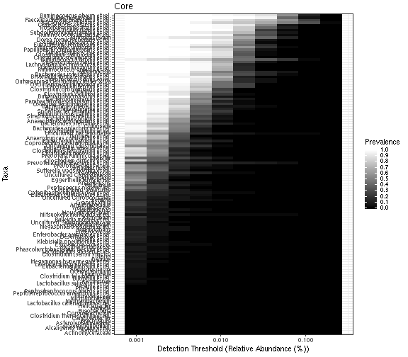
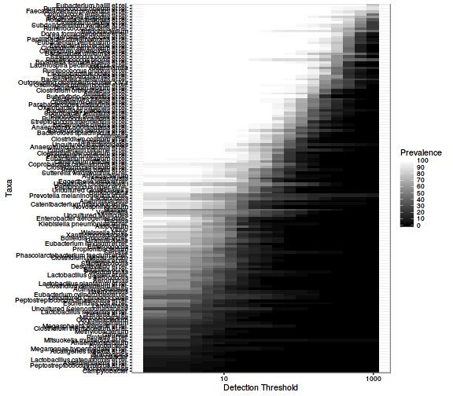
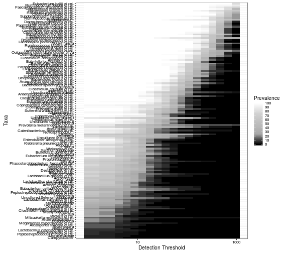
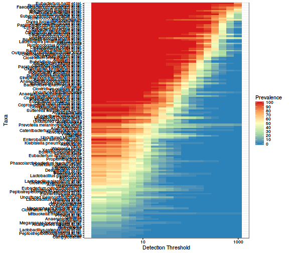

<!--
  %\VignetteEngine{knitr::rmarkdown}
  %\VignetteIndexEntry{microbiome tutorial - core}
  %\usepackage[utf8]{inputenc}
  %\VignetteEncoding{UTF-8}  
-->

### Prevalence of taxonomic groups

Load example data:


```r
library(microbiome)
data("peerj32")
pseq <- peerj32$phyloseq

# Calculate relative abundances
pseq.rel <- transform_phyloseq(pseq, "relative.abundance", "OTU")
```


Taxa prevalences (population frequency) at 1% relative abundance abundance threshold:


```r
head(prevalence(pseq.rel, detection.threshold = 1, sort = TRUE))
```

```
## Roseburia intestinalis et rel.     Eubacterium hallii et rel. 
##                      100.00000                      100.00000 
##     Clostridium nexile et rel.     Ruminococcus obeum et rel. 
##                      100.00000                       97.72727 
##   Coprococcus eutactus et rel.  Ruminococcus lactaris et rel. 
##                       97.72727                       95.45455
```


Alternatively, return the corresponding sample count instead of population frequency (relative = FALSE):


```r
head(prevalence(pseq.rel, detection.threshold = 1, sort = TRUE, relative = FALSE))
```

```
## Roseburia intestinalis et rel.     Eubacterium hallii et rel. 
##                             44                             44 
##     Clostridium nexile et rel.     Ruminococcus obeum et rel. 
##                             44                             43 
##   Coprococcus eutactus et rel.  Ruminococcus lactaris et rel. 
##                             43                             42
```


### Core microbiota

Core taxa above a given detection and prevalence thresholds:


```r
core.taxa <- core(pseq.rel, detection.threshold = 1, prevalence.threshold = 95)
```

Total core abundance:


```r
core.abundance <- core_abundance(pseq.rel, detection.threshold = 1, prevalence.threshold = 95)
```


### Core 2D line plots

Determine core microbiota across various abundance/prevalence
thresholds with the [blanket
analysis](http://onlinelibrary.wiley.com/doi/10.1111/j.1469-0691.2012.03855.x/abstract) based on various signal and prevalence thresholds. See also the the
bootstrap_microbes function.


```r
# With absolute read counts
det <- c(0, 1, 2, 5, 10, 20, 50, 100, 200, 500, 1000, 2000, 5000, 1e4)
prevalence.intervals <- seq(5, 100, 5)
p <- plot_core(pseq, prevalence.intervals = prevalence.intervals, detection.thresholds = det, plot.type = "lineplot")
p + xlab("Abundance (OTU read count)")

# With relative abundances
det <- c(0, 0.1, 0.2, 0.5, 1, 2, 5, 10, 20)
p <- plot_core(pseq.rel, prevalence.intervals = prevalence.intervals, detection.thresholds = det, plot.type = "lineplot")
p + xlab("Relative Abundance (%)")
```


### Core heatmaps


```r
# Core with relative abundances:
prevalence.intervals <- seq(5, 100, 5)
detection.thresholds <- 10^seq(log10(1e-3), log10(20), length = 20)

# Also define gray color palette
gray <- gray(seq(0,1,length=5))
p <- plot_core(pseq.rel, plot.type = "heatmap", colours = gray,
    prevalence.intervals = prevalence.intervals, detection.thresholds = detection.thresholds) 
print(p + xlab("Detection Threshold (Relative Abundance (%))"))

# Core with absolute counts and horizontal view:
detection.thresholds <- 10^seq(log10(1), log10(max(otu_table(pseq))/10), length = 20)		 
plot_core(pseq, plot.type = "heatmap", colours = gray,
       		 prevalence.intervals = prevalence.intervals,
       		 detection.thresholds = detection.thresholds,
		 min.prevalence = NULL, horizontal = TRUE)
```




Zoom in on the core region by filtering out rows and columns not passing min prevalence (given as percentages):


```r
p <- plot_core(pseq, plot.type = "heatmap", colours = gray,
                 prevalence.intervals = prevalence.intervals,
		 detection.thresholds = detection.thresholds,
		 min.prevalence = 10)
print(p)		 


library(RColorBrewer)
p <- plot_core(pseq, plot.type = "heatmap",
		 colours = rev(brewer.pal(5, "Spectral")),
                 prevalence.intervals = prevalence.intervals,
		 detection.thresholds = detection.thresholds,
		 min.prevalence = 0)		 
print(p)
```




