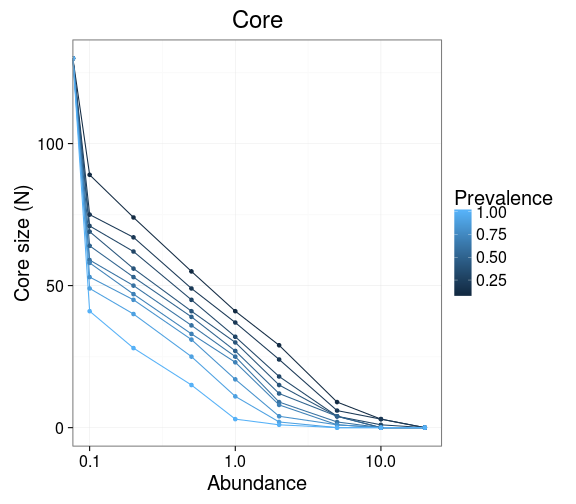
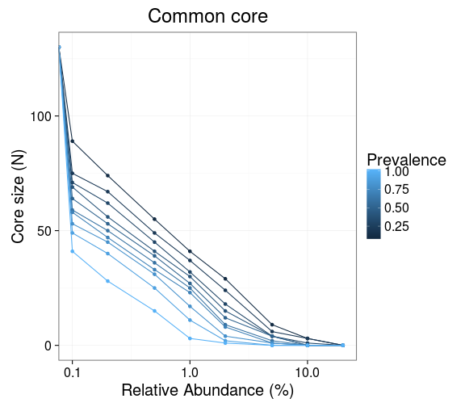
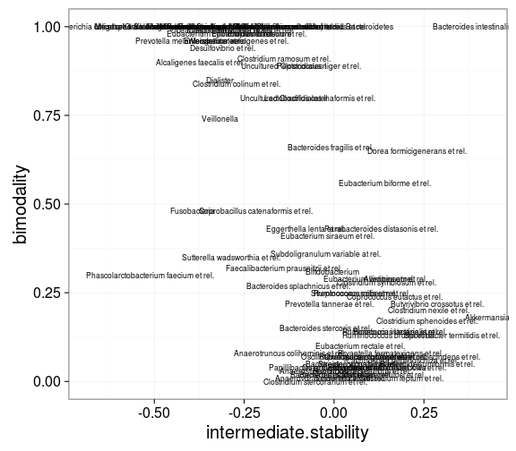

### Prevalence of taxonomic groups


```r
# Load example data
library(microbiome)
data("peerj32")
pseq <- peerj32$phyloseq

# Calculate relative abundances
pseq.rel <- transform_phyloseq(pseq, "relative.abundance", "OTU")
```


List prevalence for each group at 1 percent relative abundance abundance threshold:


```r
head(prevalence(pseq.rel, detection.threshold = 1, sort = FALSE))
```

```
##             Actinomycetaceae                   Aerococcus 
##                      0.00000                      0.00000 
##                    Aeromonas                  Akkermansia 
##                      0.00000                     52.27273 
## Alcaligenes faecalis et rel.           Allistipes et rel. 
##                      0.00000                     34.09091
```


List the taxa that are present at the given detection threshold (2% relative abundance) at a given prevalence (20%) (fraction of the samples):


```r
prevalent.taxa <- prevalent_taxa(pseq.rel, detection.threshold = 2, prevalence.threshold = 20)
```


### Core microbiota

Determine core microbiota with the [blanket
analysis](http://onlinelibrary.wiley.com/doi/10.1111/j.1469-0691.2012.03855.x/abstract)
based on various signal and prevalence thresholds.
 

```r
det <- c(0, 0.1, 0.2, 0.5, 1, 2, 5, 10, 20)
prev <- seq(10, 100, 10)
core <- core_matrix(pseq.rel, prevalence.intervals = prev, detection.thresholds = det)
```

### Core 2D line plots


```r
# Core lineplot with absolute read counts
det <- c(0, 1, 2, 5, 10, 20, 50, 100, 200, 500, 1000, 2000, 5000, 1e4)
res <- plot_core(pseq, prevalence.intervals = prev, detection.thresholds = det, plot.type = "lineplot")
```


```r
res$plot + xlab("Abundance (OTU count)")
```


```r
# Core lineplot with relative abundances
det <- c(0, 0.1, 0.2, 0.5, 1, 2, 5, 10, 20)
res <- plot_core(pseq.rel, prevalence.intervals = prev, detection.thresholds = det, plot.type = "lineplot")
```



```r
res$plot + xlab("Relative Abundance (%)")
```



```r
# Retrieve the core count data matrix
coremat <- res$data
print(coremat)
```

```
##     0.1 0.2 0.3 0.4 0.5 0.6 0.7 0.8 0.9   1
## 0   130 130 130 130 130 130 130 130 130 130
## 0.1  89  75  71  69  64  59  58  53  49  41
## 0.2  74  67  62  56  53  50  47  45  40  28
## 0.5  55  49  45  41  39  36  33  31  25  15
## 1    41  37  32  30  27  25  23  17  11   3
## 2    29  24  18  15  12   9   8   4   2   1
## 5     9   6   4   4   4   2   1   1   0   0
## 10    3   3   1   0   0   0   0   0   0   0
## 20    0   0   0   0   0   0   0   0   0   0
```


### Core heatmaps

Core with relative abundances:


```r
prevalence.intervals = seq(5, 100, 5)
detection.thresholds <- 10^seq(log10(1e-3), log10(20), length = 20)		 
res <- plot_core(pseq.rel, plot.type = "heatmap", palette = "bw", prevalence.intervals = prevalence.intervals, detection.thresholds = detection.thresholds) 
```

```
## Error in names(df) <- c("Taxa", "DetectionThreshold", "Prevalence"): 'names' attribute [3] must be the same length as the vector [2]
```

```r
print(res$plot + xlab("Detection Threshold (Relative Abundance (%))"))
```


```r
# Retrieve the core prevalence data matrix
prevalences <- res$data
```

Core with absolute counts:


```r
prevalence.intervals = seq(5, 100, 5)
detection.thresholds <- 10^seq(log10(1), log10(max(otu_table(pseq))/10), length = 20)		 
res <- plot_core(pseq, plot.type = "heatmap", palette = "bw", prevalence.intervals = prevalence.intervals, detection.thresholds = detection.thresholds)
```

```
## Error in names(df) <- c("Taxa", "DetectionThreshold", "Prevalence"): 'names' attribute [3] must be the same length as the vector [2]
```

```r
print(res$plot)
```


Zoom in on the core region by filtering out rows and columns with zero prevalence:


```r
res <- plot_core(pseq, plot.type = "heatmap", palette = "bw", prevalence.intervals = prevalence.intervals, detection.thresholds = detection.thresholds, min.prevalence = 0)
```

```
## Error in names(df) <- c("Taxa", "DetectionThreshold", "Prevalence"): 'names' attribute [3] must be the same length as the vector [2]
```

```r
print(res$plot)
```


Color scale core plot:


```r
p <- plot_core(pseq, plot.type = "heatmap", palette = "spectral")$plot
```

```
## Error in max(data): invalid 'type' (closure) of argument
```

```r
print(p)
```



