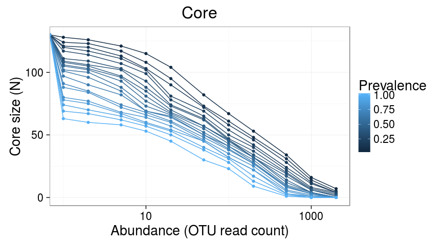
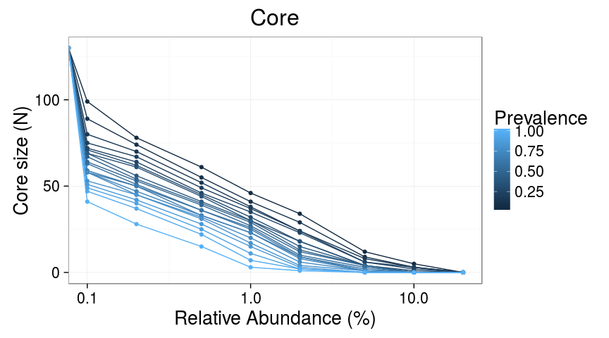
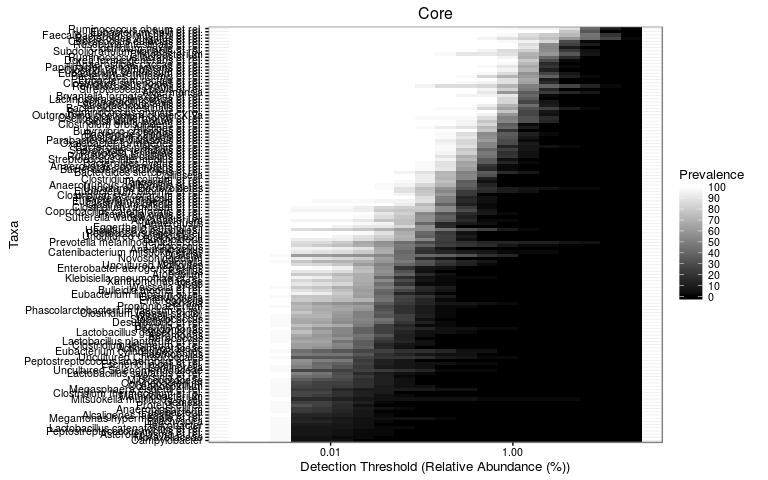
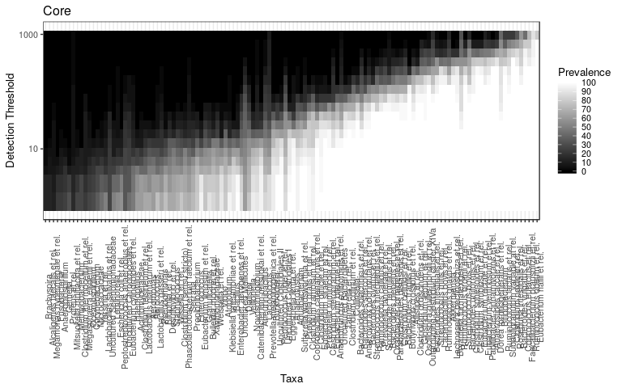

<!--
  %\VignetteEngine{knitr::rmarkdown}
  %\VignetteIndexEntry{microbiome tutorial - core}
  %\usepackage[utf8]{inputenc}
  %\VignetteEncoding{UTF-8}  
-->
Core microbiota analysis
------------------------

### Prevalence of taxonomic groups

Load example data:

    # Load data
    library(microbiome)
    data(peerj32)

    # Rename the data
    pseq <- peerj32$phyloseq

    # Calculate compositionals
    pseq.rel <- transform_phyloseq(pseq, "compositional", "OTU")

Taxa prevalences (population frequency) at 1% compositional abundance
threshold:

    head(prevalence(pseq.rel, detection = 1, sort = TRUE))

    ## Roseburia intestinalis et rel.     Eubacterium hallii et rel. 
    ##                      100.00000                      100.00000 
    ##     Clostridium nexile et rel.     Ruminococcus obeum et rel. 
    ##                      100.00000                       97.72727 
    ##   Coprococcus eutactus et rel.  Ruminococcus lactaris et rel. 
    ##                       97.72727                       95.45455

Alternatively, return the corresponding sample count instead of
population frequency (relative = FALSE):

    head(prevalence(pseq.rel, detection = 1, sort = TRUE, relative = FALSE))

    ## Roseburia intestinalis et rel.     Eubacterium hallii et rel. 
    ##                             44                             44 
    ##     Clostridium nexile et rel.     Ruminococcus obeum et rel. 
    ##                             44                             43 
    ##   Coprococcus eutactus et rel.  Ruminococcus lactaris et rel. 
    ##                             43                             42

### Core microbiota

Core taxa above a given detection and prevalences:

    core.taxa <- core_members(pseq.rel, detection = 1, prevalence = 95)

Pick the core microbiota subset of the data:

`{r core-data, message=FALSE, warning=FALSE}c pseq.core <- core(pseq.rel, detection = 1, prevalence = 95)`

Total core abundance (sum of abundances of the core members):

    core.abundance <- core_abundance(pseq.rel, detection = 1, prevalence = 95)

Core visualization
------------------

### 2D line plots

Determine core microbiota across various abundance/prevalence thresholds
with the [blanket
analysis](http://onlinelibrary.wiley.com/doi/10.1111/j.1469-0691.2012.03855.x/abstract)
based on various signal and prevalences. See also the the
bootstrap\_microbes function.

    # With absolute read counts
    det <- c(0, 1, 2, 5, 10, 20, 50, 100, 200, 500, 1000, 2000, 5000, 1e4)
    prevalence.intervals <- seq(5, 100, 5)
    p <- plot_core(pseq, prevalence.intervals = prevalence.intervals, detections = det, plot.type = "lineplot")
    p + xlab("Abundance (OTU read count)")

    ## Warning: Transformation introduced infinite values in continuous x-axis

    ## Warning: Transformation introduced infinite values in continuous x-axis

    # With compositionals
    det <- c(0, 0.1, 0.2, 0.5, 1, 2, 5, 10, 20)
    p <- plot_core(pseq.rel, prevalence.intervals = prevalence.intervals, detections = det, plot.type = "lineplot")
    p + xlab("Relative Abundance (%)")

    ## Warning: Transformation introduced infinite values in continuous x-axis

    ## Warning: Transformation introduced infinite values in continuous x-axis

### Core heatmaps

    # Core with compositionals:
    prevalence.intervals <- seq(5, 100, 5)
    detections <- 10^seq(log10(1e-3), log10(20), length = 20)

    # Also define gray color palette
    gray <- gray(seq(0,1,length=5))
    p <- plot_core(pseq.rel, plot.type = "heatmap", colours = gray,
        prevalence.intervals = prevalence.intervals, detections = detections) 
    print(p + xlab("Detection Threshold (Relative Abundance (%))"))

    # Core with absolute counts and horizontal view:
    detections <- 10^seq(log10(1), log10(max(abundances(pseq))/10), length = 20)         
    plot_core(pseq, plot.type = "heatmap", colours = gray,
                 prevalence.intervals = prevalence.intervals,
                 detections = detections,
             min.prevalence = NULL, horizontal = TRUE)

Zoom in on the core region by filtering out rows and columns not passing
min prevalence (given as percentages):

    p <- plot_core(pseq, plot.type = "heatmap", colours = gray,
                     prevalence.intervals = prevalence.intervals,
             detections = detections,
             min.prevalence = 10)
    print(p)         

    library(RColorBrewer)
    p <- plot_core(pseq, plot.type = "heatmap",
             colours = rev(brewer.pal(5, "Spectral")),
                     prevalence.intervals = prevalence.intervals,
             detections = detections,
             min.prevalence = 0)         
    print(p)

