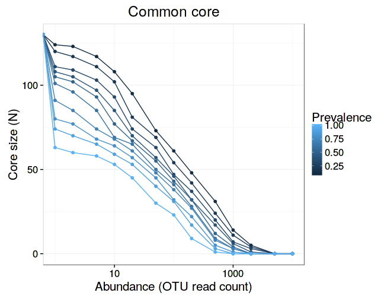
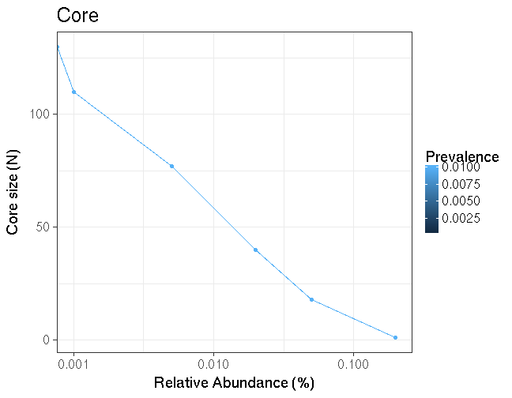

### Prevalence of taxonomic groups


```r
# Example data
library(microbiome)
data(peerj32)
x <- peerj32$microbes

# List prevalence measure for each group using detection threshold of 2
# Sort the taxa by prevalence
head(prevalence(x, 2, sort = TRUE))
```

```
##  Yersinia et rel.  Xanthomonadaceae  Wissella et rel.            Vibrio 
##                 1                 1                 1                 1 
## Weissella et rel.       Veillonella 
##                 1                 1
```

```r
# Just list the names of taxa that are present over abundance threshold 2
# in over 20 percent of the samples:
prevalent.taxa <- list_prevalent_groups(x, 2, 0.2)
```


### Core microbiota

Determine common core microbiota, following the [blanket
analysis](http://onlinelibrary.wiley.com/doi/10.1111/j.1469-0691.2012.03855.x/abstract):
 

```r
core <- createCore(t(x))
```

Visualizing core microbiota:


```r
# Core 2D visualization
tmp <- Core2D(core)
```

 

```r
# Core heatmap
tmp <- core_heatmap(t(x))
```

 


