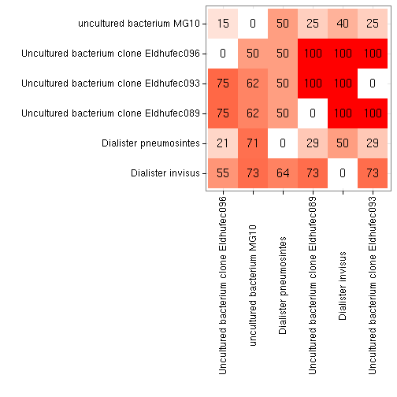

## Visualizing cross-hybridization

To visualize cross-hybridization between selected taxa on HITChip (or
other chips), use the following.

By default the groups with no cross-hyb are filtered out for clarity. Rows and columns are ordered by hierarchical clustering. The cross-hyb is shown in percentages, rounded as indicated by the rounding argument. The percentage indicates which fraction of probes for a row taxon overlaps with probes of a column taxon. This is not symmetric if the row and col taxon have a different total number of probes. For details, see help(PlotCrosshyb).


```r
library(microbiome, quietly = TRUE)

# Check cross-hyb between all L1 groups
res <- PlotCrosshyb(tax.level = "L2", rounding = 1, show.plot = FALSE)
```

```
## Reading /home/lei/R/x86_64-unknown-linux-gnu-library/3.2/microbiome/extdata/phylogeny.filtered.tab
```

```r
# Pick the crosshyb table and figure
crosshyb.table <- res$data
p <- res$plot

# Plot the figure    
print(p)
```

 

```r
# Organize the Crosshyb table
suppressMessages(library(dplyr))
s <- filter(res$data, crosshyb > 0)
s <- s[rev(order(s$crosshyb)),]
head(s)
```

```
##                          Taxon1                       Taxon2 crosshyb
## 379                    Serratia                       Vibrio      100
## 257 Uncultured Selenomonadaceae Megasphaera elsdenii et rel.      100
## 200                    Serratia                  Haemophilus      100
## 166                    Serratia     Escherichia coli et rel.      100
## 39     Uncultured Bacteroidetes Bacteroides plebeius et rel.      100
## 11     Uncultured Bacteroidetes           Allistipes et rel.      100
```


### Further examples

Investigate species-species cross-hybridization within the Dialister L2 group


```r
# Pick the phylogeny which was used to summarize probes to species level
phylogeny.info <- GetPhylogeny("HITChip", "filtered") 
```

```
## Reading /home/lei/R/x86_64-unknown-linux-gnu-library/3.2/microbiome/extdata/phylogeny.filtered.tab
```

```r
# Select species belonging to Dialister L2 group
mytaxa <- levelmap("Dialister", level.from = "L2", level.to = "species", phylogeny.info = phylogeny.info)[[1]]

# Check cross-hyb between Dialister species
res <- PlotCrosshyb(tax.level = "species", selected.taxa = mytaxa, rounding = 0, phylogeny.info = phylogeny.info)
```

```
## Reading /home/lei/R/x86_64-unknown-linux-gnu-library/3.2/microbiome/extdata/phylogeny.filtered.tab
```

 

```r
# Check the cross-hyb data as well
head(res$data)
```

```
##                                   Taxon1                 Taxon2  crosshyb
## 1                      Dialister invisus      Dialister invisus   0.00000
## 2                 Dialister pneumosintes      Dialister invisus  20.00000
## 3 Uncultured bacterium clone Eldhufec089      Dialister invisus 100.00000
## 4 Uncultured bacterium clone Eldhufec093      Dialister invisus 100.00000
## 5              uncultured bacterium MG10      Dialister invisus   0.00000
## 6                      Dialister invisus Dialister pneumosintes  33.33333
```

