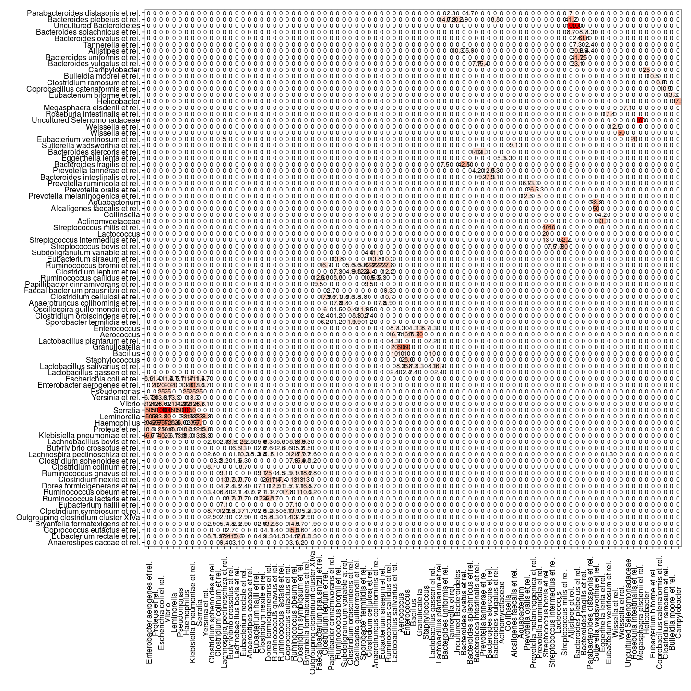

## Visualizing cross-hybridization

To visualize cross-hybridization between selected taxa on HITChip (or
other chips), use the following scripts. By default the groups with no
cross-hyb are filtered out for clarity. Rows and columns are ordered
by hierarchical clustering. The cross-hyb is shown in percentages,
rounded as indicated by the rounding argument. The percentage
indicates which fraction of probes for a row taxon overlaps with
probes of a column taxon. This is not symmetric if the row and col
taxon have a different total number of probes. For details, see
help(PlotCrosshyb).


```r
library(microbiome, quietly = TRUE)

# Check cross-hyb between all L1 groups
res <- PlotCrosshyb(tax.level = "L2", rounding = 1, show.plot = FALSE)
    
# Pick the crosshyb table and figure
crosshyb.table <- res$data
p <- res$plot

# Plot the figure    
print(p)
```

 

```r
# Organize the Crosshyb table
suppressMessages(library(dplyr))
s <- filter(res$data, crosshyb > 0)
s <- s[rev(order(s$crosshyb)),]
head(s)
```

```
##                          Taxon1                       Taxon2 crosshyb
## 379                    Serratia                       Vibrio      100
## 257 Uncultured Selenomonadaceae Megasphaera elsdenii et rel.      100
## 200                    Serratia                  Haemophilus      100
## 166                    Serratia     Escherichia coli et rel.      100
## 39     Uncultured Bacteroidetes Bacteroides plebeius et rel.      100
## 11     Uncultured Bacteroidetes           Allistipes et rel.      100
```


### Further examples

Investigate species-species cross-hybridization within the Dialister L2 group


```r
# Pick the phylogeny which was used to summarize probes to species level
tax.table <- GetPhylogeny("HITChip", "filtered") 
```

```
## Error in eval(expr, envir, enclos): could not find function "GetPhylogeny"
```

```r
# Select species belonging to Dialister L2 group
mytaxa <- levelmap("Dialister", from = "L2", to = "species", tax.table)[[1]]
```

```
## Error in levelmap("Dialister", from = "L2", to = "species", tax.table): object 'tax.table' not found
```

```r
# Check cross-hyb between Dialister species
res <- PlotCrosshyb(tax.level = "species", selected.taxa = mytaxa, rounding = 0, tax.table)
```

```
## Error in PlotCrosshyb(tax.level = "species", selected.taxa = mytaxa, rounding = 0, : object 'mytaxa' not found
```

```r
# Check the cross-hyb data as well
head(res$data)
```

```
##                              Taxon1           Taxon2 crosshyb
## 1                  Actinomycetaceae Actinomycetaceae        0
## 2                        Aerococcus Actinomycetaceae        0
## 3      Alcaligenes faecalis et rel. Actinomycetaceae        0
## 4                Allistipes et rel. Actinomycetaceae        0
## 5       Anaerostipes caccae et rel. Actinomycetaceae        0
## 6 Anaerotruncus colihominis et rel. Actinomycetaceae        0
```

