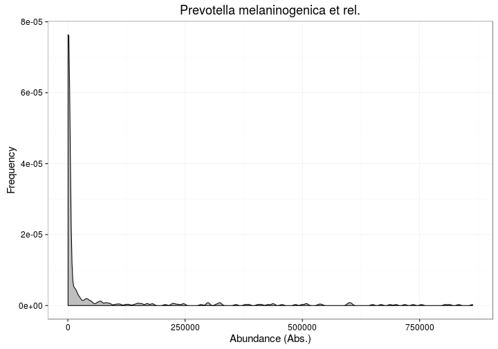
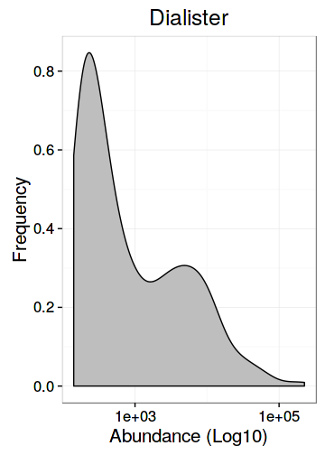
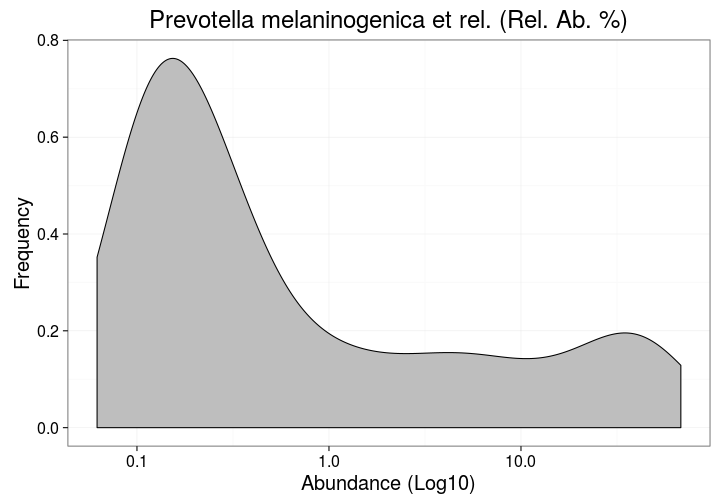

### Abundance histograms

Different sample sets have different population distributions in
microbial abundance. It is also important to consider whether to use
absolute or logarithmic abundances.


Visualize population densities for specific taxonomic group:


```r
library(microbiome)
x <- download_microbiome("atlas1006")
```

```
## Downloading data set from Lahti et al. Nat. Comm. 5:4344, 2014 from Data Dryad: http://doi.org/10.5061/dryad.pk75d
```

```r
# Pick the subset of RBB-preprocessed samples from time point 0
x <- subset_samples(x, time == 0 & DNA_extraction_method == "r")

# Visualize population densities for specific taxa
plot_density(x, "Prevotella melaninogenica et rel.")
```




Same with log10 abundances:


```r
plot_density(x, "Prevotella melaninogenica et rel.", log10 = TRUE)
```




Same with log10 relative abundances:


```r
# Convert to relative abundances
x <- transform_sample_counts(x, function (x) {100 * x/sum(x)})

# Visualize
tax <- "Prevotella melaninogenica et rel."
plot_density(x, tax, log10 = TRUE) + ggtitle(paste(tax, "(Rel. Ab. %)"))
```



