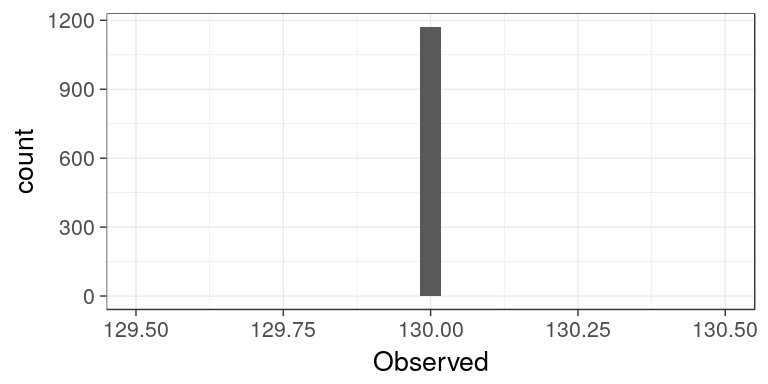
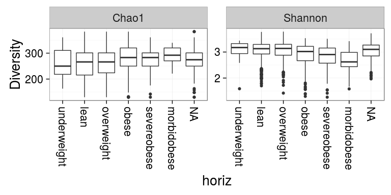
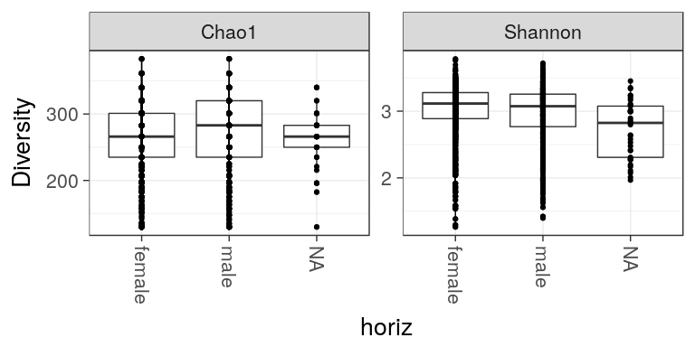
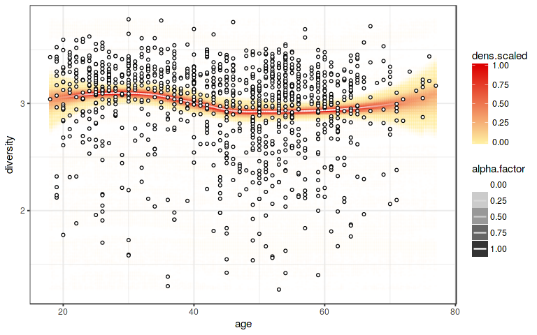

<!--
  %\VignetteEngine{knitr::rmarkdown}
  %\VignetteIndexEntry{microbiome tutorial - diversity}
  %\usepackage[utf8]{inputenc}
  %\VignetteEncoding{UTF-8}  
-->
Alpha richness and diversity
----------------------------

See a separate page on [Beta diversity](Betadiversity.md).

Load example data:

    library(microbiome)
    data(atlas1006)
    pseq <- atlas1006

### Diversity estimation

    # Estimate diversity (table with various diversity measures):
    diversity <- microbiome::diversity(pseq, detection = 0)

    # Show beginning of the diversity table
    head(kable(diversity))

    ## [1] "               Observed      Chao1      se.chao1        ACE       se.ACE    Shannon     Simpson   InvSimpson     Fisher    Evenness"
    ## [2] "------------  ---------  ---------  ------------  ---------  -----------  ---------  ----------  -----------  ---------  ----------"
    ## [3] "Sample.1            130   340.0000    94.2987236   187.4993    5.7593841   3.189726   0.9230387    12.993537   12.29785   0.6553063"
    ## [4] "Sample.2            130   320.0000    87.5785362   205.6407    5.7088622   3.396135   0.9397719    16.603545   11.93702   0.6977115"
    ## [5] "Sample.3            130   340.0000    94.2987236   265.3240    6.8856308   2.866104   0.8850959     8.702908   12.38015   0.5888204"
    ## [6] "Sample.4            130   301.0000    81.0278345   185.0672    5.7683376   3.058653   0.9066459    10.711903   11.85667   0.6283784"

### Visualization

Show diversity:

    library(ggplot2)
    theme_set(theme_bw(20)) # Set bw color scheme
    p <- ggplot(diversity, aes(x = Shannon)) + geom_histogram()
    print(p)

Visualize diversity measures w.r.t. discrete variable (or check more
generic [group-wise comparison tools](Comparisons.md))

    p <- plot_diversity(pseq, "bmi_group", measures = c("Chao1", "Shannon"), indicate.subjects = FALSE)
    print(p)

### Group-wise comparison

To indicate time as discrete variable, order it as a factor. If a
subject column is available in sample data the subjects will be
indicated by lines across the groups

    # Visualize diversities across groups
    p <- plot_diversity(pseq, "gender", measures = c("Chao1", "Shannon"), indicate.subject = TRUE)
    print(p)

Diversity vs. continuous variable:

    library(dplyr)
    pseq <- atlas1006

    # Add diversity into sample metadata
    sample_data(pseq)$diversity <- microbiome::diversity(pseq)$Shannon

    # Visualize
    p <- plot_regression(diversity ~ age, meta(pseq))
    print(p)

