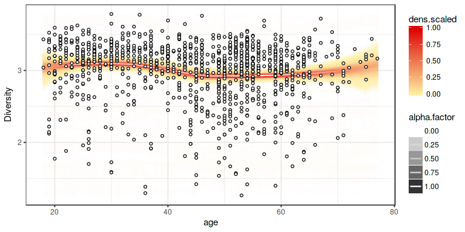

<!--
  %\VignetteEngine{knitr::rmarkdown}
  %\VignetteIndexEntry{microbiome tutorial - diversity}
  %\usepackage[utf8]{inputenc}
  %\VignetteEncoding{UTF-8}  
-->
### Richness

    # Get example data in phyloseq format
    library(microbiome)
    data(atlas1006)
    pseq <- atlas1006

    # Pick the OTU data
    # (note the zero point has been moved to the detection threshold;
    #  typically signal 1.8 at HITChip log10 scale)
    library(phyloseq)
    otu <- abundances(pseq)

    # Determine detection threshold at the 0.15 quantile
    # Then Calculate richness.
    # This simply indicates how many taxa are present in each sample
    # (exceed the detection threshold). This measure is sometimes used with
    # phylogenetic microarrays.
    det.th <- quantile(otu, 0.15)
    ri <- diversity_table(pseq, det.th = det.th)$Observed
    hist(ri, main = "Richness")

### Diversity

Estimate diversity (table with various diversity measures):

    diversity <- diversity_table(pseq)

Visualize diversity vs. discrete variable:

    p <- plot_diversity(pseq, "bmi_group", measures = c("Chao1", "Shannon"), indicate.subjects = FALSE)
    print(p)

    # To indicate time as discrete variable, order it as a factor
    # If a subject column is available in sample data
    # the subjects will be indicated by lines across the groups
    data(dietswap)
    pseq <- dietswap
    psub <- subset_samples(pseq, group == "DI")
    sample_data(psub)$timepoint <- factor(sample_data(psub)$timepoint, levels = sort(unique(sample_data(psub)$timepoint)))
    p <- plot_diversity(psub, "timepoint", measures = c("Chao1", "Shannon"), indicate.subject = TRUE)
    print(p)

Diversity vs. continuous variable:

    p <- plot_diversity(atlas1006, "age", measures = "Shannon")
    print(p)

Diversity vs. age with smoothed confidence intervals - manual version:

    library(microbiome)
    library(sorvi)
    library(dplyr)
    pseq <- atlas1006

    # Add diversity into sample metadata
    sample_data(pseq)$diversity <- diversity_table(pseq)$Shannon

    # Select a subset of samples
    pseq0 <- subset_samples(pseq, time == 0 & DNA_extraction_method == "r")

    # Visualize
    df <- sample_data(pseq0)
    p <- plot_regression(diversity ~ age, df)
    print(p)
