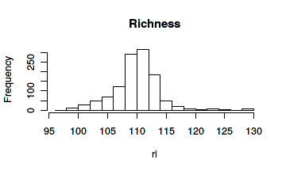
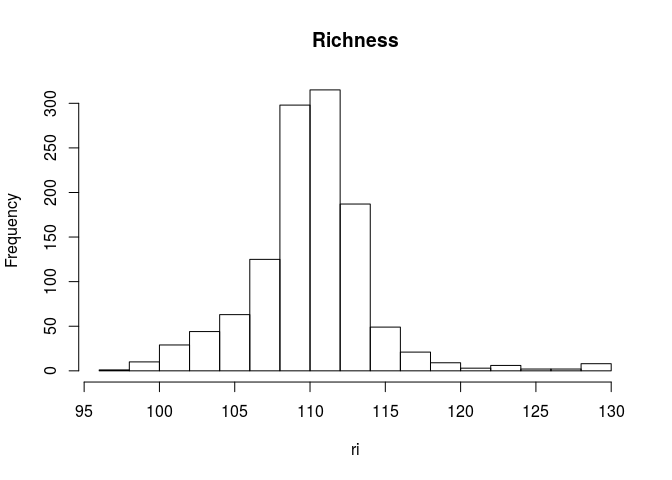
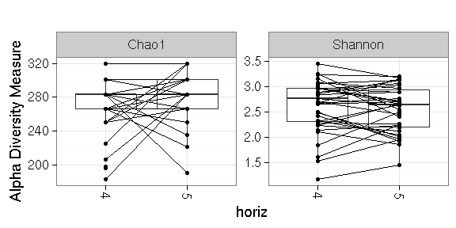
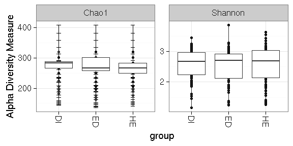
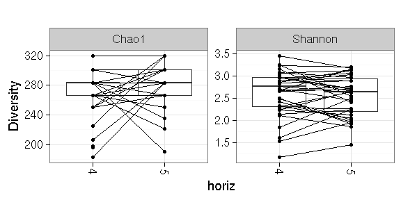
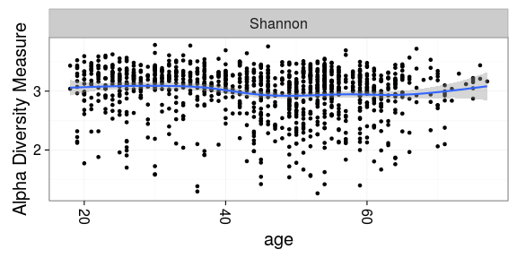
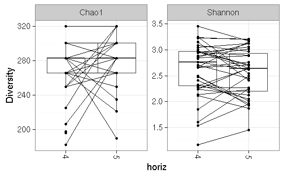

### Richness 


```r
# Get example data in phyloseq format
library(microbiome)
data("atlas1006")
pseq <- atlas1006

# Pick the OTU data
# (note the zero point has been moved to the detection threshold;
#  typically signal 1.8 at HITChip log10 scale)
library(phyloseq)
otu <- otu_table(pseq)@.Data

# Determine detection threshold at the 0.15 quantile
# Bacteria that exceed this threshold are considered present
# otherwise absent
det.th <- quantile(otu, 0.15)

# Visualize the detection threshold (at log10 scale for clarity)
plot(density(log10(otu)), main = "Detection threshold", xlab = "Abundance (Log10)", ylab = "Frequency")
abline(v = log10(det.th))
```



```r
# Calculate richness.
# This simply indicates how many taxa are present in each sample
# (exceed the detection threshold). This measure is sometimes used with
# phylogenetic microarrays.
ri <- estimate_diversity(pseq, det.th = det.th)$Observed
hist(ri, main = "Richness")
```




### Diversity 

Estimate diversity (table with various diversity measures):


```r
diversity <- estimate_diversity(pseq)
```

Visualize diversity vs. discrete variable:


```r
p <- plot_diversity(pseq, "bmi_group", measures = c("Chao1", "Shannon"))
print(p)
```


```r
# To indicate time as discrete variable, order it as a factor
# If a subject column is available in sample data
# the subjects will be indicated by lines across the groups
psub <- subset_samples(pseq, group == "DI")
```

```
## Error in eval(expr, envir, enclos): object 'group' not found
```

```r
sample_data(psub)$timepoint <- factor(sample_data(psub)$timepoint, levels = sort(unique(sample_data(psub)$timepoint)))
```

```
## Error in sample_data(psub): error in evaluating the argument 'object' in selecting a method for function 'sample_data': Error: object 'psub' not found
```

```r
p <- plot_diversity(psub, "timepoint", measures = c("Chao1", "Shannon"))
```

```
## Error in otu_table(physeq): error in evaluating the argument 'object' in selecting a method for function 'otu_table': Error: object 'psub' not found
```

```r
print(p)
```



Same with the phyloseq function:


```r
p <- plot_richness(pseq, "bmi_group", measures = c("Chao1", "Shannon"))
p <- p + geom_boxplot()
print(p)
```




Highlight specific groups:


```r
library(ggplot2)
#data.dietswap <- download_microbiome("dietswap")
data("dietswap")
p <- plot_richness(dietswap, x = "gender", color = "group", measures = c("Shannon", "Simpson")) 
p <- p + geom_boxplot()
print(p)
```

```
## Error in eval(expr, envir, enclos): object 'gender' not found
```


Diversity vs. continuous variable:


```r
p <- plot_diversity(pseq, x = "age", measures = "Shannon")
```

```
## Error in access(object, "otu_table", errorIfNULL): otu_table slot is empty.
```

```r
print(p)
```

```
## Error in eval(expr, envir, enclos): object 'gender' not found
```



Same with the phyloseq function:


```r
p <- plot_richness(pseq, x = "age", measures = "Shannon")
p <- p + geom_smooth()
print(p)
```




Diversity vs. age with smoothed confidence intervals - manual version:


```r
library(microbiome)
library(sorvi)
library(dplyr)

# Add diversity into sample metadata
sample_data(pseq)$diversity <- estimate_diversity(pseq)$Shannon

# Select a subset of samples
pseq0 <- subset_samples(pseq, time == 0 & DNA_extraction_method == "r")

# Visualize
df <- sample_data(pseq0)
p <- sorvi::regression_plot(diversity ~ age, df)
print(p)
```




