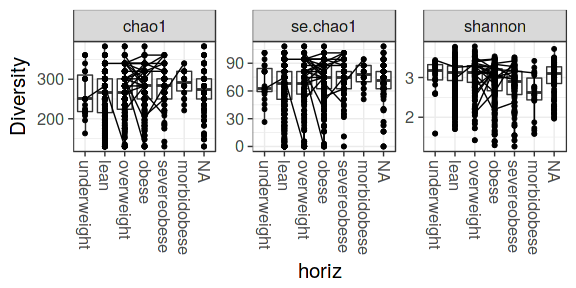
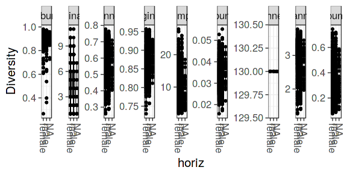
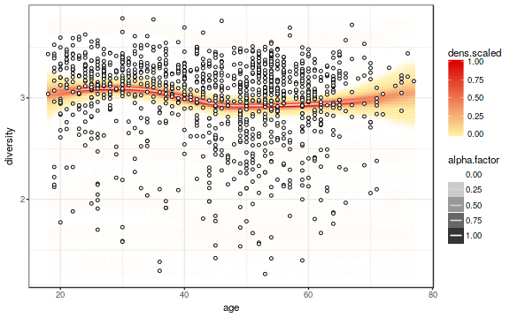

<!--
  %\VignetteEngine{knitr::rmarkdown}
  %\VignetteIndexEntry{microbiome tutorial - diversity}
  %\usepackage[utf8]{inputenc}
  %\VignetteEncoding{UTF-8}  
-->


## Global Ecosystem State Variables 

Load example data:


```r
library(microbiome)
data(atlas1006)
pseq <- atlas1006
```


### Community richness and alpha diversity estimation

This function returns a table with a selection of global ecosystem indicators. Additional indices are also available; see the function help. See a separate page on [Beta diversity](Betadiversity.html).


```r
indicators <- global(pseq)
head(kable(indicators))
```

```
## [1] "|            |  shannon| invsimpson| richness|  evenness| dominance|      gini| top_abundance| low_abundance| core_abundance|"
## [2] "|:-----------|--------:|----------:|--------:|---------:|---------:|---------:|-------------:|-------------:|--------------:|"
## [3] "|Sample-1    | 3.189726|  12.993537|      130| 0.6553063|         5| 0.8486688|     0.1758679|     0.0246043|      0.9597792|"
## [4] "|Sample-2    | 3.396135|  16.603545|      130| 0.6977115|         7| 0.8186840|     0.1716273|     0.0199587|      0.9015118|"
## [5] "|Sample-3    | 2.866104|   8.702908|      130| 0.5888204|         4| 0.8805150|     0.2793253|     0.0393057|      0.9391221|"
## [6] "|Sample-4    | 3.058653|  10.711903|      130| 0.6283784|         4| 0.8601541|     0.1957585|     0.0249986|      0.9509151|"
```

The supported divesity measures include those supported in the phyloseq::estimate_richness. Further measures are also provided (see function help), or can be calculated separately as described below.


### Top and low abundance

Top and low abundance indices refer to the abundance of the most and least abundant species, respectively. For the most abundant species, the sum of relative abundances up to the given rank (top-n) is calculated. For the least abundant taxa, the sum of relative abundances is returned for those taxa whose abundance falls below the indicated detection threshold.


```r
# Absolute abundances for the single most abundant taxa in each sample
ta <- top_abundance(pseq, rank = 1)

# Relative abundances
la <- low_abundance(pseq, detection = 0.2/100)
```


### Dominance

The dominance index gives the number of groups needed to have a given proportion of the ecosystem occupied (by default 0.5 ie 50%).


```r
do <- dominance(pseq, threshold = 0.5)
```


### Rarity and core abundance

Rarity index refers to the relative proportion of the rare species (those that are not among the core members). See also the core_abundance function, which provides the complement.


```r
ra <- rarity(pseq, detection = .1/100, prevalence = 50/100)
co <- core_abundance(pseq, detection = .1/100, prevalence = 50/100)
```


### Gini index

Gini index is a common measure for inequality in economical income, but can also be used as a community diversity measure.


```r
gi <- inequality(pseq)
```


### Visualization

Show indicators:


```r
library(ggplot2)
theme_set(theme_bw(20)) # Set bw color scheme
p <- ggplot(indicators, aes(x = shannon)) + geom_histogram()
print(p)
```


Visualize ecosystem state indicators w.r.t. discrete variable (or check more generic [group-wise comparison tools](Comparisons.html))


```r
p <- plot_diversity(pseq, "bmi_group", measures = c("Chao1", "shannon"), indicate.subjects = FALSE)
print(p)
```




### Group-wise comparison

To indicate time as discrete variable, order it as a factor. If a
subject column is available in sample data the subjects will be
indicated by lines across the groups. 


```r
p <- plot_diversity(pseq, "gender", measures = c("chao1", "shannon"), indicate.subject = TRUE)
print(p)
```




Indicators vs. continuous variable:


```r
library(dplyr)
pseq <- atlas1006

# Add shannon diversity in the sample metadata
sample_data(pseq)$diversity <- global(pseq)$shannon

# Visualize
p <- plot_regression(diversity ~ age, meta(pseq))
print(p)
```




