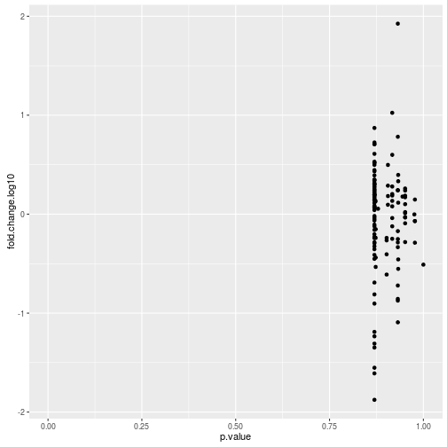
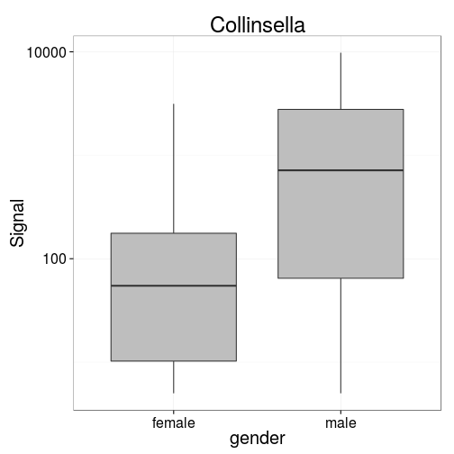
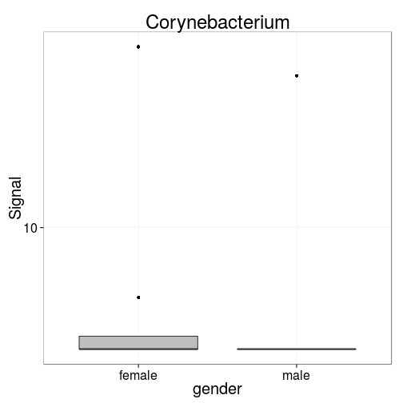
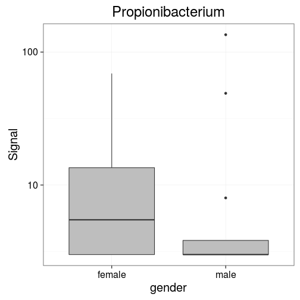

# Example document

This Rmarkdown document shows how to carry out some basic HITChip analysis with RStudio. [Download this file](https://raw.githubusercontent.com/microbiome/microbiome/master/vignettes/Example.Rmd), open it in RStudio, and then press the 'Knit HTML button'. This will generate and open a HTML file with some analysis with an example data set. You can then modify this file to use your own data (see below), or add new analyses.


## Update the microbiome package

Run this to make sure you have the latest version of the microbiome package:


```r
# Updating microbiome package
library(devtools)
install_github("microbiome/microbiome")
```

Load the tools:


```r
# Loading microbiome package
library(microbiome)
```

## Define your data folder

Change the data.path to your own data folder here:


```r
# data.directory <- "/home/mydata/hitchip/"
data.path <- system.file("extdata", package = "microbiome")
print(paste("Reading data from:", data.path))
```

```
## [1] "Reading data from: /home/antagomir/R/x86_64-pc-linux-gnu-library/3.2/microbiome/extdata"
```


## Reading probe-level data

Read HITChip data and check available data entries:


```r
# Read HITChip data from the given folder, preprocessed with fRPA
data <- read_hitchip(data.dir = data.path, method = "frpa", detection.threshold = 10^1.8)

# 'OTU' (species-level) data in phyloseq data
pseq.species <- data$pseq

# L2 data in phyloseq format
pseq.L2 <- aggregate_taxa(pseq.species, level = "L2")

# Probe-level data in phyloseq format
pseq.probe <- hitchip2physeq(t(data$probedata), sample_data(data$pseq), detection.limit = 10^1.8)
```

## Diversity 

Use probe-level data (pseq.probe) to quantify diversity:


```r
# Diversity estimation
diversities <- estimate_diversity(pseq.probe)[, c("Shannon", "InvSimpson")]

# Show diversity estimates for the first 5 samples:
library(knitr)
kable(diversities[1:5,])
```


|         |  Shannon| InvSimpson|
|:--------|--------:|----------:|
|Sample.1 | 5.854566|   194.7215|
|Sample.2 | 5.516757|   117.1191|
|Sample.3 | 5.994427|   237.3818|
|Sample.4 | 5.414883|   121.0294|
|Sample.5 | 5.355688|   111.0888|


## Richness

Estimate richness (probe count):


```r
# Estimate richness
res <- estimate_diversity(pseq.probe, det.th = 1)
richness <- res$Observed
names(richness) <- rownames(res)

# Show richness estimates for the first 5 samples
richness[1:5]
```

```
## Sample.1 Sample.2 Sample.3 Sample.4 Sample.5 
##     1453     1254     1917     1138     1120
```


Visualize diversity vs. discrete metadata variable (here 'diet' but you can call any variable from your metadata):


```r
plot_diversity(pseq.probe, x = "diet", measures = "Shannon")
```

```
## Error in access(object, "otu_table", errorIfNULL): otu_table slot is empty.
```

```r
plot_diversity(pseq.probe, x = "diet", measures = "InvSimpson")
```

```
## Error in access(object, "otu_table", errorIfNULL): otu_table slot is empty.
```

### Wilcoxon test

Wilcoxon test for each OTU based on gender comparison. You can replace the gender with any variable that is available in your sample metadata and has exactly two groups.


Run Wilcoxon test and show the first 5 values (sorted by p-value):


```r
res <- check_wilcoxon(pseq.L2, "gender", p.adjust.method = "BH", sort = TRUE)
kable(res[1:5,])
```


|                       |   p.value| fold.change.log10|
|:----------------------|---------:|-----------------:|
|Collinsella            | 0.8696424|         0.7078125|
|Corynebacterium        | 0.8696424|        -0.2030747|
|Propionibacterium      | 0.8696424|         0.0605491|
|Asteroleplasma et rel. | 0.8696424|         0.1995724|
|Aerococcus             | 0.8696424|         0.2825466|

[Volcano plot](https://en.wikipedia.org/wiki/Volcano_plot_%28statistics%29) shows how the fold-changes and p-values are related. In general, if there are significant findings, the fold-changes tend to be larger with smaller p-values:


```r
library(ggplot2)
ggplot(res, aes(x = p.value, y = fold.change.log10)) + 
  geom_point() + 
  xlim(0, 1)
```



Boxplots of the most significant groups:


```r
top.groups <- rownames(res)[1:4]
for (tax in top.groups) {
  p <- boxplot_abundance(pseq.L2, x = "gender", y = tax, log10 = TRUE, title = tax)
  print(p)
}
```




### Hierarchical clustering

Cluster the samples in probe-level data with hierarchical clustering:


```r
# Calculate dissimilarity matrix
d <- 1 - cor(as.matrix(otu_table(pseq.probe)@.Data), method = "spearman")
# Perform hierarchical clustering
hc <- hclust(as.dist(d), method = "complete")
# Show the plot
plot(hc, hang = -1)
```


