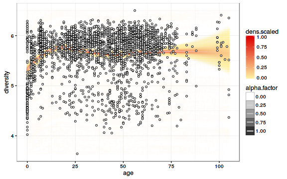

<!--
  %\VignetteEngine{knitr::rmarkdown}
  %\VignetteIndexEntry{microbiome tutorial}
  %\usepackage[utf8]{inputenc}
-->


HITChip Atlas Overview
===========


The HITChip Atlas data collection covers microbial abundance profiles
for 130 genus-like taxa across over 10,000 samples, measured with 16S
rRNA phylogenetic microarrays. This page contains a reproducible
summary and overview of this data collection.

The analyses are based on the microbiome R package, which provides
convenient wrappers for many standard tasks encountered in microbiome
studies. The microbiome R package extends the
[phyloseq](http://joey711.github.io/phyloseq/import-data) class, a
standard representation format in R for taxonomic profiling.


### Data overview

Downloading the data in R:


```r
# Download the required R packages and then the HITChip Atlas data set
library("microbiome")
#data("atlas1006")
#pseq <- atlas1006
# Load the data (not yet public)
atlas = readRDS("/home/lei/proj/hitchip-atlas-annotation-scripts/Atlas.RData") # atlas
```

The data contains:

 * ``10763`` samples
 * ``5007`` unique subjects
 * ``51.6``% female ratio. Altogether, gender information is available for ```round(100 * sum(table(subset(sample_data(atlas))$gender)[c("male", "female")])/nsamples(atlas), 1)```% of the samples.
 * ``3765`` samples (``35``%) from ``1785`` unique subjects with reported health problems ('compromised')
 * ``455`` samples from ``208`` unique subjects with reported antibiotics use.
 * ``112`` samples from ``77`` subjects with reported probiotics use.
 * ``1150`` samples from ``813`` subjects with reported medication.  
 


### Diversity vs. host variables


```r
# Pick the subset of RBB-preprocessed samples from time point 0
pseq <- subset_samples(atlas, time == 0 & DNA_extraction_method == "rbb")

p <- plot_regression(diversity~age, sample_data(pseq))
print(p)
```


```r
p <- plot_regression(diversity~bmi, sample_data(pseq))
```

```
## Error in eval(expr, envir, enclos): incorrect size (1), expecting : 2823
```

```r
print(p)
```




### Licensing and Citations

This material can be freely used, modified and distributed under the
[Two-clause FreeBSD
license](http://en.wikipedia.org/wiki/BSD\_licenses). Kindly cite as
'Leo Lahti, Jarkko Salojarvi, Anne Salonen and Willem M de
Vos. HITChip Atlas. URL: http://microbiome.github.com'.


### References


