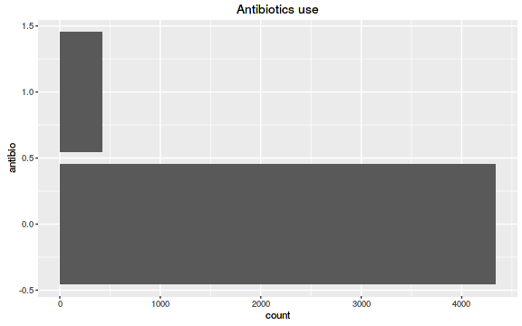
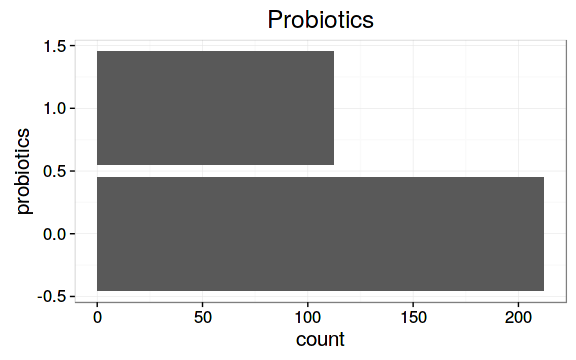
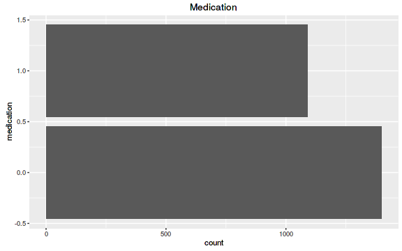
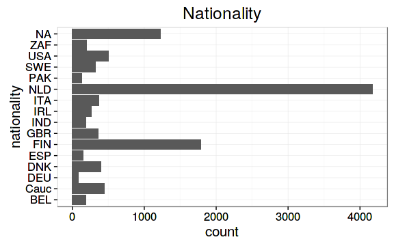
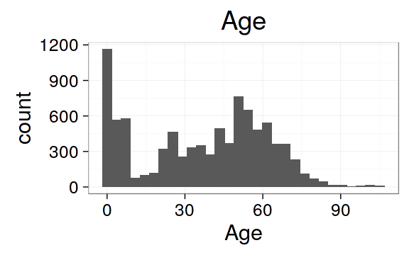
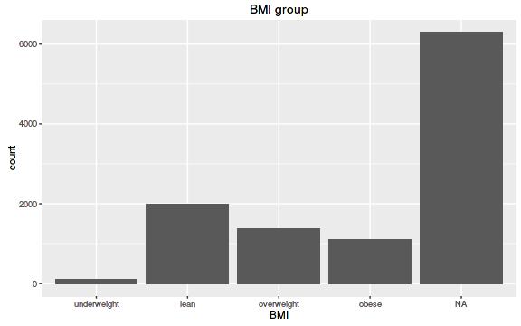

<!--
  %\VignetteEngine{knitr::rmarkdown}
  %\VignetteIndexEntry{microbiome tutorial}
  %\usepackage[utf8]{inputenc}
-->


HITChip Atlas Overview
===========

We use the [phyloseq](http://joey711.github.io/phyloseq/import-data)
class, a standard representation format in R for taxonomic
profiling. This package provides extensions and convenient wrappers
for many standard tasks encountered in microbiome studies. 


## Intestinal microbiota diversity 

This data set has microbiota profiling of 130 genus-like taxa across over 10,000 samples.

Download the data in R:


```r
# Download the required R packages and then the HITChip Atlas data set
library("microbiome")
#data("atlas1006")
#pseq <- atlas1006
# Load the data (not yet public)
atlas = readRDS("/home/lei/proj/hitchip-atlas-annotation-scripts/Atlas.RData") # atlas
```


### Data overview

 * ``10866`` samples
 * ``4995`` unique subjects


```r
p = ggplot(sample_data(atlas), aes(x = sample_type)) + geom_bar() + coord_flip() + ggtitle("Sample type")
```

```
## Error in eval(expr, envir, enclos): could not find function "ggplot"
```

```r
print(p)

p = ggplot(sample_data(atlas), aes(x = DNA_extraction_method)) + geom_bar() + coord_flip() + ggtitle("DNA extraction method")
```

```
## Error in eval(expr, envir, enclos): could not find function "ggplot"
```

```r
print(p)

p = ggplot(sample_data(atlas), aes(x = gender)) + geom_bar() + coord_flip() + ggtitle("Sex")
```

```
## Error in eval(expr, envir, enclos): could not find function "ggplot"
```

```r
print(p)

p = ggplot(sample_data(atlas), aes(x = health_status)) + geom_bar() + coord_flip() + ggtitle("Health status")
```

```
## Error in eval(expr, envir, enclos): could not find function "ggplot"
```

```r
print(p)

p = ggplot(sample_data(atlas), aes(x = health_info)) + geom_bar() + coord_flip() + ggtitle("Health info")
```

```
## Error in eval(expr, envir, enclos): could not find function "ggplot"
```

```r
print(p)

p = ggplot(sample_data(atlas), aes(x = antibio)) + geom_bar() + coord_flip() + ggtitle("Antibiotics use")
```

```
## Error in eval(expr, envir, enclos): could not find function "ggplot"
```

```r
print(p)

p = ggplot(sample_data(atlas), aes(x = probiotics)) + geom_bar() + coord_flip() + ggtitle("Probiotics")
```

```
## Error in eval(expr, envir, enclos): could not find function "ggplot"
```

```r
print(p)

p = ggplot(sample_data(atlas), aes(x = medication)) + geom_bar() + coord_flip() + ggtitle("Medication")
```

```
## Error in eval(expr, envir, enclos): could not find function "ggplot"
```

```r
print(p)

p = ggplot(sample_data(atlas), aes(x = nationality)) + geom_bar() + coord_flip() + ggtitle("Nationality")
```

```
## Error in eval(expr, envir, enclos): could not find function "ggplot"
```

```r
print(p)

p = ggplot(sample_data(atlas), aes(x = age)) + geom_histogram() + ggtitle("Age") + xlab("Age")
```

```
## Error in eval(expr, envir, enclos): could not find function "ggplot"
```

```r
print(p)

p = ggplot(sample_data(atlas), aes(x = bmi_group)) + geom_bar() + ggtitle("BMI group") + xlab("BMI")
```

```
## Error in eval(expr, envir, enclos): could not find function "ggplot"
```

```r
print(p)
```




### Diversity vs. age


```r
# Pick the subset of RBB-preprocessed samples from time point 0
pseq <- subset_samples(atlas, time == 0 & DNA_extraction_method == "rbb")

# Visualize
p <- plot_regression(diversity~age, sample_data(pseq))
print(p)
```


### Licensing and Citations

This material can be freely used, modified and distributed under the
[Two-clause FreeBSD
license](http://en.wikipedia.org/wiki/BSD\_licenses). Kindly cite as
'Leo Lahti, Jarkko Salojarvi, Anne Salonen and Willem M de
Vos. HITChip Atlas. URL: http://microbiome.github.com'.


### References


