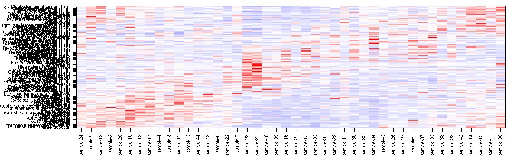
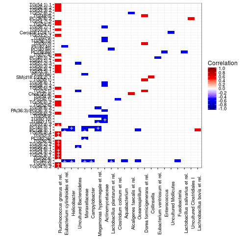
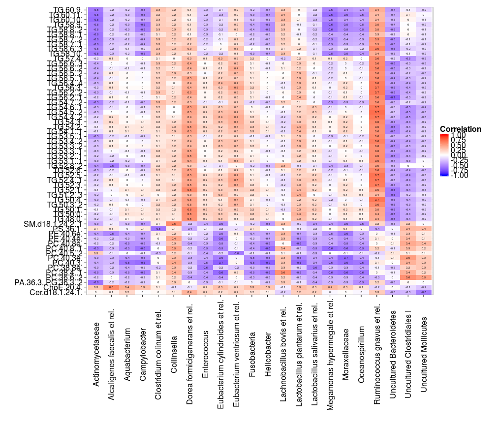
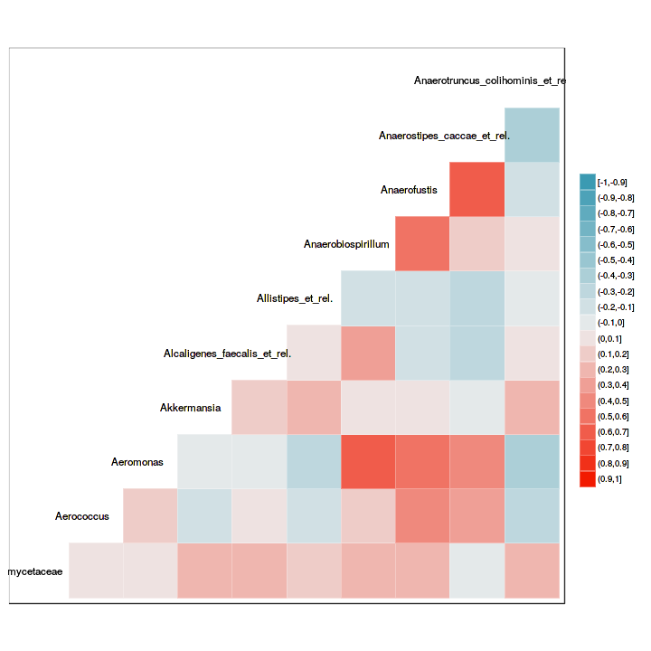
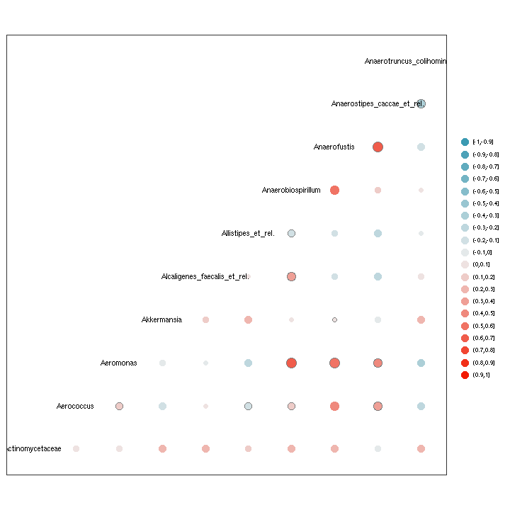
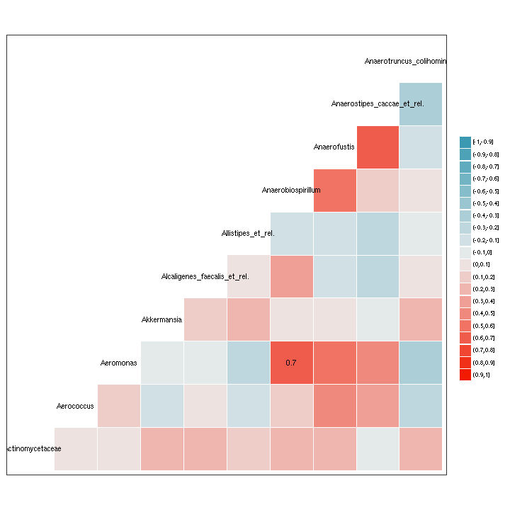
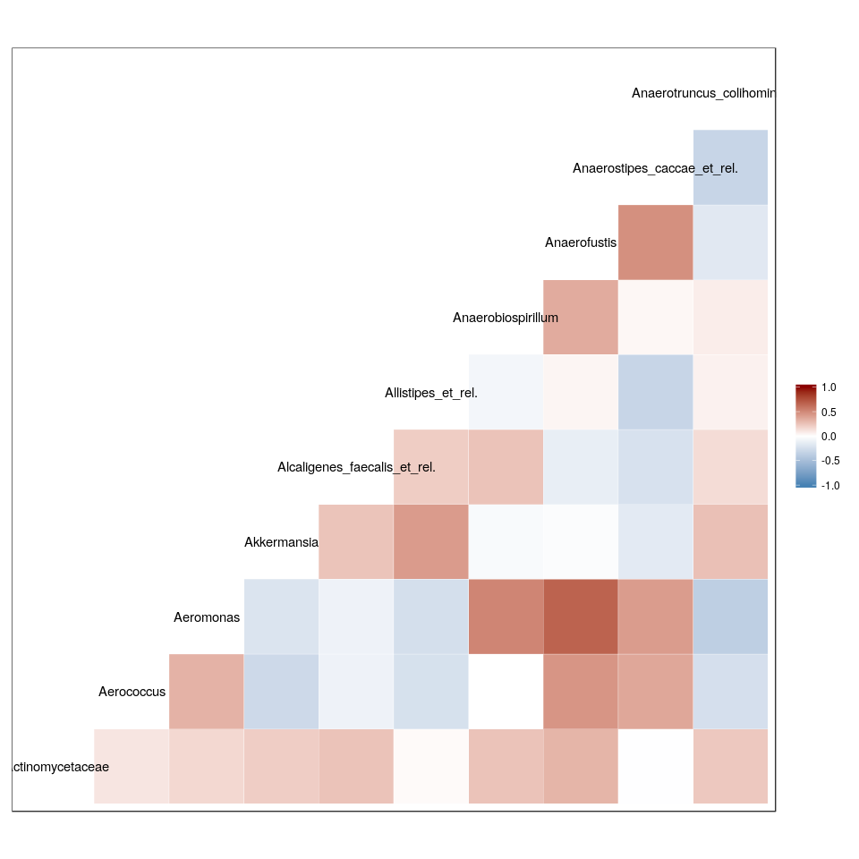

<!--
  %\VignetteEngine{knitr::rmarkdown}
  %\VignetteIndexEntry{microbiome tutorial - heatmap}
  %\usepackage[utf8]{inputenc}
  %\VignetteEncoding{UTF-8}  
-->

## Heatmaps for microbiome analysis

See [Composition](Composition.html) page for phyloseq microbiota composition heatmaps. For further examples, see [phyloseq tutorial](http://joey711.github.io/phyloseq/plot_heatmap-examples.html) and [Neatmaps](http://www.biomedcentral.com/1471-2105/11/45)


Load some example data:


```r
library(microbiome) # Load libraries
library(phyloseq)
data(peerj32)
pseq <- peerj32$phyloseq    # Rename data

# Pick data subset (DI samples from Phylum Bacteroidetes)
pseq2 <- pseq %>%
         subset_taxa(Phylum == "Bacteroidetes") %>%
         subset_samples(group == "LGG")

# Z transformed abundance data
pseqz <- transform(pseq2, "Z")
```


### Matrix heatmaps

Pick abundance matrix separately and use matrix visualization
tools. Z-transforming OTUs ie. visualize deviation of all bacteria
from their population mean (smaller: blue; higher: red):


```r
# Pick OTU table
x <- abundances(pseqz)

# Plot heatmap
tmp <- plot_matrix(x, type = "twoway", mar = c(5, 14, 1, 1))
```


Find visually appealing order for rows and columns with the Neatmap approach:


```r
# Sort the matrix rows and cols directly
xo <- neat(x, method = "NMDS", distance = "euclidean") # Sorted matrix
tmp <- plot_matrix(xo, type = "twoway", mar = c(5, 12, 1, 1))
```



```r
# or use a shortcut to sorting rows (or columns) if just the order was needed 
sorted.rows <- neatsort(x, "rows", method = "NMDS", distance = "euclidean") 
```


### Cross-correlating data sets

Cross-correlate columns of two data sets from related to microbiome and blood serum lipids associations ([PeerJ 1:e32](https://peerj.com/articles/32/)).

The function returns correlations, raw p-values, and fdr estimates (not strictly proper as the comparisons are not independent). Here robust biweight midcorrelation ('bicor') from the [WGCNA package](http://labs.genetics.ucla.edu/horvath/CoexpressionNetwork/Rpackages/WGCNA/). Keep only those elements that have at least only one significant correlation (n.signif):


```r
# Load example data 
otu <- peerj32$microbes 
lipids <- peerj32$lipids 

# Define data sets to cross-correlate
x <- log10(otu) # OTU Log10 (44 samples x 130 genera)
y <- as.matrix(lipids) # Lipids (44 samples x 389 lipids)

# Cross correlate data sets
correlations <- associate(x, y, method = "bicor", mode = "matrix", p.adj.threshold = 0.05, n.signif = 1)

# Or, alternatively, the same output is also available in a handy table format
correlation.table <- associate(x, y, method = "bicor", mode = "table", p.adj.threshold = 0.05, n.signif = 1)

kable(head(correlation.table))
```


|    |X1                               |X2         | Correlation|     p.adj|
|:---|:--------------------------------|:----------|-----------:|---------:|
|833 |Ruminococcus gnavus et rel.      |TG(54:5).2 |   0.7207818| 0.0017385|
|547 |Ruminococcus gnavus et rel.      |TG(52:5)   |   0.6996301| 0.0031929|
|141 |Eubacterium cylindroides et rel. |PC(40:3)   |  -0.6771286| 0.0038006|
|144 |Helicobacter                     |PC(40:3)   |  -0.6838424| 0.0038006|
|437 |Ruminococcus gnavus et rel.      |TG(50:4)   |   0.6852226| 0.0038006|
|525 |Ruminococcus gnavus et rel.      |TG(52:4).1 |   0.6716223| 0.0038006|

### Association heatmaps

Rearrange the data and plot the heatmap and mark significant correlations with stars to reproduce microbiota-lipidome heatmap from [Lahti et al. PeerJ (2013)](https://peerj.com/articles/32/) (the ordering of rows and columns may be different): 


```r
p <- heat(correlation.table, "X1", "X2", fill = "Correlation", star = "p.adj", p.adj.threshold = 0.05) 
```

```r
print(p)
```


### Heatmaps with ggplot2

The above examples provide handy shortcuts for heatmap visualization. You can also directly modify the ggplot2 routines. This time, let us set q-value threshold also for cell coloring: 


```r
# Order the rows and columns with levels argument if needed:
correlation.table$X1 <- factor(correlation.table$X1, levels = unique(as.character(correlation.table$X1)))
correlation.table$X2 <- factor(correlation.table$X2, levels = unique(as.character(correlation.table$X2)))

# Set black-and-white theme
library(ggplot2)
theme_set(theme_bw())

# Pick only the correlations with q<0.05
# Note: this will leave other cells empty
library(dplyr)
subtable <- filter(correlation.table, p.adj < 0.05)

# Arrange the figure
p <- ggplot(subtable, aes(x = X1, y = X2, fill = Correlation))
p <- p + geom_tile() 
p <- p + scale_fill_gradientn("Correlation", 
       	 		       breaks = seq(from = -1, to = 1, by = 0.2), 
			       colours = c("darkblue", "blue", "white", "red", "darkred"), 
			       limits = c(-1,1)) 

# Polish texts
p <- p + theme(axis.text.x=element_text(angle = 90))
p <- p + xlab("") + ylab("")

# Mark the most significant cells with stars
p <- p + geom_text(data = subset(correlation.table, p.adj < 0.02), 
       	 	   aes(x = X1, y = X2, label = "+"), col = "white", size = 5)

# Plot
print(p)
```



### Heatmap with text

For detailed information, might be handy to print the actual values on
top of the heatmap:


```r
theme_set(theme_bw(20))
df <- correlation.table
p <- ggplot(df, aes(X1, X2, group=X2)) 
p <- p + geom_tile(aes(fill = Correlation)) 
p <- p + geom_text(aes(fill = df$Correlation, label = round(df$Correlation, 1)), size = 2) 
p <- p + scale_fill_gradientn("Correlation", 
       	 		      breaks = seq(from = -1, to = 1,  by = 0.25), 
       	 		      colours = c("blue", "white", "red"), 
			      limits = c(-1, 1))
p <- p + theme(axis.text.x = element_text(angle = 90, vjust = 0.5)) 
p <- p + xlab("") + ylab("")
print(p)
```



### ggcorr

An alternative way to visualize correlation matrices is provided by the [ggcorr package](https://briatte.github.io/ggcorr/). Note: this toy example does not consider the compositionality effect in microbial abundance correlations. See the package site for more detailed examples and many more options.


```r
library(GGally)
ggcorr(x[, 1:10], method = c("pairwise", "spearman"), nbreaks = 20, hjust = 0.75)
ggcorr(x[, 1:10], method = c("pairwise", "spearman"), nbreaks = 20, geom = "circle")
ggcorr(x[, 1:10], method = c("pairwise", "spearman"), nbreaks = 20, label = TRUE, label_alpha = TRUE)
ggcorr(data = NULL, cor_matrix = cor(x[, 1:10], use = "everything"), low = "steelblue", mid = "white", high = "darkred", midpoint = 0)
```



