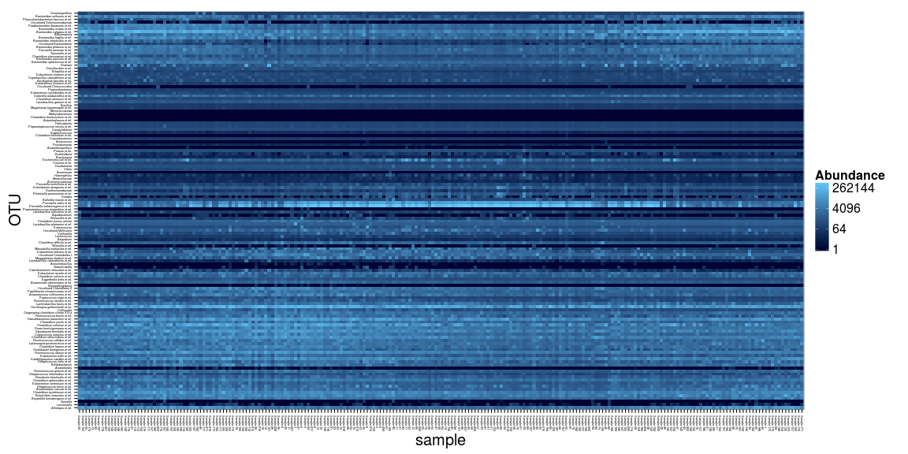
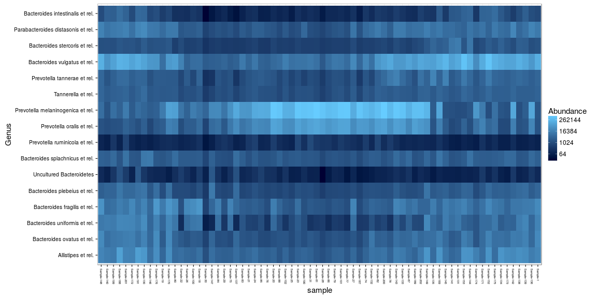

## Heatmaps

### phyloseq heatmaps

Download example data and plot heatmap


```r
library(microbiome)
pseq <- download_microbiome("dietswap")
```

```
## Downloading data set from O'Keefe et al. Nat. Comm. 6:6342, 2015 from Data Dryad: http://datadryad.org/resource/doi:10.5061/dryad.1mn1n
```

```r
plot_heatmap(pseq, sample.label = "sample")
```



Pick subset of the data and plot ordered heatmap


```r
bacteroidetes <- levelmap(from = "Phylum", to = "Genus",
	      	 	   tax.table = tax_table(pseq))$Bacteroidetes
pseq2 <- prune_taxa(bacteroidetes, pseq)
pseq2 <- subset_samples(pseq2, group == "DI")

# Plot heatmap ordered with NMDS
plot_heatmap(pseq2, method = "NMDS", distance = "bray",
	     sample.label = "sample", taxa.label = "Genus")
```




### Matrix heatmaps

Alternatively, pick abundance matrix separately and use matrix
visualization tools. Z-transforming OTUs ie. visualize deviation of
all bacteria from their population mean (smaller: blue; higher: red):


```r
# Z transform
pseqz <- ztransform_phyloseq(pseq2, "OTU")
```

```
## Error in eval(expr, envir, enclos): could not find function "ztransform_phyloseq"
```

```r
# Pick OTU table
x <- otu_table(pseqz)@.Data
```

```
## Error in otu_table(pseqz): error in evaluating the argument 'object' in selecting a method for function 'otu_table': Error: object 'pseqz' not found
```

```r
# Plot heatmap
tmp <- netresponse::plot_matrix(x, type = "twoway", mar = c(5, 14, 1, 1))
```


Finding visually appealing order for rows and columns:


```r
hm <- heatmap(x) 
```

Then plot the same matrix with ordered rows (keep column order):


```r
tmp <- netresponse::plot_matrix(x[hm$rowInd, ], type = "twoway",
       			        mar = c(5, 12, 1, 1))
```


### Cross-correlating data sets

Cross-correlate columns of two data sets from related to microbiome and blood serum lipids associations ([PeerJ 1:e32](https://peerj.com/articles/32/)).

The function returns correlations, raw p-values, and fdr estimates (not strictly proper as the comparisons are not independent). Here robust biweight midcorrelation ('bicor') from the [WGCNA package](http://labs.genetics.ucla.edu/horvath/CoexpressionNetwork/Rpackages/WGCNA/). Keep only those elements that have at least only one significant correlation (n.signif):


```r
# Load example data 
library(microbiome)
data.peerj32.otu <- download_microbiome("peerj32")$data$microbes
data.peerj32.lipids <- download_microbiome("peerj32")$data$lipids

# Define data sets to cross-correlate
# OTU Log10 matrix # Microbiota (44 samples x 130 bacteria)
x <- log10(data.peerj32.otu)
y <- as.matrix(data.peerj32.lipids) # Lipids (44 samples x 389 lipids)

# Cross correlate data sets
correlations <- cross.correlate(x, y, method = "bicor", mode = "matrix", p.adj.threshold = 0.05, n.signif = 1)
```

Arrange the results in handy table format: 


```r
correlation.table <- cmat2table(correlations)
```

```
## Error in match.fun(FUN): argument "FUN" is missing, with no default
```

```r
kable(head(correlation.table))
```

```
## Error in head(correlation.table): error in evaluating the argument 'x' in selecting a method for function 'head': Error: object 'correlation.table' not found
```

### Correlation heatmaps

Rearrange the data and plot the heatmap and mark significant correlations with stars to reproduce microbiota-lipidome heatmap from [this article](https://peerj.com/articles/32/) (the ordering of rows and columns may be different): 


```r
p <- correlation.heatmap(correlation.table, "X1", "X2", fill = "Correlation", star = "p.adj", p.adj.threshold = 0.05) 
```

```
## Error in correlation.heatmap(correlation.table, "X1", "X2", fill = "Correlation", : object 'correlation.table' not found
```

```r
print(p)
```


### Heatmaps with ggplot2

The above examples provide handy shortcuts for heatmap visualization. You can also directly modify the ggplot2 routines. This time, let us set q-value threshold also for cell coloring: 


```r
# Order the rows and columns with levels argument if needed:
correlation.table$X1 <- factor(correlation.table$X1, levels = unique(as.character(correlation.table$X1)))
```

```
## Error in factor(correlation.table$X1, levels = unique(as.character(correlation.table$X1))): object 'correlation.table' not found
```

```r
correlation.table$X2 <- factor(correlation.table$X2, levels = unique(as.character(correlation.table$X2)))
```

```
## Error in factor(correlation.table$X2, levels = unique(as.character(correlation.table$X2))): object 'correlation.table' not found
```

```r
# Set black-and-white theme
library(ggplot2)
theme_set(theme_bw())

# Pick only the correlations with q<0.05
# Note: this will leave other cells empty
library(dplyr)
subtable <- filter(correlation.table, p.adj < 0.05)
```

```
## Error in filter_(.data, .dots = lazyeval::lazy_dots(...)): object 'correlation.table' not found
```

```r
# Arrange the figure
p <- ggplot(subtable, aes(x = X1, y = X2, fill = Correlation))
```

```
## Error in ggplot(subtable, aes(x = X1, y = X2, fill = Correlation)): object 'subtable' not found
```

```r
p <- p + geom_tile() 
p <- p + scale_fill_gradientn("Correlation", 
       	 		       breaks = seq(from = -1, to = 1, by = 0.2), 
			       colours = c("darkblue", "blue", "white", "red", "darkred"), 
			       limits = c(-1,1)) 

# Polish texts
p <- p + theme(axis.text.x=element_text(angle = 90))
p <- p + xlab("") + ylab("")

# Mark the most significant cells with stars
p <- p + geom_text(data = subset(correlation.table, p.adj < 0.02), 
       	 	   aes(x = X1, y = X2, label = "+"), col = "white", size = 5)
```

```
## Error in subset(correlation.table, p.adj < 0.02): error in evaluating the argument 'x' in selecting a method for function 'subset': Error: object 'correlation.table' not found
```

```r
# Plot
print(p)
```


### Heatmap with text

For detailed information, might be handy to print the actual values on
top of the heatmap:


```r
theme_set(theme_bw(20))
df <- microbiome::cmat2table(correlations)
```

```
## Error in match.fun(FUN): argument "FUN" is missing, with no default
```

```r
df$X1 <- factor(df$X1)
```

```
## Error in `$<-.data.frame`(`*tmp*`, "X1", value = structure(integer(0), .Label = character(0), class = "factor")): replacement has 0 rows, data has 20
```

```r
df$X2 <- factor(df$X2)
```

```
## Error in `$<-.data.frame`(`*tmp*`, "X2", value = structure(integer(0), .Label = character(0), class = "factor")): replacement has 0 rows, data has 20
```

```r
p <- ggplot(df, aes(X1, X2, group=X2)) 
p <- p + geom_tile(aes(fill = Correlation)) 
p <- p + geom_text(aes(fill = df$Correlation, label = round(df$Correlation, 1)), size = 2) 
p <- p + scale_fill_gradientn("Correlation", 
       	 		      breaks = seq(from = -1, to = 1,  by = 0.25), 
       	 		      colours = c("blue", "white", "red"), 
			      limits = c(-1, 1))
p <- p + theme(axis.text.x = element_text(angle = 90, vjust = 0.5)) 
p <- p + xlab("") + ylab("")
print(p)
```

```
## Error in eval(expr, envir, enclos): object 'Correlation' not found
```


### Links

For further examples, see [phyloseq tutorial](http://joey711.github.io/phyloseq/plot_heatmap-examples.html) and [Neatmaps](http://www.biomedcentral.com/1471-2105/11/45)
