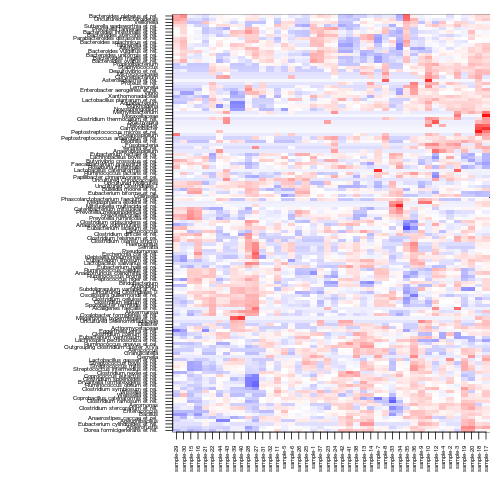

## Heatmaps

### phyloseq heatmaps

Download example data and plot heatmap


```r
library(microbiome)
pseq <- download_microbiome("dietswap")
```

```
## Downloading data set from O'Keefe et al. Nat. Comm. 6:6342, 2015 from Data Dryad: http://datadryad.org/resource/doi:10.5061/dryad.1mn1n
```

```r
plot_heatmap(pseq, sample.label = "sample")
```

```
## Error in .Method(..., na.last = na.last, decreasing = decreasing): argument 1 is not a vector
```

Pick subset of the data and plot ordered heatmap


```r
bacteroidetes <- levelmap(NULL, "Phylum", "Genus", tax_table(x))$Bacteroidetes
pseq2 <- prune_taxa(bacteroidetes, pseq)
pseq2 <- subset_samples(pseq2, group == "DI")

# Plot heatmap ordered with NMDS
plot_heatmap(pseq, method = "NMDS", distance = "bray",
	     sample.label = "sample", taxa.label = "Genus")
```

```
## Error in .Method(..., na.last = na.last, decreasing = decreasing): argument 1 is not a vector
```


### Matrix heatmaps

Alternatively, pick abundance matrix separately and use matrix
visualization tools. Z-transforming OTUs ie. visualize deviation of
all bacteria from their population mean (smaller: blue; higher: red):


```r
# Z transform
pseqz <- ztransform_phyloseq(pseq2, "OTU")
# Pick OTU table
x <- otu_table(pseqz)@.Data
# Plot heatmap
tmp <- netresponse::plot_matrix(x, type = "twoway", mar = c(5, 14, 1, 1))
```

 

Finding visually appealing order for rows and columns:


```r
hm <- heatmap(x) 
```

Then plot the same matrix with ordered rows (keep column order):


```r
tmp <- netresponse::plot_matrix(x[hm$rowInd, ], type = "twoway",
       			        mar = c(5, 12, 1, 1))
```

 


### Cross-correlating data sets

Cross-correlate columns of two data sets from related to microbiome and blood serum lipids associations ([PeerJ 1:e32](https://peerj.com/articles/32/)).

The function returns correlations, raw p-values, and fdr estimates (not strictly proper as the comparisons are not independent). Here robust biweight midcorrelation ('bicor') from the [WGCNA package](http://labs.genetics.ucla.edu/horvath/CoexpressionNetwork/Rpackages/WGCNA/). Keep only those elements that have at least only one significant correlation (n.signif):


```r
# Load example data 
library(microbiome)
data.peerj32.otu <- download_microbiome("peerj32")$data$microbes
data.peerj32.lipids <- download_microbiome("peerj32")$data$lipids

# Define data sets to cross-correlate
# OTU Log10 matrix # Microbiota (44 samples x 130 bacteria)
x <- log10(data.peerj32.otu)
y <- as.matrix(data.peerj32.lipids) # Lipids (44 samples x 389 lipids)

# Cross correlate data sets
correlations <- cross.correlate(x, y, method = "bicor", mode = "matrix", p.adj.threshold = 0.05, n.signif = 1)
```

Arrange the results in handy table format: 


```r
correlation.table <- cmat2table(correlations)
kable(correlation.table)
```


|     |X1                               |X2                  | Correlation|     p.adj|
|:----|:--------------------------------|:-------------------|-----------:|---------:|
|833  |Ruminococcus gnavus et rel.      |TG.54.5..2          |   0.7207818| 0.0017385|
|547  |Ruminococcus gnavus et rel.      |TG.52.5.            |   0.6996301| 0.0031929|
|141  |Eubacterium cylindroides et rel. |PC.40.3.            |  -0.6771286| 0.0038006|
|144  |Helicobacter                     |PC.40.3.            |  -0.6838424| 0.0038006|
|437  |Ruminococcus gnavus et rel.      |TG.50.4.            |   0.6852226| 0.0038006|
|525  |Ruminococcus gnavus et rel.      |TG.52.4..1          |   0.6716223| 0.0038006|
|811  |Ruminococcus gnavus et rel.      |TG.54.4..2          |   0.6767850| 0.0038006|
|855  |Ruminococcus gnavus et rel.      |TG.54.6..1          |   0.6728062| 0.0038006|
|900  |Uncultured Bacteroidetes         |TG.56.2..1          |  -0.6655178| 0.0041799|
|921  |Ruminococcus gnavus et rel.      |TG.56.2..2          |   0.6667903| 0.0041799|
|943  |Ruminococcus gnavus et rel.      |TG.56.3.            |   0.6606037| 0.0048839|
|171  |Moraxellaceae                    |PC.40.3e.           |  -0.6561021| 0.0051799|
|503  |Ruminococcus gnavus et rel.      |TG.52.3.            |   0.6564009| 0.0051799|
|965  |Ruminococcus gnavus et rel.      |TG.56.4..4          |   0.6454264| 0.0080989|
|97   |Eubacterium cylindroides et rel. |PC.38.4..1          |  -0.6385564| 0.0093214|
|136  |Campylobacter                    |PC.40.3.            |  -0.6365660| 0.0093214|
|210  |Helicobacter                     |PC.40.8..1          |  -0.6370673| 0.0093214|
|701  |Ruminococcus gnavus et rel.      |TG.53.4..2          |   0.6377777| 0.0093214|
|1270 |Megamonas hypermegale et rel.    |TG.60.11.           |  -0.6359495| 0.0093214|
|1233 |Actinomycetaceae                 |TG.60.10.           |  -0.6335261| 0.0099013|
|105  |Moraxellaceae                    |PC.38.4..1          |  -0.6284271| 0.0113493|
|146  |Lactobacillus plantarum et rel.  |PC.40.3.            |  -0.6293944| 0.0113493|
|214  |Megamonas hypermegale et rel.    |PC.40.8..1          |  -0.6272802| 0.0114304|
|149  |Moraxellaceae                    |PC.40.3.            |  -0.6189429| 0.0158384|
|1226 |Megamonas hypermegale et rel.    |TG.58.9.            |  -0.6123027| 0.0202424|
|1119 |Ruminococcus gnavus et rel.      |TG.58.6..3          |   0.6113322| 0.0202840|
|45   |Actinomycetaceae                 |PA.36.3..PG.36.3..2 |  -0.6092378| 0.0205805|
|1204 |Megamonas hypermegale et rel.    |TG.58.8..2          |  -0.6093237| 0.0205805|
|569  |Ruminococcus gnavus et rel.      |TG.52.6.            |   0.6069015| 0.0214453|
|1255 |Actinomycetaceae                 |TG.60.11.           |  -0.6066134| 0.0214453|
|1031 |Ruminococcus gnavus et rel.      |TG.56.6..2          |   0.6046076| 0.0225616|
|202  |Campylobacter                    |PC.40.8..1          |  -0.6010958| 0.0251555|
|291  |Clostridium colinum et rel.      |PS.36.1.            |  -0.6004500| 0.0251555|
|135  |Aquabacterium                    |PC.40.3.            |  -0.5995403| 0.0253403|
|789  |Ruminococcus gnavus et rel.      |TG.54.3.            |   0.5986117| 0.0255653|
|899  |Ruminococcus gnavus et rel.      |TG.56.2..1          |   0.5973334| 0.0261787|
|24   |Alcaligenes faecalis et rel.     |ChoE.20.4.          |   0.5949277| 0.0280625|
|215  |Moraxellaceae                    |PC.40.8..1          |  -0.5942669| 0.0280625|
|106  |Oceanospirillum                  |PC.38.4..1          |  -0.5906326| 0.0294813|
|469  |Dorea formicigenerans et rel.    |TG.52.1.            |   0.5903353| 0.0294813|
|1053 |Ruminococcus gnavus et rel.      |TG.56.6..3          |   0.5899215| 0.0294813|
|1145 |Actinomycetaceae                 |TG.58.7..2          |  -0.5912914| 0.0294813|
|1167 |Actinomycetaceae                 |TG.58.8..1          |  -0.5903104| 0.0294813|
|381  |Dorea formicigenerans et rel.    |TG.50.1.            |   0.5886438| 0.0302998|
|314  |Collinsella                      |SM.d18.1.24.2..1    |   0.5860097| 0.0328468|
|104  |Megamonas hypermegale et rel.    |PC.38.4..1          |  -0.5826661| 0.0329958|
|150  |Oceanospirillum                  |PC.40.3.            |  -0.5841399| 0.0329958|
|281  |Moraxellaceae                    |PE.40.6e.           |  -0.5842883| 0.0329958|
|723  |Ruminococcus gnavus et rel.      |TG.53.5..1          |   0.5827211| 0.0329958|
|987  |Ruminococcus gnavus et rel.      |TG.56.5..1          |   0.5848037| 0.0329958|
|1214 |Campylobacter                    |TG.58.9.            |  -0.5827489| 0.0329958|
|415  |Ruminococcus gnavus et rel.      |TG.50.3..2          |   0.5811380| 0.0336735|
|460  |Uncultured Bacteroidetes         |TG.51.2..3          |  -0.5812729| 0.0336735|
|613  |Ruminococcus gnavus et rel.      |TG.53.1..1          |   0.5801344| 0.0343458|
|186  |Eubacterium ventriosum et rel.   |PC.40.5..2          |  -0.5764085| 0.0388536|
|1075 |Ruminococcus gnavus et rel.      |TG.57.4.            |   0.5755279| 0.0394492|
|118  |Enterococcus                     |PC.38.8e.           |  -0.5725069| 0.0398538|
|234  |Lactobacillus plantarum et rel.  |PC.40.8e.           |  -0.5722713| 0.0398538|
|251  |Eubacterium cylindroides et rel. |PE.40.4e.           |  -0.5740413| 0.0398538|
|359  |Dorea formicigenerans et rel.    |TG.50.0.            |   0.5721126| 0.0398538|
|482  |Uncultured Bacteroidetes         |TG.52.1.            |  -0.5725414| 0.0398538|
|1079 |Actinomycetaceae                 |TG.58.10.           |  -0.5735318| 0.0398538|
|1277 |Actinomycetaceae                 |TG.60.9.            |  -0.5747490| 0.0398538|
|635  |Ruminococcus gnavus et rel.      |TG.53.2..1          |   0.5711575| 0.0406504|
|22   |Uncultured Mollicutes            |Cer.d18.1.24.1.     |  -0.5670762| 0.0444788|
|143  |Fusobacteria                     |PC.40.3.            |  -0.5677084| 0.0444788|
|657  |Ruminococcus gnavus et rel.      |TG.53.3..1          |   0.5679315| 0.0444788|
|1123 |Actinomycetaceae                 |TG.58.7..1          |  -0.5671848| 0.0444788|
|767  |Ruminococcus gnavus et rel.      |TG.54.2.            |   0.5658106| 0.0459117|
|100  |Helicobacter                     |PC.38.4..1          |  -0.5652840| 0.0460398|
|125  |Lactobacillus salivarius et rel. |PC.38.8e.           |  -0.5645663| 0.0460398|
|877  |Ruminococcus gnavus et rel.      |TG.54.7..2          |   0.5646187| 0.0460398|
|87   |Uncultured Clostridiales I       |PC.36.6..2          |   0.5623667| 0.0476060|
|101  |Lachnobacillus bovis et rel.     |PC.38.4..1          |   0.5616052| 0.0476060|
|337  |Dorea formicigenerans et rel.    |TG.48.0.            |   0.5614122| 0.0476060|
|574  |Alcaligenes faecalis et rel.     |TG.52.8..2          |  -0.5610758| 0.0476060|
|679  |Ruminococcus gnavus et rel.      |TG.53.3..2          |   0.5628531| 0.0476060|
|1009 |Ruminococcus gnavus et rel.      |TG.56.5..2          |   0.5614193| 0.0476060|
|1211 |Actinomycetaceae                 |TG.58.9.            |  -0.5611886| 0.0476060|
|745  |Ruminococcus gnavus et rel.      |TG.54.1..1          |   0.5597527| 0.0492970|
|1189 |Actinomycetaceae                 |TG.58.8..2          |  -0.5545543| 0.0558046|
|163  |Eubacterium cylindroides et rel. |PC.40.3e.           |  -0.5540994| 0.0560459|
|148  |Megamonas hypermegale et rel.    |PC.40.3.            |  -0.5501886| 0.0601046|
|92   |Campylobacter                    |PC.38.4..1          |  -0.5484978| 0.0616765|
|1292 |Megamonas hypermegale et rel.    |TG.60.9.            |  -0.5457088| 0.0651436|
|216  |Oceanospirillum                  |PC.40.8..1          |  -0.5423908| 0.0694327|
|1094 |Megamonas hypermegale et rel.    |TG.58.10.           |  -0.5429169| 0.0694327|
|1192 |Campylobacter                    |TG.58.8..2          |  -0.5426235| 0.0694327|
|1271 |Moraxellaceae                    |TG.60.11.           |  -0.5405702| 0.0724451|
|199  |Actinomycetaceae                 |PC.40.8..1          |  -0.5372599| 0.0773006|
|768  |Uncultured Bacteroidetes         |TG.54.2.            |  -0.5349460| 0.0791974|
|1163 |Ruminococcus gnavus et rel.      |TG.58.7..2          |   0.5355222| 0.0791974|
|102  |Lactobacillus plantarum et rel.  |PC.38.4..1          |  -0.5278060| 0.0846264|
|168  |Lactobacillus plantarum et rel.  |PC.40.3e.           |  -0.5269958| 0.0846264|
|372  |Uncultured Bacteroidetes         |TG.50.0.            |  -0.5275978| 0.0846264|
|746  |Uncultured Bacteroidetes         |TG.54.1..1          |  -0.5292601| 0.0846264|
|859  |Actinomycetaceae                 |TG.54.7..2          |  -0.5284959| 0.0846264|
|1054 |Uncultured Bacteroidetes         |TG.56.6..3          |  -0.5288207| 0.0846264|
|350  |Uncultured Bacteroidetes         |TG.48.0.            |  -0.5218780| 0.0888704|
|922  |Uncultured Bacteroidetes         |TG.56.2..2          |  -0.5216775| 0.0888704|
|207  |Eubacterium cylindroides et rel. |PC.40.8..1          |  -0.5139362| 0.0952559|
|266  |Alcaligenes faecalis et rel.     |PE.40.6e.           |  -0.5149481| 0.0952559|
|1227 |Moraxellaceae                    |TG.58.9.            |  -0.5112478| 0.0952708|
|1258 |Campylobacter                    |TG.60.11.           |  -0.5117298| 0.0952708|
|232  |Helicobacter                     |PC.40.8e.           |  -0.5065039| 0.0979327|
|1082 |Campylobacter                    |TG.58.10.           |  -0.5060139| 0.0985511|
|325  |Moraxellaceae                    |SM.d18.1.24.2..1    |  -0.5050802| 0.0985539|
|394  |Uncultured Bacteroidetes         |TG.50.1.            |  -0.5042395| 0.0985539|
|481  |Ruminococcus gnavus et rel.      |TG.52.1.            |   0.5047803| 0.0985539|
|535  |Dorea formicigenerans et rel.    |TG.52.5.            |   0.5042516| 0.0985539|
|1101 |Actinomycetaceae                 |TG.58.6..3          |  -0.5043896| 0.0985539|
|1205 |Moraxellaceae                    |TG.58.8..2          |  -0.5045376| 0.0985539|
|1248 |Megamonas hypermegale et rel.    |TG.60.10.           |  -0.5042294| 0.0985539|
|175  |Uncultured Clostridiales I       |PC.40.3e.           |   0.5033558| 0.0990831|
|636  |Uncultured Bacteroidetes         |TG.53.2..1          |  -0.5023725| 0.0990831|
|1141 |Ruminococcus gnavus et rel.      |TG.58.7..1          |   0.5031234| 0.0990831|
|1164 |Uncultured Bacteroidetes         |TG.58.7..2          |  -0.5036829| 0.0990831|
|843  |Dorea formicigenerans et rel.    |TG.54.6..1          |   0.5016852| 0.0999161|
|166  |Helicobacter                     |PC.40.3e.           |  -0.5011771| 0.0999338|
|1120 |Uncultured Bacteroidetes         |TG.58.6..3          |  -0.5005589| 0.1006648|
|62   |Oceanospirillum                  |PA.36.3..PG.36.3..2 |  -0.4919968| 0.1087129|
|99   |Fusobacteria                     |PC.38.4..1          |  -0.4920778| 0.1087129|
|1095 |Moraxellaceae                    |TG.58.10.           |  -0.4935836| 0.1087129|
|1206 |Oceanospirillum                  |TG.58.8..2          |  -0.4931442| 0.1087129|
|1272 |Oceanospirillum                  |TG.60.11.           |  -0.4900340| 0.1102569|
|623  |Dorea formicigenerans et rel.    |TG.53.2..1          |   0.4889063| 0.1117645|
|1142 |Uncultured Bacteroidetes         |TG.58.7..1          |  -0.4880938| 0.1121802|
|755  |Dorea formicigenerans et rel.    |TG.54.2.            |   0.4877095| 0.1122925|
|165  |Fusobacteria                     |PC.40.3e.           |  -0.4869294| 0.1127047|
|680  |Uncultured Bacteroidetes         |TG.53.3..2          |  -0.4867522| 0.1127047|
|140  |Enterococcus                     |PC.40.3.            |  -0.4866313| 0.1127826|
|591  |Ruminococcus gnavus et rel.      |TG.52.8..2          |   0.4863675| 0.1132158|
|1200 |Helicobacter                     |TG.58.8..2          |  -0.4861188| 0.1134192|
|201  |Aquabacterium                    |PC.40.8..1          |  -0.4845044| 0.1155870|
|237  |Moraxellaceae                    |PC.40.8e.           |  -0.4846090| 0.1155870|
|1160 |Megamonas hypermegale et rel.    |TG.58.7..2          |  -0.4827724| 0.1159299|
|89   |Actinomycetaceae                 |PC.38.4..1          |  -0.4822900| 0.1160441|
|317  |Eubacterium cylindroides et rel. |SM.d18.1.24.2..1    |  -0.4824040| 0.1160441|
|733  |Dorea formicigenerans et rel.    |TG.54.1..1          |   0.4824909| 0.1160441|
|1222 |Helicobacter                     |TG.58.9.            |  -0.4824443| 0.1160441|
|1229 |Ruminococcus gnavus et rel.      |TG.58.9.            |   0.4805314| 0.1191316|
|909  |Dorea formicigenerans et rel.    |TG.56.2..2          |   0.4790424| 0.1211571|
|557  |Dorea formicigenerans et rel.    |TG.52.6.            |   0.4778855| 0.1212061|
|425  |Dorea formicigenerans et rel.    |TG.50.4.            |   0.4773276| 0.1219674|
|944  |Uncultured Bacteroidetes         |TG.56.3.            |  -0.4769947| 0.1219674|
|326  |Oceanospirillum                  |SM.d18.1.24.2..1    |  -0.4764702| 0.1229564|
|213  |Lactobacillus salivarius et rel. |PC.40.8..1          |  -0.4750848| 0.1257645|
|835  |Uncultured Clostridiales I       |TG.54.5..2          |  -0.4743954| 0.1276067|
|273  |Eubacterium cylindroides et rel. |PE.40.6e.           |  -0.4739997| 0.1276383|
|88   |Uncultured Mollicutes            |PC.36.6..2          |   0.4732763| 0.1292996|
|857  |Uncultured Clostridiales I       |TG.54.6..1          |  -0.4724098| 0.1301285|
|491  |Dorea formicigenerans et rel.    |TG.52.3.            |   0.4703296| 0.1345666|
|1280 |Campylobacter                    |TG.60.9.            |  -0.4698072| 0.1356722|
|1208 |Uncultured Bacteroidetes         |TG.58.8..2          |  -0.4684265| 0.1376286|
|1032 |Uncultured Bacteroidetes         |TG.56.6..2          |  -0.4656776| 0.1417851|
|416  |Uncultured Bacteroidetes         |TG.50.3..2          |  -0.4651209| 0.1424137|
|223  |Aquabacterium                    |PC.40.8e.           |  -0.4641677| 0.1430819|
|1228 |Oceanospirillum                  |TG.58.9.            |  -0.4643394| 0.1430819|
|229  |Eubacterium cylindroides et rel. |PC.40.8e.           |  -0.4624409| 0.1467054|
|516  |Eubacterium ventriosum et rel.   |TG.52.4..1          |   0.4614684| 0.1473762|
|813  |Uncultured Clostridiales I       |TG.54.4..2          |  -0.4616289| 0.1473762|
|874  |Megamonas hypermegale et rel.    |TG.54.7..2          |  -0.4607563| 0.1479201|
|1207 |Ruminococcus gnavus et rel.      |TG.58.8..2          |   0.4608523| 0.1479201|
|158  |Campylobacter                    |PC.40.3e.           |  -0.4600916| 0.1484978|
|206  |Enterococcus                     |PC.40.8..1          |  -0.4601203| 0.1484978|
|393  |Ruminococcus gnavus et rel.      |TG.50.1.            |   0.4586750| 0.1496279|
|224  |Campylobacter                    |PC.40.8e.           |  -0.4585511| 0.1496606|
|91   |Aquabacterium                    |PC.38.4..1          |  -0.4575785| 0.1498552|
|204  |Collinsella                      |PC.40.8..1          |   0.4570675| 0.1498552|
|256  |Lactobacillus plantarum et rel.  |PE.40.4e.           |  -0.4581611| 0.1498552|
|705  |Actinomycetaceae                 |TG.53.5..1          |  -0.4582725| 0.1498552|
|821  |Dorea formicigenerans et rel.    |TG.54.5..2          |   0.4567659| 0.1498552|
|975  |Dorea formicigenerans et rel.    |TG.56.5..1          |   0.4559302| 0.1509930|
|934  |Eubacterium ventriosum et rel.   |TG.56.3.            |   0.4552396| 0.1514406|
|1077 |Uncultured Clostridiales I       |TG.57.4.            |  -0.4553711| 0.1514406|
|1138 |Megamonas hypermegale et rel.    |TG.58.7..1          |  -0.4545602| 0.1530927|
|280  |Megamonas hypermegale et rel.    |PE.40.6e.           |  -0.4542026| 0.1532642|
|645  |Dorea formicigenerans et rel.    |TG.53.3..1          |   0.4520924| 0.1584016|
|438  |Uncultured Bacteroidetes         |TG.50.4.            |  -0.4511672| 0.1602651|
|403  |Dorea formicigenerans et rel.    |TG.50.3..2          |   0.4506505| 0.1614333|
|320  |Helicobacter                     |SM.d18.1.24.2..1    |  -0.4502538| 0.1626688|
|157  |Aquabacterium                    |PC.40.3e.           |  -0.4499162| 0.1630201|
|170  |Megamonas hypermegale et rel.    |PC.40.3e.           |  -0.4496492| 0.1630201|
|248  |Collinsella                      |PE.40.4e.           |   0.4486716| 0.1648852|
|573  |Actinomycetaceae                 |TG.52.8..2          |  -0.4484550| 0.1655569|
|513  |Dorea formicigenerans et rel.    |TG.52.4..1          |   0.4479022| 0.1663503|
|790  |Uncultured Bacteroidetes         |TG.54.3.            |  -0.4478176| 0.1663503|
|988  |Uncultured Bacteroidetes         |TG.56.5..1          |  -0.4475444| 0.1664989|
|371  |Ruminococcus gnavus et rel.      |TG.50.0.            |   0.4448748| 0.1708853|
|702  |Uncultured Bacteroidetes         |TG.53.4..2          |  -0.4444259| 0.1720244|
|1266 |Helicobacter                     |TG.60.11.           |  -0.4427981| 0.1743261|
|1293 |Moraxellaceae                    |TG.60.9.            |  -0.4419995| 0.1755494|
|138  |Collinsella                      |PC.40.3.            |   0.4407550| 0.1776791|
|1096 |Oceanospirillum                  |TG.58.10.           |  -0.4381648| 0.1834714|
|74   |Enterococcus                     |PC.36.6..2          |  -0.4375355| 0.1840794|
|323  |Lactobacillus salivarius et rel. |SM.d18.1.24.2..1    |  -0.4368985| 0.1849520|
|504  |Uncultured Bacteroidetes         |TG.52.3.            |  -0.4359684| 0.1868187|
|549  |Uncultured Clostridiales I       |TG.52.5.            |  -0.4357886| 0.1871169|
|241  |Uncultured Clostridiales I       |PC.40.8e.           |   0.4346712| 0.1893704|
|312  |Campylobacter                    |SM.d18.1.24.2..1    |  -0.4346720| 0.1893704|
|259  |Moraxellaceae                    |PE.40.4e.           |  -0.4339722| 0.1901742|
|601  |Dorea formicigenerans et rel.    |TG.53.1..1          |   0.4321299| 0.1935056|
|172  |Oceanospirillum                  |PC.40.3e.           |  -0.4296787| 0.1981626|
|658  |Uncultured Bacteroidetes         |TG.53.3..1          |  -0.4272423| 0.2019067|
|1041 |Dorea formicigenerans et rel.    |TG.56.6..3          |   0.4250932| 0.2075891|
|75   |Eubacterium cylindroides et rel. |PC.36.6..2          |  -0.4244695| 0.2079042|
|1296 |Uncultured Bacteroidetes         |TG.60.9.            |  -0.4242938| 0.2081419|
|1097 |Ruminococcus gnavus et rel.      |TG.58.10.           |   0.4241236| 0.2083547|
|802  |Eubacterium ventriosum et rel.   |TG.54.4..2          |   0.4236552| 0.2088766|
|147  |Lactobacillus salivarius et rel. |PC.40.3.            |  -0.4206917| 0.2148946|
|238  |Oceanospirillum                  |PC.40.8e.           |  -0.4204008| 0.2150454|
|324  |Megamonas hypermegale et rel.    |SM.d18.1.24.2..1    |  -0.4177161| 0.2203911|
|349  |Ruminococcus gnavus et rel.      |TG.48.0.            |   0.4178700| 0.2203911|
|791  |Uncultured Clostridiales I       |TG.54.3.            |  -0.4174948| 0.2210173|
|799  |Dorea formicigenerans et rel.    |TG.54.4..2          |   0.4173305| 0.2210812|
|966  |Uncultured Bacteroidetes         |TG.56.4..4          |  -0.4159466| 0.2249903|
|209  |Fusobacteria                     |PC.40.8..1          |  -0.4153048| 0.2256013|
|494  |Eubacterium ventriosum et rel.   |TG.52.3.            |   0.4138530| 0.2281556|
|1295 |Ruminococcus gnavus et rel.      |TG.60.9.            |   0.4129884| 0.2301403|
|538  |Eubacterium ventriosum et rel.   |TG.52.5.            |   0.4129485| 0.2301544|
|25   |Aquabacterium                    |ChoE.20.4.          |   0.4127380| 0.2310686|
|780  |Eubacterium ventriosum et rel.   |TG.54.3.            |   0.4126792| 0.2311241|
|73   |Dorea formicigenerans et rel.    |PC.36.6..2          |  -0.4112483| 0.2332337|
|777  |Dorea formicigenerans et rel.    |TG.54.3.            |   0.4111654| 0.2332337|
|931  |Dorea formicigenerans et rel.    |TG.56.3.            |   0.4113531| 0.2332337|
|265  |Actinomycetaceae                 |PE.40.6e.           |  -0.4090347| 0.2379979|
|659  |Uncultured Clostridiales I       |TG.53.3..1          |  -0.4081949| 0.2400000|
|96   |Enterococcus                     |PC.38.4..1          |  -0.4078822| 0.2400785|
|454  |Lactobacillus plantarum et rel.  |TG.51.2..3          |   0.4067899| 0.2418488|
|1249 |Moraxellaceae                    |TG.60.10.           |  -0.4063018| 0.2427093|
|1022 |Eubacterium ventriosum et rel.   |TG.56.6..2          |   0.4037354| 0.2473511|
|59   |Lactobacillus salivarius et rel. |PA.36.3..PG.36.3..2 |  -0.4033296| 0.2484516|
|614  |Uncultured Bacteroidetes         |TG.53.1..1          |  -0.4033526| 0.2484516|
|231  |Fusobacteria                     |PC.40.8e.           |  -0.4031051| 0.2493254|
|527  |Uncultured Clostridiales I       |TG.52.4..1          |  -0.4014606| 0.2534787|
|153  |Uncultured Clostridiales I       |PC.40.3.            |   0.4010421| 0.2541611|
|1010 |Uncultured Bacteroidetes         |TG.56.5..2          |  -0.4003570| 0.2564285|
|109  |Uncultured Clostridiales I       |PC.38.4..1          |   0.4002211| 0.2569601|
|1294 |Oceanospirillum                  |TG.60.9.            |  -0.4000674| 0.2575176|
|246  |Campylobacter                    |PE.40.4e.           |  -0.3989031| 0.2610259|
|483  |Uncultured Clostridiales I       |TG.52.1.            |  -0.3981721| 0.2629799|
|84   |Oceanospirillum                  |PC.36.6..2          |  -0.3975692| 0.2643396|
|703  |Uncultured Clostridiales I       |TG.53.4..2          |  -0.3969173| 0.2651408|
|1019 |Dorea formicigenerans et rel.    |TG.56.6..2          |   0.3950511| 0.2690969|
|268  |Campylobacter                    |PE.40.6e.           |  -0.3946869| 0.2695002|
|278  |Lactobacillus plantarum et rel.  |PE.40.6e.           |  -0.3943504| 0.2704683|
|305  |Ruminococcus gnavus et rel.      |PS.36.1.            |  -0.3935544| 0.2715072|
|7    |Dorea formicigenerans et rel.    |Cer.d18.1.24.1.     |   0.3931085| 0.2727790|
|169  |Lactobacillus salivarius et rel. |PC.40.3e.           |  -0.3929548| 0.2731864|
|94   |Collinsella                      |PC.38.4..1          |   0.3928000| 0.2733461|
|945  |Uncultured Clostridiales I       |TG.56.3.            |  -0.3921000| 0.2735950|
|1148 |Campylobacter                    |TG.58.7..2          |  -0.3916387| 0.2735950|
|366  |Lactobacillus plantarum et rel.  |TG.50.0.            |   0.3884511| 0.2792892|
|762  |Lactobacillus plantarum et rel.  |TG.54.2.            |   0.3878506| 0.2802914|
|128  |Oceanospirillum                  |PC.38.8e.           |  -0.3860929| 0.2858606|
|184  |Enterococcus                     |PC.40.5..2          |  -0.3859100| 0.2867991|
|956  |Eubacterium ventriosum et rel.   |TG.56.4..4          |   0.3857582| 0.2871079|
|571  |Uncultured Clostridiales I       |TG.52.6.            |  -0.3850890| 0.2879634|
|588  |Megamonas hypermegale et rel.    |TG.52.8..2          |  -0.3831989| 0.2908421|
|1090 |Helicobacter                     |TG.58.10.           |  -0.3825470| 0.2925375|
|428  |Eubacterium ventriosum et rel.   |TG.50.4.            |   0.3821195| 0.2933275|
|969  |Actinomycetaceae                 |TG.56.5..1          |  -0.3820894| 0.2933275|
|1126 |Campylobacter                    |TG.58.7..1          |  -0.3821069| 0.2933275|
|953  |Dorea formicigenerans et rel.    |TG.56.4..4          |   0.3815480| 0.2939537|
|103  |Lactobacillus salivarius et rel. |PC.38.4..1          |  -0.3808843| 0.2949581|
|570  |Uncultured Bacteroidetes         |TG.52.6.            |  -0.3799338| 0.2965106|
|351  |Uncultured Clostridiales I       |TG.48.0.            |  -0.3796133| 0.2969602|
|267  |Aquabacterium                    |PE.40.6e.           |  -0.3789912| 0.2988418|
|1236 |Campylobacter                    |TG.60.10.           |  -0.3788663| 0.2992982|
|1230 |Uncultured Bacteroidetes         |TG.58.9.            |  -0.3781995| 0.3002039|
|967  |Uncultured Clostridiales I       |TG.56.4..4          |  -0.3768907| 0.3035639|
|637  |Uncultured Clostridiales I       |TG.53.2..1          |  -0.3762768| 0.3050666|
|894  |Lactobacillus plantarum et rel.  |TG.56.2..1          |   0.3759775| 0.3055392|
|373  |Uncultured Clostridiales I       |TG.50.0.            |  -0.3751315| 0.3073902|
|307  |Uncultured Clostridiales I       |PS.36.1.            |   0.3750332| 0.3075494|
|254  |Helicobacter                     |PE.40.4e.           |  -0.3744710| 0.3082379|
|887  |Dorea formicigenerans et rel.    |TG.56.2..1          |   0.3733616| 0.3098755|
|1250 |Oceanospirillum                  |TG.60.10.           |  -0.3727821| 0.3115690|
|1182 |Megamonas hypermegale et rel.    |TG.58.8..1          |  -0.3721978| 0.3129184|
|505  |Uncultured Clostridiales I       |TG.52.3.            |  -0.3716586| 0.3132745|
|1274 |Uncultured Bacteroidetes         |TG.60.11.           |  -0.3718497| 0.3132745|
|747  |Uncultured Clostridiales I       |TG.54.1..1          |  -0.3716096| 0.3132865|
|1183 |Moraxellaceae                    |TG.58.8..1          |  -0.3716178| 0.3132865|
|395  |Uncultured Clostridiales I       |TG.50.1.            |  -0.3709254| 0.3137729|
|769  |Uncultured Clostridiales I       |TG.54.2.            |  -0.3712291| 0.3137729|
|689  |Dorea formicigenerans et rel.    |TG.53.4..2          |   0.3689280| 0.3181817|
|316  |Enterococcus                     |SM.d18.1.24.2..1    |  -0.3685235| 0.3187989|
|293  |Dorea formicigenerans et rel.    |PS.36.1.            |  -0.3683436| 0.3192742|
|439  |Uncultured Clostridiales I       |TG.50.4.            |  -0.3683088| 0.3192742|
|211  |Lachnobacillus bovis et rel.     |PC.40.8..1          |   0.3681118| 0.3195471|
|824  |Eubacterium ventriosum et rel.   |TG.54.5..2          |   0.3679766| 0.3197930|
|276  |Helicobacter                     |PE.40.6e.           |  -0.3672199| 0.3215107|
|923  |Uncultured Clostridiales I       |TG.56.2..2          |  -0.3665307| 0.3230465|
|758  |Eubacterium ventriosum et rel.   |TG.54.2.            |   0.3660066| 0.3240269|
|667  |Dorea formicigenerans et rel.    |TG.53.3..2          |   0.3654612| 0.3252026|
|1221 |Fusobacteria                     |TG.58.9.            |  -0.3651785| 0.3260606|
|162  |Enterococcus                     |PC.40.3e.           |  -0.3645057| 0.3262581|
|459  |Ruminococcus gnavus et rel.      |TG.51.2..3          |   0.3647309| 0.3262581|
|740  |Lactobacillus plantarum et rel.  |TG.54.1..1          |   0.3650546| 0.3262581|
|1013 |Actinomycetaceae                 |TG.56.6..2          |  -0.3647801| 0.3262581|
|1161 |Moraxellaceae                    |TG.58.7..2          |  -0.3643532| 0.3267350|
|227  |Dorea formicigenerans et rel.    |PC.40.8e.           |  -0.3641153| 0.3270427|
|576  |Campylobacter                    |TG.52.8..2          |  -0.3639905| 0.3270427|
|1288 |Helicobacter                     |TG.60.9.            |  -0.3639975| 0.3270427|
|81   |Lactobacillus salivarius et rel. |PC.36.6..2          |  -0.3636557| 0.3276484|
|236  |Megamonas hypermegale et rel.    |PC.40.8e.           |  -0.3633079| 0.3285107|
|406  |Eubacterium ventriosum et rel.   |TG.50.3..2          |   0.3615523| 0.3315848|
|801  |Eubacterium cylindroides et rel. |TG.54.4..2          |   0.3611945| 0.3321083|
|1251 |Ruminococcus gnavus et rel.      |TG.60.10.           |   0.3606509| 0.3330313|
|258  |Megamonas hypermegale et rel.    |PE.40.4e.           |  -0.3597217| 0.3333617|
|275  |Fusobacteria                     |PE.40.6e.           |  -0.3590302| 0.3339568|
|1184 |Oceanospirillum                  |TG.58.8..1          |  -0.3589727| 0.3339568|
|38   |Megamonas hypermegale et rel.    |ChoE.20.4.          |   0.3587857| 0.3344019|
|991  |Actinomycetaceae                 |TG.56.5..2          |  -0.3580734| 0.3368882|
|308  |Uncultured Mollicutes            |PS.36.1.            |   0.3579856| 0.3371924|
|858  |Uncultured Mollicutes            |TG.54.6..1          |  -0.3573759| 0.3386062|
|1199 |Fusobacteria                     |TG.58.8..2          |  -0.3573693| 0.3386062|
|242  |Uncultured Mollicutes            |PC.40.8e.           |   0.3567669| 0.3408668|
|1035 |Actinomycetaceae                 |TG.56.6..3          |  -0.3563844| 0.3418638|
|955  |Eubacterium cylindroides et rel. |TG.56.4..4          |   0.3560195| 0.3426183|
|260  |Oceanospirillum                  |PE.40.4e.           |  -0.3551265| 0.3446378|
|113  |Aquabacterium                    |PC.38.8e.           |  -0.3543963| 0.3462444|
|263  |Uncultured Clostridiales I       |PE.40.4e.           |   0.3544643| 0.3462444|
|1267 |Lachnobacillus bovis et rel.     |TG.60.11.           |   0.3531728| 0.3485857|
|476  |Lactobacillus plantarum et rel.  |TG.52.1.            |   0.3513408| 0.3530657|
|1273 |Ruminococcus gnavus et rel.      |TG.60.11.           |   0.3511265| 0.3541070|
|133  |Actinomycetaceae                 |PC.40.3.            |  -0.3503336| 0.3561622|
|903  |Actinomycetaceae                 |TG.56.2..2          |  -0.3495896| 0.3576325|
|681  |Uncultured Clostridiales I       |TG.53.3..2          |  -0.3483199| 0.3597143|
|711  |Dorea formicigenerans et rel.    |TG.53.5..1          |   0.3464723| 0.3652684|
|696  |Lactobacillus plantarum et rel.  |TG.53.4..2          |   0.3462979| 0.3656678|
|1162 |Oceanospirillum                  |TG.58.7..2          |  -0.3458695| 0.3673683|
|878  |Uncultured Bacteroidetes         |TG.54.7..2          |  -0.3457079| 0.3674867|
|1139 |Moraxellaceae                    |TG.58.7..1          |  -0.3454728| 0.3680110|
|875  |Moraxellaceae                    |TG.54.7..2          |  -0.3453641| 0.3681190|
|277  |Lachnobacillus bovis et rel.     |PE.40.6e.           |   0.3450263| 0.3695822|
|219  |Uncultured Clostridiales I       |PC.40.8..1          |   0.3449231| 0.3697840|
|960  |Lactobacillus plantarum et rel.  |TG.56.4..4          |   0.3444762| 0.3709187|
|122  |Helicobacter                     |PC.38.8e.           |  -0.3441216| 0.3716527|
|863  |Clostridium colinum et rel.      |TG.54.7..2          |   0.3441578| 0.3716527|
|548  |Uncultured Bacteroidetes         |TG.52.5.            |  -0.3440359| 0.3717834|
|1000 |Eubacterium ventriosum et rel.   |TG.56.5..2          |   0.3440119| 0.3717834|
|235  |Lactobacillus salivarius et rel. |PC.40.8e.           |  -0.3438988| 0.3721977|
|77   |Fusobacteria                     |PC.36.6..2          |  -0.3437034| 0.3729868|
|1004 |Lactobacillus plantarum et rel.  |TG.56.5..2          |   0.3436963| 0.3729868|
|309  |Actinomycetaceae                 |SM.d18.1.24.2..1    |  -0.3435771| 0.3733827|
|551  |Actinomycetaceae                 |TG.52.6.            |  -0.3435626| 0.3733827|
|36   |Lactobacillus plantarum et rel.  |ChoE.20.4.          |   0.3433223| 0.3734131|
|388  |Lactobacillus plantarum et rel.  |TG.50.1.            |   0.3434343| 0.3734131|
|417  |Uncultured Clostridiales I       |TG.50.3..2          |  -0.3434690| 0.3734131|
|674  |Lactobacillus plantarum et rel.  |TG.53.3..2          |   0.3431747| 0.3735413|
|155  |Actinomycetaceae                 |PC.40.3e.           |  -0.3429790| 0.3741139|
|1245 |Lachnobacillus bovis et rel.     |TG.60.10.           |   0.3428068| 0.3744590|
|1065 |Eubacterium cylindroides et rel. |TG.57.4.            |   0.3423091| 0.3761587|
|1265 |Fusobacteria                     |TG.60.11.           |  -0.3420880| 0.3767461|
|160  |Collinsella                      |PC.40.3e.           |   0.3407929| 0.3794269|
|1044 |Eubacterium ventriosum et rel.   |TG.56.6..3          |   0.3407450| 0.3794269|
|526  |Uncultured Bacteroidetes         |TG.52.4..1          |  -0.3395692| 0.3815467|
|1107 |Dorea formicigenerans et rel.    |TG.58.6..3          |   0.3394538| 0.3818643|
|585  |Lachnobacillus bovis et rel.     |TG.52.8..2          |   0.3385809| 0.3834278|
|912  |Eubacterium ventriosum et rel.   |TG.56.2..2          |   0.3389098| 0.3834278|
|78   |Helicobacter                     |PC.36.6..2          |  -0.3378350| 0.3851185|
|837  |Actinomycetaceae                 |TG.54.6..1          |  -0.3377794| 0.3851185|
|901  |Uncultured Clostridiales I       |TG.56.2..1          |  -0.3366163| 0.3872284|
|604  |Eubacterium ventriosum et rel.   |TG.53.1..1          |   0.3362595| 0.3875954|
|257  |Lactobacillus salivarius et rel. |PE.40.4e.           |  -0.3360710| 0.3880529|
|862  |Campylobacter                    |TG.54.7..2          |  -0.3360048| 0.3880529|
|111  |Actinomycetaceae                 |PC.38.8e.           |  -0.3357925| 0.3880767|
|865  |Dorea formicigenerans et rel.    |TG.54.7..2          |   0.3344108| 0.3909173|
|228  |Enterococcus                     |PC.40.8e.           |  -0.3336308| 0.3929004|
|116  |Collinsella                      |PC.38.8e.           |   0.3326628| 0.3953071|
|724  |Uncultured Bacteroidetes         |TG.53.5..1          |  -0.3320498| 0.3966050|
|615  |Uncultured Clostridiales I       |TG.53.1..1          |  -0.3319351| 0.3968761|
|20   |Uncultured Bacteroidetes         |Cer.d18.1.24.1.     |  -0.3315839| 0.3973443|
|64   |Uncultured Bacteroidetes         |PA.36.3..PG.36.3..2 |  -0.3306300| 0.4001075|
|982  |Lactobacillus plantarum et rel.  |TG.56.5..1          |   0.3305986| 0.4001075|
|938  |Lactobacillus plantarum et rel.  |TG.56.3.            |   0.3290587| 0.4042323|
|947  |Actinomycetaceae                 |TG.56.4..4          |  -0.3283702| 0.4042613|
|1244 |Helicobacter                     |TG.60.10.           |  -0.3286204| 0.4042613|
|282  |Oceanospirillum                  |PE.40.6e.           |  -0.3282098| 0.4046798|
|1170 |Campylobacter                    |TG.58.8..1          |  -0.3275998| 0.4068840|
|670  |Eubacterium ventriosum et rel.   |TG.53.3..2          |   0.3273896| 0.4078072|
|823  |Eubacterium cylindroides et rel. |TG.54.5..2          |   0.3269304| 0.4094478|
|447  |Dorea formicigenerans et rel.    |TG.51.2..3          |   0.3264844| 0.4104180|
|1134 |Helicobacter                     |TG.58.7..1          |  -0.3255934| 0.4125714|
|127  |Moraxellaceae                    |PC.38.8e.           |  -0.3252171| 0.4137911|
|191  |Lactobacillus salivarius et rel. |PC.40.5..2          |  -0.3249113| 0.4145103|
|1098 |Uncultured Bacteroidetes         |TG.58.10.           |  -0.3246051| 0.4148207|
|344  |Lactobacillus plantarum et rel.  |TG.48.0.            |   0.3243287| 0.4155270|
|161  |Dorea formicigenerans et rel.    |PC.40.3e.           |  -0.3241972| 0.4156104|
|61   |Moraxellaceae                    |PA.36.3..PG.36.3..2 |  -0.3232100| 0.4173725|
|31   |Eubacterium cylindroides et rel. |ChoE.20.4.          |   0.3231520| 0.4174763|
|26   |Campylobacter                    |ChoE.20.4.          |   0.3228286| 0.4182324|
|328  |Uncultured Bacteroidetes         |SM.d18.1.24.2..1    |  -0.3214178| 0.4203294|
|1063 |Dorea formicigenerans et rel.    |TG.57.4.            |   0.3213502| 0.4204535|
|1185 |Ruminococcus gnavus et rel.      |TG.58.8..1          |   0.3210142| 0.4213878|
|736  |Eubacterium ventriosum et rel.   |TG.54.1..1          |   0.3205455| 0.4221948|
|1140 |Oceanospirillum                  |TG.58.7..1          |  -0.3203269| 0.4225269|
|1191 |Aquabacterium                    |TG.58.8..2          |  -0.3199425| 0.4236339|
|814  |Uncultured Mollicutes            |TG.54.4..2          |  -0.3190075| 0.4271936|
|572  |Uncultured Mollicutes            |TG.52.6.            |  -0.3189423| 0.4275313|
|1156 |Helicobacter                     |TG.58.7..2          |  -0.3178081| 0.4310925|
|156  |Alcaligenes faecalis et rel.     |PC.40.3e.           |  -0.3167536| 0.4342845|
|836  |Uncultured Mollicutes            |TG.54.5..2          |  -0.3162566| 0.4349836|
|1252 |Uncultured Bacteroidetes         |TG.60.10.           |  -0.3161222| 0.4355915|
|33   |Fusobacteria                     |ChoE.20.4.          |   0.3155297| 0.4380193|
|692  |Eubacterium ventriosum et rel.   |TG.53.4..2          |   0.3151221| 0.4393736|
|1089 |Fusobacteria                     |TG.58.10.           |  -0.3145596| 0.4413309|
|321  |Lachnobacillus bovis et rel.     |SM.d18.1.24.2..1    |   0.3141465| 0.4427436|
|846  |Eubacterium ventriosum et rel.   |TG.54.6..1          |   0.3139128| 0.4433749|
|812  |Uncultured Bacteroidetes         |TG.54.4..2          |  -0.3130577| 0.4459091|
|989  |Uncultured Clostridiales I       |TG.56.5..1          |  -0.3112140| 0.4500174|
|60   |Megamonas hypermegale et rel.    |PA.36.3..PG.36.3..2 |  -0.3111809| 0.4500366|
|1213 |Aquabacterium                    |TG.58.9.            |  -0.3091870| 0.4558330|
|1281 |Clostridium colinum et rel.      |TG.60.9.            |   0.3089911| 0.4567377|
|669  |Eubacterium cylindroides et rel. |TG.53.3..2          |   0.3087002| 0.4579628|
|226  |Collinsella                      |PC.40.8e.           |   0.3085518| 0.4583543|
|1116 |Megamonas hypermegale et rel.    |TG.58.6..3          |  -0.3074407| 0.4602151|
|1196 |Enterococcus                     |TG.58.8..2          |  -0.3056274| 0.4639235|
|1055 |Uncultured Clostridiales I       |TG.56.6..3          |  -0.3050876| 0.4654802|
|21   |Uncultured Clostridiales I       |Cer.d18.1.24.1.     |  -0.3042410| 0.4679277|
|691  |Eubacterium cylindroides et rel. |TG.53.4..2          |   0.3038747| 0.4685942|
|181  |Clostridium colinum et rel.      |PC.40.5..2          |  -0.3035566| 0.4696167|
|498  |Lactobacillus plantarum et rel.  |TG.52.3.            |   0.3034342| 0.4696167|
|167  |Lachnobacillus bovis et rel.     |PC.40.3e.           |   0.3021073| 0.4743238|
|245  |Aquabacterium                    |PE.40.4e.           |  -0.3014108| 0.4763763|
|34   |Helicobacter                     |ChoE.20.4.          |   0.3003555| 0.4798817|
|85   |Ruminococcus gnavus et rel.      |PC.36.6..2          |  -0.3003722| 0.4798817|
|121  |Fusobacteria                     |PC.38.8e.           |  -0.3003103| 0.4798817|
|876  |Oceanospirillum                  |TG.54.7..2          |  -0.3001747| 0.4804740|
|584  |Helicobacter                     |TG.52.8..2          |  -0.2999180| 0.4804802|
|1110 |Eubacterium ventriosum et rel.   |TG.58.6..3          |   0.2998917| 0.4804802|
|779  |Eubacterium cylindroides et rel. |TG.54.3.            |   0.2994863| 0.4813508|
|907  |Clostridium colinum et rel.      |TG.56.2..2          |   0.2992749| 0.4813508|
|725  |Uncultured Clostridiales I       |TG.53.5..1          |  -0.2990278| 0.4820365|
|449  |Eubacterium cylindroides et rel. |TG.51.2..3          |   0.2977038| 0.4857296|
|1127 |Clostridium colinum et rel.      |TG.58.7..1          |   0.2974941| 0.4863982|
|589  |Moraxellaceae                    |TG.52.8..2          |  -0.2972452| 0.4870059|
|592  |Uncultured Bacteroidetes         |TG.52.8..2          |  -0.2967141| 0.4873737|
|1078 |Uncultured Mollicutes            |TG.57.4.            |  -0.2963774| 0.4883991|
|575  |Aquabacterium                    |TG.52.8..2          |  -0.2955954| 0.4899197|
|134  |Alcaligenes faecalis et rel.     |PC.40.3.            |  -0.2955491| 0.4900070|
|139  |Dorea formicigenerans et rel.    |PC.40.3.            |  -0.2941518| 0.4922994|
|200  |Alcaligenes faecalis et rel.     |PC.40.8..1          |  -0.2938994| 0.4923634|
|212  |Lactobacillus plantarum et rel.  |PC.40.8..1          |  -0.2938773| 0.4923634|
|1083 |Clostridium colinum et rel.      |TG.58.10.           |   0.2927733| 0.4955508|
|1149 |Clostridium colinum et rel.      |TG.58.7..2          |   0.2924834| 0.4964741|
|82   |Megamonas hypermegale et rel.    |PC.36.6..2          |  -0.2922556| 0.4971917|
|1091 |Lachnobacillus bovis et rel.     |TG.58.10.           |   0.2917033| 0.4987689|
|154  |Uncultured Mollicutes            |PC.40.3.            |   0.2912453| 0.5000504|
|52   |Enterococcus                     |PA.36.3..PG.36.3..2 |  -0.2909884| 0.5005728|
|1178 |Helicobacter                     |TG.58.8..1          |  -0.2906179| 0.5020779|
|95   |Dorea formicigenerans et rel.    |PC.38.4..1          |  -0.2904286| 0.5023802|
|996  |Collinsella                      |TG.56.5..2          |   0.2903978| 0.5023802|
|145  |Lachnobacillus bovis et rel.     |PC.40.3.            |   0.2900927| 0.5025593|
|1263 |Eubacterium cylindroides et rel. |TG.60.11.           |  -0.2896510| 0.5043151|
|815  |Actinomycetaceae                 |TG.54.5..2          |  -0.2893354| 0.5048694|
|83   |Moraxellaceae                    |PC.36.6..2          |  -0.2888791| 0.5061584|
|1105 |Clostridium colinum et rel.      |TG.58.6..3          |   0.2879345| 0.5089894|
|132  |Uncultured Mollicutes            |PC.38.8e.           |   0.2875349| 0.5099386|
|1039 |Clostridium colinum et rel.      |TG.56.6..3          |   0.2867967| 0.5124665|
|285  |Uncultured Clostridiales I       |PE.40.6e.           |   0.2863991| 0.5135790|
|1056 |Uncultured Mollicutes            |TG.56.6..3          |  -0.2863234| 0.5136910|
|176  |Uncultured Mollicutes            |PC.40.3e.           |   0.2857335| 0.5141251|
|255  |Lachnobacillus bovis et rel.     |PE.40.4e.           |   0.2837468| 0.5183736|
|520  |Lactobacillus plantarum et rel.  |TG.52.4..1          |   0.2833072| 0.5197702|
|784  |Lactobacillus plantarum et rel.  |TG.54.3.            |   0.2830783| 0.5199587|
|23   |Actinomycetaceae                 |ChoE.20.4.          |   0.2829533| 0.5202829|
|704  |Uncultured Mollicutes            |TG.53.4..2          |  -0.2817289| 0.5229171|
|851  |Lactobacillus salivarius et rel. |TG.54.6..1          |   0.2814108| 0.5239739|
|1012 |Uncultured Mollicutes            |TG.56.5..2          |  -0.2793811| 0.5285648|
|1193 |Clostridium colinum et rel.      |TG.58.8..2          |   0.2790865| 0.5286911|
|1194 |Collinsella                      |TG.58.8..2          |   0.2788057| 0.5296049|
|732  |Collinsella                      |TG.54.1..1          |   0.2774305| 0.5334758|
|683  |Actinomycetaceae                 |TG.53.4..2          |  -0.2767670| 0.5338134|
|39   |Moraxellaceae                    |ChoE.20.4.          |   0.2761179| 0.5354176|
|311  |Aquabacterium                    |SM.d18.1.24.2..1    |  -0.2747750| 0.5383102|
|361  |Eubacterium cylindroides et rel. |TG.50.0.            |   0.2729547| 0.5452255|
|419  |Actinomycetaceae                 |TG.50.4.            |  -0.2725520| 0.5464816|
|123  |Lachnobacillus bovis et rel.     |PC.38.8e.           |   0.2722593| 0.5472073|
|1240 |Enterococcus                     |TG.60.10.           |  -0.2720958| 0.5473456|
|595  |Actinomycetaceae                 |TG.53.1..1          |  -0.2719486| 0.5473592|
|1106 |Collinsella                      |TG.58.6..3          |   0.2715815| 0.5480422|
|856  |Uncultured Bacteroidetes         |TG.54.6..1          |  -0.2712261| 0.5484330|
|754  |Collinsella                      |TG.54.2.            |   0.2706278| 0.5502423|
|528  |Uncultured Mollicutes            |TG.52.4..1          |  -0.2705114| 0.5507435|
|1247 |Lactobacillus salivarius et rel. |TG.60.10.           |  -0.2703123| 0.5515055|
|80   |Lactobacillus plantarum et rel.  |PC.36.6..2          |  -0.2691573| 0.5544234|
|579  |Dorea formicigenerans et rel.    |TG.52.8..2          |   0.2686561| 0.5552743|
|933  |Eubacterium cylindroides et rel. |TG.56.3.            |   0.2685888| 0.5555285|
|1201 |Lachnobacillus bovis et rel.     |TG.58.8..2          |   0.2679257| 0.5569699|
|550  |Uncultured Mollicutes            |TG.52.5.            |  -0.2677116| 0.5575929|
|515  |Eubacterium cylindroides et rel. |TG.52.4..1          |   0.2671714| 0.5591373|
|1223 |Lachnobacillus bovis et rel.     |TG.58.9.            |   0.2669145| 0.5594885|
|1146 |Alcaligenes faecalis et rel.     |TG.58.7..2          |  -0.2668041| 0.5597487|
|759  |Fusobacteria                     |TG.54.2.            |   0.2658367| 0.5624897|
|1174 |Enterococcus                     |TG.58.8..1          |  -0.2647907| 0.5656273|
|279  |Lactobacillus salivarius et rel. |PE.40.6e.           |  -0.2641485| 0.5671272|
|720  |Megamonas hypermegale et rel.    |TG.53.5..1          |  -0.2642221| 0.5671272|
|389  |Lactobacillus salivarius et rel. |TG.50.1.            |   0.2634840| 0.5682689|
|834  |Uncultured Bacteroidetes         |TG.54.5..2          |  -0.2629801| 0.5689660|
|57   |Lachnobacillus bovis et rel.     |PA.36.3..PG.36.3..2 |   0.2628480| 0.5694583|
|806  |Lactobacillus plantarum et rel.  |TG.54.4..2          |   0.2624765| 0.5708611|
|19   |Ruminococcus gnavus et rel.      |Cer.d18.1.24.1.     |   0.2622073| 0.5717028|
|37   |Lactobacillus salivarius et rel. |ChoE.20.4.          |   0.2619962| 0.5723479|
|339  |Eubacterium cylindroides et rel. |TG.48.0.            |   0.2619959| 0.5723479|
|737  |Fusobacteria                     |TG.54.1..1          |   0.2618007| 0.5728359|
|1066 |Eubacterium ventriosum et rel.   |TG.57.4.            |   0.2617304| 0.5728359|
|1284 |Enterococcus                     |TG.60.9.            |  -0.2617434| 0.5728359|
|177  |Actinomycetaceae                 |PC.40.5..2          |   0.2615744| 0.5734580|
|1048 |Lactobacillus plantarum et rel.  |TG.56.6..3          |   0.2612896| 0.5738788|
|114  |Campylobacter                    |PC.38.8e.           |  -0.2612327| 0.5742538|
|410  |Lactobacillus plantarum et rel.  |TG.50.3..2          |   0.2610096| 0.5747851|
|1243 |Fusobacteria                     |TG.60.10.           |  -0.2608109| 0.5752381|
|1237 |Clostridium colinum et rel.      |TG.60.10.           |   0.2587137| 0.5810969|
|90   |Alcaligenes faecalis et rel.     |PC.38.4..1          |  -0.2584533| 0.5814089|
|50   |Collinsella                      |PA.36.3..PG.36.3..2 |   0.2580640| 0.5822912|
|521  |Lactobacillus salivarius et rel. |TG.52.4..1          |   0.2580414| 0.5822912|
|718  |Lactobacillus plantarum et rel.  |TG.53.5..1          |   0.2580221| 0.5822912|
|484  |Uncultured Mollicutes            |TG.52.1.            |  -0.2578451| 0.5828525|
|978  |Eubacterium ventriosum et rel.   |TG.56.5..1          |   0.2571272| 0.5840995|
|130  |Uncultured Bacteroidetes         |PC.38.8e.           |  -0.2571083| 0.5841015|
|639  |Actinomycetaceae                 |TG.53.3..1          |  -0.2560488| 0.5866808|
|1289 |Lachnobacillus bovis et rel.     |TG.60.9.            |   0.2560379| 0.5866808|
|471  |Eubacterium cylindroides et rel. |TG.52.1.            |   0.2558875| 0.5868744|
|1033 |Uncultured Clostridiales I       |TG.56.6..2          |  -0.2551384| 0.5887582|
|472  |Eubacterium ventriosum et rel.   |TG.52.1.            |   0.2548957| 0.5894371|
|1215 |Clostridium colinum et rel.      |TG.58.9.            |   0.2546447| 0.5902629|
|845  |Eubacterium cylindroides et rel. |TG.54.6..1          |   0.2543167| 0.5908339|
|870  |Helicobacter                     |TG.54.7..2          |  -0.2541845| 0.5912464|
|661  |Actinomycetaceae                 |TG.53.3..2          |  -0.2537930| 0.5920572|
|890  |Eubacterium ventriosum et rel.   |TG.56.2..1          |   0.2533993| 0.5930328|
|253  |Fusobacteria                     |PE.40.4e.           |  -0.2528696| 0.5945604|
|126  |Megamonas hypermegale et rel.    |PC.38.8e.           |  -0.2522486| 0.5955313|
|829  |Lactobacillus salivarius et rel. |TG.54.5..2          |   0.2521329| 0.5959019|
|424  |Collinsella                      |TG.50.4.            |   0.2509597| 0.5987710|
|997  |Dorea formicigenerans et rel.    |TG.56.5..2          |   0.2508499| 0.5990188|
|1257 |Aquabacterium                    |TG.60.11.           |  -0.2506901| 0.5990188|
|1080 |Alcaligenes faecalis et rel.     |TG.58.10.           |  -0.2505644| 0.5991697|
|1218 |Enterococcus                     |TG.58.9.            |  -0.2501595| 0.6009281|
|868  |Eubacterium ventriosum et rel.   |TG.54.7..2          |   0.2499933| 0.6013822|
|916  |Lactobacillus plantarum et rel.  |TG.56.2..2          |   0.2500080| 0.6013822|
|382  |Enterococcus                     |TG.50.1.            |   0.2495656| 0.6026070|
|1256 |Alcaligenes faecalis et rel.     |TG.60.11.           |  -0.2495321| 0.6028167|
|120  |Eubacterium ventriosum et rel.   |PC.38.8e.           |  -0.2493345| 0.6032257|
|69   |Aquabacterium                    |PC.36.6..2          |  -0.2487066| 0.6043830|
|461  |Uncultured Clostridiales I       |TG.51.2..3          |  -0.2485760| 0.6043830|
|441  |Actinomycetaceae                 |TG.51.2..3          |  -0.2484532| 0.6045747|
|1150 |Collinsella                      |TG.58.7..2          |   0.2483091| 0.6048760|
|1147 |Aquabacterium                    |TG.58.7..2          |  -0.2482643| 0.6050425|
|1040 |Collinsella                      |TG.56.6..3          |   0.2478079| 0.6061925|
|1177 |Fusobacteria                     |TG.58.8..1          |  -0.2471369| 0.6085033|
|1262 |Enterococcus                     |TG.60.11.           |  -0.2468279| 0.6096565|
|14   |Lactobacillus plantarum et rel.  |Cer.d18.1.24.1.     |   0.2464963| 0.6101619|
|1011 |Uncultured Clostridiales I       |TG.56.5..2          |  -0.2461268| 0.6116739|
|384  |Eubacterium ventriosum et rel.   |TG.50.1.            |   0.2456851| 0.6126195|
|792  |Uncultured Mollicutes            |TG.54.3.            |  -0.2456289| 0.6126195|
|329  |Uncultured Clostridiales I       |SM.d18.1.24.2..1    |   0.2455174| 0.6129217|
|244  |Alcaligenes faecalis et rel.     |PE.40.4e.           |  -0.2451305| 0.6133499|
|1151 |Dorea formicigenerans et rel.    |TG.58.7..2          |   0.2445255| 0.6145025|
|44   |Uncultured Mollicutes            |ChoE.20.4.          |  -0.2442046| 0.6151212|
|115  |Clostridium colinum et rel.      |PC.38.8e.           |  -0.2433609| 0.6173524|
|630  |Lactobacillus plantarum et rel.  |TG.53.2..1          |   0.2428691| 0.6183793|
|841  |Clostridium colinum et rel.      |TG.54.6..1          |   0.2426978| 0.6187122|
|1172 |Collinsella                      |TG.58.8..1          |   0.2406547| 0.6258896|
|564  |Lactobacillus plantarum et rel.  |TG.52.6.            |   0.2405548| 0.6263627|
|473  |Fusobacteria                     |TG.52.1.            |   0.2401491| 0.6275237|
|15   |Lactobacillus salivarius et rel. |Cer.d18.1.24.1.     |   0.2398806| 0.6282544|
|578  |Collinsella                      |TG.52.8..2          |   0.2397419| 0.6289592|
|860  |Alcaligenes faecalis et rel.     |TG.54.7..2          |  -0.2397076| 0.6291163|
|1259 |Clostridium colinum et rel.      |TG.60.11.           |   0.2392296| 0.6301549|
|363  |Fusobacteria                     |TG.50.0.            |   0.2389691| 0.6311723|
|112  |Alcaligenes faecalis et rel.     |PC.38.8e.           |  -0.2382493| 0.6333102|
|977  |Eubacterium cylindroides et rel. |TG.56.5..1          |   0.2381633| 0.6334174|
|432  |Lactobacillus plantarum et rel.  |TG.50.4.            |   0.2380845| 0.6334665|
|383  |Eubacterium cylindroides et rel. |TG.50.1.            |   0.2376855| 0.6338306|
|735  |Eubacterium cylindroides et rel. |TG.54.1..1          |   0.2375966| 0.6339505|
|951  |Clostridium colinum et rel.      |TG.56.4..4          |   0.2374903| 0.6343856|
|56   |Helicobacter                     |PA.36.3..PG.36.3..2 |  -0.2371331| 0.6354647|
|1157 |Lachnobacillus bovis et rel.     |TG.58.7..2          |   0.2371087| 0.6354647|
|1203 |Lactobacillus salivarius et rel. |TG.58.8..2          |  -0.2365110| 0.6364064|
|1287 |Fusobacteria                     |TG.60.9.            |  -0.2362803| 0.6366258|
|47   |Aquabacterium                    |PA.36.3..PG.36.3..2 |  -0.2353666| 0.6398225|
|925  |Actinomycetaceae                 |TG.56.3.            |  -0.2347776| 0.6422008|
|946  |Uncultured Mollicutes            |TG.56.3.            |  -0.2346209| 0.6427329|
|560  |Eubacterium ventriosum et rel.   |TG.52.6.            |   0.2332351| 0.6461994|
|968  |Uncultured Mollicutes            |TG.56.4..4          |  -0.2328275| 0.6466297|
|1198 |Eubacterium ventriosum et rel.   |TG.58.8..2          |   0.2328398| 0.6466297|
|131  |Uncultured Clostridiales I       |PC.38.8e.           |   0.2324379| 0.6480089|
|315  |Dorea formicigenerans et rel.    |SM.d18.1.24.2..1    |  -0.2317809| 0.6498196|
|973  |Clostridium colinum et rel.      |TG.56.5..1          |   0.2318754| 0.6498196|
|1129 |Dorea formicigenerans et rel.    |TG.58.7..1          |   0.2314632| 0.6498554|
|1220 |Eubacterium ventriosum et rel.   |TG.58.9.            |   0.2311296| 0.6500831|
|682  |Uncultured Mollicutes            |TG.53.3..2          |  -0.2310825| 0.6501849|
|617  |Actinomycetaceae                 |TG.53.2..1          |  -0.2307872| 0.6509497|
|506  |Uncultured Mollicutes            |TG.52.3.            |  -0.2307155| 0.6510104|
|490  |Collinsella                      |TG.52.3.            |   0.2306184| 0.6511363|
|660  |Uncultured Mollicutes            |TG.53.3..1          |  -0.2303880| 0.6515084|
|243  |Actinomycetaceae                 |PE.40.4e.           |  -0.2299955| 0.6519755|
|360  |Enterococcus                     |TG.50.0.            |   0.2293222| 0.6539222|
|757  |Eubacterium cylindroides et rel. |TG.54.2.            |   0.2286986| 0.6554595|
|1260 |Collinsella                      |TG.60.11.           |   0.2285008| 0.6564514|
|864  |Collinsella                      |TG.54.7..2          |   0.2281035| 0.6569686|
|1124 |Alcaligenes faecalis et rel.     |TG.58.7..1          |  -0.2272368| 0.6588119|
|385  |Fusobacteria                     |TG.50.1.            |   0.2270521| 0.6590869|
|440  |Uncultured Mollicutes            |TG.50.4.            |  -0.2263301| 0.6600426|
|250  |Enterococcus                     |PE.40.4e.           |  -0.2261196| 0.6603885|
|529  |Actinomycetaceae                 |TG.52.5.            |  -0.2261360| 0.6603885|
|217  |Ruminococcus gnavus et rel.      |PC.40.8..1          |   0.2256615| 0.6613050|
|871  |Lachnobacillus bovis et rel.     |TG.54.7..2          |   0.2255020| 0.6614812|
|929  |Clostridium colinum et rel.      |TG.56.3.            |   0.2254451| 0.6615182|
|10   |Eubacterium ventriosum et rel.   |Cer.d18.1.24.1.     |   0.2241606| 0.6644123|
|79   |Lachnobacillus bovis et rel.     |PC.36.6..2          |   0.2240511| 0.6644123|
|514  |Enterococcus                     |TG.52.4..1          |   0.2237405| 0.6655998|
|555  |Clostridium colinum et rel.      |TG.52.6.            |   0.2224206| 0.6682870|
|1133 |Fusobacteria                     |TG.58.7..1          |  -0.2223138| 0.6682870|
|1069 |Lachnobacillus bovis et rel.     |TG.57.4.            |  -0.2214390| 0.6702886|
|543  |Lactobacillus salivarius et rel. |TG.52.5.            |   0.2211545| 0.6709410|
|1125 |Aquabacterium                    |TG.58.7..1          |  -0.2209996| 0.6711286|
|493  |Eubacterium cylindroides et rel. |TG.52.3.            |   0.2204797| 0.6721720|
|756  |Enterococcus                     |TG.54.2.            |   0.2204806| 0.6721720|
|67   |Actinomycetaceae                 |PC.36.6..2          |  -0.2203414| 0.6723816|
|8    |Enterococcus                     |Cer.d18.1.24.1.     |   0.2197152| 0.6737956|
|990  |Uncultured Mollicutes            |TG.56.5..1          |  -0.2196579| 0.6737956|
|765  |Moraxellaceae                    |TG.54.2.            |   0.2191983| 0.6747858|
|1216 |Collinsella                      |TG.58.9.            |   0.2188836| 0.6754105|
|828  |Lactobacillus plantarum et rel.  |TG.54.5..2          |   0.2187823| 0.6755668|
|781  |Fusobacteria                     |TG.54.3.            |   0.2182495| 0.6772903|
|470  |Enterococcus                     |TG.52.1.            |   0.2166568| 0.6818047|
|1234 |Alcaligenes faecalis et rel.     |TG.60.10.           |  -0.2165097| 0.6822387|
|1197 |Eubacterium cylindroides et rel. |TG.58.8..2          |  -0.2159230| 0.6831157|
|1154 |Eubacterium ventriosum et rel.   |TG.58.7..2          |   0.2155796| 0.6840294|
|402  |Collinsella                      |TG.50.3..2          |   0.2153932| 0.6842733|
|1269 |Lactobacillus salivarius et rel. |TG.60.11.           |  -0.2150243| 0.6851538|
|1282 |Collinsella                      |TG.60.9.            |   0.2148462| 0.6856474|
|468  |Collinsella                      |TG.52.1.            |   0.2142187| 0.6874083|
|32   |Eubacterium ventriosum et rel.   |ChoE.20.4.          |   0.2141344| 0.6875791|
|911  |Eubacterium cylindroides et rel. |TG.56.2..2          |   0.2139777| 0.6883632|
|322  |Lactobacillus plantarum et rel.  |SM.d18.1.24.2..1    |  -0.2135578| 0.6896062|
|48   |Campylobacter                    |PA.36.3..PG.36.3..2 |  -0.2132582| 0.6900163|
|648  |Eubacterium ventriosum et rel.   |TG.53.3..1          |   0.2133572| 0.6900163|
|1017 |Clostridium colinum et rel.      |TG.56.6..2          |   0.2132171| 0.6900163|
|886  |Collinsella                      |TG.56.2..1          |   0.2127979| 0.6912351|
|1121 |Uncultured Clostridiales I       |TG.58.6..3          |  -0.2126508| 0.6915217|
|666  |Collinsella                      |TG.53.3..2          |   0.2122572| 0.6925586|
|995  |Clostridium colinum et rel.      |TG.56.5..2          |   0.2120541| 0.6925586|
|1186 |Uncultured Bacteroidetes         |TG.58.8..1          |  -0.2119429| 0.6926073|
|787  |Moraxellaceae                    |TG.54.3.            |   0.2114393| 0.6930297|
|1102 |Alcaligenes faecalis et rel.     |TG.58.6..3          |  -0.2114823| 0.6930297|
|1279 |Aquabacterium                    |TG.60.9.            |  -0.2116092| 0.6930297|
|566  |Megamonas hypermegale et rel.    |TG.52.6.            |  -0.2108490| 0.6948801|
|374  |Uncultured Mollicutes            |TG.50.0.            |  -0.2106838| 0.6949570|
|542  |Lactobacillus plantarum et rel.  |TG.52.5.            |   0.2105343| 0.6951836|
|622  |Collinsella                      |TG.53.2..1          |   0.2103829| 0.6951836|
|748  |Uncultured Mollicutes            |TG.54.1..1          |  -0.2105856| 0.6951836|
|1100 |Uncultured Mollicutes            |TG.58.10.           |  -0.2104422| 0.6951836|
|1135 |Lachnobacillus bovis et rel.     |TG.58.7..1          |   0.2102355| 0.6954499|
|507  |Actinomycetaceae                 |TG.52.4..1          |  -0.2096054| 0.6969314|
|270  |Collinsella                      |PE.40.6e.           |   0.2090053| 0.6978135|
|770  |Uncultured Mollicutes            |TG.54.2.            |  -0.2089387| 0.6978135|
|1034 |Uncultured Mollicutes            |TG.56.6..2          |  -0.2088837| 0.6980315|
|220  |Uncultured Mollicutes            |PC.40.8..1          |   0.2079377| 0.7000494|
|182  |Collinsella                      |PC.40.5..2          |   0.2076573| 0.7006237|
|327  |Ruminococcus gnavus et rel.      |SM.d18.1.24.2..1    |   0.2075859| 0.7006237|
|537  |Eubacterium cylindroides et rel. |TG.52.5.            |   0.2077390| 0.7006237|
|1181 |Lactobacillus salivarius et rel. |TG.58.8..1          |  -0.2075380| 0.7006357|
|477  |Lactobacillus salivarius et rel. |TG.52.1.            |   0.2073133| 0.7016984|
|999  |Eubacterium cylindroides et rel. |TG.56.5..2          |   0.2073268| 0.7016984|
|881  |Actinomycetaceae                 |TG.56.2..1          |  -0.2068804| 0.7024216|
|1190 |Alcaligenes faecalis et rel.     |TG.58.8..2          |  -0.2070810| 0.7024216|
|319  |Fusobacteria                     |SM.d18.1.24.2..1    |  -0.2066579| 0.7027644|
|110  |Uncultured Mollicutes            |PC.38.4..1          |   0.2065956| 0.7029483|
|70   |Campylobacter                    |PC.36.6..2          |  -0.2062500| 0.7043332|
|331  |Actinomycetaceae                 |TG.48.0.            |  -0.2056871| 0.7050285|
|643  |Clostridium colinum et rel.      |TG.53.3..1          |   0.2058298| 0.7050285|
|1026 |Lactobacillus plantarum et rel.  |TG.56.6..2          |   0.2056566| 0.7050285|
|1152 |Enterococcus                     |TG.58.7..2          |  -0.2052981| 0.7060852|
|1076 |Uncultured Bacteroidetes         |TG.57.4.            |  -0.2051202| 0.7063254|
|221  |Actinomycetaceae                 |PC.40.8e.           |  -0.2049631| 0.7065074|
|807  |Lactobacillus salivarius et rel. |TG.54.4..2          |   0.2048933| 0.7065493|
|1086 |Enterococcus                     |TG.58.10.           |  -0.2044954| 0.7073441|
|1155 |Fusobacteria                     |TG.58.7..2          |  -0.2042983| 0.7075812|
|124  |Lactobacillus plantarum et rel.  |PC.38.8e.           |  -0.2037874| 0.7090622|
|1212 |Alcaligenes faecalis et rel.     |TG.58.9.            |  -0.2036446| 0.7095426|
|935  |Fusobacteria                     |TG.56.3.            |   0.2029822| 0.7108752|
|1179 |Lachnobacillus bovis et rel.     |TG.58.8..1          |   0.2018924| 0.7127462|
|822  |Enterococcus                     |TG.54.5..2          |   0.2011578| 0.7150490|
|3    |Aquabacterium                    |Cer.d18.1.24.1.     |   0.2009091| 0.7155420|
|411  |Lactobacillus salivarius et rel. |TG.50.3..2          |   0.1996069| 0.7178823|
|902  |Uncultured Mollicutes            |TG.56.2..1          |  -0.1992046| 0.7200291|
|850  |Lactobacillus plantarum et rel.  |TG.54.6..1          |   0.1985788| 0.7212955|
|63   |Ruminococcus gnavus et rel.      |PA.36.3..PG.36.3..2 |   0.1981573| 0.7220111|
|743  |Moraxellaceae                    |TG.54.1..1          |   0.1980971| 0.7220759|
|13   |Lachnobacillus bovis et rel.     |Cer.d18.1.24.1.     |  -0.1976810| 0.7229787|
|880  |Uncultured Mollicutes            |TG.54.7..2          |  -0.1973771| 0.7237335|
|708  |Campylobacter                    |TG.53.5..1          |  -0.1955800| 0.7273113|
|797  |Clostridium colinum et rel.      |TG.54.4..2          |   0.1951043| 0.7291628|
|249  |Dorea formicigenerans et rel.    |PE.40.4e.           |  -0.1943705| 0.7314485|
|776  |Collinsella                      |TG.54.3.            |   0.1942085| 0.7321446|
|401  |Clostridium colinum et rel.      |TG.50.3..2          |   0.1940185| 0.7324640|
|396  |Uncultured Mollicutes            |TG.50.1.            |  -0.1936076| 0.7335746|
|600  |Collinsella                      |TG.53.1..1          |   0.1930930| 0.7340946|
|1238 |Collinsella                      |TG.60.10.           |   0.1928267| 0.7351839|
|1235 |Aquabacterium                    |TG.60.10.           |  -0.1922554| 0.7371439|
|1298 |Uncultured Mollicutes            |TG.60.9.            |  -0.1921196| 0.7374028|
|1286 |Eubacterium ventriosum et rel.   |TG.60.9.            |   0.1920728| 0.7376310|
|367  |Lactobacillus salivarius et rel. |TG.50.0.            |   0.1912652| 0.7399749|
|30   |Enterococcus                     |ChoE.20.4.          |   0.1910382| 0.7407137|
|1144 |Uncultured Mollicutes            |TG.58.7..1          |  -0.1898367| 0.7439777|
|556  |Collinsella                      |TG.52.6.            |   0.1897630| 0.7442308|
|583  |Fusobacteria                     |TG.52.8..2          |  -0.1892500| 0.7453874|
|889  |Eubacterium cylindroides et rel. |TG.56.2..1          |   0.1886985| 0.7467693|
|1050 |Megamonas hypermegale et rel.    |TG.56.6..3          |  -0.1886049| 0.7470690|
|819  |Clostridium colinum et rel.      |TG.54.5..2          |   0.1879024| 0.7485641|
|1081 |Aquabacterium                    |TG.58.10.           |  -0.1878806| 0.7485641|
|714  |Eubacterium ventriosum et rel.   |TG.53.5..1          |   0.1872678| 0.7499111|
|844  |Enterococcus                     |TG.54.6..1          |   0.1869293| 0.7506716|
|621  |Clostridium colinum et rel.      |TG.53.2..1          |   0.1867829| 0.7507735|
|352  |Uncultured Mollicutes            |TG.48.0.            |  -0.1861786| 0.7515406|
|1278 |Alcaligenes faecalis et rel.     |TG.60.9.            |  -0.1860900| 0.7519013|
|195  |Ruminococcus gnavus et rel.      |PC.40.5..2          |  -0.1857197| 0.7528568|
|341  |Fusobacteria                     |TG.48.0.            |   0.1855548| 0.7531116|
|185  |Eubacterium cylindroides et rel. |PC.40.5..2          |  -0.1853539| 0.7538144|
|397  |Actinomycetaceae                 |TG.50.3..2          |  -0.1850444| 0.7539620|
|1104 |Campylobacter                    |TG.58.6..3          |  -0.1850784| 0.7539620|
|119  |Eubacterium cylindroides et rel. |PC.38.8e.           |  -0.1841648| 0.7547218|
|338  |Enterococcus                     |TG.48.0.            |   0.1841376| 0.7548133|
|652  |Lactobacillus plantarum et rel.  |TG.53.3..1          |   0.1834344| 0.7574593|
|1067 |Fusobacteria                     |TG.57.4.            |   0.1830880| 0.7584950|
|1232 |Uncultured Mollicutes            |TG.58.9.            |  -0.1829657| 0.7584950|
|1084 |Collinsella                      |TG.58.10.           |   0.1816346| 0.7603182|
|41   |Ruminococcus gnavus et rel.      |ChoE.20.4.          |  -0.1809523| 0.7621165|
|1070 |Lactobacillus plantarum et rel.  |TG.57.4.            |   0.1807469| 0.7628756|
|772  |Alcaligenes faecalis et rel.     |TG.54.3.            |   0.1804499| 0.7636063|
|272  |Enterococcus                     |PE.40.6e.           |  -0.1804244| 0.7636069|
|688  |Collinsella                      |TG.53.4..2          |   0.1801547| 0.7641176|
|974  |Collinsella                      |TG.56.5..1          |   0.1793452| 0.7654321|
|205  |Dorea formicigenerans et rel.    |PC.40.8..1          |  -0.1791650| 0.7655764|
|793  |Actinomycetaceae                 |TG.54.4..2          |  -0.1791074| 0.7656838|
|117  |Dorea formicigenerans et rel.    |PC.38.8e.           |  -0.1789670| 0.7660934|
|638  |Uncultured Mollicutes            |TG.53.2..1          |  -0.1777975| 0.7691361|
|72   |Collinsella                      |PC.36.6..2          |   0.1776812| 0.7694934|
|775  |Clostridium colinum et rel.      |TG.54.3.            |   0.1770998| 0.7706925|
|1028 |Megamonas hypermegale et rel.    |TG.56.6..2          |  -0.1769779| 0.7706925|
|1118 |Oceanospirillum                  |TG.58.6..3          |  -0.1769489| 0.7707946|
|608  |Lactobacillus plantarum et rel.  |TG.53.1..1          |   0.1766537| 0.7717185|
|726  |Uncultured Mollicutes            |TG.53.5..1          |  -0.1764046| 0.7721858|
|671  |Fusobacteria                     |TG.53.3..2          |   0.1762989| 0.7725206|
|941  |Moraxellaceae                    |TG.56.3.            |   0.1761700| 0.7729311|
|434  |Megamonas hypermegale et rel.    |TG.50.4.            |  -0.1761538| 0.7729551|
|1219 |Eubacterium cylindroides et rel. |TG.58.9.            |  -0.1759918| 0.7732811|
|803  |Fusobacteria                     |TG.54.4..2          |   0.1758690| 0.7735415|
|1159 |Lactobacillus salivarius et rel. |TG.58.7..2          |  -0.1754879| 0.7742333|
|734  |Enterococcus                     |TG.54.1..1          |   0.1754255| 0.7744116|
|596  |Alcaligenes faecalis et rel.     |TG.53.1..1          |  -0.1745325| 0.7767850|
|805  |Lachnobacillus bovis et rel.     |TG.54.4..2          |  -0.1739742| 0.7782932|
|301  |Lactobacillus salivarius et rel. |PS.36.1.            |  -0.1739289| 0.7783175|
|1128 |Collinsella                      |TG.58.7..1          |   0.1738387| 0.7784348|
|1087 |Eubacterium cylindroides et rel. |TG.58.10.           |  -0.1735543| 0.7792914|
|492  |Enterococcus                     |TG.52.3.            |   0.1730431| 0.7793667|
|800  |Enterococcus                     |TG.54.4..2          |   0.1732540| 0.7793667|
|391  |Moraxellaceae                    |TG.50.1.            |   0.1723881| 0.7795998|
|450  |Eubacterium ventriosum et rel.   |TG.51.2..3          |   0.1723988| 0.7795998|
|1114 |Lactobacillus plantarum et rel.  |TG.58.6..3          |   0.1720859| 0.7798654|
|1073 |Moraxellaceae                    |TG.57.4.            |   0.1720499| 0.7798920|
|362  |Eubacterium ventriosum et rel.   |TG.50.0.            |   0.1720213| 0.7799024|
|353  |Actinomycetaceae                 |TG.50.0.            |  -0.1719773| 0.7800867|
|295  |Eubacterium cylindroides et rel. |PS.36.1.            |  -0.1718337| 0.7803575|
|783  |Lachnobacillus bovis et rel.     |TG.54.3.            |  -0.1714062| 0.7817485|
|644  |Collinsella                      |TG.53.3..1          |   0.1702178| 0.7846650|
|869  |Fusobacteria                     |TG.54.7..2          |  -0.1701394| 0.7848230|
|345  |Lactobacillus salivarius et rel. |TG.48.0.            |   0.1700877| 0.7850131|
|433  |Lactobacillus salivarius et rel. |TG.50.4.            |   0.1697287| 0.7859247|
|467  |Clostridium colinum et rel.      |TG.52.1.            |   0.1697314| 0.7859247|
|554  |Campylobacter                    |TG.52.6.            |  -0.1696566| 0.7860451|
|1130 |Enterococcus                     |TG.58.7..1          |  -0.1696377| 0.7860477|
|418  |Uncultured Mollicutes            |TG.50.3..2          |  -0.1689975| 0.7874979|
|1264 |Eubacterium ventriosum et rel.   |TG.60.11.           |   0.1681048| 0.7896671|
|753  |Clostridium colinum et rel.      |TG.54.2.            |   0.1680306| 0.7898805|
|536  |Enterococcus                     |TG.52.5.            |   0.1672625| 0.7913458|
|1043 |Eubacterium cylindroides et rel. |TG.56.6..3          |   0.1671540| 0.7915708|
|1169 |Aquabacterium                    |TG.58.8..1          |  -0.1664026| 0.7938030|
|706  |Alcaligenes faecalis et rel.     |TG.53.5..1          |  -0.1656365| 0.7945357|
|713  |Eubacterium cylindroides et rel. |TG.53.5..1          |   0.1643231| 0.7966037|
|9    |Eubacterium cylindroides et rel. |Cer.d18.1.24.1.     |   0.1640187| 0.7966982|
|1052 |Oceanospirillum                  |TG.56.6..3          |  -0.1637039| 0.7970784|
|485  |Actinomycetaceae                 |TG.52.3.            |  -0.1628560| 0.7992243|
|577  |Clostridium colinum et rel.      |TG.52.8..2          |   0.1627507| 0.7993040|
|495  |Fusobacteria                     |TG.52.3.            |   0.1624956| 0.7993537|
|1122 |Uncultured Mollicutes            |TG.58.6..3          |  -0.1625209| 0.7993537|
|677  |Moraxellaceae                    |TG.53.3..2          |   0.1619273| 0.7999055|
|1057 |Actinomycetaceae                 |TG.57.4.            |  -0.1618893| 0.7999507|
|984  |Megamonas hypermegale et rel.    |TG.56.5..1          |  -0.1618176| 0.8000188|
|489  |Clostridium colinum et rel.      |TG.52.3.            |   0.1615337| 0.8005620|
|405  |Eubacterium cylindroides et rel. |TG.50.3..2          |   0.1608725| 0.8018360|
|11   |Fusobacteria                     |Cer.d18.1.24.1.     |   0.1601428| 0.8032564|
|597  |Aquabacterium                    |TG.53.1..1          |  -0.1600116| 0.8035184|
|1291 |Lactobacillus salivarius et rel. |TG.60.9.            |  -0.1594544| 0.8051387|
|722  |Oceanospirillum                  |TG.53.5..1          |  -0.1590199| 0.8056958|
|924  |Uncultured Mollicutes            |TG.56.2..2          |  -0.1585663| 0.8061709|
|794  |Alcaligenes faecalis et rel.     |TG.54.4..2          |   0.1582857| 0.8064309|
|647  |Eubacterium cylindroides et rel. |TG.53.3..1          |   0.1580063| 0.8066738|
|963  |Moraxellaceae                    |TG.56.4..4          |   0.1580384| 0.8066738|
|222  |Alcaligenes faecalis et rel.     |PC.40.8e.           |  -0.1573779| 0.8079283|
|499  |Lactobacillus salivarius et rel. |TG.52.3.            |   0.1568646| 0.8093574|
|380  |Collinsella                      |TG.50.1.            |   0.1566254| 0.8099306|
|379  |Clostridium colinum et rel.      |TG.50.1.            |   0.1559581| 0.8102544|
|479  |Moraxellaceae                    |TG.52.1.            |   0.1548674| 0.8107233|
|501  |Moraxellaceae                    |TG.52.3.            |   0.1552975| 0.8107233|
|879  |Uncultured Clostridiales I       |TG.54.7..2          |  -0.1550830| 0.8107233|
|1006 |Megamonas hypermegale et rel.    |TG.56.5..2          |  -0.1550207| 0.8107233|
|1117 |Moraxellaceae                    |TG.58.6..3          |  -0.1553719| 0.8107233|
|1132 |Eubacterium ventriosum et rel.   |TG.58.7..1          |   0.1548040| 0.8108370|
|1168 |Alcaligenes faecalis et rel.     |TG.58.8..1          |  -0.1547656| 0.8108903|
|497  |Lachnobacillus bovis et rel.     |TG.52.3.            |  -0.1546177| 0.8111454|
|618  |Alcaligenes faecalis et rel.     |TG.53.2..1          |  -0.1540574| 0.8118343|
|809  |Moraxellaceae                    |TG.54.4..2          |   0.1540554| 0.8118343|
|451  |Fusobacteria                     |TG.51.2..3          |   0.1535782| 0.8125755|
|552  |Alcaligenes faecalis et rel.     |TG.52.6.            |  -0.1530279| 0.8143017|
|98   |Eubacterium ventriosum et rel.   |PC.38.4..1          |   0.1518200| 0.8167050|
|761  |Lachnobacillus bovis et rel.     |TG.54.2.            |  -0.1515273| 0.8171720|
|511  |Clostridium colinum et rel.      |TG.52.4..1          |   0.1512275| 0.8173169|
|46   |Alcaligenes faecalis et rel.     |PA.36.3..PG.36.3..2 |  -0.1509367| 0.8179030|
|446  |Collinsella                      |TG.51.2..3          |   0.1501324| 0.8199032|
|625  |Eubacterium cylindroides et rel. |TG.53.2..1          |   0.1500342| 0.8201871|
|225  |Clostridium colinum et rel.      |PC.40.8e.           |  -0.1494760| 0.8216150|
|1021 |Eubacterium cylindroides et rel. |TG.56.6..2          |   0.1494207| 0.8216223|
|930  |Collinsella                      |TG.56.3.            |   0.1490473| 0.8225810|
|1113 |Lachnobacillus bovis et rel.     |TG.58.6..3          |   0.1484872| 0.8232235|
|778  |Enterococcus                     |TG.54.3.            |   0.1480147| 0.8239867|
|1112 |Helicobacter                     |TG.58.6..3          |  -0.1477380| 0.8241995|
|43   |Uncultured Clostridiales I       |ChoE.20.4.          |  -0.1472295| 0.8255743|
|626  |Eubacterium ventriosum et rel.   |TG.53.2..1          |   0.1471507| 0.8256881|
|426  |Enterococcus                     |TG.50.4.            |   0.1466193| 0.8266712|
|1085 |Dorea formicigenerans et rel.    |TG.58.10.           |   0.1465598| 0.8266712|
|190  |Lactobacillus plantarum et rel.  |PC.40.5..2          |  -0.1464072| 0.8271854|
|763  |Lactobacillus salivarius et rel. |TG.54.2.            |   0.1460230| 0.8277143|
|1285 |Eubacterium cylindroides et rel. |TG.60.9.            |  -0.1458020| 0.8278827|
|287  |Actinomycetaceae                 |PS.36.1.            |   0.1457476| 0.8280834|
|568  |Oceanospirillum                  |TG.52.6.            |  -0.1454542| 0.8282382|
|264  |Uncultured Mollicutes            |PE.40.4e.           |   0.1451900| 0.8288310|
|534  |Collinsella                      |TG.52.5.            |   0.1445159| 0.8301458|
|785  |Lactobacillus salivarius et rel. |TG.54.3.            |   0.1442748| 0.8307347|
|387  |Lachnobacillus bovis et rel.     |TG.50.1.            |  -0.1441464| 0.8310613|
|297  |Fusobacteria                     |PS.36.1.            |   0.1438054| 0.8315515|
|355  |Aquabacterium                    |TG.50.0.            |   0.1434030| 0.8317243|
|357  |Clostridium colinum et rel.      |TG.50.0.            |   0.1435490| 0.8317243|
|771  |Actinomycetaceae                 |TG.54.3.            |  -0.1434536| 0.8317243|
|852  |Megamonas hypermegale et rel.    |TG.54.6..1          |  -0.1434639| 0.8317243|
|1225 |Lactobacillus salivarius et rel. |TG.58.9.            |  -0.1428350| 0.8321233|
|1241 |Eubacterium cylindroides et rel. |TG.60.10.           |  -0.1428053| 0.8322268|
|653  |Lactobacillus salivarius et rel. |TG.53.3..1          |   0.1426796| 0.8325923|
|908  |Collinsella                      |TG.56.2..2          |   0.1422907| 0.8336155|
|183  |Dorea formicigenerans et rel.    |PC.40.5..2          |  -0.1420214| 0.8342405|
|194  |Oceanospirillum                  |PC.40.5..2          |  -0.1419985| 0.8342405|
|364  |Helicobacter                     |TG.50.0.            |   0.1416392| 0.8347731|
|533  |Clostridium colinum et rel.      |TG.52.5.            |   0.1415262| 0.8349181|
|731  |Clostridium colinum et rel.      |TG.54.1..1          |   0.1413873| 0.8354349|
|40   |Oceanospirillum                  |ChoE.20.4.          |   0.1412296| 0.8357967|
|642  |Campylobacter                    |TG.53.3..1          |  -0.1408211| 0.8366291|
|187  |Fusobacteria                     |PC.40.5..2          |  -0.1405091| 0.8370655|
|519  |Lachnobacillus bovis et rel.     |TG.52.4..1          |  -0.1404213| 0.8371394|
|358  |Collinsella                      |TG.50.0.            |   0.1401613| 0.8377389|
|335  |Clostridium colinum et rel.      |TG.48.0.            |   0.1400489| 0.8379506|
|654  |Megamonas hypermegale et rel.    |TG.53.3..1          |  -0.1398792| 0.8381139|
|926  |Alcaligenes faecalis et rel.     |TG.56.3.            |   0.1399268| 0.8381139|
|188  |Helicobacter                     |PC.40.5..2          |  -0.1396448| 0.8383228|
|1166 |Uncultured Mollicutes            |TG.58.7..2          |  -0.1392019| 0.8396723|
|739  |Lachnobacillus bovis et rel.     |TG.54.1..1          |  -0.1390188| 0.8397815|
|590  |Oceanospirillum                  |TG.52.8..2          |  -0.1380242| 0.8415145|
|296  |Eubacterium ventriosum et rel.   |PS.36.1.            |  -0.1374422| 0.8430377|
|727  |Actinomycetaceae                 |TG.54.1..1          |  -0.1372829| 0.8434663|
|840  |Campylobacter                    |TG.54.6..1          |  -0.1355217| 0.8463085|
|1195 |Dorea formicigenerans et rel.    |TG.58.8..2          |   0.1351816| 0.8468506|
|1088 |Eubacterium ventriosum et rel.   |TG.58.10.           |   0.1345358| 0.8480632|
|196  |Uncultured Bacteroidetes         |PC.40.5..2          |   0.1344318| 0.8482891|
|332  |Alcaligenes faecalis et rel.     |TG.48.0.            |  -0.1342808| 0.8482985|
|838  |Alcaligenes faecalis et rel.     |TG.54.6..1          |  -0.1341018| 0.8487764|
|957  |Fusobacteria                     |TG.56.4..4          |   0.1340573| 0.8487764|
|1058 |Alcaligenes faecalis et rel.     |TG.57.4.            |   0.1340546| 0.8487764|
|861  |Aquabacterium                    |TG.54.7..2          |  -0.1337070| 0.8499100|
|1242 |Eubacterium ventriosum et rel.   |TG.60.10.           |   0.1333948| 0.8501907|
|356  |Campylobacter                    |TG.50.0.            |   0.1322315| 0.8526461|
|1217 |Dorea formicigenerans et rel.    |TG.58.9.            |   0.1321786| 0.8526950|
|404  |Enterococcus                     |TG.50.3..2          |   0.1318125| 0.8537379|
|1283 |Dorea formicigenerans et rel.    |TG.60.9.            |   0.1314255| 0.8551440|
|1103 |Aquabacterium                    |TG.58.6..3          |  -0.1301533| 0.8564433|
|28   |Collinsella                      |ChoE.20.4.          |  -0.1301026| 0.8564628|
|716  |Helicobacter                     |TG.53.5..1          |  -0.1298578| 0.8569775|
|303  |Moraxellaceae                    |PS.36.1.            |   0.1297640| 0.8571632|
|422  |Campylobacter                    |TG.50.4.            |  -0.1280639| 0.8599957|
|632  |Megamonas hypermegale et rel.    |TG.53.2..1          |  -0.1279662| 0.8602742|
|872  |Lactobacillus plantarum et rel.  |TG.54.7..2          |   0.1279390| 0.8602744|
|1171 |Clostridium colinum et rel.      |TG.58.8..1          |   0.1274654| 0.8604140|
|1018 |Collinsella                      |TG.56.6..2          |   0.1270711| 0.8610926|
|752  |Campylobacter                    |TG.54.2.            |   0.1268188| 0.8611745|
|665  |Clostridium colinum et rel.      |TG.53.3..2          |   0.1266890| 0.8613121|
|218  |Uncultured Bacteroidetes         |PC.40.8..1          |  -0.1259736| 0.8622615|
|1115 |Lactobacillus salivarius et rel. |TG.58.6..3          |  -0.1259995| 0.8622615|
|386  |Helicobacter                     |TG.50.1.            |   0.1256651| 0.8627947|
|1210 |Uncultured Mollicutes            |TG.58.8..2          |  -0.1245613| 0.8646412|
|58   |Lactobacillus plantarum et rel.  |PA.36.3..PG.36.3..2 |  -0.1242039| 0.8656981|
|369  |Moraxellaceae                    |TG.50.0.            |   0.1231430| 0.8677402|
|581  |Eubacterium cylindroides et rel. |TG.52.8..2          |  -0.1230691| 0.8678487|
|517  |Fusobacteria                     |TG.52.4..1          |   0.1225564| 0.8685694|
|586  |Lactobacillus plantarum et rel.  |TG.52.8..2          |  -0.1224141| 0.8688930|
|1064 |Enterococcus                     |TG.57.4.            |   0.1220898| 0.8695223|
|1188 |Uncultured Mollicutes            |TG.58.8..1          |  -0.1219465| 0.8695976|
|508  |Alcaligenes faecalis et rel.     |TG.52.4..1          |   0.1219063| 0.8697078|
|587  |Lactobacillus salivarius et rel. |TG.52.8..2          |  -0.1215169| 0.8703685|
|729  |Aquabacterium                    |TG.54.1..1          |   0.1213863| 0.8706735|
|730  |Campylobacter                    |TG.54.1..1          |   0.1211233| 0.8710951|
|427  |Eubacterium cylindroides et rel. |TG.50.4.            |   0.1204344| 0.8718137|
|465  |Aquabacterium                    |TG.52.1.            |   0.1203832| 0.8719769|
|6    |Collinsella                      |Cer.d18.1.24.1.     |   0.1199836| 0.8726105|
|178  |Alcaligenes faecalis et rel.     |PC.40.5..2          |  -0.1195026| 0.8735864|
|1001 |Fusobacteria                     |TG.56.5..2          |   0.1193293| 0.8736001|
|284  |Uncultured Bacteroidetes         |PE.40.6e.           |  -0.1182036| 0.8759450|
|599  |Clostridium colinum et rel.      |TG.53.1..1          |   0.1179790| 0.8764404|
|412  |Megamonas hypermegale et rel.    |TG.50.3..2          |  -0.1176021| 0.8770357|
|896  |Megamonas hypermegale et rel.    |TG.56.2..1          |  -0.1169869| 0.8779974|
|423  |Clostridium colinum et rel.      |TG.50.4.            |   0.1167640| 0.8782472|
|463  |Actinomycetaceae                 |TG.52.1.            |  -0.1167208| 0.8783055|
|392  |Oceanospirillum                  |TG.50.1.            |   0.1166020| 0.8785026|
|457  |Moraxellaceae                    |TG.51.2..3          |   0.1164127| 0.8787220|
|512  |Collinsella                      |TG.52.4..1          |   0.1161699| 0.8790215|
|541  |Lachnobacillus bovis et rel.     |TG.52.5.            |  -0.1160942| 0.8791961|
|709  |Clostridium colinum et rel.      |TG.53.5..1          |   0.1159789| 0.8791961|
|751  |Aquabacterium                    |TG.54.2.            |   0.1148310| 0.8807626|
|760  |Helicobacter                     |TG.54.2.            |   0.1147415| 0.8809513|
|462  |Uncultured Mollicutes            |TG.51.2..3          |  -0.1145108| 0.8811071|
|932  |Enterococcus                     |TG.56.3.            |   0.1144691| 0.8811071|
|377  |Aquabacterium                    |TG.50.1.            |   0.1144205| 0.8811338|
|336  |Collinsella                      |TG.48.0.            |   0.1139510| 0.8820943|
|1071 |Lactobacillus salivarius et rel. |TG.57.4.            |   0.1138449| 0.8822101|
|687  |Clostridium colinum et rel.      |TG.53.4..2          |   0.1134997| 0.8822505|
|693  |Fusobacteria                     |TG.53.4..2          |   0.1135465| 0.8822505|
|750  |Alcaligenes faecalis et rel.     |TG.54.2.            |   0.1133871| 0.8822505|
|1143 |Uncultured Clostridiales I       |TG.58.7..1          |  -0.1134841| 0.8822505|
|603  |Eubacterium cylindroides et rel. |TG.53.1..1          |   0.1131624| 0.8825598|
|466  |Campylobacter                    |TG.52.1.            |   0.1131335| 0.8825865|
|662  |Alcaligenes faecalis et rel.     |TG.53.3..2          |   0.1130593| 0.8827117|
|979  |Fusobacteria                     |TG.56.5..1          |   0.1130422| 0.8827117|
|707  |Aquabacterium                    |TG.53.5..1          |  -0.1129469| 0.8830011|
|474  |Helicobacter                     |TG.52.1.            |   0.1128334| 0.8831970|
|1093 |Lactobacillus salivarius et rel. |TG.58.10.           |  -0.1124002| 0.8843421|
|29   |Dorea formicigenerans et rel.    |ChoE.20.4.          |  -0.1121704| 0.8844362|
|650  |Helicobacter                     |TG.53.3..1          |  -0.1120431| 0.8844362|
|656  |Oceanospirillum                  |TG.53.3..1          |  -0.1122021| 0.8844362|
|340  |Eubacterium ventriosum et rel.   |TG.48.0.            |   0.1114081| 0.8862575|
|710  |Collinsella                      |TG.53.5..1          |   0.1113005| 0.8864042|
|286  |Uncultured Mollicutes            |PE.40.6e.           |   0.1110583| 0.8867739|
|610  |Megamonas hypermegale et rel.    |TG.53.1..1          |  -0.1103336| 0.8878958|
|407  |Fusobacteria                     |TG.50.3..2          |   0.1098996| 0.8882530|
|1261 |Dorea formicigenerans et rel.    |TG.60.11.           |   0.1093340| 0.8890531|
|300  |Lactobacillus plantarum et rel.  |PS.36.1.            |  -0.1086322| 0.8901065|
|1038 |Campylobacter                    |TG.56.6..3          |  -0.1086204| 0.8901112|
|290  |Campylobacter                    |PS.36.1.            |   0.1084339| 0.8903069|
|918  |Megamonas hypermegale et rel.    |TG.56.2..2          |  -0.1081843| 0.8903069|
|738  |Helicobacter                     |TG.54.1..1          |   0.1076619| 0.8907957|
|378  |Campylobacter                    |TG.50.1.            |   0.1074296| 0.8911888|
|53   |Eubacterium cylindroides et rel. |PA.36.3..PG.36.3..2 |  -0.1066854| 0.8921341|
|420  |Alcaligenes faecalis et rel.     |TG.50.4.            |  -0.1058349| 0.8934568|
|174  |Uncultured Bacteroidetes         |PC.40.3e.           |   0.1050989| 0.8949879|
|197  |Uncultured Clostridiales I       |PC.40.5..2          |   0.1050408| 0.8949879|
|1015 |Aquabacterium                    |TG.56.6..2          |  -0.1044118| 0.8952566|
|292  |Collinsella                      |PS.36.1.            |   0.1037521| 0.8965749|
|1072 |Megamonas hypermegale et rel.    |TG.57.4.            |   0.1034312| 0.8972142|
|27   |Clostridium colinum et rel.      |ChoE.20.4.          |   0.1029943| 0.8976925|
|444  |Campylobacter                    |TG.51.2..3          |   0.1028430| 0.8978150|
|948  |Alcaligenes faecalis et rel.     |TG.56.4..4          |   0.1025839| 0.8984491|
|699  |Moraxellaceae                    |TG.53.4..2          |   0.1022388| 0.8994279|
|1137 |Lactobacillus salivarius et rel. |TG.58.7..1          |  -0.1019728| 0.8999116|
|605  |Fusobacteria                     |TG.53.1..1          |   0.1016579| 0.9006152|
|1061 |Clostridium colinum et rel.      |TG.57.4.            |   0.1011681| 0.9013488|
|897  |Moraxellaceae                    |TG.56.2..1          |   0.1011134| 0.9014479|
|261  |Ruminococcus gnavus et rel.      |PE.40.4e.           |   0.1000400| 0.9023389|
|151  |Ruminococcus gnavus et rel.      |PC.40.3.            |   0.0997393| 0.9027264|
|866  |Enterococcus                     |TG.54.7..2          |  -0.0996332| 0.9029883|
|342  |Helicobacter                     |TG.48.0.            |   0.0992485| 0.9030525|
|430  |Helicobacter                     |TG.50.4.            |  -0.0992579| 0.9030525|
|602  |Enterococcus                     |TG.53.1..1          |   0.0992533| 0.9030525|
|544  |Megamonas hypermegale et rel.    |TG.52.5.            |  -0.0990315| 0.9035927|
|891  |Fusobacteria                     |TG.56.2..1          |   0.0988752| 0.9036334|
|180  |Campylobacter                    |PC.40.5..2          |  -0.0984390| 0.9044749|
|959  |Lachnobacillus bovis et rel.     |TG.56.4..4          |  -0.0979284| 0.9049052|
|1275 |Uncultured Clostridiales I       |TG.60.11.           |   0.0977836| 0.9049620|
|565  |Lactobacillus salivarius et rel. |TG.52.6.            |   0.0976493| 0.9051706|
|288  |Alcaligenes faecalis et rel.     |PS.36.1.            |   0.0975363| 0.9054862|
|562  |Helicobacter                     |TG.52.6.            |  -0.0968963| 0.9061277|
|992  |Alcaligenes faecalis et rel.     |TG.56.5..2          |   0.0970726| 0.9061277|
|532  |Campylobacter                    |TG.52.5.            |  -0.0965836| 0.9063704|
|741  |Lactobacillus salivarius et rel. |TG.54.1..1          |   0.0965363| 0.9063704|
|913  |Fusobacteria                     |TG.56.2..2          |   0.0962410| 0.9068165|
|1165 |Uncultured Clostridiales I       |TG.58.7..2          |  -0.0961879| 0.9068165|
|898  |Oceanospirillum                  |TG.56.2..1          |  -0.0954709| 0.9074215|
|458  |Oceanospirillum                  |TG.51.2..3          |   0.0952021| 0.9075318|
|954  |Enterococcus                     |TG.56.4..4          |   0.0944079| 0.9086028|
|749  |Actinomycetaceae                 |TG.54.2.            |  -0.0943229| 0.9087066|
|523  |Moraxellaceae                    |TG.52.4..1          |   0.0932181| 0.9103624|
|1016 |Campylobacter                    |TG.56.6..2          |  -0.0931617| 0.9103906|
|673  |Lachnobacillus bovis et rel.     |TG.53.3..2          |  -0.0928425| 0.9105507|
|310  |Alcaligenes faecalis et rel.     |SM.d18.1.24.2..1    |  -0.0927462| 0.9106938|
|269  |Clostridium colinum et rel.      |PE.40.6e.           |   0.0922780| 0.9115422|
|173  |Ruminococcus gnavus et rel.      |PC.40.3e.           |  -0.0922363| 0.9115494|
|347  |Moraxellaceae                    |TG.48.0.            |   0.0922248| 0.9115494|
|728  |Alcaligenes faecalis et rel.     |TG.54.1..1          |   0.0922223| 0.9115494|
|774  |Campylobacter                    |TG.54.3.            |   0.0915534| 0.9122363|
|904  |Alcaligenes faecalis et rel.     |TG.56.2..2          |  -0.0915794| 0.9122363|
|539  |Fusobacteria                     |TG.52.5.            |   0.0911934| 0.9124799|
|567  |Moraxellaceae                    |TG.52.6.            |  -0.0910677| 0.9124799|
|818  |Campylobacter                    |TG.54.5..2          |  -0.0906607| 0.9129331|
|313  |Clostridium colinum et rel.      |SM.d18.1.24.2..1    |   0.0898297| 0.9142831|
|1024 |Helicobacter                     |TG.56.6..2          |  -0.0880648| 0.9164903|
|798  |Collinsella                      |TG.54.4..2          |   0.0875319| 0.9170166|
|580  |Enterococcus                     |TG.52.8..2          |  -0.0871107| 0.9176149|
|409  |Lachnobacillus bovis et rel.     |TG.50.3..2          |  -0.0864689| 0.9188821|
|721  |Moraxellaceae                    |TG.53.5..1          |  -0.0862467| 0.9190337|
|1030 |Oceanospirillum                  |TG.56.6..2          |  -0.0861459| 0.9190466|
|429  |Fusobacteria                     |TG.50.4.            |   0.0852375| 0.9204627|
|825  |Fusobacteria                     |TG.54.5..2          |   0.0846050| 0.9208193|
|830  |Megamonas hypermegale et rel.    |TG.54.5..2          |  -0.0847589| 0.9208193|
|867  |Eubacterium cylindroides et rel. |TG.54.7..2          |  -0.0844194| 0.9209670|
|1046 |Helicobacter                     |TG.56.6..3          |  -0.0841514| 0.9212511|
|563  |Lachnobacillus bovis et rel.     |TG.52.6.            |   0.0834574| 0.9221178|
|334  |Campylobacter                    |TG.48.0.            |   0.0832457| 0.9224011|
|448  |Enterococcus                     |TG.51.2..3          |   0.0827352| 0.9227650|
|885  |Clostridium colinum et rel.      |TG.56.2..1          |   0.0826721| 0.9227650|
|827  |Lachnobacillus bovis et rel.     |TG.54.5..2          |  -0.0821442| 0.9236748|
|12   |Helicobacter                     |Cer.d18.1.24.1.     |   0.0819455| 0.9237775|
|1175 |Eubacterium cylindroides et rel. |TG.58.8..1          |  -0.0803725| 0.9261196|
|976  |Enterococcus                     |TG.56.5..1          |   0.0801305| 0.9266124|
|1005 |Lactobacillus salivarius et rel. |TG.56.5..2          |  -0.0800563| 0.9266124|
|611  |Moraxellaceae                    |TG.53.1..1          |   0.0795826| 0.9272508|
|413  |Moraxellaceae                    |TG.50.3..2          |   0.0791116| 0.9281963|
|609  |Lactobacillus salivarius et rel. |TG.53.1..1          |   0.0779056| 0.9294355|
|240  |Uncultured Bacteroidetes         |PC.40.8e.           |   0.0774380| 0.9297336|
|1025 |Lachnobacillus bovis et rel.     |TG.56.6..2          |   0.0770422| 0.9301282|
|1153 |Eubacterium cylindroides et rel. |TG.58.7..2          |  -0.0770494| 0.9301282|
|93   |Clostridium colinum et rel.      |PC.38.4..1          |   0.0770146| 0.9301806|
|627  |Fusobacteria                     |TG.53.2..1          |   0.0762067| 0.9311868|
|559  |Eubacterium cylindroides et rel. |TG.52.6.            |   0.0757443| 0.9317991|
|230  |Eubacterium ventriosum et rel.   |PC.40.8e.           |  -0.0756721| 0.9319409|
|1014 |Alcaligenes faecalis et rel.     |TG.56.6..2          |  -0.0755793| 0.9320494|
|294  |Enterococcus                     |PS.36.1.            |  -0.0749174| 0.9323769|
|712  |Enterococcus                     |TG.53.5..1          |  -0.0748004| 0.9325559|
|986  |Oceanospirillum                  |TG.56.5..1          |  -0.0747378| 0.9326621|
|486  |Alcaligenes faecalis et rel.     |TG.52.3.            |   0.0745818| 0.9326907|
|522  |Megamonas hypermegale et rel.    |TG.52.4..1          |  -0.0744225| 0.9326907|
|684  |Alcaligenes faecalis et rel.     |TG.53.4..2          |   0.0738985| 0.9326907|
|961  |Lactobacillus salivarius et rel. |TG.56.4..4          |   0.0740750| 0.9326907|
|1254 |Uncultured Mollicutes            |TG.60.10.           |  -0.0740176| 0.9326907|
|348  |Oceanospirillum                  |TG.48.0.            |   0.0731378| 0.9337231|
|715  |Fusobacteria                     |TG.53.5..1          |  -0.0724416| 0.9344716|
|1108 |Enterococcus                     |TG.58.6..3          |  -0.0723877| 0.9344716|
|937  |Lachnobacillus bovis et rel.     |TG.56.3.            |  -0.0722460| 0.9346156|
|540  |Helicobacter                     |TG.52.5.            |  -0.0719931| 0.9349658|
|1297 |Uncultured Clostridiales I       |TG.60.9.            |  -0.0719059| 0.9351445|
|189  |Lachnobacillus bovis et rel.     |PC.40.5..2          |   0.0711222| 0.9361367|
|198  |Uncultured Mollicutes            |PC.40.5..2          |   0.0710867| 0.9361705|
|698  |Megamonas hypermegale et rel.    |TG.53.4..2          |  -0.0710794| 0.9361932|
|35   |Lachnobacillus bovis et rel.     |ChoE.20.4.          |  -0.0700805| 0.9373630|
|962  |Megamonas hypermegale et rel.    |TG.56.4..4          |  -0.0698819| 0.9374109|
|475  |Lachnobacillus bovis et rel.     |TG.52.1.            |  -0.0696424| 0.9379671|
|375  |Actinomycetaceae                 |TG.50.1.            |  -0.0693786| 0.9381994|
|71   |Clostridium colinum et rel.      |PC.36.6..2          |   0.0692511| 0.9382806|
|970  |Alcaligenes faecalis et rel.     |TG.56.5..1          |  -0.0690780| 0.9384418|
|717  |Lachnobacillus bovis et rel.     |TG.53.5..1          |   0.0686969| 0.9386784|
|882  |Alcaligenes faecalis et rel.     |TG.56.2..1          |   0.0686190| 0.9387671|
|939  |Lactobacillus salivarius et rel. |TG.56.3.            |   0.0683923| 0.9390882|
|354  |Alcaligenes faecalis et rel.     |TG.50.0.            |  -0.0678427| 0.9400280|
|695  |Lachnobacillus bovis et rel.     |TG.53.4..2          |  -0.0678521| 0.9400280|
|983  |Lactobacillus salivarius et rel. |TG.56.5..1          |   0.0680095| 0.9400280|
|854  |Oceanospirillum                  |TG.54.6..1          |  -0.0676639| 0.9403934|
|108  |Uncultured Bacteroidetes         |PC.38.4..1          |  -0.0670652| 0.9410254|
|274  |Eubacterium ventriosum et rel.   |PE.40.6e.           |   0.0666563| 0.9410671|
|456  |Megamonas hypermegale et rel.    |TG.51.2..3          |  -0.0660936| 0.9414762|
|892  |Helicobacter                     |TG.56.2..1          |  -0.0663305| 0.9414762|
|1023 |Fusobacteria                     |TG.56.6..2          |   0.0658445| 0.9414908|
|697  |Lactobacillus salivarius et rel. |TG.53.4..2          |   0.0654455| 0.9419327|
|848  |Helicobacter                     |TG.54.6..1          |  -0.0652865| 0.9419583|
|531  |Aquabacterium                    |TG.52.5.            |  -0.0652592| 0.9419937|
|436  |Oceanospirillum                  |TG.50.4.            |  -0.0650571| 0.9423649|
|700  |Oceanospirillum                  |TG.53.4..2          |  -0.0650078| 0.9424298|
|480  |Oceanospirillum                  |TG.52.1.            |   0.0644589| 0.9431476|
|906  |Campylobacter                    |TG.56.2..2          |  -0.0642761| 0.9431476|
|1180 |Lactobacillus plantarum et rel.  |TG.58.8..1          |  -0.0639935| 0.9434010|
|919  |Moraxellaceae                    |TG.56.2..2          |   0.0637912| 0.9434064|
|2    |Alcaligenes faecalis et rel.     |Cer.d18.1.24.1.     |   0.0631667| 0.9438109|
|208  |Eubacterium ventriosum et rel.   |PC.40.8..1          |  -0.0627595| 0.9442667|
|1099 |Uncultured Clostridiales I       |TG.58.10.           |  -0.0619974| 0.9453183|
|530  |Alcaligenes faecalis et rel.     |TG.52.5.            |  -0.0608474| 0.9465510|
|333  |Aquabacterium                    |TG.48.0.            |   0.0606436| 0.9467266|
|1224 |Lactobacillus plantarum et rel.  |TG.58.9.            |  -0.0603090| 0.9470821|
|641  |Aquabacterium                    |TG.53.3..1          |  -0.0598832| 0.9473471|
|620  |Campylobacter                    |TG.53.2..1          |  -0.0595723| 0.9477090|
|1173 |Dorea formicigenerans et rel.    |TG.58.8..1          |   0.0593669| 0.9480880|
|129  |Ruminococcus gnavus et rel.      |PC.38.8e.           |  -0.0591538| 0.9483528|
|1020 |Enterococcus                     |TG.56.6..2          |   0.0591309| 0.9484445|
|370  |Oceanospirillum                  |TG.50.0.            |   0.0581795| 0.9499204|
|668  |Enterococcus                     |TG.53.3..2          |   0.0578296| 0.9505449|
|1246 |Lactobacillus plantarum et rel.  |TG.60.10.           |   0.0572005| 0.9514230|
|905  |Aquabacterium                    |TG.56.2..2          |  -0.0566909| 0.9518039|
|1045 |Fusobacteria                     |TG.56.6..3          |   0.0566137| 0.9518039|
|631  |Lactobacillus salivarius et rel. |TG.53.2..1          |   0.0561814| 0.9522198|
|193  |Moraxellaceae                    |PC.40.5..2          |  -0.0560090| 0.9524715|
|786  |Megamonas hypermegale et rel.    |TG.54.3.            |   0.0556128| 0.9526806|
|398  |Alcaligenes faecalis et rel.     |TG.50.3..2          |   0.0549620| 0.9533516|
|421  |Aquabacterium                    |TG.50.4.            |  -0.0548807| 0.9533790|
|1239 |Dorea formicigenerans et rel.    |TG.60.10.           |   0.0546265| 0.9535247|
|675  |Lactobacillus salivarius et rel. |TG.53.3..2          |   0.0543938| 0.9537934|
|54   |Eubacterium ventriosum et rel.   |PA.36.3..PG.36.3..2 |  -0.0540955| 0.9544114|
|271  |Dorea formicigenerans et rel.    |PE.40.6e.           |  -0.0538795| 0.9545804|
|561  |Fusobacteria                     |TG.52.6.            |   0.0538411| 0.9545804|
|651  |Lachnobacillus bovis et rel.     |TG.53.3..1          |  -0.0531585| 0.9552835|
|782  |Helicobacter                     |TG.54.3.            |   0.0531449| 0.9552835|
|346  |Megamonas hypermegale et rel.    |TG.48.0.            |  -0.0522465| 0.9565181|
|612  |Oceanospirillum                  |TG.53.1..1          |   0.0515864| 0.9570293|
|1007 |Moraxellaceae                    |TG.56.5..2          |   0.0513191| 0.9570986|
|376  |Alcaligenes faecalis et rel.     |TG.50.1.            |  -0.0511543| 0.9572586|
|453  |Lachnobacillus bovis et rel.     |TG.51.2..3          |  -0.0502386| 0.9581328|
|690  |Enterococcus                     |TG.53.4..2          |   0.0498986| 0.9583002|
|142  |Eubacterium ventriosum et rel.   |PC.40.3.            |   0.0496065| 0.9587306|
|408  |Helicobacter                     |TG.50.3..2          |  -0.0494921| 0.9588686|
|884  |Campylobacter                    |TG.56.2..1          |  -0.0493084| 0.9591815|
|920  |Oceanospirillum                  |TG.56.2..2          |  -0.0492803| 0.9592843|
|664  |Campylobacter                    |TG.53.3..2          |   0.0492764| 0.9592847|
|764  |Megamonas hypermegale et rel.    |TG.54.2.            |   0.0491549| 0.9593941|
|629  |Lachnobacillus bovis et rel.     |TG.53.2..1          |  -0.0490713| 0.9595666|
|1047 |Lachnobacillus bovis et rel.     |TG.56.6..3          |   0.0490246| 0.9596043|
|1253 |Uncultured Clostridiales I       |TG.60.10.           |   0.0488127| 0.9598398|
|686  |Campylobacter                    |TG.53.4..2          |  -0.0483378| 0.9600437|
|55   |Fusobacteria                     |PA.36.3..PG.36.3..2 |  -0.0481294| 0.9602502|
|1176 |Eubacterium ventriosum et rel.   |TG.58.8..1          |   0.0480532| 0.9602502|
|464  |Alcaligenes faecalis et rel.     |TG.52.1.            |  -0.0477934| 0.9603854|
|1290 |Lactobacillus plantarum et rel.  |TG.60.9.            |   0.0477438| 0.9604802|
|247  |Clostridium colinum et rel.      |PE.40.4e.           |   0.0474768| 0.9608959|
|853  |Moraxellaceae                    |TG.54.6..1          |  -0.0472040| 0.9614280|
|289  |Aquabacterium                    |PS.36.1.            |  -0.0471458| 0.9615388|
|1051 |Moraxellaceae                    |TG.56.6..3          |  -0.0465567| 0.9622100|
|164  |Eubacterium ventriosum et rel.   |PC.40.3e.           |  -0.0465356| 0.9622381|
|952  |Collinsella                      |TG.56.4..4          |   0.0457135| 0.9630216|
|400  |Campylobacter                    |TG.50.3..2          |  -0.0452187| 0.9633091|
|500  |Megamonas hypermegale et rel.    |TG.52.3.            |  -0.0451755| 0.9633091|
|633  |Moraxellaceae                    |TG.53.2..1          |   0.0452616| 0.9633091|
|452  |Helicobacter                     |TG.51.2..3          |   0.0445741| 0.9638465|
|582  |Eubacterium ventriosum et rel.   |TG.52.8..2          |   0.0443144| 0.9639514|
|940  |Megamonas hypermegale et rel.    |TG.56.3.            |  -0.0440135| 0.9641971|
|598  |Campylobacter                    |TG.53.1..1          |  -0.0433742| 0.9644154|
|304  |Oceanospirillum                  |PS.36.1.            |   0.0431165| 0.9646576|
|1136 |Lactobacillus plantarum et rel.  |TG.58.7..1          |   0.0423790| 0.9650210|
|1049 |Lactobacillus salivarius et rel. |TG.56.6..3          |   0.0421520| 0.9655133|
|832  |Oceanospirillum                  |TG.54.5..2          |  -0.0421282| 0.9655237|
|795  |Aquabacterium                    |TG.54.4..2          |   0.0420206| 0.9657184|
|914  |Helicobacter                     |TG.56.2..2          |  -0.0417317| 0.9661730|
|1008 |Oceanospirillum                  |TG.56.5..2          |  -0.0412367| 0.9664097|
|306  |Uncultured Bacteroidetes         |PS.36.1.            |  -0.0405796| 0.9666181|
|888  |Enterococcus                     |TG.56.2..1          |   0.0407055| 0.9666181|
|981  |Lachnobacillus bovis et rel.     |TG.56.5..1          |   0.0404660| 0.9666181|
|1158 |Lactobacillus plantarum et rel.  |TG.58.7..2          |   0.0403461| 0.9666181|
|847  |Fusobacteria                     |TG.54.6..1          |   0.0398918| 0.9675400|
|634  |Oceanospirillum                  |TG.53.2..1          |  -0.0393677| 0.9680807|
|414  |Oceanospirillum                  |TG.50.3..2          |  -0.0389946| 0.9684543|
|510  |Campylobacter                    |TG.52.4..1          |  -0.0387008| 0.9687046|
|1187 |Uncultured Clostridiales I       |TG.58.8..1          |   0.0385773| 0.9689096|
|910  |Enterococcus                     |TG.56.2..2          |   0.0378815| 0.9697283|
|1202 |Lactobacillus plantarum et rel.  |TG.58.8..2          |  -0.0377558| 0.9697283|
|1276 |Uncultured Mollicutes            |TG.60.11.           |  -0.0377675| 0.9697283|
|546  |Oceanospirillum                  |TG.52.5.            |  -0.0376142| 0.9698423|
|1062 |Collinsella                      |TG.57.4.            |   0.0374495| 0.9700323|
|283  |Ruminococcus gnavus et rel.      |PE.40.6e.           |   0.0374393| 0.9700439|
|524  |Oceanospirillum                  |TG.52.4..1          |  -0.0374105| 0.9700439|
|16   |Megamonas hypermegale et rel.    |Cer.d18.1.24.1.     |  -0.0372687| 0.9703006|
|694  |Helicobacter                     |TG.53.4..2          |  -0.0369897| 0.9703006|
|719  |Lactobacillus salivarius et rel. |TG.53.5..1          |  -0.0370252| 0.9703006|
|65   |Uncultured Clostridiales I       |PA.36.3..PG.36.3..2 |   0.0366188| 0.9707707|
|18   |Oceanospirillum                  |Cer.d18.1.24.1.     |  -0.0362480| 0.9711604|
|86   |Uncultured Bacteroidetes         |PC.36.6..2          |  -0.0359579| 0.9713124|
|1109 |Eubacterium cylindroides et rel. |TG.58.6..3          |   0.0359976| 0.9713124|
|5    |Clostridium colinum et rel.      |Cer.d18.1.24.1.     |   0.0352825| 0.9713648|
|262  |Uncultured Bacteroidetes         |PE.40.4e.           |   0.0352749| 0.9713648|
|895  |Lactobacillus salivarius et rel. |TG.56.2..1          |  -0.0353267| 0.9713648|
|831  |Moraxellaceae                    |TG.54.5..2          |   0.0350834| 0.9716242|
|1    |Actinomycetaceae                 |Cer.d18.1.24.1.     |   0.0342909| 0.9717471|
|107  |Ruminococcus gnavus et rel.      |PC.38.4..1          |   0.0334079| 0.9730038|
|972  |Campylobacter                    |TG.56.5..1          |  -0.0333743| 0.9730038|
|742  |Megamonas hypermegale et rel.    |TG.54.1..1          |   0.0332890| 0.9731200|
|435  |Moraxellaceae                    |TG.50.4.            |  -0.0331783| 0.9731409|
|773  |Aquabacterium                    |TG.54.3.            |   0.0330745| 0.9732163|
|649  |Fusobacteria                     |TG.53.3..1          |   0.0328647| 0.9732596|
|663  |Aquabacterium                    |TG.53.3..2          |   0.0322474| 0.9737536|
|839  |Aquabacterium                    |TG.54.6..1          |  -0.0321553| 0.9738194|
|826  |Helicobacter                     |TG.54.5..2          |  -0.0320705| 0.9738800|
|616  |Uncultured Mollicutes            |TG.53.1..1          |  -0.0316998| 0.9740285|
|233  |Lachnobacillus bovis et rel.     |PC.40.8e.           |   0.0313907| 0.9744489|
|606  |Helicobacter                     |TG.53.1..1          |  -0.0308044| 0.9750943|
|1029 |Moraxellaceae                    |TG.56.6..2          |  -0.0305138| 0.9754682|
|808  |Megamonas hypermegale et rel.    |TG.54.4..2          |   0.0297592| 0.9758415|
|445  |Clostridium colinum et rel.      |TG.51.2..3          |   0.0289866| 0.9765370|
|137  |Clostridium colinum et rel.      |PC.40.3.            |   0.0285207| 0.9765794|
|318  |Eubacterium ventriosum et rel.   |SM.d18.1.24.2..1    |  -0.0288237| 0.9765794|
|766  |Oceanospirillum                  |TG.54.2.            |   0.0287127| 0.9765794|
|985  |Moraxellaceae                    |TG.56.5..1          |   0.0282108| 0.9768984|
|1060 |Campylobacter                    |TG.57.4.            |   0.0281420| 0.9770280|
|624  |Enterococcus                     |TG.53.2..1          |   0.0279932| 0.9770743|
|915  |Lachnobacillus bovis et rel.     |TG.56.2..2          |   0.0273829| 0.9780426|
|1037 |Aquabacterium                    |TG.56.6..3          |  -0.0272449| 0.9781518|
|443  |Aquabacterium                    |TG.51.2..3          |   0.0272311| 0.9781870|
|873  |Lactobacillus salivarius et rel. |TG.54.7..2          |  -0.0270969| 0.9782779|
|42   |Uncultured Bacteroidetes         |ChoE.20.4.          |   0.0258070| 0.9789879|
|545  |Moraxellaceae                    |TG.52.5.            |   0.0259266| 0.9789879|
|936  |Helicobacter                     |TG.56.3.            |   0.0261526| 0.9789879|
|971  |Aquabacterium                    |TG.56.5..1          |   0.0261819| 0.9789879|
|640  |Alcaligenes faecalis et rel.     |TG.53.3..1          |  -0.0255304| 0.9792631|
|431  |Lachnobacillus bovis et rel.     |TG.50.4.            |  -0.0254072| 0.9793850|
|998  |Enterococcus                     |TG.56.5..2          |  -0.0253793| 0.9794040|
|365  |Lachnobacillus bovis et rel.     |TG.50.0.            |   0.0252963| 0.9795173|
|553  |Aquabacterium                    |TG.52.6.            |   0.0247531| 0.9798288|
|518  |Helicobacter                     |TG.52.4..1          |  -0.0246945| 0.9799588|
|330  |Uncultured Mollicutes            |SM.d18.1.24.2..1    |  -0.0242988| 0.9806327|
|558  |Enterococcus                     |TG.52.6.            |   0.0241546| 0.9807823|
|927  |Aquabacterium                    |TG.56.3.            |   0.0238536| 0.9808600|
|179  |Aquabacterium                    |PC.40.5..2          |  -0.0232477| 0.9815086|
|1068 |Helicobacter                     |TG.57.4.            |   0.0228508| 0.9819400|
|744  |Oceanospirillum                  |TG.54.1..1          |   0.0225791| 0.9823418|
|928  |Campylobacter                    |TG.56.3.            |   0.0225870| 0.9823418|
|993  |Aquabacterium                    |TG.56.5..2          |   0.0222900| 0.9826856|
|942  |Oceanospirillum                  |TG.56.3.            |  -0.0203042| 0.9845629|
|239  |Ruminococcus gnavus et rel.      |PC.40.8e.           |   0.0199566| 0.9850329|
|1036 |Alcaligenes faecalis et rel.     |TG.56.6..3          |  -0.0196380| 0.9852829|
|302  |Megamonas hypermegale et rel.    |PS.36.1.            |   0.0194980| 0.9854025|
|817  |Aquabacterium                    |TG.54.5..2          |  -0.0194679| 0.9854043|
|368  |Megamonas hypermegale et rel.    |TG.50.0.            |  -0.0188462| 0.9857162|
|51   |Dorea formicigenerans et rel.    |PA.36.3..PG.36.3..2 |   0.0187514| 0.9857844|
|607  |Lachnobacillus bovis et rel.     |TG.53.1..1          |   0.0179214| 0.9864140|
|159  |Clostridium colinum et rel.      |PC.40.3e.           |   0.0175043| 0.9869679|
|487  |Aquabacterium                    |TG.52.3.            |   0.0170713| 0.9874530|
|883  |Aquabacterium                    |TG.56.2..1          |   0.0164230| 0.9881083|
|68   |Alcaligenes faecalis et rel.     |PC.36.6..2          |   0.0162480| 0.9882720|
|455  |Lactobacillus salivarius et rel. |TG.51.2..3          |  -0.0161332| 0.9882812|
|66   |Uncultured Mollicutes            |PA.36.3..PG.36.3..2 |  -0.0155278| 0.9887141|
|994  |Campylobacter                    |TG.56.5..2          |  -0.0155366| 0.9887141|
|980  |Helicobacter                     |TG.56.5..1          |   0.0154274| 0.9888715|
|252  |Eubacterium ventriosum et rel.   |PE.40.4e.           |   0.0152905| 0.9888824|
|672  |Helicobacter                     |TG.53.3..2          |   0.0152423| 0.9889261|
|76   |Eubacterium ventriosum et rel.   |PC.36.6..2          |   0.0148898| 0.9890696|
|655  |Moraxellaceae                    |TG.53.3..1          |   0.0146907| 0.9892989|
|1131 |Eubacterium cylindroides et rel. |TG.58.7..1          |  -0.0146582| 0.9892989|
|17   |Moraxellaceae                    |Cer.d18.1.24.1.     |   0.0138009| 0.9896499|
|893  |Lachnobacillus bovis et rel.     |TG.56.2..1          |  -0.0133118| 0.9898772|
|298  |Helicobacter                     |PS.36.1.            |  -0.0132147| 0.9899611|
|1059 |Aquabacterium                    |TG.57.4.            |   0.0130595| 0.9900564|
|488  |Campylobacter                    |TG.52.3.            |   0.0126502| 0.9903077|
|676  |Megamonas hypermegale et rel.    |TG.53.3..2          |  -0.0121541| 0.9907397|
|628  |Helicobacter                     |TG.53.2..1          |  -0.0119958| 0.9908761|
|804  |Helicobacter                     |TG.54.4..2          |   0.0120285| 0.9908761|
|1209 |Uncultured Clostridiales I       |TG.58.8..2          |   0.0114934| 0.9909635|
|646  |Enterococcus                     |TG.53.3..1          |   0.0110453| 0.9914824|
|478  |Megamonas hypermegale et rel.    |TG.52.1.            |   0.0108650| 0.9917043|
|849  |Lachnobacillus bovis et rel.     |TG.54.6..1          |  -0.0107121| 0.9917043|
|594  |Uncultured Mollicutes            |TG.52.8..2          |   0.0105950| 0.9917153|
|442  |Alcaligenes faecalis et rel.     |TG.51.2..3          |  -0.0097928| 0.9920543|
|917  |Lactobacillus salivarius et rel. |TG.56.2..2          |  -0.0096545| 0.9921116|
|1092 |Lactobacillus plantarum et rel.  |TG.58.10.           |   0.0094388| 0.9921116|
|1042 |Enterococcus                     |TG.56.6..3          |   0.0092427| 0.9921871|
|203  |Clostridium colinum et rel.      |PC.40.8..1          |  -0.0088307| 0.9925277|
|1111 |Fusobacteria                     |TG.58.6..3          |   0.0087955| 0.9925277|
|1231 |Uncultured Clostridiales I       |TG.58.9.            |  -0.0088276| 0.9925277|
|390  |Megamonas hypermegale et rel.    |TG.50.1.            |  -0.0085687| 0.9928883|
|343  |Lachnobacillus bovis et rel.     |TG.48.0.            |  -0.0083305| 0.9932330|
|496  |Helicobacter                     |TG.52.3.            |   0.0081556| 0.9934402|
|502  |Oceanospirillum                  |TG.52.3.            |  -0.0080884| 0.9934402|
|1268 |Lactobacillus plantarum et rel.  |TG.60.11.           |  -0.0080667| 0.9934402|
|842  |Collinsella                      |TG.54.6..1          |  -0.0071020| 0.9940739|
|4    |Campylobacter                    |Cer.d18.1.24.1.     |  -0.0067204| 0.9944622|
|950  |Campylobacter                    |TG.56.4..4          |  -0.0059783| 0.9951210|
|820  |Collinsella                      |TG.54.5..2          |  -0.0056795| 0.9952632|
|685  |Aquabacterium                    |TG.53.4..2          |  -0.0054919| 0.9952949|
|1003 |Lachnobacillus bovis et rel.     |TG.56.5..2          |   0.0052703| 0.9953444|
|816  |Alcaligenes faecalis et rel.     |TG.54.5..2          |  -0.0048029| 0.9956844|
|399  |Aquabacterium                    |TG.50.3..2          |  -0.0038562| 0.9964107|
|619  |Aquabacterium                    |TG.53.2..1          |  -0.0034658| 0.9966923|
|788  |Oceanospirillum                  |TG.54.3.            |  -0.0032348| 0.9969170|
|152  |Uncultured Bacteroidetes         |PC.40.3.            |   0.0031749| 0.9969889|
|1074 |Oceanospirillum                  |TG.57.4.            |  -0.0031081| 0.9971172|
|1002 |Helicobacter                     |TG.56.5..2          |   0.0028283| 0.9974219|
|958  |Helicobacter                     |TG.56.4..4          |   0.0025946| 0.9975685|
|964  |Oceanospirillum                  |TG.56.4..4          |  -0.0025928| 0.9975685|
|593  |Uncultured Clostridiales I       |TG.52.8..2          |   0.0021724| 0.9976060|
|796  |Campylobacter                    |TG.54.4..2          |  -0.0020416| 0.9976060|
|949  |Aquabacterium                    |TG.56.4..4          |  -0.0020967| 0.9976060|
|299  |Lachnobacillus bovis et rel.     |PS.36.1.            |  -0.0015205| 0.9981865|
|810  |Oceanospirillum                  |TG.54.4..2          |  -0.0013142| 0.9984232|
|49   |Clostridium colinum et rel.      |PA.36.3..PG.36.3..2 |   0.0011679| 0.9984435|
|192  |Megamonas hypermegale et rel.    |PC.40.5..2          |   0.0006247| 0.9989322|
|509  |Aquabacterium                    |TG.52.4..1          |  -0.0006545| 0.9989322|
|678  |Oceanospirillum                  |TG.53.3..2          |  -0.0002350| 0.9996223|
|1027 |Lactobacillus salivarius et rel. |TG.56.6..2          |  -0.0002139| 0.9996517|

### Correlation heatmaps

Rearrange the data and plot the heatmap and mark significant correlations with stars to reproduce microbiota-lipidome heatmap from [this article](https://peerj.com/articles/32/) (the ordering of rows and columns may be different): 


```r
p <- correlation.heatmap(correlation.table, "X1", "X2", fill = "Correlation", star = "p.adj", p.adj.threshold = 0.05) 
```

```r
print(p)
```

 


### Heatmaps with ggplot2

The above examples provide handy shortcuts for heatmap visualization. You can also directly modify the ggplot2 routines. This time, let us set q-value threshold also for cell coloring: 


```r
# Order the rows and columns with levels argument if needed:
correlation.table$X1 <- factor(correlation.table$X1, levels = unique(as.character(correlation.table$X1)))
correlation.table$X2 <- factor(correlation.table$X2, levels = unique(as.character(correlation.table$X2)))

# Set black-and-white theme
library(ggplot2)
theme_set(theme_bw())

# Pick only the correlations with q<0.05
# Note: this will leave other cells empty
library(dplyr)
subtable <- filter(correlation.table, p.adj < 0.05)

# Arrange the figure
p <- ggplot(subtable, aes(x = X1, y = X2, fill = Correlation))
p <- p + geom_tile() 
p <- p + scale_fill_gradientn("Correlation", 
       	 		       breaks = seq(from = -1, to = 1, by = 0.2), 
			       colours = c("darkblue", "blue", "white", "red", "darkred"), 
			       limits = c(-1,1)) 

# Polish texts
p <- p + theme(axis.text.x=element_text(angle = 90))
p <- p + xlab("") + ylab("")

# Mark the most significant cells with stars
p <- p + geom_text(data = subset(correlation.table, p.adj < 0.02), 
       	 	   aes(x = X1, y = X2, label = "+"), col = "white", size = 5)

# Plot
print(p)
```

 

### Heatmap with text

For detailed information, might be handy to print the actual values on
top of the heatmap:


```r
theme_set(theme_bw(20))
df <- microbiome::cmat2table(correlations)
df$X1 <- factor(df$X1)
df$X2 <- factor(df$X2)
p <- ggplot(df, aes(X1, X2, group=X2)) 
p <- p + geom_tile(aes(fill = Correlation)) 
p <- p + geom_text(aes(fill = df$Correlation, label = round(df$Correlation, 1)), size = 2) 
p <- p + scale_fill_gradientn("Correlation", 
       	 		      breaks = seq(from = -1, to = 1,  by = 0.25), 
       	 		      colours = c("blue", "white", "red"), 
			      limits = c(-1, 1))
p <- p + theme(axis.text.x = element_text(angle = 90, vjust = 0.5)) 
p <- p + xlab("") + ylab("")
print(p)
```

 

### Links

For further examples, see [phyloseq tutorial](http://joey711.github.io/phyloseq/plot_heatmap-examples.html) and [Neatmaps](http://www.biomedcentral.com/1471-2105/11/45)
