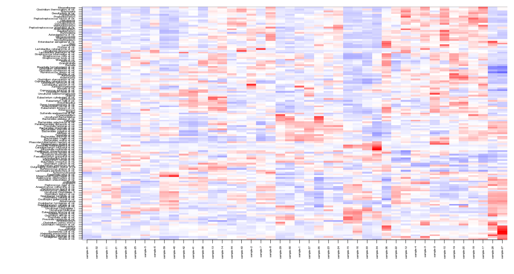
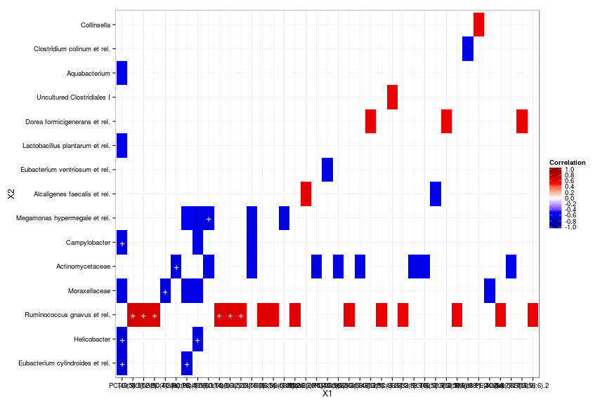

### Two-way matrix heatmap

Visualize deviation of all bacteria from their population mean (smaller: blue; higher: red):


```r
dat <- t(scale(dat2)) # Shift mean to zero for each bacteria
hm <- heatmap(dat) # Find visually appealing order for rows and columns
tmp <- netresponse::plot_matrix(dat[hm$rowInd, hm$colInd], type = "twoway", mar = c(5, 12, 1, 1), cex.axis = 0.5)
```

 

### Cross-correlating data sets

Cross-correlate columns of two data sets. This will return correlations, raw p-values, and q-value estimates (not strictly proper as the comparisons are not independent). Here we use robust biweight midcorrelation ('bicor') from the [WGCNA package](http://labs.genetics.ucla.edu/horvath/CoexpressionNetwork/Rpackages/WGCNA/). Keep only those elements that have at least only one significant correlation (n.signif):


```r
correlations <- microbiome::cross.correlate(dat1, dat2, 
	     				    method = "bicor", mode = "matrix", 
					    n.signif = 1, p.adj.threshold = 0.05, 
					    p.adj.method = "qvalue")
```

```
## Error in match.arg(method): 'arg' should be one of "holm", "hochberg", "hommel", "bonferroni", "BH", "BY", "fdr", "none"
```

Arrange the results in handy table format: 


```r
correlation.table <- microbiome::cmat2table(correlations)
head(correlation.table)
```

```
##             X1                               X2 Correlation       p.adj
## 278   PC(40:3) Eubacterium cylindroides et rel.  -0.6745063 0.008697453
## 356   PC(40:3)                     Helicobacter  -0.6807777 0.008697453
## 530 TG(54:5).2      Ruminococcus gnavus et rel.   0.6789932 0.008697453
## 525   TG(52:5)      Ruminococcus gnavus et rel.   0.6612294 0.013011631
## 521   TG(50:4)      Ruminococcus gnavus et rel.   0.6556532 0.013771802
## 474  PC(40:3e)                    Moraxellaceae  -0.6506371 0.014691099
```

### Correlation heatmaps

Rearrange the data and plot the heatmap and mark significant correlations with stars to reproduce microbiota-lipidome heatmap from [this article](https://peerj.com/articles/32/): 


```r
p <- microbiome::correlation.heatmap(correlation.table, "X1", "X2", fill = "Correlation", star = "p.adj", p.adj.threshold = 0.05) 
```

```r
print(p)
```

 


### Heatmaps with ggplot2

The above examples provide handy shortcuts for heatmap visualization. You can also directly modify the ggplot2 routines. This time, let us set q-value threshold also for cell coloring: 


```r
# Order the rows and columns with levels argument if needed:
correlation.table$X1 <- factor(correlation.table$X1, levels = unique(as.character(correlation.table$X1)))
correlation.table$X2 <- factor(correlation.table$X2, levels = unique(as.character(correlation.table$X2)))

# Set black-and-white theme
library(ggplot2)
theme_set(theme_bw())

# Pick only the correlations with q<0.05
# Note: this will leave other cells empty
subtable <- subset(correlation.table, p.adj < 0.05)

# Arrange the figure
p <- ggplot(subtable, aes(x = X1, y = X2, fill = Correlation))
p <- p + geom_tile() 
p <- p + scale_fill_gradientn("Correlation", 
       	 		       breaks = seq(from = -1, to = 1, by = 0.2), 
			       colours = c("darkblue", "blue", "white", "red", "darkred"), 
			       limits = c(-1,1)) 
p <- p + opts(axis.text.x=theme_text(angle = 90)) + xlab("") + ylab("")
```

```
## Error: Use 'theme' instead. (Defunct; last used in version 0.9.1)
```

```r
# Mark the most significant cells with stars
p <- p + geom_text(data = subset(correlation.table, p.adj < 0.02), 
       	 	   aes(x = X1, y = X2, label = "+"), col = "white", size = 5)
```


```r
print(p)
```

 

### Heatmap with text

For detailed information, might be handy to print the actual values on
top of the heatmap:


```r
correlations <- microbiome::cross.correlate(dat1, dat2, 
	     				    method = "bicor", 
					    mode = "table", 
					    n.signif = 1, 
					    p.adj.threshold = 0.01, 
					    p.adj.method = "qvalue")
```

```
## Error in match.arg(method): 'arg' should be one of "holm", "hochberg", "hommel", "bonferroni", "BH", "BY", "fdr", "none"
```

```r
theme_set(theme_bw(20))
df <- correlations
df$X1 <- factor(df$X1)
df$X2 <- factor(df$X2)
p <- ggplot(df, aes(X1, X2, group=X2)) 
```

```
## Error: ggplot2 doesn't know how to deal with data of class list
```

```r
p <- p + geom_tile(aes(fill = Correlation)) 
p <- p + geom_text(aes(fill = df$Correlation, label = round(df$Correlation, 1))) 
#p <- p + scale_fill_gradient(low = "white", high = "red") 
p <- p + scale_fill_gradientn("Correlation", breaks = seq(from = -1, to = 1,  by = 0.1), colours = c("blue", "white", "red"), limits = c(-1, 1))
p <- p + theme(axis.text.x = element_text(angle = 60, vjust = 0.5)) + xlab("") + ylab("")
print(p)
```

```
## Error in round(df$Correlation, 1): non-numeric argument to mathematical function
```


### Oligo heatmap

This reproduces the oligo-level heatmap from profiling script. If there are problems, try to tune ppcm, figureratio and fontsize (see help(add.heatmap) for details)


```r
library(microbiome)

# Load Phylogeny
phylogeny.info <- GetPhylogeny("HITChip")

# Load oligo-level data

# Replace data.directory here with your own profiling script output data directory
data.directory <- system.file("extdata", package = "microbiome")

oligodata <- read.profiling(level = "oligo", log10 = FALSE, data.dir = data.directory)

# Produce the plot and save it to the working directory
hc.params <- add.heatmap(log10(oligodata), output.dir = ".", phylogeny.info = phylogeny.info)
```

```
## Error in eval(expr, envir, enclos): could not find function "add.heatmap"
```
