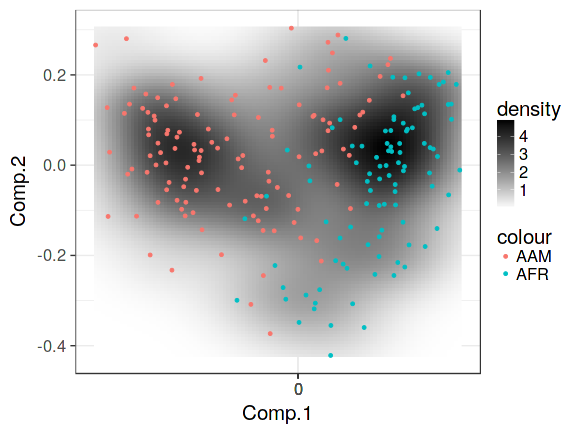

<!--
  %\VignetteEngine{knitr::rmarkdown}
  %\VignetteIndexEntry{microbiome tutorial - density}
  %\usepackage[utf8]{inputenc}
  %\VignetteEncoding{UTF-8}  
-->


## Microbiome Landscaping

[Microbiome Landscaping](https://academic.oup.com/femsre/article/doi/10.1093/femsre/fuw045/2979411/Intestinal-microbiome-landscaping-insight-in#58802539) refers to the analysis and illustration of population frequencies. Typically, these are wrappers based on standard ordination methods (for more examples, see [ordination examples](Ordination.html))


### Two-dimensional microbiome landscape

Load example data:


```r
library(microbiome)
library(phyloseq)
library(ggplot2)

data(dietswap)
pseq <- dietswap

# Convert to compositional data
pseq.rel <- microbiome::transform(pseq, "compositional")

# Pick core taxa
pseq.core <- core(pseq.rel, detection = 5/100, prevalence = 50/100)
pseq.core <- subset_samples(pseq.core, sex == "Female" & bmi_group == "lean")
```

```
## Error in validObject(.Object): invalid class "sample_data" object: Sample Data must have non-zero dimensions.
```


Visualize the microbiome landscape (sample similarities on two-dimensional projection):


```r
# Landscape plot directly from phyloseq object
p <- plot_landscape(pseq.core, "NMDS", "bray", col = "nationality")
print(p)
```



For direct access to the ordination coordinates, use the following:


```r
# Project the samples with the given method and dissimilarity measure. 
# Ordinate the data; note that some ordinations are sensitive to random seed
# "quiet" is used to suppress intermediate outputs
set.seed(423542)
quiet(proj <- get_ordination(pseq.core, "NMDS", "bray"))

# Same with a generic data.frame
# (note that random seed will affect the exact ordination)
p <- plot_landscape(proj[, 1:2], col = proj$nationality, legend = T)
print(p)

# Visualize sample names:
ax1 <- names(proj)[[1]]
ax2 <- names(proj)[[2]]
p <- ggplot(aes_string(x = ax1, y = ax2, label = "sample"), data = proj) +
       geom_text(size = 2)
print(p)
```


### Abundance histograms (one-dimensional landscapes)

Population densities for Dialister:


```r
# Load libraries
library(microbiome)
library(phyloseq)
pseq <- dietswap

# Visualize population densities for specific taxa
plot_density(pseq, "Dialister") + ggtitle("Absolute abundance")

# Same with log10 compositional abundances
x <- microbiome::transform(pseq, "compositional")
tax <- "Dialister"
plot_density(x, tax, log10 = TRUE) +
  ggtitle("Relative abundance") +
  xlab("Relative abundance (%)")
```


