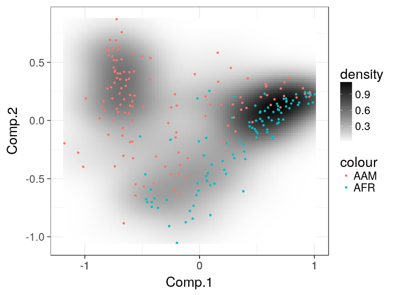
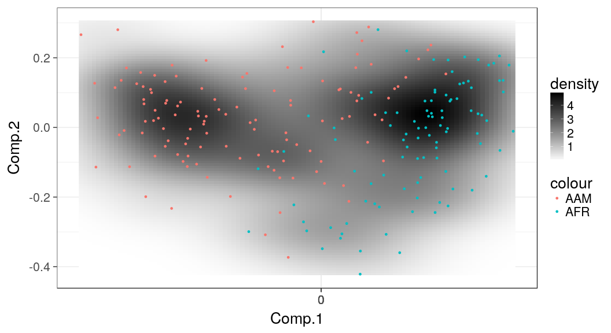
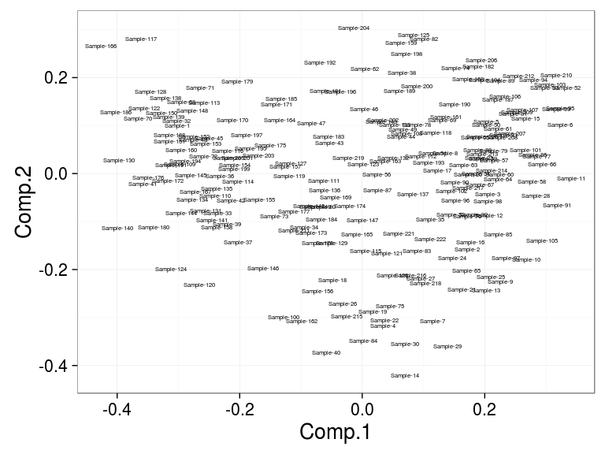
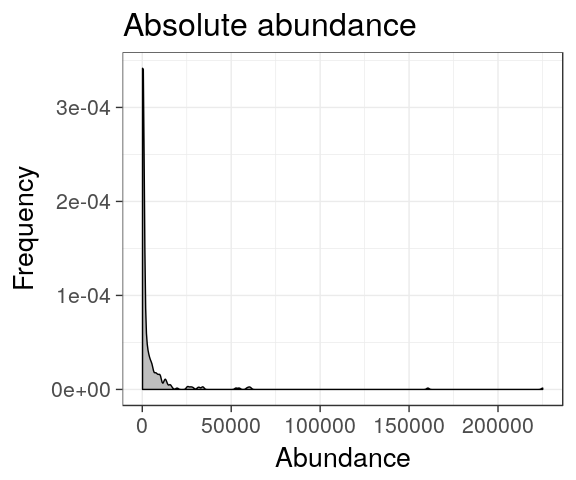
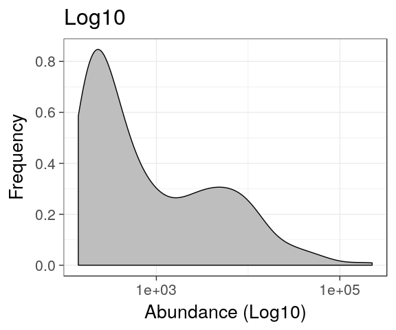
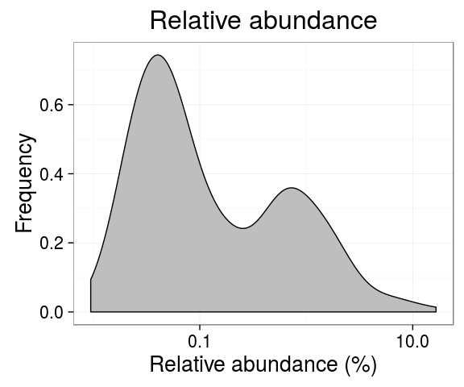

<!--
  %\VignetteEngine{knitr::rmarkdown}
  %\VignetteIndexEntry{microbiome tutorial - density}
  %\usepackage[utf8]{inputenc}
  %\VignetteEncoding{UTF-8}  
-->
Microbiome Landscaping
----------------------

[Microbiome
Landscaping](https://academic.oup.com/femsre/article/doi/10.1093/femsre/fuw045/2979411/Intestinal-microbiome-landscaping-insight-in#58802539)
refers to the analysis and illustration of population frequencies.
Typically, this is based on standard ordination methods (for more
examples, see [ordination examples](Ordination.md))

### Two-dimensional microbiome landscape

Load example data:

    library(microbiome)
    library(phyloseq)
    library(ggplot2)
    data(dietswap)
    pseq <- dietswap

    # Convert to compositional data
    pseq.rel <- transform_phyloseq(pseq, "compositional")

    # Pick core taxa with with >10 percent prevalence of the samples
    # at a >1 percent relative abundance detection limit
    pseq.core <- core(pseq.rel, detection = 1, prevalence = 10)

Visualize the microbiome landscape (sample similarities on
two-dimensional projection):

    # Landscape plot directly from phyloseq object
    p <- plot_landscape(pseq.core, "NMDS", "bray", col = "nationality")

    ## Square root transformation
    ## Wisconsin double standardization
    ## Run 0 stress 0.1748281 
    ## Run 1 stress 0.1835529 
    ## Run 2 stress 0.1916376 
    ## Run 3 stress 0.196055 
    ## Run 4 stress 0.2011379 
    ## Run 5 stress 0.1897291 
    ## Run 6 stress 0.212523 
    ## Run 7 stress 0.2313977 
    ## Run 8 stress 0.1827186 
    ## Run 9 stress 0.1920535 
    ## Run 10 stress 0.2034503 
    ## Run 11 stress 0.2315345 
    ## Run 12 stress 0.1844069 
    ## Run 13 stress 0.2103193 
    ## Run 14 stress 0.1919278 
    ## Run 15 stress 0.2260378 
    ## Run 16 stress 0.182382 
    ## Run 17 stress 0.1886253 
    ## Run 18 stress 0.2060701 
    ## Run 19 stress 0.1924976 
    ## Run 20 stress 0.1893886 
    ## *** No convergence -- monoMDS stopping criteria:
    ##     20: stress ratio > sratmax

    print(p)

For a direct access to the ordination coordinates, use the following:

    # Project the samples with the given method and dissimilarity measure. 
    # Ordinate the data; note that some ordinations are sensitive to random seed
    set.seed(423542)
    proj <- get_ordination(pseq.core, "NMDS", "bray")

    ## Square root transformation
    ## Wisconsin double standardization
    ## Run 0 stress 0.1748281 
    ## Run 1 stress 0.1962253 
    ## Run 2 stress 0.2052584 
    ## Run 3 stress 0.2365267 
    ## Run 4 stress 0.188475 
    ## Run 5 stress 0.1817445 
    ## Run 6 stress 0.2018389 
    ## Run 7 stress 0.1904916 
    ## Run 8 stress 0.1844109 
    ## Run 9 stress 0.2112487 
    ## Run 10 stress 0.1955847 
    ## Run 11 stress 0.1999699 
    ## Run 12 stress 0.1766227 
    ## Run 13 stress 0.2022904 
    ## Run 14 stress 0.2091112 
    ## Run 15 stress 0.185601 
    ## Run 16 stress 0.2133307 
    ## Run 17 stress 0.2069565 
    ## Run 18 stress 0.2167203 
    ## Run 19 stress 0.2255444 
    ## Run 20 stress 0.2329115 
    ## *** No convergence -- monoMDS stopping criteria:
    ##     16: stress ratio > sratmax
    ##      4: scale factor of the gradient < sfgrmin

    # Same with a generic data.frame
    # (note that random seed will affect the exact ordination)
    p <- microbiome::densityplot(proj[, 1:2], col = proj$nationality, legend = T)
    print(p)

    # Visualize sample names:
    ax1 <- names(proj)[[1]]
    ax2 <- names(proj)[[2]]
    p <- ggplot(aes_string(x = ax1, y = ax2, label = "sample"), data = proj) +
           geom_text(size = 2)
    print(p)

### Abundance histograms (one-dimensional landscapes)

Population densities for Dialister:

    # Load libraries
    library(microbiome)
    library(phyloseq)

    # Example data from
    # http://www.nature.com/ncomms/2014/140708/ncomms5344/full/ncomms5344.html
    data(atlas1006)

    # Pick the subset of RBB-preprocessed samples from time point 0
    x <- subset_samples(atlas1006, time == 0 & DNA_extraction_method == "r")

    # Visualize population densities for specific taxa
    plot_density(x, "Dialister") + ggtitle("Absolute abundance")

    # Same with log10 scaled X axis
    plot_density(x, "Dialister", log10 = TRUE) + ggtitle("Log10")

    # Same with log10 compositionals
    x <- transform_phyloseq(x, "compositional")
    tax <- "Dialister"
    plot_density(x, tax, log10 = TRUE) + ggtitle("Relative abundance")

