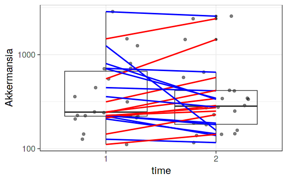

<!--
  %\VignetteEngine{knitr::rmarkdown}
  %\VignetteIndexEntry{microbiome tutorial - comparisons}
  %\usepackage[utf8]{inputenc}
  %\VignetteEncoding{UTF-8}  
-->


## Mixed models for univariate comparisons


Load example data:


```r
# Load libraries
library(microbiome)
library(ggplot2)
library(dplyr)

# Probiotics intervention example data 
data(peerj32) # Source: https://peerj.com/articles/32/
pseq <- peerj32$phyloseq # Rename the example data
```


Abundance boxplot


```r
p <- boxplot_abundance(pseq, x = "time", y = "Akkermansia", line = "subject", color = "gender") + scale_y_log10()
print(p)
```




### Linear model comparison with random effect subject term

Test individual taxonomic group


```r
# Get sample metadata
dfs <- meta(pseq)

# Add abundance as the signal to model
dfs$signal <- abundances(pseq)["Akkermansia", rownames(dfs)]

# Paired comparison
# with fixed group effect and random subject effect
library(lme4)
<<<<<<< HEAD
=======
```

```
## Loading required package: Matrix
```

```
## Warning: package 'Matrix' was built under R version 3.3.3
```

```
## 
## Attaching package: 'Matrix'
```

```
## The following object is masked from 'package:S4Vectors':
## 
##     expand
```

```
## The following objects are masked from 'package:SpiecEasi':
## 
##     tril, triu
```

```
## The following object is masked from 'package:tidyr':
## 
##     expand
```

```r
>>>>>>> 7df938abbe6c206a533574f77f218f5889bff058
out <- lmer(signal ~ group + (1|subject), data = dfs)
out0 <- lmer(signal ~ (1|subject), data = dfs)
comp <- anova(out0, out)
```

```
## refitting model(s) with ML (instead of REML)
```

```r
pv <- comp[["Pr(>Chisq)"]][[2]]
print(pv)
```

```
## [1] 0.4556962
```

