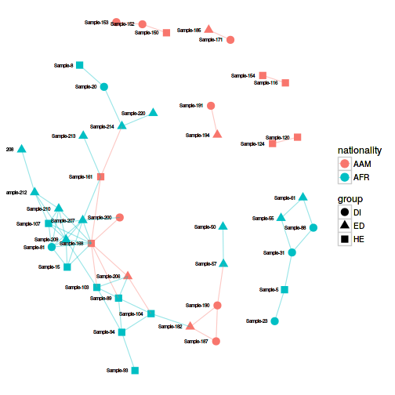
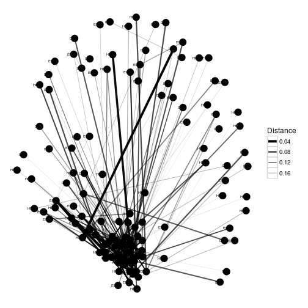
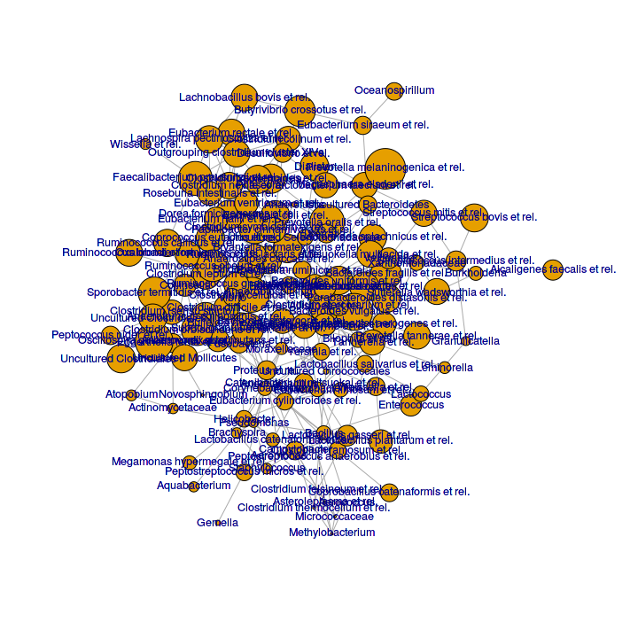

## Networks

Load example data:


```r
library(microbiome)
data("dietswap")
pseq <- dietswap
```

For more network examples, see [phyloseq tutorial](http://joey711.github.io/phyloseq/plot_network-examples)


```r
ig <- make_network(pseq, max.dist = 0.2)
plot_network(ig, pseq, color = "nationality", shape = "group", line_weight = 0.4, label = "sample")
```

```
## Error in grid.Call.graphics(L_text, as.graphicsAnnot(x$label), x$x, x$y, : X11 font -adobe-helvetica-%s-%s-*-*-%d-*-*-*-*-*-*-*, face 1 at size 6 could not be loaded
```



Another example:


```r
plot_net(pseq, maxdist = 0.2, point_label = "group")
```

```
## Error in grid.Call.graphics(L_text, as.graphicsAnnot(x$label), x$x, x$y, : X11 font -adobe-helvetica-%s-%s-*-*-%d-*-*-*-*-*-*-*, face 1 at size 6 could not be loaded
```



### Network reconstruction for compositional data

Also the SparCC implementation is available via the [SpiecEasi
package](https://github.com/zdk123/SpiecEasi). The execution is slow.


```r
library(SpiecEasi) #install_github("zdk123/SpiecEasi")
library(microbiome)
library(phyloseq)

# Pick example OTU matrix (samples x taxa)
data("atlas1006")
pseq <- subset_samples(atlas1006, time == 0 & DNA_extraction_method == "r")
otu <- t(get_sample(pseq))

# SPIEC-EASI network reconstruction
# In practice, use more repetitions
net <- spiec.easi(otu, method='mb', lambda.min.ratio=1e-2, 
                  nlambda=20, icov.select.params=list(rep.num=20))

## Create graph object
n <- net$refit
colnames(n) <- rownames(n) <- colnames(otu)

# Network format
netw <- network(as.matrix(n), directed = FALSE)


# igraph format
ig <- graph.adjacency(n, mode='undirected', add.rownames = TRUE)

## set size of vertex to log2 mean abundance 
vsize <- log2(apply(otu, 2, mean))

# Network layout
coord <- layout.fruchterman.reingold(ig)

# Visualize the network
plot(ig, layout = coord, vertex.size = vsize, vertex.label = names(vsize))
```



```r
# Check degree distribution
#dd <- degree.distribution(ig)
#plot(0:(length(dd)-1), dd, ylim=c(0,.35), type='b', 
#      ylab="Frequency", xlab="Degree", main="Degree Distributions")
```


Visualize the network with [ggnet2](https://briatte.github.io/ggnet):


```r
library(GGally)
library(ggnet)
library(network)
library(sna)
library(ggplot2)
library(intergraph) # ggnet2 works also with igraph with this

phyla <- levelmap(colnames(otu), from = "Genus", to = "Phylum", tax_table(pseq))
netw %v% "Phylum" <- phyla
p <- ggnet2(netw, color = "Phylum", label = TRUE, label.size = 2)
print(p)
```

```
## Error in grid.Call(L_textBounds, as.graphicsAnnot(x$label), x$x, x$y, : X11 font -adobe-helvetica-%s-%s-*-*-%d-*-*-*-*-*-*-*, face 1 at size 9 could not be loaded
```


