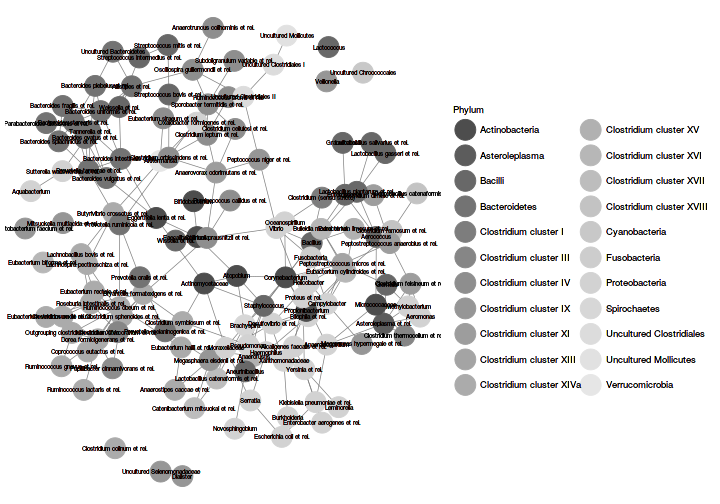

<!--
  %\VignetteEngine{knitr::rmarkdown}
  %\VignetteIndexEntry{microbiome tutorial - networks}
  %\usepackage[utf8]{inputenc}
  %\VignetteEncoding{UTF-8}  
-->


Load [example data](Data.html):


```r
library(microbiome)
data(dietswap)
pseq <- dietswap

# Keep only the prevalent taxa to speed up examples
pseq <- core(pseq, detection = 10^3, prevalence = 80/100)
```


### Taxonomic network reconstruction 

See the [phyloseq tutorial](http://joey711.github.io/phyloseq/plot_network-examples) for
additional network visualization tools.

The widely reported compositionality bias in similarity measures can
be fixed with SpiecEasi or SparCC; the implementations are available
via the [SpiecEasi package](https://github.com/zdk123/SpiecEasi). Note
that the execution is slow.


```r
library(SpiecEasi) #install_github("zdk123/SpiecEasi")
library(phyloseq)

# Pick the OTU table
otu <- t(abundances(pseq))
```


```r
# SPIEC-EASI network reconstruction
# In practice, use more repetitions
net <- spiec.easi(otu, method='mb', lambda.min.ratio=1e-2, 
                  nlambda=5, icov.select.params=list(rep.num=5))

## Create graph object
n <- net$refit
colnames(n) <- rownames(n) <- colnames(otu)

# Network format
library(network)
netw <- network(as.matrix(n), directed = FALSE)

# igraph format
# library(igraph)
# ig <- graph.adjacency(n, mode='undirected', add.rownames = TRUE)

# Network layout
# coord <- layout.fruchterman.reingold(ig)

## set size of vertex to log2 mean abundance 
# vsize <- log2(apply(otu, 2, mean))

# Visualize the network
# print(plot(ig, layout = coord, vertex.size = vsize, vertex.label = names(vsize)))
```


Investigate degree distribution with the following:


```r
dd <- degree.distribution(ig)
plot(0:(length(dd)-1), dd, ylim = c(0,.35), type = 'b', 
      ylab = "Frequency", xlab = "Degree", main = "Degree Distributions")
```


Visualize the network with [ggnet2](https://briatte.github.io/ggnet):


```r
library(GGally)
library(ggnet)
library(network)
library(sna)
library(ggplot2)
library(intergraph) # ggnet2 works also with igraph with this

phyla <- map_levels(colnames(otu),
           from = "Genus", to = "Phylum",
           tax_table(pseq))

netw %v% "Phylum" <- phyla
p <- ggnet2(netw, color = "Phylum", label = TRUE, label.size = 2)
print(p)
```




