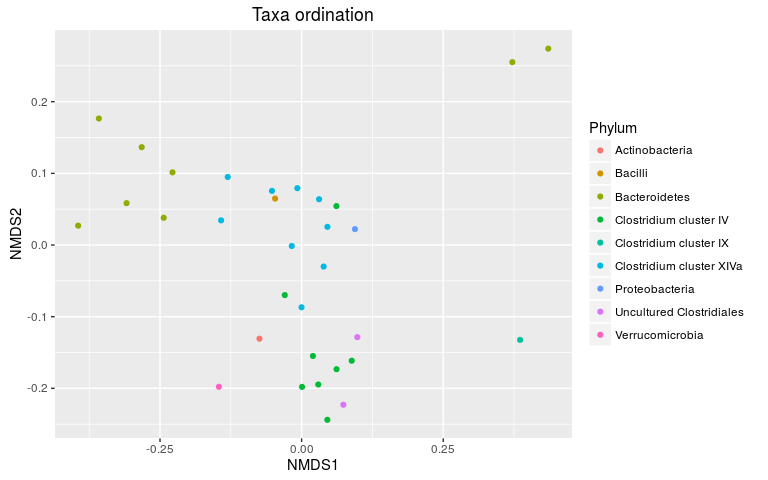
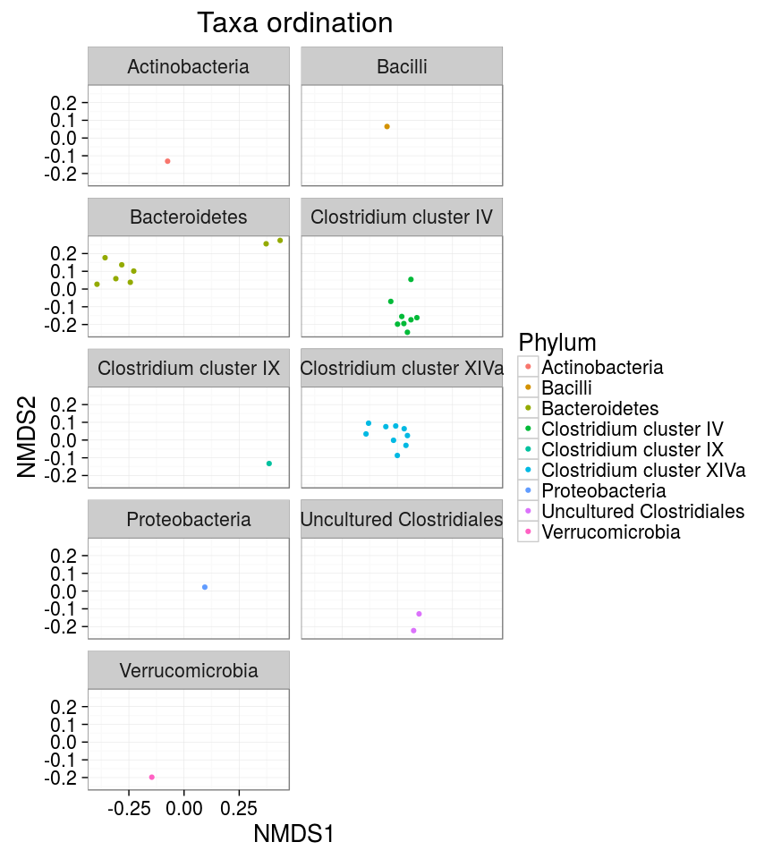
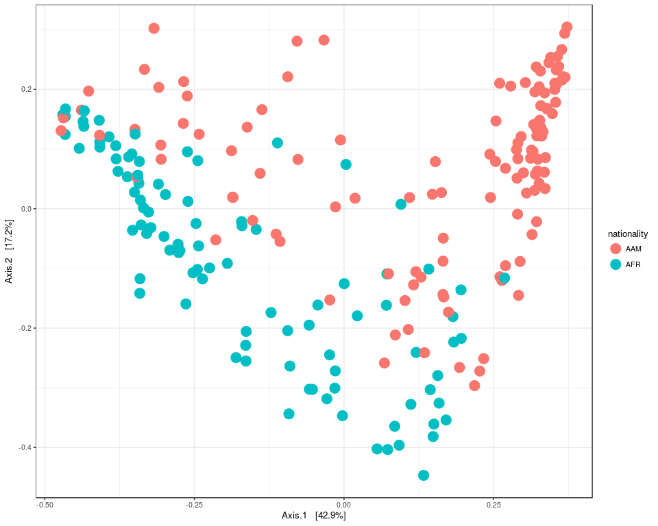
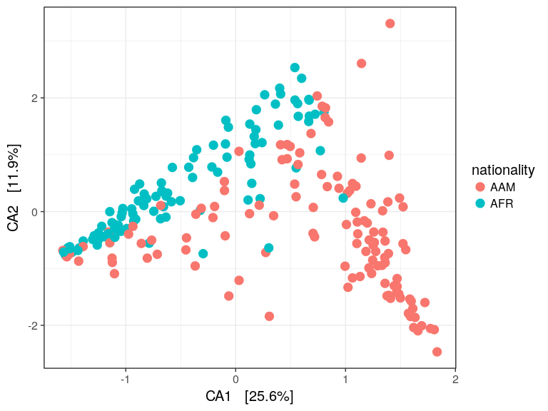
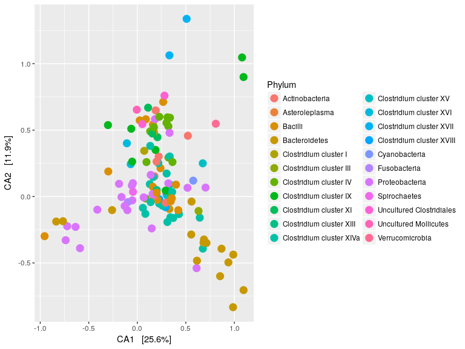
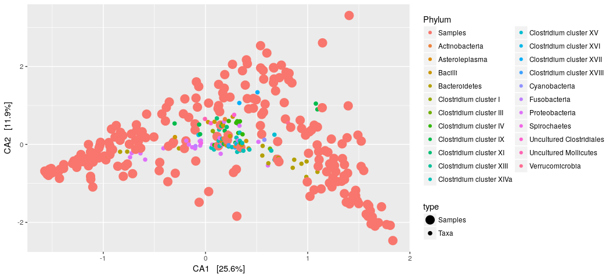

<!--
  %\VignetteEngine{knitr::rmarkdown}
  %\VignetteIndexEntry{microbiome tutorial - ordination}
  %\usepackage[utf8]{inputenc}
  %\VignetteEncoding{UTF-8}  
-->
Ordination examples
-------------------

Full examples for standard ordination techniques applied to phyloseq
data, based on the [phyloseq ordination
tutorial](http://joey711.github.io/phyloseq/plot_ordination-examples.html).
For handy wrappers for some common ordination tasks in microbiome
analysis, see [landscaping examples](Landscaping.md)

Load example data:

    library(microbiome)
    library(phyloseq)
    library(ggplot2)
    data(dietswap)
    pseq <- dietswap

    # Convert to compositional data
    pseq.rel <- transform_phyloseq(pseq, "compositional")

    # Pick core taxa with with >10 percent prevalence of the samples
    # at a >1 percent relative abundance detection limit
    pseq.core <- core(pseq.rel, detection = 1, prevalence = 10)

### Sample ordination

Project the samples with the given method and dissimilarity measure.

    # Ordinate the data
    set.seed(423542)
    proj <- get_ordination(pseq.core, "NMDS", "bray")

Ordinate the taxa in NMDS plot with Bray-Curtis distances

    p <- plot_ordination(pseq.core, ordinate(pseq.core, "NMDS", "bray"), type = "taxa", color = "Phylum", title = "Taxa ordination")

    ## Square root transformation
    ## Wisconsin double standardization
    ## Run 0 stress 0.1748281 
    ## Run 1 stress 0.2352198 
    ## Run 2 stress 0.1848787 
    ## Run 3 stress 0.1748474 
    ## ... Procrustes: rmse 0.001589904  max resid 0.02264455 
    ## Run 4 stress 0.181745 
    ## Run 5 stress 0.175045 
    ## ... Procrustes: rmse 0.0028426  max resid 0.03362797 
    ## Run 6 stress 0.1833839 
    ## Run 7 stress 0.2242994 
    ## Run 8 stress 0.2305855 
    ## Run 9 stress 0.2120231 
    ## Run 10 stress 0.1941342 
    ## Run 11 stress 0.2114969 
    ## Run 12 stress 0.1983375 
    ## Run 13 stress 0.1886606 
    ## Run 14 stress 0.1897439 
    ## Run 15 stress 0.2147918 
    ## Run 16 stress 0.2139568 
    ## Run 17 stress 0.210365 
    ## Run 18 stress 0.236446 
    ## Run 19 stress 0.2322866 
    ## Run 20 stress 0.1839782 
    ## *** No convergence -- monoMDS stopping criteria:
    ##     20: stress ratio > sratmax

    print(p)

Grouping by Phyla

    p + facet_wrap(~Phylum, 5)

### Multidimensional scaling (MDS / PCoA)

    plot_ordination(pseq, ordinate(pseq, "MDS"), color = "nationality") +
                    geom_point(size = 5)

### Canonical correspondence analysis (CCA)

    # With samples
    p <- plot_ordination(pseq, ordinate(pseq, "CCA"),
           type = "samples", color = "nationality")
    p <- p + geom_point(size = 4)
    print(p)

    # With taxa:
    p <- plot_ordination(pseq, ordinate(pseq, "CCA"),
           type = "taxa", color = "Phylum")
    p <- p + geom_point(size = 4)
    print(p)

### Split plot

    plot_ordination(pseq, ordinate(pseq, "CCA"),
                  type = "split", shape = "nationality", 
                      color = "Phylum", label = "nationality")

### Ordination biplot

    plot_ordination(pseq, ordinate(pseq, "CCA"), type = "biplot", color = "Phylum")

### RDA

See a separate page on [RDA](RDA.md).
