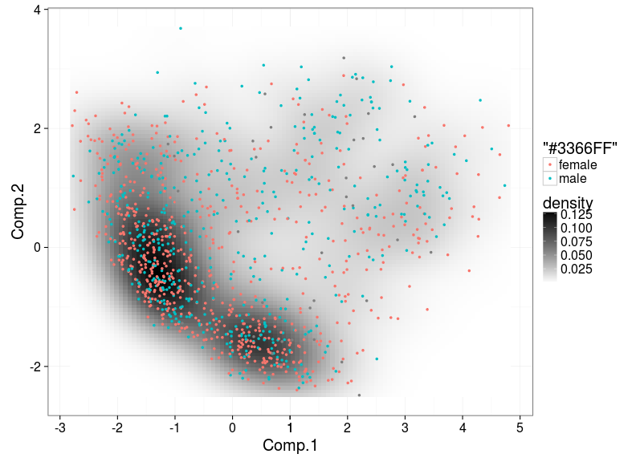
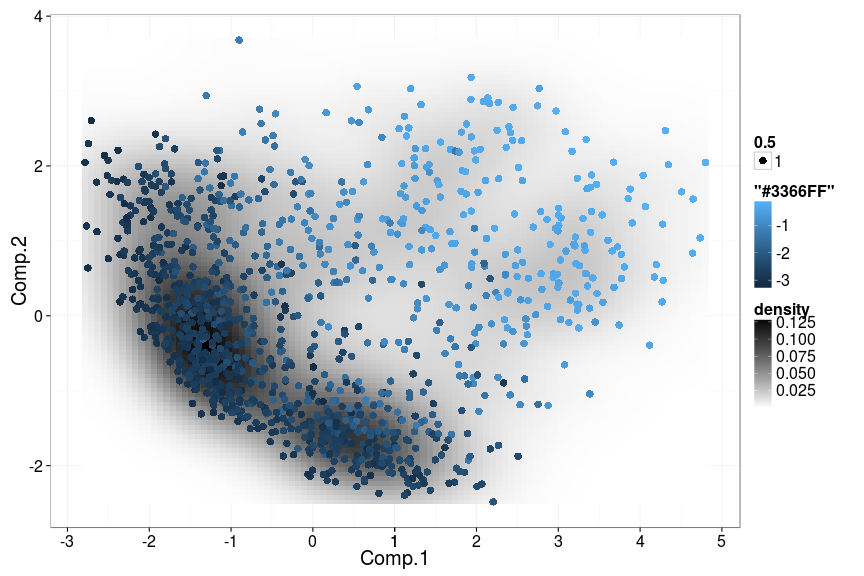
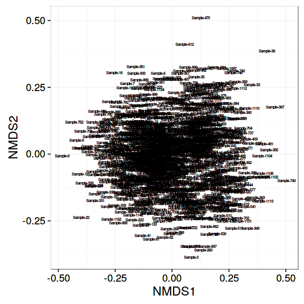
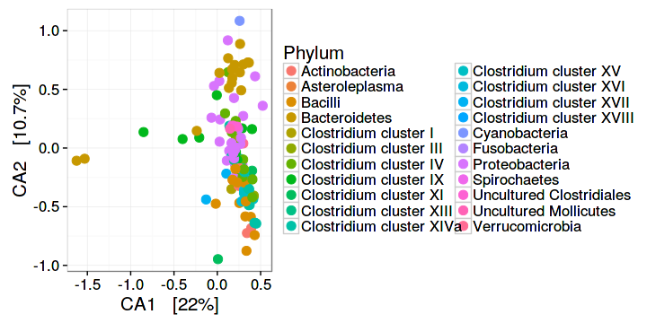

## Ordination examples

Some examples with HITChip data. See also [phyloseq ordination tutorial](http://joey711.github.io/phyloseq/plot_ordination-examples.html).

Load example data:


```r
library(microbiome)
library(phyloseq)
library(ggplot2)
data(atlas1006)
pseq <- atlas1006

# Convert signal to relative abundances
pseq.rel <- transform_phyloseq(pseq, "relative.abundance")

# Pick OTUs that are present with >1 percent relative abundance 
# in >10 percent of the samples
pseq2 <- filter_taxa(pseq.rel, function(x) sum(x > 1) > (0.1*nsamples(pseq.rel)), TRUE)
```


### Sample ordination

Project the samples with the given method and distance:


```r
set.seed(423542)
pseq.ord <- ordinate(pseq2, "NMDS", "bray")
# Just pick the projected data (first two columns + metadata)
proj <- plot_ordination(pseq2, pseq.ord, justDF = T)
```


Visualize and highlight. In addition to densityplot, see plot_ordn from the microbiome package and plot_ordination from the phyloseq package.


```r
# Highlighting gender
p <- densityplot(proj[, 1:2], col = proj$gender, legend = T)
print(p)
```



```r
# Highlighting subjects with low / high Prevotella 
prevotella.abundance  <- as.vector(log10(otu_table(pseq2)["Prevotella melaninogenica et rel.",]) )
p <- densityplot(proj[, 1:2], col = prevotella.abundance, legend = T)
print(p)
```



Projection with sample names:


```r
ax1 <- names(proj)[[1]]
ax2 <- names(proj)[[2]]
p <- ggplot(aes_string(x = ax1, y = ax2, label = "sample"), data = proj) +
       geom_text(size = 2)
print(p)
```




Ordinate the taxa in NMDS plot with Bray-Curtis distances


```r
p <- plot_ordination(pseq2, pseq.ord, type = "taxa", color = "Phylum", title = "Taxa ordination")
print(p)
```


Grouping the plots by Phylum


```r
p + facet_wrap(~Phylum, 5)
```


### Multidimensional scaling (MDS / PCoA)


```r
plot_ordination(pseq, ordinate(pseq, "MDS"), color = "DNA_extraction_method") + geom_point(size = 5)
```


### RDA

See a separate page on [RDA](RDA.md).


### Canonical correspondence analysis (CCA)

With samples:


```r
p <- plot_ordination(pseq, ordinate(pseq, "CCA"), type = "samples", color = "gender")
p + geom_point(size = 5)
```


With taxa:


```r
p <- plot_ordination(pseq, ordinate(pseq, "CCA"), type = "taxa", color = "Phylum")
p <- p + geom_point(size = 4)
print(p)
```




### Split plot


```r
plot_ordination(pseq, ordinate(pseq, "CCA"), type = "split", shape = "gender", 
    color = "Phylum", label = "gender")
```


### Ordination biplot


```r
plot_ordination(pseq, ordinate(pseq, "CCA"), type = "biplot", color = "Phylum")
```


