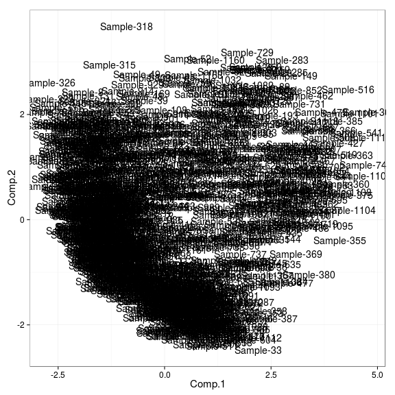
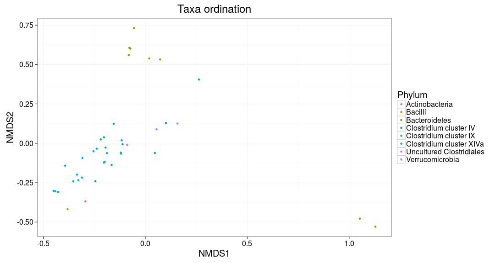
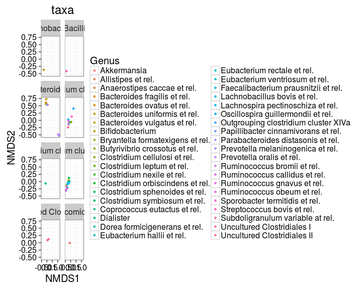
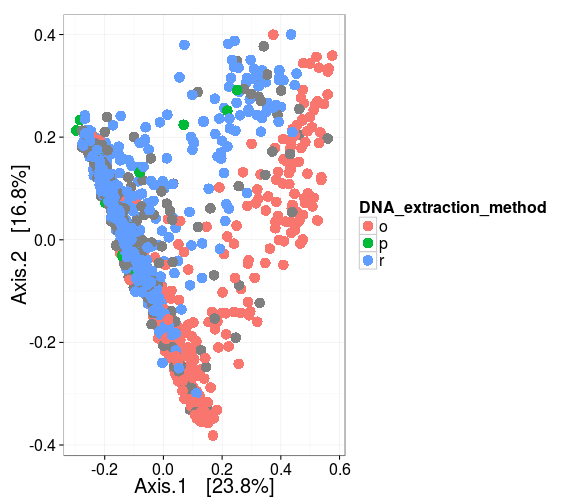
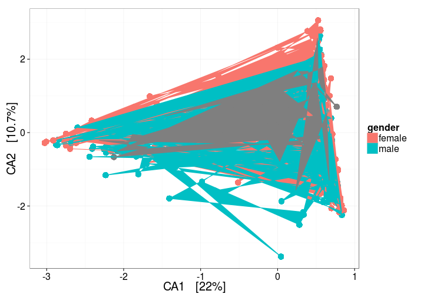
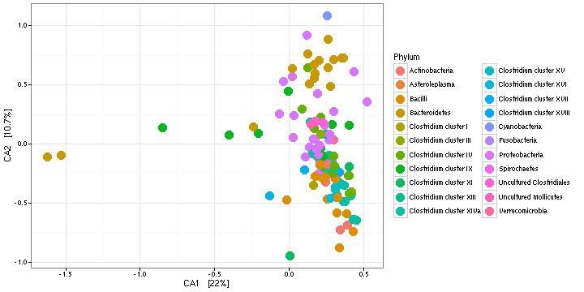
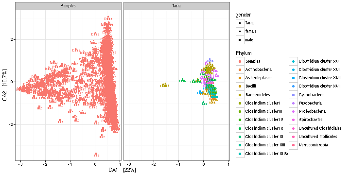
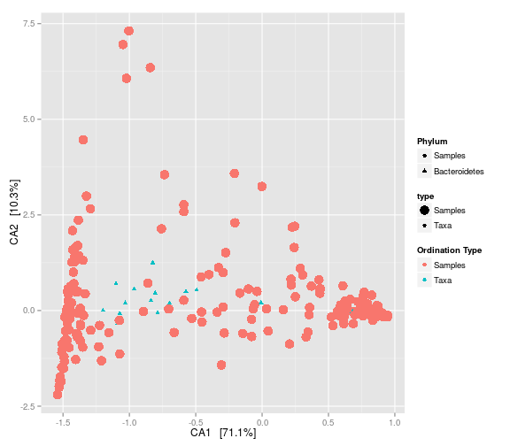

## Ordination examples

Some examples with HITChip data. See also [phyloseq ordination tutorial](http://joey711.github.io/phyloseq/plot_ordination-examples.html).

Load example data:


```r
library(microbiome)
library(phyloseq)
library(ggplot2)
data("atlas1006")
pseq <- atlas1006

# Convert signal to relative abundances
pseq.rel <- transform_sample_counts(pseq, function (x) {x/sum(x)})

# Pick OTUs that are present with >1 percent relative abundance 
# in >10 percent of the samples
pseq2 <- filter_taxa(pseq.rel, function(x) sum(x > .01) > (0.1*nsamples(pseq.rel)), TRUE)
```


### Sample ordination

Project the samples with the given method and distance:


```r
set.seed(423542)
library(phyloseq)
pseq.ord <- ordinate(pseq2, "NMDS", "bray")
```

```
## Run 0 stress 0.2028085 
## Run 1 stress 0.2236351 
## Run 2 stress 0.4205223 
## Run 3 stress 0.2159774 
## Run 4 stress 0.2131121 
## Run 5 stress 0.2135156 
## Run 6 stress 0.219663 
## Run 7 stress 0.2202646 
## Run 8 stress 0.2202117 
## Run 9 stress 0.2179414 
## Run 10 stress 0.213931 
## Run 11 stress 0.420529 
## Run 12 stress 0.2142954 
## Run 13 stress 0.2198069 
## Run 14 stress 0.2185281 
## Run 15 stress 0.2098309 
## Run 16 stress 0.2191812 
## Run 17 stress 0.2115131 
## Run 18 stress 0.2171189 
## Run 19 stress 0.2164978 
## Run 20 stress 0.2187442
```

```r
# Just pick the projected data (first two columns + metadata)
proj <- plot_ordination(pseq2, pseq.ord, justDF = T)
```


Visualize and highlight. In addition to densityplot, see plot_ordn from the microbiome package and plot_ordination from the phyloseq package.


```r
# Highlight gender
library(microbiome)
p <- densityplot(proj[, 1:2], col = proj$gender, legend = T)
print(p)
```


```r
# Highlight low/high Prevotella subjects
prevotella.abundance  <- as.vector(log10(otu_table(pseq2)["Prevotella melaninogenica et rel.",]) )
p <- densityplot(proj[, 1:2], col = prevotella.abundance, legend = T)
print(p)
```


Projection with sample names:


```r
ax1 <- names(proj)[[1]]
ax2 <- names(proj)[[2]]
ggplot(aes_string(x = ax1, y = ax2, label = "sample"), data = proj) + geom_text(size = 2)
```




Ordinate the taxa in NMDS plot with Bray-Curtis distances


```r
p <- plot_ordination(pseq2, pseq.ord, type = "taxa", color = "Phylum", title = "Taxa ordination")
print(p)
```



Grouping the plots by Phylum


```r
p + facet_wrap(~Phylum, 5)
```




### Multidimensional scaling (MDS / PCoA)


```r
plot_ordination(pseq, ordinate(pseq, "MDS"), color = "DNA_extraction_method") + geom_point(size = 5)
```




### Canonical correspondence analysis (CCA)

With samples:


```r
p <- plot_ordination(pseq, ordinate(pseq, "CCA"), type = "samples", color = "gender")
p + geom_point(size = 5)
```



With taxa:


```r
p <- plot_ordination(pseq, ordinate(pseq, "CCA"), type = "taxa", color = "Phylum")
p <- p + geom_point(size = 4)
print(p)
```




### Split plot


```r
plot_ordination(pseq, ordinate(pseq, "CCA"), type = "split", shape = "gender", 
    color = "Phylum", label = "gender")
```




### Ordination biplot


```r
plot_ordination(pseq, ordinate(pseq, "CCA"), type = "biplot", color = "Phylum")
```




