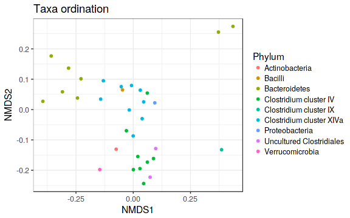
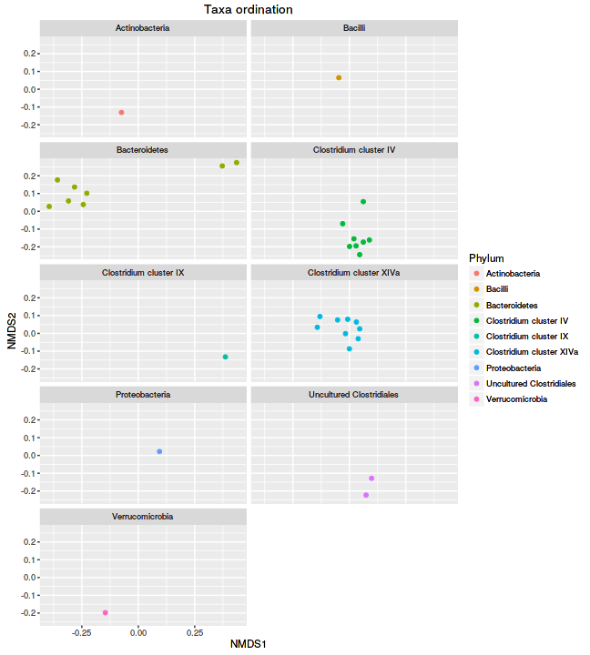
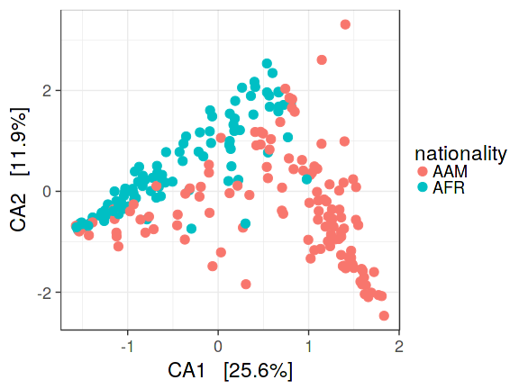
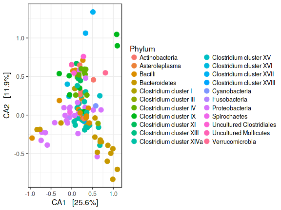
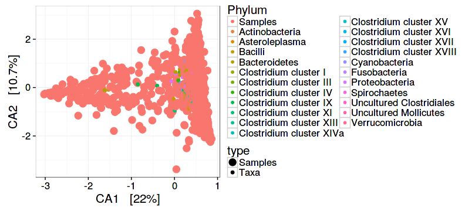

<!--
  %\VignetteEngine{knitr::rmarkdown}
  %\VignetteIndexEntry{microbiome tutorial - ordination}
  %\usepackage[utf8]{inputenc}
  %\VignetteEncoding{UTF-8}  
-->


## Ordination examples

Full examples for standard ordination techniques applied to phyloseq data, based on the [phyloseq ordination tutorial](http://joey711.github.io/phyloseq/plot_ordination-examples.html). For handy wrappers for some common ordination tasks in microbiome analysis, see [landscaping examples](Landscaping.html)


Load example data:


```r
library(microbiome)
library(phyloseq)
library(ggplot2)
data(dietswap)
pseq <- dietswap

# Convert to compositional data
pseq.rel <- microbiome::transform(pseq, "compositional")

# Pick core taxa with with the given prevalence and detection limits
pseq.core <- core(pseq.rel, detection = .1/100, prevalence = 90/100)

# Use relative abundances for the core
pseq.core <- microbiome::transform(pseq.core, "compositional")
```


### Sample ordination

Project the samples with the given method and dissimilarity measure. 


```r
# Ordinate the data
set.seed(4235421)
proj <- get_ordination(pseq.core, "NMDS", "bray")
```


Ordinate the taxa in NMDS plot with Bray-Curtis distances


```r
# "quiet" is here used to suppress intermediate output
quiet(p <- plot_ordination(pseq.core, ordinate(pseq.core, "NMDS", "bray"), type = "taxa", color = "Phylum", title = "Taxa ordination"))
print(p)
```



Grouping by Phyla


```r
p + facet_wrap(~Phylum, 5)
```




### Multidimensional scaling (MDS / PCoA)


```r
plot_ordination(pseq, ordinate(pseq, "MDS"), color = "nationality") +
                geom_point(size = 5)
```


### Canonical correspondence analysis (CCA)


```r
# With samples
p <- plot_ordination(pseq, ordinate(pseq, "CCA"),
       type = "samples", color = "nationality")
p <- p + geom_point(size = 4)
print(p)

# With taxa:
p <- plot_ordination(pseq, ordinate(pseq, "CCA"),
       type = "taxa", color = "Phylum")
p <- p + geom_point(size = 4)
print(p)
```




### Split plot


```r
plot_ordination(pseq, ordinate(pseq, "CCA"),
		      type = "split", shape = "nationality", 
    		      color = "Phylum", label = "nationality")
```


### Ordination biplot


```r
plot_ordination(pseq, ordinate(pseq, "CCA"), type = "biplot", color = "Phylum")
```




### RDA

See a separate page on [RDA](RDA.html).


