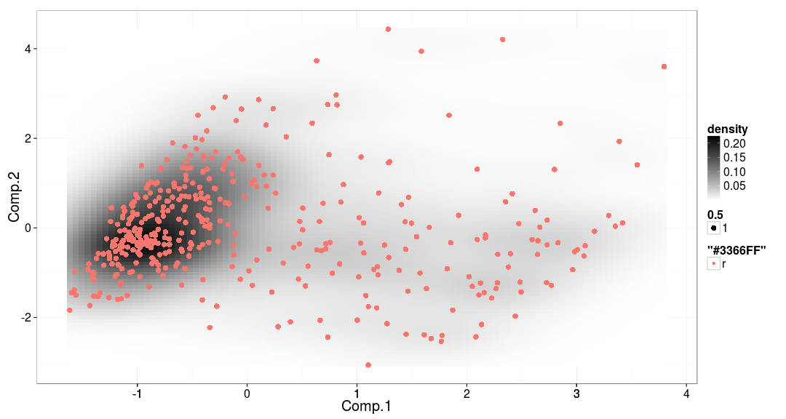
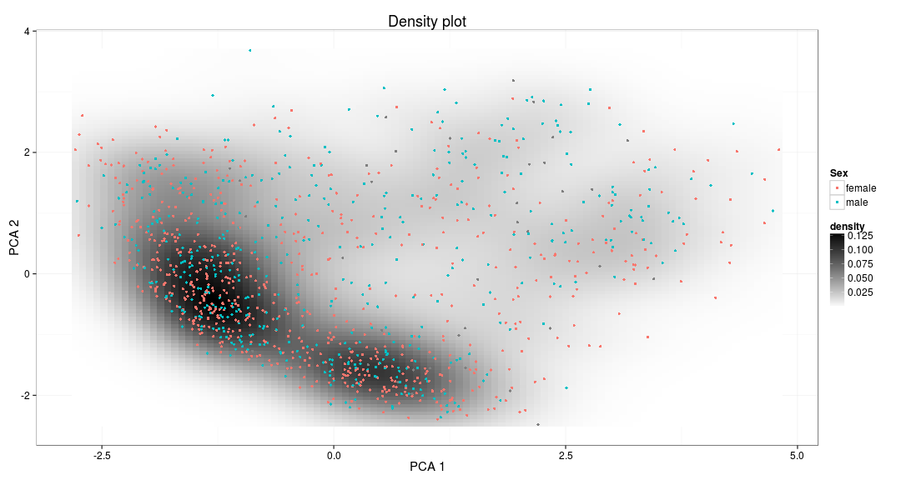
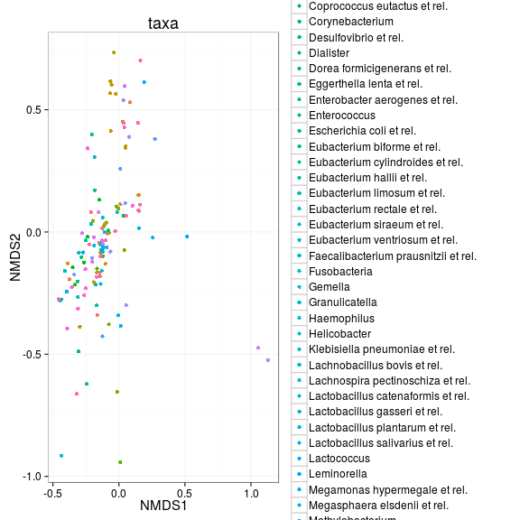
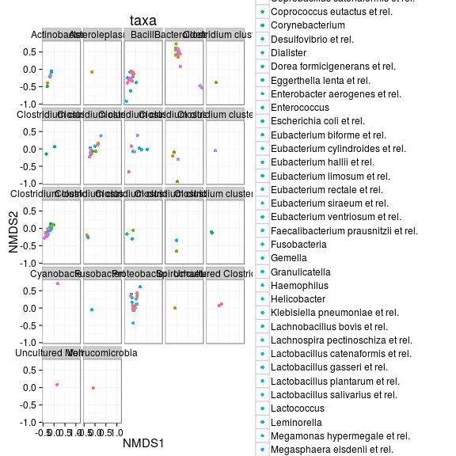
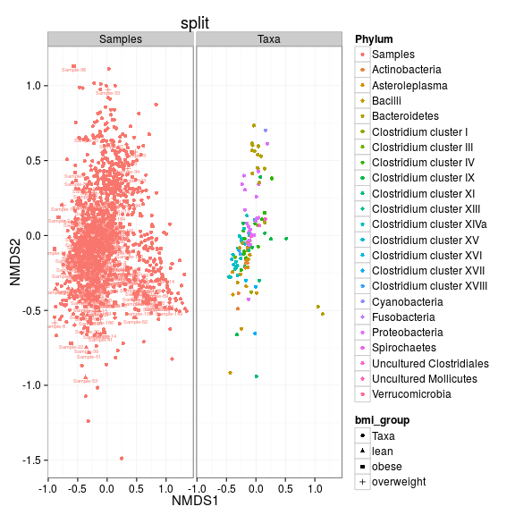

## Ordination examples

Here some examples with HITChip data. See also [phyloseq ordination tutorial](joey711.github.io/phyloseq/plot_ordination-examples.html).


### Principal component analysis (PCA)


```r
library(microbiome)

# Get some HITChip data in phyloseq format
pseq <- download_microbiome("atlas1006")

# Convert signal to relative abundances
pseq <- transform_sample_counts(pseq, function (x) {x/sum(x)})

# Pick the OTU data
# (note the zero point has been moved to the detection threshold;
#  typically signal 1.8 at HITChip log10 scale)
otu <- otu_table(pseq)@.Data

# Pick OTUs that are present with >1 percent relative abundance 
# in at least 10 percent of the samples
pseq2 <- filter_taxa(pseq, function(x) sum(x > .01) > (0.1*nsamples(pseq)), TRUE)

# Project data on 2D display with PCA (visualize subjects based on 20 random features)
set.seed(423542)
x <- t(otu_table(pseq2)@.Data)
proj <- project.data(log10(x), type = "PCA") # MDS.classical etc.

# Visualize; show gender with colors
p <- densityplot(proj, col = sample_data(pseq2)$gender, legend = T)
print(p)
```

 

```r
# Visualize with low/high Prevotella
# This shows that Prevotella (color) has ecosystem-level impact on microbiota composition
prevotella.abundance  <- log10(x[, "Prevotella melaninogenica et rel."]) 
p <- densityplot(proj, col = prevotella.abundance, legend = T)
print(p)
```

 


PCA with ggplot2 - the above example gives a shortcut for the following:


```r
# Arrange projected data onto a data frame
m <- sample_data(pseq)
coms <- intersect(rownames(proj), rownames(m))
df <- as.data.frame(cbind(proj[coms,], m[coms,]))
names(df) <- c("x", "y", colnames(m))

# Construct the figure with ggplot2
library(ggplot2)
theme_set(theme_bw(15))
p <- ggplot(df) 

# Add densities
p <- p + stat_density2d(aes(x = x, y = y, fill=..density..), geom="raster", stat_params = list(contour = F), geom_params = list()) 
p <- p + scale_fill_gradient(low="white", high="black") 

# Add points
p <- p + geom_point(aes(x = x, y = y, color = sample_data(pseq2)$gender), size = 1.5) 

# Add labels
p <- p + xlab("PCA 1") + ylab("PCA 2") + ggtitle("Density plot")
p <- p + scale_colour_discrete(name = "Sex")

# Plot the figure
print(p)
```

 


Plot projection with sample names:


```r
ggplot(aes(x = Comp.1, y = Comp.2, label = rownames(proj)), data = proj) + geom_text()
```

 

## Phyloseq projections


```r
# Ordinate the taxa in NMDS plot with Bray-Curtis distances
pseq.ord <- ordinate(pseq, "NMDS", "bray")
```

```
## Run 0 stress 0.2012454 
## Run 1 stress 0.2238389 
## Run 2 stress 0.4205247 
## Run 3 stress 0.2108665 
## Run 4 stress 0.2136321 
## Run 5 stress 0.2119149 
## Run 6 stress 0.2184618 
## Run 7 stress 0.2180316 
## Run 8 stress 0.219912 
## Run 9 stress 0.2169994 
## Run 10 stress 0.2125731 
## Run 11 stress 0.4205289 
## Run 12 stress 0.2146644 
## Run 13 stress 0.220788 
## Run 14 stress 0.2175296 
## Run 15 stress 0.2094855 
## Run 16 stress 0.2202568 
## Run 17 stress 0.2077945 
## Run 18 stress 0.2173499 
## Run 19 stress 0.2177579 
## Run 20 stress 0.217631
```

```r
p <- plot_ordination(pseq, pseq.ord, type = "taxa", color = "Genus", title = "taxa")
print(p)
```

 

```r
# Group the plots by Phylum
p <- p + facet_wrap(~Phylum, 5)
print(p)
```

 

### Ordination biplot


```r
# Example data
pseq <- download_microbiome("dietswap")

# Just include the top Phyla
phylum.sum <- tapply(taxa_sums(pseq), tax_table(pseq)[, "Phylum"], sum, na.rm = TRUE)
top5phyla <- names(sort(phylum.sum, TRUE))[1:5]
pseq2 <- prune_taxa((tax_table(pseq)[, "Phylum"] %in% top5phyla), pseq)
pseq2.ord <- prune_taxa((tax_table(pseq.ord)[, "Phylum"] %in% top5phyla), pseq)
```

```
## Error in prune_taxa((tax_table(pseq.ord)[, "Phylum"] %in% top5phyla), : error in evaluating the argument 'taxa' in selecting a method for function 'prune_taxa': Error in access(object, "tax_table", errorIfNULL) : 
##   tax_table slot is empty.
```

```r
p <- plot_ordination(pseq2, pseq.ord2, type = "biplot", color = "bmi_group", shape = "Phylum", 
    title = "biplot")
```

```
## Warning in scores(ordination, choices = axes, display = "species", physeq =
## physeq): restarting interrupted promise evaluation
```

```
## Warning in plot_ordination(pseq2, pseq.ord2, type = "biplot", color = "bmi_group", : Could not obtain coordinates from the provided `ordination`. 
## Please check your ordination method, and whether it is supported by `scores` or listed by phyloseq-package.
```

```r
# Some stuff to modify the automatic shape scale
pseq.shape.names <- get_taxa_unique(pseq, "Phylum")
pseq.shape <- 15:(15 + length(pseq.shape.names) - 1)
names(pseq.shape) <- pseq.shape.names
pseq.shape["samples"] <- 16
p + scale_shape_manual(values = pseq.shape)
```

```
## Error in p + scale_shape_manual(values = pseq.shape): non-numeric argument to binary operator
```


```r
p4 <- plot_ordination(pseq, pseq.ord, type = "split", color = "Phylum", shape = "bmi_group", 
    label = "sample", title = "split")
p4
```

 

```r
gg_color_hue <- function(n) {
    hues = seq(15, 375, length = n + 1)
    hcl(h = hues, l = 65, c = 100)[1:n]
}
color.names <- levels(p4$data$Phylum)
p4cols <- gg_color_hue(length(color.names))
names(p4cols) <- color.names
p4cols["samples"] <- "black"
p4 + scale_color_manual(values = p4cols)
```

 

```r
# Supported ordination methods 
# TODO: get rid of plyr::llply
skip <- T
if (!skip)  {
dist <- "bray"
ord_meths = c("DCA", "CCA", "RDA", "DPCoA", "NMDS", "MDS", "PCoA")
plist <- llply(as.list(ord_meths), function(i, physeq, dist) {
    ordi = ordinate(physeq, method = i, distance = dist)
    plot_ordination(physeq, ordi, "samples", color = "bmi_group")
}, physeq, dist)
names(plist) <- ord_meths
pdataframe = ldply(plist, function(x) {
    df = x$data[, 1:2]
    colnames(df) = c("Axis_1", "Axis_2")
    return(cbind(df, x$data))
})
names(pdataframe)[1] = "method"
p = ggplot(pdataframe, aes(Axis_1, Axis_2, color = SampleType, shape = human, 
    fill = SampleType))
p = p + geom_point(size = 4) + geom_polygon()
p = p + facet_wrap(~method, scales = "free")
p = p + scale_fill_brewer(type = "qual", palette = "Set1")
p = p + scale_colour_brewer(type = "qual", palette = "Set1")
p
}
```


### Further ordination examples


```r
library(microbiome)
data.dietswap <- download_microbiome("dietswap")

plot_ordination(physeq, ordinate(physeq, "MDS"), color = "group") + geom_point(size = 5)
```

```
## Error in inherits(physeq, "phyloseq"): object 'physeq' not found
```

```r
nmds <- ordinate(physeq, "NMDS", "bray")
```

```
## Error in inherits(physeq, "formula"): object 'physeq' not found
```

```r
require("ggplot2")
p2 <- plot_ordination(physeq, ordinate(physeq, "CCA"), type = "samples", color = "gender")
```

```
## Error in inherits(physeq, "phyloseq"): object 'physeq' not found
```

```r
p2 + geom_point(size = 5) + geom_polygon(aes(fill = gender))
```

```
## Error in eval(expr, envir, enclos): object 'p2' not found
```

```r
plot_ordination(physeq, ordinate(physeq, "CCA"), type = "taxa", color = "Phylum") + 
    geom_point(size = 4)
```

```
## Error in inherits(physeq, "phyloseq"): object 'physeq' not found
```

```r
plot_ordination(physeq, ordinate(physeq, "CCA"), type = "split", color = "gender")
```

```
## Error in inherits(physeq, "phyloseq"): object 'physeq' not found
```

```r
plot_ordination(physeq, ordinate(physeq, "CCA"), type = "biplot", shape = "Phylum")
```

```
## Error in inherits(physeq, "phyloseq"): object 'physeq' not found
```

```r
plot_ordination(physeq, ordinate(physeq, "CCA"), type = "split", color = "gender", 
    shape = "Phylum", label = "gender")
```

```
## Error in inherits(physeq, "phyloseq"): object 'physeq' not found
```


## Unifrac with PCoA


For Unifrac with PCoA, see [phyloseq tutorial](http://joey711.github.io/phyloseq/plot_ordination-examples.html). 


