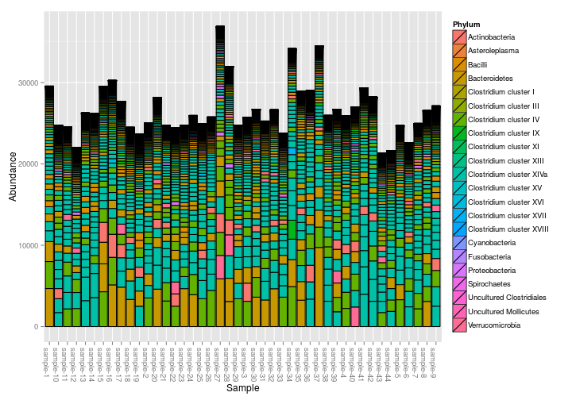
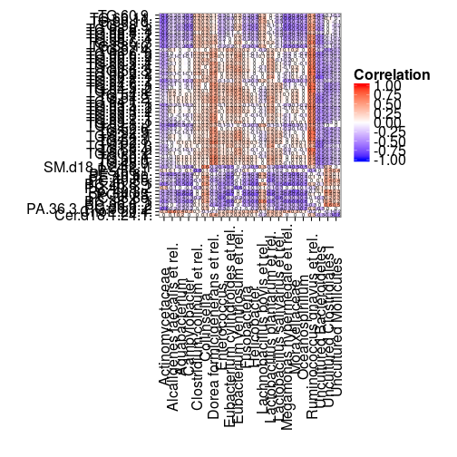
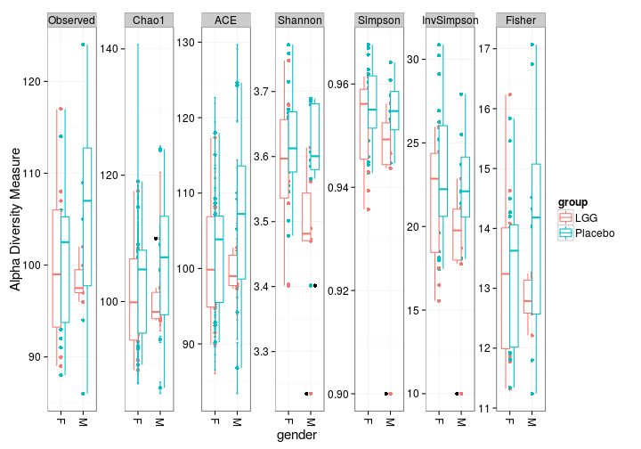
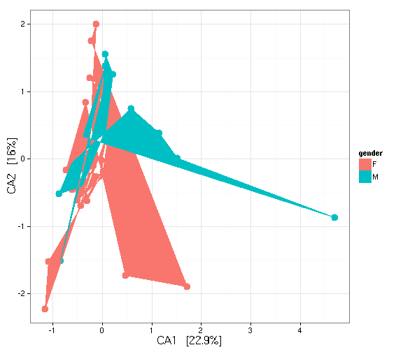
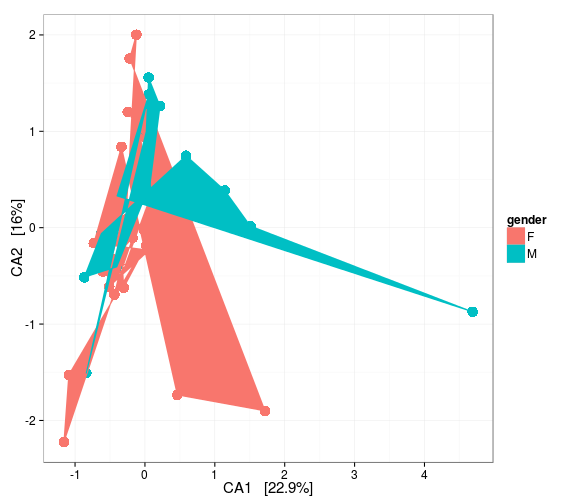

# HITChip data analysis in phyloseq format

The [phyloseq](https://github.com/joey711/phyloseq) is an external high-quality R package that provides additional tools for microbiome data analysis. These examples show how to convert HITChip data into phyloseq format and perform some standard analyses. For more info on phyloseq tools, see [phyloseq demo page](http://joey711.github.io/phyloseq-demo/).


## Example data

Loading example data (L2 data and metadata; you can replace these with your own data). Make sure that the L2 datamatrix is in absolute (not log10) scale.


```r
library(microbiome)
data(peerj32)
data <- peerj32$microbes # Samples x L2 groups; L2 data matrix; ABSOLUTE scale, not log10
meta <- peerj32$meta # Samples x features metadata
```

## Converting HITChip L2 data into [phyloseq](https://github.com/joey711/phyloseq) format


```r
library("phyloseq")
physeq <- hitchip2physeq(data, meta)
```

```
## Reading /home/antagomir/R/x86_64-unknown-linux-gnu-library/3.2/microbiome/extdata/phylogeny.full.tab
```

## Barplots


```r
p <- plot_bar(physeq, fill = "Phylum")
```

```
## Error in .Method(..., na.last = na.last, decreasing = decreasing): argument 1 is not a vector
```

```r
print(p)
```

 


## Heatmaps

[Heatmaps](http://joey711.github.io/phyloseq/plot_heatmap-examples) and [Neatmaps](http://www.biomedcentral.com/1471-2105/11/45)


```r
library(scales)
library(vegan)
plot_heatmap(physeq, taxa.label = "Phylum")
```

```
## [1] "test"
```

```
## Error in .Method(..., na.last = na.last, decreasing = decreasing): argument 1 is not a vector
```

```r
physeq.log <- physeq
trans <- as.matrix(t(scale(t(log10(1 + physeq.log@otu_table)))))
otu_table(physeq.log) <- otu_table(trans, taxa_are_rows=taxa_are_rows(physeq))
plot_heatmap(physeq.log, method = "NMDS", distance = "jaccard", low="blue", high="red")
```

```
## [1] "test"
```

```
## Error in .Method(..., na.last = na.last, decreasing = decreasing): argument 1 is not a vector
```

```r
#log transform sample counts
physeq.log <- transform_sample_counts(physeq, function(x) log10(x+1))
#calculate ordination of log transformed sample counts
physeq.log.ord <- ordinate(physeq.log, "NMDS")
```

```
## Run 0 stress 0.1948817 
## Run 1 stress 0.2058787 
## Run 2 stress 0.2044095 
## Run 3 stress 0.2116521 
## Run 4 stress 0.2014883 
## Run 5 stress 0.2014858 
## Run 6 stress 0.1991613 
## Run 7 stress 0.2179107 
## Run 8 stress 0.2022996 
## Run 9 stress 0.1948817 
## ... procrustes: rmse 3.217346e-05  max resid 9.502056e-05 
## *** Solution reached
```

```r
#split plot with log trandormed sample counts
p <- plot_ordination(physeq.log, physeq.log.ord, type = "split")
p
```

 

## Richness


```r
library(ggplot2)
plot_richness(physeq, x = "gender", color = "group") + geom_boxplot()
```

 

## Top OTU plot


```r
TopNOTUs <- names(sort(taxa_sums(physeq), TRUE)[1:3])
tops <- prune_taxa(TopNOTUs, physeq)
plot_bar(tops, "group", fill = "gender", facet_grid = ~Genus)
```

```
## Error in .Method(..., na.last = na.last, decreasing = decreasing): argument 1 is not a vector
```

## Ordination


```r
plot_ordination(physeq, ordinate(physeq, "MDS"), color = "group") + geom_point(size = 5)
```

```
## Error in plot_ordination(physeq, ordinate(physeq, "MDS"), color = "group") + : non-numeric argument to binary operator
```

```r
nmds <- ordinate(physeq, "NMDS", "bray")
```

```
## Square root transformation
## Wisconsin double standardization
## Run 0 stress 0.1842158 
## Run 1 stress 0.1842158 
## ... procrustes: rmse 2.780596e-05  max resid 7.934335e-05 
## *** Solution reached
```

```r
require("ggplot2")
p2 <- plot_ordination(physeq, ordinate(physeq, "CCA"), type = "samples", color = "gender")
p2 + geom_point(size = 5) + geom_polygon(aes(fill = gender))
```

 

```r
plot_ordination(physeq, ordinate(physeq, "CCA"), type = "taxa", color = "Phylum") + 
    geom_point(size = 4)
```

 

```r
plot_ordination(physeq, ordinate(physeq, "CCA"), type = "split", color = "gender")
```

```
## Error in rp.joint.fill(DF, color, "Taxa"): could not find function "is.discrete"
```

```r
plot_ordination(physeq, ordinate(physeq, "CCA"), type = "biplot", shape = "Phylum")
```

```
## Error in rp.joint.fill(DF, shape, "Samples"): could not find function "is.discrete"
```

```r
plot_ordination(physeq, ordinate(physeq, "CCA"), type = "split", color = "gender", 
    shape = "Phylum", label = "gender")
```

```
## Error in rp.joint.fill(DF, shape, "Samples"): could not find function "is.discrete"
```

## Filtering and pruning


```r
f1 <- filterfun_sample(topp(0.1))
wh1 <- genefilter_sample(physeq, f1, A = round(0.5 * nsamples(physeq)))
ex2 <- prune_taxa(wh1, physeq)
r <- transform_sample_counts(physeq, function(x) x/sum(x))
f <- filter_taxa(r, function(x) var(x) > 1e-05, TRUE)
```

## Networks

[Networks](http://joey711.github.io/phyloseq/plot_network-examples)


```r
plot_net(physeq, maxdist = 0.45, point_label = "group")
```

```
## Error in plot_net(physeq, maxdist = 0.45, point_label = "group"): object 'layout.auto' not found
```

```r
ig <- make_network(physeq, max.dist = 0.45)
plot_network(ig, physeq, color = "gender", shape = "group", line_weight = 0.4, label = NULL)
```

```
## Error in plot_network(ig, physeq, color = "gender", shape = "group", line_weight = 0.4, : could not find function "vcount"
```


For more, see [phyloseq demo page](http://joey711.github.io/phyloseq-demo/phyloseq-demo.html)


```r
#ntaxa(physeq)
#rank_names(physeq)
#sample_names(physeq)
#taxa_names(physeq)
#sample_variables(physeq)
#merge_phyloseq
#get_variable(physeq, sample_variables(physeq)[5])[1:10]
#get_taxa_unique(physeq, "Phylum")
#sample_sums(physeq)
#taxa_sums(physeq)
#get_taxa(physeq, sample_names(physeq)[5])
#get_sample(physeq, taxa_names(physeq)[5])
#plot_bar(ent10, "Genus", fill = "Genus", facet_grid = SeqTech ~ Enterotype)
#GP <- prune_taxa(taxa_sums(physeq) > 0, physeq)
#sample_data(GP)$human = ...
#eso <- rarefy_even_depth(physeq)
# UniFrac(physeq) # This requires tree that we do not have
#GP.chl = subset_taxa(GlobalPatterns, Phylum == "Chlamydiae")
```
